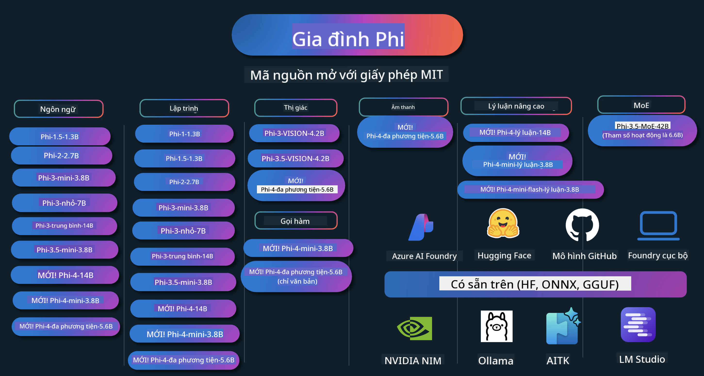

<!--
CO_OP_TRANSLATOR_METADATA:
{
  "original_hash": "5c07bb4c3c89a36c9be332a065a9a33c",
  "translation_date": "2025-07-16T15:21:42+00:00",
  "source_file": "README.md",
  "language_code": "vi"
}
-->
# Phi Cookbook: Ví dụ Thực hành với các Mô hình Phi của Microsoft

  

  
  
  

  
  

Phi là một chuỗi các mô hình AI mã nguồn mở được phát triển bởi Microsoft.

Hiện tại, Phi là mô hình ngôn ngữ nhỏ (SLM) mạnh mẽ và tiết kiệm chi phí nhất, với các điểm chuẩn rất tốt trong đa ngôn ngữ, suy luận, tạo văn bản/trò chuyện, lập trình, hình ảnh, âm thanh và nhiều kịch bản khác.

Bạn có thể triển khai Phi trên đám mây hoặc thiết bị biên, và dễ dàng xây dựng các ứng dụng AI sinh tạo với nguồn lực tính toán hạn chế.

Thực hiện theo các bước sau để bắt đầu sử dụng tài nguyên này:  
1. **Fork Repository**: Nhấn   
2. **Clone Repository**: `git clone https://github.com/microsoft/PhiCookBook.git`  
3. [**Tham gia cộng đồng Microsoft AI Discord để gặp gỡ các chuyên gia và nhà phát triển khác**](https://discord.com/invite/ByRwuEEgH4?WT.mc_id=aiml-137032-kinfeylo)

### 🌐 Hỗ trợ Đa Ngôn ngữ

#### Hỗ trợ qua GitHub Action (Tự động & Luôn Cập nhật)

[Tiếng Pháp](../fr/README.md) | [Tiếng Tây Ban Nha](../es/README.md) | [Tiếng Đức](../de/README.md) | [Tiếng Nga](../ru/README.md) | [Tiếng Ả Rập](../ar/README.md) | [Tiếng Ba Tư (Farsi)](../fa/README.md) | [Tiếng Urdu](../ur/README.md) | [Tiếng Trung (Giản thể)](../zh/README.md) | [Tiếng Trung (Phồn thể, Macau)](../mo/README.md) | [Tiếng Trung (Phồn thể, Hồng Kông)](../hk/README.md) | [Tiếng Trung (Phồn thể, Đài Loan)](../tw/README.md) | [Tiếng Nhật](../ja/README.md) | [Tiếng Hàn](../ko/README.md) | [Tiếng Hindi](../hi/README.md)  
[Tiếng Bengal](../bn/README.md) | [Tiếng Marathi](../mr/README.md) | [Tiếng Nepal](../ne/README.md) | [Tiếng Punjabi (Gurmukhi)](../pa/README.md) | [Tiếng Bồ Đào Nha (Bồ Đào Nha)](../pt/README.md) | [Tiếng Bồ Đào Nha (Brazil)](../br/README.md) | [Tiếng Ý](../it/README.md) | [Tiếng Ba Lan](../pl/README.md) | [Tiếng Thổ Nhĩ Kỳ](../tr/README.md) | [Tiếng Hy Lạp](../el/README.md) | [Tiếng Thái](../th/README.md) | [Tiếng Thụy Điển](../sv/README.md) | [Tiếng Đan Mạch](../da/README.md) | [Tiếng Na Uy](../no/README.md) | [Tiếng Phần Lan](../fi/README.md) | [Tiếng Hà Lan](../nl/README.md) | [Tiếng Do Thái](../he/README.md) | [Tiếng Việt](./README.md) | [Tiếng Indonesia](../id/README.md) | [Tiếng Mã Lai](../ms/README.md) | [Tiếng Tagalog (Philippines)](../tl/README.md) | [Tiếng Swahili](../sw/README.md) | [Tiếng Hungary](../hu/README.md) | [Tiếng Séc](../cs/README.md) | [Tiếng Slovakia](../sk/README.md) | [Tiếng Romania](../ro/README.md) | [Tiếng Bulgaria](../bg/README.md) | [Tiếng Serbia (Chữ Cyrillic)](../sr/README.md) | [Tiếng Croatia](../hr/README.md) | [Tiếng Slovenia](../sl/README.md)

## Mục Lục

- Giới thiệu  
  - [Chào mừng đến với Gia đình Phi](./md/01.Introduction/01/01.PhiFamily.md)  
  - [Thiết lập môi trường của bạn](./md/01.Introduction/01/01.EnvironmentSetup.md)  
  - [Hiểu về các Công nghệ Chính](./md/01.Introduction/01/01.Understandingtech.md)  
  - [An toàn AI cho các Mô hình Phi](./md/01.Introduction/01/01.AISafety.md)  
  - [Hỗ trợ phần cứng Phi](./md/01.Introduction/01/01.Hardwaresupport.md)  
  - [Các Mô hình Phi & Khả năng sẵn có trên các nền tảng](./md/01.Introduction/01/01.Edgeandcloud.md)  
  - [Sử dụng Guidance-ai và Phi](./md/01.Introduction/01/01.Guidance.md)  
  - [Mô hình trên GitHub Marketplace](https://github.com/marketplace/models)  
  - [Danh mục Mô hình Azure AI](https://ai.azure.com)

- Triển khai Phi trong các môi trường khác nhau  
    -  [Hugging face](./md/01.Introduction/02/01.HF.md)  
    -  [Mô hình GitHub](./md/01.Introduction/02/02.GitHubModel.md)  
    -  [Danh mục Mô hình Azure AI Foundry](./md/01.Introduction/02/03.AzureAIFoundry.md)  
    -  [Ollama](./md/01.Introduction/02/04.Ollama.md)  
    -  [Bộ công cụ AI VSCode (AITK)](./md/01.Introduction/02/05.AITK.md)  
    -  [NVIDIA NIM](./md/01.Introduction/02/06.NVIDIA.md)  
    -  [Foundry Local](./md/01.Introduction/02/07.FoundryLocal.md)

- Triển khai Phi Family  
    - [Triển khai Phi trên iOS](./md/01.Introduction/03/iOS_Inference.md)  
    - [Triển khai Phi trên Android](./md/01.Introduction/03/Android_Inference.md)  
    - [Triển khai Phi trên Jetson](./md/01.Introduction/03/Jetson_Inference.md)  
    - [Triển khai Phi trên AI PC](./md/01.Introduction/03/AIPC_Inference.md)  
    - [Triển khai Phi với Apple MLX Framework](./md/01.Introduction/03/MLX_Inference.md)  
    - [Triển khai Phi trên Máy chủ cục bộ](./md/01.Introduction/03/Local_Server_Inference.md)  
    - [Triển khai Phi trên Máy chủ từ xa bằng AI Toolkit](./md/01.Introduction/03/Remote_Interence.md)  
    - [Triển khai Phi với Rust](./md/01.Introduction/03/Rust_Inference.md)  
    - [Triển khai Phi--Vision tại địa phương](./md/01.Introduction/03/Vision_Inference.md)  
    - [Triển khai Phi với Kaito AKS, Azure Containers (hỗ trợ chính thức)](./md/01.Introduction/03/Kaito_Inference.md)  
-  [Lượng tử hóa Phi Family](./md/01.Introduction/04/QuantifyingPhi.md)  
    - [Lượng tử hóa Phi-3.5 / 4 bằng llama.cpp](./md/01.Introduction/04/UsingLlamacppQuantifyingPhi.md)  
    - [Lượng tử hóa Phi-3.5 / 4 bằng tiện ích mở rộng Generative AI cho onnxruntime](./md/01.Introduction/04/UsingORTGenAIQuantifyingPhi.md)  
    - [Lượng tử hóa Phi-3.5 / 4 bằng Intel OpenVINO](./md/01.Introduction/04/UsingIntelOpenVINOQuantifyingPhi.md)  
    - [Lượng tử hóa Phi-3.5 / 4 bằng Apple MLX Framework](./md/01.Introduction/04/UsingAppleMLXQuantifyingPhi.md)

- Đánh giá Phi  
    - [AI có trách nhiệm](./md/01.Introduction/05/ResponsibleAI.md)  
    - [Azure AI Foundry cho Đánh giá](./md/01.Introduction/05/AIFoundry.md)  
    - [Sử dụng Promptflow cho Đánh giá](./md/01.Introduction/05/Promptflow.md)

- RAG với Azure AI Search  
    - [Cách sử dụng Phi-4-mini và Phi-4-multimodal (RAG) với Azure AI Search](https://github.com/microsoft/PhiCookBook/blob/main/code/06.E2E/E2E_Phi-4-RAG-Azure-AI-Search.ipynb)

- Mẫu phát triển ứng dụng Phi  
  - Ứng dụng Văn bản & Trò chuyện  
    - Mẫu Phi-4 🆕  
      - [📓] [Trò chuyện với mô hình Phi-4-mini ONNX](./md/02.Application/01.TextAndChat/Phi4/ChatWithPhi4ONNX/README.md)  
      - [Trò chuyện với mô hình ONNX Phi-4 cục bộ trên .NET](../../md/04.HOL/dotnet/src/LabsPhi4-Chat-01OnnxRuntime)  
      - [Ứng dụng Console .NET trò chuyện với Phi-4 ONNX sử dụng Semantic Kernel](../../md/04.HOL/dotnet/src/LabsPhi4-Chat-02SK)  
    - Mẫu Phi-3 / 3.5  
      - [Chatbot cục bộ trên trình duyệt sử dụng Phi3, ONNX Runtime Web và WebGPU](https://github.com/microsoft/onnxruntime-inference-examples/tree/main/js/chat)  
      - [Chat OpenVino](./md/02.Application/01.TextAndChat/Phi3/E2E_OpenVino_Chat.md)  
      - [Mô hình đa dạng - Tương tác Phi-3-mini và OpenAI Whisper](./md/02.Application/01.TextAndChat/Phi3/E2E_Phi-3-mini_with_whisper.md)  
      - [MLFlow - Xây dựng wrapper và sử dụng Phi-3 với MLFlow](./md//02.Application/01.TextAndChat/Phi3/E2E_Phi-3-MLflow.md)  
      - [Tối ưu hóa mô hình - Cách tối ưu hóa mô hình Phi-3-min cho ONNX Runtime Web với Olive](https://github.com/microsoft/Olive/tree/main/examples/phi3)  
      - [Ứng dụng WinUI3 với Phi-3 mini-4k-instruct-onnx](https://github.com/microsoft/Phi3-Chat-WinUI3-Sample/)  
      - [Mẫu ứng dụng ghi chú đa mô hình WinUI3 được hỗ trợ bởi AI](https://github.com/microsoft/ai-powered-notes-winui3-sample)
- [Tinh chỉnh và tích hợp các mô hình Phi-3 tùy chỉnh với Prompt flow](./md/02.Application/01.TextAndChat/Phi3/E2E_Phi-3-FineTuning_PromptFlow_Integration.md)
- [Tinh chỉnh và tích hợp các mô hình Phi-3 tùy chỉnh với Prompt flow trong Azure AI Foundry](./md/02.Application/01.TextAndChat/Phi3/E2E_Phi-3-FineTuning_PromptFlow_Integration_AIFoundry.md)
- [Đánh giá mô hình Phi-3 / Phi-3.5 đã được tinh chỉnh trong Azure AI Foundry với trọng tâm là các nguyên tắc AI có trách nhiệm của Microsoft](./md/02.Application/01.TextAndChat/Phi3/E2E_Phi-3-Evaluation_AIFoundry.md)
- [📓] [Mẫu dự đoán ngôn ngữ Phi-3.5-mini-instruct (Tiếng Trung/Anh)](../../md/02.Application/01.TextAndChat/Phi3/phi3-instruct-demo.ipynb)
- [Phi-3.5-Instruct WebGPU RAG Chatbot](./md/02.Application/01.TextAndChat/Phi3/WebGPUWithPhi35Readme.md)
- [Sử dụng GPU Windows để tạo giải pháp Prompt flow với Phi-3.5-Instruct ONNX](./md/02.Application/01.TextAndChat/Phi3/UsingPromptFlowWithONNX.md)
- [Sử dụng Microsoft Phi-3.5 tflite để tạo ứng dụng Android](./md/02.Application/01.TextAndChat/Phi3/UsingPhi35TFLiteCreateAndroidApp.md)
- [Ví dụ Q&A .NET sử dụng mô hình ONNX Phi-3 cục bộ với Microsoft.ML.OnnxRuntime](../../md/04.HOL/dotnet/src/LabsPhi301)
- [Ứng dụng chat console .NET với Semantic Kernel và Phi-3](../../md/04.HOL/dotnet/src/LabsPhi302)

- Mẫu mã SDK Azure AI Inference
  - Mẫu Phi-4 🆕
    - [📓] [Tạo mã dự án sử dụng Phi-4-multimodal](./md/02.Application/02.Code/Phi4/GenProjectCode/README.md)
  - Mẫu Phi-3 / 3.5
    - [Xây dựng Visual Studio Code GitHub Copilot Chat của riêng bạn với Microsoft Phi-3 Family](./md/02.Application/02.Code/Phi3/VSCodeExt/README.md)
    - [Tạo đại lý Chat Copilot Visual Studio Code của riêng bạn với Phi-3.5 bằng các mô hình GitHub](/md/02.Application/02.Code/Phi3/CreateVSCodeChatAgentWithGitHubModels.md)

- Mẫu Lý luận Nâng cao
  - Mẫu Phi-4 🆕
    - [📓] [Mẫu Phi-4-mini-reasoning hoặc Phi-4-reasoning](./md/02.Application/03.AdvancedReasoning/Phi4/AdvancedResoningPhi4mini/README.md)
    - [📓] [Tinh chỉnh Phi-4-mini-reasoning với Microsoft Olive](../../md/02.Application/03.AdvancedReasoning/Phi4/AdvancedResoningPhi4mini/olive_ft_phi_4_reasoning_with_medicaldata.ipynb)
    - [📓] [Tinh chỉnh Phi-4-mini-reasoning với Apple MLX](../../md/02.Application/03.AdvancedReasoning/Phi4/AdvancedResoningPhi4mini/mlx_ft_phi_4_reasoning_with_medicaldata.ipynb)
    - [📓] [Phi-4-mini-reasoning với các mô hình GitHub](../../md/02.Application/02.Code/Phi4r/github_models_inference.ipynb)
    - [📓] [Phi-4-mini-reasoning với các mô hình Azure AI Foundry](../../md/02.Application/02.Code/Phi4r/azure_models_inference.ipynb)
- Demo
    - [Demo Phi-4-mini được lưu trữ trên Hugging Face Spaces](https://huggingface.co/spaces/microsoft/phi-4-mini?WT.mc_id=aiml-137032-kinfeylo)
    - [Demo Phi-4-multimodal được lưu trữ trên Hugging Face Spaces](https://huggingface.co/spaces/microsoft/phi-4-multimodal?WT.mc_id=aiml-137032-kinfeylo)
- Mẫu Thị giác
  - Mẫu Phi-4 🆕
    - [📓] [Sử dụng Phi-4-multimodal để đọc hình ảnh và tạo mã](./md/02.Application/04.Vision/Phi4/CreateFrontend/README.md)
  - Mẫu Phi-3 / 3.5
    - [📓][Phi-3-vision - Chuyển đổi văn bản từ hình ảnh sang văn bản](../../md/02.Application/04.Vision/Phi3/E2E_Phi-3-vision-image-text-to-text-online-endpoint.ipynb)
    - [Phi-3-vision-ONNX](https://onnxruntime.ai/docs/genai/tutorials/phi3-v.html)
    - [📓][Phi-3-vision CLIP Embedding](../../md/02.Application/04.Vision/Phi3/E2E_Phi-3-vision-image-text-to-text-online-endpoint.ipynb)
    - [DEMO: Phi-3 Recycling](https://github.com/jennifermarsman/PhiRecycling/)
    - [Phi-3-vision - Trợ lý ngôn ngữ thị giác - với Phi3-Vision và OpenVINO](https://docs.openvino.ai/nightly/notebooks/phi-3-vision-with-output.html)
    - [Phi-3 Vision Nvidia NIM](./md/02.Application/04.Vision/Phi3/E2E_Nvidia_NIM_Vision.md)
    - [Phi-3 Vision OpenVino](./md/02.Application/04.Vision/Phi3/E2E_OpenVino_Phi3Vision.md)
    - [📓][Phi-3.5 Vision mẫu đa khung hình hoặc đa hình ảnh](../../md/02.Application/04.Vision/Phi3/phi3-vision-demo.ipynb)
    - [Phi-3 Vision mô hình ONNX cục bộ sử dụng Microsoft.ML.OnnxRuntime .NET](../../md/04.HOL/dotnet/src/LabsPhi303)
    - [Mô hình ONNX cục bộ Phi-3 Vision dựa trên menu sử dụng Microsoft.ML.OnnxRuntime .NET](../../md/04.HOL/dotnet/src/LabsPhi304)

- Mẫu Toán học
  - Mẫu Phi-4-Mini-Flash-Reasoning-Instruct 🆕 [Demo Toán học với Phi-4-Mini-Flash-Reasoning-Instruct](../../md/02.Application/09.Math/MathDemo.ipynb)

- Mẫu Âm thanh
  - Mẫu Phi-4 🆕
    - [📓] [Trích xuất bản ghi âm thanh sử dụng Phi-4-multimodal](./md/02.Application/05.Audio/Phi4/Transciption/README.md)
    - [📓] [Mẫu âm thanh Phi-4-multimodal](../../md/02.Application/05.Audio/Phi4/Siri/demo.ipynb)
    - [📓] [Mẫu dịch giọng nói Phi-4-multimodal](../../md/02.Application/05.Audio/Phi4/Translate/demo.ipynb)
    - [Ứng dụng console .NET sử dụng Phi-4-multimodal Audio để phân tích file âm thanh và tạo bản ghi](../../md/04.HOL/dotnet/src/LabsPhi4-MultiModal-02Audio)

- Mẫu MOE
  - Mẫu Phi-3 / 3.5
    - [📓] [Mẫu Phi-3.5 Mixture of Experts Models (MoEs) trên mạng xã hội](../../md/02.Application/06.MoE/Phi3/phi3_moe_demo.ipynb)
    - [📓] [Xây dựng pipeline Retrieval-Augmented Generation (RAG) với NVIDIA NIM Phi-3 MOE, Azure AI Search và LlamaIndex](../../md/02.Application/06.MoE/Phi3/azure-ai-search-nvidia-rag.ipynb)

- Mẫu Gọi Hàm
  - Mẫu Phi-4 🆕
    - [📓] [Sử dụng Gọi Hàm với Phi-4-mini](./md/02.Application/07.FunctionCalling/Phi4/FunctionCallingBasic/README.md)
    - [📓] [Sử dụng Gọi Hàm để tạo đa tác nhân với Phi-4-mini](../../md/02.Application/07.FunctionCalling/Phi4/Multiagents/Phi_4_mini_multiagent.ipynb)
    - [📓] [Sử dụng Gọi Hàm với Ollama](../../md/02.Application/07.FunctionCalling/Phi4/Ollama/ollama_functioncalling.ipynb)
    - [📓] [Sử dụng Gọi Hàm với ONNX](../../md/02.Application/07.FunctionCalling/Phi4/ONNX/onnx_parallel_functioncalling.ipynb)

- Mẫu Trộn Đa phương thức
  - Mẫu Phi-4 🆕
    - [📓] [Sử dụng Phi-4-multimodal như một nhà báo công nghệ](../../md/02.Application/08.Multimodel/Phi4/TechJournalist/phi_4_mm_audio_text_publish_news.ipynb)
    - [Ứng dụng console .NET sử dụng Phi-4-multimodal để phân tích hình ảnh](../../md/04.HOL/dotnet/src/LabsPhi4-MultiModal-01Images)

- Tinh chỉnh các mẫu Phi
  - [Các kịch bản tinh chỉnh](./md/03.FineTuning/FineTuning_Scenarios.md)
  - [Tinh chỉnh so với RAG](./md/03.FineTuning/FineTuning_vs_RAG.md)
  - [Tinh chỉnh để Phi-3 trở thành chuyên gia ngành](./md/03.FineTuning/LetPhi3gotoIndustriy.md)
  - [Tinh chỉnh Phi-3 với AI Toolkit cho VS Code](./md/03.FineTuning/Finetuning_VSCodeaitoolkit.md)
  - [Tinh chỉnh Phi-3 với Azure Machine Learning Service](./md/03.FineTuning/Introduce_AzureML.md)
  - [Tinh chỉnh Phi-3 với Lora](./md/03.FineTuning/FineTuning_Lora.md)
  - [Tinh chỉnh Phi-3 với QLora](./md/03.FineTuning/FineTuning_Qlora.md)
  - [Tinh chỉnh Phi-3 với Azure AI Foundry](./md/03.FineTuning/FineTuning_AIFoundry.md)
  - [Tinh chỉnh Phi-3 với Azure ML CLI/SDK](./md/03.FineTuning/FineTuning_MLSDK.md)
  - [Tinh chỉnh với Microsoft Olive](./md/03.FineTuning/FineTuning_MicrosoftOlive.md)
  - [Thực hành tinh chỉnh với Microsoft Olive](./md/03.FineTuning/olive-lab/readme.md)
  - [Tinh chỉnh Phi-3-vision với Weights and Bias](./md/03.FineTuning/FineTuning_Phi-3-visionWandB.md)
  - [Tinh chỉnh Phi-3 với Apple MLX Framework](./md/03.FineTuning/FineTuning_MLX.md)
  - [Tinh chỉnh Phi-3-vision (hỗ trợ chính thức)](./md/03.FineTuning/FineTuning_Vision.md)
  - [Tinh chỉnh Phi-3 với Kaito AKS, Azure Containers (hỗ trợ chính thức)](./md/03.FineTuning/FineTuning_Kaito.md)
  - [Tinh chỉnh Phi-3 và 3.5 Vision](https://github.com/2U1/Phi3-Vision-Finetune)

- Thực hành
  - [Khám phá các mô hình tiên tiến: LLMs, SLMs, phát triển cục bộ và hơn thế nữa](https://github.com/microsoft/aitour-exploring-cutting-edge-models)
  - [Khai phá tiềm năng NLP: Tinh chỉnh với Microsoft Olive](https://github.com/azure/Ignite_FineTuning_workshop)

- Các bài báo nghiên cứu học thuật và công bố
  - [Textbooks Are All You Need II: báo cáo kỹ thuật phi-1.5](https://arxiv.org/abs/2309.05463)
  - [Báo cáo kỹ thuật Phi-3: Mô hình ngôn ngữ có khả năng cao chạy cục bộ trên điện thoại của bạn](https://arxiv.org/abs/2404.14219)
  - [Báo cáo kỹ thuật Phi-4](https://arxiv.org/abs/2412.08905)
  - [Báo cáo kỹ thuật Phi-4-Mini: Mô hình ngôn ngữ đa phương thức nhỏ gọn nhưng mạnh mẽ qua Mixture-of-LoRAs](https://arxiv.org/abs/2503.01743)
  - [Tối ưu hóa các mô hình ngôn ngữ nhỏ cho Gọi Hàm trong xe](https://arxiv.org/abs/2501.02342)
  - [(WhyPHI) Tinh chỉnh PHI-3 cho trả lời câu hỏi trắc nghiệm: Phương pháp, kết quả và thách thức](https://arxiv.org/abs/2501.01588)
- [Phi-4-reasoning Technical Report](https://www.microsoft.com/en-us/research/wp-content/uploads/2025/04/phi_4_reasoning.pdf)
- [Phi-4-mini-reasoning Technical Report](https://huggingface.co/microsoft/Phi-4-mini-reasoning/blob/main/Phi-4-Mini-Reasoning.pdf)

## Sử dụng các mô hình Phi

### Phi trên Azure AI Foundry

Bạn có thể tìm hiểu cách sử dụng Microsoft Phi và cách xây dựng các giải pháp E2E trên các thiết bị phần cứng khác nhau của mình. Để trải nghiệm Phi trực tiếp, hãy bắt đầu bằng cách thử nghiệm các mô hình và tùy chỉnh Phi cho các kịch bản của bạn thông qua [Azure AI Foundry Azure AI Model Catalog](https://aka.ms/phi3-azure-ai). Bạn có thể tìm hiểu thêm tại Hướng dẫn bắt đầu với [Azure AI Foundry](/md/02.QuickStart/AzureAIFoundry_QuickStart.md)

**Playground**  
Mỗi mô hình đều có một playground riêng để thử nghiệm mô hình tại [Azure AI Playground](https://aka.ms/try-phi3).

### Phi trên các mô hình GitHub

Bạn có thể tìm hiểu cách sử dụng Microsoft Phi và cách xây dựng các giải pháp E2E trên các thiết bị phần cứng khác nhau của mình. Để trải nghiệm Phi trực tiếp, hãy bắt đầu bằng cách thử nghiệm mô hình và tùy chỉnh Phi cho các kịch bản của bạn thông qua [GitHub Model Catalog](https://github.com/marketplace/models?WT.mc_id=aiml-137032-kinfeylo). Bạn có thể tìm hiểu thêm tại Hướng dẫn bắt đầu với [GitHub Model Catalog](/md/02.QuickStart/GitHubModel_QuickStart.md)

**Playground**  
Mỗi mô hình đều có một [playground riêng để thử nghiệm mô hình](/md/02.QuickStart/GitHubModel_QuickStart.md).

### Phi trên Hugging Face

Bạn cũng có thể tìm thấy mô hình trên [Hugging Face](https://huggingface.co/microsoft)

**Playground**  
[Hugging Chat playground](https://huggingface.co/chat/models/microsoft/Phi-3-mini-4k-instruct)

## Trách nhiệm AI

Microsoft cam kết hỗ trợ khách hàng sử dụng các sản phẩm AI một cách có trách nhiệm, chia sẻ những bài học kinh nghiệm và xây dựng các mối quan hệ đối tác dựa trên sự tin tưởng thông qua các công cụ như Transparency Notes và Impact Assessments. Nhiều tài nguyên này có thể được tìm thấy tại [https://aka.ms/RAI](https://aka.ms/RAI).  
Phương pháp tiếp cận của Microsoft đối với AI có trách nhiệm dựa trên các nguyên tắc AI của chúng tôi về công bằng, độ tin cậy và an toàn, quyền riêng tư và bảo mật, tính bao trùm, minh bạch và trách nhiệm giải trình.

Các mô hình ngôn ngữ tự nhiên, hình ảnh và giọng nói quy mô lớn - như những mô hình được sử dụng trong ví dụ này - có thể có hành vi không công bằng, không đáng tin cậy hoặc gây xúc phạm, từ đó gây ra các tác hại. Vui lòng tham khảo [Azure OpenAI service Transparency note](https://learn.microsoft.com/legal/cognitive-services/openai/transparency-note?tabs=text) để được thông tin về các rủi ro và giới hạn.

Cách tiếp cận được khuyến nghị để giảm thiểu các rủi ro này là tích hợp một hệ thống an toàn trong kiến trúc của bạn có khả năng phát hiện và ngăn chặn hành vi gây hại. [Azure AI Content Safety](https://learn.microsoft.com/azure/ai-services/content-safety/overview) cung cấp một lớp bảo vệ độc lập, có thể phát hiện nội dung do người dùng và AI tạo ra có tính chất gây hại trong các ứng dụng và dịch vụ. Azure AI Content Safety bao gồm các API văn bản và hình ảnh cho phép bạn phát hiện các nội dung có hại. Trong Azure AI Foundry, dịch vụ Content Safety cho phép bạn xem, khám phá và thử nghiệm mã mẫu để phát hiện nội dung gây hại trên nhiều dạng thức khác nhau. Tài liệu [hướng dẫn nhanh sau đây](https://learn.microsoft.com/azure/ai-services/content-safety/quickstart-text?tabs=visual-studio%2Clinux&pivots=programming-language-rest) sẽ hướng dẫn bạn cách gửi yêu cầu đến dịch vụ.

Một khía cạnh khác cần lưu ý là hiệu suất tổng thể của ứng dụng. Với các ứng dụng đa mô thức và đa mô hình, chúng tôi xem hiệu suất là việc hệ thống hoạt động như bạn và người dùng mong đợi, bao gồm cả việc không tạo ra các kết quả gây hại. Việc đánh giá hiệu suất tổng thể của ứng dụng nên được thực hiện bằng cách sử dụng [các bộ đánh giá Hiệu suất và Chất lượng cũng như Rủi ro và An toàn](https://learn.microsoft.com/azure/ai-studio/concepts/evaluation-metrics-built-in). Bạn cũng có thể tạo và đánh giá bằng [các bộ đánh giá tùy chỉnh](https://learn.microsoft.com/azure/ai-studio/how-to/develop/evaluate-sdk#custom-evaluators).

Bạn có thể đánh giá ứng dụng AI của mình trong môi trường phát triển bằng cách sử dụng [Azure AI Evaluation SDK](https://microsoft.github.io/promptflow/index.html). Với một bộ dữ liệu kiểm thử hoặc mục tiêu cụ thể, các kết quả tạo ra của ứng dụng AI sinh tạo sẽ được đo lường định lượng bằng các bộ đánh giá tích hợp sẵn hoặc bộ đánh giá tùy chỉnh theo lựa chọn của bạn. Để bắt đầu với Azure AI Evaluation SDK và đánh giá hệ thống của bạn, bạn có thể theo dõi [hướng dẫn nhanh](https://learn.microsoft.com/azure/ai-studio/how-to/develop/flow-evaluate-sdk). Sau khi thực hiện một lần chạy đánh giá, bạn có thể [trực quan hóa kết quả trong Azure AI Foundry](https://learn.microsoft.com/azure/ai-studio/how-to/evaluate-flow-results).

## Nhãn hiệu

Dự án này có thể chứa các nhãn hiệu hoặc logo của các dự án, sản phẩm hoặc dịch vụ. Việc sử dụng nhãn hiệu hoặc logo của Microsoft phải tuân thủ và theo đúng [Hướng dẫn Nhãn hiệu & Thương hiệu của Microsoft](https://www.microsoft.com/legal/intellectualproperty/trademarks/usage/general).  
Việc sử dụng nhãn hiệu hoặc logo của Microsoft trong các phiên bản sửa đổi của dự án này không được gây nhầm lẫn hoặc ngụ ý Microsoft tài trợ. Mọi việc sử dụng nhãn hiệu hoặc logo của bên thứ ba đều phải tuân theo chính sách của bên thứ ba đó.

**Tuyên bố từ chối trách nhiệm**:  
Tài liệu này đã được dịch bằng dịch vụ dịch thuật AI [Co-op Translator](https://github.com/Azure/co-op-translator). Mặc dù chúng tôi cố gắng đảm bảo độ chính xác, xin lưu ý rằng các bản dịch tự động có thể chứa lỗi hoặc không chính xác. Tài liệu gốc bằng ngôn ngữ gốc của nó nên được coi là nguồn chính xác và đáng tin cậy. Đối với các thông tin quan trọng, nên sử dụng dịch vụ dịch thuật chuyên nghiệp do con người thực hiện. Chúng tôi không chịu trách nhiệm về bất kỳ sự hiểu lầm hoặc giải thích sai nào phát sinh từ việc sử dụng bản dịch này.