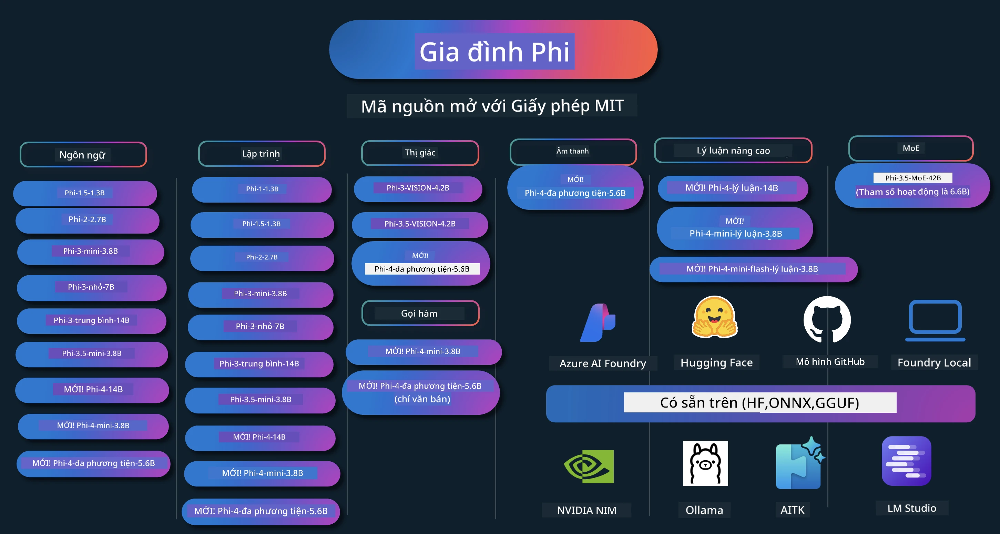

# Phi Cookbook: Ví dụ Thực hành với các Mô hình Phi của Microsoft

[](https://codespaces.new/microsoft/phicookbook)
[](https://vscode.dev/redirect?url=vscode://ms-vscode-remote.remote-containers/cloneInVolume?url=https://github.com/microsoft/phicookbook)

[](https://GitHub.com/microsoft/phicookbook/graphs/contributors/?WT.mc_id=aiml-137032-kinfeylo)
[](https://GitHub.com/microsoft/phicookbook/issues/?WT.mc_id=aiml-137032-kinfeylo)
[](https://GitHub.com/microsoft/phicookbook/pulls/?WT.mc_id=aiml-137032-kinfeylo)
[](http://makeapullrequest.com?WT.mc_id=aiml-137032-kinfeylo)

[](https://GitHub.com/microsoft/phicookbook/watchers/?WT.mc_id=aiml-137032-kinfeylo)
[](https://GitHub.com/microsoft/phicookbook/network/?WT.mc_id=aiml-137032-kinfeylo)
[](https://GitHub.com/microsoft/phicookbook/stargazers/?WT.mc_id=aiml-137032-kinfeylo)

[](https://discord.com/invite/ByRwuEEgH4)

Phi là một chuỗi các mô hình AI mã nguồn mở phát triển bởi Microsoft.

Phi hiện tại là mô hình ngôn ngữ nhỏ (SLM) mạnh mẽ và tiết kiệm chi phí nhất, với các điểm chuẩn rất tốt trong đa ngôn ngữ, lập luận, tạo văn bản/chat, lập trình, hình ảnh, âm thanh và nhiều kịch bản khác.

Bạn có thể triển khai Phi lên đám mây hoặc thiết bị biên, và bạn có thể dễ dàng xây dựng các ứng dụng AI tạo sinh với công suất tính toán hạn chế.

Làm theo các bước sau để bắt đầu sử dụng các tài nguyên này:
1. **Tạo fork kho lưu trữ**: Nhấn [](https://GitHub.com/microsoft/phicookbook/network/?WT.mc_id=aiml-137032-kinfeylo)
2. **Sao chép kho lưu trữ**: `git clone https://github.com/microsoft/PhiCookBook.git`
3. [**Tham gia cộng đồng Microsoft AI Discord và gặp gỡ chuyên gia và các nhà phát triển đồng hành**](https://discord.com/invite/ByRwuEEgH4?WT.mc_id=aiml-137032-kinfeylo)



### 🌐 Hỗ trợ Đa Ngôn ngữ

#### Hỗ trợ qua GitHub Action (Tự động & Luôn cập nhật)

<!-- CO-OP TRANSLATOR LANGUAGES TABLE START -->
[Tiếng Ả Rập](../ar/README.md) | [Tiếng Bengal](../bn/README.md) | [Tiếng Bungari](../bg/README.md) | [Tiếng Miến Điện (Myanmar)](../my/README.md) | [Tiếng Trung (Giản thể)](../zh-CN/README.md) | [Tiếng Trung (Phồn thể, Hồng Kông)](../zh-HK/README.md) | [Tiếng Trung (Phồn thể, Macau)](../zh-MO/README.md) | [Tiếng Trung (Phồn thể, Đài Loan)](../zh-TW/README.md) | [Tiếng Croatia](../hr/README.md) | [Tiếng Séc](../cs/README.md) | [Tiếng Đan Mạch](../da/README.md) | [Tiếng Hà Lan](../nl/README.md) | [Tiếng Estonia](../et/README.md) | [Tiếng Phần Lan](../fi/README.md) | [Tiếng Pháp](../fr/README.md) | [Tiếng Đức](../de/README.md) | [Tiếng Hy Lạp](../el/README.md) | [Tiếng Do Thái](../he/README.md) | [Tiếng Hindi](../hi/README.md) | [Tiếng Hungary](../hu/README.md) | [Tiếng Indonesia](../id/README.md) | [Tiếng Ý](../it/README.md) | [Tiếng Nhật](../ja/README.md) | [Tiếng Kannada](../kn/README.md) | [Tiếng Hàn](../ko/README.md) | [Tiếng Litva](../lt/README.md) | [Tiếng Mã Lai](../ms/README.md) | [Tiếng Malayalam](../ml/README.md) | [Tiếng Marathi](../mr/README.md) | [Tiếng Nepal](../ne/README.md) | [Tiếng Pidgin Nigeria](../pcm/README.md) | [Tiếng Na Uy](../no/README.md) | [Tiếng Ba Tư (Farsi)](../fa/README.md) | [Tiếng Ba Lan](../pl/README.md) | [Tiếng Bồ Đào Nha (Brazil)](../pt-BR/README.md) | [Tiếng Bồ Đào Nha (Bồ Đào Nha)](../pt-PT/README.md) | [Tiếng Punjabi (Gurmukhi)](../pa/README.md) | [Tiếng Romania](../ro/README.md) | [Tiếng Nga](../ru/README.md) | [Tiếng Serbia (Chữ Cyrillic)](../sr/README.md) | [Tiếng Slovakia](../sk/README.md) | [Tiếng Slovenia](../sl/README.md) | [Tiếng Tây Ban Nha](../es/README.md) | [Tiếng Swahili](../sw/README.md) | [Tiếng Thụy Điển](../sv/README.md) | [Tiếng Tagalog (Filipino)](../tl/README.md) | [Tiếng Tamil](../ta/README.md) | [Tiếng Telugu](../te/README.md) | [Tiếng Thái](../th/README.md) | [Tiếng Thổ Nhĩ Kỳ](../tr/README.md) | [Tiếng Ukraina](../uk/README.md) | [Tiếng Urdu](../ur/README.md) | [Tiếng Việt](./README.md)

> **Thích sao chép local?**
>
> Kho lưu trữ này bao gồm hơn 50 bản dịch ngôn ngữ làm tăng đáng kể kích thước tải về. Để sao chép mà không có bản dịch, sử dụng sparse checkout:
>
> **Bash / macOS / Linux:**
> ```bash
> git clone --filter=blob:none --sparse https://github.com/microsoft/PhiCookBook.git
> cd PhiCookBook
> git sparse-checkout set --no-cone '/*' '!translations' '!translated_images'
> ```
>
> **CMD (Windows):**
> ```cmd
> git clone --filter=blob:none --sparse https://github.com/microsoft/PhiCookBook.git
> cd PhiCookBook
> git sparse-checkout set --no-cone "/*" "!translations" "!translated_images"
> ```
>
> Điều này cung cấp cho bạn mọi thứ cần thiết để hoàn thành khóa học với tốc độ tải nhanh hơn nhiều.
<!-- CO-OP TRANSLATOR LANGUAGES TABLE END -->

## Mục Lục

- Giới thiệu
  - [Chào mừng đến với Gia đình Phi](./md/01.Introduction/01/01.PhiFamily.md)
  - [Thiết lập môi trường của bạn](./md/01.Introduction/01/01.EnvironmentSetup.md)
  - [Hiểu các Công nghệ Chính](./md/01.Introduction/01/01.Understandingtech.md)
  - [An toàn AI cho các Mô hình Phi](./md/01.Introduction/01/01.AISafety.md)
  - [Hỗ trợ phần cứng Phi](./md/01.Introduction/01/01.Hardwaresupport.md)
  - [Mô hình Phi & Khả dụng trên các nền tảng](./md/01.Introduction/01/01.Edgeandcloud.md)
  - [Sử dụng Guidance-ai và Phi](./md/01.Introduction/01/01.Guidance.md)
  - [Mô hình trên GitHub Marketplace](https://github.com/marketplace/models)
  - [Danh mục Mô hình Azure AI](https://ai.azure.com)

- Phân tích Phi trong các môi trường khác nhau
    -  [Hugging face](./md/01.Introduction/02/01.HF.md)
    -  [Mô hình GitHub](./md/01.Introduction/02/02.GitHubModel.md)
    -  [Danh mục Microsoft Foundry](./md/01.Introduction/02/03.AzureAIFoundry.md)
    -  [Ollama](./md/01.Introduction/02/04.Ollama.md)
    -  [AI Toolkit VSCode (AITK)](./md/01.Introduction/02/05.AITK.md)
    -  [NVIDIA NIM](./md/01.Introduction/02/06.NVIDIA.md)
    -  [Foundry Local](./md/01.Introduction/02/07.FoundryLocal.md)

- Phân tích Phi Family
    - [Phân tích Phi trên iOS](./md/01.Introduction/03/iOS_Inference.md)
    - [Phân tích Phi trên Android](./md/01.Introduction/03/Android_Inference.md)
    - [Phân tích Phi trên Jetson](./md/01.Introduction/03/Jetson_Inference.md)
    - [Phân tích Phi trên AI PC](./md/01.Introduction/03/AIPC_Inference.md)
    - [Phân tích Phi với Apple MLX Framework](./md/01.Introduction/03/MLX_Inference.md)
    - [Phân tích Phi trên Server Local](./md/01.Introduction/03/Local_Server_Inference.md)
    - [Phân tích Phi trên Server từ xa sử dụng AI Toolkit](./md/01.Introduction/03/Remote_Interence.md)
    - [Phân tích Phi với Rust](./md/01.Introduction/03/Rust_Inference.md)
    - [Phân tích Phi--Vision trên Local](./md/01.Introduction/03/Vision_Inference.md)
    - [Phân tích Phi với Kaito AKS, Azure Containers (hỗ trợ chính thức)](./md/01.Introduction/03/Kaito_Inference.md)
-  [Lượng tử hóa Phi Family](./md/01.Introduction/04/QuantifyingPhi.md)
    - [Lượng tử hóa Phi-3.5 / 4 sử dụng llama.cpp](./md/01.Introduction/04/UsingLlamacppQuantifyingPhi.md)
    - [Lượng tử hóa Phi-3.5 / 4 sử dụng các tiện ích mở rộng Generative AI cho onnxruntime](./md/01.Introduction/04/UsingORTGenAIQuantifyingPhi.md)
    - [Lượng tử hóa Phi-3.5 / 4 sử dụng Intel OpenVINO](./md/01.Introduction/04/UsingIntelOpenVINOQuantifyingPhi.md)
    - [Lượng tử hóa Phi-3.5 / 4 sử dụng Apple MLX Framework](./md/01.Introduction/04/UsingAppleMLXQuantifyingPhi.md)

-  Đánh giá Phi
    - [AI có trách nhiệm](./md/01.Introduction/05/ResponsibleAI.md)
    - [Microsoft Foundry cho Đánh giá](./md/01.Introduction/05/AIFoundry.md)
    - [Sử dụng Promptflow cho Đánh giá](./md/01.Introduction/05/Promptflow.md)

- RAG với Azure AI Search
    - [Cách sử dụng Phi-4-mini và Phi-4-multimodal(RAG) với Azure AI Search](https://github.com/microsoft/PhiCookBook/blob/main/code/06.E2E/E2E_Phi-4-RAG-Azure-AI-Search.ipynb)

- Ví dụ phát triển ứng dụng Phi
  - Ứng dụng Văn bản & Chat
    - Ví dụ Phi-4 🆕
      - [📓] [Chat với Mô hình Phi-4-mini ONNX](./md/02.Application/01.TextAndChat/Phi4/ChatWithPhi4ONNX/README.md)
      - [Chat với Mô hình ONNX Phi-4 local .NET](../../md/04.HOL/dotnet/src/LabsPhi4-Chat-01OnnxRuntime)
      - [Chat ứng dụng Console .NET với Phi-4 ONNX bằng Semantic Kernel](../../md/04.HOL/dotnet/src/LabsPhi4-Chat-02SK)
    - Ví dụ Phi-3 / 3.5
      - [Chatbot local trong trình duyệt sử dụng Phi3, ONNX Runtime Web và WebGPU](https://github.com/microsoft/onnxruntime-inference-examples/tree/main/js/chat)
      - [OpenVino Chat](./md/02.Application/01.TextAndChat/Phi3/E2E_OpenVino_Chat.md)
      - [Mô hình đa năng - Phi-3-mini tương tác và OpenAI Whisper](./md/02.Application/01.TextAndChat/Phi3/E2E_Phi-3-mini_with_whisper.md)
      - [MLFlow - Xây dựng wrapper và sử dụng Phi-3 với MLFlow](./md//02.Application/01.TextAndChat/Phi3/E2E_Phi-3-MLflow.md)
      - [Tối ưu hóa mô hình - Cách tối ưu hóa mô hình Phi-3-min cho ONNX Runtime Web với Olive](https://github.com/microsoft/Olive/tree/main/examples/phi3)
      - [Ứng dụng WinUI3 với Phi-3 mini-4k-instruct-onnx](https://github.com/microsoft/Phi3-Chat-WinUI3-Sample/)
      -[Mẫu ứng dụng ghi chú đa mô hình hỗ trợ AI WinUI3](https://github.com/microsoft/ai-powered-notes-winui3-sample)
      - [Điều chỉnh tinh và tích hợp các mô hình Phi-3 tùy chỉnh với Prompt flow](./md/02.Application/01.TextAndChat/Phi3/E2E_Phi-3-FineTuning_PromptFlow_Integration.md)
      - [Điều chỉnh tinh và tích hợp các mô hình Phi-3 tùy chỉnh với Prompt flow trong Microsoft Foundry](./md/02.Application/01.TextAndChat/Phi3/E2E_Phi-3-FineTuning_PromptFlow_Integration_AIFoundry.md)
      - [Đánh giá mô hình Phi-3 / Phi-3.5 đã được điều chỉnh trong Microsoft Foundry tập trung vào Nguyên tắc AI có Trách nhiệm của Microsoft](./md/02.Application/01.TextAndChat/Phi3/E2E_Phi-3-Evaluation_AIFoundry.md)
      - [📓] [Mẫu dự đoán ngôn ngữ Phi-3.5-mini-instruct (Tiếng Trung/Anh)](./md/02.Application/01.TextAndChat/Phi3/phi3-instruct-demo.ipynb)
      - [Phi-3.5-Instruct WebGPU RAG Chatbot](./md/02.Application/01.TextAndChat/Phi3/WebGPUWithPhi35Readme.md)
      - [Sử dụng GPU Windows để tạo giải pháp Prompt flow với Phi-3.5-Instruct ONNX](./md/02.Application/01.TextAndChat/Phi3/UsingPromptFlowWithONNX.md)
      - [Sử dụng Microsoft Phi-3.5 tflite để tạo ứng dụng Android](./md/02.Application/01.TextAndChat/Phi3/UsingPhi35TFLiteCreateAndroidApp.md)
      - [Ví dụ Q&A .NET sử dụng mô hình ONNX Phi-3 cục bộ với Microsoft.ML.OnnxRuntime](../../md/04.HOL/dotnet/src/LabsPhi301)
      - [Ứng dụng chat console .NET với Semantic Kernel và Phi-3](../../md/04.HOL/dotnet/src/LabsPhi302)

  - Mẫu SDK Dự đoán Azure AI dựa trên Code
    - Mẫu Phi-4 🆕
      - [📓] [Sinh mã dự án sử dụng Phi-4-multimodal](./md/02.Application/02.Code/Phi4/GenProjectCode/README.md)
    - Mẫu Phi-3 / 3.5
      - [Xây dựng Chat GitHub Copilot Visual Studio Code riêng của bạn với Gia đình Microsoft Phi-3](./md/02.Application/02.Code/Phi3/VSCodeExt/README.md)
      - [Tạo đại lý Chat Copilot riêng trên Visual Studio Code với Phi-3.5 bằng Mô hình GitHub](/md/02.Application/02.Code/Phi3/CreateVSCodeChatAgentWithGitHubModels.md)

  - Mẫu Lý luận nâng cao
    - Mẫu Phi-4 🆕
      - [📓] [Mẫu lý luận Phi-4-mini hoặc Phi-4](./md/02.Application/03.AdvancedReasoning/Phi4/AdvancedResoningPhi4mini/README.md)
      - [📓] [Điều chỉnh tinh Phi-4-mini-lý luận với Microsoft Olive](./md/02.Application/03.AdvancedReasoning/Phi4/AdvancedResoningPhi4mini/olive_ft_phi_4_reasoning_with_medicaldata.ipynb)
      - [📓] [Điều chỉnh tinh Phi-4-mini-lý luận với Apple MLX](./md/02.Application/03.AdvancedReasoning/Phi4/AdvancedResoningPhi4mini/mlx_ft_phi_4_reasoning_with_medicaldata.ipynb)
      - [📓] [Phi-4-mini-lý luận với các mô hình GitHub](./md/02.Application/02.Code/Phi4r/github_models_inference.ipynb)
      - [📓] [Phi-4-mini-lý luận với các mô hình Microsoft Foundry](./md/02.Application/02.Code/Phi4r/azure_models_inference.ipynb)
  - Mẫu trình diễn
      - [Mẫu trình diễn Phi-4-mini được lưu trữ trên Hugging Face Spaces](https://huggingface.co/spaces/microsoft/phi-4-mini?WT.mc_id=aiml-137032-kinfeylo)
      - [Mẫu trình diễn Phi-4-multimodal được lưu trữ trên Hugging Face Spaces](https://huggingface.co/spaces/microsoft/phi-4-multimodal?WT.mc_id=aiml-137032-kinfeylo)
  - Mẫu thị giác
    - Mẫu Phi-4 🆕
      - [📓] [Sử dụng Phi-4-multimodal để đọc hình ảnh và tạo mã](./md/02.Application/04.Vision/Phi4/CreateFrontend/README.md) 
    - Mẫu Phi-3 / 3.5
      -  [📓][Phi-3-thị giác - Chuyển văn bản trong hình sang văn bản](./md/02.Application/04.Vision/Phi3/E2E_Phi-3-vision-image-text-to-text-online-endpoint.ipynb)
      - [Phi-3-thị giác-ONNX](https://onnxruntime.ai/docs/genai/tutorials/phi3-v.html)
      - [📓][Phi-3-thị giác nhúng CLIP](./md/02.Application/04.Vision/Phi3/E2E_Phi-3-vision-image-text-to-text-online-endpoint.ipynb)
      - [TRÌNH DIỄN: Tái chế Phi-3](https://github.com/jennifermarsman/PhiRecycling/)
      - [Phi-3-thị giác - Trợ lý ngôn ngữ trực quan - với Phi3-Thị giác và OpenVINO](https://docs.openvino.ai/nightly/notebooks/phi-3-vision-with-output.html)
      - [Phi-3 Thị giác Nvidia NIM](./md/02.Application/04.Vision/Phi3/E2E_Nvidia_NIM_Vision.md)
      - [Phi-3 Thị giác OpenVino](./md/02.Application/04.Vision/Phi3/E2E_OpenVino_Phi3Vision.md)
      - [📓][Mẫu Phi-3.5 Thị giác đa khung hoặc đa hình ảnh](./md/02.Application/04.Vision/Phi3/phi3-vision-demo.ipynb)
      - [Mô hình cục bộ Phi-3 Thị giác ONNX sử dụng Microsoft.ML.OnnxRuntime .NET](../../md/04.HOL/dotnet/src/LabsPhi303)
      - [Mô hình cục bộ Phi-3 Thị giác ONNX dựa trên menu sử dụng Microsoft.ML.OnnxRuntime .NET](../../md/04.HOL/dotnet/src/LabsPhi304)

  - Mẫu Toán học
    -  Mẫu Phi-4-Mini-Flash-Reasoning-Instruct 🆕 [Trình diễn Toán học với Phi-4-Mini-Flash-Reasoning-Instruct](./md/02.Application/09.Math/MathDemo.ipynb)

  - Mẫu Âm thanh
    - Mẫu Phi-4 🆕
      - [📓] [Trích xuất phụ đề âm thanh sử dụng Phi-4-multimodal](./md/02.Application/05.Audio/Phi4/Transciption/README.md)
      - [📓] [Mẫu âm thanh Phi-4-multimodal](./md/02.Application/05.Audio/Phi4/Siri/demo.ipynb)
      - [📓] [Mẫu dịch thuật phát biểu Phi-4-multimodal](./md/02.Application/05.Audio/Phi4/Translate/demo.ipynb)
      - [Ứng dụng console .NET sử dụng Phi-4-multimodal Âm thanh để phân tích tệp âm thanh và tạo phụ đề](../../md/04.HOL/dotnet/src/LabsPhi4-MultiModal-02Audio)

  - Mẫu MOE
    - Mẫu Phi-3 / 3.5
      - [📓] [Mẫu Mô hình Hỗn hợp chuyên gia Phi-3.5 (MoEs) trên Mạng xã hội](./md/02.Application/06.MoE/Phi3/phi3_moe_demo.ipynb)
      - [📓] [Xây dựng Chuỗi xử lý Tăng cường Truy xuất (RAG) với NVIDIA NIM Phi-3 MOE, Azure AI Search và LlamaIndex](./md/02.Application/06.MoE/Phi3/azure-ai-search-nvidia-rag.ipynb)
      - 
  - Mẫu Gọi hàm
    - Mẫu Phi-4 🆕
      -  [📓] [Sử dụng Gọi hàm với Phi-4-mini](./md/02.Application/07.FunctionCalling/Phi4/FunctionCallingBasic/README.md)
      -  [📓] [Sử dụng Gọi hàm để tạo đa đại lý với Phi-4-mini](./md/02.Application/07.FunctionCalling/Phi4/Multiagents/Phi_4_mini_multiagent.ipynb)
      -  [📓] [Sử dụng Gọi hàm với Ollama](./md/02.Application/07.FunctionCalling/Phi4/Ollama/ollama_functioncalling.ipynb)
      -  [📓] [Sử dụng Gọi hàm với ONNX](./md/02.Application/07.FunctionCalling/Phi4/ONNX/onnx_parallel_functioncalling.ipynb)
  - Mẫu trộn đa phương thức
    - Mẫu Phi-4 🆕
      -  [📓] [Sử dụng Phi-4-multimodal như một nhà báo công nghệ](./md/02.Application/08.Multimodel/Phi4/TechJournalist/phi_4_mm_audio_text_publish_news.ipynb)
      - [Ứng dụng console .NET sử dụng Phi-4-multimodal để phân tích hình ảnh](../../md/04.HOL/dotnet/src/LabsPhi4-MultiModal-01Images)

- Tinh chỉnh Phi
  - [Các kịch bản tinh chỉnh](./md/03.FineTuning/FineTuning_Scenarios.md)
  - [Tinh chỉnh vs RAG](./md/03.FineTuning/FineTuning_vs_RAG.md)
  - [Tinh chỉnh để Phi-3 trở thành chuyên gia ngành](./md/03.FineTuning/LetPhi3gotoIndustriy.md)
  - [Tinh chỉnh Phi-3 với AI Toolkit cho VS Code](./md/03.FineTuning/Finetuning_VSCodeaitoolkit.md)
  - [Tinh chỉnh Phi-3 với Azure Machine Learning Service](./md/03.FineTuning/Introduce_AzureML.md)
  - [Tinh chỉnh Phi-3 với Lora](./md/03.FineTuning/FineTuning_Lora.md)
  - [Tinh chỉnh Phi-3 với QLora](./md/03.FineTuning/FineTuning_Qlora.md)
  - [Tinh chỉnh Phi-3 với Microsoft Foundry](./md/03.FineTuning/FineTuning_AIFoundry.md)
  - [Tinh chỉnh Phi-3 với Azure ML CLI/SDK](./md/03.FineTuning/FineTuning_MLSDK.md)
  - [Tinh chỉnh với Microsoft Olive](./md/03.FineTuning/FineTuning_MicrosoftOlive.md)
  - [Phòng lab thực hành tinh chỉnh với Microsoft Olive](./md/03.FineTuning/olive-lab/readme.md)
  - [Tinh chỉnh Phi-3-thị giác với Weights and Bias](./md/03.FineTuning/FineTuning_Phi-3-visionWandB.md)
  - [Tinh chỉnh Phi-3 với Apple MLX Framework](./md/03.FineTuning/FineTuning_MLX.md)
  - [Tinh chỉnh Phi-3-thị giác (hỗ trợ chính thức)](./md/03.FineTuning/FineTuning_Vision.md)
  - [Tinh chỉnh Phi-3 với Kaito AKS, bộ chứa Azure (hỗ trợ chính thức)](./md/03.FineTuning/FineTuning_Kaito.md)
  - [Tinh chỉnh Phi-3 và Phi-3.5 Thị giác](https://github.com/2U1/Phi3-Vision-Finetune)

- Phòng lab thực hành
  - [Khám phá các mô hình tiên tiến: LLMs, SLMs, phát triển cục bộ và hơn thế nữa](https://github.com/microsoft/aitour-exploring-cutting-edge-models)
  - [Khai phá tiềm năng NLP: Tinh chỉnh với Microsoft Olive](https://github.com/azure/Ignite_FineTuning_workshop)
- Các bài báo nghiên cứu học thuật và công bố
  - [Sách giáo khoa Là tất cả những gì bạn cần II: báo cáo kỹ thuật phi-1.5](https://arxiv.org/abs/2309.05463)
  - [Báo cáo kỹ thuật Phi-3: Mô hình ngôn ngữ có năng lực cao chạy cục bộ trên điện thoại của bạn](https://arxiv.org/abs/2404.14219)
  - [Báo cáo kỹ thuật Phi-4](https://arxiv.org/abs/2412.08905)
  - [Báo cáo kỹ thuật Phi-4-Mini: Mô hình ngôn ngữ đa phương tiện gọn nhẹ nhưng mạnh mẽ qua Mixture-of-LoRAs](https://arxiv.org/abs/2503.01743)
  - [Tối ưu hóa mô hình ngôn ngữ nhỏ cho gọi hàm chức năng trực tiếp trên xe](https://arxiv.org/abs/2501.02342)
  - [(WhyPHI) Điều chỉnh tinh chỉnh PHI-3 cho trả lời câu hỏi lựa chọn nhiều: Phương pháp luận, Kết quả và Thách thức](https://arxiv.org/abs/2501.01588)
  - [Báo cáo kỹ thuật Phi-4-lý luận](https://www.microsoft.com/en-us/research/wp-content/uploads/2025/04/phi_4_reasoning.pdf)
  - [Báo cáo kỹ thuật Phi-4-mini-lý luận](https://huggingface.co/microsoft/Phi-4-mini-reasoning/blob/main/Phi-4-Mini-Reasoning.pdf)

## Sử dụng Các Mô hình Phi

### Phi trên Microsoft Foundry

Bạn có thể học cách sử dụng Microsoft Phi và cách xây dựng các giải pháp E2E trên các thiết bị phần cứng khác nhau của bạn. Để trải nghiệm Phi cho riêng bạn, hãy bắt đầu bằng cách thử nghiệm với các mô hình và tùy chỉnh Phi cho các kịch bản của bạn bằng cách sử dụng [Thư viện Mô hình Microsoft Foundry](https://aka.ms/phi3-azure-ai) bạn có thể tìm hiểu thêm tại Bắt đầu với [Microsoft Foundry](/md/02.QuickStart/AzureAIFoundry_QuickStart.md)

**Sân chơi**
Mỗi mô hình có một sân chơi riêng để thử nghiệm mô hình [Azure AI Playground](https://aka.ms/try-phi3).

### Phi trên GitHub Models

Bạn có thể học cách sử dụng Microsoft Phi và cách xây dựng các giải pháp E2E trên các thiết bị phần cứng khác nhau của bạn. Để trải nghiệm Phi cho riêng bạn, hãy bắt đầu bằng cách thử nghiệm với các mô hình và tùy chỉnh Phi cho các kịch bản của bạn bằng [Thư viện Mô hình GitHub](https://github.com/marketplace/models?WT.mc_id=aiml-137032-kinfeylo) bạn có thể tìm hiểu thêm tại Bắt đầu với [Thư viện Mô hình GitHub](/md/02.QuickStart/GitHubModel_QuickStart.md)

**Sân chơi**
Mỗi mô hình có một [sân chơi riêng để thử nghiệm mô hình](/md/02.QuickStart/GitHubModel_QuickStart.md).

### Phi trên Hugging Face

Bạn cũng có thể tìm thấy mô hình trên [Hugging Face](https://huggingface.co/microsoft)

**Sân chơi**
[Sân chơi Hugging Chat](https://huggingface.co/chat/models/microsoft/Phi-3-mini-4k-instruct)

 ## 🎒 Các Khóa học khác

Nhóm chúng tôi sản xuất các khóa học khác! Hãy xem:

<!-- CO-OP TRANSLATOR OTHER COURSES START -->
### LangChain
[](https://aka.ms/langchain4j-for-beginners)
[](https://aka.ms/langchainjs-for-beginners?WT.mc_id=m365-94501-dwahlin)
[](https://github.com/microsoft/langchain-for-beginners?WT.mc_id=m365-94501-dwahlin)
---

### Azure / Edge / MCP / Agents
[](https://github.com/microsoft/AZD-for-beginners?WT.mc_id=academic-105485-koreyst)
[](https://github.com/microsoft/edgeai-for-beginners?WT.mc_id=academic-105485-koreyst)
[](https://github.com/microsoft/mcp-for-beginners?WT.mc_id=academic-105485-koreyst)
[](https://github.com/microsoft/ai-agents-for-beginners?WT.mc_id=academic-105485-koreyst)

---
 
### Chuỗi AI Tạo sinh
[](https://github.com/microsoft/generative-ai-for-beginners?WT.mc_id=academic-105485-koreyst)
[-9333EA?style=for-the-badge&labelColor=E5E7EB&color=9333EA)](https://github.com/microsoft/Generative-AI-for-beginners-dotnet?WT.mc_id=academic-105485-koreyst)
[-C084FC?style=for-the-badge&labelColor=E5E7EB&color=C084FC)](https://github.com/microsoft/generative-ai-for-beginners-java?WT.mc_id=academic-105485-koreyst)
[-E879F9?style=for-the-badge&labelColor=E5E7EB&color=E879F9)](https://github.com/microsoft/generative-ai-with-javascript?WT.mc_id=academic-105485-koreyst)

---
 
### Học Core
[](https://aka.ms/ml-beginners?WT.mc_id=academic-105485-koreyst)
[](https://aka.ms/datascience-beginners?WT.mc_id=academic-105485-koreyst)
[](https://aka.ms/ai-beginners?WT.mc_id=academic-105485-koreyst)
[](https://github.com/microsoft/Security-101?WT.mc_id=academic-96948-sayoung)
[](https://aka.ms/webdev-beginners?WT.mc_id=academic-105485-koreyst)
[](https://aka.ms/iot-beginners?WT.mc_id=academic-105485-koreyst)
[](https://github.com/microsoft/xr-development-for-beginners?WT.mc_id=academic-105485-koreyst)

---
 
### Chuỗi Copilot
[](https://aka.ms/GitHubCopilotAI?WT.mc_id=academic-105485-koreyst)
[](https://github.com/microsoft/mastering-github-copilot-for-dotnet-csharp-developers?WT.mc_id=academic-105485-koreyst)
[](https://github.com/microsoft/CopilotAdventures?WT.mc_id=academic-105485-koreyst)
<!-- CO-OP TRANSLATOR OTHER COURSES END -->

## Trách nhiệm AI

Microsoft cam kết giúp khách hàng của chúng tôi sử dụng các sản phẩm AI một cách có trách nhiệm, chia sẻ những bài học của chúng tôi, và xây dựng các quan hệ đối tác dựa trên sự tin tưởng thông qua các công cụ như Ghi chú Minh bạch và Đánh giá Tác động. Nhiều tài nguyên này có thể được tìm thấy tại [https://aka.ms/RAI](https://aka.ms/RAI).
Cách tiếp cận của Microsoft về AI có trách nhiệm dựa trên các nguyên tắc AI của chúng tôi bao gồm công bằng, độ tin cậy và an toàn, quyền riêng tư và bảo mật, tính bao trùm, minh bạch và trách nhiệm giải trình.

Các mô hình ngôn ngữ, hình ảnh và giọng nói quy mô lớn - như các mô hình được sử dụng trong ví dụ này - có thể có hành vi không công bằng, không đáng tin cậy hoặc gây xúc phạm, từ đó gây ra những tổn hại. Vui lòng tham khảo [Ghi chú Minh bạch dịch vụ Azure OpenAI](https://learn.microsoft.com/legal/cognitive-services/openai/transparency-note?tabs=text) để được thông tin về các rủi ro và giới hạn.

Cách khuyến nghị để giảm thiểu các rủi ro này là bao gồm một hệ thống an toàn trong kiến trúc của bạn có thể phát hiện và ngăn ngừa hành vi có hại. [Azure AI Content Safety](https://learn.microsoft.com/azure/ai-services/content-safety/overview) cung cấp một lớp bảo vệ độc lập, có thể phát hiện nội dung do người dùng và AI tạo ra có hại trong các ứng dụng và dịch vụ. Azure AI Content Safety bao gồm các API văn bản và hình ảnh cho phép bạn phát hiện các tài liệu có tính chất gây hại. Trong Microsoft Foundry, dịch vụ Content Safety cho phép bạn xem, khám phá và thử nghiệm mã mẫu để phát hiện nội dung có hại qua các phương thức khác nhau. Tài liệu [quickstart sau đây](https://learn.microsoft.com/azure/ai-services/content-safety/quickstart-text?tabs=visual-studio%2Clinux&pivots=programming-language-rest) hướng dẫn bạn cách gửi yêu cầu tới dịch vụ.
Một khía cạnh khác cần xem xét là hiệu suất tổng thể của ứng dụng. Với các ứng dụng đa phương thức và đa mô hình, chúng tôi xem hiệu suất là hệ thống hoạt động như bạn và người dùng mong đợi, bao gồm cả việc không tạo ra các kết quả có hại. Việc đánh giá hiệu suất của toàn bộ ứng dụng của bạn bằng cách sử dụng [Performance and Quality and Risk and Safety evaluators](https://learn.microsoft.com/azure/ai-studio/concepts/evaluation-metrics-built-in) là rất quan trọng. Bạn cũng có khả năng tạo và đánh giá với [custom evaluators](https://learn.microsoft.com/azure/ai-studio/how-to/develop/evaluate-sdk#custom-evaluators).

Bạn có thể đánh giá ứng dụng AI của mình trong môi trường phát triển bằng cách sử dụng [Azure AI Evaluation SDK](https://microsoft.github.io/promptflow/index.html). Với một bộ dữ liệu kiểm tra hoặc một mục tiêu, các thế hệ AI sinh của bạn được đo lường định lượng thông qua các trình đánh giá tích hợp sẵn hoặc các trình đánh giá tùy chỉnh do bạn chọn. Để bắt đầu với azure ai evaluation sdk đánh giá hệ thống của bạn, bạn có thể làm theo [hướng dẫn nhanh](https://learn.microsoft.com/azure/ai-studio/how-to/develop/flow-evaluate-sdk). Khi bạn thực hiện một lần chạy đánh giá, bạn có thể [trực quan hóa kết quả trong Microsoft Foundry](https://learn.microsoft.com/azure/ai-studio/how-to/evaluate-flow-results).

## Nhãn hiệu thương mại

Dự án này có thể chứa nhãn hiệu hoặc logo của các dự án, sản phẩm hoặc dịch vụ. Việc sử dụng hợp pháp nhãn hiệu hoặc logo của Microsoft phải tuân thủ [Chính sách Nhãn hiệu & Thương hiệu của Microsoft](https://www.microsoft.com/legal/intellectualproperty/trademarks/usage/general).
Việc sử dụng nhãn hiệu hoặc logo của Microsoft trong các phiên bản đã chỉnh sửa của dự án này không được gây nhầm lẫn hoặc ngụ ý có sự tài trợ từ Microsoft. Bất kỳ việc sử dụng nhãn hiệu hoặc logo của bên thứ ba nào đều phải tuân theo chính sách của bên thứ ba đó.

## Nhận trợ giúp

Nếu bạn gặp khó khăn hoặc có câu hỏi về việc xây dựng ứng dụng AI, hãy tham gia:

[](https://aka.ms/foundry/discord)

Nếu bạn có phản hồi về sản phẩm hoặc lỗi trong quá trình xây dựng, hãy truy cập:

[](https://aka.ms/foundry/forum)

---

<!-- CO-OP TRANSLATOR DISCLAIMER START -->
**Tuyên bố từ chối trách nhiệm**:  
Tài liệu này đã được dịch bằng dịch vụ dịch thuật AI [Co-op Translator](https://github.com/Azure/co-op-translator). Mặc dù chúng tôi nỗ lực đảm bảo độ chính xác, xin lưu ý rằng bản dịch tự động có thể chứa lỗi hoặc sai sót. Văn bản gốc bằng ngôn ngữ gốc của tài liệu được coi là nguồn thông tin chính xác và đáng tin cậy. Đối với các thông tin quan trọng, nên sử dụng dịch thuật chuyên nghiệp bởi con người. Chúng tôi không chịu trách nhiệm về bất kỳ hiểu lầm hoặc diễn giải sai nào phát sinh từ việc sử dụng bản dịch này.
<!-- CO-OP TRANSLATOR DISCLAIMER END -->