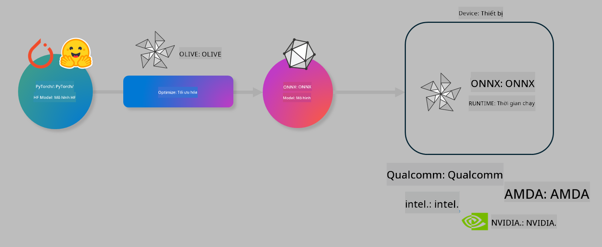

<!--
CO_OP_TRANSLATOR_METADATA:
{
  "original_hash": "6bbe47de3b974df7eea29dfeccf6032b",
  "translation_date": "2025-05-09T04:40:17+00:00",
  "source_file": "code/04.Finetuning/olive-lab/readme.md",
  "language_code": "vi"
}
-->
# Lab. Tối ưu hóa mô hình AI cho suy luận trên thiết bị

## Giới thiệu

> [!IMPORTANT]
> Lab này yêu cầu **GPU Nvidia A10 hoặc A100** cùng với driver và bộ công cụ CUDA (phiên bản 12+) đã được cài đặt.

> [!NOTE]
> Đây là một lab **35 phút** giúp bạn làm quen thực hành với các khái niệm cốt lõi về tối ưu hóa mô hình cho suy luận trên thiết bị bằng OLIVE.

## Mục tiêu học tập

Sau khi hoàn thành lab này, bạn sẽ có thể sử dụng OLIVE để:

- Lượng tử hóa mô hình AI bằng phương pháp lượng tử AWQ.
- Tinh chỉnh mô hình AI cho một nhiệm vụ cụ thể.
- Tạo các adapter LoRA (mô hình đã tinh chỉnh) để suy luận hiệu quả trên thiết bị bằng ONNX Runtime.

### Olive là gì

Olive (*O*NNX *live*) là bộ công cụ tối ưu hóa mô hình kèm theo CLI cho phép bạn triển khai mô hình trên ONNX runtime +++https://onnxruntime.ai+++ với chất lượng và hiệu suất cao.



Đầu vào của Olive thường là mô hình PyTorch hoặc Hugging Face, đầu ra là mô hình ONNX đã được tối ưu, chạy trên thiết bị (mục tiêu triển khai) sử dụng ONNX runtime. Olive tối ưu mô hình cho bộ tăng tốc AI của mục tiêu triển khai (NPU, GPU, CPU) do nhà cung cấp phần cứng như Qualcomm, AMD, Nvidia hoặc Intel cung cấp.

Olive thực thi một *workflow*, là chuỗi các tác vụ tối ưu hóa mô hình riêng biệt gọi là *passes* – ví dụ các pass bao gồm: nén mô hình, ghi lại đồ thị, lượng tử hóa, tối ưu hóa đồ thị. Mỗi pass có bộ tham số có thể điều chỉnh để đạt được các chỉ số tốt nhất, ví dụ như độ chính xác và độ trễ, được đánh giá bởi bộ đánh giá tương ứng. Olive sử dụng chiến lược tìm kiếm với thuật toán tự động điều chỉnh từng pass một hoặc theo nhóm.

#### Lợi ích của Olive

- **Giảm thiểu sự phiền toái và thời gian** thử nghiệm thủ công bằng cách định nghĩa các ràng buộc về chất lượng và hiệu suất, để Olive tự động tìm mô hình tốt nhất cho bạn.
- **Hơn 40 thành phần tối ưu hóa mô hình tích hợp sẵn** bao gồm các kỹ thuật tiên tiến về lượng tử hóa, nén, tối ưu hóa đồ thị và tinh chỉnh.
- **CLI dễ sử dụng** cho các tác vụ tối ưu hóa mô hình phổ biến như olive quantize, olive auto-opt, olive finetune.
- Tích hợp đóng gói và triển khai mô hình.
- Hỗ trợ tạo mô hình cho **Multi LoRA serving**.
- Xây dựng workflow bằng YAML/JSON để điều phối các tác vụ tối ưu hóa và triển khai mô hình.
- Tích hợp với **Hugging Face** và **Azure AI**.
- Cơ chế **cache** tích hợp giúp **tiết kiệm chi phí**.

## Hướng dẫn lab

> [!NOTE]
> Vui lòng đảm bảo bạn đã chuẩn bị Azure AI Hub, Project và cấu hình máy tính A100 theo Lab 1.

### Bước 0: Kết nối với Azure AI Compute

Bạn sẽ kết nối với Azure AI Compute qua tính năng remote trong **VS Code**.

1. Mở ứng dụng **VS Code** trên máy tính:
1. Mở **command palette** bằng tổ hợp phím **Shift+Ctrl+P**
1. Tìm kiếm lệnh **AzureML - remote: Connect to compute instance in New Window** trong command palette.
1. Làm theo hướng dẫn trên màn hình để kết nối với Compute. Bạn sẽ chọn Subscription Azure, Resource Group, Project và tên Compute đã thiết lập trong Lab 1.
1. Khi đã kết nối thành công, trạng thái sẽ hiển thị ở **góc dưới bên trái của Visual Code** `><Azure ML: Compute Name`

### Bước 1: Clone repo này

Trong VS Code, mở terminal mới với **Ctrl+J** và clone repo:

Trong terminal bạn sẽ thấy dấu nhắc

```
azureuser@computername:~/cloudfiles/code$ 
```
Clone giải pháp

```bash
cd ~/localfiles
git clone https://github.com/microsoft/phi-3cookbook.git
```

### Bước 2: Mở thư mục trong VS Code

Để mở VS Code ở thư mục liên quan, thực thi lệnh sau trong terminal, cửa sổ mới sẽ mở ra:

```bash
code phi-3cookbook/code/04.Finetuning/Olive-lab
```

Ngoài ra, bạn có thể mở thư mục bằng cách chọn **File** > **Open Folder**.

### Bước 3: Cài đặt phụ thuộc

Mở terminal trong VS Code trên Azure AI Compute Instance (mẹo: **Ctrl+J**) và chạy các lệnh sau để cài đặt các phụ thuộc:

```bash
conda create -n olive-ai python=3.11 -y
conda activate olive-ai
pip install -r requirements.txt
az extension remove -n azure-cli-ml
az extension add -n ml
```

> [!NOTE]
> Quá trình cài đặt các phụ thuộc mất khoảng ~5 phút.

Trong lab này bạn sẽ tải xuống và tải lên các mô hình vào Azure AI Model catalog. Để truy cập catalog, bạn cần đăng nhập Azure bằng:

```bash
az login
```

> [!NOTE]
> Khi đăng nhập, bạn sẽ được yêu cầu chọn subscription. Hãy chắc chắn chọn đúng subscription được cung cấp cho lab này.

### Bước 4: Thực thi các lệnh Olive

Mở terminal trong VS Code trên Azure AI Compute Instance (mẹo: **Ctrl+J**) và đảm bảo môi trường `olive-ai` conda đã được kích hoạt:

```bash
conda activate olive-ai
```

Tiếp theo, chạy các lệnh Olive sau trong command line.

1. **Kiểm tra dữ liệu:** Ví dụ này bạn sẽ tinh chỉnh mô hình Phi-3.5-Mini để chuyên về trả lời các câu hỏi liên quan đến du lịch. Đoạn code dưới đây hiển thị vài bản ghi đầu của tập dữ liệu, định dạng JSON lines:

    ```bash
    head data/data_sample_travel.jsonl
    ```
1. **Lượng tử hóa mô hình:** Trước khi huấn luyện, bạn lượng tử hóa mô hình với lệnh sau sử dụng kỹ thuật Active Aware Quantization (AWQ) +++https://arxiv.org/abs/2306.00978+++. AWQ lượng tử hóa trọng số mô hình dựa trên các kích hoạt được tạo ra trong quá trình suy luận. Điều này có nghĩa quá trình lượng tử hóa xem xét phân phối dữ liệu thực tế trong các kích hoạt, giúp giữ độ chính xác mô hình tốt hơn so với các phương pháp lượng tử hóa trọng số truyền thống.

    ```bash
    olive quantize \
       --model_name_or_path microsoft/Phi-3.5-mini-instruct \
       --trust_remote_code \
       --algorithm awq \
       --output_path models/phi/awq \
       --log_level 1
    ```

    Quá trình lượng tử hóa AWQ mất khoảng **~8 phút**, giúp **giảm kích thước mô hình từ ~7.5GB xuống ~2.5GB**.

    Trong lab này, chúng tôi hướng dẫn cách nhập mô hình từ Hugging Face (ví dụ: `microsoft/Phi-3.5-mini-instruct`). However, Olive also allows you to input models from the Azure AI catalog by updating the `model_name_or_path` argument to an Azure AI asset ID (for example:  `azureml://registries/azureml/models/Phi-3.5-mini-instruct/versions/4`). 

1. **Train the model:** Next, the `olive finetune` lệnh tinh chỉnh mô hình đã lượng tử hóa. Lượng tử hóa *trước* khi tinh chỉnh thay vì sau giúp cải thiện độ chính xác vì quá trình tinh chỉnh phục hồi phần nào tổn thất do lượng tử hóa.

    ```bash
    olive finetune \
        --method lora \
        --model_name_or_path models/phi/awq \
        --data_files "data/data_sample_travel.jsonl" \
        --data_name "json" \
        --text_template "<|user|>\n{prompt}<|end|>\n<|assistant|>\n{response}<|end|>" \
        --max_steps 100 \
        --output_path ./models/phi/ft \
        --log_level 1
    ```

    Quá trình tinh chỉnh mất khoảng **~6 phút** (với 100 bước).

1. **Tối ưu hóa:** Sau khi huấn luyện, bạn tối ưu mô hình bằng lệnh `auto-opt` command, which will capture the ONNX graph and automatically perform a number of optimizations to improve the model performance for CPU by compressing the model and doing fusions. It should be noted, that you can also optimize for other devices such as NPU or GPU by just updating the `--device` and `--provider` của Olive – tuy nhiên trong lab này sẽ dùng CPU.

    ```bash
    olive auto-opt \
       --model_name_or_path models/phi/ft/model \
       --adapter_path models/phi/ft/adapter \
       --device cpu \
       --provider CPUExecutionProvider \
       --use_ort_genai \
       --output_path models/phi/onnx-ao \
       --log_level 1
    ```

    Quá trình tối ưu mất khoảng **~5 phút**.

### Bước 5: Kiểm tra nhanh suy luận mô hình

Để kiểm tra suy luận mô hình, tạo file Python trong thư mục tên **app.py** và sao chép dán đoạn code sau:

```python
import onnxruntime_genai as og
import numpy as np

print("loading model and adapters...", end="", flush=True)
model = og.Model("models/phi/onnx-ao/model")
adapters = og.Adapters(model)
adapters.load("models/phi/onnx-ao/model/adapter_weights.onnx_adapter", "travel")
print("DONE!")

tokenizer = og.Tokenizer(model)
tokenizer_stream = tokenizer.create_stream()

params = og.GeneratorParams(model)
params.set_search_options(max_length=100, past_present_share_buffer=False)
user_input = "what is the best thing to see in chicago"
params.input_ids = tokenizer.encode(f"<|user|>\n{user_input}<|end|>\n<|assistant|>\n")

generator = og.Generator(model, params)

generator.set_active_adapter(adapters, "travel")

print(f"{user_input}")

while not generator.is_done():
    generator.compute_logits()
    generator.generate_next_token()

    new_token = generator.get_next_tokens()[0]
    print(tokenizer_stream.decode(new_token), end='', flush=True)

print("\n")
```

Chạy code bằng:

```bash
python app.py
```

### Bước 6: Tải mô hình lên Azure AI

Tải mô hình lên kho Azure AI giúp chia sẻ mô hình với các thành viên trong nhóm phát triển và quản lý phiên bản mô hình. Để tải mô hình lên, chạy lệnh sau:

> [!NOTE]
> Cập nhật `{}` placeholders with the name of your resource group and Azure AI Project Name. 

To find your resource group `"resourceGroup"` và tên Azure AI Project, rồi chạy lệnh dưới đây

```
az ml workspace show
```

Hoặc truy cập +++ai.azure.com+++ và chọn **management center** **project** **overview**

Cập nhật các placeholder `{}` với tên resource group và Azure AI Project của bạn.

```bash
az ml model create \
    --name ft-for-travel \
    --version 1 \
    --path ./models/phi/onnx-ao \
    --resource-group {RESOURCE_GROUP_NAME} \
    --workspace-name {PROJECT_NAME}
```
Bạn có thể xem mô hình đã tải lên và triển khai tại https://ml.azure.com/model/list

**Tuyên bố từ chối trách nhiệm**:  
Tài liệu này đã được dịch bằng dịch vụ dịch thuật AI [Co-op Translator](https://github.com/Azure/co-op-translator). Mặc dù chúng tôi cố gắng đảm bảo độ chính xác, xin lưu ý rằng bản dịch tự động có thể chứa lỗi hoặc không chính xác. Tài liệu gốc bằng ngôn ngữ gốc nên được coi là nguồn chính xác và đáng tin cậy. Đối với thông tin quan trọng, nên sử dụng dịch vụ dịch thuật chuyên nghiệp do con người thực hiện. Chúng tôi không chịu trách nhiệm về bất kỳ sự hiểu lầm hoặc giải thích sai nào phát sinh từ việc sử dụng bản dịch này.