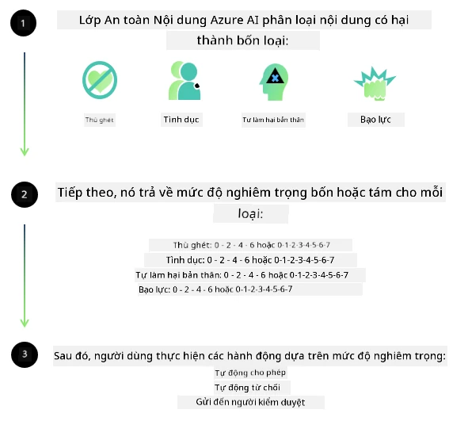
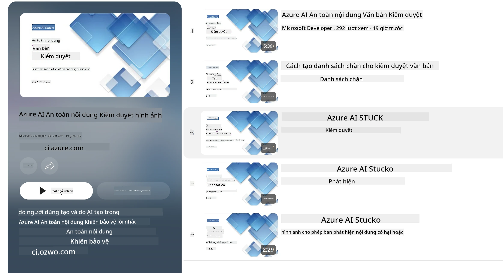

<!--
CO_OP_TRANSLATOR_METADATA:
{
  "original_hash": "839ccc4b3886ef10cfd4e64977f5792d",
  "translation_date": "2026-01-05T08:51:57+00:00",
  "source_file": "md/01.Introduction/01/01.AISafety.md",
  "language_code": "vi"
}
-->
# An toàn AI cho các mô hình Phi
Gia đình các mô hình Phi được phát triển theo [Tiêu chuẩn AI có trách nhiệm của Microsoft](https://www.microsoft.com/ai/principles-and-approach#responsible-ai-standard), là bộ yêu cầu trên toàn công ty dựa trên sáu nguyên tắc sau: trách nhiệm giải trình, minh bạch, công bằng, độ tin cậy và an toàn, quyền riêng tư và bảo mật, và sự bao trùm, tạo thành [nguyên tắc AI có trách nhiệm của Microsoft](https://www.microsoft.com/ai/responsible-ai).

Cũng như các mô hình Phi trước đây, một phương pháp đánh giá và đào tạo an toàn đa diện đã được áp dụng, với các biện pháp bổ sung để tính đến khả năng đa ngôn ngữ trong phiên bản phát hành này. Phương pháp huấn luyện và đánh giá an toàn của chúng tôi, bao gồm kiểm tra trên nhiều ngôn ngữ và các loại rủi ro, được trình bày trong [Bài báo An toàn Hậu huấn luyện Phi](https://arxiv.org/abs/2407.13833). Trong khi các mô hình Phi được hưởng lợi từ phương pháp này, các nhà phát triển nên áp dụng các thực hành tốt nhất về AI có trách nhiệm, bao gồm lập bản đồ, đo lường và giảm thiểu các rủi ro liên quan đến trường hợp sử dụng cụ thể cũng như bối cảnh văn hóa và ngôn ngữ.

## Thực hành tốt nhất

Giống như các mô hình khác, gia đình các mô hình Phi có thể hành xử theo những cách không công bằng, không đáng tin cậy hoặc gây xúc phạm.

Một số hành vi hạn chế của SLM và LLM mà bạn cần biết bao gồm:

- **Chất lượng dịch vụ:** Các mô hình Phi chủ yếu được huấn luyện trên văn bản tiếng Anh. Các ngôn ngữ khác ngoài tiếng Anh sẽ có hiệu suất kém hơn. Các biến thể tiếng Anh có ít đại diện trong dữ liệu huấn luyện có thể có hiệu suất kém hơn so với tiếng Anh Mỹ chuẩn.
- **Biểu hiện các tác hại & Tăng cường định kiến:** Các mô hình này có thể biểu hiện thái quá hoặc thiếu sót một số nhóm người, xóa bỏ sự hiện diện của một số nhóm, hoặc củng cố các định kiến hoặc khuôn mẫu tiêu cực. Mặc dù đã có huấn luyện an toàn hậu kỳ, những hạn chế này vẫn có thể tồn tại do mức độ đại diện khác nhau của các nhóm hoặc do sự tồn tại phổ biến của các ví dụ về định kiến tiêu cực trong dữ liệu huấn luyện phản ánh các mô hình thực tế và thành kiến xã hội.
- **Nội dung không phù hợp hoặc gây xúc phạm:** Các mô hình này có thể tạo ra các loại nội dung không phù hợp hoặc gây xúc phạm khác, điều này có thể làm cho việc triển khai trong các bối cảnh nhạy cảm trở nên không phù hợp nếu không có các biện pháp giảm thiểu bổ sung phù hợp với từng trường hợp sử dụng.
- **Độ tin cậy thông tin:** Các mô hình ngôn ngữ có thể tạo ra nội dung vô nghĩa hoặc bịa đặt nội dung có vẻ hợp lý nhưng không chính xác hoặc lỗi thời.
- **Phạm vi giới hạn cho mã code:** Phần lớn dữ liệu huấn luyện Phi-3 dựa trên Python và sử dụng các gói phổ biến như "typing, math, random, collections, datetime, itertools". Nếu mô hình tạo ra các đoạn mã Python sử dụng các gói khác hoặc các đoạn mã bằng ngôn ngữ khác, chúng tôi khuyến nghị người dùng cần tự kiểm tra tất cả các API được sử dụng.

Các nhà phát triển nên áp dụng các thực hành tốt nhất về AI có trách nhiệm và chịu trách nhiệm đảm bảo rằng trường hợp sử dụng cụ thể tuân thủ các luật và quy định có liên quan (ví dụ: quyền riêng tư, thương mại, v.v.).

## Cân nhắc về AI có trách nhiệm

Giống như các mô hình ngôn ngữ khác, các mô hình thuộc dòng Phi có thể hành xử theo những cách không công bằng, không đáng tin cậy hoặc gây xúc phạm. Một số hành vi hạn chế cần lưu ý bao gồm:

**Chất lượng dịch vụ:** Các mô hình Phi chủ yếu được huấn luyện trên văn bản tiếng Anh. Các ngôn ngữ ngoài tiếng Anh sẽ có hiệu suất kém hơn. Các biến thể tiếng Anh ít xuất hiện trong dữ liệu huấn luyện có thể có hiệu suất kém hơn so với tiếng Anh Mỹ chuẩn.

**Biểu hiện các tác hại & Tăng cường định kiến:** Các mô hình này có thể biểu hiện thái quá hoặc thiếu sót một số nhóm, xóa bỏ sự hiện diện của một số nhóm, hoặc củng cố các khuôn mẫu tiêu cực hoặc làm giảm giá trị. Mặc dù đã huấn luyện an toàn hậu kỳ, các hạn chế này vẫn có thể tồn tại do mức độ đại diện khác nhau giữa các nhóm hoặc do sự phổ biến của các ví dụ về định kiến tiêu cực trong dữ liệu huấn luyện phản ánh các mô hình và thành kiến xã hội thực tế.

**Nội dung không phù hợp hoặc gây xúc phạm:** Các mô hình này có thể tạo ra các loại nội dung không phù hợp hoặc gây xúc phạm khác, có thể làm cho việc triển khai trong các bối cảnh nhạy cảm trở nên không phù hợp nếu không có các biện pháp giảm thiểu bổ sung theo từng trường hợp sử dụng.
**Độ tin cậy thông tin:** Các mô hình ngôn ngữ có thể tạo ra nội dung vô nghĩa hoặc bịa đặt các nội dung có vẻ hợp lý nhưng không chính xác hoặc lỗi thời.

**Phạm vi giới hạn cho mã code:** Phần lớn dữ liệu huấn luyện Phi-3 dựa trên Python và sử dụng các gói phổ biến như "typing, math, random, collections, datetime, itertools". Nếu mô hình sinh ra các đoạn mã Python sử dụng các gói khác hoặc mã trong các ngôn ngữ khác, chúng tôi khuyến nghị người dùng kiểm tra thủ công tất cả các API được sử dụng.

Các nhà phát triển nên áp dụng các thực hành tốt nhất về AI có trách nhiệm và chịu trách nhiệm đảm bảo rằng trường hợp sử dụng cụ thể tuân thủ các luật và quy định có liên quan (ví dụ: quyền riêng tư, thương mại, v.v.). Các lĩnh vực quan trọng để cân nhắc bao gồm:

**Phân bổ:** Mô hình có thể không phù hợp với các kịch bản có thể ảnh hưởng pháp lý quan trọng hoặc việc phân bổ tài nguyên hay cơ hội sống (ví dụ: nhà ở, việc làm, tín dụng, v.v.) nếu không có các đánh giá bổ sung và kỹ thuật khử thiên vị.

**Kịch bản rủi ro cao:** Các nhà phát triển nên đánh giá tính phù hợp của mô hình trong các kịch bản rủi ro cao, nơi các kết quả không công bằng, không đáng tin cậy hoặc gây xúc phạm có thể gây hậu quả nghiêm trọng hoặc thiệt hại. Bao gồm việc cung cấp lời khuyên trong các lĩnh vực nhạy cảm hoặc chuyên gia mà độ chính xác và tin cậy là rất quan trọng (ví dụ: tư vấn pháp lý hoặc y tế). Cần triển khai các biện pháp bảo vệ bổ sung ở cấp ứng dụng tùy theo bối cảnh triển khai.

**Thông tin sai lệch:** Mô hình có thể tạo ra thông tin không chính xác. Các nhà phát triển nên tuân theo các thực hành minh bạch và thông báo cho người dùng cuối biết họ đang tương tác với hệ thống AI. Ở cấp độ ứng dụng, các nhà phát triển có thể xây dựng các cơ chế phản hồi và quy trình để căn cứ câu trả lời vào thông tin ngữ cảnh đặc thù cho trường hợp sử dụng, gọi là Kỹ thuật Tăng cường Truy xuất (Retrieval Augmented Generation - RAG).

**Tạo nội dung gây hại:** Các nhà phát triển nên đánh giá các kết quả theo bối cảnh và sử dụng các bộ phân loại an toàn có sẵn hoặc giải pháp tùy chỉnh phù hợp với trường hợp sử dụng của họ.

**Lạm dụng:** Các hình thức lạm dụng khác như gian lận, spam, hoặc tạo mã độc có thể xảy ra, và các nhà phát triển nên đảm bảo ứng dụng của họ không vi phạm luật và quy định hiện hành.

### Tinh chỉnh và An toàn Nội dung AI

Sau khi tinh chỉnh mô hình, chúng tôi rất khuyến nghị tận dụng các biện pháp [Azure AI Content Safety](https://learn.microsoft.com/azure/ai-services/content-safety/overview) để giám sát nội dung do mô hình tạo ra, xác định và chặn các rủi ro, mối đe dọa và các vấn đề về chất lượng.

[Azure AI Content Safety](https://learn.microsoft.com/azure/ai-services/content-safety/overview) hỗ trợ cả nội dung văn bản và hình ảnh. Nó có thể được triển khai trên điện toán đám mây, các container không kết nối, và trên các thiết bị biên/nhúng.

## Tổng quan về Azure AI Content Safety

Azure AI Content Safety không phải là giải pháp dành cho tất cả mọi người; nó có thể được tùy chỉnh để phù hợp với chính sách cụ thể của doanh nghiệp. Hơn nữa, các mô hình đa ngôn ngữ của nó cho phép hiểu nhiều ngôn ngữ cùng lúc.

- **Azure AI Content Safety**
- **Microsoft Developer**
- **5 videos**

Dịch vụ Azure AI Content Safety phát hiện nội dung do người dùng và AI tạo có hại trong các ứng dụng và dịch vụ. Nó bao gồm các API văn bản và hình ảnh cho phép phát hiện các tài liệu có hại hoặc không phù hợp.

[AI Content Safety Playlist](https://www.youtube.com/playlist?list=PLlrxD0HtieHjaQ9bJjyp1T7FeCbmVcPkQ)

---

<!-- CO-OP TRANSLATOR DISCLAIMER START -->
**Tuyên bố từ chối trách nhiệm**:  
Tài liệu này đã được dịch bằng dịch vụ dịch thuật AI [Co-op Translator](https://github.com/Azure/co-op-translator). Mặc dù chúng tôi cố gắng đảm bảo độ chính xác, xin lưu ý rằng bản dịch tự động có thể chứa lỗi hoặc sai sót. Tài liệu gốc bằng ngôn ngữ chuẩn được coi là nguồn thông tin chính xác nhất. Đối với các thông tin quan trọng, nên sử dụng dịch vụ dịch thuật chuyên nghiệp bởi con người. Chúng tôi không chịu trách nhiệm về bất kỳ sự hiểu lầm hay giải thích sai nào phát sinh từ việc sử dụng bản dịch này.
<!-- CO-OP TRANSLATOR DISCLAIMER END -->