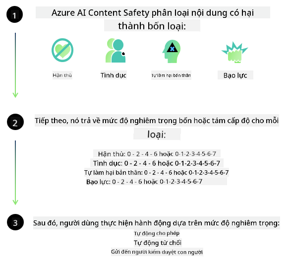
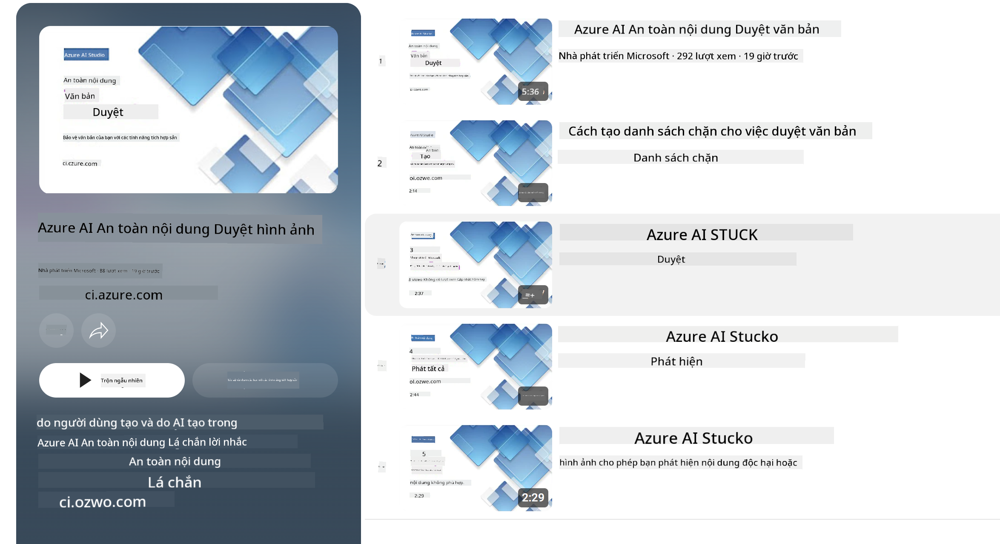

<!--
CO_OP_TRANSLATOR_METADATA:
{
  "original_hash": "c8273672cc57df2be675407a1383aaf0",
  "translation_date": "2025-05-09T06:10:31+00:00",
  "source_file": "md/01.Introduction/01/01.AISafety.md",
  "language_code": "vi"
}
-->
# An toàn AI cho các mô hình Phi  
Dòng mô hình Phi được phát triển theo [Tiêu chuẩn AI có trách nhiệm của Microsoft](https://query.prod.cms.rt.microsoft.com/cms/api/am/binary/RE5cmFl), một bộ yêu cầu toàn công ty dựa trên sáu nguyên tắc: trách nhiệm giải trình, minh bạch, công bằng, độ tin cậy và an toàn, quyền riêng tư và bảo mật, cũng như sự bao trùm, tạo thành [nguyên tắc AI có trách nhiệm của Microsoft](https://www.microsoft.com/ai/responsible-ai).

Tương tự các mô hình Phi trước đây, một phương pháp đánh giá an toàn đa chiều và đào tạo sau khi huấn luyện đã được áp dụng, cùng với các biện pháp bổ sung để tính đến khả năng đa ngôn ngữ của phiên bản này. Cách tiếp cận của chúng tôi về đào tạo và đánh giá an toàn, bao gồm thử nghiệm trên nhiều ngôn ngữ và các nhóm rủi ro, được trình bày trong [Bài báo về Đào tạo Sau An toàn của Phi](https://arxiv.org/abs/2407.13833). Mặc dù các mô hình Phi được hưởng lợi từ phương pháp này, các nhà phát triển nên áp dụng các thực hành AI có trách nhiệm tốt nhất, bao gồm việc lập bản đồ, đo lường và giảm thiểu các rủi ro liên quan đến trường hợp sử dụng cụ thể và bối cảnh văn hóa, ngôn ngữ của họ.

## Thực hành tốt nhất

Giống như các mô hình khác, dòng mô hình Phi có thể hành xử theo những cách không công bằng, không đáng tin cậy hoặc gây phản cảm.

Một số hành vi hạn chế của SLM và LLM mà bạn cần lưu ý bao gồm:

- **Chất lượng dịch vụ:** Các mô hình Phi chủ yếu được huấn luyện trên văn bản tiếng Anh. Các ngôn ngữ khác ngoài tiếng Anh sẽ có hiệu suất kém hơn. Các biến thể tiếng Anh ít được đại diện trong dữ liệu huấn luyện có thể hoạt động kém hơn so với tiếng Anh Mỹ chuẩn.
- **Biểu hiện của tổn hại & duy trì định kiến:** Các mô hình này có thể biểu hiện quá mức hoặc thiếu đại diện cho các nhóm người, xóa bỏ sự đại diện của một số nhóm, hoặc củng cố các định kiến tiêu cực hoặc hạ thấp. Mặc dù đã có đào tạo sau an toàn, các hạn chế này vẫn có thể tồn tại do mức độ đại diện khác nhau của các nhóm hoặc sự xuất hiện phổ biến của các ví dụ định kiến tiêu cực trong dữ liệu huấn luyện phản ánh các mẫu thực tế và thành kiến xã hội.
- **Nội dung không phù hợp hoặc gây phản cảm:** Các mô hình này có thể tạo ra các loại nội dung không phù hợp hoặc gây phản cảm khác, khiến chúng không thích hợp để triển khai trong các bối cảnh nhạy cảm nếu không có các biện pháp giảm thiểu bổ sung phù hợp với từng trường hợp sử dụng.
- **Độ tin cậy thông tin:** Các mô hình ngôn ngữ có thể tạo ra nội dung vô nghĩa hoặc bịa đặt nội dung nghe có vẻ hợp lý nhưng không chính xác hoặc lỗi thời.
- **Phạm vi giới hạn cho mã nguồn:** Phần lớn dữ liệu huấn luyện Phi-3 dựa trên Python và sử dụng các gói phổ biến như "typing, math, random, collections, datetime, itertools". Nếu mô hình tạo ra các script Python sử dụng các gói khác hoặc script trong ngôn ngữ khác, chúng tôi khuyến nghị người dùng kiểm tra thủ công tất cả các API được sử dụng.

Các nhà phát triển nên áp dụng các thực hành AI có trách nhiệm tốt nhất và chịu trách nhiệm đảm bảo rằng trường hợp sử dụng cụ thể tuân thủ các luật và quy định liên quan (ví dụ: quyền riêng tư, thương mại, v.v.).

## Các cân nhắc về AI có trách nhiệm

Giống như các mô hình ngôn ngữ khác, dòng mô hình Phi có thể hành xử theo những cách không công bằng, không đáng tin cậy hoặc gây phản cảm. Một số hành vi hạn chế cần lưu ý bao gồm:

**Chất lượng dịch vụ:** Các mô hình Phi chủ yếu được huấn luyện trên văn bản tiếng Anh. Các ngôn ngữ khác ngoài tiếng Anh sẽ có hiệu suất kém hơn. Các biến thể tiếng Anh ít được đại diện trong dữ liệu huấn luyện có thể hoạt động kém hơn so với tiếng Anh Mỹ chuẩn.

**Biểu hiện của tổn hại & duy trì định kiến:** Các mô hình này có thể biểu hiện quá mức hoặc thiếu đại diện cho các nhóm người, xóa bỏ sự đại diện của một số nhóm, hoặc củng cố các định kiến tiêu cực hoặc hạ thấp. Mặc dù đã có đào tạo sau an toàn, các hạn chế này vẫn có thể tồn tại do mức độ đại diện khác nhau của các nhóm hoặc sự xuất hiện phổ biến của các ví dụ định kiến tiêu cực trong dữ liệu huấn luyện phản ánh các mẫu thực tế và thành kiến xã hội.

**Nội dung không phù hợp hoặc gây phản cảm:** Các mô hình này có thể tạo ra các loại nội dung không phù hợp hoặc gây phản cảm khác, khiến chúng không thích hợp để triển khai trong các bối cảnh nhạy cảm nếu không có các biện pháp giảm thiểu bổ sung phù hợp với từng trường hợp sử dụng.  
Độ tin cậy thông tin: Các mô hình ngôn ngữ có thể tạo ra nội dung vô nghĩa hoặc bịa đặt nội dung nghe có vẻ hợp lý nhưng không chính xác hoặc lỗi thời.

**Phạm vi giới hạn cho mã nguồn:** Phần lớn dữ liệu huấn luyện Phi-3 dựa trên Python và sử dụng các gói phổ biến như "typing, math, random, collections, datetime, itertools". Nếu mô hình tạo ra các script Python sử dụng các gói khác hoặc script trong ngôn ngữ khác, chúng tôi khuyến nghị người dùng kiểm tra thủ công tất cả các API được sử dụng.

Các nhà phát triển nên áp dụng các thực hành AI có trách nhiệm tốt nhất và chịu trách nhiệm đảm bảo rằng trường hợp sử dụng cụ thể tuân thủ các luật và quy định liên quan (ví dụ: quyền riêng tư, thương mại, v.v.). Các lĩnh vực quan trọng cần cân nhắc bao gồm:

**Phân bổ:** Mô hình có thể không phù hợp cho các tình huống có thể ảnh hưởng đáng kể đến trạng thái pháp lý hoặc phân bổ tài nguyên hay cơ hội sống (ví dụ: nhà ở, việc làm, tín dụng, v.v.) nếu không có các đánh giá bổ sung và kỹ thuật giảm định kiến.

**Tình huống rủi ro cao:** Các nhà phát triển nên đánh giá tính phù hợp khi sử dụng mô hình trong các tình huống rủi ro cao, nơi kết quả không công bằng, không đáng tin cậy hoặc gây phản cảm có thể gây hậu quả nghiêm trọng hoặc gây hại. Điều này bao gồm việc cung cấp lời khuyên trong các lĩnh vực nhạy cảm hoặc chuyên môn, nơi độ chính xác và tin cậy là rất quan trọng (ví dụ: tư vấn pháp lý hoặc y tế). Các biện pháp bảo vệ bổ sung nên được triển khai ở cấp ứng dụng theo bối cảnh triển khai.

**Thông tin sai lệch:** Mô hình có thể tạo ra thông tin không chính xác. Các nhà phát triển nên tuân thủ các thực hành minh bạch và thông báo cho người dùng cuối rằng họ đang tương tác với hệ thống AI. Ở cấp ứng dụng, các nhà phát triển có thể xây dựng cơ chế phản hồi và quy trình để dựa trên thông tin cụ thể theo trường hợp sử dụng và bối cảnh, một kỹ thuật được gọi là Retrieval Augmented Generation (RAG).

**Tạo nội dung gây hại:** Các nhà phát triển nên đánh giá kết quả dựa trên bối cảnh và sử dụng các bộ phân loại an toàn có sẵn hoặc các giải pháp tùy chỉnh phù hợp với trường hợp sử dụng của họ.

**Lạm dụng:** Các hình thức lạm dụng khác như gian lận, spam hoặc sản xuất phần mềm độc hại có thể xảy ra, và các nhà phát triển nên đảm bảo rằng ứng dụng của họ không vi phạm các luật và quy định áp dụng.

### Tinh chỉnh và An toàn nội dung AI

Sau khi tinh chỉnh mô hình, chúng tôi khuyến nghị mạnh mẽ sử dụng các biện pháp của [Azure AI Content Safety](https://learn.microsoft.com/azure/ai-services/content-safety/overview) để giám sát nội dung do mô hình tạo ra, nhận diện và chặn các rủi ro, mối đe dọa và vấn đề chất lượng tiềm ẩn.

[Azure AI Content Safety](https://learn.microsoft.com/azure/ai-services/content-safety/overview) hỗ trợ cả nội dung văn bản và hình ảnh. Nó có thể được triển khai trên đám mây, trong các container không kết nối, và trên các thiết bị biên/nhúng.

## Tổng quan về Azure AI Content Safety

Azure AI Content Safety không phải là giải pháp chung cho tất cả; nó có thể được tùy chỉnh để phù hợp với các chính sách cụ thể của doanh nghiệp. Ngoài ra, các mô hình đa ngôn ngữ của nó cho phép hiểu nhiều ngôn ngữ cùng lúc.

- **Azure AI Content Safety**  
- **Microsoft Developer**  
- **5 video**

Dịch vụ Azure AI Content Safety phát hiện nội dung do người dùng và AI tạo ra có hại trong các ứng dụng và dịch vụ. Nó bao gồm các API văn bản và hình ảnh cho phép bạn phát hiện các tài liệu có hại hoặc không phù hợp.

[AI Content Safety Playlist](https://www.youtube.com/playlist?list=PLlrxD0HtieHjaQ9bJjyp1T7FeCbmVcPkQ)

**Tuyên bố từ chối trách nhiệm**:  
Tài liệu này đã được dịch bằng dịch vụ dịch thuật AI [Co-op Translator](https://github.com/Azure/co-op-translator). Mặc dù chúng tôi cố gắng đảm bảo độ chính xác, xin lưu ý rằng các bản dịch tự động có thể chứa lỗi hoặc không chính xác. Tài liệu gốc bằng ngôn ngữ nguyên bản nên được coi là nguồn chính xác và đáng tin cậy. Đối với thông tin quan trọng, nên sử dụng dịch vụ dịch thuật chuyên nghiệp do con người thực hiện. Chúng tôi không chịu trách nhiệm đối với bất kỳ sự hiểu lầm hoặc giải thích sai nào phát sinh từ việc sử dụng bản dịch này.