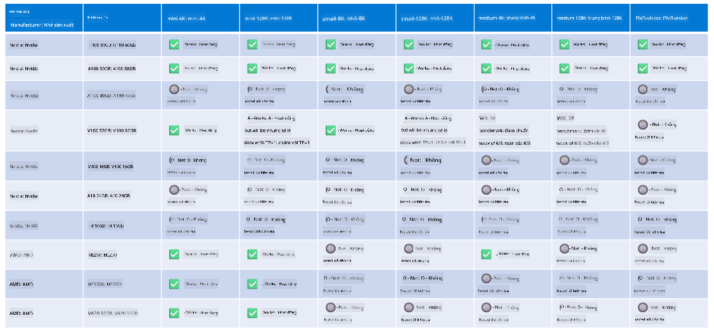

<!--
CO_OP_TRANSLATOR_METADATA:
{
  "original_hash": "8cdc17ce0f10535da30b53d23fe1a795",
  "translation_date": "2025-07-16T18:26:11+00:00",
  "source_file": "md/01.Introduction/01/01.Hardwaresupport.md",
  "language_code": "vi"
}
-->
# Hỗ trợ phần cứng Phi

Microsoft Phi đã được tối ưu hóa cho ONNX Runtime và hỗ trợ Windows DirectML. Nó hoạt động tốt trên nhiều loại phần cứng khác nhau, bao gồm GPU, CPU và cả thiết bị di động.

## Phần cứng thiết bị  
Cụ thể, phần cứng được hỗ trợ bao gồm:

- GPU SKU: RTX 4090 (DirectML)
- GPU SKU: 1 A100 80GB (CUDA)
- CPU SKU: Standard F64s v2 (64 vCPU, 128 GiB bộ nhớ)

## SKU di động

- Android - Samsung Galaxy S21
- Apple iPhone 14 trở lên với bộ xử lý A16/A17

## Thông số kỹ thuật phần cứng Phi

- Cấu hình tối thiểu yêu cầu.
- Windows: GPU hỗ trợ DirectX 12 và tối thiểu 4GB RAM tổng hợp

CUDA: GPU NVIDIA với Compute Capability >= 7.02



## Chạy onnxruntime trên nhiều GPU

Hiện tại các mô hình Phi ONNX có sẵn chỉ dành cho 1 GPU. Có thể hỗ trợ đa GPU cho mô hình Phi, nhưng ORT với 2 GPU không đảm bảo sẽ cho hiệu suất cao hơn so với 2 instance của ort. Vui lòng xem [ONNX Runtime](https://onnxruntime.ai/) để cập nhật mới nhất.

Tại [Build 2024, nhóm GenAI ONNX](https://youtu.be/WLW4SE8M9i8?si=EtG04UwDvcjunyfC) đã công bố rằng họ đã kích hoạt đa instance thay vì đa GPU cho các mô hình Phi.

Hiện tại, điều này cho phép bạn chạy một instance onnxruntime hoặc onnxruntime-genai với biến môi trường CUDA_VISIBLE_DEVICES như sau.

```Python
CUDA_VISIBLE_DEVICES=0 python infer.py
CUDA_VISIBLE_DEVICES=1 python infer.py
```

Hãy thoải mái khám phá thêm về Phi tại [Azure AI Foundry](https://ai.azure.com)

**Tuyên bố từ chối trách nhiệm**:  
Tài liệu này đã được dịch bằng dịch vụ dịch thuật AI [Co-op Translator](https://github.com/Azure/co-op-translator). Mặc dù chúng tôi cố gắng đảm bảo độ chính xác, xin lưu ý rằng các bản dịch tự động có thể chứa lỗi hoặc không chính xác. Tài liệu gốc bằng ngôn ngữ gốc của nó nên được coi là nguồn chính xác và đáng tin cậy. Đối với các thông tin quan trọng, nên sử dụng dịch vụ dịch thuật chuyên nghiệp do con người thực hiện. Chúng tôi không chịu trách nhiệm về bất kỳ sự hiểu lầm hoặc giải thích sai nào phát sinh từ việc sử dụng bản dịch này.