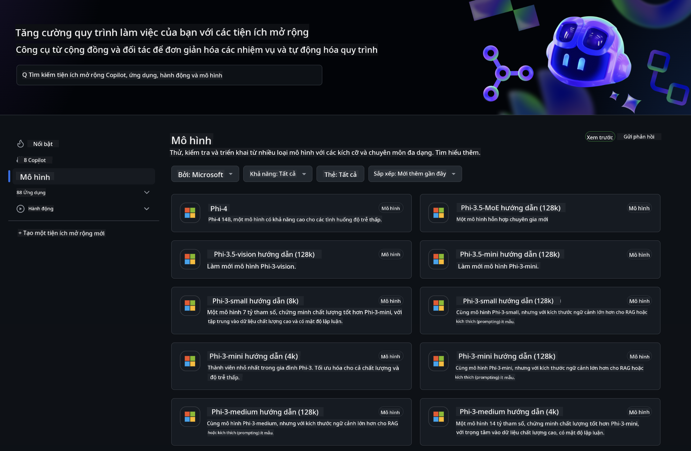
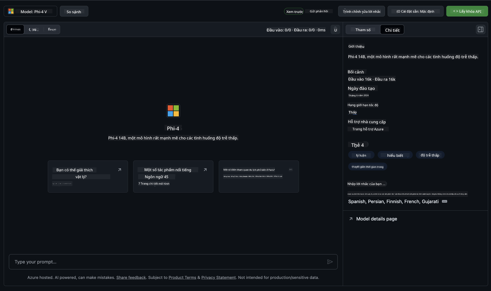
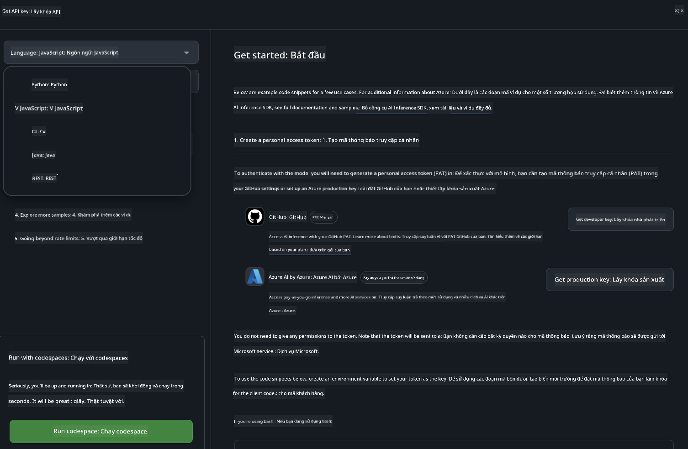
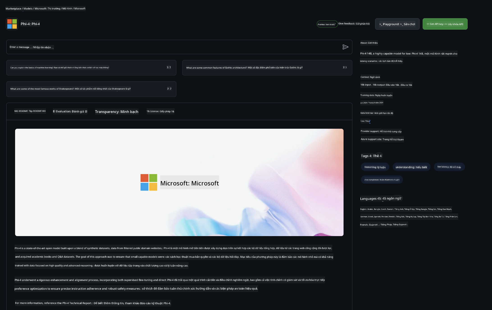

<!--
CO_OP_TRANSLATOR_METADATA:
{
  "original_hash": "fb67a08b9fc911a10ed58081fadef416",
  "translation_date": "2025-05-09T08:54:54+00:00",
  "source_file": "md/01.Introduction/02/02.GitHubModel.md",
  "language_code": "vi"
}
-->
## Phi Family in GitHub Models

Chào mừng bạn đến với [GitHub Models](https://github.com/marketplace/models)! Chúng tôi đã chuẩn bị sẵn sàng để bạn khám phá các Mô hình AI được lưu trữ trên Azure AI.



Để biết thêm thông tin về các Mô hình có trên GitHub Models, hãy tham khảo [GitHub Model Marketplace](https://github.com/marketplace/models)

## Các Mô hình Có sẵn

Mỗi mô hình đều có một playground riêng và mã mẫu đi kèm



### Phi Family trong Danh mục Mô hình GitHub

- [Phi-4](https://github.com/marketplace/models/azureml/Phi-4)

- [Phi-3.5-MoE instruct (128k)](https://github.com/marketplace/models/azureml/Phi-3-5-MoE-instruct)

- [Phi-3.5-vision instruct (128k)](https://github.com/marketplace/models/azureml/Phi-3-5-vision-instruct)

- [Phi-3.5-mini instruct (128k)](https://github.com/marketplace/models/azureml/Phi-3-5-mini-instruct)

- [Phi-3-Medium-128k-Instruct](https://github.com/marketplace/models/azureml/Phi-3-medium-128k-instruct)

- [Phi-3-medium-4k-instruct](https://github.com/marketplace/models/azureml/Phi-3-medium-4k-instruct)

- [Phi-3-mini-128k-instruct](https://github.com/marketplace/models/azureml/Phi-3-mini-128k-instruct)

- [Phi-3-mini-4k-instruct](https://github.com/marketplace/models/azureml/Phi-3-mini-4k-instruct)

- [Phi-3-small-128k-instruct](https://github.com/marketplace/models/azureml/Phi-3-small-128k-instruct)

- [Phi-3-small-8k-instruct](https://github.com/marketplace/models/azureml/Phi-3-small-8k-instruct)

## Bắt đầu

Có một số ví dụ cơ bản sẵn sàng để bạn chạy. Bạn có thể tìm thấy chúng trong thư mục samples. Nếu muốn chuyển ngay đến ngôn ngữ bạn yêu thích, các ví dụ được phân loại theo các Ngôn ngữ sau:

- Python
- JavaScript
- C#
- Java
- cURL

Ngoài ra còn có một môi trường Codespaces riêng để chạy các mẫu và mô hình.




## Mã Mẫu

Dưới đây là các đoạn mã mẫu cho một số trường hợp sử dụng. Để biết thêm thông tin về Azure AI Inference SDK, xem tài liệu và mẫu đầy đủ.

## Thiết lập

1. Tạo một personal access token  
Bạn không cần cấp quyền nào cho token. Lưu ý token này sẽ được gửi đến dịch vụ của Microsoft.

Để sử dụng các đoạn mã bên dưới, hãy tạo biến môi trường để đặt token làm khóa cho mã client.

Nếu bạn dùng bash:  
```
export GITHUB_TOKEN="<your-github-token-goes-here>"
```  
Nếu bạn dùng powershell:  

```
$Env:GITHUB_TOKEN="<your-github-token-goes-here>"
```  

Nếu bạn dùng Windows command prompt:  

```
set GITHUB_TOKEN=<your-github-token-goes-here>
```  

## Mẫu Python

### Cài đặt phụ thuộc  
Cài đặt Azure AI Inference SDK bằng pip (Yêu cầu: Python >=3.8):

```
pip install azure-ai-inference
```  
### Chạy ví dụ mã cơ bản

Ví dụ này minh họa một cuộc gọi cơ bản đến API chat completion. Nó sử dụng điểm cuối inference của mô hình AI GitHub và token GitHub của bạn. Cuộc gọi này là đồng bộ.

```python
import os
from azure.ai.inference import ChatCompletionsClient
from azure.ai.inference.models import SystemMessage, UserMessage
from azure.core.credentials import AzureKeyCredential

endpoint = "https://models.inference.ai.azure.com"
model_name = "Phi-4"
token = os.environ["GITHUB_TOKEN"]

client = ChatCompletionsClient(
    endpoint=endpoint,
    credential=AzureKeyCredential(token),
)

response = client.complete(
    messages=[
        UserMessage(content="I have $20,000 in my savings account, where I receive a 4% profit per year and payments twice a year. Can you please tell me how long it will take for me to become a millionaire? Also, can you please explain the math step by step as if you were explaining it to an uneducated person?"),
    ],
    temperature=0.4,
    top_p=1.0,
    max_tokens=2048,
    model=model_name
)

print(response.choices[0].message.content)
```

### Thực hiện cuộc trò chuyện đa lượt

Ví dụ này minh họa một cuộc trò chuyện đa lượt với API chat completion. Khi dùng mô hình cho ứng dụng chat, bạn cần quản lý lịch sử cuộc trò chuyện và gửi các tin nhắn mới nhất đến mô hình.

```
import os
from azure.ai.inference import ChatCompletionsClient
from azure.ai.inference.models import AssistantMessage, SystemMessage, UserMessage
from azure.core.credentials import AzureKeyCredential

token = os.environ["GITHUB_TOKEN"]
endpoint = "https://models.inference.ai.azure.com"
# Replace Model_Name
model_name = "Phi-4"

client = ChatCompletionsClient(
    endpoint=endpoint,
    credential=AzureKeyCredential(token),
)

messages = [
    SystemMessage(content="You are a helpful assistant."),
    UserMessage(content="What is the capital of France?"),
    AssistantMessage(content="The capital of France is Paris."),
    UserMessage(content="What about Spain?"),
]

response = client.complete(messages=messages, model=model_name)

print(response.choices[0].message.content)
```

### Truyền dữ liệu đầu ra theo luồng

Để trải nghiệm người dùng tốt hơn, bạn sẽ muốn truyền phản hồi của mô hình theo luồng để token đầu tiên hiển thị sớm và tránh phải chờ đợi phản hồi dài.

```
import os
from azure.ai.inference import ChatCompletionsClient
from azure.ai.inference.models import SystemMessage, UserMessage
from azure.core.credentials import AzureKeyCredential

token = os.environ["GITHUB_TOKEN"]
endpoint = "https://models.inference.ai.azure.com"
# Replace Model_Name
model_name = "Phi-4"

client = ChatCompletionsClient(
    endpoint=endpoint,
    credential=AzureKeyCredential(token),
)

response = client.complete(
    stream=True,
    messages=[
        SystemMessage(content="You are a helpful assistant."),
        UserMessage(content="Give me 5 good reasons why I should exercise every day."),
    ],
    model=model_name,
)

for update in response:
    if update.choices:
        print(update.choices[0].delta.content or "", end="")

client.close()
```

## Sử dụng MIỄN PHÍ và Giới hạn tốc độ cho GitHub Models



[Giới hạn tốc độ cho playground và sử dụng API miễn phí](https://docs.github.com/en/github-models/prototyping-with-ai-models#rate-limits) được thiết kế để giúp bạn thử nghiệm mô hình và tạo nguyên mẫu ứng dụng AI. Nếu sử dụng vượt quá giới hạn này và muốn mở rộng ứng dụng, bạn cần cấp phát tài nguyên từ tài khoản Azure và xác thực từ đó thay vì dùng personal access token của GitHub. Bạn không cần thay đổi gì khác trong mã. Dùng liên kết này để tìm hiểu cách vượt qua giới hạn tầng miễn phí trên Azure AI.


### Thông báo

Hãy nhớ rằng khi tương tác với mô hình, bạn đang thử nghiệm AI nên có thể có sai sót về nội dung.

Tính năng này có nhiều giới hạn (bao gồm số yêu cầu mỗi phút, mỗi ngày, token mỗi yêu cầu, và yêu cầu đồng thời) và không được thiết kế cho các trường hợp sử dụng sản xuất.

GitHub Models sử dụng Azure AI Content Safety. Các bộ lọc này không thể tắt trong trải nghiệm GitHub Models. Nếu bạn quyết định sử dụng mô hình qua dịch vụ trả phí, hãy cấu hình bộ lọc nội dung phù hợp với yêu cầu của bạn.

Dịch vụ này đang trong điều khoản Phát hành trước của GitHub.

**Tuyên bố từ chối trách nhiệm**:  
Tài liệu này đã được dịch bằng dịch vụ dịch thuật AI [Co-op Translator](https://github.com/Azure/co-op-translator). Mặc dù chúng tôi cố gắng đảm bảo độ chính xác, xin lưu ý rằng các bản dịch tự động có thể chứa lỗi hoặc không chính xác. Tài liệu gốc bằng ngôn ngữ gốc nên được coi là nguồn chính xác và đáng tin cậy. Đối với các thông tin quan trọng, nên sử dụng dịch vụ dịch thuật chuyên nghiệp do con người thực hiện. Chúng tôi không chịu trách nhiệm về bất kỳ sự hiểu lầm hoặc giải thích sai nào phát sinh từ việc sử dụng bản dịch này.