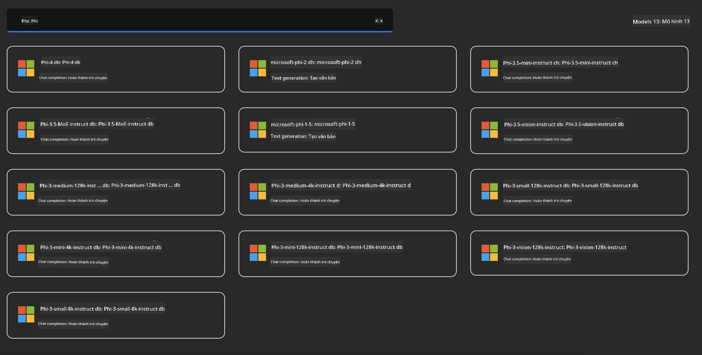
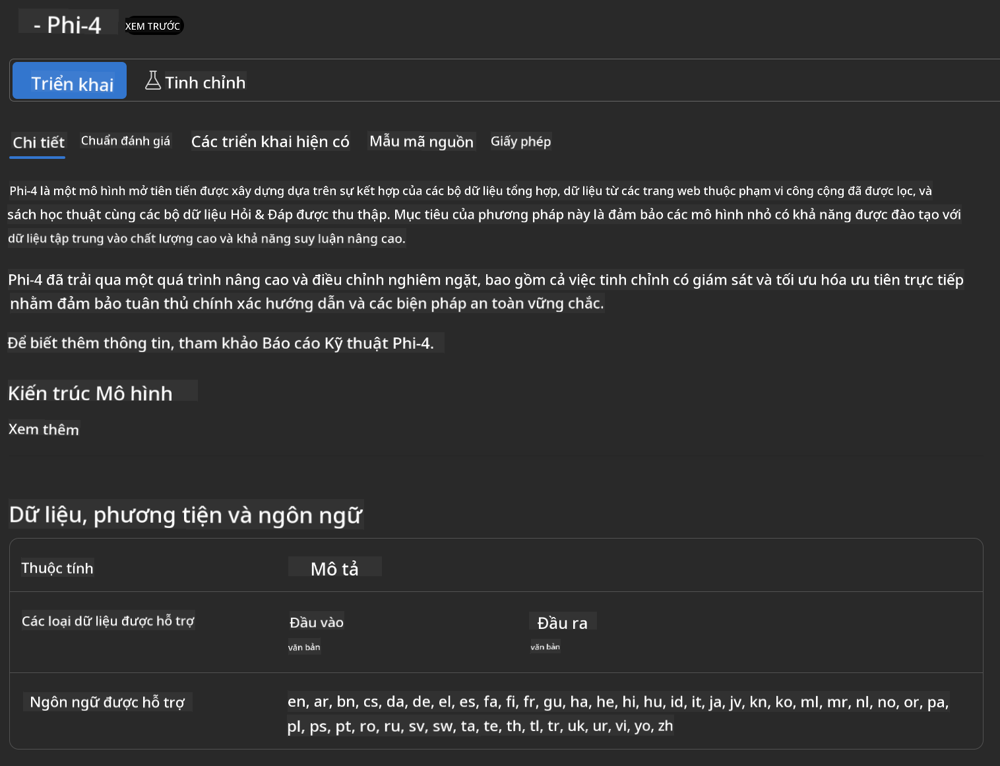
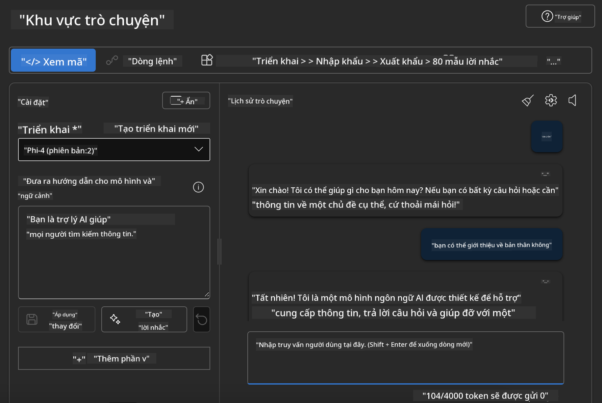

<!--
CO_OP_TRANSLATOR_METADATA:
{
  "original_hash": "3ae21dc5554e888defbe57946ee995ee",
  "translation_date": "2025-05-09T09:07:26+00:00",
  "source_file": "md/01.Introduction/02/03.AzureAIFoundry.md",
  "language_code": "vi"
}
-->
## Gia đình Phi trong Azure AI Foundry

[Azure AI Foundry](https://ai.azure.com) là một nền tảng đáng tin cậy giúp các nhà phát triển thúc đẩy đổi mới và định hình tương lai với AI một cách an toàn, bảo mật và có trách nhiệm.

[Azure AI Foundry](https://ai.azure.com) được thiết kế cho các nhà phát triển để:

- Xây dựng các ứng dụng AI tạo sinh trên nền tảng cấp doanh nghiệp.
- Khám phá, xây dựng, kiểm thử và triển khai bằng các công cụ AI tiên tiến và mô hình ML, dựa trên các thực hành AI có trách nhiệm.
- Hợp tác cùng nhóm trong toàn bộ vòng đời phát triển ứng dụng.

Với Azure AI Foundry, bạn có thể khám phá đa dạng các mô hình, dịch vụ và khả năng, đồng thời bắt đầu xây dựng các ứng dụng AI phù hợp nhất với mục tiêu của mình. Nền tảng Azure AI Foundry hỗ trợ khả năng mở rộng để biến các bản thử nghiệm thành các ứng dụng sản xuất hoàn chỉnh một cách dễ dàng. Việc giám sát và cải tiến liên tục giúp đảm bảo thành công lâu dài.


Ngoài việc sử dụng Azure AOAI Service trong Azure AI Foundry, bạn cũng có thể dùng các mô hình bên thứ ba trong Azure AI Foundry Model Catalog. Đây là lựa chọn tốt nếu bạn muốn dùng Azure AI Foundry làm nền tảng giải pháp AI của mình.

Chúng ta có thể nhanh chóng triển khai các mô hình Phi Family thông qua Model Catalog trong Azure AI Foundry

[Microsoft Phi Models in Azure AI Foundry Models](https://ai.azure.com/explore/models/?selectedCollection=phi)



### **Triển khai Phi-4 trong Azure AI Foundry**



### **Kiểm thử Phi-4 trong Azure AI Foundry Playground**



### **Chạy mã Python gọi Azure AI Foundry Phi-4**

```python

import os  
import base64
from openai import AzureOpenAI  
from azure.identity import DefaultAzureCredential, get_bearer_token_provider  
        
endpoint = os.getenv("ENDPOINT_URL", "Your Azure AOAI Service Endpoint")  
deployment = os.getenv("DEPLOYMENT_NAME", "Phi-4")  
      
token_provider = get_bearer_token_provider(  
    DefaultAzureCredential(),  
    "https://cognitiveservices.azure.com/.default"  
)  
  
client = AzureOpenAI(  
    azure_endpoint=endpoint,  
    azure_ad_token_provider=token_provider,  
    api_version="2024-05-01-preview",  
)  
  

chat_prompt = [
    {
        "role": "system",
        "content": "You are an AI assistant that helps people find information."
    },
    {
        "role": "user",
        "content": "can you introduce yourself"
    }
] 
    
# Include speech result if speech is enabled  
messages = chat_prompt 

completion = client.chat.completions.create(  
    model=deployment,  
    messages=messages,
    max_tokens=800,  
    temperature=0.7,  
    top_p=0.95,  
    frequency_penalty=0,  
    presence_penalty=0,
    stop=None,  
    stream=False  
)  
  
print(completion.to_json())  

```

**Tuyên bố miễn trừ trách nhiệm**:  
Tài liệu này đã được dịch bằng dịch vụ dịch thuật AI [Co-op Translator](https://github.com/Azure/co-op-translator). Mặc dù chúng tôi cố gắng đảm bảo độ chính xác, xin lưu ý rằng các bản dịch tự động có thể chứa lỗi hoặc sự không chính xác. Tài liệu gốc bằng ngôn ngữ bản địa nên được xem là nguồn tham khảo chính xác nhất. Đối với thông tin quan trọng, khuyến nghị sử dụng dịch vụ dịch thuật chuyên nghiệp của con người. Chúng tôi không chịu trách nhiệm về bất kỳ sự hiểu lầm hoặc giải thích sai nào phát sinh từ việc sử dụng bản dịch này.