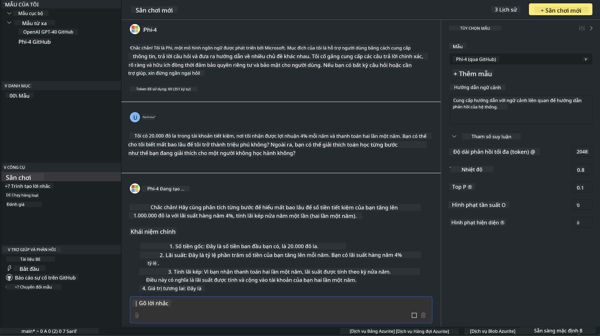

<!--
CO_OP_TRANSLATOR_METADATA:
{
  "original_hash": "4951d458c0b60c02cd1e751b40903877",
  "translation_date": "2025-07-16T19:28:16+00:00",
  "source_file": "md/01.Introduction/02/05.AITK.md",
  "language_code": "vi"
}
-->
# Phi Family trong AITK

[AI Toolkit for VS Code](https://marketplace.visualstudio.com/items?itemName=ms-windows-ai-studio.windows-ai-studio) giúp đơn giản hóa việc phát triển ứng dụng AI sinh tạo bằng cách tập hợp các công cụ và mô hình AI tiên tiến từ Azure AI Foundry Catalog và các catalog khác như Hugging Face. Bạn có thể duyệt catalog các mô hình AI được hỗ trợ bởi GitHub Models và Azure AI Foundry Model Catalogs, tải về cục bộ hoặc từ xa, tinh chỉnh, kiểm tra và sử dụng chúng trong ứng dụng của mình.

AI Toolkit Preview sẽ chạy cục bộ. Việc suy luận hoặc tinh chỉnh cục bộ tùy thuộc vào mô hình bạn chọn, bạn có thể cần GPU như NVIDIA CUDA GPU. Bạn cũng có thể chạy trực tiếp các GitHub Models với AITK.

## Bắt đầu

[Tìm hiểu thêm cách cài đặt Windows subsystem cho Linux](https://learn.microsoft.com/windows/wsl/install?WT.mc_id=aiml-137032-kinfeylo)

và [thay đổi bản phân phối mặc định](https://learn.microsoft.com/windows/wsl/install#change-the-default-linux-distribution-installed).

[Kho GitHub của AI Toolkit](https://github.com/microsoft/vscode-ai-toolkit/)

- Windows, Linux, macOS
  
- Để tinh chỉnh trên cả Windows và Linux, bạn cần có GPU Nvidia. Ngoài ra, **Windows** yêu cầu subsystem cho Linux với bản phân phối Ubuntu 18.4 trở lên. [Tìm hiểu thêm cách cài đặt Windows subsystem cho Linux](https://learn.microsoft.com/windows/wsl/install) và [thay đổi bản phân phối mặc định](https://learn.microsoft.com/windows/wsl/install#change-the-default-linux-distribution-installed).

### Cài đặt AI Toolkit

AI Toolkit được phát hành dưới dạng [Visual Studio Code Extension](https://code.visualstudio.com/docs/setup/additional-components#_vs-code-extensions), vì vậy bạn cần cài đặt [VS Code](https://code.visualstudio.com/docs/setup/windows?WT.mc_id=aiml-137032-kinfeylo) trước, sau đó tải AI Toolkit từ [VS Marketplace](https://marketplace.visualstudio.com/items?itemName=ms-windows-ai-studio.windows-ai-studio).  
[AI Toolkit có sẵn trên Visual Studio Marketplace](https://marketplace.visualstudio.com/items?itemName=ms-windows-ai-studio.windows-ai-studio) và có thể cài đặt như bất kỳ extension VS Code nào khác.

Nếu bạn chưa quen với việc cài đặt extension cho VS Code, hãy làm theo các bước sau:

### Đăng nhập

1. Trong Activity Bar của VS Code chọn **Extensions**  
1. Trong thanh tìm kiếm Extensions gõ "AI Toolkit"  
1. Chọn "AI Toolkit for Visual Studio code"  
1. Chọn **Install**

Bây giờ, bạn đã sẵn sàng sử dụng extension!

Bạn sẽ được yêu cầu đăng nhập vào GitHub, hãy nhấn "Allow" để tiếp tục. Bạn sẽ được chuyển hướng đến trang đăng nhập GitHub.

Vui lòng đăng nhập và làm theo các bước hướng dẫn. Sau khi hoàn tất thành công, bạn sẽ được chuyển về VS Code.

Khi extension đã được cài đặt, bạn sẽ thấy biểu tượng AI Toolkit xuất hiện trên Activity Bar.

Hãy cùng khám phá các tính năng có sẵn!

### Các hành động có sẵn

Thanh sidebar chính của AI Toolkit được tổ chức thành  

- **Models**  
- **Resources**  
- **Playground**  
- **Fine-tuning**  
- **Evaluation**

Có sẵn trong phần Resources. Để bắt đầu, chọn **Model Catalog**.

### Tải mô hình từ catalog

Khi khởi chạy AI Toolkit từ thanh bên của VS Code, bạn có thể chọn các tùy chọn sau:


- Tìm mô hình được hỗ trợ trong **Model Catalog** và tải về cục bộ  
- Kiểm tra suy luận mô hình trong **Model Playground**  
- Tinh chỉnh mô hình cục bộ hoặc từ xa trong **Model Fine-tuning**  
- Triển khai mô hình đã tinh chỉnh lên đám mây qua command palette của AI Toolkit  
- Đánh giá mô hình

> [!NOTE]
>
> **GPU Vs CPU**
>
> Bạn sẽ thấy các thẻ mô hình hiển thị kích thước mô hình, nền tảng và loại bộ tăng tốc (CPU, GPU). Để có hiệu suất tối ưu trên **thiết bị Windows có ít nhất một GPU**, hãy chọn các phiên bản mô hình chỉ dành cho Windows.
>
> Điều này đảm bảo bạn có mô hình được tối ưu cho bộ tăng tốc DirectML.
>
> Tên mô hình có định dạng
>
> - `{model_name}-{accelerator}-{quantization}-{format}`.
>
>Để kiểm tra xem thiết bị Windows của bạn có GPU hay không, mở **Task Manager** rồi chọn tab **Performance**. Nếu có GPU, chúng sẽ được liệt kê dưới tên như "GPU 0" hoặc "GPU 1".

### Chạy mô hình trong playground

Sau khi tất cả các tham số được thiết lập, nhấn **Generate Project**.

Khi mô hình đã được tải về, chọn **Load in Playground** trên thẻ mô hình trong catalog:

- Khởi tạo tải mô hình  
- Cài đặt tất cả các yêu cầu và phụ thuộc  
- Tạo workspace cho VS Code



### Sử dụng REST API trong ứng dụng của bạn

AI Toolkit đi kèm với một máy chủ web REST API cục bộ **trên cổng 5272** sử dụng định dạng [OpenAI chat completions](https://platform.openai.com/docs/api-reference/chat/create).

Điều này cho phép bạn kiểm tra ứng dụng cục bộ mà không cần phụ thuộc vào dịch vụ mô hình AI trên đám mây. Ví dụ, file JSON dưới đây cho thấy cách cấu hình phần thân của yêu cầu:

```json
{
    "model": "Phi-4",
    "messages": [
        {
            "role": "user",
            "content": "what is the golden ratio?"
        }
    ],
    "temperature": 0.7,
    "top_p": 1,
    "top_k": 10,
    "max_tokens": 100,
    "stream": true
}
```

Bạn có thể kiểm tra REST API bằng cách sử dụng (ví dụ) [Postman](https://www.postman.com/) hoặc tiện ích CURL (Client URL):

```bash
curl -vX POST http://127.0.0.1:5272/v1/chat/completions -H 'Content-Type: application/json' -d @body.json
```

### Sử dụng thư viện client OpenAI cho Python

```python
from openai import OpenAI

client = OpenAI(
    base_url="http://127.0.0.1:5272/v1/", 
    api_key="x" # required for the API but not used
)

chat_completion = client.chat.completions.create(
    messages=[
        {
            "role": "user",
            "content": "what is the golden ratio?",
        }
    ],
    model="Phi-4",
)

print(chat_completion.choices[0].message.content)
```

### Sử dụng thư viện client Azure OpenAI cho .NET

Thêm [thư viện client Azure OpenAI cho .NET](https://www.nuget.org/packages/Azure.AI.OpenAI/) vào dự án của bạn bằng NuGet:

```bash
dotnet add {project_name} package Azure.AI.OpenAI --version 1.0.0-beta.17
```

Thêm một file C# có tên **OverridePolicy.cs** vào dự án và dán đoạn mã sau:

```csharp
// OverridePolicy.cs
using Azure.Core.Pipeline;
using Azure.Core;

internal partial class OverrideRequestUriPolicy(Uri overrideUri)
    : HttpPipelineSynchronousPolicy
{
    private readonly Uri _overrideUri = overrideUri;

    public override void OnSendingRequest(HttpMessage message)
    {
        message.Request.Uri.Reset(_overrideUri);
    }
}
```

Tiếp theo, dán đoạn mã sau vào file **Program.cs** của bạn:

```csharp
// Program.cs
using Azure.AI.OpenAI;

Uri localhostUri = new("http://localhost:5272/v1/chat/completions");

OpenAIClientOptions clientOptions = new();
clientOptions.AddPolicy(
    new OverrideRequestUriPolicy(localhostUri),
    Azure.Core.HttpPipelinePosition.BeforeTransport);
OpenAIClient client = new(openAIApiKey: "unused", clientOptions);

ChatCompletionsOptions options = new()
{
    DeploymentName = "Phi-4",
    Messages =
    {
        new ChatRequestSystemMessage("You are a helpful assistant. Be brief and succinct."),
        new ChatRequestUserMessage("What is the golden ratio?"),
    }
};

StreamingResponse<StreamingChatCompletionsUpdate> streamingChatResponse
    = await client.GetChatCompletionsStreamingAsync(options);

await foreach (StreamingChatCompletionsUpdate chatChunk in streamingChatResponse)
{
    Console.Write(chatChunk.ContentUpdate);
}
```


## Tinh chỉnh với AI Toolkit

- Bắt đầu với việc khám phá mô hình và playground.  
- Tinh chỉnh mô hình và suy luận sử dụng tài nguyên tính toán cục bộ.  
- Tinh chỉnh và suy luận từ xa sử dụng tài nguyên Azure.

[Tinh chỉnh với AI Toolkit](../../03.FineTuning/Finetuning_VSCodeaitoolkit.md)

## Tài nguyên Hỏi & Đáp AI Toolkit

Vui lòng tham khảo [trang Hỏi & Đáp](https://github.com/microsoft/vscode-ai-toolkit/blob/main/archive/QA.md) của chúng tôi để biết các vấn đề phổ biến và cách giải quyết.

**Tuyên bố từ chối trách nhiệm**:  
Tài liệu này đã được dịch bằng dịch vụ dịch thuật AI [Co-op Translator](https://github.com/Azure/co-op-translator). Mặc dù chúng tôi cố gắng đảm bảo độ chính xác, xin lưu ý rằng các bản dịch tự động có thể chứa lỗi hoặc không chính xác. Tài liệu gốc bằng ngôn ngữ gốc của nó nên được coi là nguồn chính xác và đáng tin cậy. Đối với các thông tin quan trọng, nên sử dụng dịch vụ dịch thuật chuyên nghiệp do con người thực hiện. Chúng tôi không chịu trách nhiệm về bất kỳ sự hiểu lầm hoặc giải thích sai nào phát sinh từ việc sử dụng bản dịch này.