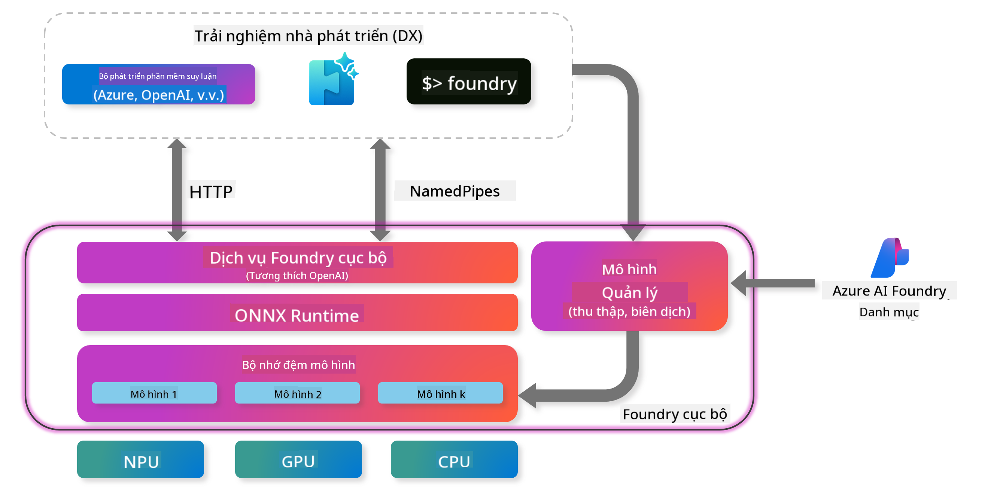
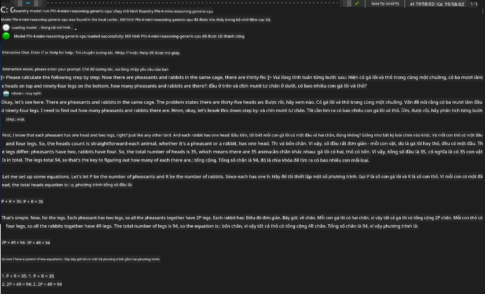

<!--
CO_OP_TRANSLATOR_METADATA:
{
  "original_hash": "52973a5680a65a810aa80b7036afd31f",
  "translation_date": "2025-07-16T19:48:50+00:00",
  "source_file": "md/01.Introduction/02/07.FoundryLocal.md",
  "language_code": "vi"
}
-->
## Bắt Đầu Với Các Mô Hình Phi-Family trong Foundry Local

### Giới Thiệu về Foundry Local

Foundry Local là giải pháp suy luận AI mạnh mẽ ngay trên thiết bị, mang đến khả năng AI cấp doanh nghiệp trực tiếp trên phần cứng cục bộ của bạn. Hướng dẫn này sẽ giúp bạn thiết lập và sử dụng các mô hình Phi-Family với Foundry Local, cho phép bạn kiểm soát hoàn toàn các tác vụ AI đồng thời bảo vệ quyền riêng tư và giảm chi phí.

Foundry Local cung cấp hiệu suất, bảo mật, tùy biến và tiết kiệm chi phí bằng cách chạy các mô hình AI ngay trên thiết bị của bạn. Nó tích hợp mượt mà vào quy trình và ứng dụng hiện có thông qua CLI, SDK và REST API trực quan.



### Tại Sao Chọn Foundry Local?

Hiểu rõ lợi ích của Foundry Local sẽ giúp bạn đưa ra quyết định đúng đắn cho chiến lược triển khai AI của mình:

- **Suy luận trên thiết bị:** Chạy mô hình ngay trên phần cứng của bạn, giảm chi phí đồng thời giữ toàn bộ dữ liệu trên thiết bị.

- **Tùy biến mô hình:** Chọn từ các mô hình có sẵn hoặc sử dụng mô hình riêng để đáp ứng yêu cầu và trường hợp sử dụng cụ thể.

- **Tiết kiệm chi phí:** Loại bỏ chi phí dịch vụ đám mây định kỳ bằng cách tận dụng phần cứng hiện có, giúp AI trở nên dễ tiếp cận hơn.

- **Tích hợp liền mạch:** Kết nối với ứng dụng của bạn qua SDK, API hoặc CLI, dễ dàng mở rộng lên Azure AI Foundry khi nhu cầu tăng.

> **Lưu ý Bắt Đầu:** Hướng dẫn này tập trung vào việc sử dụng Foundry Local qua giao diện CLI và SDK. Bạn sẽ học cả hai cách để chọn phương pháp phù hợp nhất với trường hợp của mình.

## Phần 1: Thiết Lập Foundry Local CLI

### Bước 1: Cài Đặt

Foundry Local CLI là cổng vào để quản lý và chạy các mô hình AI ngay trên thiết bị. Hãy bắt đầu bằng cách cài đặt nó trên hệ thống của bạn.

**Nền tảng hỗ trợ:** Windows và macOS

Để biết hướng dẫn cài đặt chi tiết, vui lòng tham khảo [tài liệu chính thức của Foundry Local](https://github.com/microsoft/Foundry-Local/blob/main/README.md).

### Bước 2: Khám Phá Các Mô Hình Có Sẵn

Sau khi cài đặt Foundry Local CLI, bạn có thể khám phá các mô hình phù hợp với trường hợp sử dụng của mình. Lệnh sau sẽ hiển thị tất cả các mô hình được hỗ trợ:

```bash
foundry model list
```

### Bước 3: Hiểu Về Các Mô Hình Phi Family

Phi Family cung cấp nhiều mô hình được tối ưu cho các trường hợp sử dụng và cấu hình phần cứng khác nhau. Dưới đây là các mô hình Phi có trong Foundry Local:

**Các mô hình Phi có sẵn:**

- **phi-3.5-mini** - Mô hình nhỏ gọn cho các tác vụ cơ bản
- **phi-3-mini-128k** - Phiên bản mở rộng ngữ cảnh cho các cuộc hội thoại dài hơn
- **phi-3-mini-4k** - Mô hình ngữ cảnh tiêu chuẩn cho mục đích chung
- **phi-4** - Mô hình nâng cao với khả năng cải tiến
- **phi-4-mini** - Phiên bản nhẹ của Phi-4
- **phi-4-mini-reasoning** - Chuyên biệt cho các tác vụ suy luận phức tạp

> **Tương thích phần cứng:** Mỗi mô hình có thể được cấu hình để sử dụng tăng tốc phần cứng khác nhau (CPU, GPU) tùy theo khả năng hệ thống của bạn.

### Bước 4: Chạy Mô Hình Phi Đầu Tiên

Hãy bắt đầu với ví dụ thực tế. Chúng ta sẽ chạy mô hình `phi-4-mini-reasoning`, nổi bật trong việc giải quyết các vấn đề phức tạp theo từng bước.

**Lệnh chạy mô hình:**

```bash
foundry model run Phi-4-mini-reasoning-generic-cpu
```

> **Thiết lập lần đầu:** Khi chạy mô hình lần đầu, Foundry Local sẽ tự động tải mô hình về thiết bị của bạn. Thời gian tải phụ thuộc vào tốc độ mạng, vui lòng kiên nhẫn trong quá trình thiết lập ban đầu.

### Bước 5: Kiểm Tra Mô Hình Với Vấn Đề Thực Tế

Bây giờ hãy thử mô hình với một bài toán logic kinh điển để xem cách nó thực hiện suy luận từng bước:

**Ví dụ bài toán:**

```txt
Please calculate the following step by step: Now there are pheasants and rabbits in the same cage, there are thirty-five heads on top and ninety-four legs on the bottom, how many pheasants and rabbits are there?
```

**Hành vi mong đợi:** Mô hình sẽ phân tích bài toán thành các bước logic, sử dụng thông tin rằng chim trĩ có 2 chân và thỏ có 4 chân để giải hệ phương trình.

**Kết quả:**



## Phần 2: Xây Dựng Ứng Dụng Với Foundry Local SDK

### Tại Sao Dùng SDK?

Trong khi CLI rất phù hợp để thử nghiệm và tương tác nhanh, SDK cho phép bạn tích hợp Foundry Local vào ứng dụng một cách lập trình. Điều này mở ra các khả năng:

- Xây dựng ứng dụng AI tùy chỉnh
- Tạo quy trình làm việc tự động
- Tích hợp khả năng AI vào hệ thống hiện có
- Phát triển chatbot và công cụ tương tác

### Ngôn Ngữ Lập Trình Hỗ Trợ

Foundry Local cung cấp SDK cho nhiều ngôn ngữ lập trình để phù hợp với sở thích phát triển của bạn:

**📦 Các SDK có sẵn:**

- **C# (.NET):** [Tài liệu & Ví dụ SDK](https://github.com/microsoft/Foundry-Local/tree/main/sdk/cs)
- **Python:** [Tài liệu & Ví dụ SDK](https://github.com/microsoft/Foundry-Local/tree/main/sdk/python)
- **JavaScript:** [Tài liệu & Ví dụ SDK](https://github.com/microsoft/Foundry-Local/tree/main/sdk/js)
- **Rust:** [Tài liệu & Ví dụ SDK](https://github.com/microsoft/Foundry-Local/tree/main/sdk/rust)

### Các Bước Tiếp Theo

1. **Chọn SDK phù hợp** với môi trường phát triển của bạn
2. **Theo dõi tài liệu riêng của SDK** để có hướng dẫn triển khai chi tiết
3. **Bắt đầu với các ví dụ đơn giản** trước khi xây dựng ứng dụng phức tạp
4. **Khám phá mã mẫu** có trong từng kho SDK

## Kết Luận

Bạn đã học được cách:
- ✅ Cài đặt và thiết lập Foundry Local CLI
- ✅ Khám phá và chạy các mô hình Phi Family
- ✅ Kiểm tra mô hình với các bài toán thực tế
- ✅ Hiểu các lựa chọn SDK để phát triển ứng dụng

Foundry Local cung cấp nền tảng mạnh mẽ để đưa khả năng AI trực tiếp vào môi trường cục bộ của bạn, giúp bạn kiểm soát hiệu suất, bảo mật và chi phí đồng thời giữ được sự linh hoạt để mở rộng lên các giải pháp đám mây khi cần thiết.

**Tuyên bố từ chối trách nhiệm**:  
Tài liệu này đã được dịch bằng dịch vụ dịch thuật AI [Co-op Translator](https://github.com/Azure/co-op-translator). Mặc dù chúng tôi cố gắng đảm bảo độ chính xác, xin lưu ý rằng các bản dịch tự động có thể chứa lỗi hoặc không chính xác. Tài liệu gốc bằng ngôn ngữ gốc của nó nên được coi là nguồn chính xác và đáng tin cậy. Đối với các thông tin quan trọng, nên sử dụng dịch vụ dịch thuật chuyên nghiệp do con người thực hiện. Chúng tôi không chịu trách nhiệm về bất kỳ sự hiểu lầm hoặc giải thích sai nào phát sinh từ việc sử dụng bản dịch này.