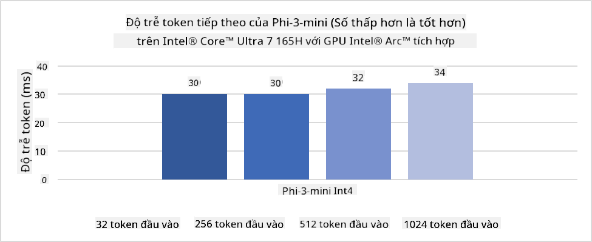
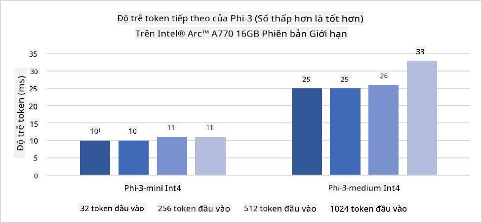
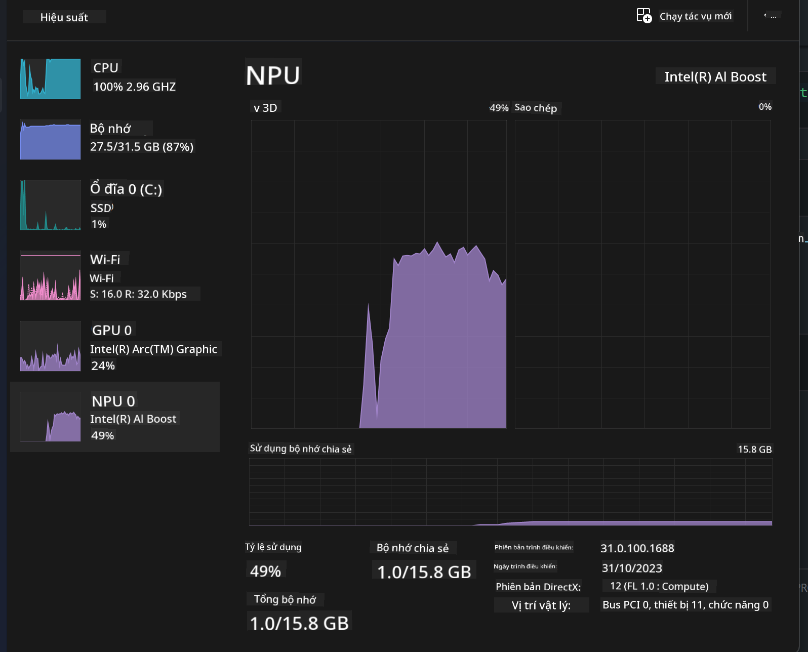
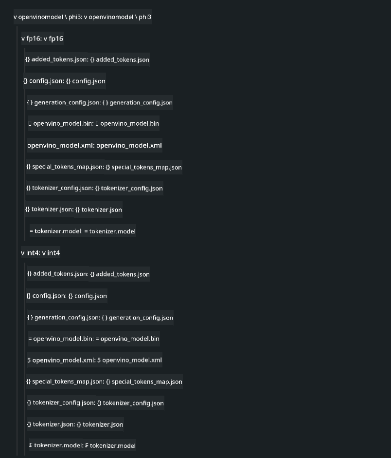
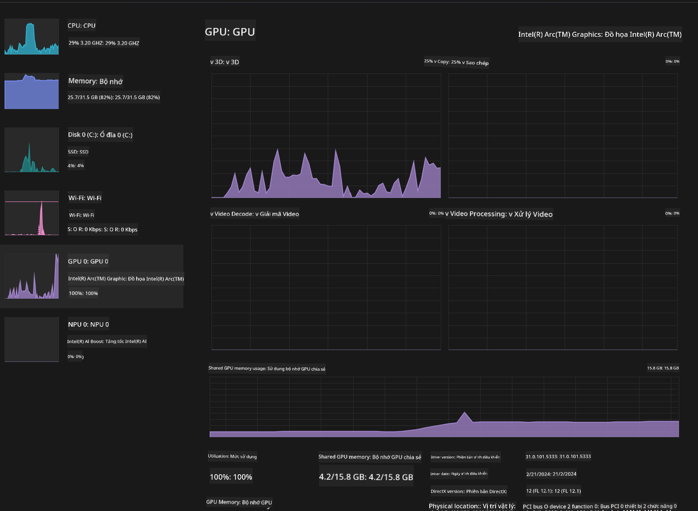

<!--
CO_OP_TRANSLATOR_METADATA:
{
  "original_hash": "e08ce816e23ad813244a09ca34ebb8ac",
  "translation_date": "2025-07-16T20:04:32+00:00",
  "source_file": "md/01.Introduction/03/AIPC_Inference.md",
  "language_code": "vi"
}
-->
# **Inference Phi-3 trên AI PC**

Với sự phát triển của AI tạo sinh và cải tiến về khả năng phần cứng của các thiết bị biên, ngày càng nhiều mô hình AI tạo sinh có thể được tích hợp vào các thiết bị Bring Your Own Device (BYOD) của người dùng. AI PC là một trong những mô hình đó. Bắt đầu từ năm 2024, Intel, AMD và Qualcomm đã hợp tác với các nhà sản xuất PC để giới thiệu AI PC, giúp triển khai các mô hình AI tạo sinh cục bộ thông qua các thay đổi phần cứng. Trong bài viết này, chúng ta sẽ tập trung vào AI PC của Intel và khám phá cách triển khai Phi-3 trên AI PC Intel.

### NPU là gì

NPU (Neural Processing Unit) là một bộ xử lý chuyên dụng hoặc đơn vị xử lý trên một SoC lớn hơn, được thiết kế đặc biệt để tăng tốc các phép toán mạng nơ-ron và các tác vụ AI. Khác với CPU và GPU đa năng, NPU được tối ưu cho tính toán song song dựa trên dữ liệu, giúp xử lý hiệu quả các dữ liệu đa phương tiện lớn như video và hình ảnh, cũng như xử lý dữ liệu cho mạng nơ-ron. Chúng đặc biệt giỏi trong các tác vụ liên quan đến AI, như nhận dạng giọng nói, làm mờ nền trong cuộc gọi video, và các quy trình chỉnh sửa ảnh hoặc video như phát hiện đối tượng.

## NPU và GPU khác nhau thế nào

Mặc dù nhiều tác vụ AI và học máy chạy trên GPU, nhưng có sự khác biệt quan trọng giữa GPU và NPU.  
GPU nổi tiếng với khả năng tính toán song song, nhưng không phải GPU nào cũng hiệu quả khi xử lý ngoài đồ họa. Trong khi đó, NPU được thiết kế riêng cho các phép tính phức tạp trong mạng nơ-ron, giúp chúng rất hiệu quả cho các tác vụ AI.

Tóm lại, NPU là những "bậc thầy toán học" giúp tăng tốc các phép tính AI, và chúng đóng vai trò then chốt trong kỷ nguyên AI PC đang nổi lên!

***Ví dụ này dựa trên bộ xử lý Intel Core Ultra mới nhất của Intel***

## **1. Sử dụng NPU để chạy mô hình Phi-3**

Thiết bị Intel® NPU là bộ tăng tốc suy luận AI tích hợp với CPU Intel dành cho khách hàng, bắt đầu từ thế hệ CPU Intel® Core™ Ultra (trước đây gọi là Meteor Lake). Nó cho phép thực thi các tác vụ mạng nơ-ron nhân tạo với hiệu quả năng lượng cao.





**Thư viện tăng tốc Intel NPU**

Thư viện Intel NPU Acceleration Library [https://github.com/intel/intel-npu-acceleration-library](https://github.com/intel/intel-npu-acceleration-library) là một thư viện Python được thiết kế để tăng hiệu quả cho ứng dụng của bạn bằng cách tận dụng sức mạnh của Intel Neural Processing Unit (NPU) để thực hiện các phép tính tốc độ cao trên phần cứng tương thích.

Ví dụ về Phi-3-mini trên AI PC chạy bộ xử lý Intel® Core™ Ultra.


Cài đặt thư viện Python bằng pip

```bash

   pip install intel-npu-acceleration-library

```

***Lưu ý*** Dự án vẫn đang trong quá trình phát triển, nhưng mô hình tham khảo đã khá hoàn chỉnh.

### **Chạy Phi-3 với thư viện Intel NPU Acceleration**

Khi sử dụng tăng tốc Intel NPU, thư viện này không ảnh hưởng đến quá trình mã hóa truyền thống. Bạn chỉ cần dùng thư viện này để lượng tử hóa mô hình Phi-3 gốc, ví dụ như FP16, INT8, INT4, như sau

```python
from transformers import AutoTokenizer, pipeline,TextStreamer
from intel_npu_acceleration_library import NPUModelForCausalLM, int4
from intel_npu_acceleration_library.compiler import CompilerConfig
import warnings

model_id = "microsoft/Phi-3-mini-4k-instruct"

compiler_conf = CompilerConfig(dtype=int4)
model = NPUModelForCausalLM.from_pretrained(
    model_id, use_cache=True, config=compiler_conf, attn_implementation="sdpa"
).eval()

tokenizer = AutoTokenizer.from_pretrained(model_id)

text_streamer = TextStreamer(tokenizer, skip_prompt=True)
```

Sau khi lượng tử hóa thành công, tiếp tục thực thi để gọi NPU chạy mô hình Phi-3.

```python
generation_args = {
   "max_new_tokens": 1024,
   "return_full_text": False,
   "temperature": 0.3,
   "do_sample": False,
   "streamer": text_streamer,
}

pipe = pipeline(
   "text-generation",
   model=model,
   tokenizer=tokenizer,
)

query = "<|system|>You are a helpful AI assistant.<|end|><|user|>Can you introduce yourself?<|end|><|assistant|>"

with warnings.catch_warnings():
    warnings.simplefilter("ignore")
    pipe(query, **generation_args)
```

Khi chạy mã, bạn có thể xem trạng thái hoạt động của NPU qua Task Manager



***Ví dụ mẫu*** : [AIPC_NPU_DEMO.ipynb](../../../../../code/03.Inference/AIPC/AIPC_NPU_DEMO.ipynb)

## **2. Sử dụng DirectML + ONNX Runtime để chạy mô hình Phi-3**

### **DirectML là gì**

[DirectML](https://github.com/microsoft/DirectML) là thư viện DirectX 12 tăng tốc phần cứng hiệu suất cao dành cho học máy. DirectML cung cấp tăng tốc GPU cho các tác vụ học máy phổ biến trên nhiều phần cứng và driver được hỗ trợ, bao gồm tất cả GPU hỗ trợ DirectX 12 từ các nhà cung cấp như AMD, Intel, NVIDIA và Qualcomm.

Khi sử dụng độc lập, API DirectML là thư viện DirectX 12 cấp thấp, phù hợp cho các ứng dụng hiệu suất cao, độ trễ thấp như framework, game và các ứng dụng thời gian thực khác. Khả năng tương tác liền mạch của DirectML với Direct3D 12 cùng với chi phí thấp và tính tương thích trên nhiều phần cứng khiến DirectML trở thành lựa chọn lý tưởng để tăng tốc học máy khi cần hiệu suất cao và độ tin cậy, dự đoán được kết quả trên nhiều phần cứng.

***Lưu ý*** : DirectML mới nhất đã hỗ trợ NPU (https://devblogs.microsoft.com/directx/introducing-neural-processor-unit-npu-support-in-directml-developer-preview/)

### So sánh DirectML và CUDA về khả năng và hiệu suất:

**DirectML** là thư viện học máy do Microsoft phát triển, được thiết kế để tăng tốc các tác vụ học máy trên các thiết bị Windows, bao gồm desktop, laptop và thiết bị biên.  
- Dựa trên DX12: DirectML xây dựng trên DirectX 12 (DX12), hỗ trợ rộng rãi phần cứng GPU, bao gồm cả NVIDIA và AMD.  
- Hỗ trợ rộng hơn: Vì dựa trên DX12, DirectML có thể chạy trên bất kỳ GPU nào hỗ trợ DX12, kể cả GPU tích hợp.  
- Xử lý hình ảnh: DirectML xử lý hình ảnh và dữ liệu khác bằng mạng nơ-ron, phù hợp cho các tác vụ như nhận dạng hình ảnh, phát hiện đối tượng, v.v.  
- Dễ thiết lập: Việc thiết lập DirectML khá đơn giản, không yêu cầu SDK hay thư viện đặc thù từ nhà sản xuất GPU.  
- Hiệu suất: Trong một số trường hợp, DirectML hoạt động tốt và có thể nhanh hơn CUDA, đặc biệt với một số loại tác vụ.  
- Hạn chế: Tuy nhiên, có những trường hợp DirectML chậm hơn, nhất là với các batch lớn float16.

**CUDA** là nền tảng tính toán song song và mô hình lập trình của NVIDIA, cho phép các nhà phát triển tận dụng sức mạnh GPU NVIDIA cho tính toán đa mục đích, bao gồm học máy và mô phỏng khoa học.  
- Chỉ dành cho NVIDIA: CUDA tích hợp chặt chẽ với GPU NVIDIA và được thiết kế riêng cho chúng.  
- Tối ưu cao: Cung cấp hiệu suất xuất sắc cho các tác vụ tăng tốc GPU, đặc biệt trên GPU NVIDIA.  
- Phổ biến: Nhiều framework và thư viện học máy (như TensorFlow, PyTorch) hỗ trợ CUDA.  
- Tùy chỉnh: Nhà phát triển có thể tinh chỉnh các thiết lập CUDA cho từng tác vụ, giúp đạt hiệu suất tối ưu.  
- Hạn chế: Tuy nhiên, CUDA phụ thuộc vào phần cứng NVIDIA, hạn chế khả năng tương thích với các GPU khác.

### Lựa chọn giữa DirectML và CUDA

Việc chọn DirectML hay CUDA phụ thuộc vào trường hợp sử dụng cụ thể, phần cứng có sẵn và sở thích cá nhân.  
Nếu bạn cần khả năng tương thích rộng và dễ thiết lập, DirectML là lựa chọn tốt. Tuy nhiên, nếu bạn có GPU NVIDIA và cần hiệu suất tối ưu, CUDA vẫn là lựa chọn mạnh mẽ. Tóm lại, cả DirectML và CUDA đều có điểm mạnh và hạn chế riêng, hãy cân nhắc yêu cầu và phần cứng của bạn khi quyết định.

### **AI tạo sinh với ONNX Runtime**

Trong kỷ nguyên AI, tính di động của các mô hình AI rất quan trọng. ONNX Runtime giúp dễ dàng triển khai các mô hình đã huấn luyện trên nhiều thiết bị khác nhau. Nhà phát triển không cần quan tâm đến framework suy luận mà chỉ dùng API thống nhất để hoàn thành suy luận mô hình. Trong kỷ nguyên AI tạo sinh, ONNX Runtime cũng đã thực hiện tối ưu mã (https://onnxruntime.ai/docs/genai/). Qua ONNX Runtime được tối ưu, mô hình AI tạo sinh đã lượng tử hóa có thể suy luận trên nhiều thiết bị khác nhau. Với Generative AI cùng ONNX Runtime, bạn có thể gọi API mô hình AI qua Python, C#, C/C++. Tất nhiên, triển khai trên iPhone có thể tận dụng API Generative AI với ONNX Runtime bằng C++.

[Mã mẫu](https://github.com/Azure-Samples/Phi-3MiniSamples/tree/main/onnx)

***Biên dịch thư viện generative AI với ONNX Runtime***

```bash

winget install --id=Kitware.CMake  -e

git clone https://github.com/microsoft/onnxruntime.git

cd .\onnxruntime\

./build.bat --build_shared_lib --skip_tests --parallel --use_dml --config Release

cd ../

git clone https://github.com/microsoft/onnxruntime-genai.git

cd .\onnxruntime-genai\

mkdir ort

cd ort

mkdir include

mkdir lib

copy ..\onnxruntime\include\onnxruntime\core\providers\dml\dml_provider_factory.h ort\include

copy ..\onnxruntime\include\onnxruntime\core\session\onnxruntime_c_api.h ort\include

copy ..\onnxruntime\build\Windows\Release\Release\*.dll ort\lib

copy ..\onnxruntime\build\Windows\Release\Release\onnxruntime.lib ort\lib

python build.py --use_dml


```

**Cài đặt thư viện**

```bash

pip install .\onnxruntime_genai_directml-0.3.0.dev0-cp310-cp310-win_amd64.whl

```

Kết quả chạy như sau


***Ví dụ mẫu*** : [AIPC_DirectML_DEMO.ipynb](../../../../../code/03.Inference/AIPC/AIPC_DirectML_DEMO.ipynb)

## **3. Sử dụng Intel OpenVino để chạy mô hình Phi-3**

### **OpenVINO là gì**

[OpenVINO](https://github.com/openvinotoolkit/openvino) là bộ công cụ mã nguồn mở để tối ưu và triển khai các mô hình học sâu. Nó tăng hiệu suất học sâu cho các mô hình thị giác, âm thanh và ngôn ngữ từ các framework phổ biến như TensorFlow, PyTorch và nhiều hơn nữa. Bắt đầu với OpenVINO. OpenVINO cũng có thể kết hợp CPU và GPU để chạy mô hình Phi-3.

***Lưu ý***: Hiện tại, OpenVINO chưa hỗ trợ NPU.

### **Cài đặt thư viện OpenVINO**

```bash

 pip install git+https://github.com/huggingface/optimum-intel.git

 pip install git+https://github.com/openvinotoolkit/nncf.git

 pip install openvino-nightly

```

### **Chạy Phi-3 với OpenVINO**

Tương tự NPU, OpenVINO thực hiện gọi mô hình AI tạo sinh bằng cách chạy mô hình đã lượng tử hóa. Chúng ta cần lượng tử hóa mô hình Phi-3 trước và hoàn thành lượng tử hóa trên dòng lệnh qua optimum-cli

**INT4**

```bash

optimum-cli export openvino --model "microsoft/Phi-3-mini-4k-instruct" --task text-generation-with-past --weight-format int4 --group-size 128 --ratio 0.6  --sym  --trust-remote-code ./openvinomodel/phi3/int4

```

**FP16**

```bash

optimum-cli export openvino --model "microsoft/Phi-3-mini-4k-instruct" --task text-generation-with-past --weight-format fp16 --trust-remote-code ./openvinomodel/phi3/fp16

```

định dạng chuyển đổi sẽ như thế này



Tải đường dẫn mô hình (model_dir), cấu hình liên quan (ov_config = {"PERFORMANCE_HINT": "LATENCY", "NUM_STREAMS": "1", "CACHE_DIR": ""}), và thiết bị tăng tốc phần cứng (GPU.0) qua OVModelForCausalLM

```python

ov_model = OVModelForCausalLM.from_pretrained(
     model_dir,
     device='GPU.0',
     ov_config=ov_config,
     config=AutoConfig.from_pretrained(model_dir, trust_remote_code=True),
     trust_remote_code=True,
)

```

Khi chạy mã, bạn có thể xem trạng thái hoạt động của GPU qua Task Manager



***Ví dụ mẫu*** : [AIPC_OpenVino_Demo.ipynb](../../../../../code/03.Inference/AIPC/AIPC_OpenVino_Demo.ipynb)

### ***Lưu ý*** : Ba phương pháp trên đều có ưu điểm riêng, nhưng khuyến nghị sử dụng tăng tốc NPU cho suy luận trên AI PC.

**Tuyên bố từ chối trách nhiệm**:  
Tài liệu này đã được dịch bằng dịch vụ dịch thuật AI [Co-op Translator](https://github.com/Azure/co-op-translator). Mặc dù chúng tôi cố gắng đảm bảo độ chính xác, xin lưu ý rằng các bản dịch tự động có thể chứa lỗi hoặc không chính xác. Tài liệu gốc bằng ngôn ngữ gốc của nó nên được coi là nguồn chính xác và đáng tin cậy. Đối với các thông tin quan trọng, nên sử dụng dịch vụ dịch thuật chuyên nghiệp do con người thực hiện. Chúng tôi không chịu trách nhiệm về bất kỳ sự hiểu lầm hoặc giải thích sai nào phát sinh từ việc sử dụng bản dịch này.