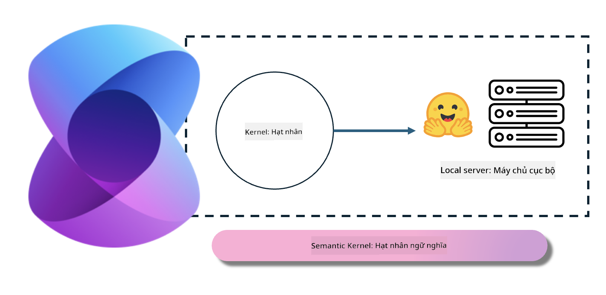
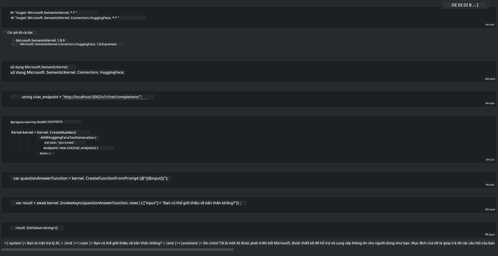

<!--
CO_OP_TRANSLATOR_METADATA:
{
  "original_hash": "bcf5dd7031db0031abdb9dd0c05ba118",
  "translation_date": "2025-05-09T12:06:39+00:00",
  "source_file": "md/01.Introduction/03/Local_Server_Inference.md",
  "language_code": "vi"
}
-->
# **Triển khai Phi-3 trên Máy chủ Cục bộ**

Chúng ta có thể triển khai Phi-3 trên một máy chủ cục bộ. Người dùng có thể chọn giải pháp [Ollama](https://ollama.com) hoặc [LM Studio](https://llamaedge.com), hoặc tự viết mã riêng. Bạn có thể kết nối dịch vụ cục bộ của Phi-3 thông qua [Semantic Kernel](https://github.com/microsoft/semantic-kernel?WT.mc_id=aiml-138114-kinfeylo) hoặc [Langchain](https://www.langchain.com/) để xây dựng các ứng dụng Copilot.

## **Sử dụng Semantic Kernel để truy cập Phi-3-mini**

Trong ứng dụng Copilot, chúng ta tạo các ứng dụng thông qua Semantic Kernel / LangChain. Khung ứng dụng này thường tương thích với Azure OpenAI Service / các mô hình OpenAI, đồng thời cũng hỗ trợ các mô hình mã nguồn mở trên Hugging Face và các mô hình cục bộ. Nếu muốn dùng Semantic Kernel để truy cập Phi-3-mini thì sao? Lấy ví dụ với .NET, ta có thể kết hợp với Hugging Face Connector trong Semantic Kernel. Mặc định, nó sẽ tương ứng với model id trên Hugging Face (lần đầu sử dụng, model sẽ được tải từ Hugging Face, mất khá nhiều thời gian). Bạn cũng có thể kết nối với dịch vụ cục bộ tự xây dựng. So với hai cách trên, chúng tôi khuyến nghị dùng cách thứ hai vì có độ tự chủ cao hơn, đặc biệt trong các ứng dụng doanh nghiệp.

Từ hình trên, việc truy cập dịch vụ cục bộ qua Semantic Kernel có thể dễ dàng kết nối với server mô hình Phi-3-mini tự xây dựng. Dưới đây là kết quả chạy thử.

***Sample Code*** https://github.com/kinfey/Phi3MiniSamples/tree/main/semantickernel

**Tuyên bố miễn trách nhiệm**:  
Tài liệu này đã được dịch bằng dịch vụ dịch thuật AI [Co-op Translator](https://github.com/Azure/co-op-translator). Mặc dù chúng tôi cố gắng đảm bảo độ chính xác, xin lưu ý rằng các bản dịch tự động có thể chứa lỗi hoặc không chính xác. Tài liệu gốc bằng ngôn ngữ gốc nên được xem là nguồn tham khảo chính thức. Đối với thông tin quan trọng, nên sử dụng dịch vụ dịch thuật chuyên nghiệp do con người thực hiện. Chúng tôi không chịu trách nhiệm về bất kỳ sự hiểu lầm hoặc giải thích sai nào phát sinh từ việc sử dụng bản dịch này.