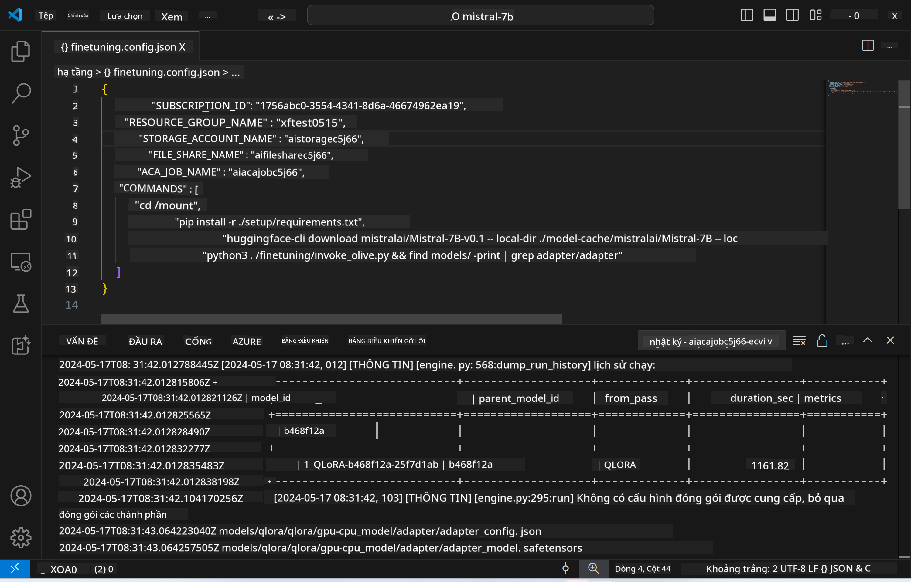
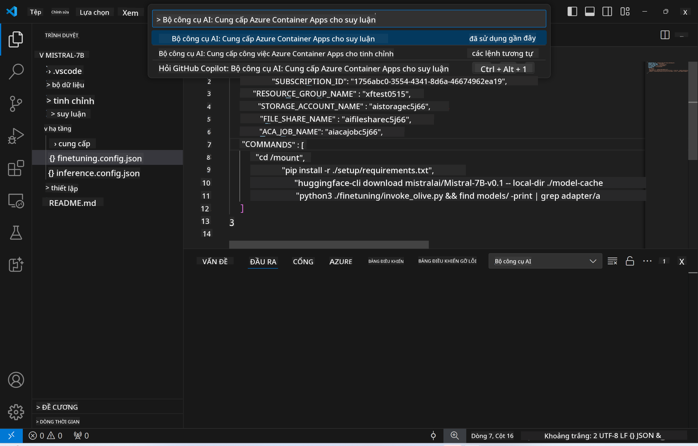
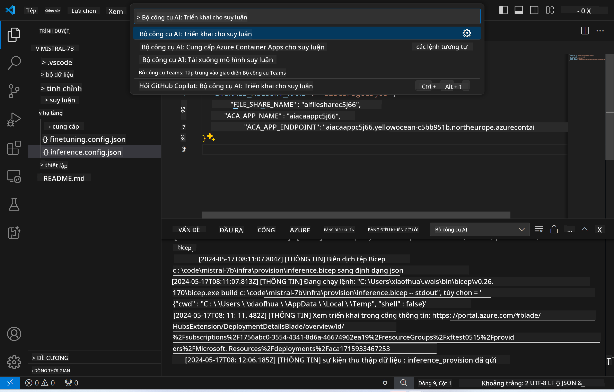
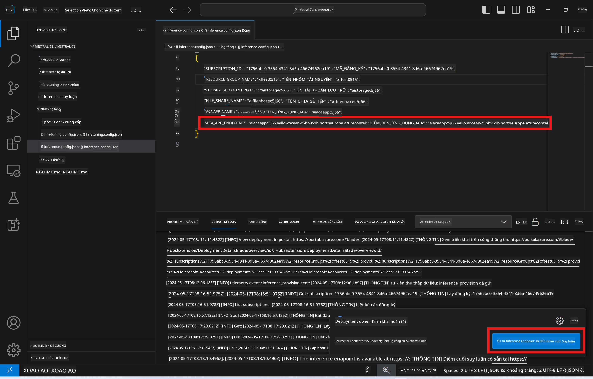

<!--
CO_OP_TRANSLATOR_METADATA:
{
  "original_hash": "a54cd3d65b6963e4e8ce21e143c3ab04",
  "translation_date": "2025-07-16T21:20:39+00:00",
  "source_file": "md/01.Introduction/03/Remote_Interence.md",
  "language_code": "vi"
}
-->
# Suy luận từ xa với mô hình đã tinh chỉnh

Sau khi các adapter được huấn luyện trong môi trường từ xa, hãy sử dụng một ứng dụng Gradio đơn giản để tương tác với mô hình.



### Cấp phát tài nguyên Azure  
Bạn cần thiết lập các tài nguyên Azure cho suy luận từ xa bằng cách thực thi lệnh `AI Toolkit: Provision Azure Container Apps for inference` từ bảng lệnh. Trong quá trình thiết lập này, bạn sẽ được yêu cầu chọn Azure Subscription và nhóm tài nguyên của mình.  


Mặc định, subscription và nhóm tài nguyên cho suy luận nên trùng với những cái đã dùng cho bước tinh chỉnh. Quá trình suy luận sẽ sử dụng cùng một Azure Container App Environment và truy cập mô hình cùng adapter mô hình được lưu trong Azure Files, được tạo ra trong bước tinh chỉnh.

## Sử dụng AI Toolkit

### Triển khai cho suy luận  
Nếu bạn muốn chỉnh sửa mã suy luận hoặc tải lại mô hình suy luận, hãy thực thi lệnh `AI Toolkit: Deploy for inference`. Lệnh này sẽ đồng bộ mã mới nhất của bạn với ACA và khởi động lại bản sao.



Sau khi triển khai thành công, mô hình đã sẵn sàng để đánh giá qua endpoint này.

### Truy cập API suy luận

Bạn có thể truy cập API suy luận bằng cách nhấn nút "*Go to Inference Endpoint*" hiển thị trong thông báo của VSCode. Ngoài ra, endpoint web API có thể được tìm thấy trong `ACA_APP_ENDPOINT` ở file `./infra/inference.config.json` và trong bảng đầu ra.



> **Note:** Endpoint suy luận có thể mất vài phút để hoạt động hoàn toàn.

## Các thành phần suy luận có trong mẫu

| Thư mục | Nội dung |
| ------ |--------- |
| `infra` | Chứa tất cả cấu hình cần thiết cho hoạt động từ xa. |
| `infra/provision/inference.parameters.json` | Chứa các tham số cho các mẫu bicep, dùng để cấp phát tài nguyên Azure cho suy luận. |
| `infra/provision/inference.bicep` | Chứa các mẫu để cấp phát tài nguyên Azure cho suy luận. |
| `infra/inference.config.json` | File cấu hình, được tạo ra bởi lệnh `AI Toolkit: Provision Azure Container Apps for inference`. Dùng làm đầu vào cho các lệnh từ xa khác. |

### Sử dụng AI Toolkit để cấu hình cấp phát tài nguyên Azure  
Cấu hình [AI Toolkit](https://marketplace.visualstudio.com/items?itemName=ms-windows-ai-studio.windows-ai-studio)

Lệnh `Provision Azure Container Apps for inference`.

Bạn có thể tìm các tham số cấu hình trong file `./infra/provision/inference.parameters.json`. Chi tiết như sau:  
| Tham số | Mô tả |
| --------- |------------ |
| `defaultCommands` | Các lệnh để khởi tạo một web API. |
| `maximumInstanceCount` | Tham số này đặt giới hạn tối đa số lượng instance GPU. |
| `location` | Vị trí nơi các tài nguyên Azure được cấp phát. Mặc định là cùng vị trí với nhóm tài nguyên đã chọn. |
| `storageAccountName`, `fileShareName`, `acaEnvironmentName`, `acaEnvironmentStorageName`, `acaAppName`, `acaLogAnalyticsName` | Các tham số dùng để đặt tên cho tài nguyên Azure khi cấp phát. Mặc định sẽ giống tên tài nguyên dùng cho tinh chỉnh. Bạn có thể nhập tên tài nguyên mới chưa sử dụng để tạo tài nguyên tùy chỉnh, hoặc nhập tên tài nguyên Azure đã tồn tại nếu muốn dùng lại. Chi tiết xem phần [Sử dụng tài nguyên Azure hiện có](../../../../../md/01.Introduction/03). |

### Sử dụng tài nguyên Azure hiện có

Mặc định, việc cấp phát suy luận sử dụng cùng Azure Container App Environment, Storage Account, Azure File Share và Azure Log Analytics đã dùng cho bước tinh chỉnh. Một Azure Container App riêng biệt được tạo ra chỉ dành cho API suy luận.

Nếu bạn đã tùy chỉnh tài nguyên Azure trong bước tinh chỉnh hoặc muốn dùng tài nguyên Azure hiện có cho suy luận, hãy chỉ định tên của chúng trong file `./infra/inference.parameters.json`. Sau đó, chạy lệnh `AI Toolkit: Provision Azure Container Apps for inference` từ bảng lệnh. Lệnh này sẽ cập nhật các tài nguyên đã chỉ định và tạo mới những tài nguyên còn thiếu.

Ví dụ, nếu bạn có môi trường container Azure hiện có, file `./infra/finetuning.parameters.json` của bạn sẽ trông như sau:

```json
{
    "$schema": "https://schema.management.azure.com/schemas/2019-04-01/deploymentParameters.json#",
    "contentVersion": "1.0.0.0",
    "parameters": {
      ...
      "acaEnvironmentName": {
        "value": "<your-aca-env-name>"
      },
      "acaEnvironmentStorageName": {
        "value": null
      },
      ...
    }
  }
```

### Cấp phát thủ công  
Nếu bạn muốn tự cấu hình tài nguyên Azure, bạn có thể sử dụng các file bicep có sẵn trong thư mục `./infra/provision`. Nếu bạn đã thiết lập và cấu hình tất cả tài nguyên Azure mà không dùng bảng lệnh AI Toolkit, bạn chỉ cần nhập tên tài nguyên vào file `inference.config.json`.

Ví dụ:

```json
{
  "SUBSCRIPTION_ID": "<your-subscription-id>",
  "RESOURCE_GROUP_NAME": "<your-resource-group-name>",
  "STORAGE_ACCOUNT_NAME": "<your-storage-account-name>",
  "FILE_SHARE_NAME": "<your-file-share-name>",
  "ACA_APP_NAME": "<your-aca-name>",
  "ACA_APP_ENDPOINT": "<your-aca-endpoint>"
}
```

**Tuyên bố từ chối trách nhiệm**:  
Tài liệu này đã được dịch bằng dịch vụ dịch thuật AI [Co-op Translator](https://github.com/Azure/co-op-translator). Mặc dù chúng tôi cố gắng đảm bảo độ chính xác, xin lưu ý rằng bản dịch tự động có thể chứa lỗi hoặc không chính xác. Tài liệu gốc bằng ngôn ngữ gốc của nó nên được coi là nguồn chính xác và đáng tin cậy. Đối với các thông tin quan trọng, nên sử dụng dịch vụ dịch thuật chuyên nghiệp do con người thực hiện. Chúng tôi không chịu trách nhiệm về bất kỳ sự hiểu lầm hoặc giải thích sai nào phát sinh từ việc sử dụng bản dịch này.