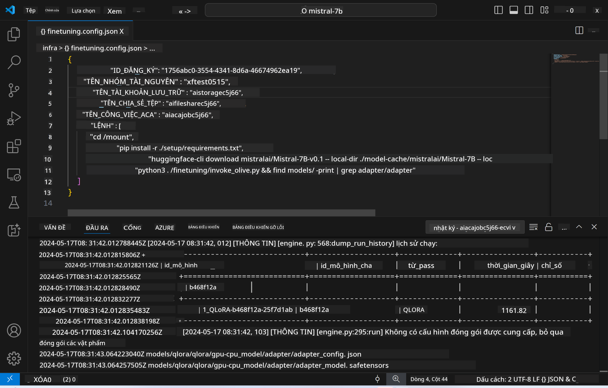
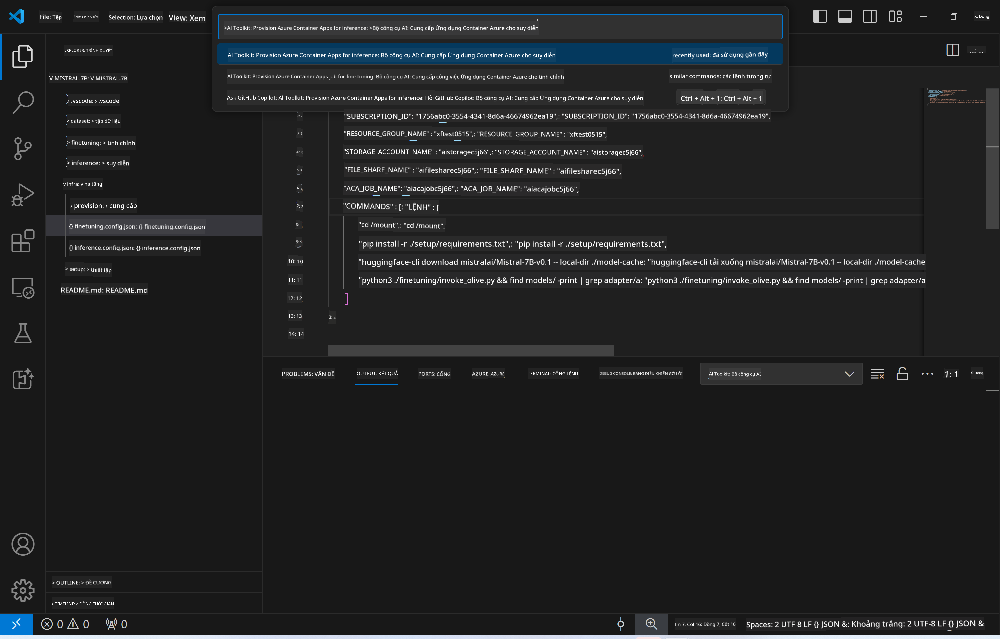
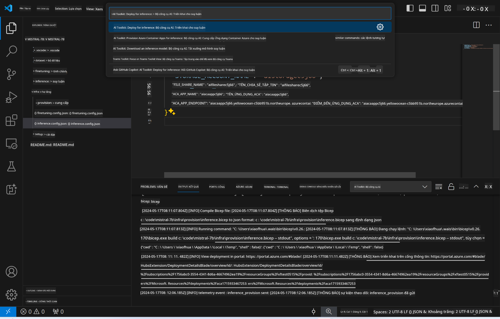

<!--
CO_OP_TRANSLATOR_METADATA:
{
  "original_hash": "a54cd3d65b6963e4e8ce21e143c3ab04",
  "translation_date": "2025-05-09T12:43:20+00:00",
  "source_file": "md/01.Introduction/03/Remote_Interence.md",
  "language_code": "vi"
}
-->
# Inferencing từ xa với mô hình đã tinh chỉnh

Sau khi các adapter được huấn luyện trong môi trường từ xa, sử dụng một ứng dụng Gradio đơn giản để tương tác với mô hình.



### Cấp phát tài nguyên Azure  
Bạn cần thiết lập các tài nguyên Azure cho inferencing từ xa bằng cách thực thi `AI Toolkit: Provision Azure Container Apps for inference` từ command palette. Trong quá trình thiết lập này, bạn sẽ được yêu cầu chọn Azure Subscription và nhóm tài nguyên (resource group).  

   
Mặc định, subscription và resource group cho inferencing nên trùng với những cái đã dùng khi tinh chỉnh. Quá trình inferencing sẽ sử dụng cùng môi trường Azure Container App và truy cập mô hình cùng adapter mô hình được lưu trong Azure Files, được tạo ra trong bước tinh chỉnh.

## Sử dụng AI Toolkit

### Triển khai cho Inferencing  
Nếu bạn muốn chỉnh sửa mã inferencing hoặc tải lại mô hình inferencing, hãy thực thi lệnh `AI Toolkit: Deploy for inference`. Lệnh này sẽ đồng bộ mã mới nhất của bạn với ACA và khởi động lại bản sao.



Sau khi triển khai thành công, mô hình đã sẵn sàng để đánh giá qua endpoint này.

### Truy cập API Inferencing

Bạn có thể truy cập API inferencing bằng cách nhấn nút "*Go to Inference Endpoint*" xuất hiện trong thông báo VSCode. Ngoài ra, endpoint web API có thể tìm thấy dưới `ACA_APP_ENDPOINT` trong `./infra/inference.config.json` và ở bảng output.


> **Note:** Endpoint inferencing có thể mất vài phút để hoạt động hoàn toàn.

## Các thành phần inferencing có trong template

| Thư mục | Nội dung |
| ------ |--------- |
| `infra` | Chứa tất cả cấu hình cần thiết cho hoạt động từ xa. |
| `infra/provision/inference.parameters.json` | Chứa tham số cho các bicep template, dùng để cấp phát tài nguyên Azure cho inferencing. |
| `infra/provision/inference.bicep` | Chứa các template để cấp phát tài nguyên Azure cho inferencing. |
| `infra/inference.config.json` | File cấu hình, được tạo ra bởi lệnh `AI Toolkit: Provision Azure Container Apps for inference`. Dùng làm đầu vào cho các command palette từ xa khác. |

### Sử dụng AI Toolkit để cấu hình cấp phát tài nguyên Azure  
Cấu hình [AI Toolkit](https://marketplace.visualstudio.com/items?itemName=ms-windows-ai-studio.windows-ai-studio)

Cấp phát Azure Container Apps cho inferencing ` command.

You can find configuration parameters in `./infra/provision/inference.parameters.json` file. Here are the details:
| Parameter | Description |
| --------- |------------ |
| `defaultCommands` | This is the commands to initiate a web API. |
| `maximumInstanceCount` | This parameter sets the maximum capacity of GPU instances. |
| `location` | This is the location where Azure resources are provisioned. The default value is the same as the chosen resource group's location. |
| `storageAccountName`, `fileShareName` `acaEnvironmentName`, `acaEnvironmentStorageName`, `acaAppName`,  `acaLogAnalyticsName` | These parameters are used to name the Azure resources for provision. By default, they will be same to the fine-tuning resource name. You can input a new, unused resource name to create your own custom-named resources, or you can input the name of an already existing Azure resource if you'd prefer to use that. For details, refer to the section [Using existing Azure Resources](../../../../../md/01.Introduction/03). |

### Using Existing Azure Resources

By default, the inference provision use the same Azure Container App Environment, Storage Account, Azure File Share, and Azure Log Analytics that were used for fine-tuning. A separate Azure Container App is created solely for the inference API. 

If you have customized the Azure resources during the fine-tuning step or want to use your own existing Azure resources for inference, specify their names in the `./infra/inference.parameters.json` rồi chạy lệnh `AI Toolkit: Provision Azure Container Apps for inference` từ command palette. Lệnh này sẽ cập nhật các tài nguyên đã chỉ định và tạo mới những tài nguyên còn thiếu.

Ví dụ, nếu bạn đã có môi trường container Azure, file `./infra/finetuning.parameters.json` của bạn sẽ trông như sau:

```json
{
    "$schema": "https://schema.management.azure.com/schemas/2019-04-01/deploymentParameters.json#",
    "contentVersion": "1.0.0.0",
    "parameters": {
      ...
      "acaEnvironmentName": {
        "value": "<your-aca-env-name>"
      },
      "acaEnvironmentStorageName": {
        "value": null
      },
      ...
    }
  }
```

### Cấp phát thủ công  
Nếu bạn muốn tự cấu hình các tài nguyên Azure, bạn có thể dùng các file bicep có sẵn trong thư mục `./infra/provision` folders. If you have already set up and configured all the Azure resources without using the AI Toolkit command palette, you can simply enter the resource names in the `inference.config.json`.

Ví dụ:

```json
{
  "SUBSCRIPTION_ID": "<your-subscription-id>",
  "RESOURCE_GROUP_NAME": "<your-resource-group-name>",
  "STORAGE_ACCOUNT_NAME": "<your-storage-account-name>",
  "FILE_SHARE_NAME": "<your-file-share-name>",
  "ACA_APP_NAME": "<your-aca-name>",
  "ACA_APP_ENDPOINT": "<your-aca-endpoint>"
}
```

**Tuyên bố từ chối trách nhiệm**:  
Tài liệu này đã được dịch bằng dịch vụ dịch thuật AI [Co-op Translator](https://github.com/Azure/co-op-translator). Mặc dù chúng tôi cố gắng đảm bảo độ chính xác, xin lưu ý rằng các bản dịch tự động có thể chứa lỗi hoặc không chính xác. Tài liệu gốc bằng ngôn ngữ bản địa nên được coi là nguồn chính xác và đáng tin cậy. Đối với thông tin quan trọng, nên sử dụng dịch vụ dịch thuật chuyên nghiệp do con người thực hiện. Chúng tôi không chịu trách nhiệm về bất kỳ sự hiểu lầm hoặc giải thích sai nào phát sinh từ việc sử dụng bản dịch này.