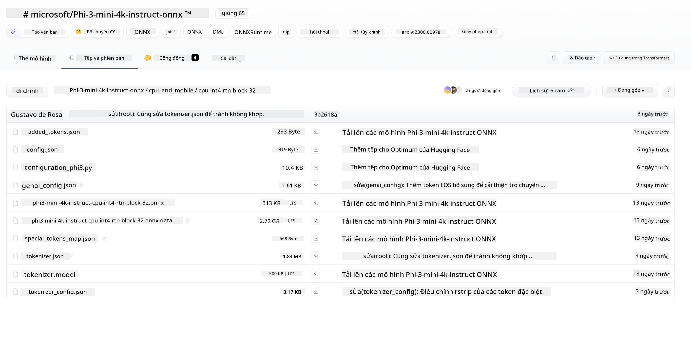

<!--
CO_OP_TRANSLATOR_METADATA:
{
  "original_hash": "82af197df38d25346a98f1f0e84d1698",
  "translation_date": "2025-07-16T20:23:05+00:00",
  "source_file": "md/01.Introduction/03/iOS_Inference.md",
  "language_code": "vi"
}
-->
# **Suy luận Phi-3 trên iOS**

Phi-3-mini là dòng mô hình mới từ Microsoft cho phép triển khai các Mô hình Ngôn ngữ Lớn (LLMs) trên các thiết bị biên và thiết bị IoT. Phi-3-mini có sẵn cho iOS, Android và các thiết bị Edge, giúp AI tạo sinh có thể được triển khai trong môi trường BYOD. Ví dụ dưới đây minh họa cách triển khai Phi-3-mini trên iOS.

## **1. Chuẩn bị**

- **a.** macOS 14 trở lên  
- **b.** Xcode 15 trở lên  
- **c.** iOS SDK 17.x (iPhone 14 A16 hoặc cao hơn)  
- **d.** Cài đặt Python 3.10 trở lên (khuyến nghị dùng Conda)  
- **e.** Cài đặt thư viện Python: `python-flatbuffers`  
- **f.** Cài đặt CMake  

### Semantic Kernel và Suy luận

Semantic Kernel là một framework ứng dụng cho phép bạn tạo các ứng dụng tương thích với Azure OpenAI Service, các mô hình OpenAI, và thậm chí các mô hình cục bộ. Truy cập dịch vụ cục bộ qua Semantic Kernel giúp dễ dàng tích hợp với máy chủ mô hình Phi-3-mini tự lưu trữ của bạn.

### Gọi các mô hình đã lượng tử hóa với Ollama hoặc LlamaEdge

Nhiều người dùng thích sử dụng các mô hình đã lượng tử hóa để chạy mô hình cục bộ. [Ollama](https://ollama.com) và [LlamaEdge](https://llamaedge.com) cho phép người dùng gọi các mô hình lượng tử khác nhau:

#### **Ollama**

Bạn có thể chạy trực tiếp `ollama run phi3` hoặc cấu hình offline. Tạo một Modelfile với đường dẫn đến file `gguf` của bạn. Mã mẫu để chạy mô hình Phi-3-mini đã lượng tử hóa:

```gguf
FROM {Add your gguf file path}
TEMPLATE \"\"\"<|user|> .Prompt<|end|> <|assistant|>\"\"\"
PARAMETER stop <|end|>
PARAMETER num_ctx 4096
```

#### **LlamaEdge**

Nếu bạn muốn sử dụng `gguf` đồng thời trên cả đám mây và thiết bị biên, LlamaEdge là lựa chọn tuyệt vời.

## **2. Biên dịch ONNX Runtime cho iOS**

```bash

git clone https://github.com/microsoft/onnxruntime.git

cd onnxruntime

./build.sh --build_shared_lib --ios --skip_tests --parallel --build_dir ./build_ios --ios --apple_sysroot iphoneos --osx_arch arm64 --apple_deploy_target 17.5 --cmake_generator Xcode --config Release

cd ../

```

### **Lưu ý**

- **a.** Trước khi biên dịch, đảm bảo Xcode đã được cấu hình đúng và đặt làm thư mục nhà phát triển đang hoạt động trong terminal:

    ```bash
    sudo xcode-select -switch /Applications/Xcode.app/Contents/Developer
    ```

- **b.** ONNX Runtime cần được biên dịch cho các nền tảng khác nhau. Với iOS, bạn có thể biên dịch cho `arm64` hoặc `x86_64`.

- **c.** Khuyến nghị sử dụng SDK iOS mới nhất để biên dịch. Tuy nhiên, bạn cũng có thể dùng phiên bản cũ hơn nếu cần tương thích với các SDK trước đó.

## **3. Biên dịch Generative AI với ONNX Runtime cho iOS**

> **Lưu ý:** Vì Generative AI với ONNX Runtime đang trong giai đoạn xem trước, hãy lưu ý có thể có những thay đổi.

```bash

git clone https://github.com/microsoft/onnxruntime-genai
 
cd onnxruntime-genai
 
mkdir ort
 
cd ort
 
mkdir include
 
mkdir lib
 
cd ../
 
cp ../onnxruntime/include/onnxruntime/core/session/onnxruntime_c_api.h ort/include
 
cp ../onnxruntime/build_ios/Release/Release-iphoneos/libonnxruntime*.dylib* ort/lib
 
export OPENCV_SKIP_XCODEBUILD_FORCE_TRYCOMPILE_DEBUG=1
 
python3 build.py --parallel --build_dir ./build_ios --ios --ios_sysroot iphoneos --ios_arch arm64 --ios_deployment_target 17.5 --cmake_generator Xcode --cmake_extra_defines CMAKE_XCODE_ATTRIBUTE_CODE_SIGNING_ALLOWED=NO

```

## **4. Tạo ứng dụng App trong Xcode**

Tôi chọn Objective-C làm phương pháp phát triển App, vì khi sử dụng Generative AI với ONNX Runtime C++ API, Objective-C tương thích tốt hơn. Tất nhiên, bạn cũng có thể hoàn thành các gọi liên quan thông qua cầu nối Swift.


## **5. Sao chép mô hình ONNX lượng tử hóa INT4 vào dự án ứng dụng App**

Chúng ta cần nhập mô hình lượng tử hóa INT4 ở định dạng ONNX, bạn cần tải xuống trước.



Sau khi tải về, bạn cần thêm nó vào thư mục Resources của dự án trong Xcode.


## **6. Thêm API C++ vào ViewControllers**

> **Lưu ý:**

- **a.** Thêm các file header C++ tương ứng vào dự án.

  

- **b.** Bao gồm thư viện động `onnxruntime-genai` trong Xcode.

  

- **c.** Sử dụng mã mẫu C để thử nghiệm. Bạn cũng có thể thêm các tính năng bổ sung như ChatUI để tăng cường chức năng.

- **d.** Vì bạn cần dùng C++ trong dự án, hãy đổi tên `ViewController.m` thành `ViewController.mm` để kích hoạt hỗ trợ Objective-C++.

```objc

    NSString *llmPath = [[NSBundle mainBundle] resourcePath];
    char const *modelPath = llmPath.cString;

    auto model =  OgaModel::Create(modelPath);

    auto tokenizer = OgaTokenizer::Create(*model);

    const char* prompt = "<|system|>You are a helpful AI assistant.<|end|><|user|>Can you introduce yourself?<|end|><|assistant|>";

    auto sequences = OgaSequences::Create();
    tokenizer->Encode(prompt, *sequences);

    auto params = OgaGeneratorParams::Create(*model);
    params->SetSearchOption("max_length", 100);
    params->SetInputSequences(*sequences);

    auto output_sequences = model->Generate(*params);
    const auto output_sequence_length = output_sequences->SequenceCount(0);
    const auto* output_sequence_data = output_sequences->SequenceData(0);
    auto out_string = tokenizer->Decode(output_sequence_data, output_sequence_length);
    
    auto tmp = out_string;

```

## **7. Chạy ứng dụng**

Khi đã hoàn tất thiết lập, bạn có thể chạy ứng dụng để xem kết quả suy luận của mô hình Phi-3-mini.


Để xem thêm mã mẫu và hướng dẫn chi tiết, hãy truy cập [kho mẫu Phi-3 Mini Samples](https://github.com/Azure-Samples/Phi-3MiniSamples/tree/main/ios).

**Tuyên bố từ chối trách nhiệm**:  
Tài liệu này đã được dịch bằng dịch vụ dịch thuật AI [Co-op Translator](https://github.com/Azure/co-op-translator). Mặc dù chúng tôi cố gắng đảm bảo độ chính xác, xin lưu ý rằng bản dịch tự động có thể chứa lỗi hoặc không chính xác. Tài liệu gốc bằng ngôn ngữ gốc của nó nên được coi là nguồn chính xác và đáng tin cậy. Đối với các thông tin quan trọng, nên sử dụng dịch vụ dịch thuật chuyên nghiệp do con người thực hiện. Chúng tôi không chịu trách nhiệm về bất kỳ sự hiểu lầm hoặc giải thích sai nào phát sinh từ việc sử dụng bản dịch này.