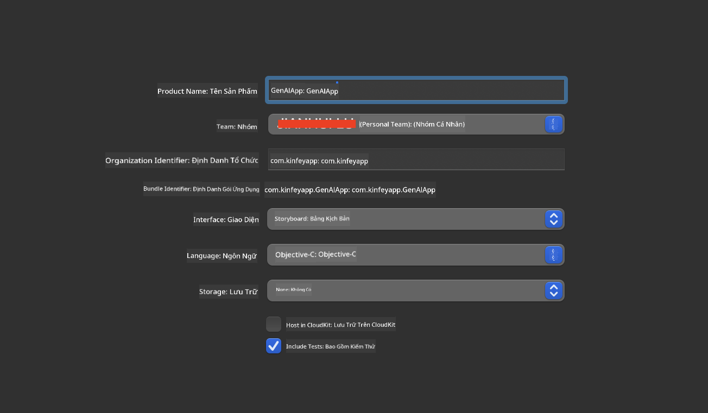
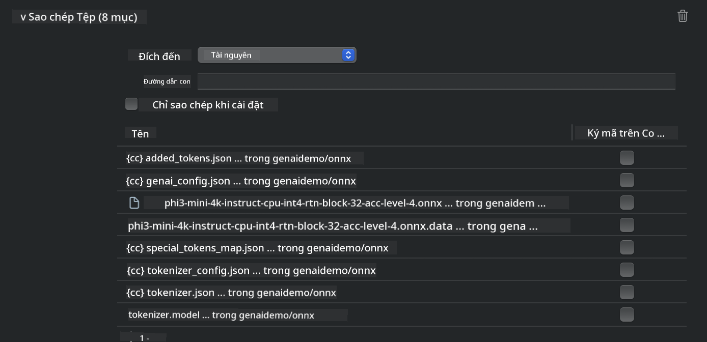
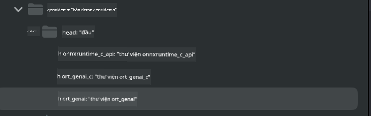
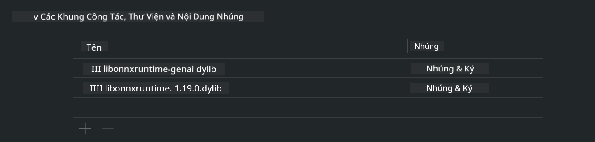
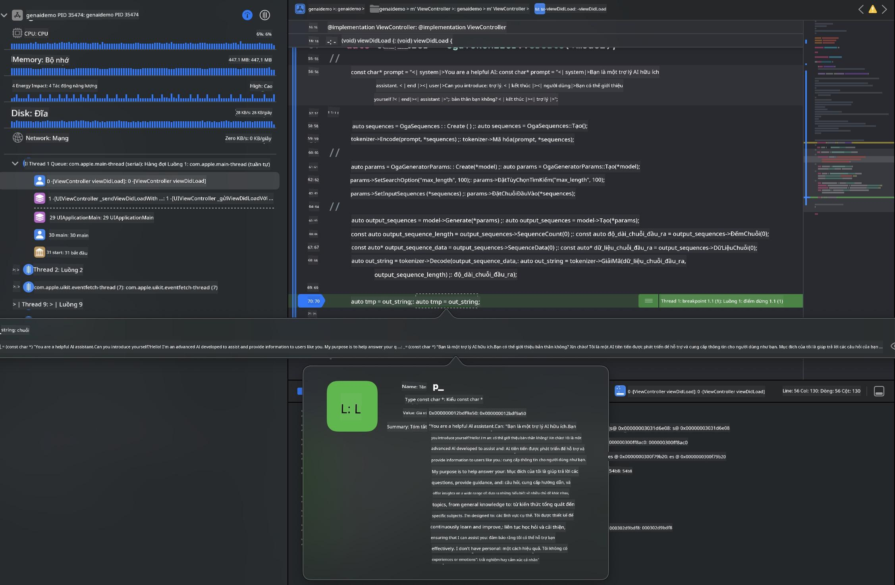

<!--
CO_OP_TRANSLATOR_METADATA:
{
  "original_hash": "82af197df38d25346a98f1f0e84d1698",
  "translation_date": "2025-05-09T11:02:07+00:00",
  "source_file": "md/01.Introduction/03/iOS_Inference.md",
  "language_code": "vi"
}
-->
# **Inference Phi-3 trên iOS**

Phi-3-mini là dòng mô hình mới từ Microsoft cho phép triển khai các Large Language Models (LLMs) trên các thiết bị edge và thiết bị IoT. Phi-3-mini có sẵn cho iOS, Android và các thiết bị Edge, giúp AI tạo sinh có thể được triển khai trong môi trường BYOD. Ví dụ dưới đây minh họa cách triển khai Phi-3-mini trên iOS.

## **1. Chuẩn bị**

- **a.** macOS 14+
- **b.** Xcode 15+
- **c.** iOS SDK 17.x (iPhone 14 A16 trở lên)
- **d.** Cài đặt Python 3.10+ (Khuyến nghị dùng Conda)
- **e.** Cài đặt thư viện Python: `python-flatbuffers`
- **f.** Cài đặt CMake

### Semantic Kernel và Inference

Semantic Kernel là framework ứng dụng giúp bạn tạo các ứng dụng tương thích với Azure OpenAI Service, các mô hình OpenAI, và cả các mô hình chạy cục bộ. Truy cập dịch vụ cục bộ qua Semantic Kernel giúp tích hợp dễ dàng với server mô hình Phi-3-mini tự host của bạn.

### Gọi mô hình Quantized với Ollama hoặc LlamaEdge

Nhiều người dùng thích sử dụng mô hình quantized để chạy mô hình cục bộ. [Ollama](https://ollama.com) và [LlamaEdge](https://llamaedge.com) cho phép gọi các mô hình quantized khác nhau:

#### **Ollama**

Bạn có thể chạy `ollama run phi3` trực tiếp hoặc cấu hình offline. Tạo một Modelfile với đường dẫn tới file `gguf` của bạn. Mã mẫu chạy mô hình Phi-3-mini quantized:

```gguf
FROM {Add your gguf file path}
TEMPLATE \"\"\"<|user|> .Prompt<|end|> <|assistant|>\"\"\"
PARAMETER stop <|end|>
PARAMETER num_ctx 4096
```

#### **LlamaEdge**

Nếu bạn muốn sử dụng `gguf` đồng thời trên cloud và thiết bị edge, LlamaEdge là lựa chọn tuyệt vời.

## **2. Biên dịch ONNX Runtime cho iOS**

```bash

git clone https://github.com/microsoft/onnxruntime.git

cd onnxruntime

./build.sh --build_shared_lib --ios --skip_tests --parallel --build_dir ./build_ios --ios --apple_sysroot iphoneos --osx_arch arm64 --apple_deploy_target 17.5 --cmake_generator Xcode --config Release

cd ../

```

### **Lưu ý**

- **a.** Trước khi biên dịch, đảm bảo Xcode đã được cấu hình đúng và đặt làm developer directory hiện hành trong terminal:

    ```bash
    sudo xcode-select -switch /Applications/Xcode.app/Contents/Developer
    ```

- **b.** ONNX Runtime cần được biên dịch cho nhiều nền tảng khác nhau. Với iOS, bạn có thể biên dịch cho `arm64` or `x86_64`.

- **c.** Khuyến nghị sử dụng iOS SDK mới nhất để biên dịch. Tuy nhiên, bạn cũng có thể dùng phiên bản SDK cũ hơn nếu cần tương thích với các SDK trước đó.

## **3. Biên dịch Generative AI với ONNX Runtime cho iOS**

> **Note:** Vì Generative AI với ONNX Runtime đang trong giai đoạn preview, hãy lưu ý có thể có những thay đổi.

```bash

git clone https://github.com/microsoft/onnxruntime-genai
 
cd onnxruntime-genai
 
mkdir ort
 
cd ort
 
mkdir include
 
mkdir lib
 
cd ../
 
cp ../onnxruntime/include/onnxruntime/core/session/onnxruntime_c_api.h ort/include
 
cp ../onnxruntime/build_ios/Release/Release-iphoneos/libonnxruntime*.dylib* ort/lib
 
export OPENCV_SKIP_XCODEBUILD_FORCE_TRYCOMPILE_DEBUG=1
 
python3 build.py --parallel --build_dir ./build_ios --ios --ios_sysroot iphoneos --ios_arch arm64 --ios_deployment_target 17.5 --cmake_generator Xcode --cmake_extra_defines CMAKE_XCODE_ATTRIBUTE_CODE_SIGNING_ALLOWED=NO

```

## **4. Tạo ứng dụng App trong Xcode**

Tôi chọn Objective-C làm phương pháp phát triển App, vì khi dùng Generative AI với ONNX Runtime C++ API, Objective-C tương thích tốt hơn. Tất nhiên, bạn cũng có thể thực hiện các gọi liên quan thông qua Swift bridging.



## **5. Sao chép mô hình ONNX quantized INT4 vào dự án App**

Chúng ta cần nhập mô hình quantization INT4 ở định dạng ONNX, cần tải về trước.


Sau khi tải về, bạn cần thêm nó vào thư mục Resources của dự án trong Xcode.



## **6. Thêm C++ API vào ViewControllers**

> **Lưu ý:**

- **a.** Thêm các file header C++ tương ứng vào dự án.

  

- **b.** Bao gồm `onnxruntime-genai` dynamic library in Xcode.

  

- **c.** Use the C Samples code for testing. You can also add additional features like ChatUI for more functionality.

- **d.** Since you need to use C++ in your project, rename `ViewController.m` to `ViewController.mm` để kích hoạt hỗ trợ Objective-C++.

```objc

    NSString *llmPath = [[NSBundle mainBundle] resourcePath];
    char const *modelPath = llmPath.cString;

    auto model =  OgaModel::Create(modelPath);

    auto tokenizer = OgaTokenizer::Create(*model);

    const char* prompt = "<|system|>You are a helpful AI assistant.<|end|><|user|>Can you introduce yourself?<|end|><|assistant|>";

    auto sequences = OgaSequences::Create();
    tokenizer->Encode(prompt, *sequences);

    auto params = OgaGeneratorParams::Create(*model);
    params->SetSearchOption("max_length", 100);
    params->SetInputSequences(*sequences);

    auto output_sequences = model->Generate(*params);
    const auto output_sequence_length = output_sequences->SequenceCount(0);
    const auto* output_sequence_data = output_sequences->SequenceData(0);
    auto out_string = tokenizer->Decode(output_sequence_data, output_sequence_length);
    
    auto tmp = out_string;

```

## **7. Chạy ứng dụng**

Khi đã hoàn tất thiết lập, bạn có thể chạy ứng dụng để xem kết quả suy luận mô hình Phi-3-mini.



Để xem thêm mã mẫu và hướng dẫn chi tiết, truy cập [Phi-3 Mini Samples repository](https://github.com/Azure-Samples/Phi-3MiniSamples/tree/main/ios).

**Tuyên bố miễn trách**:  
Tài liệu này đã được dịch bằng dịch vụ dịch thuật AI [Co-op Translator](https://github.com/Azure/co-op-translator). Mặc dù chúng tôi cố gắng đảm bảo độ chính xác, xin lưu ý rằng các bản dịch tự động có thể chứa lỗi hoặc không chính xác. Tài liệu gốc bằng ngôn ngữ nguyên bản nên được xem là nguồn tham khảo chính thức. Đối với các thông tin quan trọng, nên sử dụng dịch thuật chuyên nghiệp bởi con người. Chúng tôi không chịu trách nhiệm về bất kỳ sự hiểu lầm hoặc giải thích sai nào phát sinh từ việc sử dụng bản dịch này.