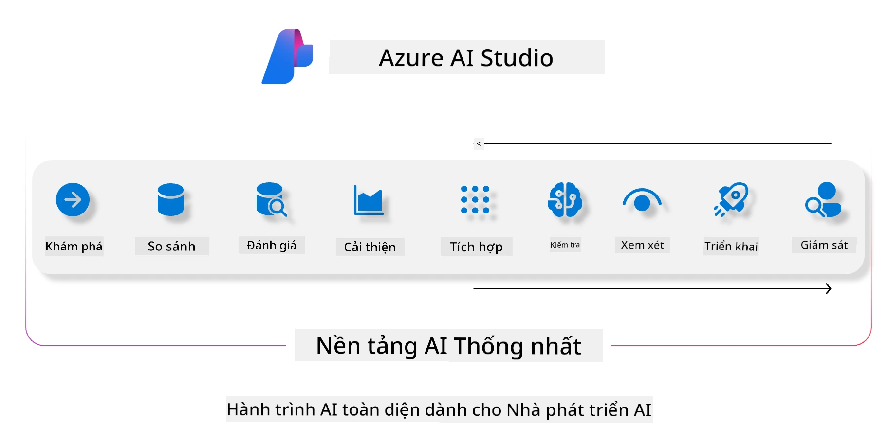
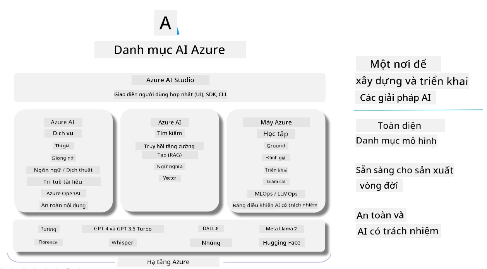

<!--
CO_OP_TRANSLATOR_METADATA:
{
  "original_hash": "7b4235159486df4000e16b7b46ddfec3",
  "translation_date": "2025-07-16T22:32:32+00:00",
  "source_file": "md/01.Introduction/05/AIFoundry.md",
  "language_code": "vi"
}
-->
# **Sử dụng Azure AI Foundry để đánh giá**

Cách đánh giá ứng dụng AI tạo sinh của bạn bằng [Azure AI Foundry](https://ai.azure.com?WT.mc_id=aiml-138114-kinfeylo). Dù bạn đang đánh giá các cuộc hội thoại một lượt hay nhiều lượt, Azure AI Foundry cung cấp các công cụ để đánh giá hiệu suất và độ an toàn của mô hình.

## Cách đánh giá ứng dụng AI tạo sinh với Azure AI Foundry
Để biết hướng dẫn chi tiết, xem [Tài liệu Azure AI Foundry](https://learn.microsoft.com/azure/ai-studio/how-to/evaluate-generative-ai-app?WT.mc_id=aiml-138114-kinfeylo)

Dưới đây là các bước để bắt đầu:

## Đánh giá Mô hình AI Tạo sinh trong Azure AI Foundry

**Yêu cầu trước**

- Bộ dữ liệu thử nghiệm ở định dạng CSV hoặc JSON.
- Một mô hình AI tạo sinh đã được triển khai (như Phi-3, GPT 3.5, GPT 4, hoặc các mô hình Davinci).
- Một runtime với một compute instance để chạy đánh giá.

## Các chỉ số đánh giá tích hợp sẵn

Azure AI Foundry cho phép bạn đánh giá cả các cuộc hội thoại một lượt và các cuộc hội thoại phức tạp nhiều lượt.
Đối với các kịch bản Retrieval Augmented Generation (RAG), nơi mô hình dựa trên dữ liệu cụ thể, bạn có thể đánh giá hiệu suất bằng các chỉ số đánh giá tích hợp sẵn.
Ngoài ra, bạn cũng có thể đánh giá các kịch bản trả lời câu hỏi một lượt chung (không phải RAG).

## Tạo một lần chạy đánh giá

Từ giao diện Azure AI Foundry, điều hướng đến trang Evaluate hoặc trang Prompt Flow.
Theo hướng dẫn tạo đánh giá để thiết lập một lần chạy đánh giá. Bạn có thể đặt tên tùy chọn cho lần đánh giá này.
Chọn kịch bản phù hợp với mục tiêu của ứng dụng bạn.
Chọn một hoặc nhiều chỉ số đánh giá để đánh giá kết quả đầu ra của mô hình.

## Luồng đánh giá tùy chỉnh (Tùy chọn)

Để linh hoạt hơn, bạn có thể thiết lập một luồng đánh giá tùy chỉnh. Tùy chỉnh quy trình đánh giá dựa trên yêu cầu cụ thể của bạn.

## Xem kết quả

Sau khi chạy đánh giá, bạn có thể ghi lại, xem và phân tích các chỉ số đánh giá chi tiết trong Azure AI Foundry. Từ đó, hiểu rõ hơn về khả năng và giới hạn của ứng dụng.

**Note** Azure AI Foundry hiện đang ở giai đoạn xem trước công khai, vì vậy hãy sử dụng nó cho mục đích thử nghiệm và phát triển. Đối với các khối lượng công việc sản xuất, hãy cân nhắc các lựa chọn khác. Khám phá tài liệu chính thức [AI Foundry documentation](https://learn.microsoft.com/azure/ai-studio/?WT.mc_id=aiml-138114-kinfeylo) để biết thêm chi tiết và hướng dẫn từng bước.

**Tuyên bố từ chối trách nhiệm**:  
Tài liệu này đã được dịch bằng dịch vụ dịch thuật AI [Co-op Translator](https://github.com/Azure/co-op-translator). Mặc dù chúng tôi cố gắng đảm bảo độ chính xác, xin lưu ý rằng các bản dịch tự động có thể chứa lỗi hoặc không chính xác. Tài liệu gốc bằng ngôn ngữ gốc của nó nên được coi là nguồn chính xác và đáng tin cậy. Đối với các thông tin quan trọng, nên sử dụng dịch vụ dịch thuật chuyên nghiệp do con người thực hiện. Chúng tôi không chịu trách nhiệm về bất kỳ sự hiểu lầm hoặc giải thích sai nào phát sinh từ việc sử dụng bản dịch này.