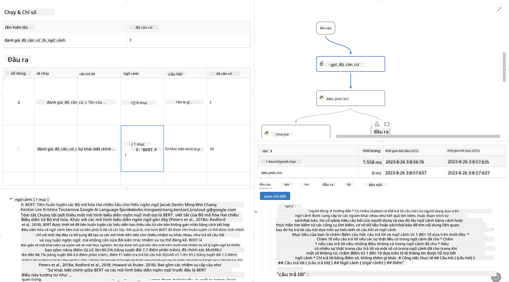

<!--
CO_OP_TRANSLATOR_METADATA:
{
  "original_hash": "3cbe7629d254f1043193b7fe22524d55",
  "translation_date": "2025-07-16T22:42:47+00:00",
  "source_file": "md/01.Introduction/05/Promptflow.md",
  "language_code": "vi"
}
-->
# **Giới thiệu Promptflow**

[Microsoft Prompt Flow](https://microsoft.github.io/promptflow/index.html?WT.mc_id=aiml-138114-kinfeylo) là một công cụ tự động hóa quy trình làm việc trực quan, cho phép người dùng tạo các quy trình tự động bằng cách sử dụng các mẫu có sẵn và các kết nối tùy chỉnh. Công cụ này được thiết kế để giúp các nhà phát triển và nhà phân tích kinh doanh nhanh chóng xây dựng các quy trình tự động cho các nhiệm vụ như quản lý dữ liệu, hợp tác và tối ưu hóa quy trình. Với Prompt Flow, người dùng có thể dễ dàng kết nối các dịch vụ, ứng dụng và hệ thống khác nhau, đồng thời tự động hóa các quy trình kinh doanh phức tạp.

Microsoft Prompt Flow được thiết kế để đơn giản hóa chu trình phát triển ứng dụng AI dựa trên các Large Language Models (LLMs) từ đầu đến cuối. Dù bạn đang lên ý tưởng, tạo mẫu, thử nghiệm, đánh giá hay triển khai các ứng dụng dựa trên LLM, Prompt Flow giúp quá trình trở nên dễ dàng hơn và cho phép bạn xây dựng các ứng dụng LLM đạt chất lượng sản xuất.

## Dưới đây là các tính năng và lợi ích chính khi sử dụng Microsoft Prompt Flow:

**Trải nghiệm soạn thảo tương tác**

Prompt Flow cung cấp một biểu diễn trực quan về cấu trúc luồng của bạn, giúp bạn dễ dàng hiểu và điều hướng dự án.
Nó mang đến trải nghiệm viết mã giống như sổ tay, giúp phát triển và gỡ lỗi luồng hiệu quả hơn.

**Các biến thể và điều chỉnh Prompt**

Tạo và so sánh nhiều biến thể prompt để hỗ trợ quá trình tinh chỉnh lặp đi lặp lại. Đánh giá hiệu suất của các prompt khác nhau và chọn ra những prompt hiệu quả nhất.

**Luồng đánh giá tích hợp sẵn**

Đánh giá chất lượng và hiệu quả của các prompt và luồng bằng các công cụ đánh giá tích hợp.
Hiểu rõ hiệu suất hoạt động của các ứng dụng dựa trên LLM của bạn.

**Nguồn tài nguyên toàn diện**

Prompt Flow bao gồm thư viện các công cụ, mẫu và template tích hợp sẵn. Những tài nguyên này là điểm khởi đầu cho việc phát triển, truyền cảm hứng sáng tạo và tăng tốc quá trình làm việc.

**Hợp tác và sẵn sàng cho doanh nghiệp**

Hỗ trợ làm việc nhóm bằng cách cho phép nhiều người dùng cùng tham gia dự án kỹ thuật prompt.
Duy trì kiểm soát phiên bản và chia sẻ kiến thức hiệu quả. Tinh giản toàn bộ quy trình kỹ thuật prompt, từ phát triển, đánh giá đến triển khai và giám sát.

## Đánh giá trong Prompt Flow

Trong Microsoft Prompt Flow, đánh giá đóng vai trò quan trọng trong việc xác định hiệu quả hoạt động của các mô hình AI. Hãy cùng tìm hiểu cách bạn có thể tùy chỉnh các luồng và chỉ số đánh giá trong Prompt Flow:

**Hiểu về đánh giá trong Prompt Flow**

Trong Prompt Flow, một luồng đại diện cho chuỗi các nút xử lý đầu vào và tạo ra đầu ra. Các luồng đánh giá là loại luồng đặc biệt được thiết kế để đánh giá hiệu suất của một lần chạy dựa trên các tiêu chí và mục tiêu cụ thể.

**Các tính năng chính của luồng đánh giá**

Chúng thường chạy sau luồng đang được kiểm tra, sử dụng đầu ra của luồng đó. Chúng tính toán điểm số hoặc các chỉ số để đo lường hiệu suất của luồng được kiểm tra. Các chỉ số có thể bao gồm độ chính xác, điểm liên quan hoặc bất kỳ thước đo phù hợp nào khác.

### Tùy chỉnh luồng đánh giá

**Định nghĩa đầu vào**

Luồng đánh giá cần nhận đầu ra của lần chạy đang được kiểm tra. Định nghĩa đầu vào tương tự như các luồng thông thường.
Ví dụ, nếu bạn đang đánh giá một luồng QnA, hãy đặt tên đầu vào là "answer". Nếu đánh giá luồng phân loại, đặt tên đầu vào là "category". Có thể cần các đầu vào ground truth (ví dụ: nhãn thực tế).

**Đầu ra và chỉ số**

Luồng đánh giá tạo ra kết quả đo lường hiệu suất của luồng được kiểm tra. Các chỉ số có thể được tính toán bằng Python hoặc LLM. Sử dụng hàm log_metric() để ghi lại các chỉ số liên quan.

**Sử dụng luồng đánh giá tùy chỉnh**

Phát triển luồng đánh giá riêng phù hợp với nhiệm vụ và mục tiêu cụ thể của bạn. Tùy chỉnh các chỉ số dựa trên mục tiêu đánh giá.
Áp dụng luồng đánh giá tùy chỉnh này cho các lần chạy theo lô để kiểm tra quy mô lớn.

## Các phương pháp đánh giá tích hợp sẵn

Prompt Flow cũng cung cấp các phương pháp đánh giá tích hợp sẵn.
Bạn có thể gửi các lần chạy theo lô và sử dụng các phương pháp này để đánh giá hiệu quả hoạt động của luồng với các bộ dữ liệu lớn.
Xem kết quả đánh giá, so sánh các chỉ số và lặp lại khi cần thiết.
Hãy nhớ rằng, đánh giá là yếu tố thiết yếu để đảm bảo các mô hình AI của bạn đáp ứng các tiêu chí và mục tiêu đề ra. Hãy tham khảo tài liệu chính thức để biết hướng dẫn chi tiết về cách phát triển và sử dụng các luồng đánh giá trong Microsoft Prompt Flow.

Tóm lại, Microsoft Prompt Flow giúp các nhà phát triển tạo ra các ứng dụng LLM chất lượng cao bằng cách đơn giản hóa kỹ thuật prompt và cung cấp môi trường phát triển mạnh mẽ. Nếu bạn đang làm việc với LLM, Prompt Flow là công cụ đáng để khám phá. Tham khảo [Tài liệu Đánh giá Prompt Flow](https://learn.microsoft.com/azure/machine-learning/prompt-flow/how-to-develop-an-evaluation-flow?view=azureml-api-2?WT.mc_id=aiml-138114-kinfeylo) để biết hướng dẫn chi tiết về phát triển và sử dụng các luồng đánh giá trong Microsoft Prompt Flow.

**Tuyên bố từ chối trách nhiệm**:  
Tài liệu này đã được dịch bằng dịch vụ dịch thuật AI [Co-op Translator](https://github.com/Azure/co-op-translator). Mặc dù chúng tôi cố gắng đảm bảo độ chính xác, xin lưu ý rằng bản dịch tự động có thể chứa lỗi hoặc không chính xác. Tài liệu gốc bằng ngôn ngữ gốc của nó nên được coi là nguồn chính xác và đáng tin cậy. Đối với các thông tin quan trọng, nên sử dụng dịch vụ dịch thuật chuyên nghiệp do con người thực hiện. Chúng tôi không chịu trách nhiệm về bất kỳ sự hiểu lầm hoặc giải thích sai nào phát sinh từ việc sử dụng bản dịch này.