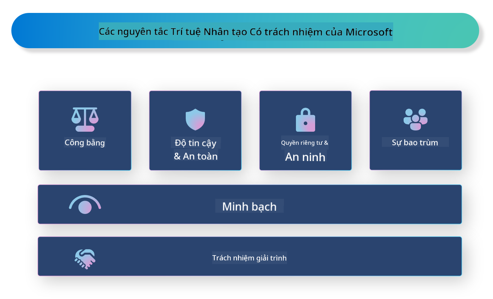

<!--
CO_OP_TRANSLATOR_METADATA:
{
  "original_hash": "805b96b20152936d8f4c587d90d6e06e",
  "translation_date": "2025-05-09T15:40:44+00:00",
  "source_file": "md/01.Introduction/05/ResponsibleAI.md",
  "language_code": "vi"
}
-->
# **Giới thiệu về Responsible AI**

[Microsoft Responsible AI](https://www.microsoft.com/ai/responsible-ai?WT.mc_id=aiml-138114-kinfeylo) là một sáng kiến nhằm hỗ trợ các nhà phát triển và tổ chức xây dựng các hệ thống AI minh bạch, đáng tin cậy và có trách nhiệm. Sáng kiến này cung cấp hướng dẫn và tài nguyên để phát triển các giải pháp AI có trách nhiệm, phù hợp với các nguyên tắc đạo đức như quyền riêng tư, công bằng và minh bạch. Chúng ta cũng sẽ tìm hiểu một số thách thức và thực tiễn tốt nhất liên quan đến việc xây dựng các hệ thống AI có trách nhiệm.

## Tổng quan về Microsoft Responsible AI

**Nguyên tắc đạo đức**

Microsoft Responsible AI được dẫn dắt bởi một tập hợp các nguyên tắc đạo đức như quyền riêng tư, công bằng, minh bạch, trách nhiệm và an toàn. Những nguyên tắc này nhằm đảm bảo các hệ thống AI được phát triển một cách đạo đức và có trách nhiệm.

**AI minh bạch**

Microsoft Responsible AI nhấn mạnh tầm quan trọng của sự minh bạch trong các hệ thống AI. Điều này bao gồm việc cung cấp các giải thích rõ ràng về cách các mô hình AI hoạt động, cũng như đảm bảo nguồn dữ liệu và thuật toán được công khai.

**AI có trách nhiệm**

[Microsoft Responsible AI](https://www.microsoft.com/ai/responsible-ai?WT.mc_id=aiml-138114-kinfeylo) thúc đẩy việc phát triển các hệ thống AI có trách nhiệm, có khả năng cung cấp cái nhìn sâu sắc về cách các mô hình AI đưa ra quyết định. Điều này giúp người dùng hiểu và tin tưởng vào kết quả của hệ thống AI.

**Tính bao trùm**

Các hệ thống AI nên được thiết kế để mang lại lợi ích cho mọi người. Microsoft hướng tới việc tạo ra AI bao trùm, xem xét các quan điểm đa dạng và tránh thiên vị hay phân biệt đối xử.

**Độ tin cậy và an toàn**

Đảm bảo các hệ thống AI đáng tin cậy và an toàn là điều vô cùng quan trọng. Microsoft tập trung xây dựng các mô hình vững chắc, hoạt động ổn định và tránh các kết quả gây hại.

**Công bằng trong AI**

Microsoft Responsible AI nhận thức rằng các hệ thống AI có thể duy trì các thành kiến nếu được huấn luyện trên dữ liệu hoặc thuật toán thiên lệch. Sáng kiến cung cấp hướng dẫn để phát triển các hệ thống AI công bằng, không phân biệt đối xử dựa trên các yếu tố như chủng tộc, giới tính hay tuổi tác.

**Quyền riêng tư và bảo mật**

Microsoft Responsible AI nhấn mạnh tầm quan trọng của việc bảo vệ quyền riêng tư người dùng và an toàn dữ liệu trong các hệ thống AI. Điều này bao gồm việc triển khai mã hóa dữ liệu mạnh mẽ và kiểm soát truy cập, cũng như thường xuyên kiểm tra các hệ thống AI để phát hiện lỗ hổng.

**Trách nhiệm giải trình và chịu trách nhiệm**

Microsoft Responsible AI thúc đẩy trách nhiệm giải trình và chịu trách nhiệm trong phát triển và triển khai AI. Điều này bao gồm việc đảm bảo các nhà phát triển và tổ chức nhận thức được các rủi ro tiềm ẩn liên quan đến hệ thống AI và thực hiện các biện pháp giảm thiểu các rủi ro đó.

## Thực tiễn tốt nhất để xây dựng các hệ thống AI có trách nhiệm

**Phát triển mô hình AI sử dụng bộ dữ liệu đa dạng**

Để tránh thiên vị trong các hệ thống AI, quan trọng là sử dụng bộ dữ liệu đa dạng, đại diện cho nhiều quan điểm và trải nghiệm khác nhau.

**Sử dụng các kỹ thuật AI có thể giải thích được**

Các kỹ thuật AI có thể giải thích giúp người dùng hiểu cách các mô hình AI đưa ra quyết định, từ đó tăng sự tin tưởng vào hệ thống.

**Thường xuyên kiểm tra hệ thống AI để phát hiện lỗ hổng**

Việc kiểm tra định kỳ các hệ thống AI giúp phát hiện các rủi ro và điểm yếu cần được xử lý.

**Triển khai mã hóa dữ liệu mạnh mẽ và kiểm soát truy cập**

Mã hóa dữ liệu và kiểm soát truy cập giúp bảo vệ quyền riêng tư và an toàn cho người dùng trong các hệ thống AI.

**Tuân thủ các nguyên tắc đạo đức trong phát triển AI**

Tuân thủ các nguyên tắc đạo đức như công bằng, minh bạch và trách nhiệm giúp xây dựng niềm tin vào các hệ thống AI và đảm bảo chúng được phát triển một cách có trách nhiệm.

## Sử dụng AI Foundry cho Responsible AI

[Azure AI Foundry](https://ai.azure.com?WT.mc_id=aiml-138114-kinfeylo) là nền tảng mạnh mẽ cho phép các nhà phát triển và tổ chức nhanh chóng tạo ra các ứng dụng thông minh, tiên tiến, sẵn sàng thị trường và có trách nhiệm. Dưới đây là một số tính năng và khả năng chính của Azure AI Foundry:

**API và mô hình có sẵn**

Azure AI Foundry cung cấp các API và mô hình được xây dựng sẵn và có thể tùy chỉnh. Chúng bao phủ nhiều nhiệm vụ AI khác nhau, bao gồm AI tạo sinh, xử lý ngôn ngữ tự nhiên cho hội thoại, tìm kiếm, giám sát, dịch thuật, giọng nói, thị giác và ra quyết định.

**Prompt Flow**

Prompt Flow trong Azure AI Foundry cho phép bạn tạo trải nghiệm AI hội thoại. Nó giúp bạn thiết kế và quản lý các luồng hội thoại, giúp việc xây dựng chatbot, trợ lý ảo và các ứng dụng tương tác khác trở nên dễ dàng hơn.

**Retrieval Augmented Generation (RAG)**

RAG là kỹ thuật kết hợp giữa phương pháp truy xuất và phương pháp tạo sinh. Nó nâng cao chất lượng các phản hồi được tạo ra bằng cách tận dụng cả kiến thức có sẵn (truy xuất) và khả năng sáng tạo (tạo sinh).

**Đánh giá và giám sát các chỉ số cho AI tạo sinh**

Azure AI Foundry cung cấp công cụ để đánh giá và giám sát các mô hình AI tạo sinh. Bạn có thể đánh giá hiệu suất, công bằng và các chỉ số quan trọng khác để đảm bảo triển khai có trách nhiệm. Ngoài ra, nếu bạn đã tạo bảng điều khiển, bạn có thể sử dụng giao diện không mã trong Azure Machine Learning Studio để tùy chỉnh và tạo bảng điều khiển Responsible AI cùng bảng điểm liên quan dựa trên [Responsible AI Toolbox](https://responsibleaitoolbox.ai/?WT.mc_id=aiml-138114-kinfeylo) Python Libraries. Bảng điểm này giúp bạn chia sẻ những hiểu biết chính về công bằng, tầm quan trọng của các tính năng và các cân nhắc về triển khai có trách nhiệm với cả các bên liên quan kỹ thuật và phi kỹ thuật.

Để sử dụng AI Foundry với Responsible AI, bạn có thể áp dụng các thực tiễn tốt nhất sau:

**Xác định vấn đề và mục tiêu của hệ thống AI**

Trước khi bắt đầu quá trình phát triển, cần xác định rõ ràng vấn đề hoặc mục tiêu mà hệ thống AI hướng tới giải quyết. Điều này giúp bạn xác định dữ liệu, thuật toán và tài nguyên cần thiết để xây dựng mô hình hiệu quả.

**Thu thập và tiền xử lý dữ liệu liên quan**

Chất lượng và số lượng dữ liệu dùng để huấn luyện hệ thống AI có ảnh hưởng lớn đến hiệu suất của nó. Do đó, cần thu thập dữ liệu phù hợp, làm sạch, tiền xử lý và đảm bảo dữ liệu đó đại diện cho đối tượng hoặc vấn đề bạn đang cố gắng giải quyết.

**Lựa chọn phương pháp đánh giá phù hợp**

Có nhiều thuật toán đánh giá khác nhau. Quan trọng là chọn thuật toán phù hợp nhất dựa trên dữ liệu và vấn đề của bạn.

**Đánh giá và giải thích mô hình**

Khi đã xây dựng mô hình AI, cần đánh giá hiệu suất của nó bằng các chỉ số phù hợp và giải thích kết quả một cách minh bạch. Điều này giúp bạn nhận diện các thiên vị hoặc hạn chế trong mô hình và cải thiện khi cần thiết.

**Đảm bảo tính minh bạch và khả năng giải thích**

Các hệ thống AI cần minh bạch và có khả năng giải thích để người dùng hiểu cách chúng hoạt động và cách các quyết định được đưa ra. Điều này đặc biệt quan trọng với các ứng dụng có ảnh hưởng lớn đến cuộc sống con người như y tế, tài chính và pháp luật.

**Giám sát và cập nhật mô hình**

Các hệ thống AI cần được giám sát liên tục và cập nhật để duy trì độ chính xác và hiệu quả theo thời gian. Điều này đòi hỏi bảo trì, kiểm tra và huấn luyện lại mô hình định kỳ.

Tóm lại, Microsoft Responsible AI là một sáng kiến nhằm giúp các nhà phát triển và tổ chức xây dựng các hệ thống AI minh bạch, đáng tin cậy và có trách nhiệm. Việc triển khai AI có trách nhiệm là rất quan trọng, và Azure AI Foundry hướng tới việc giúp các tổ chức thực hiện điều này một cách thiết thực. Bằng cách tuân thủ các nguyên tắc đạo đức và thực tiễn tốt nhất, chúng ta có thể đảm bảo các hệ thống AI được phát triển và triển khai một cách có trách nhiệm, mang lại lợi ích cho toàn xã hội.

**Tuyên bố từ chối trách nhiệm**:  
Tài liệu này đã được dịch bằng dịch vụ dịch thuật AI [Co-op Translator](https://github.com/Azure/co-op-translator). Mặc dù chúng tôi cố gắng đảm bảo độ chính xác, xin lưu ý rằng các bản dịch tự động có thể chứa lỗi hoặc không chính xác. Tài liệu gốc bằng ngôn ngữ gốc nên được coi là nguồn tham khảo chính xác nhất. Đối với các thông tin quan trọng, nên sử dụng dịch vụ dịch thuật chuyên nghiệp do con người thực hiện. Chúng tôi không chịu trách nhiệm về bất kỳ sự hiểu lầm hoặc giải thích sai nào phát sinh từ việc sử dụng bản dịch này.