<!--
CO_OP_TRANSLATOR_METADATA:
{
  "original_hash": "80a853c08e4ee25ef9b4bfcedd8990da",
  "translation_date": "2025-07-16T23:46:37+00:00",
  "source_file": "md/02.Application/01.TextAndChat/Phi3/E2E_Phi-3-Evaluation_AIFoundry.md",
  "language_code": "vi"
}
-->
# Đánh giá Mô hình Phi-3 / Phi-3.5 được Tinh chỉnh trong Azure AI Foundry Tập trung vào Nguyên tắc AI Có Trách nhiệm của Microsoft

Mẫu đầu cuối (E2E) này dựa trên hướng dẫn "[Đánh giá Mô hình Phi-3 / 3.5 được Tinh chỉnh trong Azure AI Foundry Tập trung vào AI Có Trách nhiệm của Microsoft](https://techcommunity.microsoft.com/blog/educatordeveloperblog/evaluate-fine-tuned-phi-3--3-5-models-in-azure-ai-studio-focusing-on-microsofts-/4227850?WT.mc_id=aiml-137032-kinfeylo)" từ Cộng đồng Kỹ thuật Microsoft.

## Tổng quan

### Làm thế nào để đánh giá độ an toàn và hiệu suất của mô hình Phi-3 / Phi-3.5 được tinh chỉnh trong Azure AI Foundry?

Việc tinh chỉnh mô hình đôi khi có thể dẫn đến các phản hồi không mong muốn hoặc không dự kiến. Để đảm bảo mô hình vẫn an toàn và hiệu quả, việc đánh giá khả năng tạo ra nội dung có hại và khả năng cung cấp các phản hồi chính xác, phù hợp và mạch lạc là rất quan trọng. Trong hướng dẫn này, bạn sẽ học cách đánh giá độ an toàn và hiệu suất của mô hình Phi-3 / Phi-3.5 được tinh chỉnh, tích hợp với Prompt flow trong Azure AI Foundry.

Dưới đây là quy trình đánh giá của Azure AI Foundry.

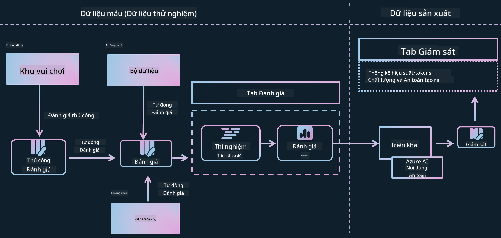

*Nguồn ảnh: [Đánh giá các ứng dụng AI tạo sinh](https://learn.microsoft.com/azure/ai-studio/concepts/evaluation-approach-gen-ai?wt.mc_id%3Dstudentamb_279723)*

> [!NOTE]
>
> Để biết thêm thông tin chi tiết và khám phá các tài nguyên bổ sung về Phi-3 / Phi-3.5, vui lòng truy cập [Phi-3CookBook](https://github.com/microsoft/Phi-3CookBook?wt.mc_id=studentamb_279723).

### Yêu cầu trước

- [Python](https://www.python.org/downloads)
- [Đăng ký Azure](https://azure.microsoft.com/free?wt.mc_id=studentamb_279723)
- [Visual Studio Code](https://code.visualstudio.com)
- Mô hình Phi-3 / Phi-3.5 đã được tinh chỉnh

### Mục lục

1. [**Kịch bản 1: Giới thiệu về đánh giá Prompt flow của Azure AI Foundry**](../../../../../../md/02.Application/01.TextAndChat/Phi3)

    - [Giới thiệu về đánh giá an toàn](../../../../../../md/02.Application/01.TextAndChat/Phi3)
    - [Giới thiệu về đánh giá hiệu suất](../../../../../../md/02.Application/01.TextAndChat/Phi3)

1. [**Kịch bản 2: Đánh giá mô hình Phi-3 / Phi-3.5 trong Azure AI Foundry**](../../../../../../md/02.Application/01.TextAndChat/Phi3)

    - [Trước khi bắt đầu](../../../../../../md/02.Application/01.TextAndChat/Phi3)
    - [Triển khai Azure OpenAI để đánh giá mô hình Phi-3 / Phi-3.5](../../../../../../md/02.Application/01.TextAndChat/Phi3)
    - [Đánh giá mô hình Phi-3 / Phi-3.5 được tinh chỉnh bằng đánh giá Prompt flow của Azure AI Foundry](../../../../../../md/02.Application/01.TextAndChat/Phi3)

1. [Chúc mừng!](../../../../../../md/02.Application/01.TextAndChat/Phi3)

## **Kịch bản 1: Giới thiệu về đánh giá Prompt flow của Azure AI Foundry**

### Giới thiệu về đánh giá an toàn

Để đảm bảo mô hình AI của bạn có đạo đức và an toàn, việc đánh giá nó dựa trên Nguyên tắc AI Có Trách nhiệm của Microsoft là rất quan trọng. Trong Azure AI Foundry, đánh giá an toàn cho phép bạn kiểm tra khả năng mô hình bị tấn công jailbreak và tiềm năng tạo ra nội dung có hại, điều này hoàn toàn phù hợp với các nguyên tắc này.


*Nguồn ảnh: [Đánh giá các ứng dụng AI tạo sinh](https://learn.microsoft.com/azure/ai-studio/concepts/evaluation-approach-gen-ai?wt.mc_id%3Dstudentamb_279723)*

#### Nguyên tắc AI Có Trách nhiệm của Microsoft

Trước khi bắt đầu các bước kỹ thuật, điều quan trọng là phải hiểu Nguyên tắc AI Có Trách nhiệm của Microsoft, một khung đạo đức được thiết kế để hướng dẫn việc phát triển, triển khai và vận hành các hệ thống AI một cách có trách nhiệm. Những nguyên tắc này hướng dẫn thiết kế, phát triển và triển khai AI một cách công bằng, minh bạch và bao trùm. Đây là nền tảng để đánh giá độ an toàn của các mô hình AI.

Nguyên tắc AI Có Trách nhiệm của Microsoft bao gồm:

- **Công bằng và Bao trùm**: Hệ thống AI nên đối xử công bằng với mọi người và tránh ảnh hưởng khác nhau đến các nhóm người có hoàn cảnh tương tự. Ví dụ, khi hệ thống AI cung cấp hướng dẫn về điều trị y tế, hồ sơ vay vốn hoặc tuyển dụng, nó nên đưa ra các khuyến nghị giống nhau cho tất cả những người có triệu chứng, hoàn cảnh tài chính hoặc trình độ chuyên môn tương tự.

- **Độ tin cậy và An toàn**: Để xây dựng niềm tin, hệ thống AI cần hoạt động một cách đáng tin cậy, an toàn và nhất quán. Các hệ thống này phải vận hành đúng như thiết kế ban đầu, phản ứng an toàn với các điều kiện không lường trước và chống lại các thao túng có hại. Cách chúng hoạt động và phạm vi điều kiện có thể xử lý phản ánh các tình huống và hoàn cảnh mà nhà phát triển đã dự đoán trong quá trình thiết kế và thử nghiệm.

- **Minh bạch**: Khi hệ thống AI giúp đưa ra các quyết định có ảnh hưởng lớn đến cuộc sống con người, việc mọi người hiểu cách các quyết định đó được đưa ra là rất quan trọng. Ví dụ, một ngân hàng có thể sử dụng hệ thống AI để quyết định xem một người có đủ điều kiện tín dụng hay không. Một công ty có thể dùng AI để xác định ứng viên phù hợp nhất để tuyển dụng.

- **Quyền riêng tư và An ninh**: Khi AI ngày càng phổ biến, việc bảo vệ quyền riêng tư và bảo mật thông tin cá nhân, doanh nghiệp trở nên quan trọng và phức tạp hơn. Với AI, quyền riêng tư và bảo mật dữ liệu đòi hỏi sự chú ý đặc biệt vì việc truy cập dữ liệu là cần thiết để hệ thống AI có thể đưa ra dự đoán và quyết định chính xác, có cơ sở về con người.

- **Trách nhiệm giải trình**: Những người thiết kế và triển khai hệ thống AI phải chịu trách nhiệm về cách hệ thống hoạt động. Các tổ chức nên dựa vào các tiêu chuẩn ngành để phát triển các chuẩn mực trách nhiệm giải trình. Những chuẩn mực này đảm bảo rằng hệ thống AI không phải là thẩm quyền cuối cùng trong bất kỳ quyết định nào ảnh hưởng đến cuộc sống con người. Chúng cũng đảm bảo con người duy trì quyền kiểm soát có ý nghĩa đối với các hệ thống AI có mức độ tự động cao.

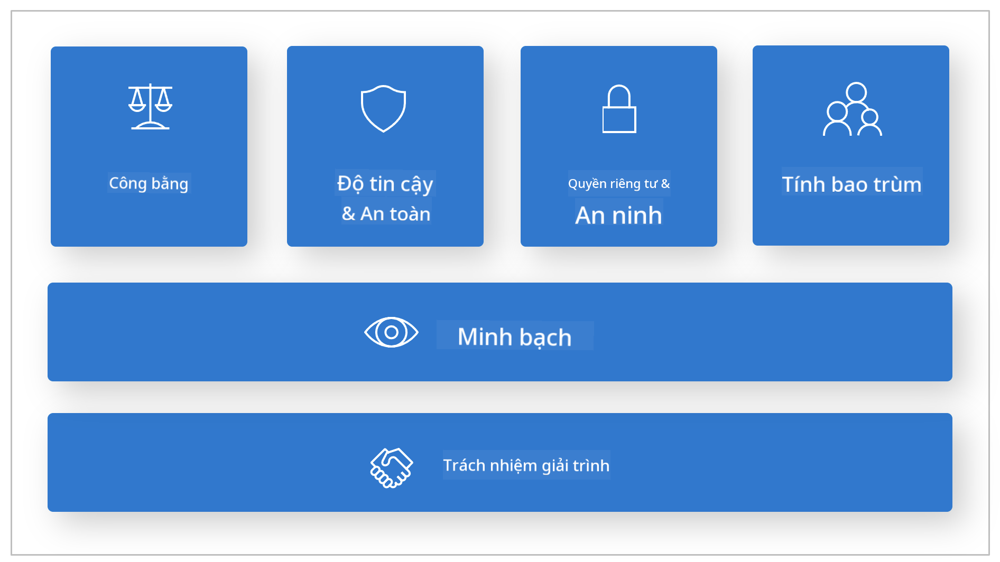

*Nguồn ảnh: [AI Có Trách nhiệm là gì?](https://learn.microsoft.com/azure/machine-learning/concept-responsible-ai?view=azureml-api-2&viewFallbackFrom=azureml-api-2%253fwt.mc_id%3Dstudentamb_279723)*

> [!NOTE]
> Để tìm hiểu thêm về Nguyên tắc AI Có Trách nhiệm của Microsoft, hãy truy cập [AI Có Trách nhiệm là gì?](https://learn.microsoft.com/azure/machine-learning/concept-responsible-ai?view=azureml-api-2?wt.mc_id=studentamb_279723).

#### Các chỉ số an toàn

Trong hướng dẫn này, bạn sẽ đánh giá độ an toàn của mô hình Phi-3 được tinh chỉnh bằng các chỉ số an toàn của Azure AI Foundry. Các chỉ số này giúp bạn đánh giá khả năng mô hình tạo ra nội dung có hại và mức độ dễ bị tấn công jailbreak. Các chỉ số an toàn bao gồm:

- **Nội dung liên quan đến tự làm hại**: Đánh giá xem mô hình có xu hướng tạo ra nội dung liên quan đến tự làm hại hay không.
- **Nội dung thù địch và không công bằng**: Đánh giá xem mô hình có xu hướng tạo ra nội dung thù địch hoặc không công bằng hay không.
- **Nội dung bạo lực**: Đánh giá xem mô hình có xu hướng tạo ra nội dung bạo lực hay không.
- **Nội dung tình dục**: Đánh giá xem mô hình có xu hướng tạo ra nội dung tình dục không phù hợp hay không.

Việc đánh giá những khía cạnh này đảm bảo mô hình AI không tạo ra nội dung có hại hoặc xúc phạm, phù hợp với các giá trị xã hội và tiêu chuẩn quy định.

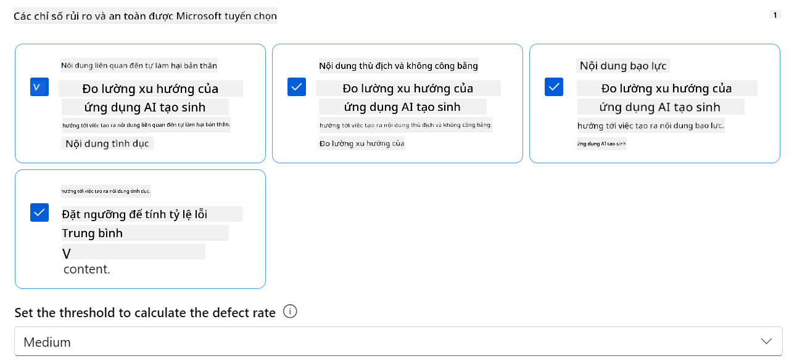

### Giới thiệu về đánh giá hiệu suất

Để đảm bảo mô hình AI của bạn hoạt động như mong đợi, việc đánh giá hiệu suất dựa trên các chỉ số hiệu suất là rất quan trọng. Trong Azure AI Foundry, đánh giá hiệu suất cho phép bạn kiểm tra hiệu quả của mô hình trong việc tạo ra các phản hồi chính xác, phù hợp và mạch lạc.

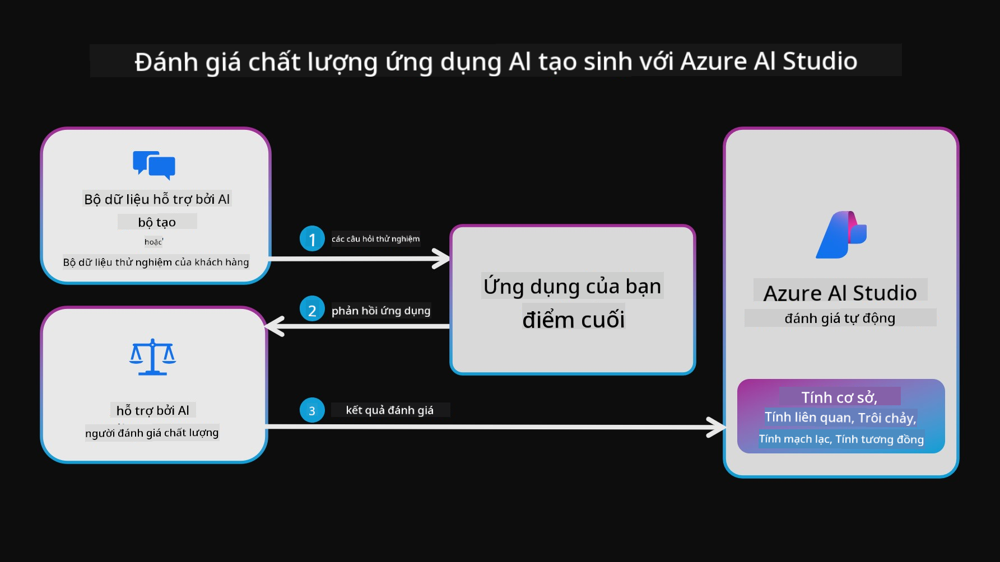

*Nguồn ảnh: [Đánh giá các ứng dụng AI tạo sinh](https://learn.microsoft.com/azure/ai-studio/concepts/evaluation-approach-gen-ai?wt.mc_id%3Dstudentamb_279723)*

#### Các chỉ số hiệu suất

Trong hướng dẫn này, bạn sẽ đánh giá hiệu suất của mô hình Phi-3 / Phi-3.5 được tinh chỉnh bằng các chỉ số hiệu suất của Azure AI Foundry. Các chỉ số này giúp bạn đánh giá hiệu quả của mô hình trong việc tạo ra các phản hồi chính xác, phù hợp và mạch lạc. Các chỉ số hiệu suất bao gồm:

- **Tính cơ sở (Groundedness)**: Đánh giá mức độ câu trả lời được tạo ra phù hợp với thông tin từ nguồn đầu vào.
- **Tính liên quan (Relevance)**: Đánh giá mức độ phù hợp của các phản hồi được tạo ra với câu hỏi được đưa ra.
- **Tính mạch lạc (Coherence)**: Đánh giá độ trôi chảy, tự nhiên và giống ngôn ngữ con người của văn bản được tạo ra.
- **Tính lưu loát (Fluency)**: Đánh giá trình độ ngôn ngữ của văn bản được tạo ra.
- **Độ tương đồng với GPT (GPT Similarity)**: So sánh phản hồi được tạo ra với dữ liệu gốc để đánh giá độ tương đồng.
- **Điểm F1 (F1 Score)**: Tính tỷ lệ từ chung giữa phản hồi được tạo ra và dữ liệu nguồn.

Những chỉ số này giúp bạn đánh giá hiệu quả của mô hình trong việc tạo ra các phản hồi chính xác, phù hợp và mạch lạc.

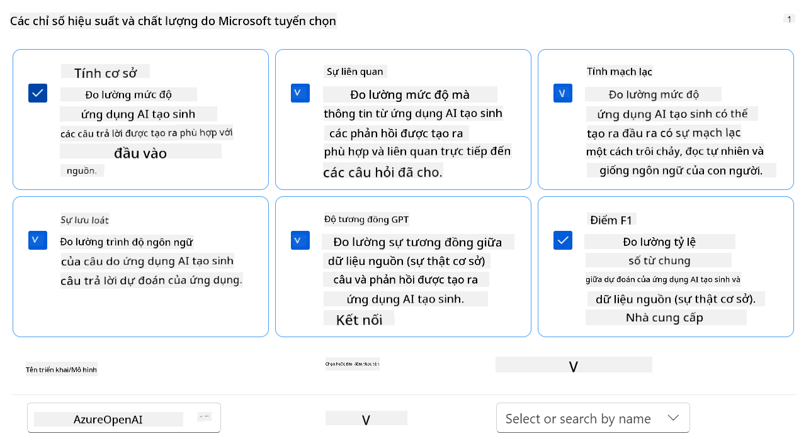

## **Kịch bản 2: Đánh giá mô hình Phi-3 / Phi-3.5 trong Azure AI Foundry**

### Trước khi bắt đầu

Hướng dẫn này là phần tiếp theo của các bài đăng blog trước, "[Tinh chỉnh và Tích hợp Mô hình Phi-3 Tùy chỉnh với Prompt Flow: Hướng dẫn từng bước](https://techcommunity.microsoft.com/t5/educator-developer-blog/fine-tune-and-integrate-custom-phi-3-models-with-prompt-flow/ba-p/4178612?wt.mc_id=studentamb_279723)" và "[Tinh chỉnh và Tích hợp Mô hình Phi-3 Tùy chỉnh với Prompt Flow trong Azure AI Foundry](https://techcommunity.microsoft.com/t5/educator-developer-blog/fine-tune-and-integrate-custom-phi-3-models-with-prompt-flow-in/ba-p/4191726?wt.mc_id=studentamb_279723)." Trong các bài viết này, chúng ta đã đi qua quy trình tinh chỉnh mô hình Phi-3 / Phi-3.5 trong Azure AI Foundry và tích hợp nó với Prompt flow.

Trong hướng dẫn này, bạn sẽ triển khai một mô hình Azure OpenAI làm bộ đánh giá trong Azure AI Foundry và sử dụng nó để đánh giá mô hình Phi-3 / Phi-3.5 đã được tinh chỉnh của bạn.

Trước khi bắt đầu hướng dẫn này, hãy đảm bảo bạn đã có các yêu cầu sau, như đã mô tả trong các hướng dẫn trước:

1. Bộ dữ liệu đã chuẩn bị để đánh giá mô hình Phi-3 / Phi-3.5 được tinh chỉnh.
1. Mô hình Phi-3 / Phi-3.5 đã được tinh chỉnh và triển khai trên Azure Machine Learning.
1. Prompt flow đã tích hợp với mô hình Phi-3 / Phi-3.5 được tinh chỉnh trong Azure AI Foundry.

> [!NOTE]
> Bạn sẽ sử dụng tệp *test_data.jsonl*, nằm trong thư mục data của bộ dữ liệu **ULTRACHAT_200k** đã tải về trong các bài đăng blog trước, làm bộ dữ liệu để đánh giá mô hình Phi-3 / Phi-3.5 được tinh chỉnh.

#### Tích hợp mô hình Phi-3 / Phi-3.5 tùy chỉnh với Prompt flow trong Azure AI Foundry (Phương pháp code trước)
> [!NOTE]  
> Nếu bạn đã theo phương pháp low-code được mô tả trong "[Fine-Tune and Integrate Custom Phi-3 Models with Prompt Flow in Azure AI Foundry](https://techcommunity.microsoft.com/t5/educator-developer-blog/fine-tune-and-integrate-custom-phi-3-models-with-prompt-flow-in/ba-p/4191726?wt.mc_id=studentamb_279723)", bạn có thể bỏ qua bài tập này và tiếp tục với bài tiếp theo.  
> Tuy nhiên, nếu bạn đã theo phương pháp code-first được mô tả trong "[Fine-Tune and Integrate Custom Phi-3 Models with Prompt Flow: Step-by-Step Guide](https://techcommunity.microsoft.com/t5/educator-developer-blog/fine-tune-and-integrate-custom-phi-3-models-with-prompt-flow/ba-p/4178612?wt.mc_id=studentamb_279723)" để tinh chỉnh và triển khai mô hình Phi-3 / Phi-3.5 của mình, thì quy trình kết nối mô hình với Prompt flow sẽ có một số khác biệt. Bạn sẽ học quy trình này trong bài tập này.
Để tiếp tục, bạn cần tích hợp mô hình Phi-3 / Phi-3.5 đã được tinh chỉnh vào Prompt flow trong Azure AI Foundry.

#### Tạo Azure AI Foundry Hub

Bạn cần tạo một Hub trước khi tạo Project. Hub hoạt động giống như một Resource Group, cho phép bạn tổ chức và quản lý nhiều Project trong Azure AI Foundry.

1. Đăng nhập vào [Azure AI Foundry](https://ai.azure.com/?wt.mc_id=studentamb_279723).

1. Chọn **All hubs** từ tab bên trái.

1. Chọn **+ New hub** từ menu điều hướng.

    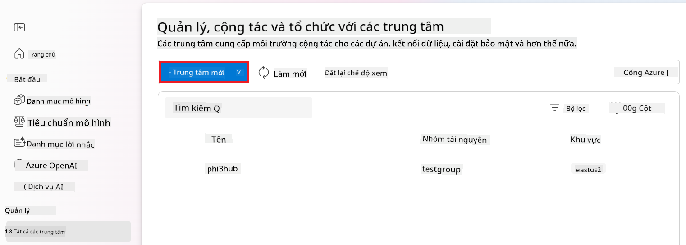

1. Thực hiện các bước sau:

    - Nhập **Hub name**. Giá trị này phải duy nhất.
    - Chọn **Subscription** Azure của bạn.
    - Chọn **Resource group** để sử dụng (tạo mới nếu cần).
    - Chọn **Location** bạn muốn sử dụng.
    - Chọn **Connect Azure AI Services** để sử dụng (tạo mới nếu cần).
    - Chọn **Connect Azure AI Search** và chọn **Skip connecting**.

    

1. Chọn **Next**.

#### Tạo Project trong Azure AI Foundry

1. Trong Hub bạn vừa tạo, chọn **All projects** từ tab bên trái.

1. Chọn **+ New project** từ menu điều hướng.

    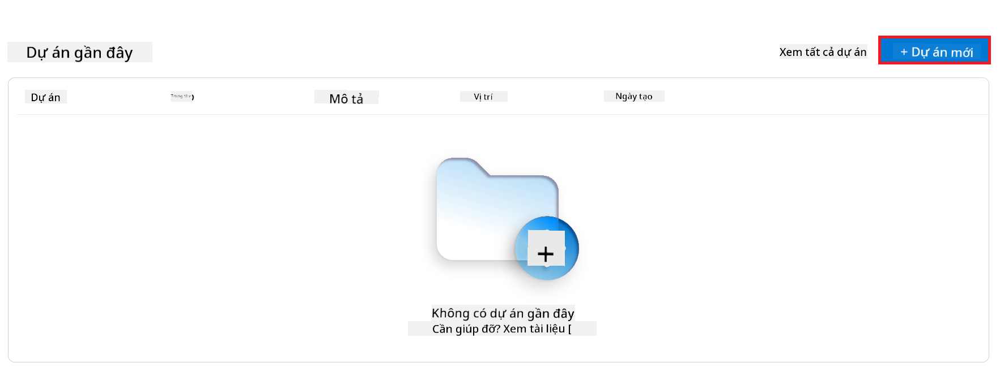

1. Nhập **Project name**. Giá trị này phải duy nhất.

    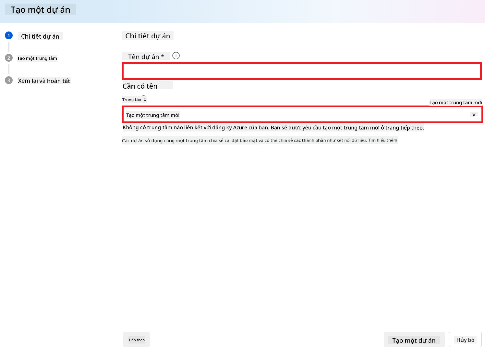

1. Chọn **Create a project**.

#### Thêm kết nối tùy chỉnh cho mô hình Phi-3 / Phi-3.5 đã tinh chỉnh

Để tích hợp mô hình Phi-3 / Phi-3.5 tùy chỉnh với Prompt flow, bạn cần lưu endpoint và key của mô hình trong một kết nối tùy chỉnh. Thiết lập này đảm bảo bạn có thể truy cập mô hình Phi-3 / Phi-3.5 tùy chỉnh trong Prompt flow.

#### Thiết lập api key và endpoint uri của mô hình Phi-3 / Phi-3.5 đã tinh chỉnh

1. Truy cập [Azure ML Studio](https://ml.azure.com/home?wt.mc_id=studentamb_279723).

1. Điều hướng đến workspace Azure Machine learning mà bạn đã tạo.

1. Chọn **Endpoints** từ tab bên trái.

    

1. Chọn endpoint mà bạn đã tạo.

    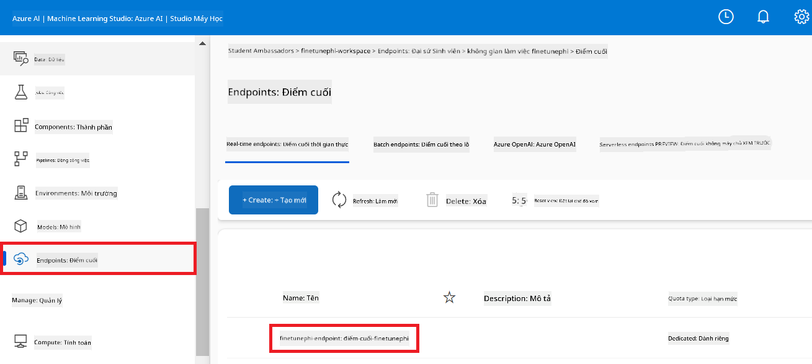

1. Chọn **Consume** từ menu điều hướng.

1. Sao chép **REST endpoint** và **Primary key** của bạn.

    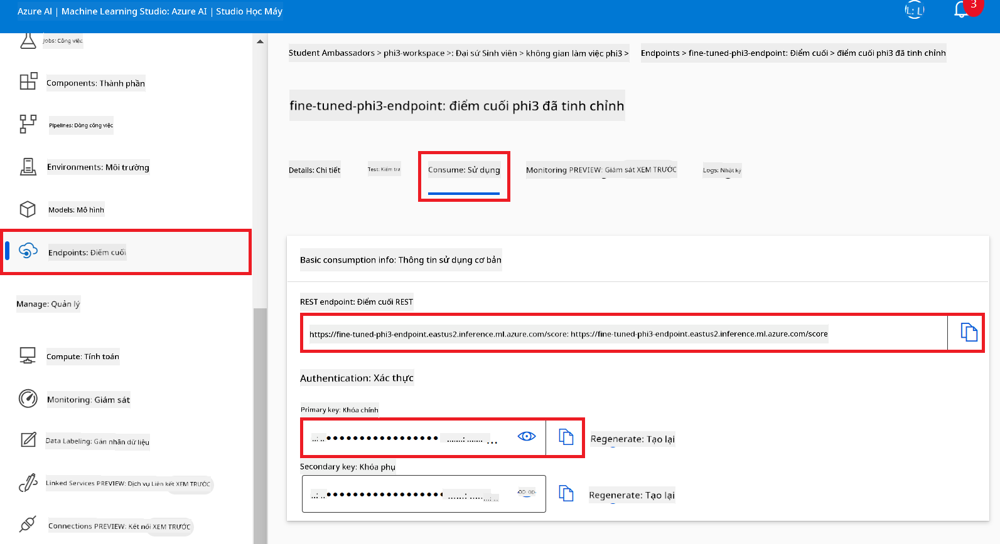

#### Thêm Kết nối Tùy chỉnh

1. Truy cập [Azure AI Foundry](https://ai.azure.com/?wt.mc_id=studentamb_279723).

1. Điều hướng đến project Azure AI Foundry mà bạn đã tạo.

1. Trong Project bạn đã tạo, chọn **Settings** từ tab bên trái.

1. Chọn **+ New connection**.

    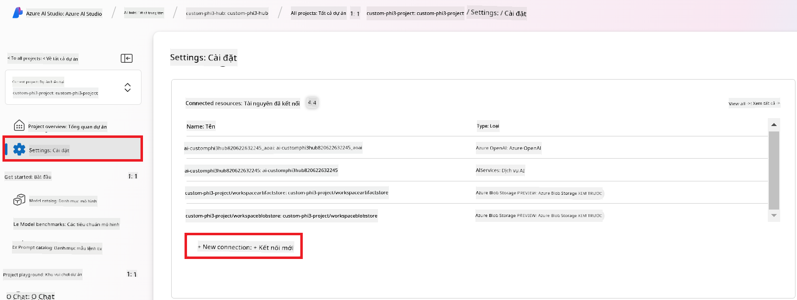

1. Chọn **Custom keys** từ menu điều hướng.

    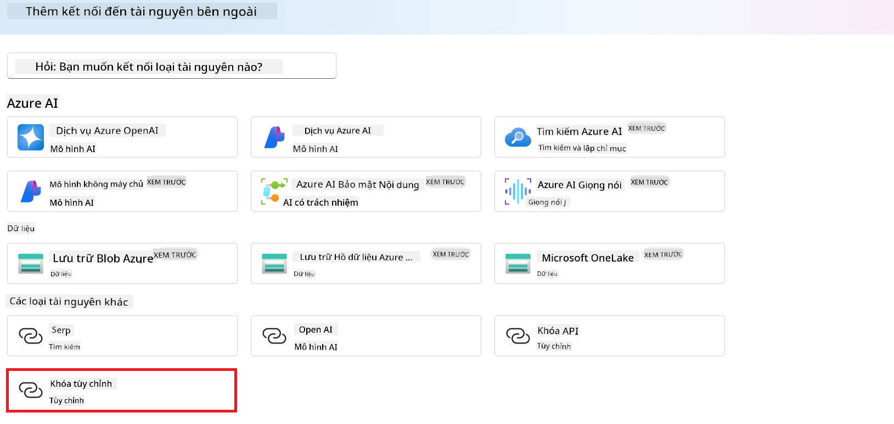

1. Thực hiện các bước sau:

    - Chọn **+ Add key value pairs**.
    - Đặt tên key là **endpoint** và dán endpoint bạn đã sao chép từ Azure ML Studio vào trường giá trị.
    - Chọn **+ Add key value pairs** một lần nữa.
    - Đặt tên key là **key** và dán key bạn đã sao chép từ Azure ML Studio vào trường giá trị.
    - Sau khi thêm các key, chọn **is secret** để tránh lộ key.

    

1. Chọn **Add connection**.

#### Tạo Prompt flow

Bạn đã thêm kết nối tùy chỉnh trong Azure AI Foundry. Bây giờ, hãy tạo một Prompt flow theo các bước sau. Sau đó, bạn sẽ kết nối Prompt flow này với kết nối tùy chỉnh để sử dụng mô hình đã tinh chỉnh trong Prompt flow.

1. Điều hướng đến project Azure AI Foundry mà bạn đã tạo.

1. Chọn **Prompt flow** từ tab bên trái.

1. Chọn **+ Create** từ menu điều hướng.

    

1. Chọn **Chat flow** từ menu điều hướng.

    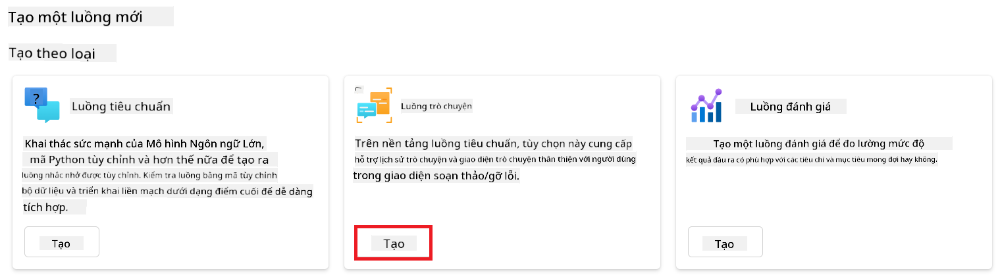

1. Nhập **Folder name** để sử dụng.

    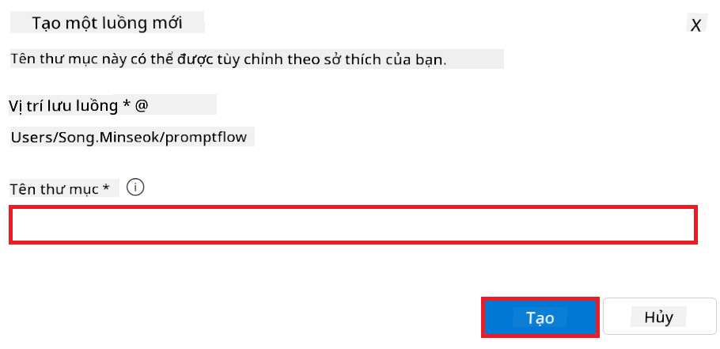

1. Chọn **Create**.

#### Thiết lập Prompt flow để trò chuyện với mô hình Phi-3 / Phi-3.5 tùy chỉnh của bạn

Bạn cần tích hợp mô hình Phi-3 / Phi-3.5 đã tinh chỉnh vào Prompt flow. Tuy nhiên, Prompt flow hiện có không được thiết kế cho mục đích này. Do đó, bạn phải thiết kế lại Prompt flow để cho phép tích hợp mô hình tùy chỉnh.

1. Trong Prompt flow, thực hiện các bước sau để xây dựng lại luồng hiện có:

    - Chọn **Raw file mode**.
    - Xóa toàn bộ mã hiện có trong file *flow.dag.yml*.
    - Thêm đoạn mã sau vào *flow.dag.yml*.

        ```yml
        inputs:
          input_data:
            type: string
            default: "Who founded Microsoft?"

        outputs:
          answer:
            type: string
            reference: ${integrate_with_promptflow.output}

        nodes:
        - name: integrate_with_promptflow
          type: python
          source:
            type: code
            path: integrate_with_promptflow.py
          inputs:
            input_data: ${inputs.input_data}
        ```

    - Chọn **Save**.

    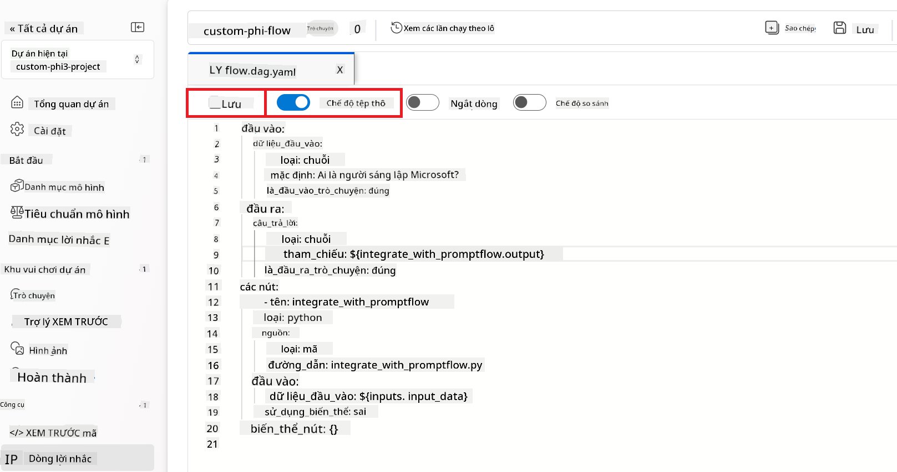

1. Thêm đoạn mã sau vào *integrate_with_promptflow.py* để sử dụng mô hình Phi-3 / Phi-3.5 tùy chỉnh trong Prompt flow.

    ```python
    import logging
    import requests
    from promptflow import tool
    from promptflow.connections import CustomConnection

    # Logging setup
    logging.basicConfig(
        format="%(asctime)s - %(levelname)s - %(name)s - %(message)s",
        datefmt="%Y-%m-%d %H:%M:%S",
        level=logging.DEBUG
    )
    logger = logging.getLogger(__name__)

    def query_phi3_model(input_data: str, connection: CustomConnection) -> str:
        """
        Send a request to the Phi-3 / Phi-3.5 model endpoint with the given input data using Custom Connection.
        """

        # "connection" is the name of the Custom Connection, "endpoint", "key" are the keys in the Custom Connection
        endpoint_url = connection.endpoint
        api_key = connection.key

        headers = {
            "Content-Type": "application/json",
            "Authorization": f"Bearer {api_key}"
        }
    data = {
        "input_data": [input_data],
        "params": {
            "temperature": 0.7,
            "max_new_tokens": 128,
            "do_sample": True,
            "return_full_text": True
            }
        }
        try:
            response = requests.post(endpoint_url, json=data, headers=headers)
            response.raise_for_status()
            
            # Log the full JSON response
            logger.debug(f"Full JSON response: {response.json()}")

            result = response.json()["output"]
            logger.info("Successfully received response from Azure ML Endpoint.")
            return result
        except requests.exceptions.RequestException as e:
            logger.error(f"Error querying Azure ML Endpoint: {e}")
            raise

    @tool
    def my_python_tool(input_data: str, connection: CustomConnection) -> str:
        """
        Tool function to process input data and query the Phi-3 / Phi-3.5 model.
        """
        return query_phi3_model(input_data, connection)

    ```

    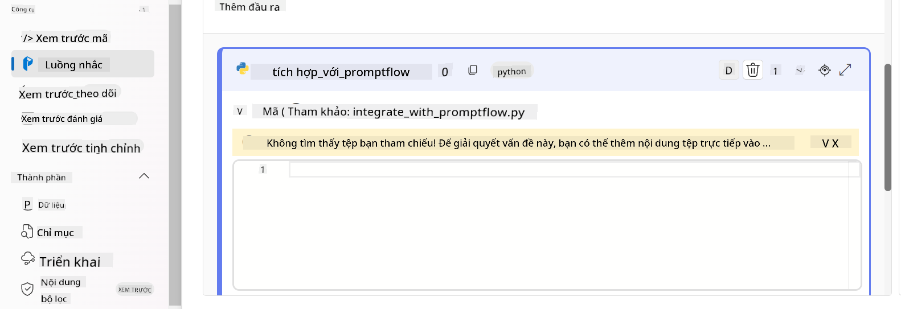

> [!NOTE]
> Để biết thêm thông tin chi tiết về cách sử dụng Prompt flow trong Azure AI Foundry, bạn có thể tham khảo [Prompt flow in Azure AI Foundry](https://learn.microsoft.com/azure/ai-studio/how-to/prompt-flow).

1. Chọn **Chat input**, **Chat output** để bật tính năng trò chuyện với mô hình của bạn.

    

1. Bây giờ bạn đã sẵn sàng để trò chuyện với mô hình Phi-3 / Phi-3.5 tùy chỉnh của mình. Trong bài tập tiếp theo, bạn sẽ học cách khởi động Prompt flow và sử dụng nó để trò chuyện với mô hình Phi-3 / Phi-3.5 đã tinh chỉnh.

> [!NOTE]
>
> Luồng được xây dựng lại sẽ trông giống như hình dưới đây:
>
> 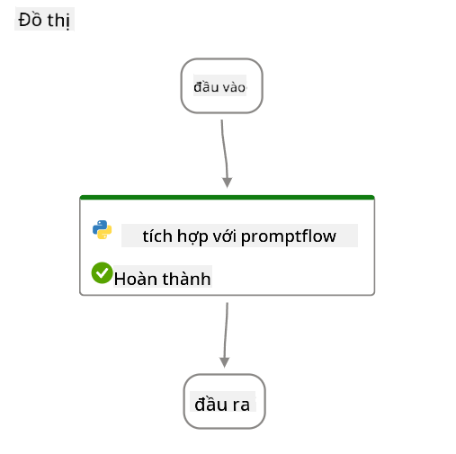
>

#### Khởi động Prompt flow

1. Chọn **Start compute sessions** để bắt đầu Prompt flow.

    

1. Chọn **Validate and parse input** để làm mới các tham số.

    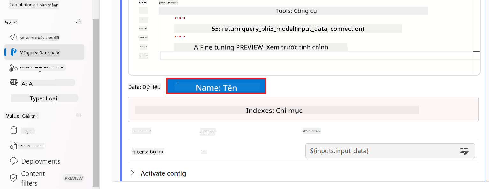

1. Chọn **Value** của **connection** đến kết nối tùy chỉnh bạn đã tạo. Ví dụ, *connection*.

    

#### Trò chuyện với mô hình Phi-3 / Phi-3.5 tùy chỉnh của bạn

1. Chọn **Chat**.

    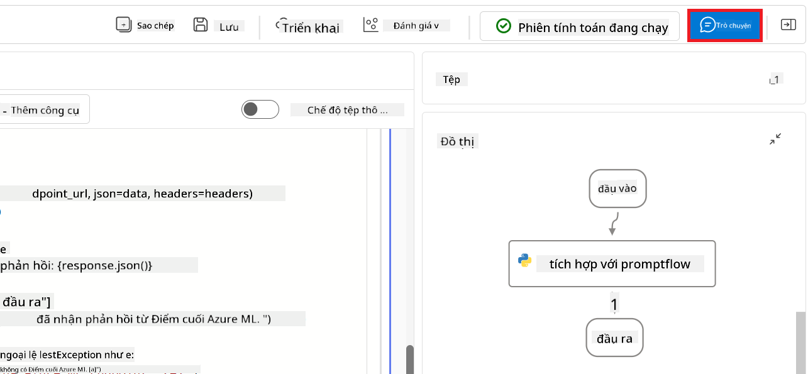

1. Đây là ví dụ về kết quả: Bây giờ bạn có thể trò chuyện với mô hình Phi-3 / Phi-3.5 tùy chỉnh của mình. Nên đặt câu hỏi dựa trên dữ liệu đã dùng để tinh chỉnh.

    

### Triển khai Azure OpenAI để đánh giá mô hình Phi-3 / Phi-3.5

Để đánh giá mô hình Phi-3 / Phi-3.5 trong Azure AI Foundry, bạn cần triển khai một mô hình Azure OpenAI. Mô hình này sẽ được sử dụng để đánh giá hiệu suất của mô hình Phi-3 / Phi-3.5.

#### Triển khai Azure OpenAI

1. Đăng nhập vào [Azure AI Foundry](https://ai.azure.com/?wt.mc_id=studentamb_279723).

1. Điều hướng đến project Azure AI Foundry mà bạn đã tạo.

    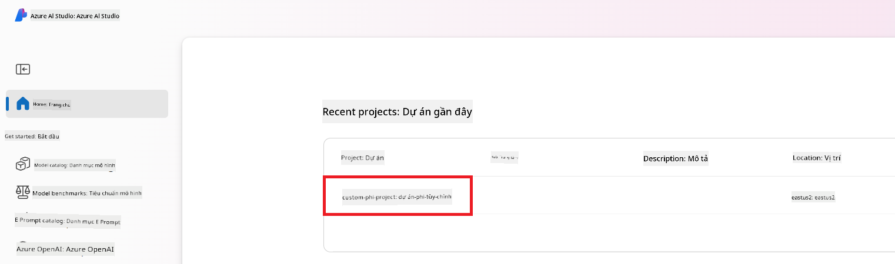

1. Trong Project bạn đã tạo, chọn **Deployments** từ tab bên trái.

1. Chọn **+ Deploy model** từ menu điều hướng.

1. Chọn **Deploy base model**.

    

1. Chọn mô hình Azure OpenAI bạn muốn sử dụng. Ví dụ, **gpt-4o**.

    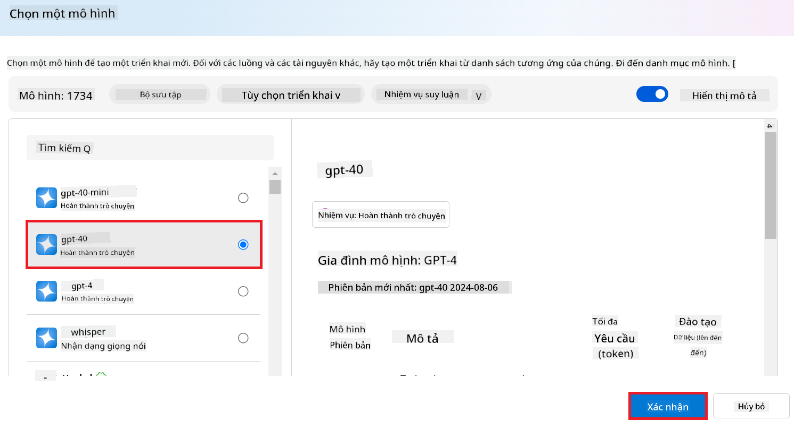

1. Chọn **Confirm**.

### Đánh giá mô hình Phi-3 / Phi-3.5 đã tinh chỉnh bằng Prompt flow evaluation của Azure AI Foundry

### Bắt đầu đánh giá mới

1. Truy cập [Azure AI Foundry](https://ai.azure.com/?wt.mc_id=studentamb_279723).

1. Điều hướng đến project Azure AI Foundry mà bạn đã tạo.

    

1. Trong Project bạn đã tạo, chọn **Evaluation** từ tab bên trái.

1. Chọn **+ New evaluation** từ menu điều hướng.

    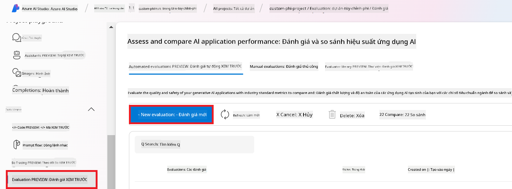

1. Chọn đánh giá **Prompt flow**.

    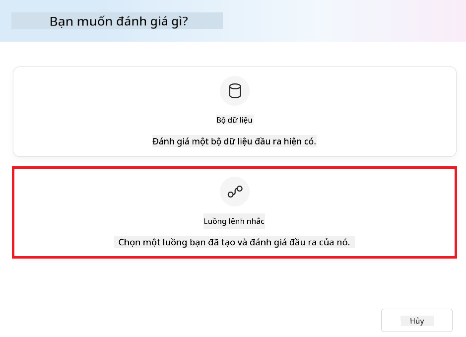

1. Thực hiện các bước sau:

    - Nhập tên đánh giá. Giá trị này phải duy nhất.
    - Chọn **Question and answer without context** làm loại tác vụ. Vì bộ dữ liệu **ULTRACHAT_200k** được sử dụng trong hướng dẫn này không chứa ngữ cảnh.
    - Chọn prompt flow bạn muốn đánh giá.

    

1. Chọn **Next**.

1. Thực hiện các bước sau:

    - Chọn **Add your dataset** để tải lên bộ dữ liệu. Ví dụ, bạn có thể tải lên file bộ dữ liệu kiểm tra, như *test_data.json1*, có trong bộ dữ liệu **ULTRACHAT_200k**.
    - Chọn **Dataset column** phù hợp với bộ dữ liệu của bạn. Ví dụ, nếu bạn dùng bộ dữ liệu **ULTRACHAT_200k**, chọn **${data.prompt}** làm cột dữ liệu.

    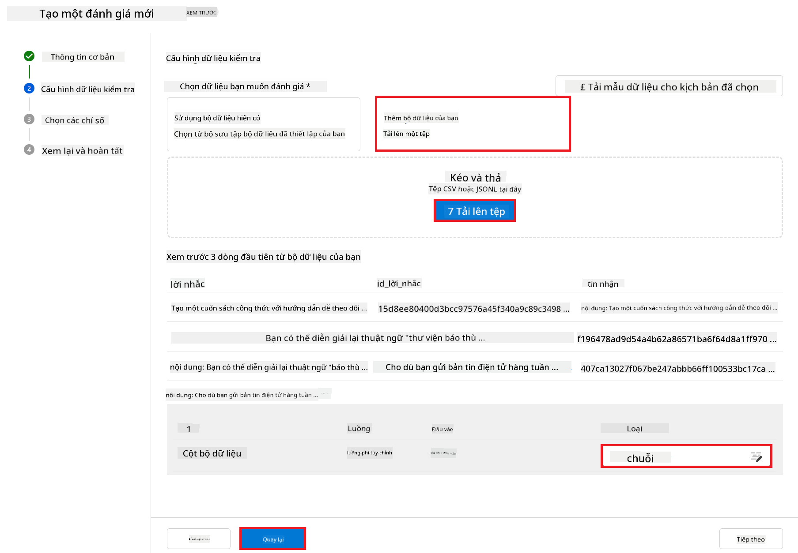

1. Chọn **Next**.

1. Thực hiện các bước sau để cấu hình các chỉ số hiệu suất và chất lượng:

    - Chọn các chỉ số hiệu suất và chất lượng bạn muốn sử dụng.
    - Chọn mô hình Azure OpenAI bạn đã tạo để đánh giá. Ví dụ, chọn **gpt-4o**.

    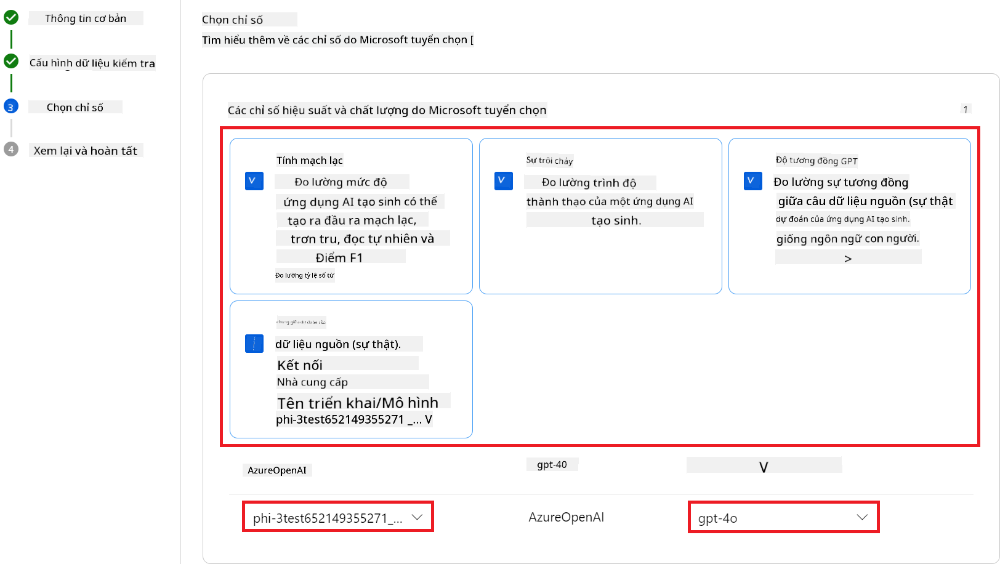

1. Thực hiện các bước sau để cấu hình các chỉ số rủi ro và an toàn:

    - Chọn các chỉ số rủi ro và an toàn bạn muốn sử dụng.
    - Chọn ngưỡng để tính tỷ lệ lỗi bạn muốn sử dụng. Ví dụ, chọn **Medium**.
    - Với **question**, chọn **Data source** là **{$data.prompt}**.
    - Với **answer**, chọn **Data source** là **{$run.outputs.answer}**.
    - Với **ground_truth**, chọn **Data source** là **{$data.message}**.

    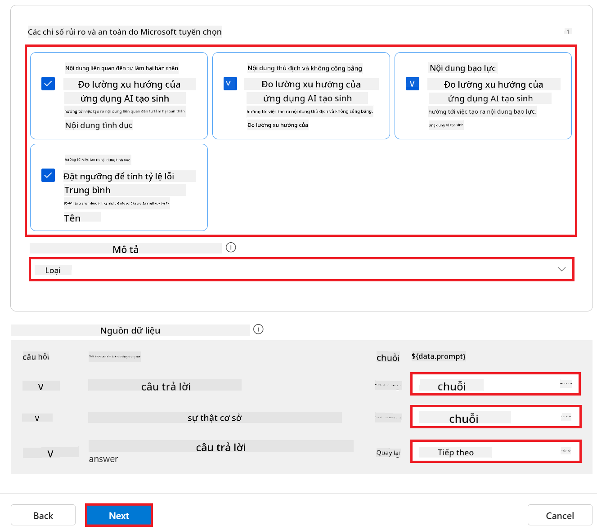

1. Chọn **Next**.

1. Chọn **Submit** để bắt đầu đánh giá.

1. Quá trình đánh giá sẽ mất một thời gian để hoàn thành. Bạn có thể theo dõi tiến trình trong tab **Evaluation**.

### Xem lại kết quả đánh giá
> [!NOTE]
> Kết quả trình bày dưới đây nhằm minh họa quá trình đánh giá. Trong hướng dẫn này, chúng tôi đã sử dụng một mô hình được tinh chỉnh trên một bộ dữ liệu tương đối nhỏ, điều này có thể dẫn đến kết quả không tối ưu. Kết quả thực tế có thể khác biệt đáng kể tùy thuộc vào kích thước, chất lượng và sự đa dạng của bộ dữ liệu sử dụng, cũng như cấu hình cụ thể của mô hình.
Khi việc đánh giá hoàn tất, bạn có thể xem lại kết quả cho cả các chỉ số hiệu suất và an toàn.

1. Các chỉ số hiệu suất và chất lượng:

    - đánh giá hiệu quả của mô hình trong việc tạo ra các phản hồi mạch lạc, trôi chảy và phù hợp.

    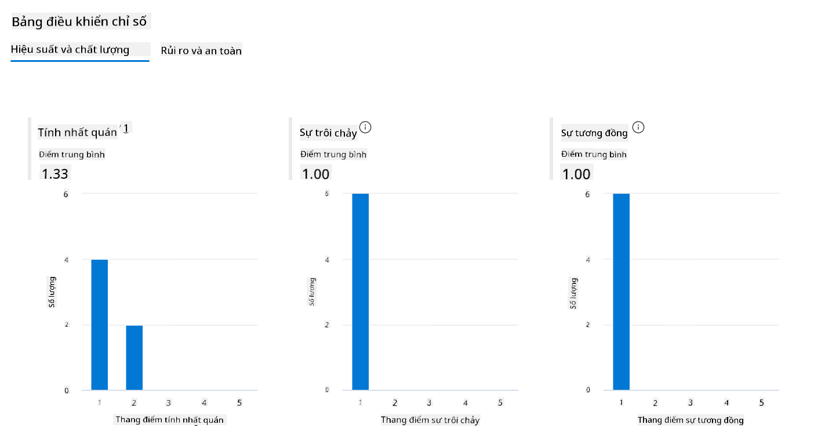

1. Các chỉ số rủi ro và an toàn:

    - Đảm bảo rằng các kết quả đầu ra của mô hình an toàn và tuân thủ các Nguyên tắc AI Có Trách Nhiệm, tránh bất kỳ nội dung gây hại hoặc xúc phạm nào.

    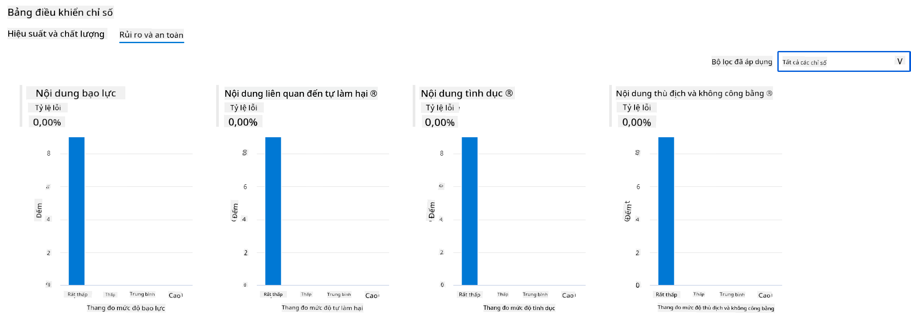

1. Bạn có thể cuộn xuống để xem **Kết quả chỉ số chi tiết**.

    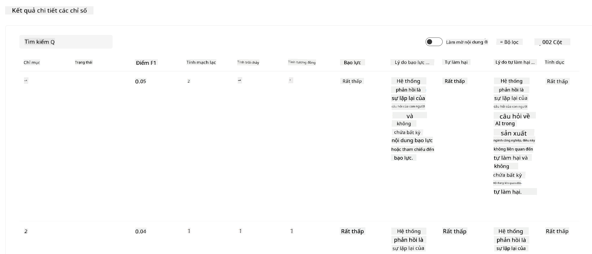

1. Bằng cách đánh giá mô hình Phi-3 / Phi-3.5 tùy chỉnh của bạn dựa trên cả chỉ số hiệu suất và an toàn, bạn có thể xác nhận rằng mô hình không chỉ hiệu quả mà còn tuân thủ các thực hành AI có trách nhiệm, sẵn sàng cho việc triển khai trong thực tế.

## Chúc mừng!

### Bạn đã hoàn thành hướng dẫn này

Bạn đã đánh giá thành công mô hình Phi-3 được tinh chỉnh và tích hợp với Prompt flow trong Azure AI Foundry. Đây là bước quan trọng để đảm bảo các mô hình AI của bạn không chỉ hoạt động tốt mà còn tuân thủ các nguyên tắc AI Có Trách Nhiệm của Microsoft, giúp bạn xây dựng các ứng dụng AI đáng tin cậy và an toàn.


## Dọn dẹp tài nguyên Azure

Dọn dẹp các tài nguyên Azure của bạn để tránh phát sinh chi phí không mong muốn. Truy cập cổng Azure và xóa các tài nguyên sau:

- Tài nguyên Azure Machine learning.
- Điểm cuối mô hình Azure Machine learning.
- Tài nguyên dự án Azure AI Foundry.
- Tài nguyên Prompt flow của Azure AI Foundry.

### Các bước tiếp theo

#### Tài liệu

- [Đánh giá hệ thống AI bằng cách sử dụng bảng điều khiển Responsible AI](https://learn.microsoft.com/azure/machine-learning/concept-responsible-ai-dashboard?view=azureml-api-2&source=recommendations?wt.mc_id=studentamb_279723)
- [Các chỉ số đánh giá và giám sát cho AI tạo sinh](https://learn.microsoft.com/azure/ai-studio/concepts/evaluation-metrics-built-in?tabs=definition?wt.mc_id=studentamb_279723)
- [Tài liệu Azure AI Foundry](https://learn.microsoft.com/azure/ai-studio/?wt.mc_id=studentamb_279723)
- [Tài liệu Prompt flow](https://microsoft.github.io/promptflow/?wt.mc_id=studentamb_279723)

#### Nội dung đào tạo

- [Giới thiệu về Phương pháp AI Có Trách Nhiệm của Microsoft](https://learn.microsoft.com/training/modules/introduction-to-microsofts-responsible-ai-approach/?source=recommendations?wt.mc_id=studentamb_279723)
- [Giới thiệu về Azure AI Foundry](https://learn.microsoft.com/training/modules/introduction-to-azure-ai-studio/?wt.mc_id=studentamb_279723)

### Tham khảo

- [AI Có Trách Nhiệm là gì?](https://learn.microsoft.com/azure/machine-learning/concept-responsible-ai?view=azureml-api-2?wt.mc_id=studentamb_279723)
- [Thông báo công cụ mới trong Azure AI giúp bạn xây dựng các ứng dụng AI tạo sinh an toàn và đáng tin cậy hơn](https://azure.microsoft.com/blog/announcing-new-tools-in-azure-ai-to-help-you-build-more-secure-and-trustworthy-generative-ai-applications/?wt.mc_id=studentamb_279723)
- [Đánh giá các ứng dụng AI tạo sinh](https://learn.microsoft.com/azure/ai-studio/concepts/evaluation-approach-gen-ai?wt.mc_id%3Dstudentamb_279723)

**Tuyên bố từ chối trách nhiệm**:  
Tài liệu này đã được dịch bằng dịch vụ dịch thuật AI [Co-op Translator](https://github.com/Azure/co-op-translator). Mặc dù chúng tôi cố gắng đảm bảo độ chính xác, xin lưu ý rằng các bản dịch tự động có thể chứa lỗi hoặc không chính xác. Tài liệu gốc bằng ngôn ngữ gốc của nó nên được coi là nguồn chính xác và đáng tin cậy. Đối với các thông tin quan trọng, nên sử dụng dịch vụ dịch thuật chuyên nghiệp do con người thực hiện. Chúng tôi không chịu trách nhiệm về bất kỳ sự hiểu lầm hoặc giải thích sai nào phát sinh từ việc sử dụng bản dịch này.