<!--
CO_OP_TRANSLATOR_METADATA:
{
  "original_hash": "80a853c08e4ee25ef9b4bfcedd8990da",
  "translation_date": "2025-05-09T16:58:12+00:00",
  "source_file": "md/02.Application/01.TextAndChat/Phi3/E2E_Phi-3-Evaluation_AIFoundry.md",
  "language_code": "vi"
}
-->
# Đánh giá Mô hình Phi-3 / Phi-3.5 được Tinh chỉnh trong Azure AI Foundry với Trọng tâm là Nguyên tắc AI Có Trách nhiệm của Microsoft

Ví dụ đầu cuối (E2E) này dựa trên hướng dẫn "[Evaluate Fine-tuned Phi-3 / 3.5 Models in Azure AI Foundry Focusing on Microsoft's Responsible AI](https://techcommunity.microsoft.com/blog/educatordeveloperblog/evaluate-fine-tuned-phi-3--3-5-models-in-azure-ai-studio-focusing-on-microsofts-/4227850?WT.mc_id=aiml-137032-kinfeylo)" từ Microsoft Tech Community.

## Tổng quan

### Làm thế nào để đánh giá an toàn và hiệu suất của mô hình Phi-3 / Phi-3.5 được tinh chỉnh trong Azure AI Foundry?

Việc tinh chỉnh mô hình đôi khi có thể dẫn đến các phản hồi không mong muốn hoặc không dự định. Để đảm bảo mô hình vẫn an toàn và hiệu quả, bạn cần đánh giá khả năng tạo ra nội dung có hại và khả năng cung cấp các phản hồi chính xác, phù hợp và mạch lạc của mô hình. Trong hướng dẫn này, bạn sẽ học cách đánh giá an toàn và hiệu suất của mô hình Phi-3 / Phi-3.5 được tinh chỉnh, tích hợp với Prompt flow trong Azure AI Foundry.

Dưới đây là quy trình đánh giá của Azure AI Foundry.


*Nguồn ảnh: [Evaluation of generative AI applications](https://learn.microsoft.com/azure/ai-studio/concepts/evaluation-approach-gen-ai?wt.mc_id%3Dstudentamb_279723)*

> [!NOTE]
>
> Để biết thêm thông tin chi tiết và khám phá các tài nguyên về Phi-3 / Phi-3.5, vui lòng truy cập [Phi-3CookBook](https://github.com/microsoft/Phi-3CookBook?wt.mc_id=studentamb_279723).

### Yêu cầu trước

- [Python](https://www.python.org/downloads)
- [Azure subscription](https://azure.microsoft.com/free?wt.mc_id=studentamb_279723)
- [Visual Studio Code](https://code.visualstudio.com)
- Mô hình Phi-3 / Phi-3.5 đã được tinh chỉnh

### Mục lục

1. [**Tình huống 1: Giới thiệu về đánh giá Prompt flow của Azure AI Foundry**](../../../../../../md/02.Application/01.TextAndChat/Phi3)

    - [Giới thiệu đánh giá an toàn](../../../../../../md/02.Application/01.TextAndChat/Phi3)
    - [Giới thiệu đánh giá hiệu suất](../../../../../../md/02.Application/01.TextAndChat/Phi3)

1. [**Tình huống 2: Đánh giá mô hình Phi-3 / Phi-3.5 trong Azure AI Foundry**](../../../../../../md/02.Application/01.TextAndChat/Phi3)

    - [Trước khi bắt đầu](../../../../../../md/02.Application/01.TextAndChat/Phi3)
    - [Triển khai Azure OpenAI để đánh giá mô hình Phi-3 / Phi-3.5](../../../../../../md/02.Application/01.TextAndChat/Phi3)
    - [Đánh giá mô hình Phi-3 / Phi-3.5 được tinh chỉnh bằng đánh giá Prompt flow của Azure AI Foundry](../../../../../../md/02.Application/01.TextAndChat/Phi3)

1. [Chúc mừng!](../../../../../../md/02.Application/01.TextAndChat/Phi3)

## **Tình huống 1: Giới thiệu về đánh giá Prompt flow của Azure AI Foundry**

### Giới thiệu đánh giá an toàn

Để đảm bảo mô hình AI của bạn có đạo đức và an toàn, điều quan trọng là phải đánh giá nó dựa trên Nguyên tắc AI Có Trách nhiệm của Microsoft. Trong Azure AI Foundry, đánh giá an toàn giúp bạn kiểm tra khả năng mô hình bị tấn công jailbreak và khả năng tạo ra nội dung có hại, hoàn toàn phù hợp với các nguyên tắc này.

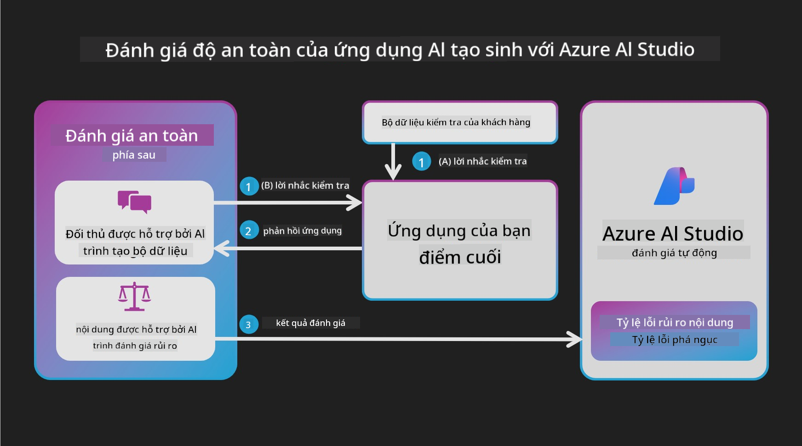

*Nguồn ảnh: [Evaluation of generative AI applications](https://learn.microsoft.com/azure/ai-studio/concepts/evaluation-approach-gen-ai?wt.mc_id%3Dstudentamb_279723)*

#### Nguyên tắc AI Có Trách nhiệm của Microsoft

Trước khi bắt đầu các bước kỹ thuật, bạn cần hiểu rõ Nguyên tắc AI Có Trách nhiệm của Microsoft, một khuôn khổ đạo đức nhằm hướng dẫn việc phát triển, triển khai và vận hành AI có trách nhiệm. Các nguyên tắc này giúp thiết kế, phát triển và triển khai AI một cách công bằng, minh bạch và bao trùm. Đây là nền tảng để đánh giá an toàn của các mô hình AI.

Nguyên tắc AI Có Trách nhiệm của Microsoft bao gồm:

- **Công bằng và Bao trùm**: Hệ thống AI cần đối xử công bằng với mọi người và tránh phân biệt đối xử giữa các nhóm người tương tự. Ví dụ, khi AI cung cấp hướng dẫn về điều trị y tế, hồ sơ vay vốn hoặc tuyển dụng, nó nên đưa ra khuyến nghị giống nhau cho những người có triệu chứng, hoàn cảnh tài chính hoặc trình độ chuyên môn tương tự.

- **Độ tin cậy và An toàn**: Để xây dựng niềm tin, hệ thống AI phải hoạt động ổn định, an toàn và nhất quán. Chúng cần vận hành đúng như thiết kế, phản ứng an toàn với các tình huống không dự đoán được và chống lại sự thao túng có hại. Hành vi và khả năng xử lý các điều kiện khác nhau phản ánh các tình huống mà nhà phát triển đã dự kiến trong quá trình thiết kế và thử nghiệm.

- **Minh bạch**: Khi AI hỗ trợ các quyết định ảnh hưởng lớn đến cuộc sống con người, điều quan trọng là mọi người hiểu cách quyết định đó được đưa ra. Ví dụ, một ngân hàng có thể dùng AI để quyết định ai đủ điều kiện vay tín dụng. Một công ty có thể dùng AI để chọn ứng viên phù hợp nhất.

- **Bảo mật và Riêng tư**: Khi AI ngày càng phổ biến, việc bảo vệ quyền riêng tư và bảo mật thông tin cá nhân và doanh nghiệp trở nên quan trọng và phức tạp hơn. AI đòi hỏi sự chú ý kỹ lưỡng đến quyền riêng tư và bảo mật dữ liệu vì dữ liệu là yếu tố thiết yếu để AI đưa ra dự đoán và quyết định chính xác, thông minh về con người.

- **Trách nhiệm giải trình**: Những người thiết kế và triển khai hệ thống AI phải chịu trách nhiệm về cách hệ thống hoạt động. Các tổ chức nên dựa trên các tiêu chuẩn ngành để phát triển các quy chuẩn trách nhiệm giải trình. Những quy chuẩn này đảm bảo AI không phải là thẩm quyền cuối cùng trong bất kỳ quyết định nào ảnh hưởng đến cuộc sống con người và con người vẫn giữ quyền kiểm soát ý nghĩa đối với các hệ thống AI có tính tự chủ cao.


*Nguồn ảnh: [What is Responsible AI?](https://learn.microsoft.com/azure/machine-learning/concept-responsible-ai?view=azureml-api-2&viewFallbackFrom=azureml-api-2%253fwt.mc_id%3Dstudentamb_279723)*

> [!NOTE]
> Để tìm hiểu thêm về Nguyên tắc AI Có Trách nhiệm của Microsoft, hãy truy cập [What is Responsible AI?](https://learn.microsoft.com/azure/machine-learning/concept-responsible-ai?view=azureml-api-2?wt.mc_id=studentamb_279723).

#### Các chỉ số an toàn

Trong hướng dẫn này, bạn sẽ đánh giá mức độ an toàn của mô hình Phi-3 được tinh chỉnh bằng các chỉ số an toàn của Azure AI Foundry. Các chỉ số này giúp bạn đánh giá khả năng tạo ra nội dung có hại và độ dễ bị tấn công jailbreak của mô hình. Các chỉ số an toàn bao gồm:

- **Nội dung liên quan đến tự làm hại**: Đánh giá xem mô hình có xu hướng tạo ra nội dung liên quan đến tự làm hại hay không.
- **Nội dung thù địch và không công bằng**: Đánh giá xem mô hình có xu hướng tạo ra nội dung thù địch hoặc không công bằng hay không.
- **Nội dung bạo lực**: Đánh giá xem mô hình có xu hướng tạo ra nội dung bạo lực hay không.
- **Nội dung khiêu dâm**: Đánh giá xem mô hình có xu hướng tạo ra nội dung tình dục không phù hợp hay không.

Việc đánh giá các khía cạnh này đảm bảo mô hình AI không tạo ra nội dung có hại hoặc xúc phạm, phù hợp với giá trị xã hội và tiêu chuẩn pháp lý.

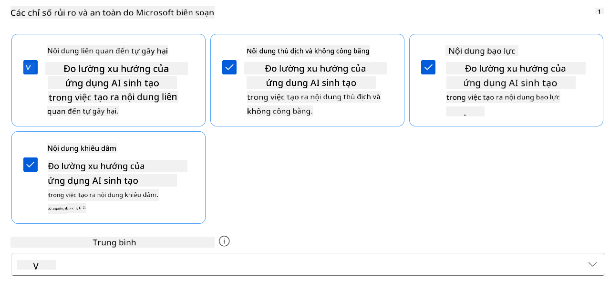

### Giới thiệu đánh giá hiệu suất

Để đảm bảo mô hình AI hoạt động như kỳ vọng, bạn cần đánh giá hiệu suất dựa trên các chỉ số hiệu suất. Trong Azure AI Foundry, đánh giá hiệu suất giúp bạn kiểm tra khả năng mô hình tạo ra các phản hồi chính xác, phù hợp và mạch lạc.


*Nguồn ảnh: [Evaluation of generative AI applications](https://learn.microsoft.com/azure/ai-studio/concepts/evaluation-approach-gen-ai?wt.mc_id%3Dstudentamb_279723)*

#### Các chỉ số hiệu suất

Trong hướng dẫn này, bạn sẽ đánh giá hiệu suất của mô hình Phi-3 / Phi-3.5 được tinh chỉnh bằng các chỉ số hiệu suất của Azure AI Foundry. Các chỉ số này giúp bạn đánh giá khả năng mô hình tạo ra các phản hồi chính xác, phù hợp và mạch lạc. Các chỉ số hiệu suất bao gồm:

- **Tính cơ sở (Groundedness)**: Đánh giá mức độ phản hồi phù hợp với thông tin từ nguồn đầu vào.
- **Tính liên quan (Relevance)**: Đánh giá mức độ phù hợp của phản hồi với câu hỏi được đặt ra.
- **Tính mạch lạc (Coherence)**: Đánh giá sự trôi chảy, tự nhiên và giống ngôn ngữ con người của văn bản được tạo ra.
- **Tính lưu loát (Fluency)**: Đánh giá trình độ ngôn ngữ của văn bản được tạo ra.
- **Độ tương đồng với GPT (GPT Similarity)**: So sánh phản hồi được tạo ra với dữ liệu gốc để đánh giá độ tương đồng.
- **Điểm F1 (F1 Score)**: Tính tỷ lệ từ chung giữa phản hồi tạo ra và dữ liệu nguồn.

Các chỉ số này giúp bạn đánh giá hiệu quả của mô hình trong việc tạo ra các phản hồi chính xác, phù hợp và mạch lạc.

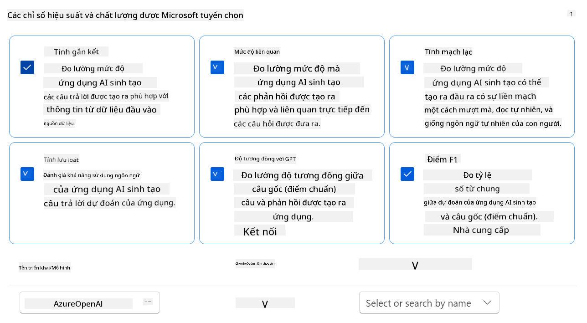

## **Tình huống 2: Đánh giá mô hình Phi-3 / Phi-3.5 trong Azure AI Foundry**

### Trước khi bắt đầu

Hướng dẫn này là phần tiếp theo của các bài viết trước, "[Fine-Tune and Integrate Custom Phi-3 Models with Prompt Flow: Step-by-Step Guide](https://techcommunity.microsoft.com/t5/educator-developer-blog/fine-tune-and-integrate-custom-phi-3-models-with-prompt-flow/ba-p/4178612?wt.mc_id=studentamb_279723)" và "[Fine-Tune and Integrate Custom Phi-3 Models with Prompt Flow in Azure AI Foundry](https://techcommunity.microsoft.com/t5/educator-developer-blog/fine-tune-and-integrate-custom-phi-3-models-with-prompt-flow-in/ba-p/4191726?wt.mc_id=studentamb_279723)." Trong các bài viết này, chúng ta đã đi qua quy trình tinh chỉnh mô hình Phi-3 / Phi-3.5 trong Azure AI Foundry và tích hợp với Prompt flow.

Trong hướng dẫn này, bạn sẽ triển khai mô hình Azure OpenAI làm bộ đánh giá trong Azure AI Foundry và sử dụng nó để đánh giá mô hình Phi-3 / Phi-3.5 được tinh chỉnh của bạn.

Trước khi bắt đầu hướng dẫn này, hãy đảm bảo bạn có các yêu cầu sau, như đã mô tả trong các hướng dẫn trước:

1. Một bộ dữ liệu đã chuẩn bị để đánh giá mô hình Phi-3 / Phi-3.5 được tinh chỉnh.
1. Một mô hình Phi-3 / Phi-3.5 đã được tinh chỉnh và triển khai trên Azure Machine Learning.
1. Một Prompt flow đã tích hợp với mô hình Phi-3 / Phi-3.5 được tinh chỉnh trong Azure AI Foundry.

> [!NOTE]
> Bạn sẽ sử dụng tệp *test_data.jsonl*, nằm trong thư mục dữ liệu của bộ dữ liệu **ULTRACHAT_200k** đã tải về trong các bài viết trước, làm bộ dữ liệu để đánh giá mô hình Phi-3 / Phi-3.5 được tinh chỉnh.

#### Tích hợp mô hình Phi-3 / Phi-3.5 tùy chỉnh với Prompt flow trong Azure AI Foundry (phương pháp viết mã trước)

> [!NOTE]
> Nếu bạn đã theo phương pháp low-code mô tả trong "[Fine-Tune and Integrate Custom Phi-3 Models with Prompt Flow in Azure AI Foundry](https://techcommunity.microsoft.com/t5/educator-developer-blog/fine-tune-and-integrate-custom-phi-3-models-with-prompt-flow-in/ba-p/4191726?wt.mc_id=studentamb_279723)", bạn có thể bỏ qua bài tập này và tiếp tục bài tiếp theo.
> Tuy nhiên, nếu bạn đã theo phương pháp code-first mô tả trong "[Fine-Tune and Integrate Custom Phi-3 Models with Prompt Flow: Step-by-Step Guide](https://techcommunity.microsoft.com/t5/educator-developer-blog/fine-tune-and-integrate-custom-phi-3-models-with-prompt-flow/ba-p/4178612?wt.mc_id=studentamb_279723)" để tinh chỉnh và triển khai mô hình Phi-3 / Phi-3.5, quy trình kết nối mô hình với Prompt flow sẽ khác một chút. Bạn sẽ học quy trình này trong bài tập này.

Để tiếp tục, bạn cần tích hợp mô hình Phi-3 / Phi-3.5 được tinh chỉnh vào Prompt flow trong Azure AI Foundry.

#### Tạo Azure AI Foundry Hub

Bạn cần tạo một Hub trước khi tạo Project. Hub hoạt động như một Resource Group, giúp bạn tổ chức và quản lý nhiều Project trong Azure AI Foundry.

1. Đăng nhập [Azure AI Foundry](https://ai.azure.com/?wt.mc_id=studentamb_279723).

1. Chọn **All hubs** từ thanh tab bên trái.

1. Chọn **+ New hub** từ menu điều hướng.

    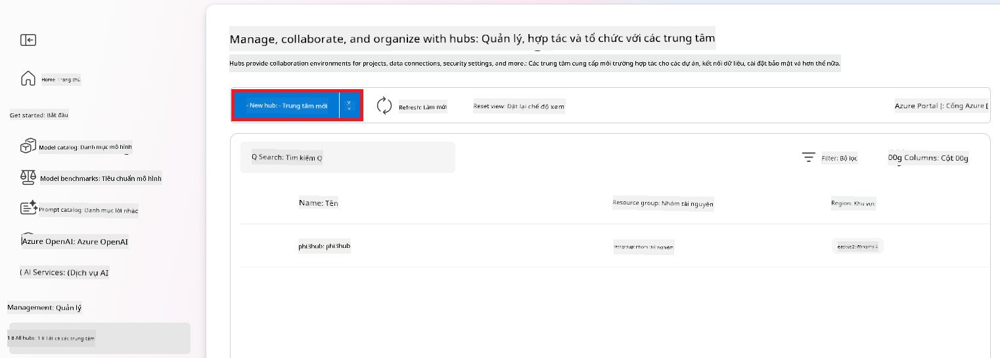

1. Thực hiện các bước sau:

    - Nhập **Hub name**. Tên này phải duy nhất.
    - Chọn **Subscription** Azure của bạn.
    - Chọn **Resource group** muốn sử dụng (tạo mới nếu cần).
    - Chọn **Location** bạn muốn sử dụng.
    - Chọn **Connect Azure AI Services** để sử dụng (tạo mới nếu cần).
    - Chọn **Connect Azure AI Search** và chọn **Skip connecting**.
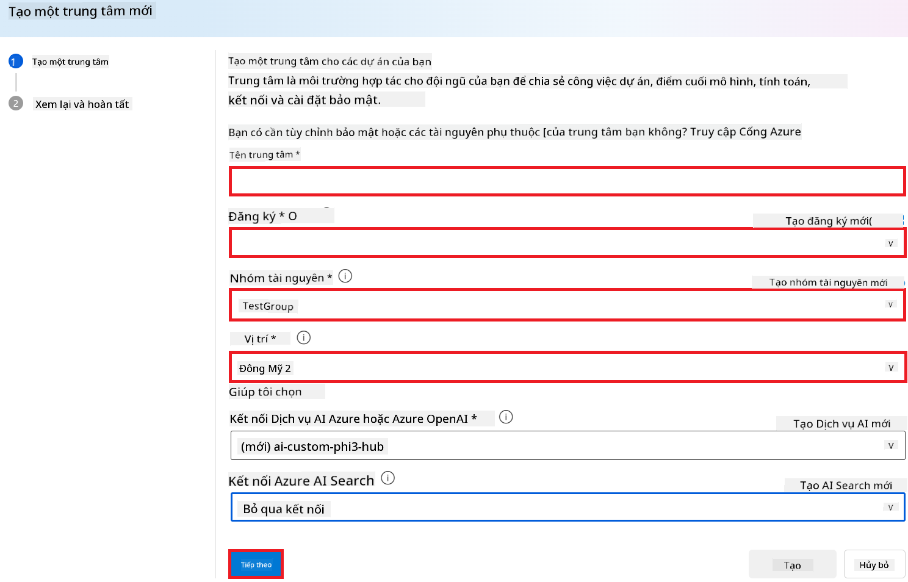

1. Chọn **Next**.

#### Tạo dự án Azure AI Foundry

1. Trong Hub bạn đã tạo, chọn **All projects** từ tab bên trái.

1. Chọn **+ New project** từ menu điều hướng.

    

1. Nhập **Project name**. Giá trị này phải duy nhất.

    

1. Chọn **Create a project**.

#### Thêm kết nối tùy chỉnh cho mô hình Phi-3 / Phi-3.5 đã tinh chỉnh

Để tích hợp mô hình Phi-3 / Phi-3.5 tùy chỉnh với Prompt flow, bạn cần lưu endpoint và key của mô hình trong một kết nối tùy chỉnh. Thiết lập này đảm bảo bạn có thể truy cập mô hình Phi-3 / Phi-3.5 tùy chỉnh trong Prompt flow.

#### Cài đặt api key và endpoint uri cho mô hình Phi-3 / Phi-3.5 đã tinh chỉnh

1. Truy cập [Azure ML Studio](https://ml.azure.com/home?wt.mc_id=studentamb_279723).

1. Điều hướng đến workspace Azure Machine learning mà bạn đã tạo.

1. Chọn **Endpoints** từ tab bên trái.

    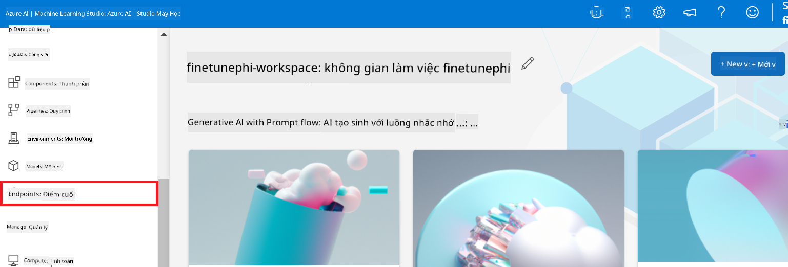

1. Chọn endpoint bạn đã tạo.

    

1. Chọn **Consume** từ menu điều hướng.

1. Sao chép **REST endpoint** và **Primary key** của bạn.

    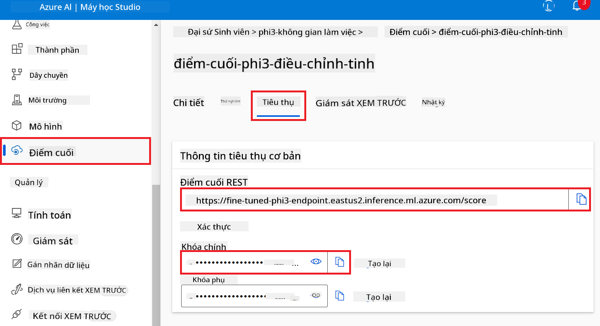

#### Thêm kết nối tùy chỉnh

1. Truy cập [Azure AI Foundry](https://ai.azure.com/?wt.mc_id=studentamb_279723).

1. Điều hướng đến dự án Azure AI Foundry bạn đã tạo.

1. Trong dự án, chọn **Settings** từ tab bên trái.

1. Chọn **+ New connection**.

    

1. Chọn **Custom keys** từ menu điều hướng.

    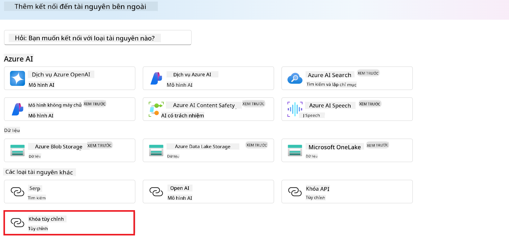

1. Thực hiện các bước sau:

    - Chọn **+ Add key value pairs**.
    - Ở tên khóa, nhập **endpoint** và dán endpoint bạn đã sao chép từ Azure ML Studio vào ô giá trị.
    - Chọn lại **+ Add key value pairs**.
    - Ở tên khóa, nhập **key** và dán key bạn đã sao chép từ Azure ML Studio vào ô giá trị.
    - Sau khi thêm các khóa, chọn **is secret** để bảo mật key không bị lộ.

    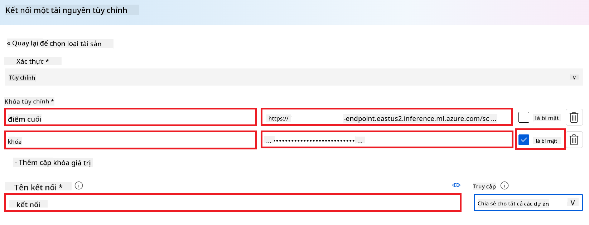

1. Chọn **Add connection**.

#### Tạo Prompt flow

Bạn đã thêm kết nối tùy chỉnh trong Azure AI Foundry. Bây giờ, hãy tạo một Prompt flow theo các bước dưới đây. Sau đó, bạn sẽ kết nối Prompt flow này với kết nối tùy chỉnh để sử dụng mô hình đã tinh chỉnh trong Prompt flow.

1. Điều hướng đến dự án Azure AI Foundry bạn đã tạo.

1. Chọn **Prompt flow** từ tab bên trái.

1. Chọn **+ Create** từ menu điều hướng.

    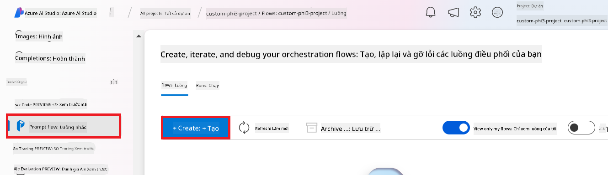

1. Chọn **Chat flow** từ menu điều hướng.

    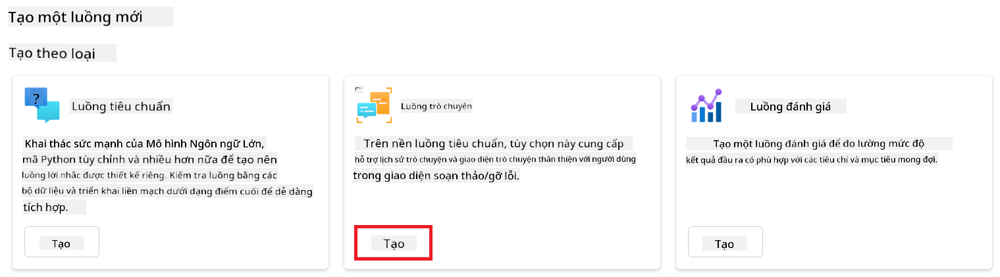

1. Nhập **Folder name** bạn muốn sử dụng.

    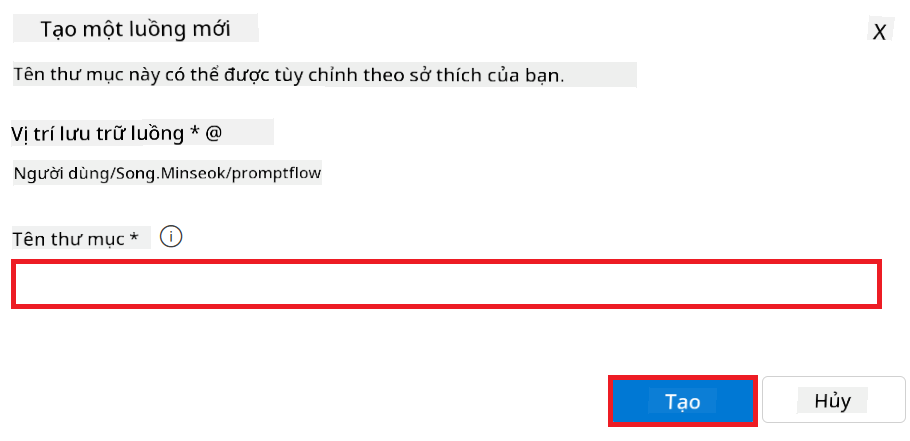

1. Chọn **Create**.

#### Thiết lập Prompt flow để trò chuyện với mô hình Phi-3 / Phi-3.5 tùy chỉnh

Bạn cần tích hợp mô hình Phi-3 / Phi-3.5 đã tinh chỉnh vào Prompt flow. Tuy nhiên, Prompt flow hiện tại không được thiết kế cho mục đích này. Do đó, bạn cần thiết kế lại Prompt flow để có thể tích hợp mô hình tùy chỉnh.

1. Trong Prompt flow, thực hiện các bước sau để xây dựng lại luồng hiện có:

    - Chọn **Raw file mode**.
    - Xóa toàn bộ mã hiện có trong file *flow.dag.yml*.
    - Thêm đoạn mã sau vào *flow.dag.yml*.

        ```yml
        inputs:
          input_data:
            type: string
            default: "Who founded Microsoft?"

        outputs:
          answer:
            type: string
            reference: ${integrate_with_promptflow.output}

        nodes:
        - name: integrate_with_promptflow
          type: python
          source:
            type: code
            path: integrate_with_promptflow.py
          inputs:
            input_data: ${inputs.input_data}
        ```

    - Chọn **Save**.

    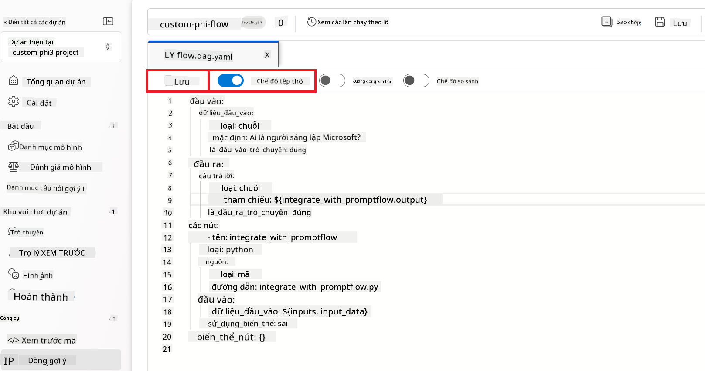

1. Thêm đoạn mã sau vào *integrate_with_promptflow.py* để sử dụng mô hình Phi-3 / Phi-3.5 tùy chỉnh trong Prompt flow.

    ```python
    import logging
    import requests
    from promptflow import tool
    from promptflow.connections import CustomConnection

    # Logging setup
    logging.basicConfig(
        format="%(asctime)s - %(levelname)s - %(name)s - %(message)s",
        datefmt="%Y-%m-%d %H:%M:%S",
        level=logging.DEBUG
    )
    logger = logging.getLogger(__name__)

    def query_phi3_model(input_data: str, connection: CustomConnection) -> str:
        """
        Send a request to the Phi-3 / Phi-3.5 model endpoint with the given input data using Custom Connection.
        """

        # "connection" is the name of the Custom Connection, "endpoint", "key" are the keys in the Custom Connection
        endpoint_url = connection.endpoint
        api_key = connection.key

        headers = {
            "Content-Type": "application/json",
            "Authorization": f"Bearer {api_key}"
        }
    data = {
        "input_data": [input_data],
        "params": {
            "temperature": 0.7,
            "max_new_tokens": 128,
            "do_sample": True,
            "return_full_text": True
            }
        }
        try:
            response = requests.post(endpoint_url, json=data, headers=headers)
            response.raise_for_status()
            
            # Log the full JSON response
            logger.debug(f"Full JSON response: {response.json()}")

            result = response.json()["output"]
            logger.info("Successfully received response from Azure ML Endpoint.")
            return result
        except requests.exceptions.RequestException as e:
            logger.error(f"Error querying Azure ML Endpoint: {e}")
            raise

    @tool
    def my_python_tool(input_data: str, connection: CustomConnection) -> str:
        """
        Tool function to process input data and query the Phi-3 / Phi-3.5 model.
        """
        return query_phi3_model(input_data, connection)

    ```

    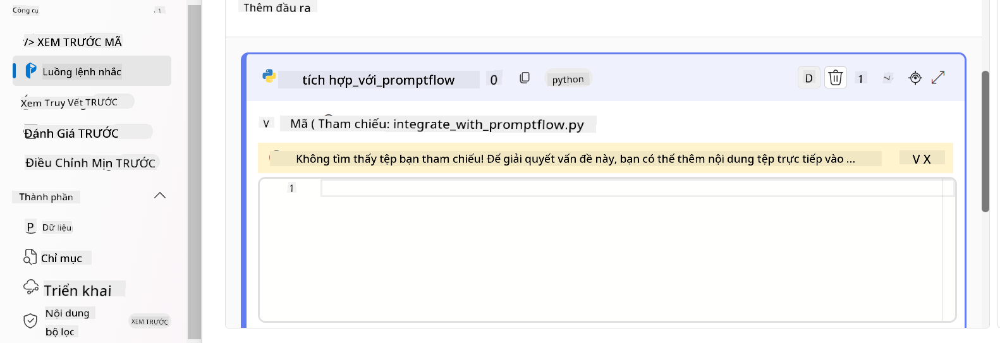

> [!NOTE]
> Để biết thêm chi tiết về cách sử dụng Prompt flow trong Azure AI Foundry, bạn có thể tham khảo [Prompt flow in Azure AI Foundry](https://learn.microsoft.com/azure/ai-studio/how-to/prompt-flow).

1. Chọn **Chat input**, **Chat output** để bật tính năng trò chuyện với mô hình của bạn.

    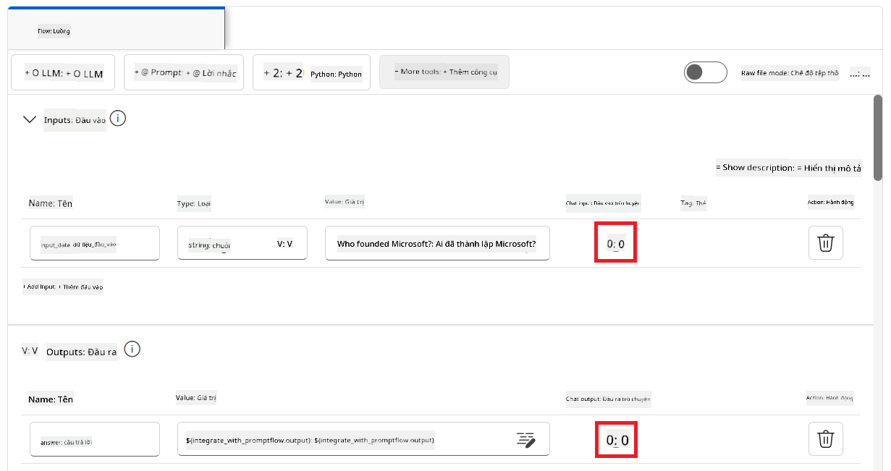

1. Bây giờ bạn đã sẵn sàng trò chuyện với mô hình Phi-3 / Phi-3.5 tùy chỉnh. Trong bài tập tiếp theo, bạn sẽ học cách khởi động Prompt flow và sử dụng nó để trò chuyện với mô hình đã tinh chỉnh.

> [!NOTE]
>
> Luồng đã xây dựng lại sẽ trông như hình dưới đây:
>
> 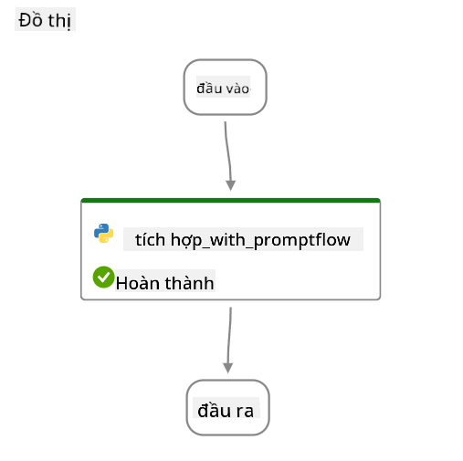
>

#### Khởi động Prompt flow

1. Chọn **Start compute sessions** để bắt đầu Prompt flow.

    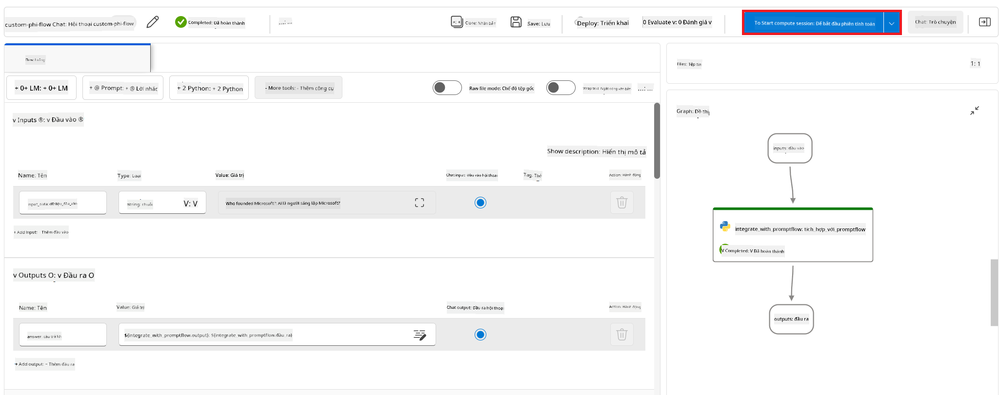

1. Chọn **Validate and parse input** để làm mới các tham số.

    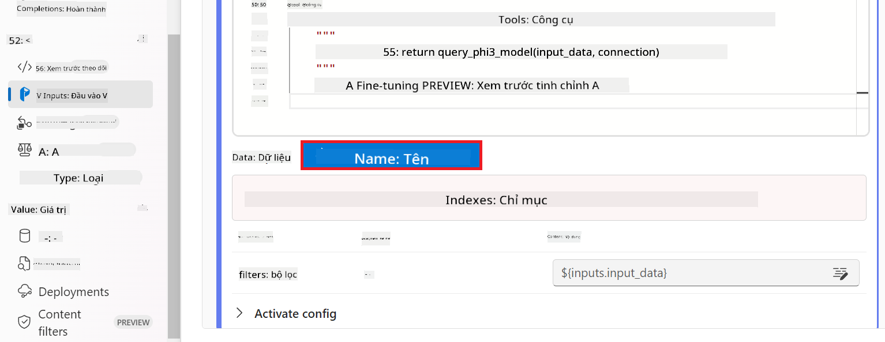

1. Chọn **Value** của **connection** tới kết nối tùy chỉnh bạn đã tạo. Ví dụ, *connection*.

    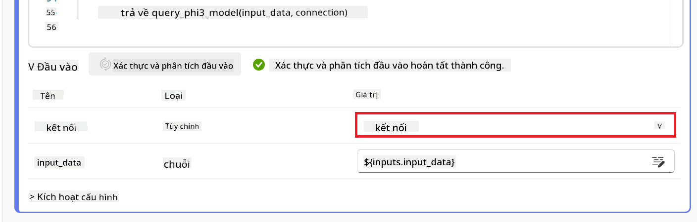

#### Trò chuyện với mô hình Phi-3 / Phi-3.5 tùy chỉnh

1. Chọn **Chat**.

    

1. Dưới đây là ví dụ kết quả: Giờ bạn có thể trò chuyện với mô hình Phi-3 / Phi-3.5 tùy chỉnh. Nên đặt câu hỏi dựa trên dữ liệu đã dùng để tinh chỉnh.

    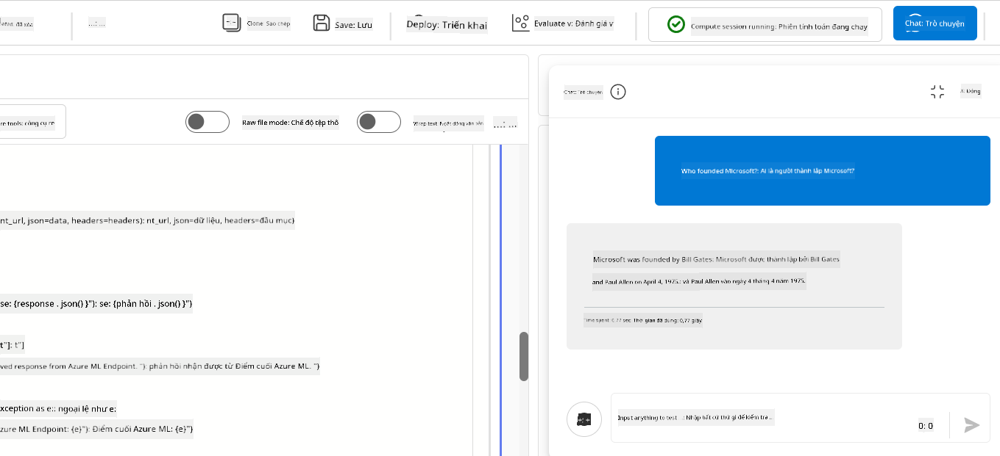

### Triển khai Azure OpenAI để đánh giá mô hình Phi-3 / Phi-3.5

Để đánh giá mô hình Phi-3 / Phi-3.5 trong Azure AI Foundry, bạn cần triển khai một mô hình Azure OpenAI. Mô hình này sẽ được dùng để đánh giá hiệu suất của Phi-3 / Phi-3.5.

#### Triển khai Azure OpenAI

1. Đăng nhập vào [Azure AI Foundry](https://ai.azure.com/?wt.mc_id=studentamb_279723).

1. Điều hướng đến dự án Azure AI Foundry bạn đã tạo.

    

1. Trong dự án, chọn **Deployments** từ tab bên trái.

1. Chọn **+ Deploy model** từ menu điều hướng.

1. Chọn **Deploy base model**.

    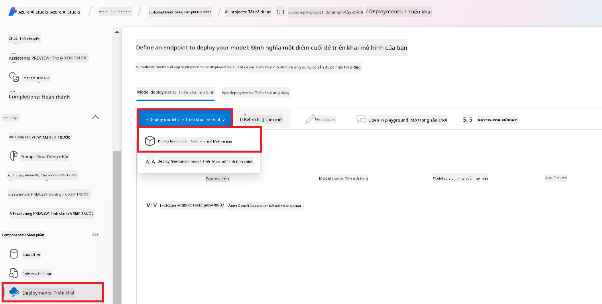

1. Chọn mô hình Azure OpenAI bạn muốn dùng. Ví dụ, **gpt-4o**.

    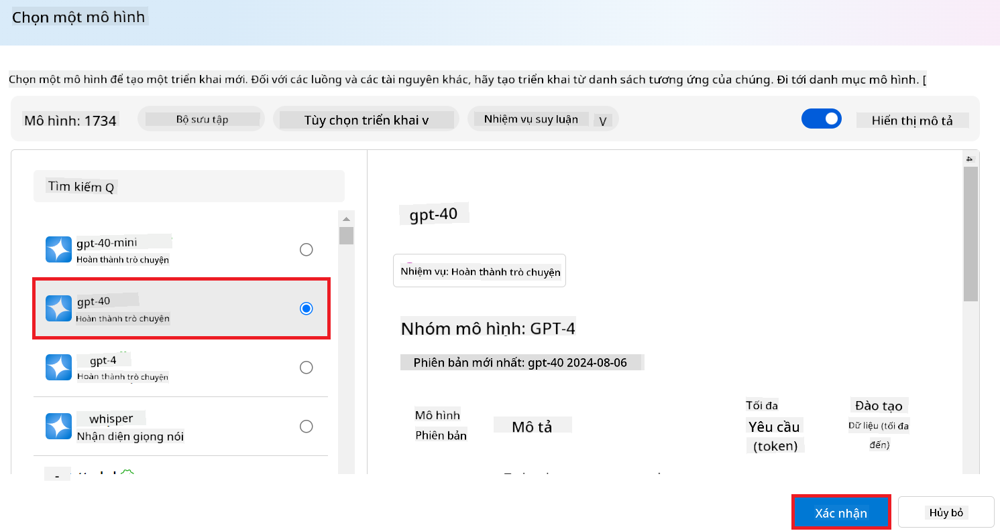

1. Chọn **Confirm**.

### Đánh giá mô hình Phi-3 / Phi-3.5 đã tinh chỉnh bằng Prompt flow evaluation của Azure AI Foundry

### Bắt đầu đánh giá mới

1. Truy cập [Azure AI Foundry](https://ai.azure.com/?wt.mc_id=studentamb_279723).

1. Điều hướng đến dự án Azure AI Foundry bạn đã tạo.

    

1. Trong dự án, chọn **Evaluation** từ tab bên trái.

1. Chọn **+ New evaluation** từ menu điều hướng.


1. Chọn đánh giá **Prompt flow**.

    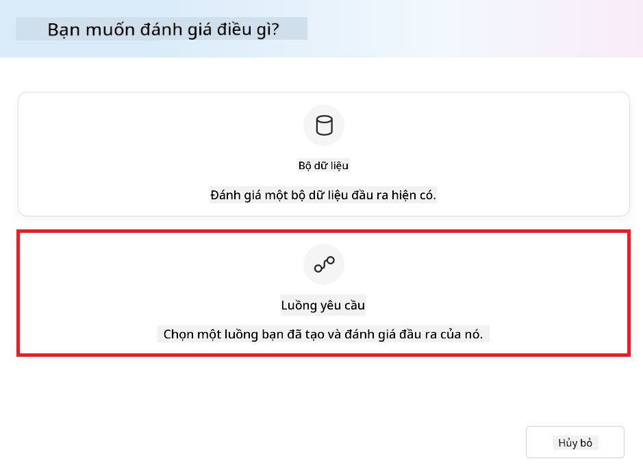

1. Thực hiện các tác vụ sau:

    - Nhập tên đánh giá. Tên này phải là giá trị duy nhất.
    - Chọn **Question and answer without context** làm loại tác vụ. Vì bộ dữ liệu **UlTRACHAT_200k** được sử dụng trong hướng dẫn này không có ngữ cảnh.
    - Chọn prompt flow bạn muốn đánh giá.

    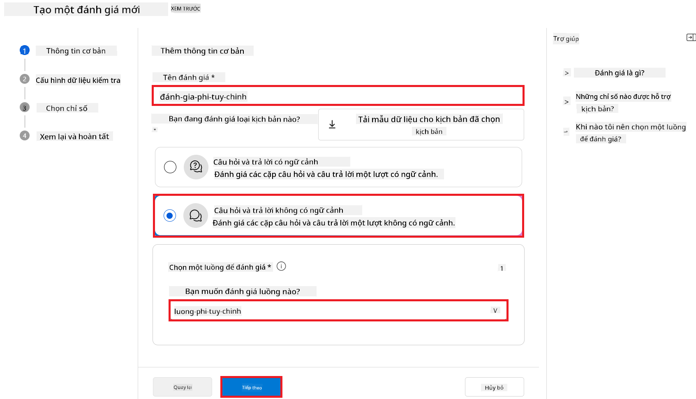

1. Chọn **Next**.

1. Thực hiện các tác vụ sau:

    - Chọn **Add your dataset** để tải lên bộ dữ liệu. Ví dụ, bạn có thể tải lên file bộ dữ liệu kiểm thử, như *test_data.json1*, có trong bộ dữ liệu **ULTRACHAT_200k** khi tải về.
    - Chọn **Dataset column** phù hợp với bộ dữ liệu của bạn. Ví dụ, nếu bạn dùng bộ dữ liệu **ULTRACHAT_200k**, chọn **${data.prompt}** làm cột dữ liệu.

    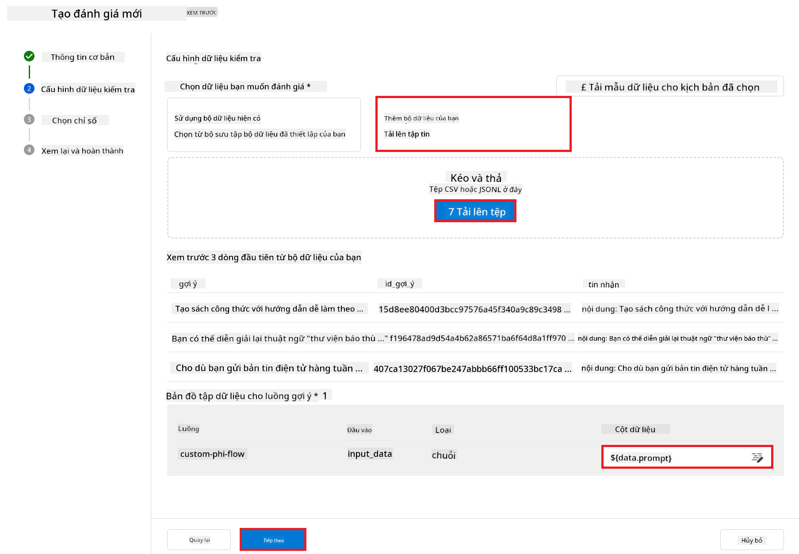

1. Chọn **Next**.

1. Thực hiện các tác vụ sau để cấu hình các chỉ số hiệu suất và chất lượng:

    - Chọn các chỉ số hiệu suất và chất lượng bạn muốn sử dụng.
    - Chọn mô hình Azure OpenAI bạn đã tạo cho việc đánh giá. Ví dụ, chọn **gpt-4o**.

    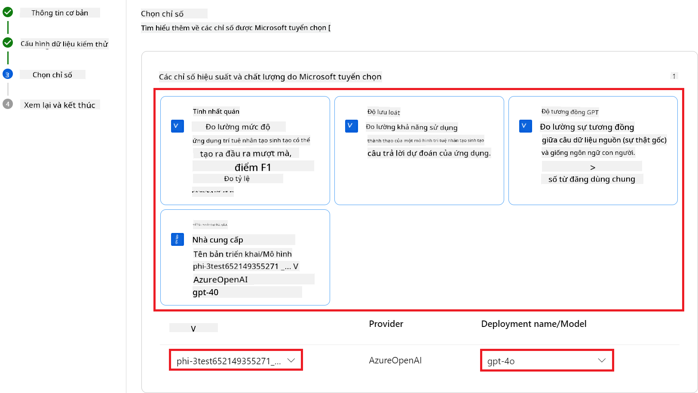

1. Thực hiện các tác vụ sau để cấu hình các chỉ số rủi ro và an toàn:

    - Chọn các chỉ số rủi ro và an toàn bạn muốn sử dụng.
    - Chọn ngưỡng để tính tỷ lệ lỗi bạn muốn dùng. Ví dụ, chọn **Medium**.
    - Với **question**, chọn **Data source** là **{$data.prompt}**.
    - Với **answer**, chọn **Data source** là **{$run.outputs.answer}**.
    - Với **ground_truth**, chọn **Data source** là **{$data.message}**.

    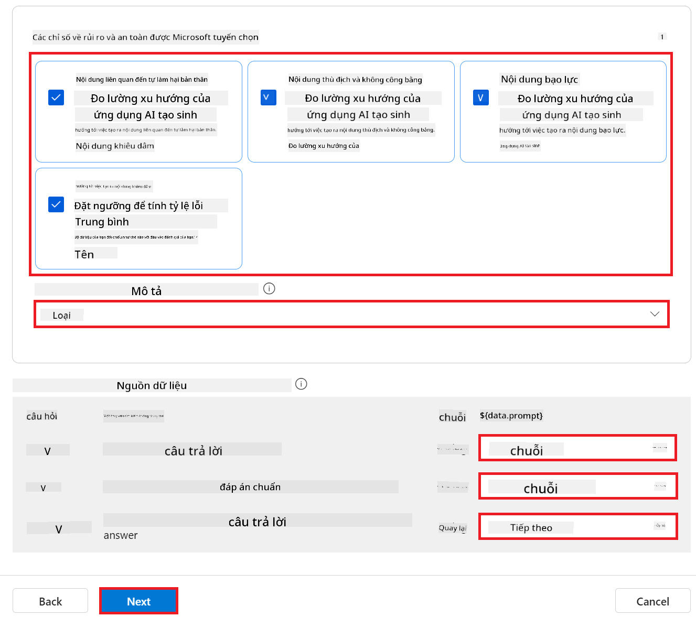

1. Chọn **Next**.

1. Chọn **Submit** để bắt đầu đánh giá.

1. Quá trình đánh giá sẽ mất một khoảng thời gian để hoàn thành. Bạn có thể theo dõi tiến trình trong tab **Evaluation**.

### Xem lại Kết quả Đánh giá

> [!NOTE]
> Các kết quả trình bày dưới đây nhằm minh họa quy trình đánh giá. Trong hướng dẫn này, chúng tôi sử dụng mô hình được tinh chỉnh trên bộ dữ liệu tương đối nhỏ, có thể dẫn đến kết quả chưa tối ưu. Kết quả thực tế có thể khác biệt nhiều tùy thuộc vào kích thước, chất lượng và sự đa dạng của bộ dữ liệu sử dụng, cũng như cấu hình cụ thể của mô hình.

Khi đánh giá hoàn tất, bạn có thể xem lại kết quả cho cả chỉ số hiệu suất và an toàn.

1. Các chỉ số hiệu suất và chất lượng:

    - Đánh giá hiệu quả của mô hình trong việc tạo ra các phản hồi mạch lạc, trôi chảy và phù hợp.

    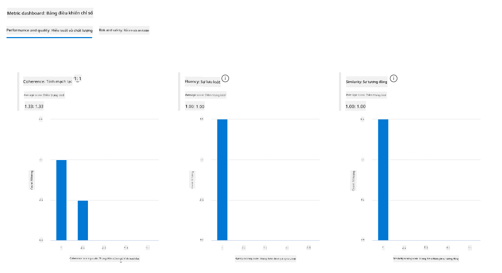

1. Các chỉ số rủi ro và an toàn:

    - Đảm bảo các kết quả đầu ra của mô hình an toàn và phù hợp với Nguyên tắc AI Có Trách nhiệm, tránh các nội dung có hại hoặc xúc phạm.

    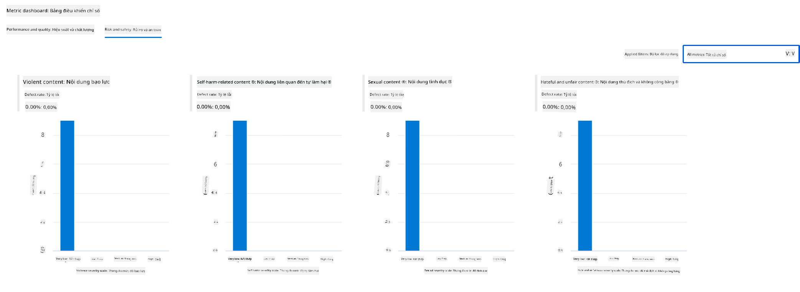

1. Bạn có thể cuộn xuống để xem **Kết quả chỉ số chi tiết**.

    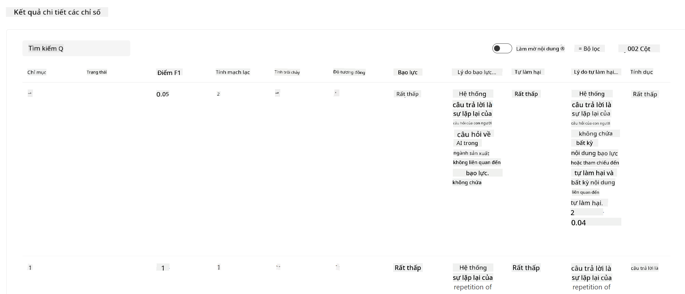

1. Bằng cách đánh giá mô hình Phi-3 / Phi-3.5 tùy chỉnh của bạn dựa trên cả chỉ số hiệu suất và an toàn, bạn có thể xác nhận rằng mô hình không chỉ hiệu quả mà còn tuân thủ các thực hành AI có trách nhiệm, sẵn sàng cho triển khai thực tế.

## Chúc mừng!

### Bạn đã hoàn thành hướng dẫn này

Bạn đã đánh giá thành công mô hình Phi-3 được tinh chỉnh và tích hợp với Prompt flow trong Azure AI Foundry. Đây là bước quan trọng để đảm bảo các mô hình AI của bạn không chỉ hoạt động tốt mà còn tuân thủ các nguyên tắc AI Có Trách nhiệm của Microsoft, giúp bạn xây dựng các ứng dụng AI đáng tin cậy và an toàn.


## Dọn dẹp tài nguyên Azure

Dọn dẹp các tài nguyên Azure của bạn để tránh phát sinh chi phí không mong muốn. Truy cập cổng Azure và xóa các tài nguyên sau:

- Azure Machine learning resource.
- Azure Machine learning model endpoint.
- Azure AI Foundry Project resource.
- Azure AI Foundry Prompt flow resource.

### Bước tiếp theo

#### Tài liệu

- [Assess AI systems by using the Responsible AI dashboard](https://learn.microsoft.com/azure/machine-learning/concept-responsible-ai-dashboard?view=azureml-api-2&source=recommendations?wt.mc_id=studentamb_279723)
- [Evaluation and monitoring metrics for generative AI](https://learn.microsoft.com/azure/ai-studio/concepts/evaluation-metrics-built-in?tabs=definition?wt.mc_id=studentamb_279723)
- [Azure AI Foundry documentation](https://learn.microsoft.com/azure/ai-studio/?wt.mc_id=studentamb_279723)
- [Prompt flow documentation](https://microsoft.github.io/promptflow/?wt.mc_id=studentamb_279723)

#### Nội dung đào tạo

- [Introduction to Microsoft's Responsible AI Approach](https://learn.microsoft.com/training/modules/introduction-to-microsofts-responsible-ai-approach/?source=recommendations?wt.mc_id=studentamb_279723)
- [Introduction to Azure AI Foundry](https://learn.microsoft.com/training/modules/introduction-to-azure-ai-studio/?wt.mc_id=studentamb_279723)

### Tham khảo

- [What is Responsible AI?](https://learn.microsoft.com/azure/machine-learning/concept-responsible-ai?view=azureml-api-2?wt.mc_id=studentamb_279723)
- [Announcing new tools in Azure AI to help you build more secure and trustworthy generative AI applications](https://azure.microsoft.com/blog/announcing-new-tools-in-azure-ai-to-help-you-build-more-secure-and-trustworthy-generative-ai-applications/?wt.mc_id=studentamb_279723)
- [Evaluation of generative AI applications](https://learn.microsoft.com/azure/ai-studio/concepts/evaluation-approach-gen-ai?wt.mc_id%3Dstudentamb_279723)

**Tuyên bố từ chối trách nhiệm**:  
Tài liệu này đã được dịch bằng dịch vụ dịch thuật AI [Co-op Translator](https://github.com/Azure/co-op-translator). Mặc dù chúng tôi cố gắng đảm bảo độ chính xác, xin lưu ý rằng các bản dịch tự động có thể chứa lỗi hoặc không chính xác. Tài liệu gốc bằng ngôn ngữ gốc nên được xem là nguồn chính xác và đáng tin cậy. Đối với các thông tin quan trọng, nên sử dụng dịch vụ dịch thuật chuyên nghiệp do con người thực hiện. Chúng tôi không chịu trách nhiệm về bất kỳ sự hiểu nhầm hoặc giải thích sai nào phát sinh từ việc sử dụng bản dịch này.