<!--
CO_OP_TRANSLATOR_METADATA:
{
  "original_hash": "ecbd9179a21edbaafaf114d47f09f3e3",
  "translation_date": "2025-05-09T18:15:43+00:00",
  "source_file": "md/02.Application/01.TextAndChat/Phi3/E2E_Phi-3-FineTuning_PromptFlow_Integration_AIFoundry.md",
  "language_code": "vi"
}
-->
# Tinh chỉnh và tích hợp các mô hình Phi-3 tùy chỉnh với Prompt flow trong Azure AI Foundry

Ví dụ đầu cuối (E2E) này dựa trên hướng dẫn "[Fine-Tune and Integrate Custom Phi-3 Models with Prompt Flow in Azure AI Foundry](https://techcommunity.microsoft.com/t5/educator-developer-blog/fine-tune-and-integrate-custom-phi-3-models-with-prompt-flow-in/ba-p/4191726?WT.mc_id=aiml-137032-kinfeylo)" từ Microsoft Tech Community. Nó giới thiệu các quy trình tinh chỉnh, triển khai và tích hợp các mô hình Phi-3 tùy chỉnh với Prompt flow trong Azure AI Foundry. Khác với ví dụ E2E "[Fine-Tune and Integrate Custom Phi-3 Models with Prompt Flow](./E2E_Phi-3-FineTuning_PromptFlow_Integration.md)" chạy code cục bộ, hướng dẫn này tập trung hoàn toàn vào việc tinh chỉnh và tích hợp mô hình của bạn trong Azure AI / ML Studio.

## Tổng quan

Trong ví dụ E2E này, bạn sẽ học cách tinh chỉnh mô hình Phi-3 và tích hợp nó với Prompt flow trong Azure AI Foundry. Bằng cách tận dụng Azure AI / ML Studio, bạn sẽ thiết lập quy trình làm việc để triển khai và sử dụng các mô hình AI tùy chỉnh. Ví dụ E2E này được chia thành ba kịch bản:

**Kịch bản 1: Thiết lập tài nguyên Azure và Chuẩn bị cho tinh chỉnh**

**Kịch bản 2: Tinh chỉnh mô hình Phi-3 và Triển khai trong Azure Machine Learning Studio**

**Kịch bản 3: Tích hợp với Prompt flow và Trò chuyện với mô hình tùy chỉnh trong Azure AI Foundry**

Dưới đây là tổng quan về ví dụ E2E này.

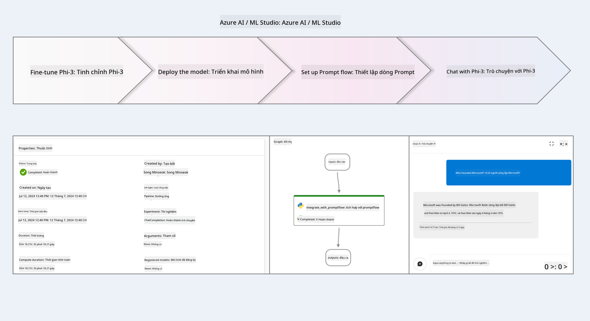

### Mục lục

1. **[Kịch bản 1: Thiết lập tài nguyên Azure và Chuẩn bị cho tinh chỉnh](../../../../../../md/02.Application/01.TextAndChat/Phi3)**
    - [Tạo Azure Machine Learning Workspace](../../../../../../md/02.Application/01.TextAndChat/Phi3)
    - [Yêu cầu hạn ngạch GPU trong Azure Subscription](../../../../../../md/02.Application/01.TextAndChat/Phi3)
    - [Thêm phân quyền vai trò](../../../../../../md/02.Application/01.TextAndChat/Phi3)
    - [Thiết lập dự án](../../../../../../md/02.Application/01.TextAndChat/Phi3)
    - [Chuẩn bị bộ dữ liệu cho tinh chỉnh](../../../../../../md/02.Application/01.TextAndChat/Phi3)

1. **[Kịch bản 2: Tinh chỉnh mô hình Phi-3 và Triển khai trong Azure Machine Learning Studio](../../../../../../md/02.Application/01.TextAndChat/Phi3)**
    - [Tinh chỉnh mô hình Phi-3](../../../../../../md/02.Application/01.TextAndChat/Phi3)
    - [Triển khai mô hình Phi-3 đã tinh chỉnh](../../../../../../md/02.Application/01.TextAndChat/Phi3)

1. **[Kịch bản 3: Tích hợp với Prompt flow và Trò chuyện với mô hình tùy chỉnh trong Azure AI Foundry](../../../../../../md/02.Application/01.TextAndChat/Phi3)**
    - [Tích hợp mô hình Phi-3 tùy chỉnh với Prompt flow](../../../../../../md/02.Application/01.TextAndChat/Phi3)
    - [Trò chuyện với mô hình Phi-3 tùy chỉnh của bạn](../../../../../../md/02.Application/01.TextAndChat/Phi3)

## Kịch bản 1: Thiết lập tài nguyên Azure và Chuẩn bị cho tinh chỉnh

### Tạo Azure Machine Learning Workspace

1. Gõ *azure machine learning* vào **thanh tìm kiếm** ở đầu trang portal và chọn **Azure Machine Learning** trong các tùy chọn hiện ra.

    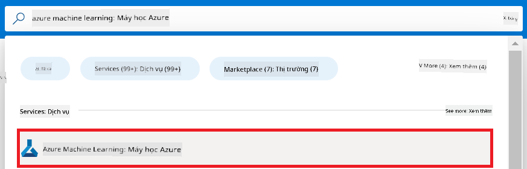

2. Chọn **+ Create** từ menu điều hướng.

3. Chọn **New workspace** từ menu điều hướng.

    

4. Thực hiện các bước sau:

    - Chọn **Subscription** Azure của bạn.
    - Chọn **Resource group** để sử dụng (tạo mới nếu cần).
    - Nhập **Workspace Name**. Tên này phải duy nhất.
    - Chọn **Region** bạn muốn sử dụng.
    - Chọn **Storage account** để dùng (tạo mới nếu cần).
    - Chọn **Key vault** để dùng (tạo mới nếu cần).
    - Chọn **Application insights** để dùng (tạo mới nếu cần).
    - Chọn **Container registry** để dùng (tạo mới nếu cần).

    

5. Chọn **Review + Create**.

6. Chọn **Create**.

### Yêu cầu hạn ngạch GPU trong Azure Subscription

Trong hướng dẫn này, bạn sẽ học cách tinh chỉnh và triển khai mô hình Phi-3 sử dụng GPU. Để tinh chỉnh, bạn sẽ dùng GPU *Standard_NC24ads_A100_v4*, cần yêu cầu hạn ngạch. Để triển khai, bạn sẽ dùng GPU *Standard_NC6s_v3*, cũng cần yêu cầu hạn ngạch.

> [!NOTE]
>
> Chỉ các subscription Pay-As-You-Go (loại subscription tiêu chuẩn) đủ điều kiện cấp phát GPU; các subscription ưu đãi hiện chưa được hỗ trợ.
>

1. Truy cập [Azure ML Studio](https://ml.azure.com/home?wt.mc_id=studentamb_279723).

1. Thực hiện các bước sau để yêu cầu hạn ngạch *Standard NCADSA100v4 Family*:

    - Chọn **Quota** từ tab bên trái.
    - Chọn **Virtual machine family** muốn dùng. Ví dụ, chọn **Standard NCADSA100v4 Family Cluster Dedicated vCPUs**, bao gồm GPU *Standard_NC24ads_A100_v4*.
    - Chọn **Request quota** từ menu điều hướng.

        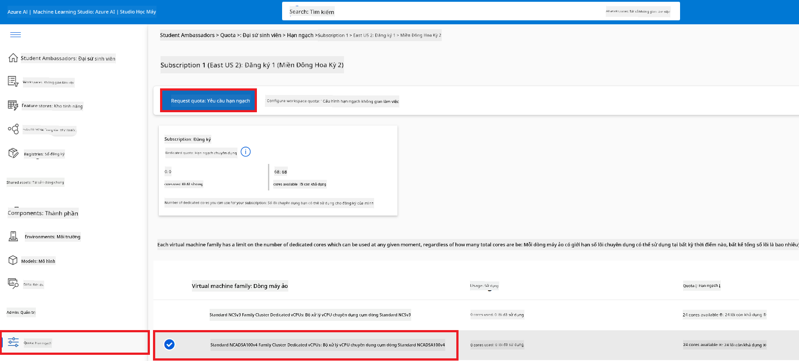

    - Trong trang Request quota, nhập **New cores limit** bạn muốn sử dụng. Ví dụ: 24.
    - Trong trang Request quota, chọn **Submit** để gửi yêu cầu hạn ngạch GPU.

1. Thực hiện các bước sau để yêu cầu hạn ngạch *Standard NCSv3 Family*:

    - Chọn **Quota** từ tab bên trái.
    - Chọn **Virtual machine family** muốn dùng. Ví dụ, chọn **Standard NCSv3 Family Cluster Dedicated vCPUs**, bao gồm GPU *Standard_NC6s_v3*.
    - Chọn **Request quota** từ menu điều hướng.
    - Trong trang Request quota, nhập **New cores limit** bạn muốn sử dụng. Ví dụ: 24.
    - Trong trang Request quota, chọn **Submit** để gửi yêu cầu hạn ngạch GPU.

### Thêm phân quyền vai trò

Để tinh chỉnh và triển khai mô hình, bạn phải tạo trước một User Assigned Managed Identity (UAI) và gán cho nó các quyền phù hợp. UAI này sẽ được dùng để xác thực trong quá trình triển khai.

#### Tạo User Assigned Managed Identity (UAI)

1. Gõ *managed identities* vào **thanh tìm kiếm** ở đầu trang portal và chọn **Managed Identities** trong các tùy chọn hiện ra.

    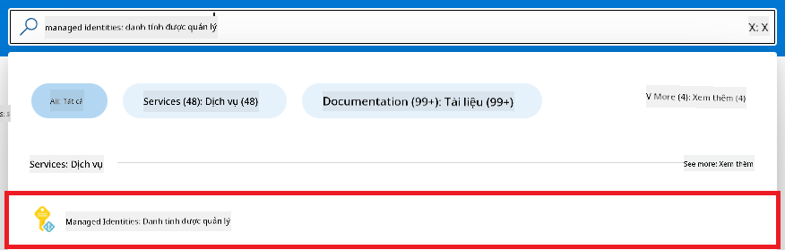

1. Chọn **+ Create**.

    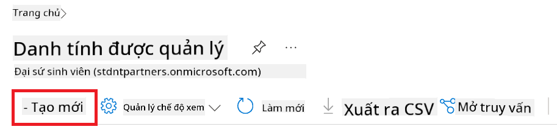

1. Thực hiện các bước sau:

    - Chọn **Subscription** Azure của bạn.
    - Chọn **Resource group** để sử dụng (tạo mới nếu cần).
    - Chọn **Region** bạn muốn sử dụng.
    - Nhập **Name**. Tên này phải duy nhất.

    

1. Chọn **Review + create**.

1. Chọn **+ Create**.

#### Thêm phân quyền vai trò Contributor cho Managed Identity

1. Điều hướng đến Managed Identity bạn vừa tạo.

1. Chọn **Azure role assignments** từ tab bên trái.

1. Chọn **+Add role assignment** từ menu điều hướng.

1. Trong trang Add role assignment, thực hiện các bước sau:
    - Chọn **Scope** là **Resource group**.
    - Chọn **Subscription** Azure của bạn.
    - Chọn **Resource group** để sử dụng.
    - Chọn **Role** là **Contributor**.

    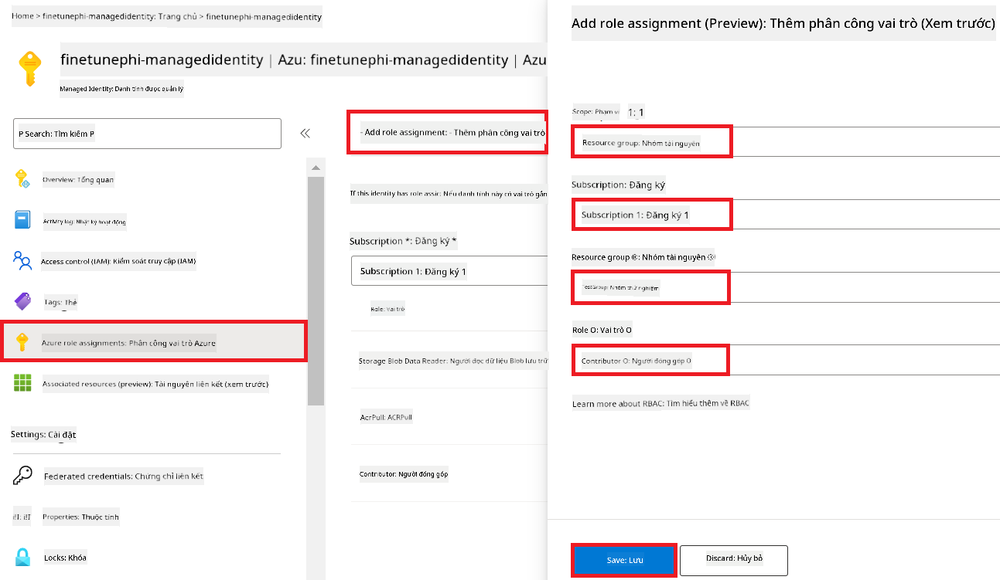

2. Chọn **Save**.

#### Thêm phân quyền vai trò Storage Blob Data Reader cho Managed Identity

1. Gõ *storage accounts* vào **thanh tìm kiếm** ở đầu trang portal và chọn **Storage accounts** trong các tùy chọn hiện ra.

    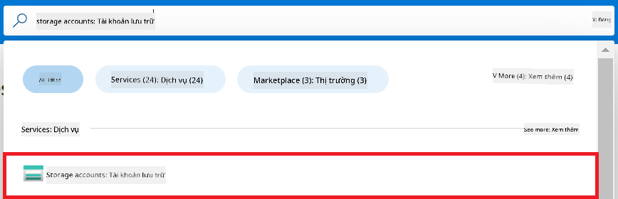

1. Chọn tài khoản lưu trữ liên kết với Azure Machine Learning workspace bạn đã tạo. Ví dụ, *finetunephistorage*.

1. Thực hiện các bước sau để đến trang Add role assignment:

    - Điều hướng đến tài khoản Azure Storage bạn đã tạo.
    - Chọn **Access Control (IAM)** từ tab bên trái.
    - Chọn **+ Add** từ menu điều hướng.
    - Chọn **Add role assignment** từ menu điều hướng.

    

1. Trong trang Add role assignment, thực hiện các bước sau:

    - Trong trang Role, gõ *Storage Blob Data Reader* vào **thanh tìm kiếm** và chọn **Storage Blob Data Reader** trong các tùy chọn hiện ra.
    - Trong trang Role, chọn **Next**.
    - Trong trang Members, chọn **Assign access to** **Managed identity**.
    - Trong trang Members, chọn **+ Select members**.
    - Trong trang Select managed identities, chọn **Subscription** Azure của bạn.
    - Trong trang Select managed identities, chọn **Managed identity** là **Manage Identity**.
    - Trong trang Select managed identities, chọn Manage Identity bạn đã tạo. Ví dụ, *finetunephi-managedidentity*.
    - Trong trang Select managed identities, chọn **Select**.

    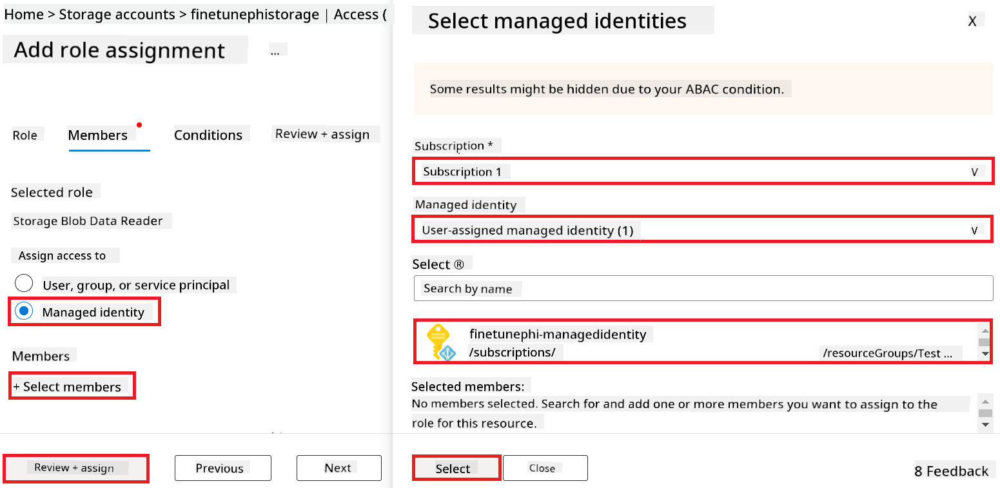

1. Chọn **Review + assign**.

#### Thêm phân quyền vai trò AcrPull cho Managed Identity

1. Gõ *container registries* vào **thanh tìm kiếm** ở đầu trang portal và chọn **Container registries** trong các tùy chọn hiện ra.

    

1. Chọn container registry liên kết với Azure Machine Learning workspace. Ví dụ, *finetunephicontainerregistry*.

1. Thực hiện các bước sau để đến trang Add role assignment:

    - Chọn **Access Control (IAM)** từ tab bên trái.
    - Chọn **+ Add** từ menu điều hướng.
    - Chọn **Add role assignment** từ menu điều hướng.

1. Trong trang Add role assignment, thực hiện các bước sau:

    - Trong trang Role, gõ *AcrPull* vào **thanh tìm kiếm** và chọn **AcrPull** trong các tùy chọn hiện ra.
    - Trong trang Role, chọn **Next**.
    - Trong trang Members, chọn **Assign access to** **Managed identity**.
    - Trong trang Members, chọn **+ Select members**.
    - Trong trang Select managed identities, chọn **Subscription** Azure của bạn.
    - Trong trang Select managed identities, chọn **Managed identity** là **Manage Identity**.
    - Trong trang Select managed identities, chọn Manage Identity bạn đã tạo. Ví dụ, *finetunephi-managedidentity*.
    - Trong trang Select managed identities, chọn **Select**.
    - Chọn **Review + assign**.

### Thiết lập dự án

Để tải bộ dữ liệu cần cho việc tinh chỉnh, bạn sẽ thiết lập môi trường cục bộ.

Trong bài tập này, bạn sẽ

- Tạo thư mục làm việc.
- Tạo môi trường ảo.
- Cài đặt các gói cần thiết.
- Tạo file *download_dataset.py* để tải bộ dữ liệu.

#### Tạo thư mục làm việc

1. Mở cửa sổ terminal và gõ lệnh sau để tạo thư mục tên *finetune-phi* trong đường dẫn mặc định.

    ```console
    mkdir finetune-phi
    ```

2. Gõ lệnh sau trong terminal để chuyển vào thư mục *finetune-phi* bạn vừa tạo.

    ```console
    cd finetune-phi
    ```

#### Tạo môi trường ảo

1. Gõ lệnh sau trong terminal để tạo môi trường ảo tên *.venv*.

    ```console
    python -m venv .venv
    ```

2. Gõ lệnh sau trong terminal để kích hoạt môi trường ảo.

    ```console
    .venv\Scripts\activate.bat
    ```

> [!NOTE]
> Nếu thành công, bạn sẽ thấy *(.venv)* xuất hiện trước dấu nhắc lệnh.

#### Cài đặt các gói cần thiết

1. Gõ các lệnh sau trong terminal để cài đặt các gói cần thiết.

    ```console
    pip install datasets==2.19.1
    ```

#### Tạo `download_dataset.py`

> [!NOTE]
> Cấu trúc thư mục hoàn chỉnh:
>
> ```text
> └── YourUserName
> .    └── finetune-phi
> .        └── download_dataset.py
> ```

1. Mở **Visual Studio Code**.

1. Chọn **File** trên thanh menu.

1. Chọn **Open Folder**.

1. Chọn thư mục *finetune-phi* bạn đã tạo, nằm ở *C:\Users\yourUserName\finetune-phi*.

    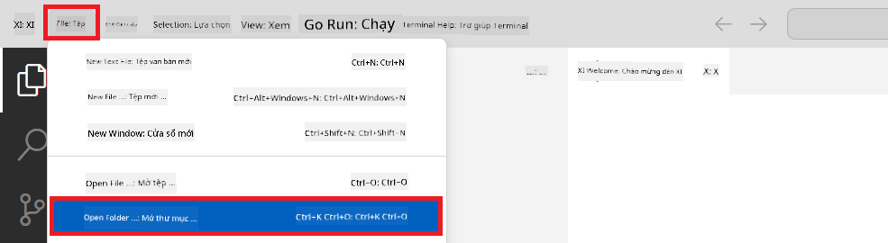

1. Ở khung bên trái của Visual Studio Code, nhấp chuột phải và chọn **New File** để tạo file mới tên *download_dataset.py*.

    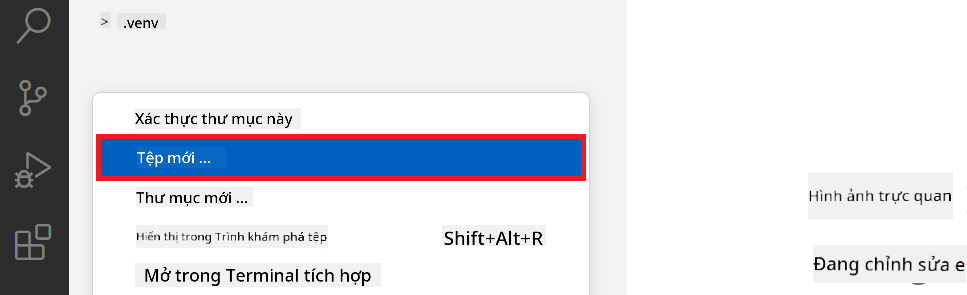

### Chuẩn bị bộ dữ liệu cho tinh chỉnh

Trong bài tập này, bạn sẽ chạy file *download_dataset.py* để tải bộ dữ liệu *ultrachat_200k* về môi trường cục bộ. Sau đó, bạn sẽ dùng bộ dữ liệu này để tinh chỉnh mô hình Phi-3 trong Azure Machine Learning.

Trong bài tập này, bạn sẽ:

- Thêm code vào file *download_dataset.py* để tải bộ dữ liệu.
- Chạy file *download_dataset.py* để tải dữ liệu về môi trường cục bộ.

#### Tải bộ dữ liệu bằng *download_dataset.py*

1. Mở file *download_dataset.py* trong Visual Studio Code.

1. Thêm đoạn code sau vào file *download_dataset.py*.

    ```python
    import json
    import os
    from datasets import load_dataset

    def load_and_split_dataset(dataset_name, config_name, split_ratio):
        """
        Load and split a dataset.
        """
        # Load the dataset with the specified name, configuration, and split ratio
        dataset = load_dataset(dataset_name, config_name, split=split_ratio)
        print(f"Original dataset size: {len(dataset)}")
        
        # Split the dataset into train and test sets (80% train, 20% test)
        split_dataset = dataset.train_test_split(test_size=0.2)
        print(f"Train dataset size: {len(split_dataset['train'])}")
        print(f"Test dataset size: {len(split_dataset['test'])}")
        
        return split_dataset

    def save_dataset_to_jsonl(dataset, filepath):
        """
        Save a dataset to a JSONL file.
        """
        # Create the directory if it does not exist
        os.makedirs(os.path.dirname(filepath), exist_ok=True)
        
        # Open the file in write mode
        with open(filepath, 'w', encoding='utf-8') as f:
            # Iterate over each record in the dataset
            for record in dataset:
                # Dump the record as a JSON object and write it to the file
                json.dump(record, f)
                # Write a newline character to separate records
                f.write('\n')
        
        print(f"Dataset saved to {filepath}")

    def main():
        """
        Main function to load, split, and save the dataset.
        """
        # Load and split the ULTRACHAT_200k dataset with a specific configuration and split ratio
        dataset = load_and_split_dataset("HuggingFaceH4/ultrachat_200k", 'default', 'train_sft[:1%]')
        
        # Extract the train and test datasets from the split
        train_dataset = dataset['train']
        test_dataset = dataset['test']

        # Save the train dataset to a JSONL file
        save_dataset_to_jsonl(train_dataset, "data/train_data.jsonl")
        
        # Save the test dataset to a separate JSONL file
        save_dataset_to_jsonl(test_dataset, "data/test_data.jsonl")

    if __name__ == "__main__":
        main()

    ```

1. Gõ lệnh sau trong terminal để chạy script và tải bộ dữ liệu về môi trường cục bộ.

    ```console
    python download_dataset.py
    ```

1. Kiểm tra xem bộ dữ liệu đã được lưu thành công trong thư mục *finetune-phi/data* trên máy bạn chưa.

> [!NOTE]
>
> #### Lưu ý về kích thước bộ dữ liệu và thời gian tinh chỉnh
>
> Trong hướng dẫn này, bạn chỉ sử dụng 1% của bộ dữ liệu (`split='train[:1%]'`). Điều này giảm đáng kể lượng dữ liệu, giúp quá trình tải lên và tinh chỉnh nhanh hơn. Bạn có thể điều chỉnh tỷ lệ phần trăm để cân bằng giữa thời gian đào tạo và hiệu suất mô hình. Việc dùng một phần nhỏ bộ dữ liệu giúp rút ngắn thời gian tinh chỉnh, phù hợp hơn cho mục đích hướng dẫn.

## Kịch bản 2: Tinh chỉnh mô hình Phi-3 và Triển khai trong Azure Machine Learning Studio

### Tinh chỉnh mô hình Phi-3

Trong bài tập này, bạn sẽ tinh chỉnh mô hình Phi-3 trong Azure Machine Learning Studio.

Trong bài tập này, bạn sẽ:

- Tạo cụm máy tính để tinh chỉnh.
- Tinh chỉnh mô hình Phi-3 trong Azure Machine Learning Studio.

#### Tạo cụm máy tính cho việc tinh chỉnh
1. Truy cập [Azure ML Studio](https://ml.azure.com/home?wt.mc_id=studentamb_279723).

1. Chọn **Compute** từ tab bên trái.

1. Chọn **Compute clusters** trong menu điều hướng.

1. Chọn **+ New**.

    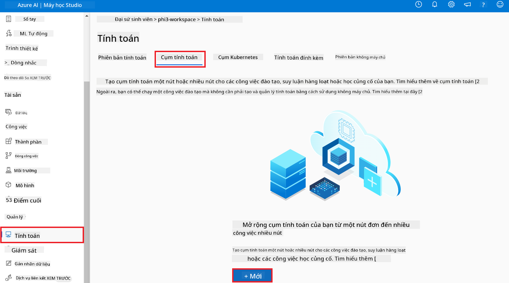

1. Thực hiện các bước sau:

    - Chọn **Region** bạn muốn sử dụng.
    - Chọn **Virtual machine tier** là **Dedicated**.
    - Chọn **Virtual machine type** là **GPU**.
    - Chọn bộ lọc **Virtual machine size** là **Select from all options**.
    - Chọn **Virtual machine size** là **Standard_NC24ads_A100_v4**.

    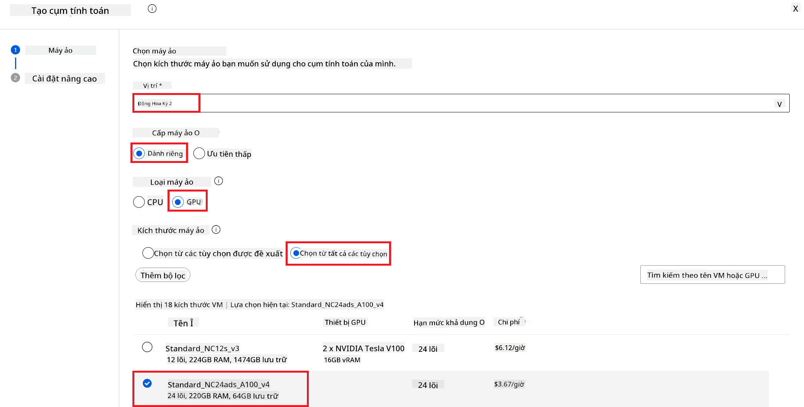

1. Chọn **Next**.

1. Thực hiện các bước sau:

    - Nhập **Compute name**. Giá trị này phải duy nhất.
    - Chọn **Minimum number of nodes** là **0**.
    - Chọn **Maximum number of nodes** là **1**.
    - Chọn **Idle seconds before scale down** là **120**.

    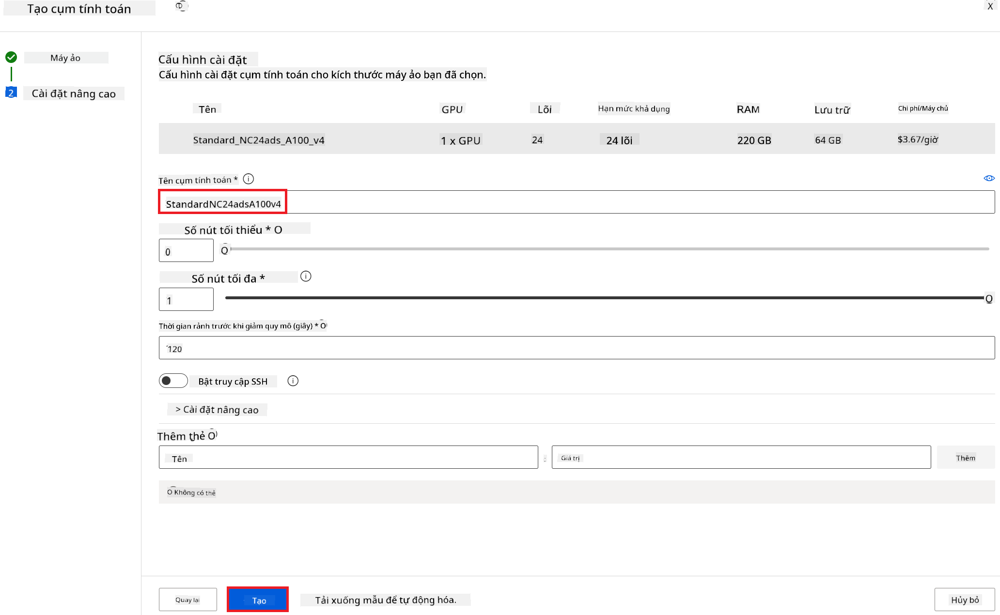

1. Chọn **Create**.

#### Tinh chỉnh mô hình Phi-3

1. Truy cập [Azure ML Studio](https://ml.azure.com/home?wt.mc_id=studentamb_279723).

1. Chọn workspace Azure Machine Learning mà bạn đã tạo.

    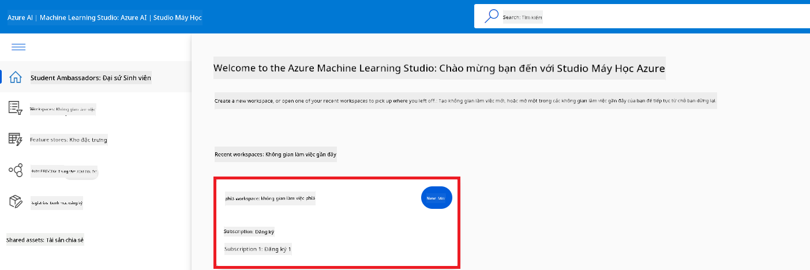

1. Thực hiện các bước sau:

    - Chọn **Model catalog** từ tab bên trái.
    - Gõ *phi-3-mini-4k* vào **search bar** và chọn **Phi-3-mini-4k-instruct** trong các lựa chọn hiện ra.

    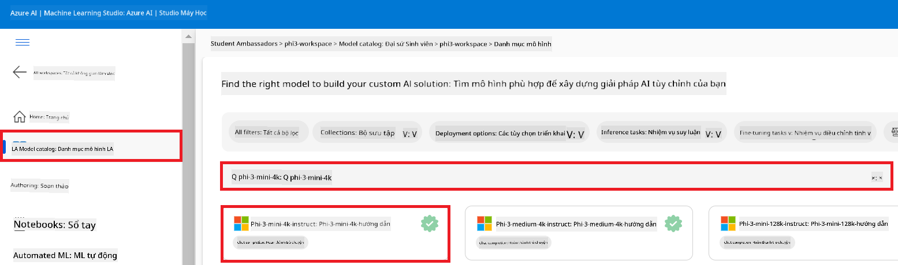

1. Chọn **Fine-tune** trong menu điều hướng.

    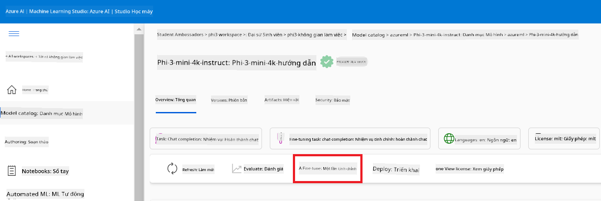

1. Thực hiện các bước sau:

    - Chọn **Select task type** là **Chat completion**.
    - Chọn **+ Select data** để tải lên **Traning data**.
    - Chọn loại tải lên dữ liệu Validation là **Provide different validation data**.
    - Chọn **+ Select data** để tải lên **Validation data**.

    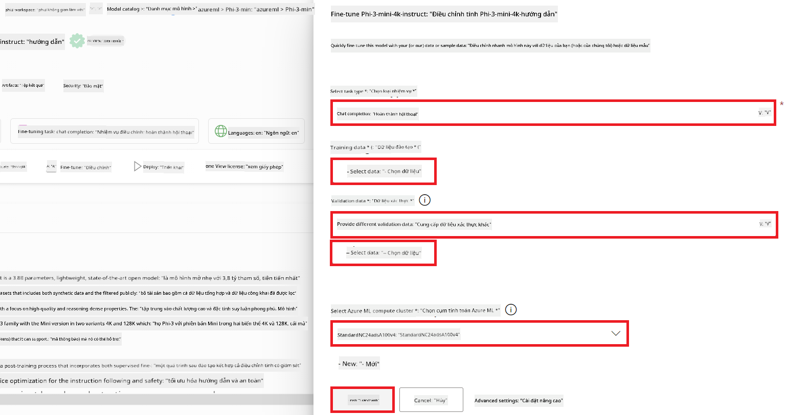

    > [!TIP]
    >
    > Bạn có thể chọn **Advanced settings** để tùy chỉnh các cấu hình như **learning_rate** và **lr_scheduler_type** nhằm tối ưu quá trình tinh chỉnh theo nhu cầu riêng của bạn.

1. Chọn **Finish**.

1. Trong bài tập này, bạn đã tinh chỉnh thành công mô hình Phi-3 bằng Azure Machine Learning. Lưu ý rằng quá trình tinh chỉnh có thể mất khá nhiều thời gian. Sau khi chạy công việc tinh chỉnh, bạn cần chờ đến khi hoàn thành. Bạn có thể theo dõi trạng thái công việc tinh chỉnh bằng cách truy cập tab Jobs ở bên trái trong Azure Machine Learning Workspace. Trong phần tiếp theo, bạn sẽ triển khai mô hình đã tinh chỉnh và tích hợp nó với Prompt flow.

    

### Triển khai mô hình Phi-3 đã tinh chỉnh

Để tích hợp mô hình Phi-3 đã tinh chỉnh với Prompt flow, bạn cần triển khai mô hình để nó có thể truy cập được cho việc suy luận thời gian thực. Quá trình này bao gồm đăng ký mô hình, tạo endpoint trực tuyến và triển khai mô hình.

Trong bài tập này, bạn sẽ:

- Đăng ký mô hình đã tinh chỉnh trong workspace Azure Machine Learning.
- Tạo một endpoint trực tuyến.
- Triển khai mô hình Phi-3 đã tinh chỉnh đã được đăng ký.

#### Đăng ký mô hình đã tinh chỉnh

1. Truy cập [Azure ML Studio](https://ml.azure.com/home?wt.mc_id=studentamb_279723).

1. Chọn workspace Azure Machine Learning mà bạn đã tạo.

    

1. Chọn **Models** từ tab bên trái.
1. Chọn **+ Register**.
1. Chọn **From a job output**.

    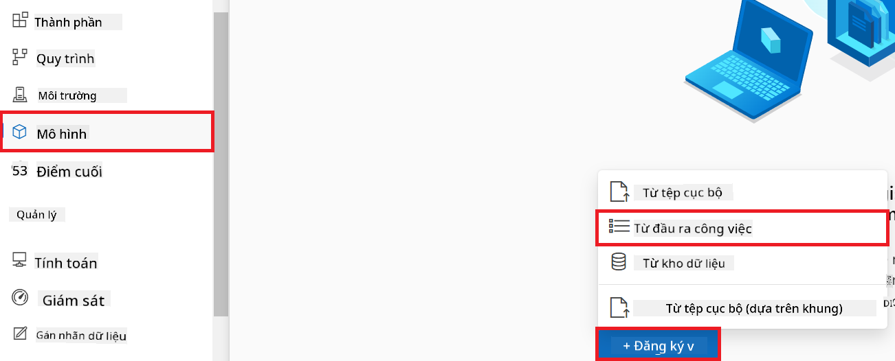

1. Chọn công việc (job) mà bạn đã tạo.

    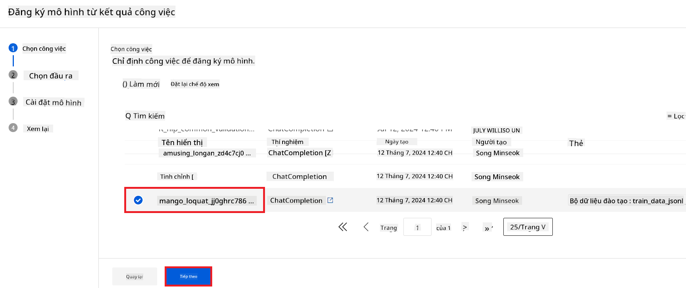

1. Chọn **Next**.

1. Chọn **Model type** là **MLflow**.

1. Đảm bảo **Job output** được chọn; thông thường sẽ được chọn tự động.

    

2. Chọn **Next**.

3. Chọn **Register**.

    

4. Bạn có thể xem mô hình đã đăng ký bằng cách truy cập menu **Models** từ tab bên trái.

    

#### Triển khai mô hình đã tinh chỉnh

1. Truy cập workspace Azure Machine Learning mà bạn đã tạo.

1. Chọn **Endpoints** từ tab bên trái.

1. Chọn **Real-time endpoints** trong menu điều hướng.

    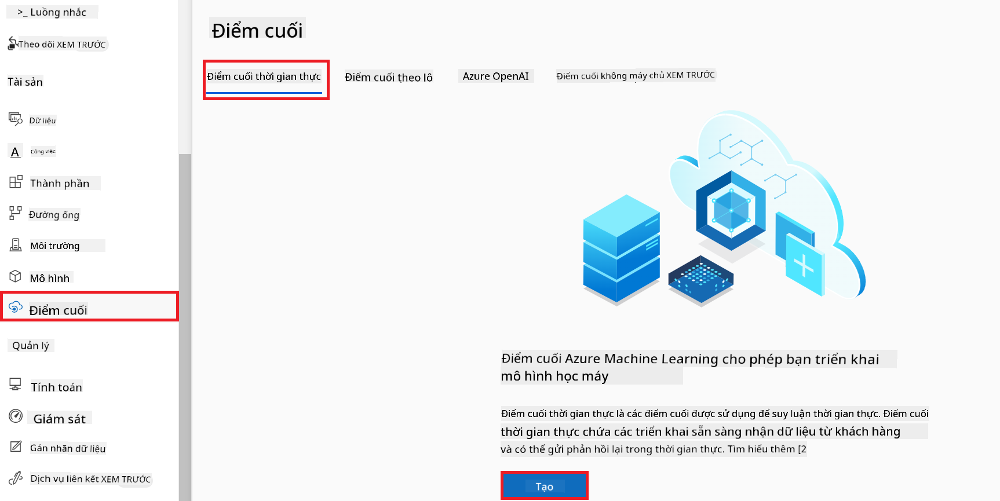

1. Chọn **Create**.

1. Chọn mô hình đã đăng ký mà bạn đã tạo.

    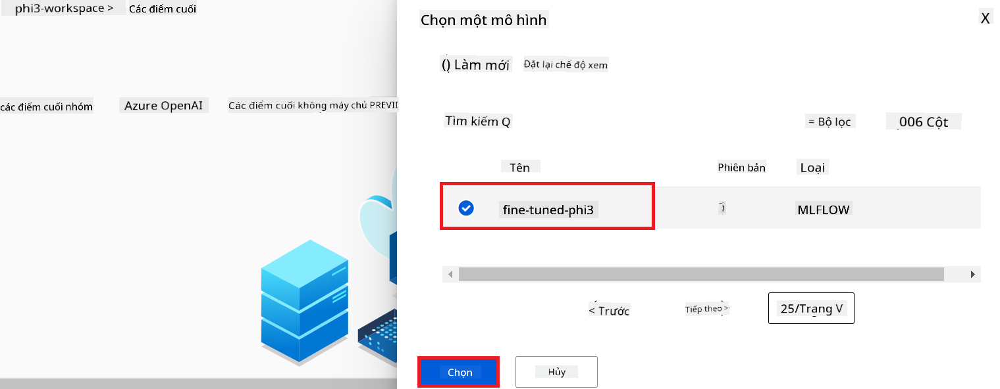

1. Chọn **Select**.

1. Thực hiện các bước sau:

    - Chọn **Virtual machine** là *Standard_NC6s_v3*.
    - Chọn **Instance count** bạn muốn sử dụng. Ví dụ, *1*.
    - Chọn **Endpoint** là **New** để tạo một endpoint mới.
    - Nhập **Endpoint name**. Giá trị này phải duy nhất.
    - Nhập **Deployment name**. Giá trị này phải duy nhất.

    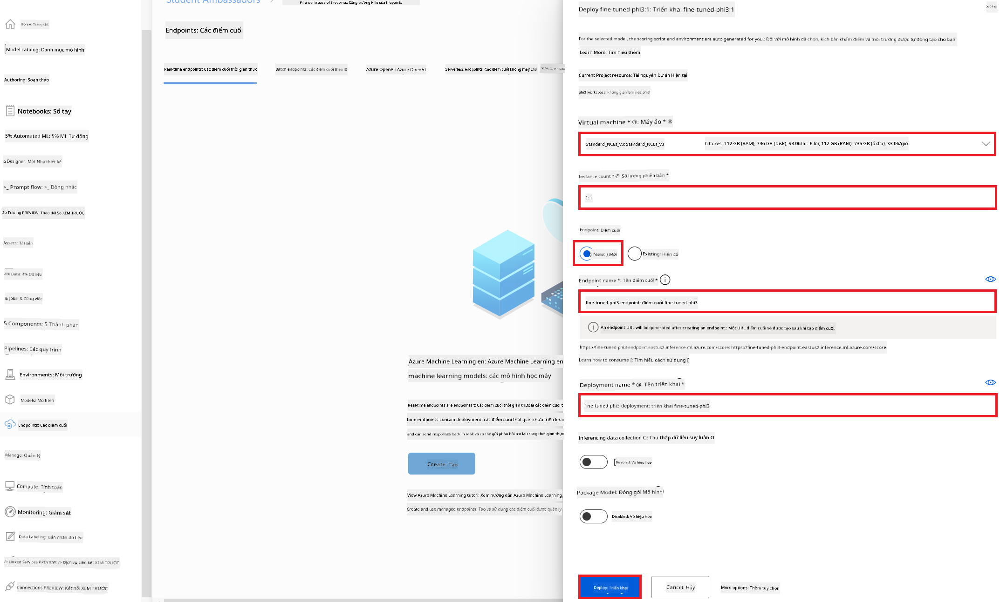

1. Chọn **Deploy**.

> [!WARNING]
> Để tránh phát sinh chi phí không mong muốn, hãy nhớ xóa endpoint đã tạo trong workspace Azure Machine Learning khi không còn sử dụng.
>

#### Kiểm tra trạng thái triển khai trong Azure Machine Learning Workspace

1. Truy cập workspace Azure Machine Learning mà bạn đã tạo.

1. Chọn **Endpoints** từ tab bên trái.

1. Chọn endpoint mà bạn đã tạo.

    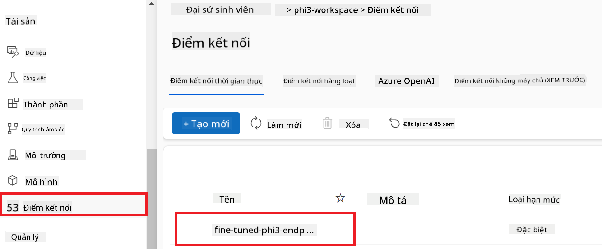

1. Trên trang này, bạn có thể quản lý các endpoint trong quá trình triển khai.

> [!NOTE]
> Khi triển khai hoàn tất, hãy đảm bảo **Live traffic** được đặt thành **100%**. Nếu chưa, chọn **Update traffic** để điều chỉnh. Lưu ý bạn không thể kiểm tra mô hình nếu traffic được đặt là 0%.
>
> 
>

## Kịch bản 3: Tích hợp với Prompt flow và trò chuyện với mô hình tùy chỉnh trong Azure AI Foundry

### Tích hợp mô hình Phi-3 tùy chỉnh với Prompt flow

Sau khi triển khai thành công mô hình đã tinh chỉnh, bạn có thể tích hợp nó với Prompt Flow để sử dụng mô hình trong các ứng dụng thời gian thực, cho phép thực hiện nhiều tác vụ tương tác với mô hình Phi-3 tùy chỉnh của bạn.

Trong bài tập này, bạn sẽ:

- Tạo Azure AI Foundry Hub.
- Tạo Azure AI Foundry Project.
- Tạo Prompt flow.
- Thêm kết nối tùy chỉnh cho mô hình Phi-3 đã tinh chỉnh.
- Thiết lập Prompt flow để trò chuyện với mô hình Phi-3 tùy chỉnh của bạn.

> [!NOTE]
> Bạn cũng có thể tích hợp với Promptflow thông qua Azure ML Studio. Quy trình tích hợp tương tự có thể áp dụng cho Azure ML Studio.

#### Tạo Azure AI Foundry Hub

Bạn cần tạo một Hub trước khi tạo Project. Hub hoạt động như một Resource Group, giúp bạn tổ chức và quản lý nhiều Project trong Azure AI Foundry.

1. Truy cập [Azure AI Foundry](https://ai.azure.com/?WT.mc_id=aiml-137032-kinfeylo).

1. Chọn **All hubs** từ tab bên trái.

1. Chọn **+ New hub** trong menu điều hướng.

    

1. Thực hiện các bước sau:

    - Nhập **Hub name**. Giá trị này phải duy nhất.
    - Chọn **Subscription** của Azure.
    - Chọn **Resource group** để sử dụng (tạo mới nếu cần).
    - Chọn **Location** bạn muốn sử dụng.
    - Chọn **Connect Azure AI Services** để sử dụng (tạo mới nếu cần).
    - Chọn **Connect Azure AI Search** là **Skip connecting**.

    

1. Chọn **Next**.

#### Tạo Azure AI Foundry Project

1. Trong Hub bạn đã tạo, chọn **All projects** từ tab bên trái.

1. Chọn **+ New project** trong menu điều hướng.

    

1. Nhập **Project name**. Giá trị này phải duy nhất.

    

1. Chọn **Create a project**.

#### Thêm kết nối tùy chỉnh cho mô hình Phi-3 đã tinh chỉnh

Để tích hợp mô hình Phi-3 tùy chỉnh với Prompt flow, bạn cần lưu endpoint và key của mô hình vào một kết nối tùy chỉnh. Thiết lập này đảm bảo Prompt flow có thể truy cập mô hình Phi-3 tùy chỉnh của bạn.

#### Thiết lập api key và endpoint uri cho mô hình Phi-3 đã tinh chỉnh

1. Truy cập [Azure ML Studio](https://ml.azure.com/home?WT.mc_id=aiml-137032-kinfeylo).

1. Điều hướng tới workspace Azure Machine Learning mà bạn đã tạo.

1. Chọn **Endpoints** từ tab bên trái.

    

1. Chọn endpoint mà bạn đã tạo.

    

1. Chọn **Consume** trong menu điều hướng.

1. Sao chép **REST endpoint** và **Primary key** của bạn.


#### Thêm Kết nối Tùy chỉnh

1. Truy cập [Azure AI Foundry](https://ai.azure.com/?WT.mc_id=aiml-137032-kinfeylo).

1. Điều hướng đến dự án Azure AI Foundry mà bạn đã tạo.

1. Trong dự án bạn đã tạo, chọn **Settings** từ tab bên trái.

1. Chọn **+ New connection**.

    

1. Chọn **Custom keys** từ menu điều hướng.

    

1. Thực hiện các bước sau:

    - Chọn **+ Add key value pairs**.
    - Với tên khóa, nhập **endpoint** và dán endpoint bạn đã sao chép từ Azure ML Studio vào trường giá trị.
    - Chọn lại **+ Add key value pairs**.
    - Với tên khóa, nhập **key** và dán key bạn đã sao chép từ Azure ML Studio vào trường giá trị.
    - Sau khi thêm các khóa, chọn **is secret** để tránh lộ khóa.

    

1. Chọn **Add connection**.

#### Tạo Prompt flow

Bạn đã thêm kết nối tùy chỉnh trong Azure AI Foundry. Bây giờ, hãy tạo một Prompt flow theo các bước dưới đây. Sau đó, bạn sẽ kết nối Prompt flow này với kết nối tùy chỉnh để có thể sử dụng mô hình fine-tuned trong Prompt flow.

1. Điều hướng đến dự án Azure AI Foundry mà bạn đã tạo.

1. Chọn **Prompt flow** từ tab bên trái.

1. Chọn **+ Create** từ menu điều hướng.

    

1. Chọn **Chat flow** từ menu điều hướng.

    

1. Nhập **Tên thư mục** bạn muốn sử dụng.

    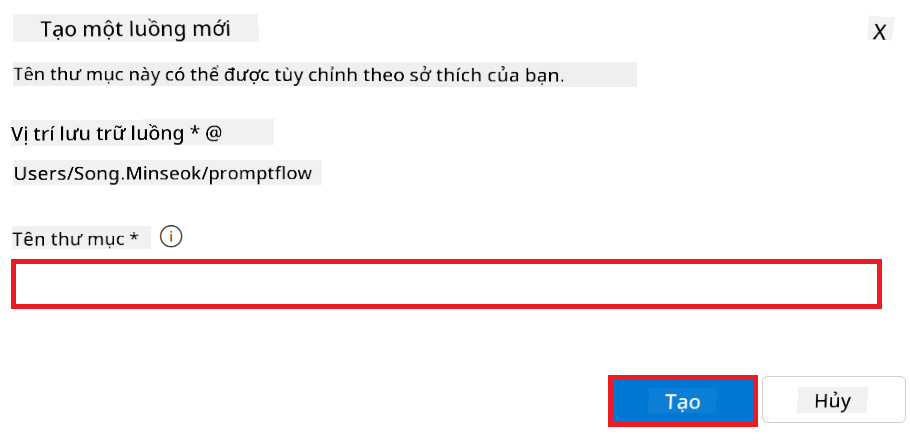

2. Chọn **Create**.

#### Thiết lập Prompt flow để trò chuyện với mô hình Phi-3 tùy chỉnh của bạn

Bạn cần tích hợp mô hình Phi-3 đã fine-tune vào Prompt flow. Tuy nhiên, Prompt flow hiện có không được thiết kế cho mục đích này. Do đó, bạn phải thiết kế lại Prompt flow để cho phép tích hợp mô hình tùy chỉnh.

1. Trong Prompt flow, thực hiện các bước sau để xây dựng lại luồng hiện tại:

    - Chọn **Raw file mode**.
    - Xóa toàn bộ mã hiện có trong file *flow.dag.yml*.
    - Thêm đoạn mã sau vào file *flow.dag.yml*.

        ```yml
        inputs:
          input_data:
            type: string
            default: "Who founded Microsoft?"

        outputs:
          answer:
            type: string
            reference: ${integrate_with_promptflow.output}

        nodes:
        - name: integrate_with_promptflow
          type: python
          source:
            type: code
            path: integrate_with_promptflow.py
          inputs:
            input_data: ${inputs.input_data}
        ```

    - Chọn **Save**.

    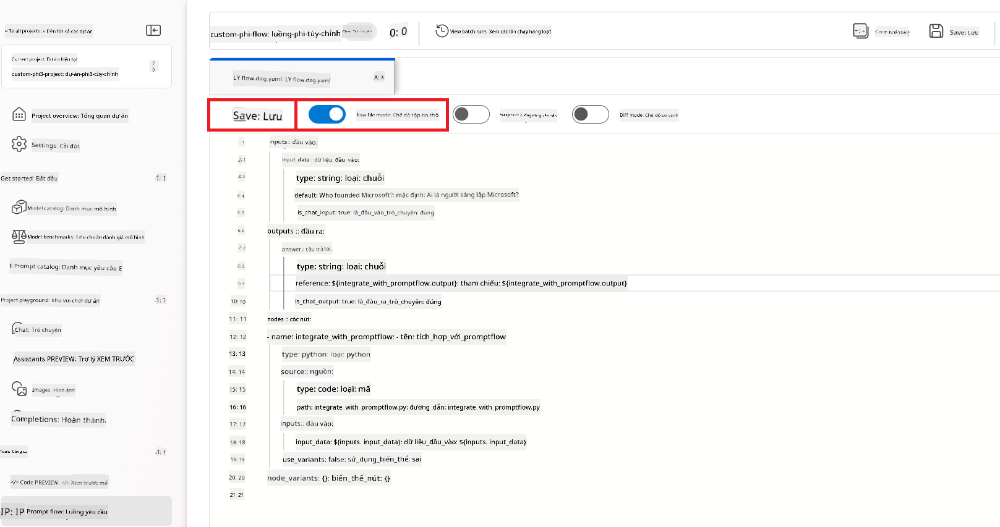

1. Thêm đoạn mã sau vào file *integrate_with_promptflow.py* để sử dụng mô hình Phi-3 tùy chỉnh trong Prompt flow.

    ```python
    import logging
    import requests
    from promptflow import tool
    from promptflow.connections import CustomConnection

    # Logging setup
    logging.basicConfig(
        format="%(asctime)s - %(levelname)s - %(name)s - %(message)s",
        datefmt="%Y-%m-%d %H:%M:%S",
        level=logging.DEBUG
    )
    logger = logging.getLogger(__name__)

    def query_phi3_model(input_data: str, connection: CustomConnection) -> str:
        """
        Send a request to the Phi-3 model endpoint with the given input data using Custom Connection.
        """

        # "connection" is the name of the Custom Connection, "endpoint", "key" are the keys in the Custom Connection
        endpoint_url = connection.endpoint
        api_key = connection.key

        headers = {
            "Content-Type": "application/json",
            "Authorization": f"Bearer {api_key}"
        }
        data = {
            "input_data": {
                "input_string": [
                    {"role": "user", "content": input_data}
                ],
                "parameters": {
                    "temperature": 0.7,
                    "max_new_tokens": 128
                }
            }
        }
        try:
            response = requests.post(endpoint_url, json=data, headers=headers)
            response.raise_for_status()
            
            # Log the full JSON response
            logger.debug(f"Full JSON response: {response.json()}")

            result = response.json()["output"]
            logger.info("Successfully received response from Azure ML Endpoint.")
            return result
        except requests.exceptions.RequestException as e:
            logger.error(f"Error querying Azure ML Endpoint: {e}")
            raise

    @tool
    def my_python_tool(input_data: str, connection: CustomConnection) -> str:
        """
        Tool function to process input data and query the Phi-3 model.
        """
        return query_phi3_model(input_data, connection)

    ```

    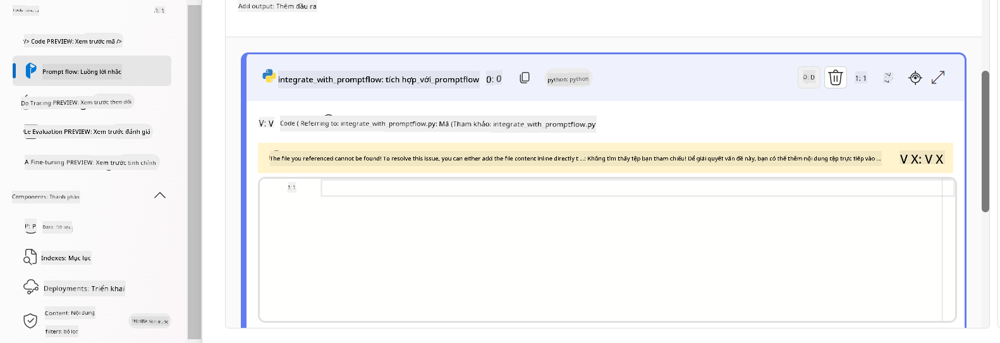

> [!NOTE]
> Để biết thêm thông tin chi tiết về cách sử dụng Prompt flow trong Azure AI Foundry, bạn có thể tham khảo [Prompt flow in Azure AI Foundry](https://learn.microsoft.com/azure/ai-studio/how-to/prompt-flow).

1. Chọn **Chat input**, **Chat output** để bật tính năng trò chuyện với mô hình của bạn.

    

1. Bây giờ bạn đã sẵn sàng trò chuyện với mô hình Phi-3 tùy chỉnh của mình. Trong bài tập tiếp theo, bạn sẽ học cách khởi động Prompt flow và sử dụng nó để trò chuyện với mô hình Phi-3 đã fine-tune.

> [!NOTE]
>
> Luồng được xây dựng lại sẽ trông như hình bên dưới:
>
> 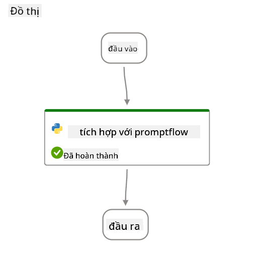
>

### Trò chuyện với mô hình Phi-3 tùy chỉnh của bạn

Bây giờ bạn đã fine-tune và tích hợp mô hình Phi-3 tùy chỉnh với Prompt flow, bạn đã sẵn sàng bắt đầu tương tác với nó. Bài tập này sẽ hướng dẫn bạn cách thiết lập và bắt đầu trò chuyện với mô hình qua Prompt flow. Bằng cách làm theo các bước này, bạn sẽ tận dụng tối đa khả năng của mô hình Phi-3 đã fine-tune cho nhiều tác vụ và cuộc hội thoại khác nhau.

- Trò chuyện với mô hình Phi-3 tùy chỉnh của bạn qua Prompt flow.

#### Khởi động Prompt flow

1. Chọn **Start compute sessions** để khởi động Prompt flow.

    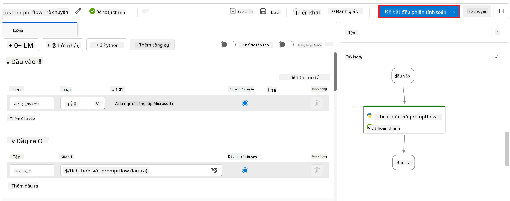

1. Chọn **Validate and parse input** để cập nhật tham số.

    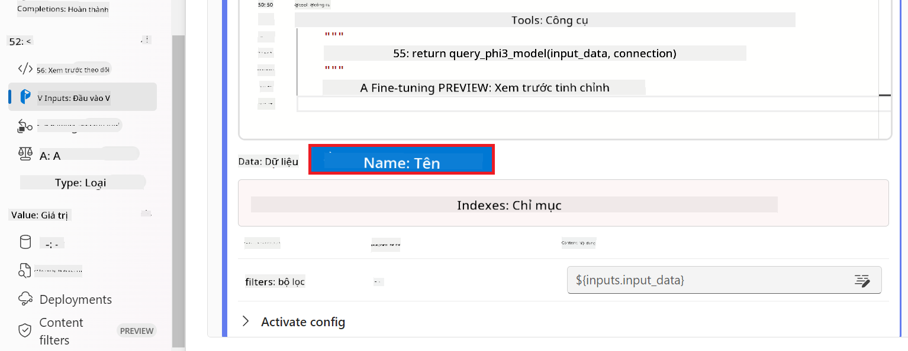

1. Chọn **Value** của **connection** đến kết nối tùy chỉnh bạn đã tạo. Ví dụ, *connection*.

    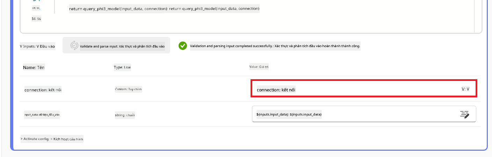

#### Trò chuyện với mô hình tùy chỉnh của bạn

1. Chọn **Chat**.

    

1. Dưới đây là ví dụ về kết quả: Bây giờ bạn có thể trò chuyện với mô hình Phi-3 tùy chỉnh của mình. Khuyến khích đặt câu hỏi dựa trên dữ liệu đã dùng để fine-tune.

    

**Tuyên bố từ chối trách nhiệm**:  
Tài liệu này đã được dịch bằng dịch vụ dịch thuật AI [Co-op Translator](https://github.com/Azure/co-op-translator). Mặc dù chúng tôi cố gắng đảm bảo độ chính xác, xin lưu ý rằng các bản dịch tự động có thể chứa lỗi hoặc không chính xác. Tài liệu gốc bằng ngôn ngữ gốc nên được coi là nguồn chính xác và có thẩm quyền. Đối với các thông tin quan trọng, nên sử dụng dịch vụ dịch thuật chuyên nghiệp do con người thực hiện. Chúng tôi không chịu trách nhiệm về bất kỳ sự hiểu lầm hoặc giải thích sai nào phát sinh từ việc sử dụng bản dịch này.