# Tinh chỉnh và Tích hợp các mô hình Phi-3 tùy chỉnh với Prompt flow trong Azure AI Foundry

Ví dụ đầu cuối (E2E) này dựa trên hướng dẫn "[Tinh chỉnh và Tích hợp các Mô hình Phi-3 Tùy chỉnh với Prompt Flow trong Azure AI Foundry](https://techcommunity.microsoft.com/t5/educator-developer-blog/fine-tune-and-integrate-custom-phi-3-models-with-prompt-flow-in/ba-p/4191726?WT.mc_id=aiml-137032-kinfeylo)" từ Cộng đồng Kỹ thuật Microsoft. Nó giới thiệu các quy trình tinh chỉnh, triển khai, và tích hợp các mô hình Phi-3 tùy chỉnh với Prompt flow trong Azure AI Foundry.
Khác với ví dụ E2E, "[Tinh chỉnh và Tích hợp các Mô hình Phi-3 Tùy chỉnh với Prompt Flow](./E2E_Phi-3-FineTuning_PromptFlow_Integration.md)", chạy code cục bộ, hướng dẫn này tập trung hoàn toàn vào việc tinh chỉnh và tích hợp mô hình của bạn trong Azure AI / ML Studio.

## Tổng quan

Trong ví dụ E2E này, bạn sẽ học cách tinh chỉnh mô hình Phi-3 và tích hợp nó với Prompt flow trong Azure AI Foundry. Bằng cách tận dụng Azure AI / ML Studio, bạn sẽ thiết lập một quy trình làm việc để triển khai và sử dụng các mô hình AI tùy chỉnh. Ví dụ E2E này được chia thành ba kịch bản:

**Kịch bản 1: Thiết lập tài nguyên Azure và Chuẩn bị cho tinh chỉnh**

**Kịch bản 2: Tinh chỉnh mô hình Phi-3 và Triển khai trong Azure Machine Learning Studio**

**Kịch bản 3: Tích hợp với Prompt flow và Trò chuyện với mô hình tùy chỉnh của bạn trong Azure AI Foundry**

Dưới đây là tổng quan về ví dụ E2E này.


### Mục lục

1. **[Kịch bản 1: Thiết lập tài nguyên Azure và Chuẩn bị cho tinh chỉnh](../../../../../../md/02.Application/01.TextAndChat/Phi3)**
    - [Tạo một Azure Machine Learning Workspace](../../../../../../md/02.Application/01.TextAndChat/Phi3)
    - [Yêu cầu hạn mức GPU trong Subscription Azure](../../../../../../md/02.Application/01.TextAndChat/Phi3)
    - [Thêm role assignment](../../../../../../md/02.Application/01.TextAndChat/Phi3)
    - [Thiết lập dự án](../../../../../../md/02.Application/01.TextAndChat/Phi3)
    - [Chuẩn bị bộ dữ liệu cho việc tinh chỉnh](../../../../../../md/02.Application/01.TextAndChat/Phi3)

1. **[Kịch bản 2: Tinh chỉnh mô hình Phi-3 và Triển khai trong Azure Machine Learning Studio](../../../../../../md/02.Application/01.TextAndChat/Phi3)**
    - [Tinh chỉnh mô hình Phi-3](../../../../../../md/02.Application/01.TextAndChat/Phi3)
    - [Triển khai mô hình Phi-3 đã tinh chỉnh](../../../../../../md/02.Application/01.TextAndChat/Phi3)

1. **[Kịch bản 3: Tích hợp với Prompt flow và Trò chuyện với mô hình tùy chỉnh trong Azure AI Foundry](../../../../../../md/02.Application/01.TextAndChat/Phi3)**
    - [Tích hợp mô hình Phi-3 tùy chỉnh với Prompt flow](../../../../../../md/02.Application/01.TextAndChat/Phi3)
    - [Trò chuyện với mô hình Phi-3 tùy chỉnh của bạn](../../../../../../md/02.Application/01.TextAndChat/Phi3)

## Kịch bản 1: Thiết lập tài nguyên Azure và Chuẩn bị cho tinh chỉnh

### Tạo một Azure Machine Learning Workspace

1. Gõ *azure machine learning* vào **thanh tìm kiếm** phía trên trang portal và chọn **Azure Machine Learning** từ các tùy chọn hiện ra.

    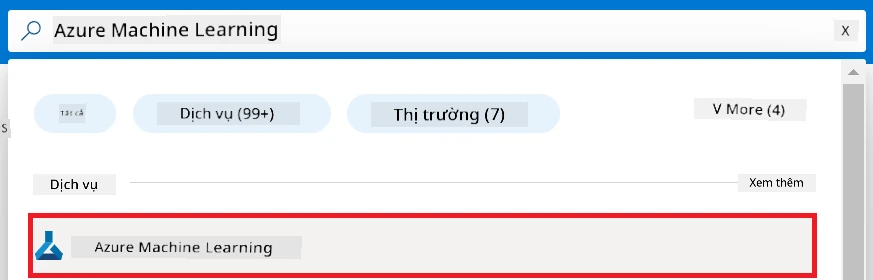

2. Chọn **+ Create** từ menu điều hướng.

3. Chọn **New workspace** từ menu điều hướng.

    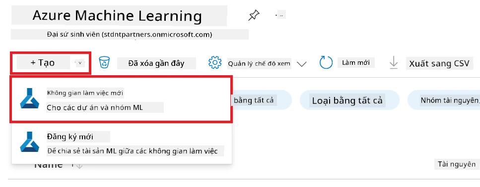

4. Thực hiện các bước sau:

    - Chọn **Subscription** Azure của bạn.
    - Chọn **Resource group** để sử dụng (tạo mới nếu cần).
    - Nhập **Workspace Name**. Nó phải là một giá trị duy nhất.
    - Chọn **Region** bạn muốn sử dụng.
    - Chọn **Storage account** để sử dụng (tạo mới nếu cần).
    - Chọn **Key vault** để sử dụng (tạo mới nếu cần).
    - Chọn **Application insights** để sử dụng (tạo mới nếu cần).
    - Chọn **Container registry** để sử dụng (tạo mới nếu cần).

    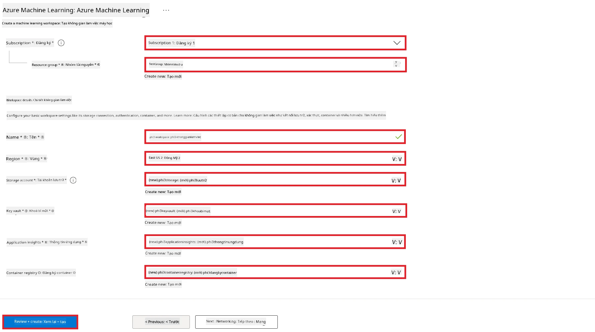

5. Chọn **Review + Create**.

6. Chọn **Create**.

### Yêu cầu hạn mức GPU trong Subscription Azure

Trong hướng dẫn này, bạn sẽ học cách tinh chỉnh và triển khai một mô hình Phi-3, sử dụng GPU. Để tinh chỉnh, bạn sẽ dùng GPU *Standard_NC24ads_A100_v4*, yêu cầu phải có yêu cầu hạn mức. Để triển khai, bạn sẽ dùng GPU *Standard_NC6s_v3*, cũng yêu cầu phải có yêu cầu hạn mức.

> [!NOTE]
>
> Chỉ các Subscription loại Pay-As-You-Go (loại subscription tiêu chuẩn) mới đủ điều kiện cấp phát GPU; các subscription có lợi ích hiện không được hỗ trợ.
>

1. Truy cập [Azure ML Studio](https://ml.azure.com/home?wt.mc_id=studentamb_279723).

1. Thực hiện các bước sau để yêu cầu hạn mức *Standard NCADSA100v4 Family*:

    - Chọn **Quota** từ tab bên trái.
    - Chọn **Virtual machine family** để sử dụng. Ví dụ, chọn **Standard NCADSA100v4 Family Cluster Dedicated vCPUs**, bao gồm GPU *Standard_NC24ads_A100_v4*.
    - Chọn **Request quota** từ menu điều hướng.

        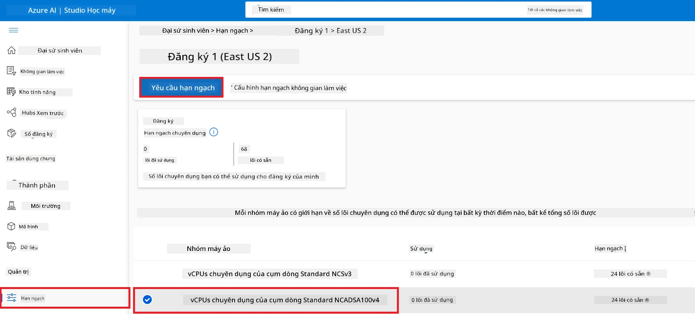

    - Trong trang Request quota, nhập **New cores limit** mà bạn muốn sử dụng. Ví dụ, 24.
    - Trong trang Request quota, chọn **Submit** để gửi yêu cầu hạn mức GPU.

1. Thực hiện các bước sau để yêu cầu hạn mức *Standard NCSv3 Family*:

    - Chọn **Quota** từ tab bên trái.
    - Chọn **Virtual machine family** để sử dụng. Ví dụ, chọn **Standard NCSv3 Family Cluster Dedicated vCPUs**, bao gồm GPU *Standard_NC6s_v3*.
    - Chọn **Request quota** từ menu điều hướng.
    - Trong trang Request quota, nhập **New cores limit** mà bạn muốn sử dụng. Ví dụ, 24.
    - Trong trang Request quota, chọn **Submit** để gửi yêu cầu hạn mức GPU.

### Thêm role assignment

Để tinh chỉnh và triển khai mô hình, bạn phải tạo một User Assigned Managed Identity (UAI) và gán cho nó các quyền phù hợp. UAI này sẽ được sử dụng để xác thực trong quá trình triển khai.

#### Tạo User Assigned Managed Identity (UAI)

1. Gõ *managed identities* vào **thanh tìm kiếm** phía trên trang portal và chọn **Managed Identities** từ các tùy chọn hiện ra.

    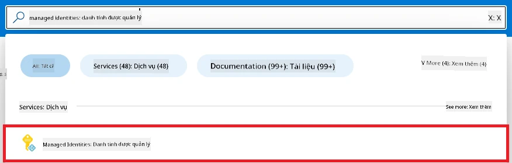

1. Chọn **+ Create**.

    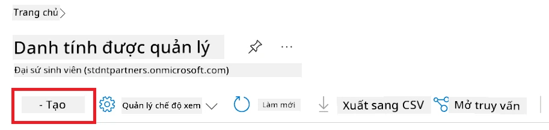

1. Thực hiện các bước sau:

    - Chọn **Subscription** Azure của bạn.
    - Chọn **Resource group** để sử dụng (tạo mới nếu cần).
    - Chọn **Region** bạn muốn sử dụng.
    - Nhập **Name**. Nó phải là giá trị duy nhất.

    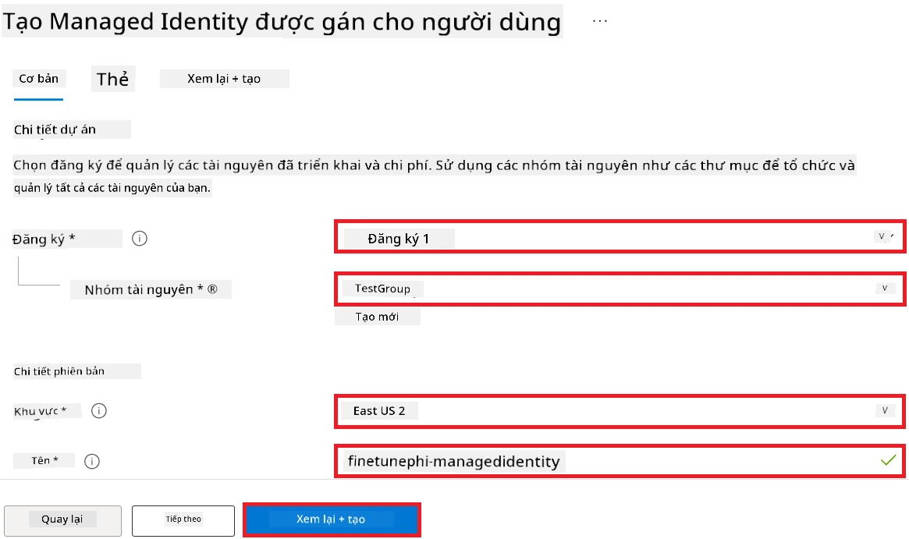

1. Chọn **Review + create**.

1. Chọn **+ Create**.

#### Thêm role assignment Contributor cho Managed Identity

1. Điều hướng đến tài nguyên Managed Identity bạn đã tạo.

1. Chọn **Azure role assignments** từ tab bên trái.

1. Chọn **+Add role assignment** từ menu điều hướng.

1. Trong trang Add role assignment, thực hiện các bước sau:
    - Chọn **Scope** là **Resource group**.
    - Chọn **Subscription** Azure của bạn.
    - Chọn **Resource group** để sử dụng.
    - Chọn **Role** là **Contributor**.

    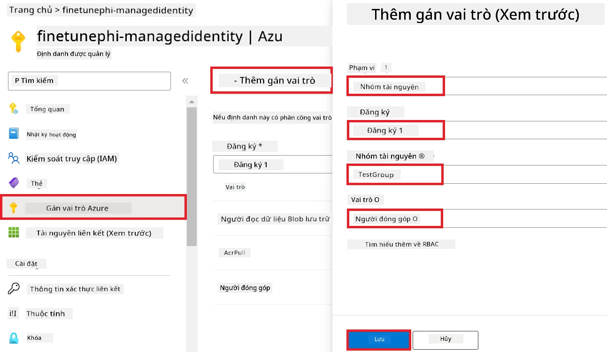

2. Chọn **Save**.

#### Thêm role assignment Storage Blob Data Reader cho Managed Identity

1. Gõ *storage accounts* vào **thanh tìm kiếm** phía trên trang portal và chọn **Storage accounts** từ các tùy chọn hiện ra.

    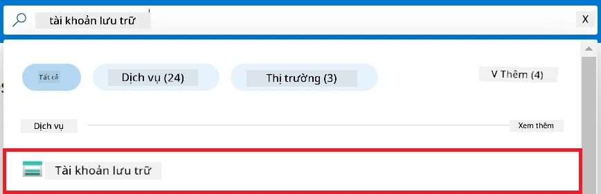

1. Chọn tài khoản storage liên kết với Azure Machine Learning workspace bạn đã tạo. Ví dụ, *finetunephistorage*.

1. Thực hiện các bước để đến trang Add role assignment:

    - Điều hướng đến Azure Storage account bạn đã tạo.
    - Chọn **Access Control (IAM)** từ tab bên trái.
    - Chọn **+ Add** từ menu điều hướng.
    - Chọn **Add role assignment** từ menu điều hướng.

    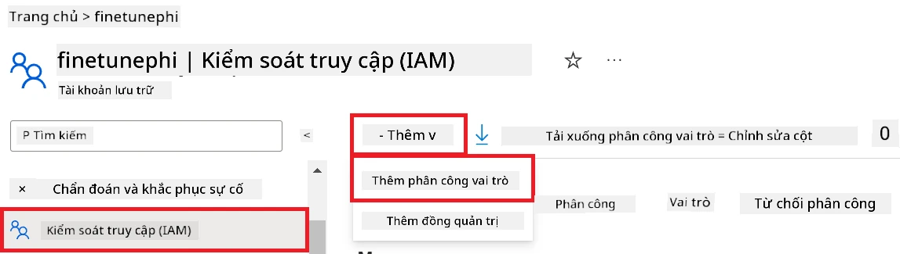

1. Trong trang Add role assignment, thực hiện các bước sau:

    - Trong trang Role, gõ *Storage Blob Data Reader* vào **thanh tìm kiếm** và chọn **Storage Blob Data Reader** từ các tùy chọn hiện ra.
    - Trong trang Role, chọn **Next**.
    - Trong trang Members, chọn **Assign access to** là **Managed identity**.
    - Trong trang Members, chọn **+ Select members**.
    - Trong trang Select managed identities, chọn **Subscription** Azure của bạn.
    - Trong trang Select managed identities, chọn **Managed identity** là **Manage Identity**.
    - Trong trang Select managed identities, chọn Managed Identity bạn đã tạo. Ví dụ, *finetunephi-managedidentity*.
    - Trong trang Select managed identities, chọn **Select**.

    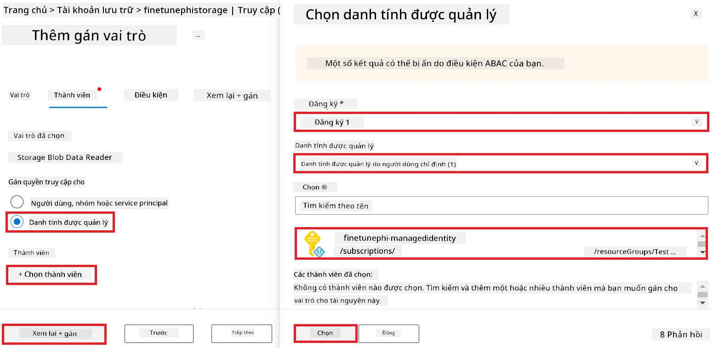

1. Chọn **Review + assign**.

#### Thêm role assignment AcrPull cho Managed Identity

1. Gõ *container registries* vào **thanh tìm kiếm** phía trên trang portal và chọn **Container registries** từ các tùy chọn hiện ra.

    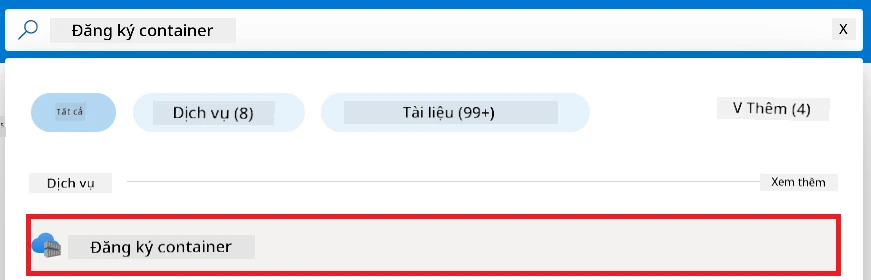

1. Chọn container registry liên kết với Azure Machine Learning workspace. Ví dụ, *finetunephicontainerregistry*

1. Thực hiện các bước để đến trang Add role assignment:

    - Chọn **Access Control (IAM)** từ tab bên trái.
    - Chọn **+ Add** từ menu điều hướng.
    - Chọn **Add role assignment** từ menu điều hướng.

1. Trong trang Add role assignment, thực hiện các bước sau:

    - Trong trang Role, nhập *AcrPull* vào **thanh tìm kiếm** và chọn **AcrPull** từ các tùy chọn hiện ra.
    - Trong trang Role, chọn **Next**.
    - Trong trang Members, chọn **Assign access to** là **Managed identity**.
    - Trong trang Members, chọn **+ Select members**.
    - Trong trang Select managed identities, chọn **Subscription** Azure của bạn.
    - Trong trang Select managed identities, chọn **Managed identity** là **Manage Identity**.
    - Trong trang Select managed identities, chọn Managed Identity bạn đã tạo. Ví dụ, *finetunephi-managedidentity*.
    - Trong trang Select managed identities, chọn **Select**.
    - Chọn **Review + assign**.

### Thiết lập dự án

Để tải xuống các bộ dữ liệu cần thiết cho việc tinh chỉnh, bạn sẽ thiết lập môi trường cục bộ.

Trong bài tập này, bạn sẽ

- Tạo một thư mục để làm việc bên trong nó.
- Tạo một môi trường ảo.
- Cài đặt các gói cần thiết.
- Tạo một file *download_dataset.py* để tải bộ dữ liệu.

#### Tạo một thư mục để làm việc bên trong nó

1. Mở cửa sổ terminal và gõ lệnh sau để tạo một thư mục tên *finetune-phi* ở đường dẫn mặc định.

    ```console
    mkdir finetune-phi
    ```

2. Gõ lệnh sau trong terminal của bạn để điều hướng đến thư mục *finetune-phi* mà bạn đã tạo.

    ```console
    cd finetune-phi
    ```

#### Tạo môi trường ảo

1. Gõ lệnh sau trong terminal của bạn để tạo môi trường ảo có tên *.venv*.

    ```console
    python -m venv .venv
    ```

2. Gõ lệnh sau trong terminal của bạn để kích hoạt môi trường ảo.

    ```console
    .venv\Scripts\activate.bat
    ```

> [!NOTE]
> Nếu thành công, bạn sẽ thấy *(.venv)* trước dấu nhắc lệnh.

#### Cài đặt các gói cần thiết

1. Gõ các lệnh sau trong terminal của bạn để cài đặt các gói cần thiết.

    ```console
    pip install datasets==2.19.1
    ```

#### Tạo `donload_dataset.py`

> [!NOTE]
> Cấu trúc thư mục hoàn chỉnh:
>
> ```text
> └── YourUserName
> .    └── finetune-phi
> .        └── download_dataset.py
> ```

1. Mở **Visual Studio Code**.

1. Chọn **File** từ thanh menu.

1. Chọn **Open Folder**.

1. Chọn thư mục *finetune-phi* mà bạn đã tạo, nằm ở *C:\Users\yourUserName\finetune-phi*.

    

1. Ở khung bên trái của Visual Studio Code, nhấp chuột phải và chọn **New File** để tạo một file mới tên là *download_dataset.py*.

    

### Chuẩn bị bộ dữ liệu để fine-tuning

Trong bài tập này, bạn sẽ chạy file *download_dataset.py* để tải bộ dữ liệu *ultrachat_200k* về môi trường cục bộ của bạn. Sau đó, bạn sẽ dùng bộ dữ liệu này để fine-tune mô hình Phi-3 trong Azure Machine Learning.

Trong bài tập này, bạn sẽ:

- Thêm mã vào file *download_dataset.py* để tải bộ dữ liệu.
- Chạy file *download_dataset.py* để tải bộ dữ liệu về môi trường cục bộ của bạn.

#### Tải bộ dữ liệu bằng *download_dataset.py*

1. Mở file *download_dataset.py* trong Visual Studio Code.

1. Thêm đoạn mã sau vào file *download_dataset.py*.

    ```python
    import json
    import os
    from datasets import load_dataset

    def load_and_split_dataset(dataset_name, config_name, split_ratio):
        """
        Load and split a dataset.
        """
        # Tải bộ dữ liệu với tên, cấu hình và tỷ lệ phân chia được chỉ định
        dataset = load_dataset(dataset_name, config_name, split=split_ratio)
        print(f"Original dataset size: {len(dataset)}")
        
        # Chia bộ dữ liệu thành tập huấn luyện và kiểm tra (80% huấn luyện, 20% kiểm tra)
        split_dataset = dataset.train_test_split(test_size=0.2)
        print(f"Train dataset size: {len(split_dataset['train'])}")
        print(f"Test dataset size: {len(split_dataset['test'])}")
        
        return split_dataset

    def save_dataset_to_jsonl(dataset, filepath):
        """
        Save a dataset to a JSONL file.
        """
        # Tạo thư mục nếu nó chưa tồn tại
        os.makedirs(os.path.dirname(filepath), exist_ok=True)
        
        # Mở tập tin ở chế độ ghi
        with open(filepath, 'w', encoding='utf-8') as f:
            # Lặp qua từng bản ghi trong bộ dữ liệu
            for record in dataset:
                # Ghi bản ghi dưới dạng đối tượng JSON và ghi nó vào tập tin
                json.dump(record, f)
                # Ghi ký tự xuống dòng để phân tách các bản ghi
                f.write('\n')
        
        print(f"Dataset saved to {filepath}")

    def main():
        """
        Main function to load, split, and save the dataset.
        """
        # Tải và chia bộ dữ liệu ULTRACHAT_200k với cấu hình và tỷ lệ phân chia cụ thể
        dataset = load_and_split_dataset("HuggingFaceH4/ultrachat_200k", 'default', 'train_sft[:1%]')
        
        # Trích xuất các bộ dữ liệu huấn luyện và kiểm tra từ phân chia
        train_dataset = dataset['train']
        test_dataset = dataset['test']

        # Lưu bộ dữ liệu huấn luyện vào tập tin JSONL
        save_dataset_to_jsonl(train_dataset, "data/train_data.jsonl")
        
        # Lưu bộ dữ liệu kiểm tra vào tập tin JSONL riêng biệt
        save_dataset_to_jsonl(test_dataset, "data/test_data.jsonl")

    if __name__ == "__main__":
        main()

    ```

1. Gõ lệnh sau trong terminal của bạn để chạy script và tải bộ dữ liệu về môi trường cục bộ.

    ```console
    python download_dataset.py
    ```

1. Xác nhận rằng các bộ dữ liệu đã được lưu thành công trong thư mục *finetune-phi/data* cục bộ của bạn.

> [!NOTE]
>
> #### Lưu ý về kích thước bộ dữ liệu và thời gian fine-tuning
>
> Trong hướng dẫn này, bạn chỉ sử dụng 1% của bộ dữ liệu (`split='train[:1%]'`). Điều này giảm đáng kể lượng dữ liệu, giúp tăng tốc cả quá trình tải lên và fine-tuning. Bạn có thể điều chỉnh tỷ lệ phần trăm để tìm ra sự cân bằng phù hợp giữa thời gian huấn luyện và hiệu suất mô hình. Việc sử dụng một tập con nhỏ hơn của bộ dữ liệu giúp giảm thời gian cần thiết cho việc fine-tuning, làm cho quá trình trở nên dễ quản lý hơn cho một bài hướng dẫn.

## Kịch bản 2: Fine-tune mô hình Phi-3 và Triển khai trong Azure Machine Learning Studio

### Fine-tune mô hình Phi-3

Trong bài tập này, bạn sẽ fine-tune mô hình Phi-3 trong Azure Machine Learning Studio.

Trong bài tập này, bạn sẽ:

- Tạo cụm máy tính cho việc fine-tuning.
- Fine-tune mô hình Phi-3 trong Azure Machine Learning Studio.

#### Tạo cụm máy tính cho việc fine-tuning

1. Truy cập [Azure ML Studio](https://ml.azure.com/home?wt.mc_id=studentamb_279723).

1. Chọn **Compute** từ tab bên trái.

1. Chọn **Compute clusters** từ menu điều hướng.

1. Chọn **+ New**.

    

1. Thực hiện các nhiệm vụ sau:

    - Chọn **Region** bạn muốn sử dụng.
    - Chọn **Virtual machine tier** là **Dedicated**.
    - Chọn **Virtual machine type** là **GPU**.
    - Chọn bộ lọc **Virtual machine size** thành **Select from all options**.
    - Chọn kích thước **Virtual machine size** là **Standard_NC24ads_A100_v4**.

    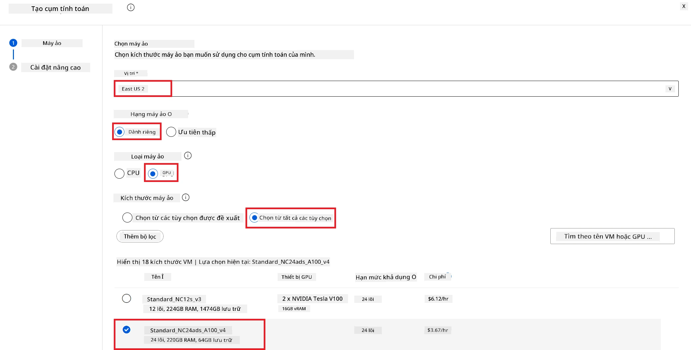

1. Chọn **Next**.

1. Thực hiện các nhiệm vụ sau:

    - Nhập **Compute name**. Nó phải là giá trị duy nhất.
    - Chọn số lượng **Minimum number of nodes** là **0**.
    - Chọn số lượng **Maximum number of nodes** là **1**.
    - Chọn **Idle seconds before scale down** thành **120**.

    

1. Chọn **Create**.

#### Fine-tune mô hình Phi-3

1. Truy cập [Azure ML Studio](https://ml.azure.com/home?wt.mc_id=studentamb_279723).

1. Chọn workspace Azure Machine Learning mà bạn đã tạo.

    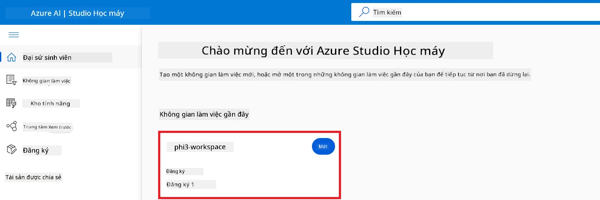

1. Thực hiện các nhiệm vụ sau:

    - Chọn **Model catalog** từ tab bên trái.
    - Gõ *phi-3-mini-4k* trong thanh **search bar** và chọn **Phi-3-mini-4k-instruct** từ các tùy chọn xuất hiện.

    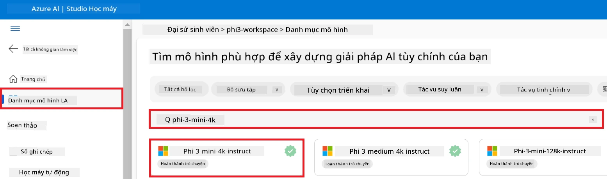

1. Chọn **Fine-tune** từ menu điều hướng.

    

1. Thực hiện các nhiệm vụ sau:

    - Chọn **Select task type** là **Chat completion**.
    - Chọn **+ Select data** để tải lên **Training data**.
    - Chọn loại tải dữ liệu Validation là **Provide different validation data**.
    - Chọn **+ Select data** để tải lên **Validation data**.

    

> [!TIP]
>
> Bạn có thể chọn **Advanced settings** để tùy chỉnh các cấu hình như **learning_rate** và **lr_scheduler_type** nhằm tối ưu hóa quá trình fine-tuning theo nhu cầu cụ thể của bạn.

1. Chọn **Finish**.

1. Trong bài tập này, bạn đã thành công fine-tune mô hình Phi-3 bằng Azure Machine Learning. Lưu ý rằng quá trình fine-tuning có thể mất khá nhiều thời gian. Sau khi chạy công việc fine-tuning, bạn cần chờ cho nó hoàn thành. Bạn có thể theo dõi trạng thái của công việc fine-tuning bằng cách vào tab Jobs ở bên trái trong Azure Machine Learning Workspace của bạn. Trong phần tiếp theo, bạn sẽ triển khai mô hình đã fine-tune và tích hợp nó với Prompt flow.

    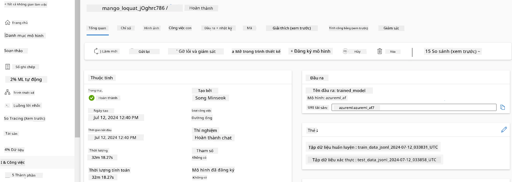

### Triển khai mô hình Phi-3 đã fine-tune

Để tích hợp mô hình Phi-3 đã fine-tune với Prompt flow, bạn cần triển khai mô hình để có thể sử dụng cho việc suy luận thời gian thực. Quá trình này bao gồm đăng ký mô hình, tạo endpoint trực tuyến và triển khai mô hình.

Trong bài tập này, bạn sẽ:

- Đăng ký mô hình đã fine-tune trong workspace Azure Machine Learning.
- Tạo một endpoint trực tuyến.
- Triển khai mô hình Phi-3 đã đăng ký được fine-tune.

#### Đăng ký mô hình đã fine-tune

1. Truy cập [Azure ML Studio](https://ml.azure.com/home?wt.mc_id=studentamb_279723).

1. Chọn workspace Azure Machine Learning mà bạn đã tạo.

    

1. Chọn **Models** từ tab bên trái.
1. Chọn **+ Register**.
1. Chọn **From a job output**.

    

1. Chọn công việc mà bạn đã tạo.

    

1. Chọn **Next**.

1. Chọn **Model type** là **MLflow**.

1. Đảm bảo rằng **Job output** được chọn; nó sẽ được chọn tự động.

    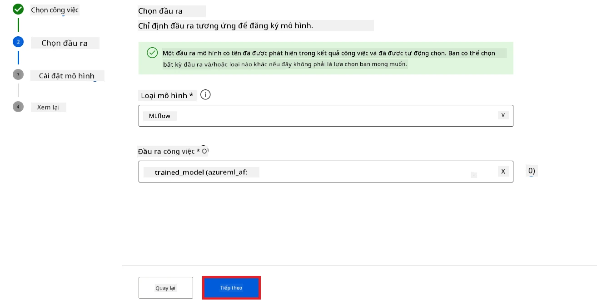

2. Chọn **Next**.

3. Chọn **Register**.

    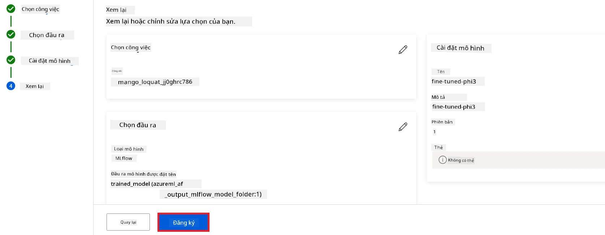

4. Bạn có thể xem mô hình đã đăng ký bằng cách chuyển đến menu **Models** từ tab bên trái.

    

#### Triển khai mô hình đã fine-tune

1. Vào workspace Azure Machine Learning mà bạn đã tạo.

1. Chọn **Endpoints** từ tab bên trái.

1. Chọn **Real-time endpoints** từ menu điều hướng.

    

1. Chọn **Create**.

1. Chọn mô hình đã đăng ký mà bạn đã tạo.

    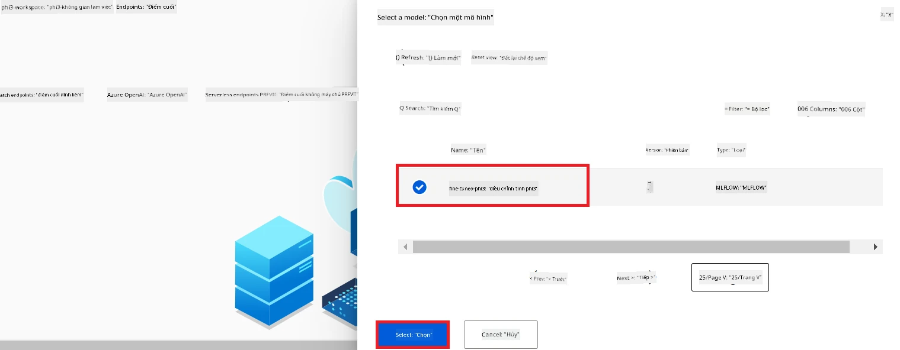

1. Chọn **Select**.

1. Thực hiện các nhiệm vụ sau:

    - Chọn **Virtual machine** là *Standard_NC6s_v3*.
    - Chọn số lượng **Instance count** bạn muốn sử dụng. Ví dụ, *1*.
    - Chọn **Endpoint** là **New** để tạo endpoint.
    - Nhập **Endpoint name**. Nó phải là giá trị duy nhất.
    - Nhập **Deployment name**. Nó cũng phải là giá trị duy nhất.

    

1. Chọn **Deploy**.

> [!WARNING]
> Để tránh phát sinh thêm chi phí trong tài khoản của bạn, hãy chắc chắn xóa endpoint đã tạo trong workspace Azure Machine Learning khi không còn sử dụng.
>

#### Kiểm tra trạng thái triển khai trong Azure Machine Learning Workspace

1. Vào workspace Azure Machine Learning mà bạn đã tạo.

1. Chọn **Endpoints** từ tab bên trái.

1. Chọn endpoint mà bạn đã tạo.

    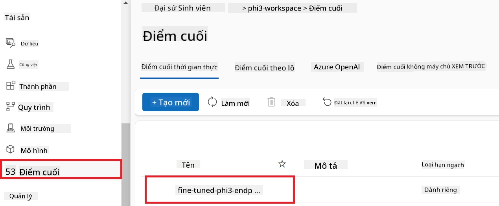

1. Trên trang này, bạn có thể quản lý các endpoints trong quá trình triển khai.

> [!NOTE]
> Khi việc triển khai hoàn tất, hãy đảm bảo rằng **Live traffic** được đặt ở mức **100%**. Nếu không phải, hãy chọn **Update traffic** để điều chỉnh cấu hình lưu lượng. Lưu ý bạn không thể kiểm tra mô hình nếu lưu lượng được đặt 0%.
>
> 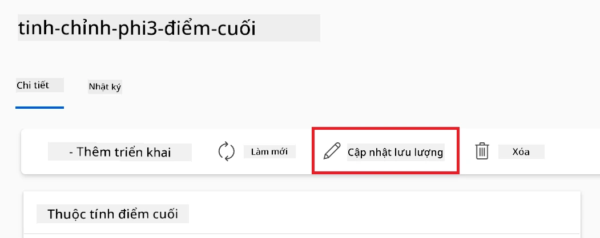
>

## Kịch bản 3: Tích hợp với Prompt flow và Hội thoại với mô hình tùy chỉnh của bạn trong Azure AI Foundry

### Tích hợp mô hình Phi-3 tùy chỉnh với Prompt flow

Sau khi đã triển khai thành công mô hình đã fine-tune, bạn có thể tích hợp nó với Prompt Flow để sử dụng mô hình trong các ứng dụng thời gian thực, cho phép thực hiện nhiều tác vụ tương tác với mô hình Phi-3 tùy chỉnh của bạn.

Trong bài tập này, bạn sẽ:

- Tạo Azure AI Foundry Hub.
- Tạo Azure AI Foundry Project.
- Tạo Prompt flow.
- Thêm kết nối tùy chỉnh cho mô hình Phi-3 đã fine-tune.
- Cấu hình Prompt flow để hội thoại với mô hình Phi-3 tùy chỉnh của bạn.

> [!NOTE]
> Bạn cũng có thể tích hợp với Promptflow sử dụng Azure ML Studio. Quy trình tích hợp tương tự có thể áp dụng cho Azure ML Studio.

#### Tạo Azure AI Foundry Hub

Bạn cần tạo một Hub trước khi tạo Project. Hub hoạt động giống như một Resource Group, cho phép bạn tổ chức và quản lý nhiều Project trong Azure AI Foundry.

1. Truy cập [Azure AI Foundry](https://ai.azure.com/?WT.mc_id=aiml-137032-kinfeylo).

1. Chọn **All hubs** từ tab bên trái.

1. Chọn **+ New hub** từ menu điều hướng.
    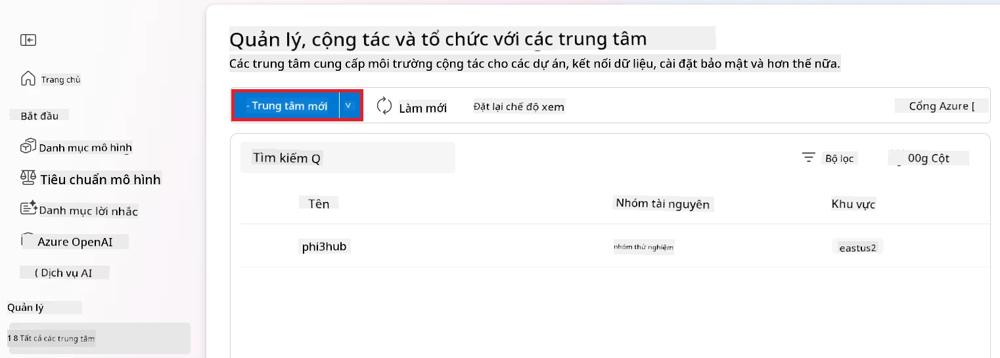

1. Thực hiện các tác vụ sau:

    - Nhập **Tên Hub**. Nó phải là một giá trị duy nhất.
    - Chọn **Subscription** Azure của bạn.
    - Chọn **Nhóm tài nguyên** để sử dụng (tạo nhóm mới nếu cần).
    - Chọn **Vị trí** bạn muốn sử dụng.
    - Chọn **Kết nối Dịch vụ AI Azure** để sử dụng (tạo mới nếu cần).
    - Chọn **Kết nối Azure AI Search** để **Bỏ qua kết nối**.

    

1. Chọn **Tiếp theo**.

#### Tạo dự án Azure AI Foundry

1. Trong Hub mà bạn đã tạo, chọn **Tất cả dự án** từ tab bên trái.

1. Chọn **+ Dự án mới** từ menu điều hướng.

    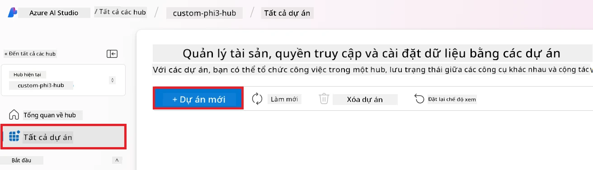

1. Nhập **Tên dự án**. Nó phải là một giá trị duy nhất.

    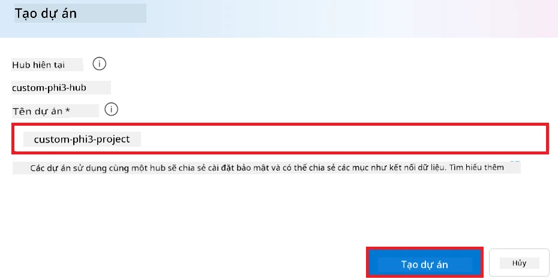

1. Chọn **Tạo dự án**.

#### Thêm kết nối tùy chỉnh cho mô hình Phi-3 được tinh chỉnh

Để tích hợp mô hình Phi-3 tùy chỉnh của bạn với Prompt flow, bạn cần lưu điểm cuối và khóa của mô hình trong một kết nối tùy chỉnh. Thiết lập này đảm bảo truy cập đến mô hình Phi-3 tùy chỉnh của bạn trong Prompt flow.

#### Thiết lập khóa api và URI điểm cuối của mô hình Phi-3 được tinh chỉnh

1. Truy cập [Azure ML Studio](https://ml.azure.com/home?WT.mc_id=aiml-137032-kinfeylo).

1. Điều hướng đến workspace Azure Machine learning mà bạn đã tạo.

1. Chọn **Endpoints** từ tab bên trái.

    

1. Chọn điểm cuối mà bạn đã tạo.

    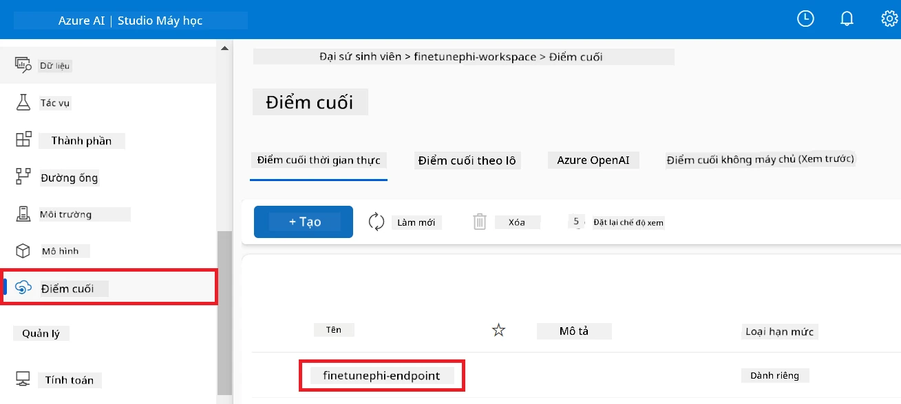

1. Chọn **Consume** từ menu điều hướng.

1. Sao chép **REST endpoint** và **Primary key** của bạn.

    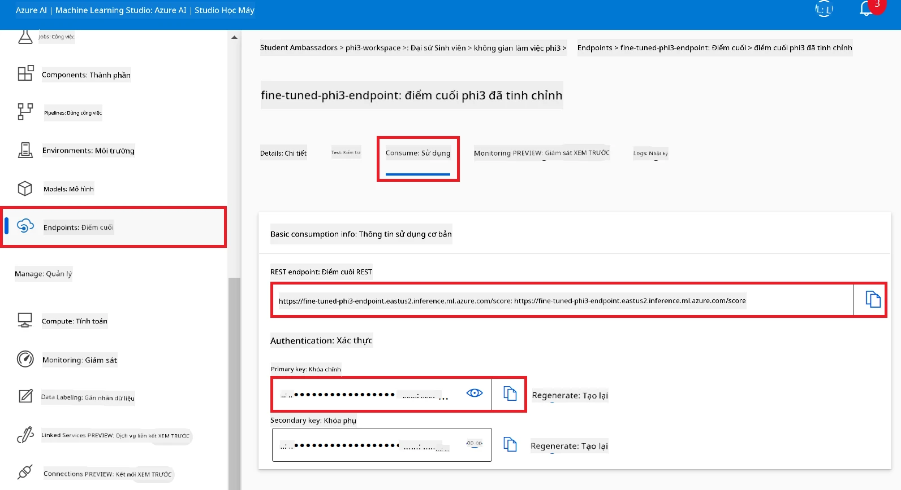

#### Thêm kết nối tùy chỉnh

1. Truy cập [Azure AI Foundry](https://ai.azure.com/?WT.mc_id=aiml-137032-kinfeylo).

1. Điều hướng đến dự án Azure AI Foundry mà bạn đã tạo.

1. Trong Dự án mà bạn đã tạo, chọn **Cài đặt** từ tab bên trái.

1. Chọn **+ Kết nối mới**.

    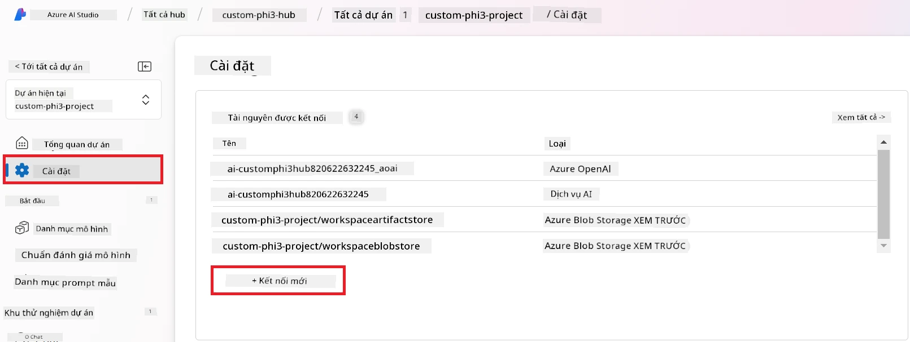

1. Chọn **Khóa tùy chỉnh** từ menu điều hướng.

    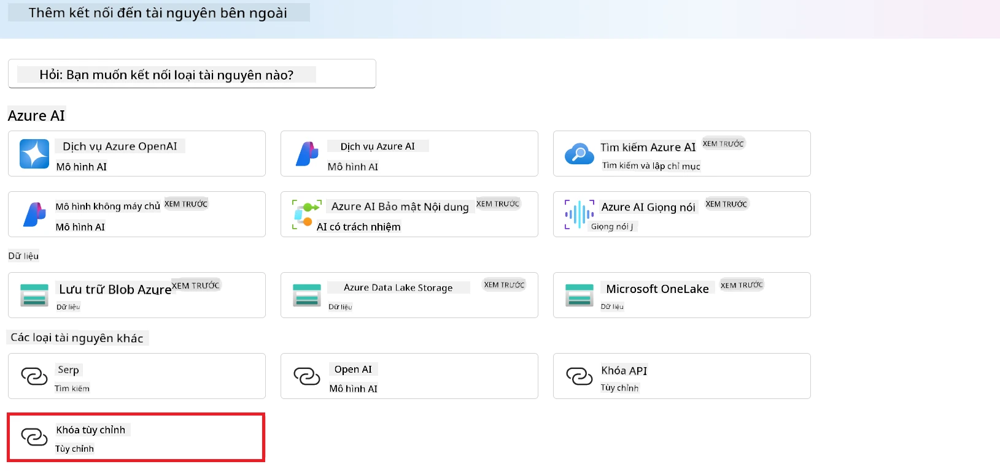

1. Thực hiện các tác vụ sau:

    - Chọn **+ Thêm cặp khóa giá trị**.
    - Đối với tên khóa, nhập **endpoint** và dán điểm cuối mà bạn đã sao chép từ Azure ML Studio vào trường giá trị.
    - Chọn **+ Thêm cặp khóa giá trị** một lần nữa.
    - Đối với tên khóa, nhập **key** và dán khóa mà bạn đã sao chép từ Azure ML Studio vào trường giá trị.
    - Sau khi thêm các khóa, chọn **is secret** để ngăn khóa bị lộ.

    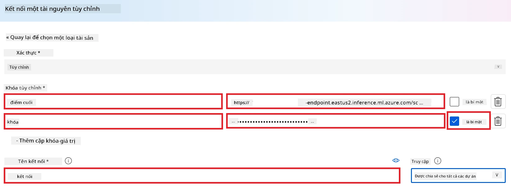

1. Chọn **Thêm kết nối**.

#### Tạo Prompt flow

Bạn đã thêm một kết nối tùy chỉnh trong Azure AI Foundry. Bây giờ, hãy tạo một Prompt flow theo các bước sau. Sau đó, bạn sẽ kết nối Prompt flow này với kết nối tùy chỉnh để có thể sử dụng mô hình được tinh chỉnh trong Prompt flow.

1. Điều hướng đến dự án Azure AI Foundry mà bạn đã tạo.

1. Chọn **Prompt flow** từ tab bên trái.

1. Chọn **+ Tạo** từ menu điều hướng.

    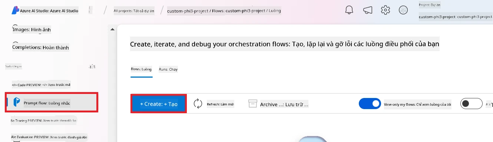

1. Chọn **Chat flow** từ menu điều hướng.

    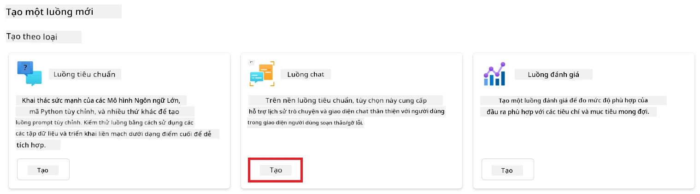

1. Nhập **Tên thư mục** để sử dụng.

    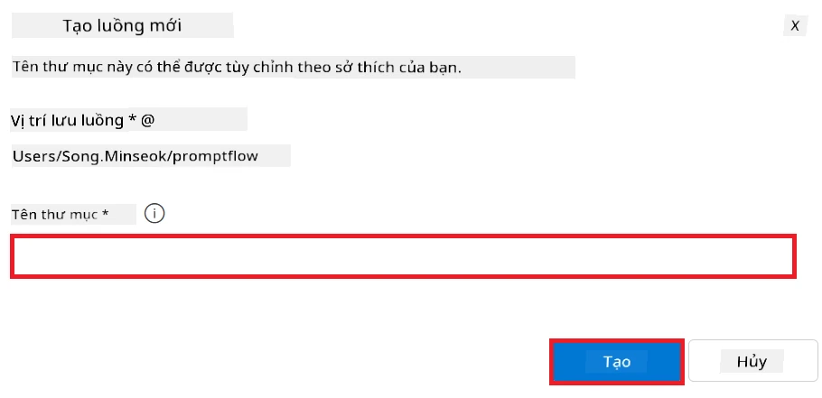

2. Chọn **Tạo**.

#### Thiết lập Prompt flow để trò chuyện với mô hình Phi-3 tùy chỉnh của bạn

Bạn cần tích hợp mô hình Phi-3 được tinh chỉnh vào một Prompt flow. Tuy nhiên, Prompt flow hiện có không được thiết kế cho mục đích này. Do đó, bạn phải thiết kế lại Prompt flow để cho phép tích hợp mô hình tùy chỉnh.

1. Trong Prompt flow, thực hiện các tác vụ sau để xây dựng lại luồng hiện có:

    - Chọn **Chế độ tệp thô**.
    - Xóa tất cả mã hiện có trong tệp *flow.dag.yml*.
    - Thêm đoạn mã sau vào tệp *flow.dag.yml*.

        ```yml
        inputs:
          input_data:
            type: string
            default: "Who founded Microsoft?"

        outputs:
          answer:
            type: string
            reference: ${integrate_with_promptflow.output}

        nodes:
        - name: integrate_with_promptflow
          type: python
          source:
            type: code
            path: integrate_with_promptflow.py
          inputs:
            input_data: ${inputs.input_data}
        ```

    - Chọn **Lưu**.

    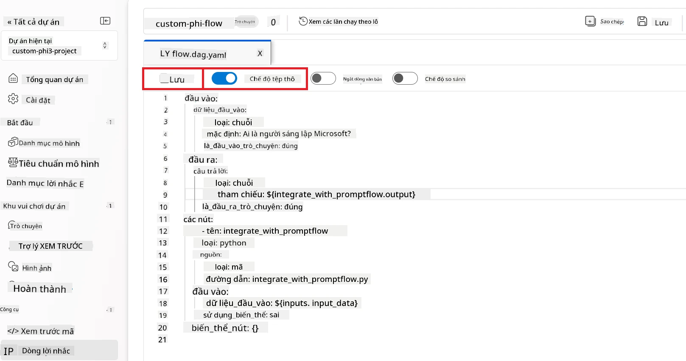

1. Thêm đoạn mã sau vào tệp *integrate_with_promptflow.py* để sử dụng mô hình Phi-3 tùy chỉnh trong Prompt flow.

    ```python
    import logging
    import requests
    from promptflow import tool
    from promptflow.connections import CustomConnection

    # Thiết lập ghi nhật ký
    logging.basicConfig(
        format="%(asctime)s - %(levelname)s - %(name)s - %(message)s",
        datefmt="%Y-%m-%d %H:%M:%S",
        level=logging.DEBUG
    )
    logger = logging.getLogger(__name__)

    def query_phi3_model(input_data: str, connection: CustomConnection) -> str:
        """
        Send a request to the Phi-3 model endpoint with the given input data using Custom Connection.
        """

        # "connection" là tên của Kết nối Tùy chỉnh, "endpoint", "key" là các khóa trong Kết nối Tùy chỉnh
        endpoint_url = connection.endpoint
        api_key = connection.key

        headers = {
            "Content-Type": "application/json",
            "Authorization": f"Bearer {api_key}"
        }
        data = {
            "input_data": {
                "input_string": [
                    {"role": "user", "content": input_data}
                ],
                "parameters": {
                    "temperature": 0.7,
                    "max_new_tokens": 128
                }
            }
        }
        try:
            response = requests.post(endpoint_url, json=data, headers=headers)
            response.raise_for_status()
            
            # Ghi nhật ký phản hồi JSON đầy đủ
            logger.debug(f"Full JSON response: {response.json()}")

            result = response.json()["output"]
            logger.info("Successfully received response from Azure ML Endpoint.")
            return result
        except requests.exceptions.RequestException as e:
            logger.error(f"Error querying Azure ML Endpoint: {e}")
            raise

    @tool
    def my_python_tool(input_data: str, connection: CustomConnection) -> str:
        """
        Tool function to process input data and query the Phi-3 model.
        """
        return query_phi3_model(input_data, connection)

    ```

    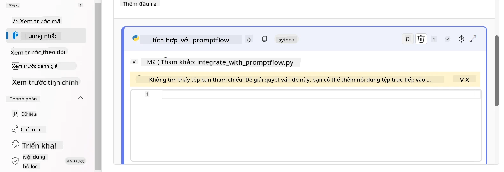

> [!NOTE]
> Để biết thêm thông tin chi tiết về cách sử dụng Prompt flow trong Azure AI Foundry, bạn có thể tham khảo [Prompt flow trong Azure AI Foundry](https://learn.microsoft.com/azure/ai-studio/how-to/prompt-flow).

1. Chọn **Đầu vào chat**, **Đầu ra chat** để kích hoạt trò chuyện với mô hình của bạn.

    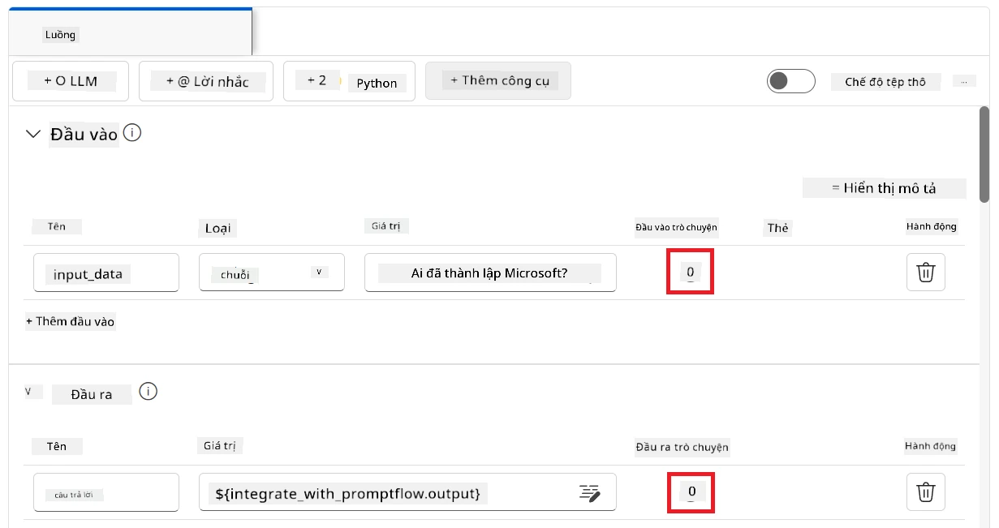

1. Bây giờ bạn đã sẵn sàng để trò chuyện với mô hình Phi-3 tùy chỉnh của bạn. Trong bài tập tiếp theo, bạn sẽ học cách khởi động Prompt flow và sử dụng nó để trò chuyện với mô hình Phi-3 được tinh chỉnh của bạn.

> [!NOTE]
>
> Luồng được xây dựng lại sẽ trông giống như hình dưới đây:
>
> 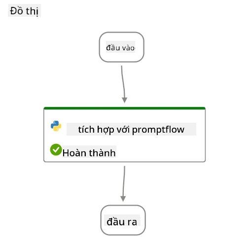
>

### Trò chuyện với mô hình Phi-3 tùy chỉnh của bạn

Bây giờ bạn đã tinh chỉnh và tích hợp mô hình Phi-3 tùy chỉnh với Prompt flow, bạn đã sẵn sàng để bắt đầu tương tác với nó. Bài tập này sẽ hướng dẫn bạn cách thiết lập và khởi động trò chuyện với mô hình của bạn sử dụng Prompt flow. Bằng cách làm theo các bước này, bạn sẽ có thể tận dụng tối đa khả năng của mô hình Phi-3 được tinh chỉnh cho các tác vụ và cuộc trò chuyện khác nhau.

- Trò chuyện với mô hình Phi-3 tùy chỉnh của bạn sử dụng Prompt flow.

#### Khởi động Prompt flow

1. Chọn **Bắt đầu phiên tính toán** để khởi động Prompt flow.

    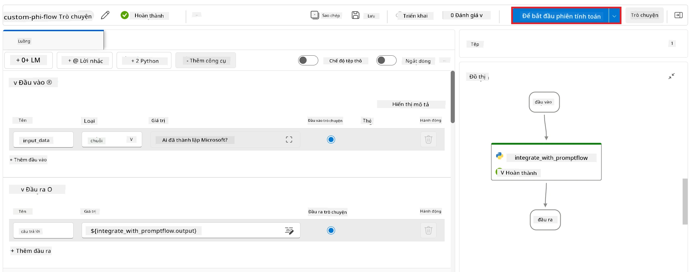

1. Chọn **Xác thực và phân tích đầu vào** để làm mới các tham số.

    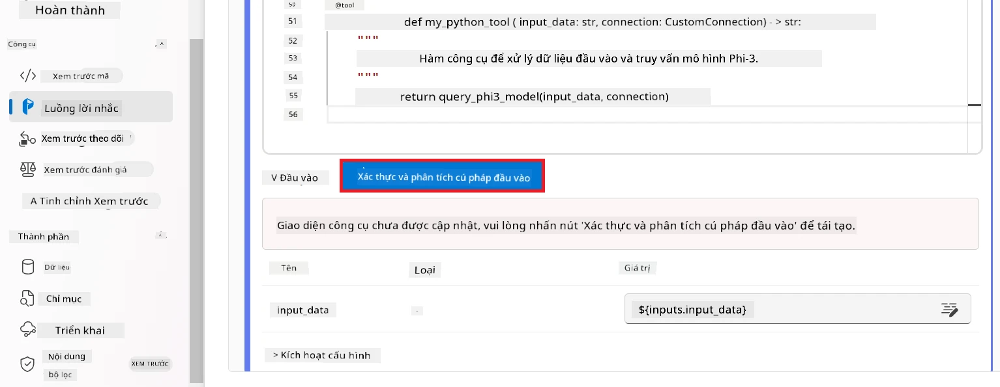

1. Chọn **Giá trị** của **kết nối** đến kết nối tùy chỉnh mà bạn đã tạo. Ví dụ, *connection*.

    

#### Trò chuyện với mô hình tùy chỉnh của bạn

1. Chọn **Trò chuyện**.

    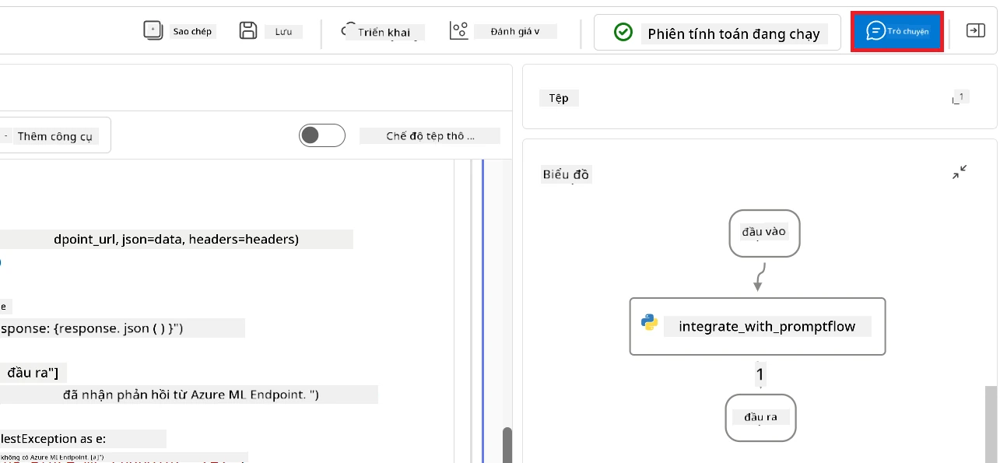

1. Đây là ví dụ kết quả: Bây giờ bạn có thể trò chuyện với mô hình Phi-3 tùy chỉnh. Nên đặt câu hỏi dựa trên dữ liệu đã dùng để tinh chỉnh.

    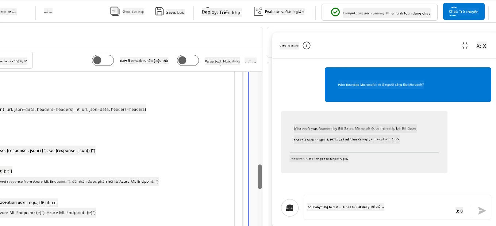

---

<!-- CO-OP TRANSLATOR DISCLAIMER START -->
**Tuyên bố miễn trừ trách nhiệm**:  
Tài liệu này đã được dịch bằng dịch vụ dịch thuật AI [Co-op Translator](https://github.com/Azure/co-op-translator). Mặc dù chúng tôi nỗ lực để đảm bảo độ chính xác, xin lưu ý rằng các bản dịch tự động có thể chứa lỗi hoặc không chính xác. Tài liệu gốc bằng ngôn ngữ gốc của nó nên được xem là nguồn chính thống. Đối với các thông tin quan trọng, khuyến nghị sử dụng dịch vụ dịch thuật chuyên nghiệp bởi con người. Chúng tôi không chịu trách nhiệm về bất kỳ sự hiểu lầm hoặc diễn giải sai nào phát sinh từ việc sử dụng bản dịch này.
<!-- CO-OP TRANSLATOR DISCLAIMER END -->