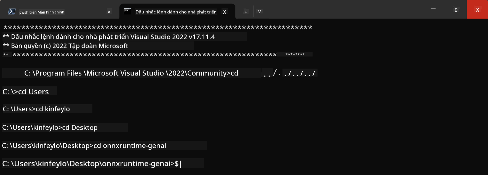

<!--
CO_OP_TRANSLATOR_METADATA:
{
  "original_hash": "b066fc29c1b2129df84e027cb75119ce",
  "translation_date": "2025-07-17T02:45:16+00:00",
  "source_file": "md/02.Application/01.TextAndChat/Phi3/ORTWindowGPUGuideline.md",
  "language_code": "vi"
}
-->
# **Hướng dẫn sử dụng OnnxRuntime GenAI trên Windows GPU**

Hướng dẫn này cung cấp các bước để thiết lập và sử dụng ONNX Runtime (ORT) với GPU trên Windows. Mục đích là giúp bạn tận dụng khả năng tăng tốc GPU cho các mô hình của mình, cải thiện hiệu suất và hiệu quả.

Tài liệu bao gồm hướng dẫn về:

- Thiết lập môi trường: Hướng dẫn cài đặt các phụ thuộc cần thiết như CUDA, cuDNN và ONNX Runtime.
- Cấu hình: Cách cấu hình môi trường và ONNX Runtime để sử dụng tài nguyên GPU một cách hiệu quả.
- Mẹo tối ưu: Lời khuyên để tinh chỉnh cài đặt GPU nhằm đạt hiệu suất tối ưu.

### **1. Python 3.10.x /3.11.8**

   ***Lưu ý*** Khuyến nghị sử dụng [miniforge](https://github.com/conda-forge/miniforge/releases/latest/download/Miniforge3-Windows-x86_64.exe) làm môi trường Python của bạn

   ```bash

   conda create -n pydev python==3.11.8

   conda activate pydev

   ```

   ***Nhắc nhở*** Nếu bạn đã cài bất kỳ thư viện ONNX nào liên quan đến Python, vui lòng gỡ cài đặt chúng

### **2. Cài đặt CMake bằng winget**

   ```bash

   winget install -e --id Kitware.CMake

   ```

### **3. Cài đặt Visual Studio 2022 - Desktop Development with C++**

   ***Lưu ý*** Nếu bạn không muốn biên dịch, có thể bỏ qua bước này


### **4. Cài đặt Driver NVIDIA**

1. **Driver GPU NVIDIA**  [https://www.nvidia.com/en-us/drivers/](https://www.nvidia.com/en-us/drivers/)

2. **NVIDIA CUDA 12.4** [https://developer.nvidia.com/cuda-12-4-0-download-archive](https://developer.nvidia.com/cuda-12-4-0-download-archive)

3. **NVIDIA CUDNN 9.4**  [https://developer.nvidia.com/cudnn-downloads](https://developer.nvidia.com/cudnn-downloads)

***Nhắc nhở*** Vui lòng sử dụng các thiết lập mặc định trong quá trình cài đặt

### **5. Thiết lập môi trường NVIDIA**

Sao chép các thư mục lib, bin, include của NVIDIA CUDNN 9.4 vào thư mục tương ứng của NVIDIA CUDA 12.4

- sao chép các file trong *'C:\Program Files\NVIDIA\CUDNN\v9.4\bin\12.6'* vào *'C:\Program Files\NVIDIA GPU Computing Toolkit\CUDA\v12.4\bin'*

- sao chép các file trong *'C:\Program Files\NVIDIA\CUDNN\v9.4\include\12.6'* vào *'C:\Program Files\NVIDIA GPU Computing Toolkit\CUDA\v12.4\include'*

- sao chép các file trong *'C:\Program Files\NVIDIA\CUDNN\v9.4\lib\12.6'* vào *'C:\Program Files\NVIDIA GPU Computing Toolkit\CUDA\v12.4\lib\x64'*

### **6. Tải Phi-3.5-mini-instruct-onnx**

   ```bash

   winget install -e --id Git.Git

   winget install -e --id GitHub.GitLFS

   git lfs install

   git clone https://huggingface.co/microsoft/Phi-3.5-mini-instruct-onnx

   ```

### **7. Chạy InferencePhi35Instruct.ipynb**

   Mở [Notebook](../../../../../../code/09.UpdateSamples/Aug/ortgpu-phi35-instruct.ipynb) và thực thi


### **8. Biên dịch ORT GenAI GPU**

   ***Lưu ý*** 
   
   1. Vui lòng gỡ cài đặt tất cả các gói liên quan đến onnx, onnxruntime và onnxruntime-genai trước tiên

   ```bash

   pip list 
   
   ```

   Sau đó gỡ cài đặt tất cả các thư viện onnxruntime, ví dụ như

   ```bash

   pip uninstall onnxruntime

   pip uninstall onnxruntime-genai

   pip uninstall onnxruntume-genai-cuda
   
   ```

   2. Kiểm tra hỗ trợ Extension của Visual Studio

   Kiểm tra thư mục C:\Program Files\NVIDIA GPU Computing Toolkit\CUDA\v12.4\extras để đảm bảo có thư mục C:\Program Files\NVIDIA GPU Computing Toolkit\CUDA\v12.4\extras\visual_studio_integration.

   Nếu không tìm thấy, kiểm tra các thư mục driver Cuda toolkit khác và sao chép thư mục visual_studio_integration cùng nội dung vào C:\Program Files\NVIDIA GPU Computing Toolkit\CUDA\v12.4\extras\visual_studio_integration

   - Nếu bạn không muốn biên dịch, có thể bỏ qua bước này

   ```bash

   git clone https://github.com/microsoft/onnxruntime-genai

   ```

   - Tải về [https://github.com/microsoft/onnxruntime/releases/download/v1.19.2/onnxruntime-win-x64-gpu-1.19.2.zip](https://github.com/microsoft/onnxruntime/releases/download/v1.19.2/onnxruntime-win-x64-gpu-1.19.2.zip)

   - Giải nén onnxruntime-win-x64-gpu-1.19.2.zip, đổi tên thư mục thành **ort**, sau đó sao chép thư mục ort vào onnxruntime-genai

   - Sử dụng Windows Terminal, mở Developer Command Prompt for VS 2022 và chuyển đến thư mục onnxruntime-genai



   - Biên dịch với môi trường python của bạn

   ```bash

   cd onnxruntime-genai

   python build.py --use_cuda  --cuda_home "C:\Program Files\NVIDIA GPU Computing Toolkit\CUDA\v12.4" --config Release
 

   cd build/Windows/Release/Wheel

   pip install .whl

   ```

**Tuyên bố từ chối trách nhiệm**:  
Tài liệu này đã được dịch bằng dịch vụ dịch thuật AI [Co-op Translator](https://github.com/Azure/co-op-translator). Mặc dù chúng tôi cố gắng đảm bảo độ chính xác, xin lưu ý rằng bản dịch tự động có thể chứa lỗi hoặc không chính xác. Tài liệu gốc bằng ngôn ngữ gốc của nó nên được coi là nguồn chính xác và đáng tin cậy. Đối với các thông tin quan trọng, nên sử dụng dịch vụ dịch thuật chuyên nghiệp do con người thực hiện. Chúng tôi không chịu trách nhiệm về bất kỳ sự hiểu lầm hoặc giải thích sai nào phát sinh từ việc sử dụng bản dịch này.