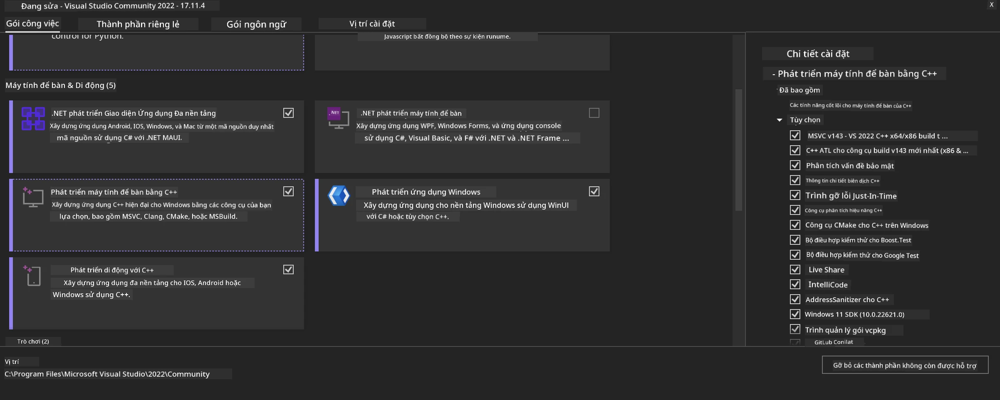
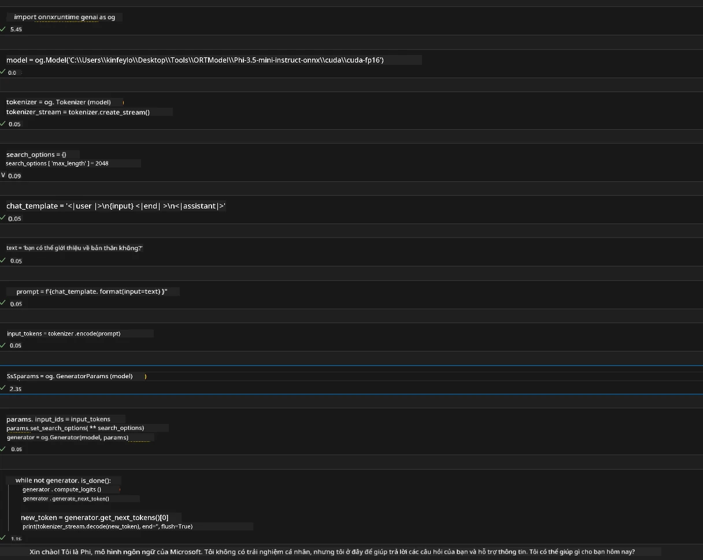
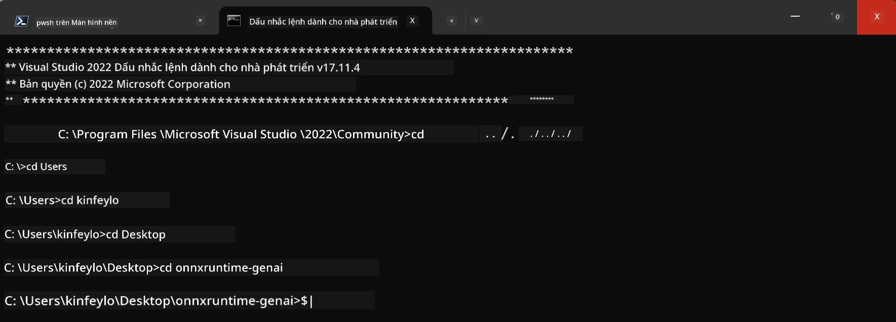

# **Hướng Dẫn cho OnnxRuntime GenAI Windows GPU**

Hướng dẫn này cung cấp các bước để thiết lập và sử dụng ONNX Runtime (ORT) với GPU trên Windows. Nó được thiết kế để giúp bạn tận dụng tăng tốc GPU cho các mô hình của mình, cải thiện hiệu suất và hiệu quả.

Tài liệu cung cấp hướng dẫn về:

- Thiết lập Môi trường: Hướng dẫn cài đặt các phụ thuộc cần thiết như CUDA, cuDNN và ONNX Runtime.
- Cấu hình: Cách cấu hình môi trường và ONNX Runtime để sử dụng tài nguyên GPU hiệu quả.
- Mẹo Tối ưu hóa: Lời khuyên về cách tinh chỉnh các thiết lập GPU của bạn để đạt hiệu suất tối ưu.

### **1. Python 3.10.x /3.11.8**

   ***Lưu ý*** Khuyến nghị sử dụng [miniforge](https://github.com/conda-forge/miniforge/releases/latest/download/Miniforge3-Windows-x86_64.exe) làm môi trường Python của bạn

   ```bash

   conda create -n pydev python==3.11.8

   conda activate pydev

   ```

   ***Nhắc nhở*** Nếu bạn đã cài đặt bất kỳ thư viện python ONNX nào, vui lòng gỡ bỏ nó

### **2. Cài đặt CMake với winget**


   ```bash

   winget install -e --id Kitware.CMake

   ```

### **3. Cài đặt Visual Studio 2022 - Phát triển Desktop với C++**

   ***Lưu ý*** Nếu bạn không muốn biên dịch, có thể bỏ qua bước này




### **4. Cài đặt Driver NVIDIA**

1. **Driver GPU NVIDIA**  [https://www.nvidia.com/en-us/drivers/](https://www.nvidia.com/en-us/drivers/)

2. **NVIDIA CUDA 12.4** [https://developer.nvidia.com/cuda-12-4-0-download-archive](https://developer.nvidia.com/cuda-12-4-0-download-archive)

3. **NVIDIA CUDNN 9.4**  [https://developer.nvidia.com/cudnn-downloads](https://developer.nvidia.com/cudnn-downloads)

***Nhắc nhở*** Vui lòng sử dụng các thiết lập mặc định trong quá trình cài đặt

### **5. Thiết lập Môi trường NVIDIA**

Sao chép các thư mục lib, bin, include của NVIDIA CUDNN 9.4 vào thư mục lib, bin, include của NVIDIA CUDA 12.4

- sao chép các file từ *'C:\Program Files\NVIDIA\CUDNN\v9.4\bin\12.6'* vào  *'C:\Program Files\NVIDIA GPU Computing Toolkit\CUDA\v12.4\bin'*

- sao chép các file từ *'C:\Program Files\NVIDIA\CUDNN\v9.4\include\12.6'* vào  *'C:\Program Files\NVIDIA GPU Computing Toolkit\CUDA\v12.4\include'*

- sao chép các file từ *'C:\Program Files\NVIDIA\CUDNN\v9.4\lib\12.6'* vào  *'C:\Program Files\NVIDIA GPU Computing Toolkit\CUDA\v12.4\lib\x64'*


### **6. Tải Phi-3.5-mini-instruct-onnx**


   ```bash

   winget install -e --id Git.Git

   winget install -e --id GitHub.GitLFS

   git lfs install

   git clone https://huggingface.co/microsoft/Phi-3.5-mini-instruct-onnx

   ```

### **7. Chạy InferencePhi35Instruct.ipynb**

   Mở [Notebook](../../../../code/09.UpdateSamples/Aug/ortgpu-phi35-instruct.ipynb) và thực thi 





### **8. Biên dịch ORT GenAI GPU**


   ***Lưu ý*** 
   
   1. Vui lòng gỡ cài đặt tất cả các thư viện liên quan đến onnx, onnxruntime và onnxruntime-genai trước tiên

   
   ```bash

   pip list 
   
   ```

   Sau đó gỡ tất cả các thư viện onnxruntime i.e. 


   ```bash

   pip uninstall onnxruntime

   pip uninstall onnxruntime-genai

   pip uninstall onnxruntume-genai-cuda
   
   ```

   2. Kiểm tra Hỗ trợ Tiện ích Mở rộng Visual Studio 

   Kiểm tra thư mục C:\Program Files\NVIDIA GPU Computing Toolkit\CUDA\v12.4\extras để đảm bảo có thư mục C:\Program Files\NVIDIA GPU Computing Toolkit\CUDA\v12.4\extras\visual_studio_integration.
   
   Nếu không tìm thấy, kiểm tra các thư mục driver của bộ công cụ Cuda khác và sao chép thư mục visual_studio_integration cùng nội dung vào C:\Program Files\NVIDIA GPU Computing Toolkit\CUDA\v12.4\extras\visual_studio_integration


   - Nếu bạn không muốn biên dịch, có thể bỏ qua bước này


   ```bash

   git clone https://github.com/microsoft/onnxruntime-genai

   ```

   - Tải về [https://github.com/microsoft/onnxruntime/releases/download/v1.19.2/onnxruntime-win-x64-gpu-1.19.2.zip](https://github.com/microsoft/onnxruntime/releases/download/v1.19.2/onnxruntime-win-x64-gpu-1.19.2.zip)

   - Giải nén onnxruntime-win-x64-gpu-1.19.2.zip, và đổi tên thành **ort**, sao chép thư mục ort vào onnxruntime-genai

   - Sử dụng Windows Terminal, vào Developer Command Prompt for VS 2022 và truy cập thư mục onnxruntime-genai 



   - Biên dịch nó với môi trường python của bạn

   
   ```bash

   cd onnxruntime-genai

   python build.py --use_cuda  --cuda_home "C:\Program Files\NVIDIA GPU Computing Toolkit\CUDA\v12.4" --config Release
 

   cd build/Windows/Release/Wheel

   pip install .whl

   ```

---

<!-- CO-OP TRANSLATOR DISCLAIMER START -->
**Tuyên bố miễn trừ trách nhiệm**:
Tài liệu này đã được dịch bằng dịch vụ dịch thuật AI [Co-op Translator](https://github.com/Azure/co-op-translator). Mặc dù chúng tôi cố gắng đảm bảo độ chính xác, xin lưu ý rằng bản dịch tự động có thể chứa lỗi hoặc sai sót. Tài liệu gốc bằng ngôn ngữ gốc nên được coi là nguồn tin chính thức. Đối với thông tin quan trọng, nên sử dụng dịch vụ dịch thuật chuyên nghiệp bởi con người. Chúng tôi không chịu trách nhiệm về bất kỳ hiểu lầm hoặc giải thích sai nào phát sinh từ việc sử dụng bản dịch này.
<!-- CO-OP TRANSLATOR DISCLAIMER END -->