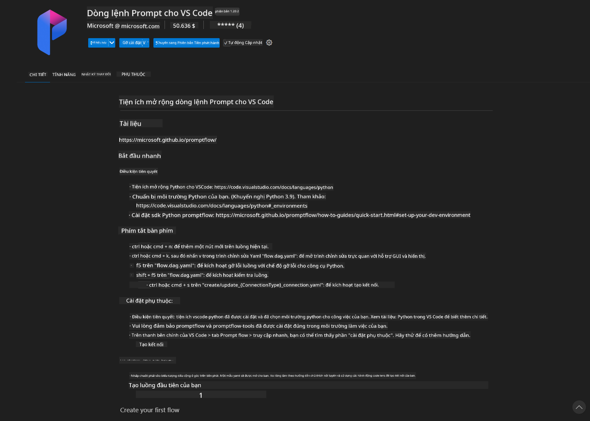
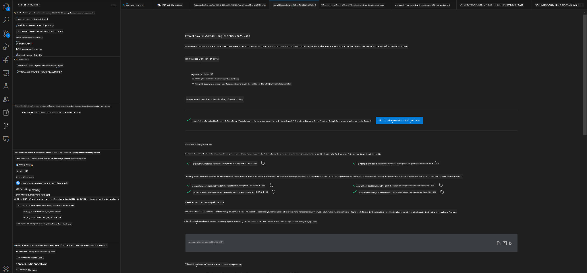
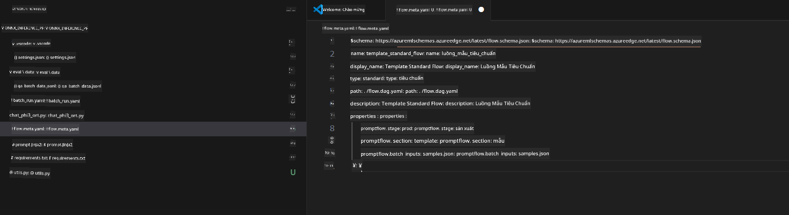
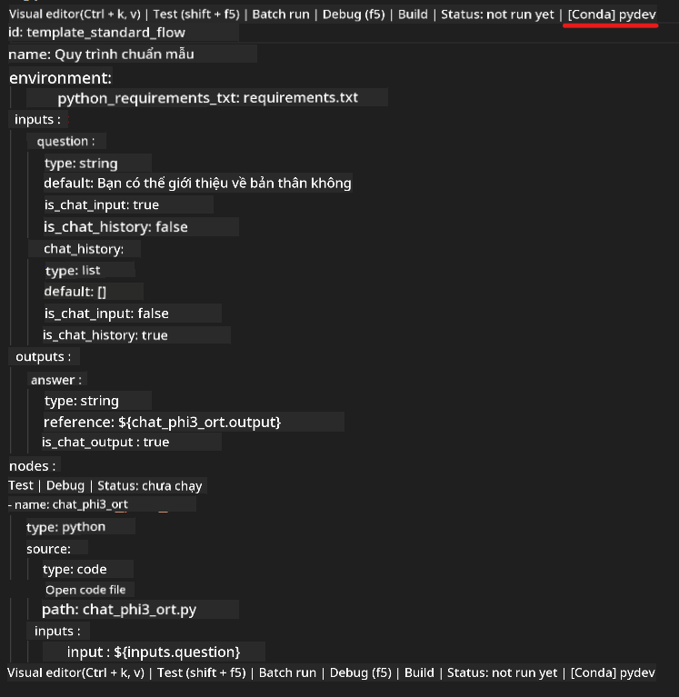
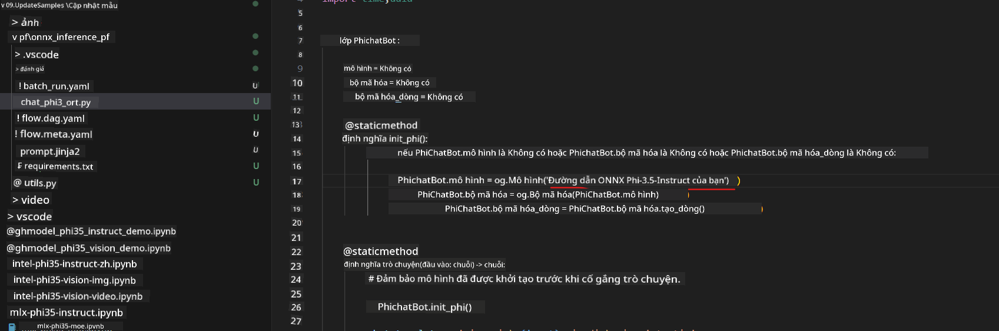
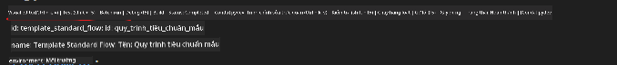
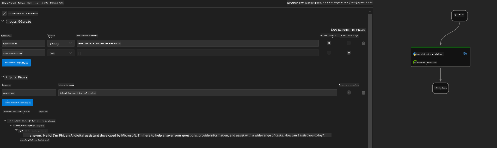
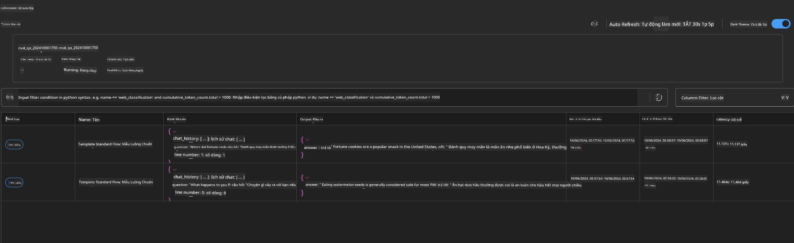

<!--
CO_OP_TRANSLATOR_METADATA:
{
  "original_hash": "92e7dac1e5af0dd7c94170fdaf6860fe",
  "translation_date": "2025-05-09T18:54:02+00:00",
  "source_file": "md/02.Application/01.TextAndChat/Phi3/UsingPromptFlowWithONNX.md",
  "language_code": "vi"
}
-->
# Sử dụng GPU Windows để tạo giải pháp Prompt flow với Phi-3.5-Instruct ONNX

Tài liệu sau là ví dụ về cách sử dụng PromptFlow với ONNX (Open Neural Network Exchange) để phát triển các ứng dụng AI dựa trên các mô hình Phi-3.

PromptFlow là bộ công cụ phát triển được thiết kế để đơn giản hóa quy trình phát triển toàn diện các ứng dụng AI dựa trên LLM (Large Language Model), từ giai đoạn ý tưởng, tạo mẫu đến kiểm thử và đánh giá.

Bằng cách tích hợp PromptFlow với ONNX, các nhà phát triển có thể:

- Tối ưu hiệu năng mô hình: Tận dụng ONNX để suy luận và triển khai mô hình hiệu quả.
- Đơn giản hóa phát triển: Sử dụng PromptFlow để quản lý quy trình làm việc và tự động hóa các tác vụ lặp đi lặp lại.
- Tăng cường hợp tác: Hỗ trợ cộng tác tốt hơn giữa các thành viên trong nhóm bằng cách cung cấp môi trường phát triển thống nhất.

**Prompt flow** là bộ công cụ phát triển được thiết kế để đơn giản hóa quy trình phát triển toàn diện các ứng dụng AI dựa trên LLM, từ ý tưởng, tạo mẫu, kiểm thử, đánh giá đến triển khai và giám sát sản xuất. Nó giúp việc xây dựng prompt trở nên dễ dàng hơn và cho phép bạn tạo các ứng dụng LLM với chất lượng sản xuất.

Prompt flow có thể kết nối với OpenAI, Azure OpenAI Service, và các mô hình tùy chỉnh (Huggingface, LLM/SLM cục bộ). Chúng tôi hy vọng triển khai mô hình ONNX lượng tử hóa Phi-3.5 vào các ứng dụng cục bộ. Prompt flow sẽ giúp chúng ta lên kế hoạch kinh doanh tốt hơn và hoàn thiện các giải pháp cục bộ dựa trên Phi-3.5. Trong ví dụ này, chúng ta sẽ kết hợp thư viện ONNX Runtime GenAI để hoàn thiện giải pháp Prompt flow dựa trên GPU Windows.

## **Cài đặt**

### **ONNX Runtime GenAI cho GPU Windows**

Đọc hướng dẫn này để thiết lập ONNX Runtime GenAI cho GPU Windows [click vào đây](./ORTWindowGPUGuideline.md)

### **Thiết lập Prompt flow trong VSCode**

1. Cài đặt tiện ích mở rộng Prompt flow cho VS Code



2. Sau khi cài tiện ích mở rộng Prompt flow cho VS Code, nhấn vào tiện ích và chọn **Installation dependencies** theo hướng dẫn này để cài Prompt flow SDK trong môi trường của bạn



3. Tải về [Sample Code](../../../../../../code/09.UpdateSamples/Aug/pf/onnx_inference_pf) và mở sample này bằng VS Code



4. Mở **flow.dag.yaml** để chọn môi trường Python của bạn



   Mở **chat_phi3_ort.py** để thay đổi vị trí mô hình Phi-3.5-instruct ONNX của bạn



5. Chạy prompt flow để kiểm thử

Mở **flow.dag.yaml** và nhấn visual editor



Sau khi nhấn, chạy để kiểm thử



1. Bạn có thể chạy batch trong terminal để kiểm tra thêm kết quả


```bash

pf run create --file batch_run.yaml --stream --name 'Your eval qa name'    

```

Bạn có thể xem kết quả trên trình duyệt mặc định của mình




**Tuyên bố từ chối trách nhiệm**:  
Tài liệu này đã được dịch bằng dịch vụ dịch thuật AI [Co-op Translator](https://github.com/Azure/co-op-translator). Mặc dù chúng tôi cố gắng đảm bảo độ chính xác, xin lưu ý rằng các bản dịch tự động có thể chứa lỗi hoặc không chính xác. Tài liệu gốc bằng ngôn ngữ bản địa nên được coi là nguồn thông tin chính xác và đáng tin cậy. Đối với các thông tin quan trọng, nên sử dụng dịch vụ dịch thuật chuyên nghiệp do con người thực hiện. Chúng tôi không chịu trách nhiệm đối với bất kỳ sự hiểu lầm hoặc giải thích sai nào phát sinh từ việc sử dụng bản dịch này.