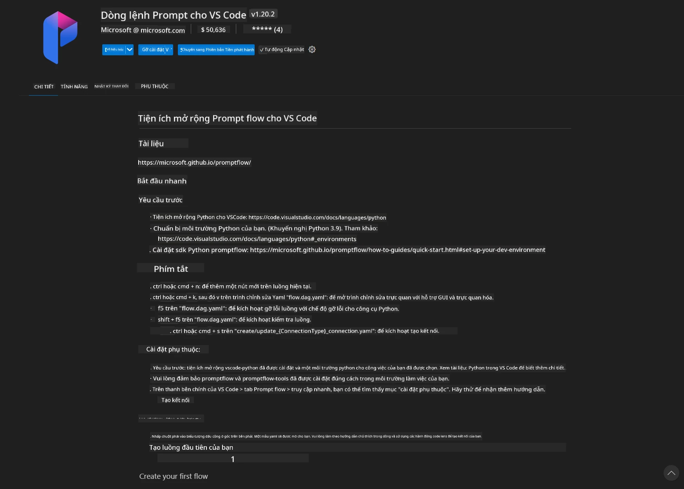
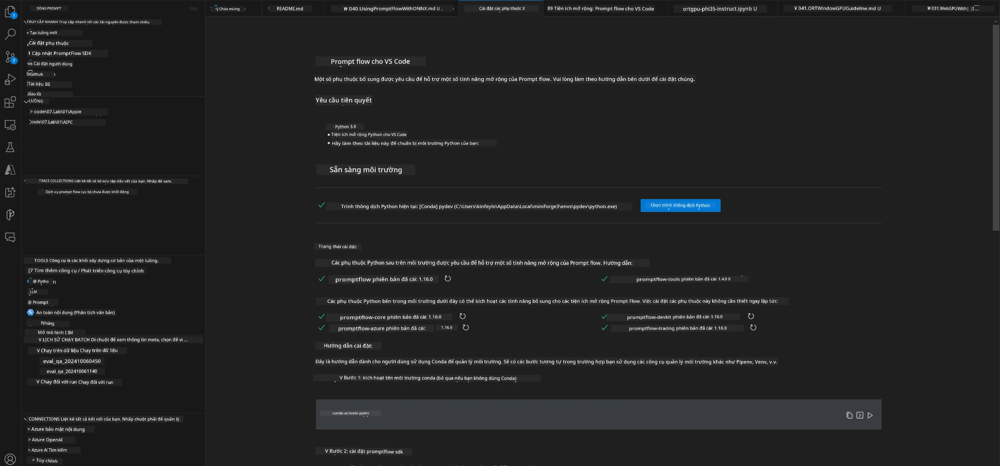
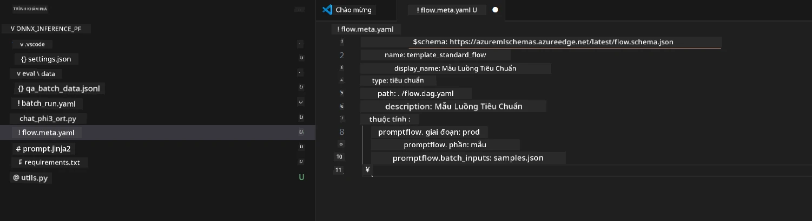
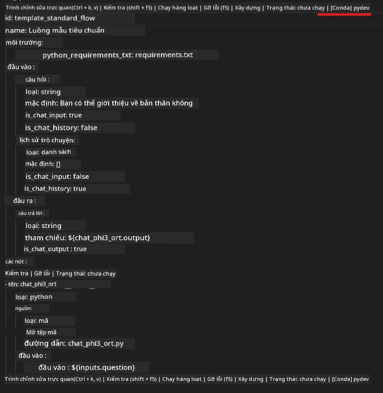
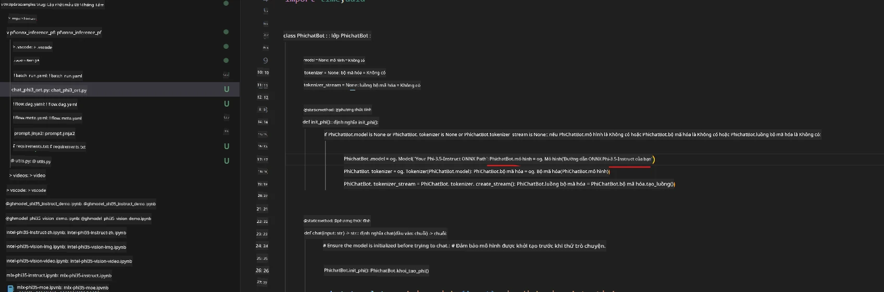
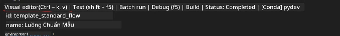
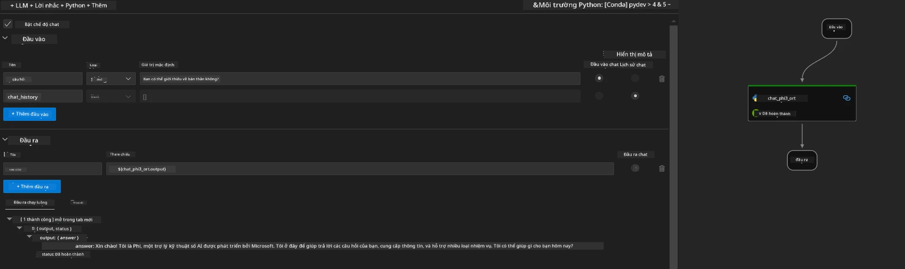
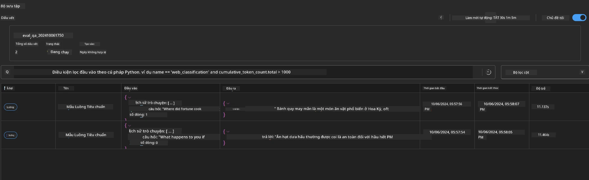

# Sử dụng GPU Windows để tạo giải pháp Prompt flow với Phi-3.5-Instruct ONNX 

Tài liệu dưới đây là ví dụ về cách sử dụng PromptFlow với ONNX (Open Neural Network Exchange) để phát triển ứng dụng AI dựa trên các mô hình Phi-3.

PromptFlow là bộ công cụ phát triển được thiết kế để tối ưu hóa chu trình phát triển ứng dụng AI dựa trên LLM (Large Language Model), từ suy nghĩ ý tưởng, tạo mẫu đến thử nghiệm và đánh giá.

Bằng cách tích hợp PromptFlow với ONNX, các nhà phát triển có thể:

- Tối ưu hóa hiệu suất mô hình: Tận dụng ONNX để suy diễn và triển khai mô hình hiệu quả.
- Đơn giản hóa phát triển: Sử dụng PromptFlow để quản lý quy trình làm việc và tự động hóa các tác vụ lặp đi lặp lại.
- Tăng cường hợp tác: Tạo điều kiện thuận lợi cho sự hợp tác tốt hơn giữa các thành viên trong nhóm bằng cách cung cấp môi trường phát triển thống nhất.

**Prompt flow** là bộ công cụ phát triển được thiết kế để tối ưu hóa chu trình phát triển end-to-end của các ứng dụng AI dựa trên LLM, từ ý tưởng, tạo mẫu, thử nghiệm, đánh giá đến triển khai sản xuất và giám sát. Nó giúp kỹ thuật prompt trở nên dễ dàng hơn và cho phép bạn xây dựng các ứng dụng LLM với chất lượng sản xuất.

Prompt flow có thể kết nối với OpenAI, Azure OpenAI Service và các mô hình tùy chỉnh (Huggingface, LLM/SLM cục bộ). Chúng tôi hy vọng triển khai mô hình ONNX lượng tử của Phi-3.5 vào các ứng dụng cục bộ. Prompt flow có thể giúp chúng tôi lập kế hoạch kinh doanh tốt hơn và hoàn thành các giải pháp cục bộ dựa trên Phi-3.5. Trong ví dụ này, chúng tôi sẽ kết hợp Thư viện ONNX Runtime GenAI để hoàn thành giải pháp Prompt flow dựa trên GPU Windows.

## **Cài đặt**

### **ONNX Runtime GenAI cho Windows GPU**

Đọc hướng dẫn này để thiết lập ONNX Runtime GenAI cho Windows GPU [click here](./ORTWindowGPUGuideline.md)

### **Cài đặt Prompt flow trong VSCode**

1. Cài đặt Extension Prompt flow trên VS Code



2. Sau khi cài đặt Extension Prompt flow, nhấn vào extension, chọn **Installation dependencies** và làm theo hướng dẫn để cài đặt Prompt flow SDK trong môi trường của bạn



3. Tải [Mã mẫu](../../../../../../code/09.UpdateSamples/Aug/pf/onnx_inference_pf) và mở mẫu này bằng VS Code



4. Mở **flow.dag.yaml** để chọn môi trường Python của bạn



   Mở **chat_phi3_ort.py** để thay đổi vị trí mô hình ONNX Phi-3.5-instruct của bạn



5. Chạy prompt flow của bạn để thử nghiệm

Mở **flow.dag.yaml** và nhấn vào trình chỉnh sửa trực quan



sau khi nhấn vào đây, chạy nó để kiểm tra



1. Bạn có thể chạy batch trong terminal để kiểm tra thêm kết quả


```bash

pf run create --file batch_run.yaml --stream --name 'Your eval qa name'    

```

Bạn có thể xem kết quả trên trình duyệt mặc định của bạn




---

<!-- CO-OP TRANSLATOR DISCLAIMER START -->
**Tuyên bố miễn trừ trách nhiệm**:
Tài liệu này đã được dịch bằng dịch vụ dịch thuật AI [Co-op Translator](https://github.com/Azure/co-op-translator). Mặc dù chúng tôi cố gắng đảm bảo độ chính xác, xin lưu ý rằng bản dịch tự động có thể chứa lỗi hoặc sai sót. Tài liệu gốc bằng ngôn ngữ gốc nên được coi là nguồn tin chính thức. Đối với thông tin quan trọng, nên sử dụng dịch vụ dịch thuật chuyên nghiệp bởi con người. Chúng tôi không chịu trách nhiệm về bất kỳ hiểu lầm hoặc giải thích sai nào phát sinh từ việc sử dụng bản dịch này.
<!-- CO-OP TRANSLATOR DISCLAIMER END -->