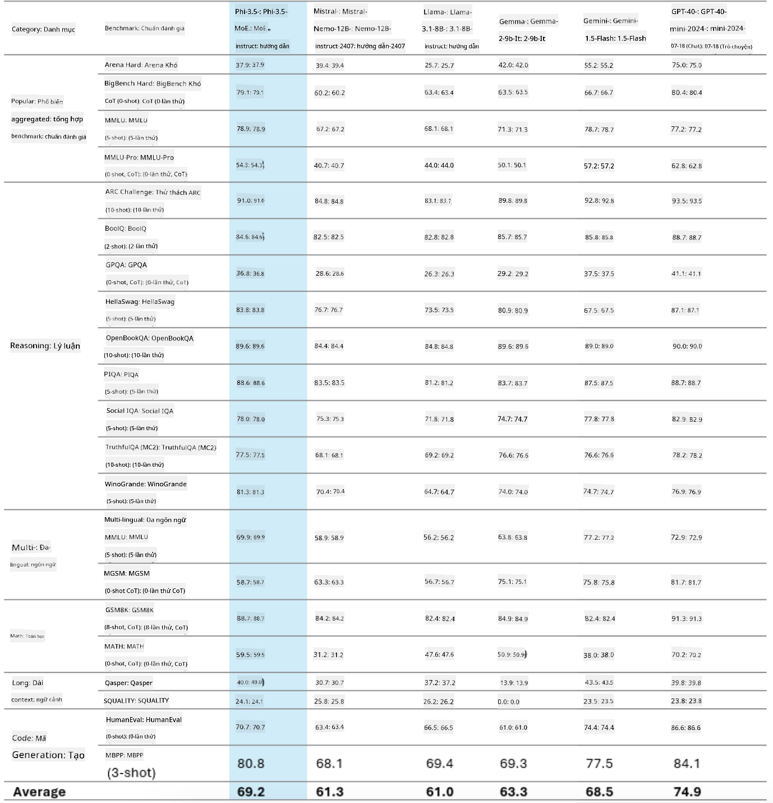
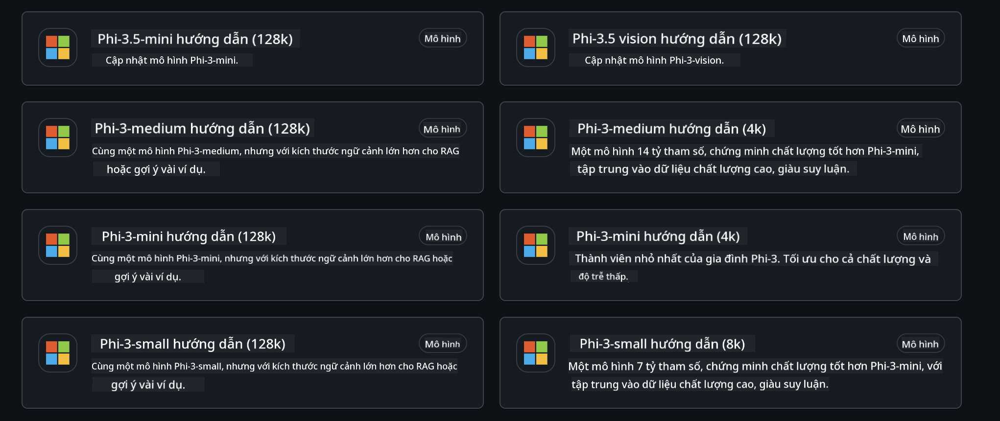
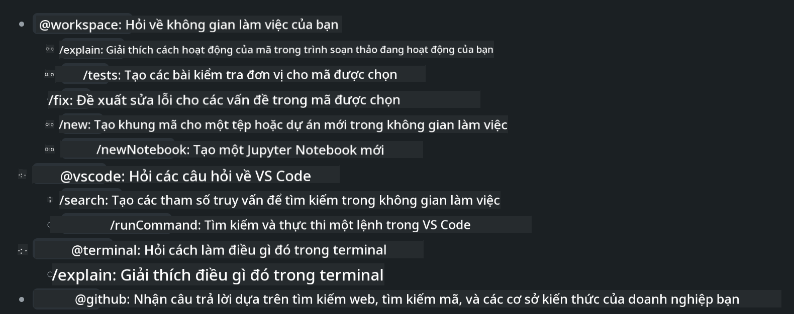
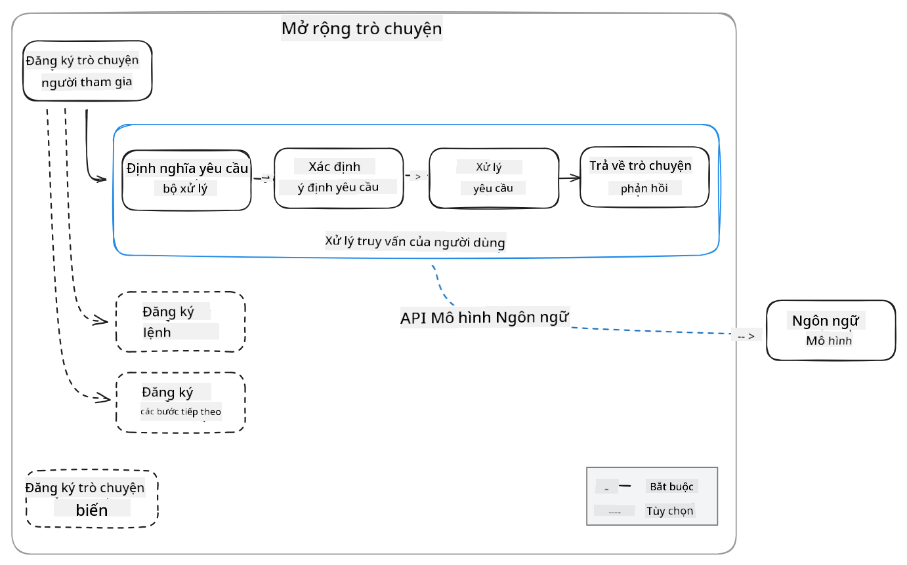
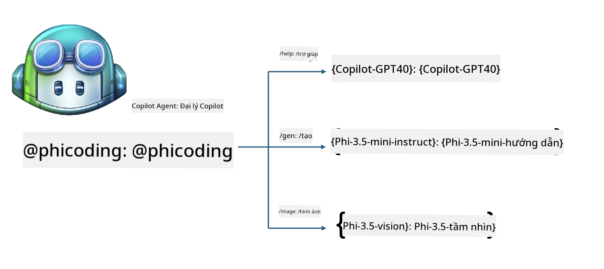
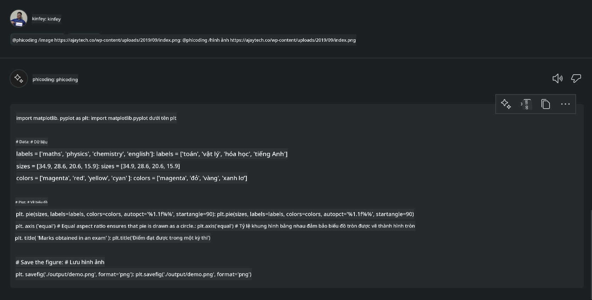

<!--
CO_OP_TRANSLATOR_METADATA:
{
  "original_hash": "35bf81388ac6917277b8d9a0c39bdc70",
  "translation_date": "2025-07-17T03:28:12+00:00",
  "source_file": "md/02.Application/02.Code/Phi3/CreateVSCodeChatAgentWithGitHubModels.md",
  "language_code": "vi"
}
-->
# **Tạo Agent Visual Studio Code Chat Copilot của riêng bạn với Phi-3.5 từ GitHub Models**

Bạn có đang sử dụng Visual Studio Code Copilot không? Đặc biệt trong Chat, bạn có thể sử dụng các agent khác nhau để nâng cao khả năng tạo, viết và duy trì dự án trong Visual Studio Code. Visual Studio Code cung cấp một API cho phép các công ty và cá nhân tạo ra các agent khác nhau dựa trên lĩnh vực kinh doanh của họ để mở rộng khả năng trong các lĩnh vực chuyên biệt. Trong bài viết này, chúng ta sẽ tập trung vào **Phi-3.5-mini-instruct (128k)** và **Phi-3.5-vision-instruct (128k)** của GitHub Models để tạo Agent Visual Studio Code của riêng bạn.

## **Về Phi-3.5 trên GitHub Models**

Chúng ta biết rằng Phi-3/3.5-mini-instruct trong gia đình Phi-3/3.5 có khả năng hiểu và sinh mã mạnh mẽ, và có ưu thế hơn so với Gemma-2-9b và Mistral-Nemo-12B-instruct-2407.



GitHub Models mới nhất đã cung cấp quyền truy cập vào các mô hình Phi-3.5-mini-instruct (128k) và Phi-3.5-vision-instruct (128k). Các nhà phát triển có thể truy cập chúng thông qua OpenAI SDK, Azure AI Inference SDK và REST API.



***Lưu ý:*** Khuyến nghị sử dụng Azure AI Inference SDK ở đây, vì nó có thể chuyển đổi tốt hơn với Azure Model Catalog trong môi trường sản xuất.

Dưới đây là kết quả của **Phi-3.5-mini-instruct (128k)** và **Phi-3.5-vision-instruct (128k)** trong kịch bản sinh mã sau khi tích hợp với GitHub Models, đồng thời chuẩn bị cho các ví dụ tiếp theo.

**Demo: GitHub Models Phi-3.5-mini-instruct (128k) sinh mã từ Prompt** ([nhấn vào đây](../../../../../../code/09.UpdateSamples/Aug/ghmodel_phi35_instruct_demo.ipynb))

**Demo: GitHub Models Phi-3.5-vision-instruct (128k) sinh mã từ Hình ảnh** ([nhấn vào đây](../../../../../../code/09.UpdateSamples/Aug/ghmodel_phi35_vision_demo.ipynb))


## **Về GitHub Copilot Chat Agent**

GitHub Copilot Chat Agent có thể hoàn thành các nhiệm vụ khác nhau trong các kịch bản dự án dựa trên mã nguồn. Hệ thống có bốn agent: workspace, github, terminal, vscode



Bằng cách thêm tên agent với ký hiệu ‘@’, bạn có thể nhanh chóng hoàn thành công việc tương ứng. Đối với doanh nghiệp, nếu bạn thêm các nội dung liên quan đến nghiệp vụ như yêu cầu, mã hóa, tiêu chuẩn kiểm thử và phát hành, bạn có thể có các chức năng riêng tư doanh nghiệp mạnh mẽ hơn dựa trên GitHub Copilot.

Visual Studio Code Chat Agent hiện đã chính thức phát hành API, cho phép doanh nghiệp hoặc nhà phát triển doanh nghiệp phát triển agent dựa trên các hệ sinh thái phần mềm kinh doanh khác nhau. Dựa trên phương pháp phát triển Visual Studio Code Extension Development, bạn có thể dễ dàng truy cập giao diện API của Visual Studio Code Chat Agent. Chúng ta có thể phát triển dựa trên quy trình này.



Kịch bản phát triển có thể hỗ trợ truy cập API mô hình bên thứ ba (như GitHub Models, Azure Model Catalog, và dịch vụ tự xây dựng dựa trên các mô hình mã nguồn mở) và cũng có thể sử dụng các mô hình gpt-35-turbo, gpt-4, và gpt-4o do GitHub Copilot cung cấp.

## **Thêm một Agent @phicoding dựa trên Phi-3.5**

Chúng tôi thử tích hợp khả năng lập trình của Phi-3.5 để hoàn thành việc viết mã, sinh mã từ hình ảnh và các nhiệm vụ khác. Hoàn thiện một Agent xây dựng xung quanh Phi-3.5 - @PHI, dưới đây là một số chức năng:

1. Sinh phần giới thiệu bản thân dựa trên GPT-4o do GitHub Copilot cung cấp thông qua lệnh **@phicoding /help**

2. Sinh mã cho các ngôn ngữ lập trình khác nhau dựa trên **Phi-3.5-mini-instruct (128k)** thông qua lệnh **@phicoding /gen**

3. Sinh mã dựa trên **Phi-3.5-vision-instruct (128k)** và hoàn thiện hình ảnh thông qua lệnh **@phicoding /image**



## **Các bước liên quan**

1. Cài đặt hỗ trợ phát triển Visual Studio Code Extension bằng npm

```bash

npm install --global yo generator-code 

```
2. Tạo một plugin Visual Studio Code Extension (sử dụng chế độ phát triển Typescript, đặt tên phiext)

```bash

yo code 

```

3. Mở dự án đã tạo và chỉnh sửa package.json. Đây là các hướng dẫn và cấu hình liên quan, cũng như cấu hình GitHub Models. Lưu ý bạn cần thêm token GitHub Models của mình vào đây.

```json

{
  "name": "phiext",
  "displayName": "phiext",
  "description": "",
  "version": "0.0.1",
  "engines": {
    "vscode": "^1.93.0"
  },
  "categories": [
    "AI",
    "Chat"
  ],
  "activationEvents": [],
  "enabledApiProposals": [
      "chatVariableResolver"
  ],
  "main": "./dist/extension.js",
  "contributes": {
    "chatParticipants": [
        {
            "id": "chat.phicoding",
            "name": "phicoding",
            "description": "Hey! I am Microsoft Phi-3.5, She can help me with coding problems, such as generation code with your natural language, or even generation code about chart from images. Just ask me anything!",
            "isSticky": true,
            "commands": [
                {
                    "name": "help",
                    "description": "Introduce myself to you"
                },
                {
                    "name": "gen",
                    "description": "Generate code for you with Microsoft Phi-3.5-mini-instruct"
                },
                {
                    "name": "image",
                    "description": "Generate code for chart from image(png or jpg) with Microsoft Phi-3.5-vision-instruct, please add image url like this : https://ajaytech.co/wp-content/uploads/2019/09/index.png"
                }
            ]
        }
    ],
    "commands": [
        {
            "command": "phicoding.namesInEditor",
            "title": "Use Microsoft Phi 3.5 in Editor"
        }
    ],
    "configuration": {
      "type": "object",
      "title": "githubmodels",
      "properties": {
        "githubmodels.endpoint": {
          "type": "string",
          "default": "https://models.inference.ai.azure.com",
          "description": "Your GitHub Models Endpoint",
          "order": 0
        },
        "githubmodels.api_key": {
          "type": "string",
          "default": "Your GitHub Models Token",
          "description": "Your GitHub Models Token",
          "order": 1
        },
        "githubmodels.phi35instruct": {
          "type": "string",
          "default": "Phi-3.5-mini-instruct",
          "description": "Your Phi-35-Instruct Model",
          "order": 2
        },
        "githubmodels.phi35vision": {
          "type": "string",
          "default": "Phi-3.5-vision-instruct",
          "description": "Your Phi-35-Vision Model",
          "order": 3
        }
      }
    }
  },
  "scripts": {
    "vscode:prepublish": "npm run package",
    "compile": "webpack",
    "watch": "webpack --watch",
    "package": "webpack --mode production --devtool hidden-source-map",
    "compile-tests": "tsc -p . --outDir out",
    "watch-tests": "tsc -p . -w --outDir out",
    "pretest": "npm run compile-tests && npm run compile && npm run lint",
    "lint": "eslint src",
    "test": "vscode-test"
  },
  "devDependencies": {
    "@types/vscode": "^1.93.0",
    "@types/mocha": "^10.0.7",
    "@types/node": "20.x",
    "@typescript-eslint/eslint-plugin": "^8.3.0",
    "@typescript-eslint/parser": "^8.3.0",
    "eslint": "^9.9.1",
    "typescript": "^5.5.4",
    "ts-loader": "^9.5.1",
    "webpack": "^5.94.0",
    "webpack-cli": "^5.1.4",
    "@vscode/test-cli": "^0.0.10",
    "@vscode/test-electron": "^2.4.1"
  },
  "dependencies": {
    "@types/node-fetch": "^2.6.11",
    "node-fetch": "^3.3.2",
    "@azure-rest/ai-inference": "latest",
    "@azure/core-auth": "latest",
    "@azure/core-sse": "latest"
  }
}


```

4. Chỉnh sửa src/extension.ts

```typescript

// The module 'vscode' contains the VS Code extensibility API
// Import the module and reference it with the alias vscode in your code below
import * as vscode from 'vscode';
import ModelClient from "@azure-rest/ai-inference";
import { AzureKeyCredential } from "@azure/core-auth";


interface IPhiChatResult extends vscode.ChatResult {
    metadata: {
        command: string;
    };
}


const MODEL_SELECTOR: vscode.LanguageModelChatSelector = { vendor: 'copilot', family: 'gpt-4o' };

function isValidImageUrl(url: string): boolean {
    const regex = /^(https?:\/\/.*\.(?:png|jpg))$/i;
    return regex.test(url);
}
  

// This method is called when your extension is activated
// Your extension is activated the very first time the command is executed
export function activate(context: vscode.ExtensionContext) {

    const codinghandler: vscode.ChatRequestHandler = async (request: vscode.ChatRequest, context: vscode.ChatContext, stream: vscode.ChatResponseStream, token: vscode.CancellationToken): Promise<IPhiChatResult> => {


        const config : any = vscode.workspace.getConfiguration('githubmodels');
        const endPoint: string = config.get('endpoint');
        const apiKey: string = config.get('api_key');
        const phi35instruct: string = config.get('phi35instruct');
        const phi35vision: string = config.get('phi35vision');
        
        if (request.command === 'help') {

            const content = "Welcome to Coding assistant with Microsoft Phi-3.5"; 
            stream.progress(content);


            try {
                const [model] = await vscode.lm.selectChatModels(MODEL_SELECTOR);
                if (model) {
                    const messages = [
                        vscode.LanguageModelChatMessage.User("Please help me express this content in a humorous way: I am a programming assistant who can help you convert natural language into code and generate code based on the charts in the images. output format like this : Hey I am Phi ......")
                    ];
                    const chatResponse = await model.sendRequest(messages, {}, token);
                    for await (const fragment of chatResponse.text) {
                        stream.markdown(fragment);
                    }
                }
            } catch(err) {
                console.log(err);
            }


            return { metadata: { command: 'help' } };

        }

        
        if (request.command === 'gen') {

            const content = "Welcome to use phi-3.5 to generate code";

            stream.progress(content);

            const client = new ModelClient(endPoint, new AzureKeyCredential(apiKey));

            const response = await client.path("/chat/completions").post({
              body: {
                messages: [
                  { role:"system", content: "You are a coding assistant.Help answer all code generation questions." },
                  { role:"user", content: request.prompt }
                ],
                model: phi35instruct,
                temperature: 0.4,
                max_tokens: 1000,
                top_p: 1.
              }
            });

            stream.markdown(response.body.choices[0].message.content);

            return { metadata: { command: 'gen' } };

        }


        
        if (request.command === 'image') {


            const content = "Welcome to use phi-3.5 to generate code from image(png or jpg),image url like this:https://ajaytech.co/wp-content/uploads/2019/09/index.png";

            stream.progress(content);

            if (!isValidImageUrl(request.prompt)) {
                stream.markdown('Please provide a valid image URL');
                return { metadata: { command: 'image' } };
            }
            else
            {

                const client = new ModelClient(endPoint, new AzureKeyCredential(apiKey));
    
                const response = await client.path("/chat/completions").post({
                    body: {
                      messages: [
                        { role: "system", content: "You are a helpful assistant that describes images in details." },
                        { role: "user", content: [
                            { type: "text", text: "Please generate code according to the chart in the picture according to the following requirements\n1. Keep all information in the chart, including data and text\n2. Do not generate additional information that is not included in the chart\n3. Please extract data from the picture, do not generate it from csv\n4. Please save the regenerated chart as a chart and save it to ./output/demo.png"},
                            { type: "image_url", image_url: {url: request.prompt}
                            }
                          ]
                        }
                      ],
                      model: phi35vision,
                      temperature: 0.4,
                      max_tokens: 2048,
                      top_p: 1.
                    }
                  });
    
                
                stream.markdown(response.body.choices[0].message.content);
    
                return { metadata: { command: 'image' } };
            }


        }


        return { metadata: { command: '' } };
    };


    const phi_ext = vscode.chat.createChatParticipant("chat.phicoding", codinghandler);

    phi_ext.iconPath = new vscode.ThemeIcon('sparkle');


    phi_ext.followupProvider = {
        provideFollowups(result: IPhiChatResult, context: vscode.ChatContext, token: vscode.CancellationToken) {
            return [{
                prompt: 'Let us coding with Phi-3.5 😋😋😋😋',
                label: vscode.l10n.t('Enjoy coding with Phi-3.5'),
                command: 'help'
            } satisfies vscode.ChatFollowup];
        }
    };

    context.subscriptions.push(phi_ext);
}

// This method is called when your extension is deactivated
export function deactivate() {}


```

6. Chạy thử

***/help***


***@phicoding /help***


***@phicoding /gen***


***@phicoding /image***



Bạn có thể tải mã mẫu tại đây: [nhấn vào đây](../../../../../../code/09.UpdateSamples/Aug/vscode)

## **Tài nguyên**

1. Đăng ký GitHub Models [https://gh.io/models](https://gh.io/models)

2. Tìm hiểu phát triển Visual Studio Code Extension [https://code.visualstudio.com/api/get-started/your-first-extension](https://code.visualstudio.com/api/get-started/your-first-extension)

3. Tìm hiểu về Visual Studio Code Copilot Chat API [https://code.visualstudio.com/api/extension-guides/chat](https://code.visualstudio.com/api/extension-guides/chat)

**Tuyên bố từ chối trách nhiệm**:  
Tài liệu này đã được dịch bằng dịch vụ dịch thuật AI [Co-op Translator](https://github.com/Azure/co-op-translator). Mặc dù chúng tôi cố gắng đảm bảo độ chính xác, xin lưu ý rằng các bản dịch tự động có thể chứa lỗi hoặc không chính xác. Tài liệu gốc bằng ngôn ngữ gốc của nó nên được coi là nguồn chính xác và đáng tin cậy. Đối với các thông tin quan trọng, nên sử dụng dịch vụ dịch thuật chuyên nghiệp do con người thực hiện. Chúng tôi không chịu trách nhiệm về bất kỳ sự hiểu lầm hoặc giải thích sai nào phát sinh từ việc sử dụng bản dịch này.