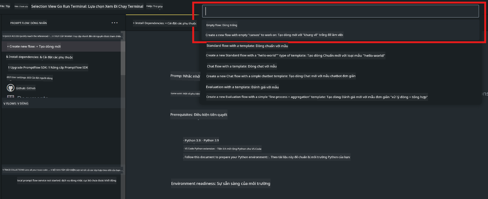
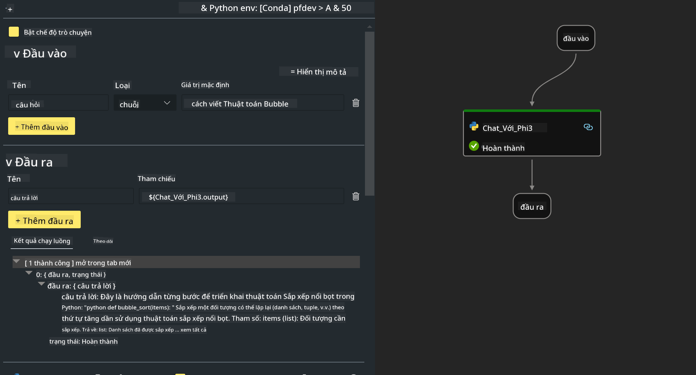

<!--
CO_OP_TRANSLATOR_METADATA:
{
  "original_hash": "bc29f7fe7fc16bed6932733eac8c81b8",
  "translation_date": "2025-05-09T19:24:58+00:00",
  "source_file": "md/02.Application/02.Code/Phi3/VSCodeExt/HOL/AIPC/02.PromptflowWithNPU.md",
  "language_code": "vi"
}
-->
# **Bài Lab 2 - Chạy Prompt flow với Phi-3-mini trên AIPC**

## **Prompt flow là gì**

Prompt flow là bộ công cụ phát triển được thiết kế để đơn giản hóa toàn bộ chu trình phát triển ứng dụng AI dựa trên LLM, từ ý tưởng, tạo mẫu, kiểm thử, đánh giá đến triển khai và giám sát sản xuất. Nó giúp việc thiết kế prompt trở nên dễ dàng hơn và cho phép bạn xây dựng ứng dụng LLM đạt chất lượng sản xuất.

Với prompt flow, bạn có thể:

- Tạo các luồng kết nối LLM, prompt, mã Python và các công cụ khác thành một quy trình làm việc có thể thực thi.

- Gỡ lỗi và lặp lại các luồng, đặc biệt là tương tác với LLM một cách dễ dàng.

- Đánh giá các luồng, tính toán các chỉ số chất lượng và hiệu suất với bộ dữ liệu lớn hơn.

- Tích hợp việc kiểm thử và đánh giá vào hệ thống CI/CD để đảm bảo chất lượng luồng của bạn.

- Triển khai các luồng lên nền tảng phục vụ bạn chọn hoặc tích hợp dễ dàng vào mã nguồn ứng dụng.

- (Tùy chọn nhưng rất khuyến khích) Hợp tác với nhóm bằng cách tận dụng phiên bản đám mây của Prompt flow trên Azure AI.

## **AIPC là gì**

AI PC có CPU, GPU và NPU, mỗi thành phần có khả năng tăng tốc AI riêng biệt. NPU, hay neural processing unit, là bộ tăng tốc chuyên dụng xử lý các tác vụ trí tuệ nhân tạo (AI) và học máy (ML) ngay trên máy tính của bạn thay vì gửi dữ liệu lên đám mây để xử lý. GPU và CPU cũng có thể xử lý các tác vụ này, nhưng NPU đặc biệt hiệu quả với các phép tính AI tiêu thụ điện năng thấp. AI PC đại diện cho sự thay đổi căn bản trong cách máy tính hoạt động. Đây không phải là giải pháp cho một vấn đề chưa từng tồn tại trước đây, mà là cải tiến lớn cho các tác vụ sử dụng máy tính hàng ngày.

Vậy nó hoạt động thế nào? So với AI tạo sinh và các mô hình ngôn ngữ lớn (LLM) được huấn luyện trên lượng lớn dữ liệu công khai, AI diễn ra trên máy tính cá nhân của bạn dễ tiếp cận hơn ở hầu hết mọi cấp độ. Khái niệm này dễ hiểu hơn, và vì nó được huấn luyện trên dữ liệu của bạn, không cần truy cập đám mây, nên lợi ích mang lại hấp dẫn và thiết thực hơn với nhiều người dùng.

Trong tương lai gần, thế giới AI PC sẽ bao gồm trợ lý cá nhân và các mô hình AI nhỏ chạy trực tiếp trên máy tính của bạn, sử dụng dữ liệu của bạn để cung cấp các nâng cấp AI cá nhân, riêng tư và bảo mật hơn cho những việc bạn làm hàng ngày – ghi chép cuộc họp, tổ chức giải bóng đá giả tưởng, tự động cải tiến chỉnh sửa ảnh và video, hoặc lên kế hoạch chuyến đi hoàn hảo cho cuộc họp mặt gia đình dựa trên thời gian đến và đi của mọi người.

## **Xây dựng các luồng tạo mã trên AIPC**

***Note*** ：Nếu bạn chưa hoàn thành cài đặt môi trường, vui lòng truy cập [Lab 0 -Installations](./01.Installations.md)

1. Mở Prompt flow Extension trong Visual Studio Code và tạo một dự án flow trống



2. Thêm các tham số Inputs và Outputs và thêm mã Python làm flow mới



Bạn có thể tham khảo cấu trúc này (flow.dag.yaml) để xây dựng flow của mình

```yaml

inputs:
  question:
    type: string
    default: how to write Bubble Algorithm
outputs:
  answer:
    type: string
    reference: ${Chat_With_Phi3.output}
nodes:
- name: Chat_With_Phi3
  type: python
  source:
    type: code
    path: Chat_With_Phi3.py
  inputs:
    question: ${inputs.question}


```

3. Thêm mã vào ***Chat_With_Phi3.py***

```python


from promptflow.core import tool

# import torch
from transformers import AutoTokenizer, pipeline,TextStreamer
import intel_npu_acceleration_library as npu_lib

import warnings

import asyncio
import platform

class Phi3CodeAgent:
    
    model = None
    tokenizer = None
    text_streamer = None
    
    model_id = "microsoft/Phi-3-mini-4k-instruct"

    @staticmethod
    def init_phi3():
        
        if Phi3CodeAgent.model is None or Phi3CodeAgent.tokenizer is None or Phi3CodeAgent.text_streamer is None:
            Phi3CodeAgent.model = npu_lib.NPUModelForCausalLM.from_pretrained(
                                    Phi3CodeAgent.model_id,
                                    torch_dtype="auto",
                                    dtype=npu_lib.int4,
                                    trust_remote_code=True
                                )
            Phi3CodeAgent.tokenizer = AutoTokenizer.from_pretrained(Phi3CodeAgent.model_id)
            Phi3CodeAgent.text_streamer = TextStreamer(Phi3CodeAgent.tokenizer, skip_prompt=True)

    

    @staticmethod
    def chat_with_phi3(prompt):
        
        Phi3CodeAgent.init_phi3()

        messages = "<|system|>You are a AI Python coding assistant. Please help me to generate code in Python.The answer only genertated Python code, but any comments and instructions do not need to be generated<|end|><|user|>" + prompt +"<|end|><|assistant|>"


        generation_args = {
            "max_new_tokens": 1024,
            "return_full_text": False,
            "temperature": 0.3,
            "do_sample": False,
            "streamer": Phi3CodeAgent.text_streamer,
        }

        pipe = pipeline(
            "text-generation",
            model=Phi3CodeAgent.model,
            tokenizer=Phi3CodeAgent.tokenizer,
            # **generation_args
        )

        result = ''

        with warnings.catch_warnings():
            warnings.simplefilter("ignore")
            response = pipe(messages, **generation_args)
            result =response[0]['generated_text']
            return result


@tool
def my_python_tool(question: str) -> str:
    if platform.system() == 'Windows':
        asyncio.set_event_loop_policy(asyncio.WindowsSelectorEventLoopPolicy())
    return Phi3CodeAgent.chat_with_phi3(question)


```

4. Bạn có thể thử chạy flow từ Debug hoặc Run để kiểm tra mã tạo có hoạt động không


5. Chạy flow dưới dạng API phát triển trong terminal

```

pf flow serve --source ./ --port 8080 --host localhost   

```

Bạn có thể thử nghiệm trong Postman / Thunder Client

### **Note**

1. Lần chạy đầu tiên sẽ mất nhiều thời gian. Khuyến nghị tải mô hình phi-3 từ Hugging face CLI.

2. Do hạn chế về sức mạnh tính toán của Intel NPU, nên sử dụng Phi-3-mini-4k-instruct.

3. Chúng tôi sử dụng Intel NPU Acceleration để lượng tử hóa chuyển đổi INT4, nhưng nếu bạn chạy lại dịch vụ, cần xóa các thư mục cache và nc_workshop.

## **Tài nguyên**

1. Tìm hiểu Promptflow [https://microsoft.github.io/promptflow/](https://microsoft.github.io/promptflow/)

2. Tìm hiểu Intel NPU Acceleration [https://github.com/intel/intel-npu-acceleration-library](https://github.com/intel/intel-npu-acceleration-library)

3. Mã mẫu, tải về [Local NPU Agent Sample Code](../../../../../../../../../code/07.Lab/01/AIPC)

**Tuyên bố miễn trừ trách nhiệm**:  
Tài liệu này đã được dịch bằng dịch vụ dịch thuật AI [Co-op Translator](https://github.com/Azure/co-op-translator). Mặc dù chúng tôi cố gắng đảm bảo độ chính xác, xin lưu ý rằng các bản dịch tự động có thể chứa lỗi hoặc không chính xác. Tài liệu gốc bằng ngôn ngữ gốc nên được coi là nguồn chính thức. Đối với thông tin quan trọng, nên sử dụng dịch vụ dịch thuật chuyên nghiệp do con người thực hiện. Chúng tôi không chịu trách nhiệm về bất kỳ sự hiểu lầm hoặc giải thích sai nào phát sinh từ việc sử dụng bản dịch này.