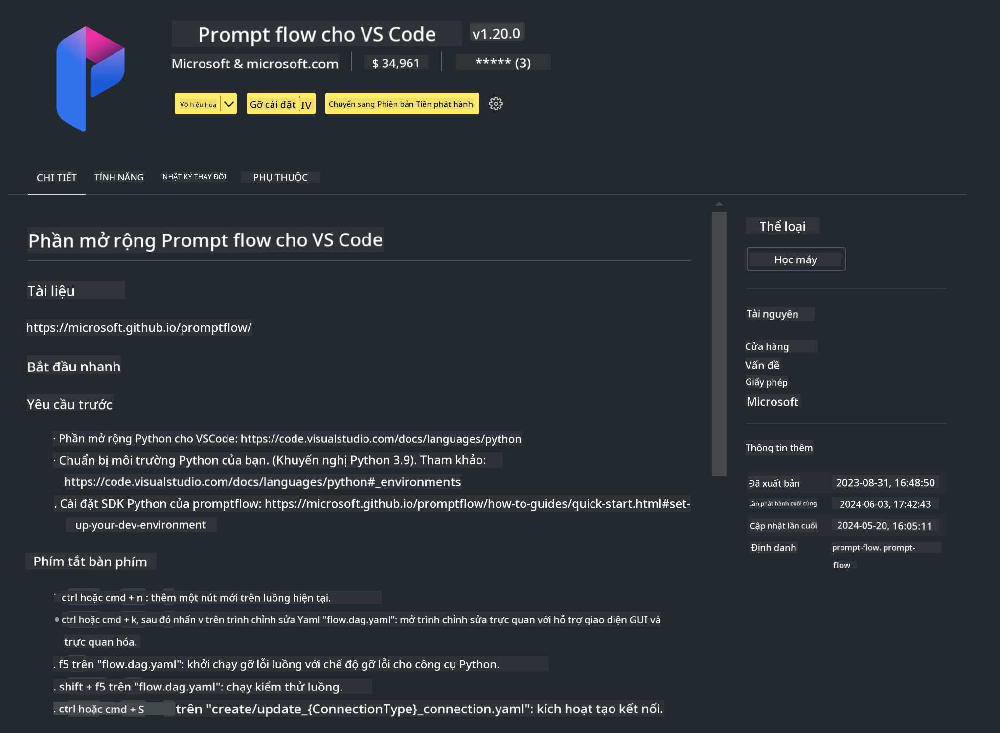

<!--
CO_OP_TRANSLATOR_METADATA:
{
  "original_hash": "4b16264917d9b93169745d92b8ce8c65",
  "translation_date": "2025-05-09T19:36:19+00:00",
  "source_file": "md/02.Application/02.Code/Phi3/VSCodeExt/HOL/Apple/01.Installations.md",
  "language_code": "vi"
}
-->
# **Bài Lab 0 - Cài đặt**

Khi vào Lab, chúng ta cần cấu hình môi trường phù hợp:


### **1. Python 3.11+**

Khuyến nghị sử dụng miniforge để thiết lập môi trường Python của bạn

Để cấu hình miniforge, vui lòng tham khảo [https://github.com/conda-forge/miniforge](https://github.com/conda-forge/miniforge)

Sau khi cấu hình miniforge, chạy lệnh sau trong Power Shell

```bash

conda create -n pyenv python==3.11.8 -y

conda activate pyenv

```


### **2. Cài đặt Prompt flow SDK**

Trong Lab 1, chúng ta sẽ dùng Prompt flow, nên bạn cần cài đặt Prompt flow SDK.

```bash

pip install promptflow --upgrade

```

Bạn có thể kiểm tra promptflow sdk bằng lệnh sau


```bash

pf --version

```

### **3. Cài đặt Extension Prompt flow cho Visual Studio Code**



### **4. Framework MLX của Apple**

MLX là một framework mảng dành cho nghiên cứu máy học trên chip Apple silicon, được phát triển bởi nhóm nghiên cứu máy học của Apple. Bạn có thể dùng **Apple MLX framework** để tăng tốc LLM / SLM trên Apple Silicon. Nếu muốn tìm hiểu thêm, bạn có thể đọc tại [https://github.com/microsoft/PhiCookBook/blob/main/md/01.Introduction/03/MLX_Inference.md](https://github.com/microsoft/PhiCookBook/blob/main/md/01.Introduction/03/MLX_Inference.md).

Cài đặt thư viện MLX framework bằng bash


```bash

pip install mlx-lm

```


### **5. Các thư viện Python khác**


Tạo file requirements.txt và thêm nội dung sau

```txt

notebook
numpy 
scipy 
scikit-learn 
matplotlib 
pandas 
pillow 
graphviz

```


### **6. Cài đặt NVM**

Cài đặt nvm trong Powershell 


```bash

brew install nvm

```

Cài đặt nodejs phiên bản 18.20


```bash

nvm install 18.20.0

nvm use 18.20.0

```

### **7. Cài đặt hỗ trợ phát triển Visual Studio Code**


```bash

npm install --global yo generator-code

```

Chúc mừng! Bạn đã cấu hình SDK thành công. Tiếp theo, hãy chuyển sang các bước thực hành.

**Tuyên bố từ chối trách nhiệm**:  
Tài liệu này đã được dịch bằng dịch vụ dịch thuật AI [Co-op Translator](https://github.com/Azure/co-op-translator). Mặc dù chúng tôi cố gắng đảm bảo độ chính xác, xin lưu ý rằng bản dịch tự động có thể chứa lỗi hoặc không chính xác. Tài liệu gốc bằng ngôn ngữ nguyên bản nên được xem là nguồn chính xác và đáng tin cậy. Đối với các thông tin quan trọng, nên sử dụng dịch vụ dịch thuật chuyên nghiệp do con người thực hiện. Chúng tôi không chịu trách nhiệm về bất kỳ sự hiểu lầm hoặc diễn giải sai nào phát sinh từ việc sử dụng bản dịch này.