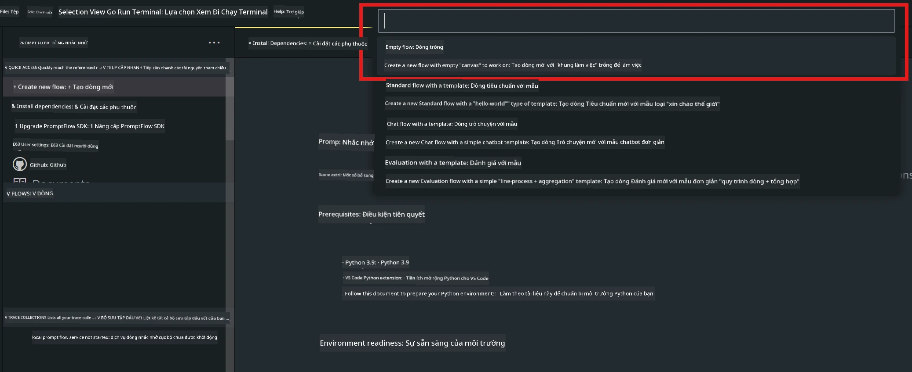
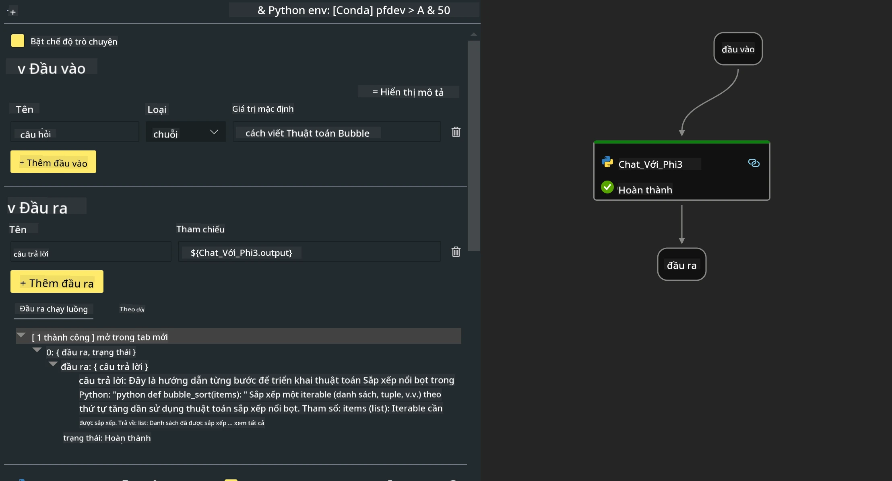
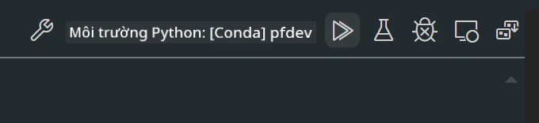

# **Lab 2 - Chạy Prompt flow với Phi-3-mini trong AIPC**

## **Prompt flow là gì**

Prompt flow là một bộ công cụ phát triển được thiết kế để đơn giản hóa chu trình phát triển toàn diện các ứng dụng AI dựa trên LLM, từ giai đoạn ý tưởng, tạo mẫu, thử nghiệm, đánh giá đến triển khai sản xuất và giám sát. Nó giúp việc thiết kế prompt trở nên dễ dàng hơn và cho phép bạn xây dựng các ứng dụng LLM với chất lượng sản xuất.

Với prompt flow, bạn có thể:

- Tạo các luồng công việc liên kết LLM, prompt, mã Python và các công cụ khác thành một quy trình thực thi.

- Gỡ lỗi và lặp lại các luồng của bạn, đặc biệt là tương tác với LLM một cách dễ dàng.

- Đánh giá các luồng, tính toán các chỉ số chất lượng và hiệu suất với bộ dữ liệu lớn hơn.

- Tích hợp việc kiểm thử và đánh giá vào hệ thống CI/CD để đảm bảo chất lượng luồng của bạn.

- Triển khai các luồng lên nền tảng phục vụ bạn chọn hoặc tích hợp dễ dàng vào mã nguồn ứng dụng.

- (Tùy chọn nhưng rất khuyến khích) Hợp tác cùng nhóm bằng cách sử dụng phiên bản đám mây của Prompt flow trên Azure AI.

## **Xây dựng luồng mã sinh trên Apple Silicon**

***Note*** ：Nếu bạn chưa hoàn thành cài đặt môi trường, vui lòng truy cập [Lab 0 - Installations](./01.Installations.md)

1. Mở Prompt flow Extension trong Visual Studio Code và tạo một dự án luồng trống



2. Thêm các tham số Inputs và Outputs, sau đó thêm Python Code như một luồng mới



Bạn có thể tham khảo cấu trúc này (flow.dag.yaml) để xây dựng luồng của mình

```yaml

inputs:
  prompt:
    type: string
    default: Write python code for Fibonacci serie. Please use markdown as output
outputs:
  result:
    type: string
    reference: ${gen_code_by_phi3.output}
nodes:
- name: gen_code_by_phi3
  type: python
  source:
    type: code
    path: gen_code_by_phi3.py
  inputs:
    prompt: ${inputs.prompt}


```

3. Lượng tử hóa phi-3-mini

Chúng ta mong muốn chạy SLM tốt hơn trên các thiết bị cục bộ. Thông thường, chúng ta lượng tử hóa mô hình (INT4, FP16, FP32)

```bash

python -m mlx_lm.convert --hf-path microsoft/Phi-3-mini-4k-instruct

```

**Note:** thư mục mặc định là mlx_model

4. Thêm mã vào ***Chat_With_Phi3.py***

```python


from promptflow import tool

from mlx_lm import load, generate


# The inputs section will change based on the arguments of the tool function, after you save the code
# Adding type to arguments and return value will help the system show the types properly
# Please update the function name/signature per need
@tool
def my_python_tool(prompt: str) -> str:

    model_id = './mlx_model_phi3_mini'

    model, tokenizer = load(model_id)

    # <|user|>\nWrite python code for Fibonacci serie. Please use markdown as output<|end|>\n<|assistant|>

    response = generate(model, tokenizer, prompt="<|user|>\n" + prompt  + "<|end|>\n<|assistant|>", max_tokens=2048, verbose=True)

    return response


```

4. Bạn có thể thử luồng bằng cách Debug hoặc Run để kiểm tra mã sinh hoạt động hay không



5. Chạy luồng như API phát triển trong terminal

```

pf flow serve --source ./ --port 8080 --host localhost   

```

Bạn có thể thử nghiệm trong Postman / Thunder Client

### **Note**

1. Lần chạy đầu tiên sẽ mất nhiều thời gian. Khuyến nghị tải mô hình phi-3 từ Hugging face CLI.

2. Do hạn chế về sức mạnh tính toán của Intel NPU, nên sử dụng Phi-3-mini-4k-instruct.

3. Chúng ta sử dụng Intel NPU Acceleration để lượng tử hóa chuyển đổi INT4, nhưng nếu bạn chạy lại dịch vụ, cần xóa các thư mục cache và nc_workshop.

## **Tài nguyên**

1. Tìm hiểu Promptflow [https://microsoft.github.io/promptflow/](https://microsoft.github.io/promptflow/)

2. Tìm hiểu Intel NPU Acceleration [https://github.com/intel/intel-npu-acceleration-library](https://github.com/intel/intel-npu-acceleration-library)

3. Mã mẫu, tải về [Local NPU Agent Sample Code](../../../../../../../../../code/07.Lab/01/AIPC/local-npu-agent)

**Tuyên bố từ chối trách nhiệm**:  
Tài liệu này đã được dịch bằng dịch vụ dịch thuật AI [Co-op Translator](https://github.com/Azure/co-op-translator). Mặc dù chúng tôi cố gắng đảm bảo độ chính xác, xin lưu ý rằng các bản dịch tự động có thể chứa lỗi hoặc không chính xác. Tài liệu gốc bằng ngôn ngữ gốc của nó nên được coi là nguồn chính xác và đáng tin cậy. Đối với các thông tin quan trọng, nên sử dụng dịch vụ dịch thuật chuyên nghiệp do con người thực hiện. Chúng tôi không chịu trách nhiệm về bất kỳ sự hiểu lầm hoặc giải thích sai nào phát sinh từ việc sử dụng bản dịch này.