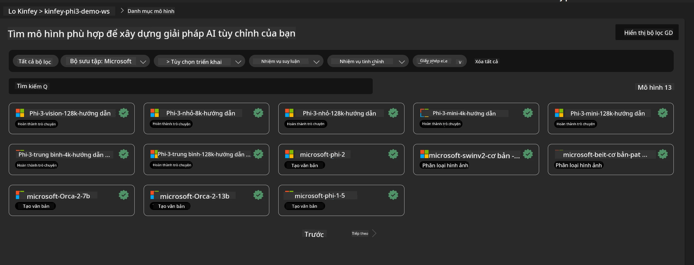
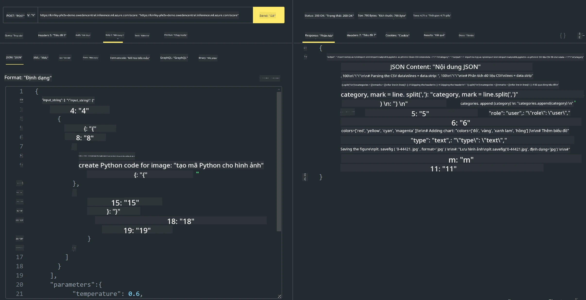

# **Lab 3 - Triển khai Phi-3-vision trên Azure Machine Learning Service**

Chúng ta sử dụng NPU để hoàn thành việc triển khai sản xuất mã nguồn cục bộ, sau đó muốn giới thiệu khả năng tích hợp PHI-3-VISION qua đó để thực hiện chuyển đổi hình ảnh thành mã nguồn.

Trong phần giới thiệu này, chúng ta có thể nhanh chóng xây dựng một dịch vụ Model As Service Phi-3 Vision trên Azure Machine Learning Service.

***Note***： Phi-3 Vision cần sức mạnh tính toán để tạo nội dung nhanh hơn. Chúng ta cần sức mạnh điện toán đám mây để hỗ trợ thực hiện điều này.


### **1. Tạo Azure Machine Learning Service**

Chúng ta cần tạo một Azure Machine Learning Service trong Azure Portal. Nếu bạn muốn tìm hiểu cách làm, vui lòng truy cập liên kết này [https://learn.microsoft.com/azure/machine-learning/quickstart-create-resources?view=azureml-api-2](https://learn.microsoft.com/azure/machine-learning/quickstart-create-resources?view=azureml-api-2)


### **2. Chọn Phi-3 Vision trong Azure Machine Learning Service**




### **3. Triển khai Phi-3-Vision trên Azure**


### **4. Kiểm tra Endpoint trong Postman**





***Note***

1. Các tham số truyền đi phải bao gồm Authorization, azureml-model-deployment và Content-Type. Bạn cần kiểm tra thông tin triển khai để lấy các giá trị này.

2. Để truyền tham số, Phi-3-Vision cần truyền một liên kết hình ảnh. Vui lòng tham khảo phương pháp GPT-4-Vision để truyền tham số, ví dụ như

```json

{
  "input_data":{
    "input_string":[
      {
        "role":"user",
        "content":[ 
          {
            "type": "text",
            "text": "You are a Python coding assistant.Please create Python code for image "
          },
          {
              "type": "image_url",
              "image_url": {
                "url": "https://ajaytech.co/wp-content/uploads/2019/09/index.png"
              }
          }
        ]
      }
    ],
    "parameters":{
          "temperature": 0.6,
          "top_p": 0.9,
          "do_sample": false,
          "max_new_tokens": 2048
    }
  }
}

```

3. Gọi **/score** bằng phương thức Post

**Chúc mừng**！Bạn đã hoàn thành việc triển khai nhanh PHI-3-VISION và thử nghiệm cách sử dụng hình ảnh để tạo mã nguồn. Tiếp theo, chúng ta có thể xây dựng các ứng dụng kết hợp với NPU và đám mây.

**Tuyên bố từ chối trách nhiệm**:  
Tài liệu này đã được dịch bằng dịch vụ dịch thuật AI [Co-op Translator](https://github.com/Azure/co-op-translator). Mặc dù chúng tôi cố gắng đảm bảo độ chính xác, xin lưu ý rằng bản dịch tự động có thể chứa lỗi hoặc không chính xác. Tài liệu gốc bằng ngôn ngữ gốc của nó nên được coi là nguồn chính xác và đáng tin cậy. Đối với các thông tin quan trọng, nên sử dụng dịch vụ dịch thuật chuyên nghiệp do con người thực hiện. Chúng tôi không chịu trách nhiệm về bất kỳ sự hiểu lầm hoặc giải thích sai nào phát sinh từ việc sử dụng bản dịch này.