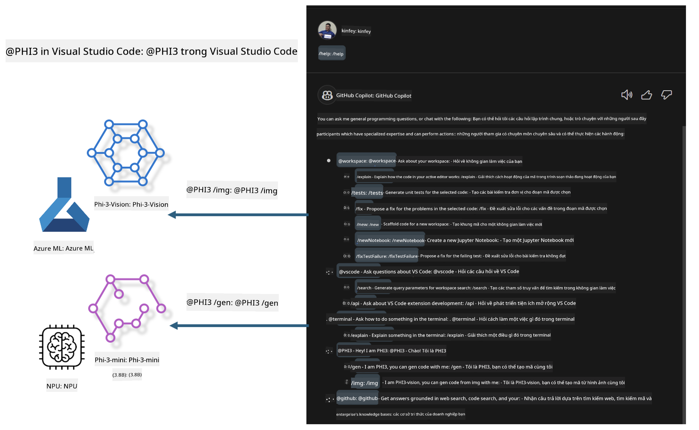

<!--
CO_OP_TRANSLATOR_METADATA:
{
  "original_hash": "00b7a699de8ac405fa821f4c0f7fc0ab",
  "translation_date": "2025-05-09T19:15:15+00:00",
  "source_file": "md/02.Application/02.Code/Phi3/VSCodeExt/README.md",
  "language_code": "vi"
}
-->
# **Tự xây dựng Visual Studio Code GitHub Copilot Chat với Microsoft Phi-3 Family**

Bạn đã từng sử dụng workspace agent trong GitHub Copilot Chat chưa? Bạn có muốn tạo một agent code cho nhóm của mình không? Lab thực hành này hy vọng kết hợp mô hình mã nguồn mở để xây dựng một agent kinh doanh code cấp doanh nghiệp.

## **Nền tảng**

### **Tại sao chọn Microsoft Phi-3**

Phi-3 là một dòng sản phẩm, bao gồm phi-3-mini, phi-3-small và phi-3-medium dựa trên các tham số huấn luyện khác nhau cho việc tạo văn bản, hoàn thành hội thoại và tạo code. Còn có phi-3-vision dựa trên Vision. Nó phù hợp cho các doanh nghiệp hoặc các nhóm khác nhau để tạo các giải pháp AI sinh tạo offline.

Đề xuất đọc liên kết này [https://github.com/microsoft/PhiCookBook/blob/main/md/01.Introduction/01/01.PhiFamily.md](https://github.com/microsoft/PhiCookBook/blob/main/md/01.Introduction/01/01.PhiFamily.md)

### **Microsoft GitHub Copilot Chat**

Extension GitHub Copilot Chat cung cấp cho bạn một giao diện chat để tương tác với GitHub Copilot và nhận câu trả lời cho các câu hỏi liên quan đến lập trình ngay trong VS Code, mà không cần phải tìm kiếm tài liệu hay diễn đàn trực tuyến.

Copilot Chat có thể sử dụng tô màu cú pháp, thụt lề và các định dạng khác để làm rõ câu trả lời được tạo ra. Tùy theo loại câu hỏi của người dùng, kết quả có thể chứa liên kết đến ngữ cảnh mà Copilot dùng để tạo câu trả lời, như các file mã nguồn hoặc tài liệu, hoặc các nút để truy cập các chức năng của VS Code.

- Copilot Chat tích hợp vào quy trình phát triển của bạn và hỗ trợ khi bạn cần:

- Bắt đầu cuộc trò chuyện inline ngay từ trình soạn thảo hoặc terminal để được giúp đỡ khi đang code

- Sử dụng chế độ Chat để có trợ lý AI bên cạnh hỗ trợ bạn bất cứ lúc nào

- Khởi chạy Quick Chat để hỏi nhanh một câu và tiếp tục công việc của bạn

Bạn có thể dùng GitHub Copilot Chat trong nhiều trường hợp, ví dụ:

- Trả lời các câu hỏi lập trình về cách giải quyết vấn đề tốt nhất

- Giải thích code của người khác và đề xuất cải tiến

- Đề xuất sửa lỗi code

- Tạo các trường hợp kiểm thử đơn vị

- Tạo tài liệu code

Đề xuất đọc liên kết này [https://code.visualstudio.com/docs/copilot/copilot-chat](https://code.visualstudio.com/docs/copilot/copilot-chat?WT.mc_id=aiml-137032-kinfeylo)

###  **Microsoft GitHub Copilot Chat @workspace**

Tham chiếu **@workspace** trong Copilot Chat cho phép bạn đặt câu hỏi về toàn bộ codebase của mình. Dựa trên câu hỏi, Copilot sẽ thông minh lấy các file và ký hiệu liên quan, sau đó tham chiếu trong câu trả lời dưới dạng liên kết và ví dụ code.

Để trả lời câu hỏi, **@workspace** tìm kiếm qua cùng các nguồn mà một lập trình viên sẽ dùng khi duyệt codebase trong VS Code:

- Tất cả file trong workspace, trừ các file bị bỏ qua bởi .gitignore

- Cấu trúc thư mục với các thư mục con và tên file

- Chỉ mục tìm kiếm code của GitHub, nếu workspace là kho GitHub và được lập chỉ mục

- Các ký hiệu và định nghĩa trong workspace

- Văn bản đang được chọn hoặc văn bản hiển thị trong trình soạn thảo đang hoạt động

Lưu ý: .gitignore sẽ bị bỏ qua nếu bạn đang mở file hoặc chọn văn bản trong file bị bỏ qua.

Đề xuất đọc liên kết này [[https://code.visualstudio.com/docs/copilot/copilot-chat](https://code.visualstudio.com/docs/copilot/workspace-context?WT.mc_id=aiml-137032-kinfeylo)]

## **Tìm hiểu thêm về Lab này**

GitHub Copilot đã cải thiện đáng kể hiệu quả lập trình của doanh nghiệp, và mỗi doanh nghiệp đều muốn tùy chỉnh các chức năng liên quan của GitHub Copilot. Nhiều doanh nghiệp đã tùy chỉnh Extensions tương tự GitHub Copilot dựa trên kịch bản kinh doanh và mô hình mã nguồn mở của riêng họ. Với doanh nghiệp, Extensions tùy chỉnh dễ kiểm soát hơn, nhưng điều này cũng ảnh hưởng đến trải nghiệm người dùng. Rốt cuộc, GitHub Copilot có chức năng mạnh hơn trong xử lý các kịch bản chung và tính chuyên nghiệp. Nếu trải nghiệm có thể giữ nhất quán, việc tùy chỉnh Extension riêng của doanh nghiệp sẽ tốt hơn. GitHub Copilot Chat cung cấp API liên quan để doanh nghiệp mở rộng trải nghiệm Chat. Giữ trải nghiệm nhất quán và có chức năng tùy chỉnh là trải nghiệm người dùng tốt hơn.

Lab này chủ yếu sử dụng mô hình Phi-3 kết hợp với NPU cục bộ và Azure hybrid để xây dựng Agent tùy chỉnh trong GitHub Copilot Chat ***@PHI3*** nhằm hỗ trợ lập trình viên doanh nghiệp hoàn thành tạo code ***(@PHI3 /gen)*** và tạo code dựa trên hình ảnh ***(@PHI3 /img)***.

### ***Lưu ý:*** 

Lab này hiện được triển khai trên AIPC của Intel CPU và Apple Silicon. Chúng tôi sẽ tiếp tục cập nhật phiên bản NPU của Qualcomm.

## **Lab**

| Tên | Mô tả | AIPC | Apple |
| ------------ | ----------- | -------- |-------- |
| Lab0 - Cài đặt (✅) | Cấu hình và cài đặt môi trường liên quan và công cụ cài đặt | [Go](./HOL/AIPC/01.Installations.md) |[Go](./HOL/Apple/01.Installations.md) |
| Lab1 - Chạy Prompt flow với Phi-3-mini (✅) | Kết hợp với AIPC / Apple Silicon, sử dụng NPU cục bộ để tạo code qua Phi-3-mini | [Go](./HOL/AIPC/02.PromptflowWithNPU.md) |  [Go](./HOL/Apple/02.PromptflowWithMLX.md) |
| Lab2 - Triển khai Phi-3-vision trên Azure Machine Learning Service (✅) | Tạo code bằng cách triển khai Model Catalog của Azure Machine Learning Service - ảnh Phi-3-vision | [Go](./HOL/AIPC/03.DeployPhi3VisionOnAzure.md) |[Go](./HOL/Apple/03.DeployPhi3VisionOnAzure.md) |
| Lab3 - Tạo agent @phi-3 trong GitHub Copilot Chat (✅)  | Tạo agent Phi-3 tùy chỉnh trong GitHub Copilot Chat để hoàn thành tạo code, tạo code đồ họa, RAG, v.v. | [Go](./HOL/AIPC/04.CreatePhi3AgentInVSCode.md) | [Go](./HOL/Apple/04.CreatePhi3AgentInVSCode.md) |
| Mã mẫu (✅)  | Tải mã mẫu | [Go](../../../../../../../code/07.Lab/01/AIPC) | [Go](../../../../../../../code/07.Lab/01/Apple) |

## **Tài nguyên**

1. Phi-3 Cookbook [https://github.com/microsoft/Phi-3CookBook](https://github.com/microsoft/Phi-3CookBook)

2. Tìm hiểu thêm về GitHub Copilot [https://learn.microsoft.com/training/paths/copilot/](https://learn.microsoft.com/training/paths/copilot/?WT.mc_id=aiml-137032-kinfeylo)

3. Tìm hiểu thêm về GitHub Copilot Chat [https://learn.microsoft.com/training/paths/accelerate-app-development-using-github-copilot/](https://learn.microsoft.com/training/paths/accelerate-app-development-using-github-copilot/?WT.mc_id=aiml-137032-kinfeylo)

4. Tìm hiểu thêm về GitHub Copilot Chat API [https://code.visualstudio.com/api/extension-guides/chat](https://code.visualstudio.com/api/extension-guides/chat?WT.mc_id=aiml-137032-kinfeylo)

5. Tìm hiểu thêm về Azure AI Foundry [https://learn.microsoft.com/training/paths/create-custom-copilots-ai-studio/](https://learn.microsoft.com/training/paths/create-custom-copilots-ai-studio/?WT.mc_id=aiml-137032-kinfeylo)

6. Tìm hiểu thêm về Model Catalog của Azure AI Foundry [https://learn.microsoft.com/azure/ai-studio/how-to/model-catalog-overview](https://learn.microsoft.com/azure/ai-studio/how-to/model-catalog-overview)

**Tuyên bố từ chối trách nhiệm**:  
Tài liệu này đã được dịch bằng dịch vụ dịch thuật AI [Co-op Translator](https://github.com/Azure/co-op-translator). Mặc dù chúng tôi cố gắng đảm bảo độ chính xác, xin lưu ý rằng các bản dịch tự động có thể chứa lỗi hoặc không chính xác. Tài liệu gốc bằng ngôn ngữ gốc nên được coi là nguồn tham khảo chính thức. Đối với thông tin quan trọng, nên sử dụng dịch vụ dịch thuật chuyên nghiệp do con người thực hiện. Chúng tôi không chịu trách nhiệm đối với bất kỳ sự hiểu nhầm hoặc giải thích sai nào phát sinh từ việc sử dụng bản dịch này.