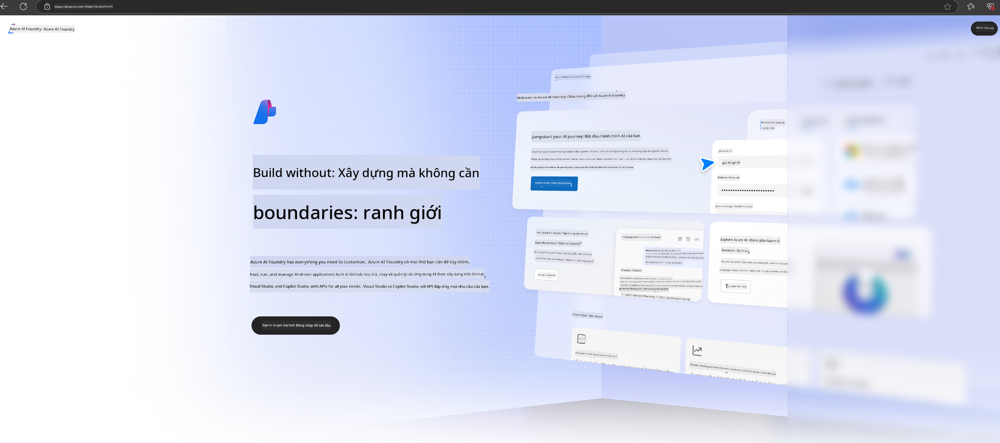

<!--
CO_OP_TRANSLATOR_METADATA:
{
  "original_hash": "3a1e48b628022485aac989c9f733e792",
  "translation_date": "2025-05-09T20:13:20+00:00",
  "source_file": "md/02.QuickStart/AzureAIFoundry_QuickStart.md",
  "language_code": "vi"
}
-->
# **Sử dụng Phi-3 trong Azure AI Foundry**

Với sự phát triển của Generative AI, chúng ta mong muốn sử dụng một nền tảng thống nhất để quản lý các LLM và SLM khác nhau, tích hợp dữ liệu doanh nghiệp, thực hiện fine-tuning/RAG, và đánh giá các hoạt động kinh doanh sau khi tích hợp LLM và SLM, v.v., để các ứng dụng AI sinh tạo có thể được triển khai thông minh hơn. [Azure AI Foundry](https://ai.azure.com) là nền tảng ứng dụng AI sinh tạo cấp doanh nghiệp.

Với Azure AI Foundry, bạn có thể đánh giá phản hồi của mô hình ngôn ngữ lớn (LLM) và điều phối các thành phần ứng dụng prompt bằng prompt flow để nâng cao hiệu suất. Nền tảng này hỗ trợ khả năng mở rộng để chuyển đổi các bản thử nghiệm ý tưởng thành sản phẩm hoàn chỉnh một cách dễ dàng. Việc giám sát liên tục và tinh chỉnh hỗ trợ thành công lâu dài.

Chúng ta có thể nhanh chóng triển khai mô hình Phi-3 trên Azure AI Foundry qua các bước đơn giản, sau đó sử dụng Azure AI Foundry để hoàn thành các công việc liên quan đến Playground/Chat, Fine-tuning, đánh giá Phi-3.

## **1. Chuẩn bị**

Nếu bạn đã cài đặt [Azure Developer CLI](https://learn.microsoft.com/azure/developer/azure-developer-cli/overview?WT.mc_id=aiml-138114-kinfeylo) trên máy, sử dụng mẫu này đơn giản chỉ cần chạy lệnh trong thư mục mới.

## Tạo thủ công

Tạo dự án và hub trên Microsoft Azure AI Foundry là cách tuyệt vời để tổ chức và quản lý công việc AI của bạn. Dưới đây là hướng dẫn từng bước để bắt đầu:

### Tạo dự án trong Azure AI Foundry

1. **Truy cập Azure AI Foundry**: Đăng nhập vào cổng Azure AI Foundry.
2. **Tạo dự án**:
   - Nếu bạn đang trong một dự án, chọn "Azure AI Foundry" ở góc trên bên trái trang để về trang Chủ.
   - Chọn "+ Create project".
   - Nhập tên cho dự án.
   - Nếu bạn có hub, nó sẽ được chọn mặc định. Nếu bạn có quyền truy cập nhiều hub, bạn có thể chọn hub khác từ dropdown. Nếu muốn tạo hub mới, chọn "Create new hub" và nhập tên.
   - Chọn "Create".

### Tạo hub trong Azure AI Foundry

1. **Truy cập Azure AI Foundry**: Đăng nhập bằng tài khoản Azure của bạn.
2. **Tạo hub**:
   - Chọn Trung tâm Quản lý từ menu bên trái.
   - Chọn "All resources", sau đó nhấn mũi tên xuống bên cạnh "+ New project" và chọn "+ New hub".
   - Trong hộp thoại "Create a new hub", nhập tên cho hub của bạn (ví dụ: contoso-hub) và điều chỉnh các trường khác theo ý muốn.
   - Chọn "Next", xem lại thông tin rồi chọn "Create".

Để biết hướng dẫn chi tiết hơn, bạn có thể tham khảo tài liệu chính thức [Microsoft documentation](https://learn.microsoft.com/azure/ai-studio/how-to/create-projects).

Sau khi tạo thành công, bạn có thể truy cập studio đã tạo qua [ai.azure.com](https://ai.azure.com/)

Có thể có nhiều dự án trên một AI Foundry. Hãy tạo dự án trong AI Foundry để chuẩn bị.

Tạo Azure AI Foundry [QuickStarts](https://learn.microsoft.com/azure/ai-studio/quickstarts/get-started-code)

## **2. Triển khai mô hình Phi trên Azure AI Foundry**

Nhấp vào tùy chọn Explore của dự án để vào Model Catalog và chọn Phi-3

Chọn Phi-3-mini-4k-instruct

Nhấn 'Deploy' để triển khai mô hình Phi-3-mini-4k-instruct

> [!NOTE]
>
> Bạn có thể chọn sức mạnh tính toán khi triển khai

## **3. Playground Chat Phi trong Azure AI Foundry**

Truy cập trang triển khai, chọn Playground, và trò chuyện với Phi-3 trên Azure AI Foundry

## **4. Triển khai mô hình từ Azure AI Foundry**

Để triển khai mô hình từ Azure Model Catalog, bạn có thể làm theo các bước sau:

- Đăng nhập Azure AI Foundry.
- Chọn mô hình bạn muốn triển khai từ danh mục mô hình Azure AI Foundry.
- Ở trang Chi tiết mô hình, chọn Deploy rồi chọn Serverless API với Azure AI Content Safety.
- Chọn dự án bạn muốn triển khai mô hình. Để sử dụng Serverless API, workspace của bạn phải thuộc vùng East US 2 hoặc Sweden Central. Bạn có thể tùy chỉnh tên Deployment.
- Trên trình hướng dẫn triển khai, chọn Pricing and terms để tìm hiểu về giá và điều khoản sử dụng.
- Chọn Deploy. Chờ đến khi triển khai sẵn sàng và bạn được chuyển hướng đến trang Deployments.
- Chọn Open in playground để bắt đầu tương tác với mô hình.
- Bạn có thể quay lại trang Deployments, chọn deployment và ghi lại Target URL và Secret Key của endpoint để gọi deployment và tạo completions.
- Bạn luôn có thể tìm thông tin chi tiết endpoint, URL và khóa truy cập bằng cách vào tab Build và chọn Deployments trong phần Components.

> [!NOTE]
> Lưu ý tài khoản của bạn phải có quyền Azure AI Developer role trên Resource Group để thực hiện các bước này.

## **5. Sử dụng Phi API trong Azure AI Foundry**

Bạn có thể truy cập https://{Your project name}.region.inference.ml.azure.com/swagger.json qua Postman GET và kết hợp với Key để tìm hiểu các giao diện được cung cấp

Bạn có thể lấy tham số yêu cầu rất thuận tiện, cũng như tham số phản hồi.

**Tuyên bố miễn trừ trách nhiệm**:  
Tài liệu này đã được dịch bằng dịch vụ dịch thuật AI [Co-op Translator](https://github.com/Azure/co-op-translator). Mặc dù chúng tôi cố gắng đảm bảo độ chính xác, xin lưu ý rằng bản dịch tự động có thể chứa lỗi hoặc sai sót. Tài liệu gốc bằng ngôn ngữ gốc nên được coi là nguồn thông tin chính xác nhất. Đối với các thông tin quan trọng, nên sử dụng dịch vụ dịch thuật chuyên nghiệp do con người thực hiện. Chúng tôi không chịu trách nhiệm đối với bất kỳ sự hiểu lầm hoặc giải thích sai nào phát sinh từ việc sử dụng bản dịch này.