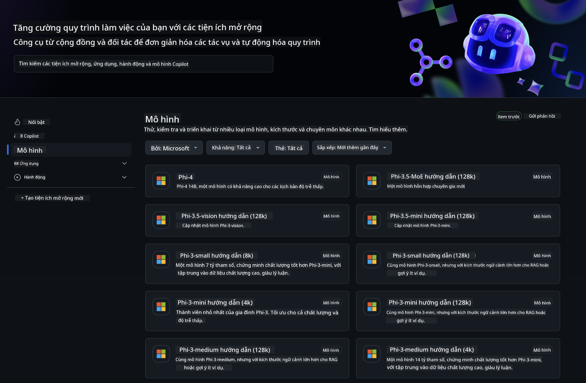
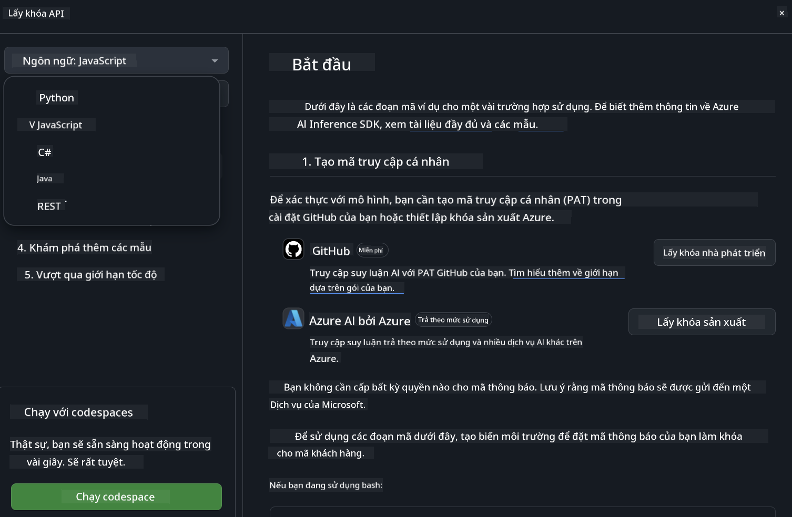

<!--
CO_OP_TRANSLATOR_METADATA:
{
  "original_hash": "5113634b77370af6790f9697d5d7de90",
  "translation_date": "2025-07-17T05:39:21+00:00",
  "source_file": "md/02.QuickStart/GitHubModel_QuickStart.md",
  "language_code": "vi"
}
-->
## GitHub Models - Phiên bản Beta Công khai Giới hạn

Chào mừng bạn đến với [GitHub Models](https://github.com/marketplace/models)! Chúng tôi đã chuẩn bị sẵn sàng để bạn khám phá các Mô hình AI được lưu trữ trên Azure AI.



Để biết thêm thông tin về các Mô hình có trên GitHub Models, hãy xem tại [GitHub Model Marketplace](https://github.com/marketplace/models)

## Các Mô hình Có sẵn

Mỗi mô hình đều có một khu vực thử nghiệm riêng và mã mẫu đi kèm


### Các Mô hình Phi-3 trong Danh mục Mô hình GitHub

[Phi-3-Medium-128k-Instruct](https://github.com/marketplace/models/azureml/Phi-3-medium-128k-instruct)

[Phi-3-medium-4k-instruct](https://github.com/marketplace/models/azureml/Phi-3-medium-4k-instruct)

[Phi-3-mini-128k-instruct](https://github.com/marketplace/models/azureml/Phi-3-mini-128k-instruct)

[Phi-3-mini-4k-instruct](https://github.com/marketplace/models/azureml/Phi-3-mini-4k-instruct)

[Phi-3-small-128k-instruct](https://github.com/marketplace/models/azureml/Phi-3-small-128k-instruct)

[Phi-3-small-8k-instruct](https://github.com/marketplace/models/azureml/Phi-3-small-8k-instruct)

## Bắt đầu

Có một vài ví dụ cơ bản sẵn sàng để bạn chạy thử. Bạn có thể tìm thấy chúng trong thư mục samples. Nếu bạn muốn đi thẳng đến ngôn ngữ yêu thích, các ví dụ có sẵn cho các ngôn ngữ sau:

- Python
- JavaScript
- cURL

Ngoài ra còn có một môi trường Codespaces riêng để chạy các mẫu và mô hình.



## Mã Mẫu

Dưới đây là các đoạn mã ví dụ cho một số trường hợp sử dụng. Để biết thêm thông tin về Azure AI Inference SDK, xem tài liệu đầy đủ và các mẫu.

## Thiết lập

1. Tạo một personal access token  
Bạn không cần cấp quyền nào cho token này. Lưu ý rằng token sẽ được gửi đến một dịch vụ của Microsoft.

Để sử dụng các đoạn mã dưới đây, hãy tạo một biến môi trường để đặt token của bạn làm khóa cho mã client.

Nếu bạn dùng bash:  
```
export GITHUB_TOKEN="<your-github-token-goes-here>"
```  
Nếu bạn dùng powershell:  

```
$Env:GITHUB_TOKEN="<your-github-token-goes-here>"
```  

Nếu bạn dùng Windows command prompt:  

```
set GITHUB_TOKEN=<your-github-token-goes-here>
```  

## Mẫu Python

### Cài đặt phụ thuộc  
Cài đặt Azure AI Inference SDK bằng pip (Yêu cầu: Python >=3.8):

```
pip install azure-ai-inference
```  
### Chạy ví dụ mã cơ bản

Ví dụ này minh họa một cuộc gọi cơ bản đến API chat completion. Nó sử dụng endpoint suy luận mô hình AI của GitHub và token GitHub của bạn. Cuộc gọi là đồng bộ.

```
import os
from azure.ai.inference import ChatCompletionsClient
from azure.ai.inference.models import SystemMessage, UserMessage
from azure.core.credentials import AzureKeyCredential

endpoint = "https://models.inference.ai.azure.com"
# Replace Model_Name 
model_name = "Phi-3-small-8k-instruct"
token = os.environ["GITHUB_TOKEN"]

client = ChatCompletionsClient(
    endpoint=endpoint,
    credential=AzureKeyCredential(token),
)

response = client.complete(
    messages=[
        SystemMessage(content="You are a helpful assistant."),
        UserMessage(content="What is the capital of France?"),
    ],
    model=model_name,
    temperature=1.,
    max_tokens=1000,
    top_p=1.
)

print(response.choices[0].message.content)
```

### Chạy hội thoại đa lượt

Ví dụ này minh họa một cuộc hội thoại đa lượt với API chat completion. Khi sử dụng mô hình cho ứng dụng chat, bạn cần quản lý lịch sử cuộc hội thoại và gửi các tin nhắn mới nhất đến mô hình.

```
import os
from azure.ai.inference import ChatCompletionsClient
from azure.ai.inference.models import AssistantMessage, SystemMessage, UserMessage
from azure.core.credentials import AzureKeyCredential

token = os.environ["GITHUB_TOKEN"]
endpoint = "https://models.inference.ai.azure.com"
# Replace Model_Name
model_name = "Phi-3-small-8k-instruct"

client = ChatCompletionsClient(
    endpoint=endpoint,
    credential=AzureKeyCredential(token),
)

messages = [
    SystemMessage(content="You are a helpful assistant."),
    UserMessage(content="What is the capital of France?"),
    AssistantMessage(content="The capital of France is Paris."),
    UserMessage(content="What about Spain?"),
]

response = client.complete(messages=messages, model=model_name)

print(response.choices[0].message.content)
```

### Truyền dữ liệu đầu ra theo luồng

Để cải thiện trải nghiệm người dùng, bạn sẽ muốn truyền dữ liệu phản hồi của mô hình theo luồng để token đầu tiên xuất hiện sớm và tránh phải chờ đợi phản hồi dài.

```
import os
from azure.ai.inference import ChatCompletionsClient
from azure.ai.inference.models import SystemMessage, UserMessage
from azure.core.credentials import AzureKeyCredential

token = os.environ["GITHUB_TOKEN"]
endpoint = "https://models.inference.ai.azure.com"
# Replace Model_Name
model_name = "Phi-3-small-8k-instruct"

client = ChatCompletionsClient(
    endpoint=endpoint,
    credential=AzureKeyCredential(token),
)

response = client.complete(
    stream=True,
    messages=[
        SystemMessage(content="You are a helpful assistant."),
        UserMessage(content="Give me 5 good reasons why I should exercise every day."),
    ],
    model=model_name,
)

for update in response:
    if update.choices:
        print(update.choices[0].delta.content or "", end="")

client.close()
```

## JavaScript

### Cài đặt phụ thuộc

Cài đặt Node.js.

Sao chép các dòng sau và lưu thành file package.json trong thư mục của bạn.

```
{
  "type": "module",
  "dependencies": {
    "@azure-rest/ai-inference": "latest",
    "@azure/core-auth": "latest",
    "@azure/core-sse": "latest"
  }
}
```

Lưu ý: @azure/core-sse chỉ cần khi bạn truyền dữ liệu phản hồi chat completion theo luồng.

Mở cửa sổ terminal trong thư mục này và chạy npm install.

Với mỗi đoạn mã dưới đây, sao chép nội dung vào file sample.js và chạy bằng lệnh node sample.js.

### Chạy ví dụ mã cơ bản

Ví dụ này minh họa một cuộc gọi cơ bản đến API chat completion. Nó sử dụng endpoint suy luận mô hình AI của GitHub và token GitHub của bạn. Cuộc gọi là đồng bộ.

```
import ModelClient from "@azure-rest/ai-inference";
import { AzureKeyCredential } from "@azure/core-auth";

const token = process.env["GITHUB_TOKEN"];
const endpoint = "https://models.inference.ai.azure.com";
// Update your modelname
const modelName = "Phi-3-small-8k-instruct";

export async function main() {

  const client = new ModelClient(endpoint, new AzureKeyCredential(token));

  const response = await client.path("/chat/completions").post({
    body: {
      messages: [
        { role:"system", content: "You are a helpful assistant." },
        { role:"user", content: "What is the capital of France?" }
      ],
      model: modelName,
      temperature: 1.,
      max_tokens: 1000,
      top_p: 1.
    }
  });

  if (response.status !== "200") {
    throw response.body.error;
  }
  console.log(response.body.choices[0].message.content);
}

main().catch((err) => {
  console.error("The sample encountered an error:", err);
});
```

### Chạy hội thoại đa lượt

Ví dụ này minh họa một cuộc hội thoại đa lượt với API chat completion. Khi sử dụng mô hình cho ứng dụng chat, bạn cần quản lý lịch sử cuộc hội thoại và gửi các tin nhắn mới nhất đến mô hình.

```
import ModelClient from "@azure-rest/ai-inference";
import { AzureKeyCredential } from "@azure/core-auth";

const token = process.env["GITHUB_TOKEN"];
const endpoint = "https://models.inference.ai.azure.com";
// Update your modelname
const modelName = "Phi-3-small-8k-instruct";

export async function main() {

  const client = new ModelClient(endpoint, new AzureKeyCredential(token));

  const response = await client.path("/chat/completions").post({
    body: {
      messages: [
        { role: "system", content: "You are a helpful assistant." },
        { role: "user", content: "What is the capital of France?" },
        { role: "assistant", content: "The capital of France is Paris." },
        { role: "user", content: "What about Spain?" },
      ],
      model: modelName,
    }
  });

  if (response.status !== "200") {
    throw response.body.error;
  }

  for (const choice of response.body.choices) {
    console.log(choice.message.content);
  }
}

main().catch((err) => {
  console.error("The sample encountered an error:", err);
});
```

### Truyền dữ liệu đầu ra theo luồng

Để cải thiện trải nghiệm người dùng, bạn sẽ muốn truyền dữ liệu phản hồi của mô hình theo luồng để token đầu tiên xuất hiện sớm và tránh phải chờ đợi phản hồi dài.

```
import ModelClient from "@azure-rest/ai-inference";
import { AzureKeyCredential } from "@azure/core-auth";
import { createSseStream } from "@azure/core-sse";

const token = process.env["GITHUB_TOKEN"];
const endpoint = "https://models.inference.ai.azure.com";
// Update your modelname
const modelName = "Phi-3-small-8k-instruct";

export async function main() {

  const client = new ModelClient(endpoint, new AzureKeyCredential(token));

  const response = await client.path("/chat/completions").post({
    body: {
      messages: [
        { role: "system", content: "You are a helpful assistant." },
        { role: "user", content: "Give me 5 good reasons why I should exercise every day." },
      ],
      model: modelName,
      stream: true
    }
  }).asNodeStream();

  const stream = response.body;
  if (!stream) {
    throw new Error("The response stream is undefined");
  }

  if (response.status !== "200") {
    stream.destroy();
    throw new Error(`Failed to get chat completions, http operation failed with ${response.status} code`);
  }

  const sseStream = createSseStream(stream);

  for await (const event of sseStream) {
    if (event.data === "[DONE]") {
      return;
    }
    for (const choice of (JSON.parse(event.data)).choices) {
        process.stdout.write(choice.delta?.content ?? ``);
    }
  }
}

main().catch((err) => {
  console.error("The sample encountered an error:", err);
});
```

## REST

### Chạy ví dụ mã cơ bản

Dán đoạn sau vào shell:

```
curl -X POST "https://models.inference.ai.azure.com/chat/completions" \
    -H "Content-Type: application/json" \
    -H "Authorization: Bearer $GITHUB_TOKEN" \
    -d '{
        "messages": [
            {
                "role": "system",
                "content": "You are a helpful assistant."
            },
            {
                "role": "user",
                "content": "What is the capital of France?"
            }
        ],
        "model": "Phi-3-small-8k-instruct"
    }'
```

### Chạy hội thoại đa lượt

Gọi API chat completion và truyền lịch sử cuộc hội thoại:

```
curl -X POST "https://models.inference.ai.azure.com/chat/completions" \
    -H "Content-Type: application/json" \
    -H "Authorization: Bearer $GITHUB_TOKEN" \
    -d '{
        "messages": [
            {
                "role": "system",
                "content": "You are a helpful assistant."
            },
            {
                "role": "user",
                "content": "What is the capital of France?"
            },
            {
                "role": "assistant",
                "content": "The capital of France is Paris."
            },
            {
                "role": "user",
                "content": "What about Spain?"
            }
        ],
        "model": "Phi-3-small-8k-instruct"
    }'
```

### Truyền dữ liệu đầu ra theo luồng

Đây là ví dụ gọi endpoint và truyền dữ liệu phản hồi theo luồng.

```
curl -X POST "https://models.inference.ai.azure.com/chat/completions" \
    -H "Content-Type: application/json" \
    -H "Authorization: Bearer $GITHUB_TOKEN" \
    -d '{
        "messages": [
            {
                "role": "system",
                "content": "You are a helpful assistant."
            },
            {
                "role": "user",
                "content": "Give me 5 good reasons why I should exercise every day."
            }
        ],
        "stream": true,
        "model": "Phi-3-small-8k-instruct"
    }'
```

## Sử dụng MIỄN PHÍ và Giới hạn tốc độ cho GitHub Models


[Giới hạn tốc độ cho khu vực thử nghiệm và sử dụng API miễn phí](https://docs.github.com/en/github-models/prototyping-with-ai-models#rate-limits) được thiết kế để giúp bạn thử nghiệm các mô hình và tạo nguyên mẫu ứng dụng AI. Để sử dụng vượt quá các giới hạn này và mở rộng ứng dụng của bạn, bạn cần cấp phát tài nguyên từ tài khoản Azure và xác thực từ đó thay vì dùng personal access token của GitHub. Bạn không cần thay đổi gì khác trong mã của mình. Sử dụng liên kết này để tìm hiểu cách vượt qua giới hạn tầng miễn phí trong Azure AI.

### Thông báo

Hãy nhớ rằng khi tương tác với mô hình, bạn đang thử nghiệm AI, nên có thể xảy ra sai sót về nội dung.

Tính năng này có các giới hạn khác nhau (bao gồm số yêu cầu mỗi phút, số yêu cầu mỗi ngày, số token mỗi yêu cầu và số yêu cầu đồng thời) và không được thiết kế cho các trường hợp sử dụng sản xuất.

GitHub Models sử dụng Azure AI Content Safety. Các bộ lọc này không thể tắt trong trải nghiệm GitHub Models. Nếu bạn quyết định sử dụng mô hình qua dịch vụ trả phí, vui lòng cấu hình bộ lọc nội dung phù hợp với yêu cầu của bạn.

Dịch vụ này đang trong điều khoản Pre-release của GitHub.

**Tuyên bố từ chối trách nhiệm**:  
Tài liệu này đã được dịch bằng dịch vụ dịch thuật AI [Co-op Translator](https://github.com/Azure/co-op-translator). Mặc dù chúng tôi cố gắng đảm bảo độ chính xác, xin lưu ý rằng các bản dịch tự động có thể chứa lỗi hoặc không chính xác. Tài liệu gốc bằng ngôn ngữ gốc của nó nên được coi là nguồn chính xác và đáng tin cậy. Đối với các thông tin quan trọng, nên sử dụng dịch vụ dịch thuật chuyên nghiệp do con người thực hiện. Chúng tôi không chịu trách nhiệm về bất kỳ sự hiểu lầm hoặc giải thích sai nào phát sinh từ việc sử dụng bản dịch này.