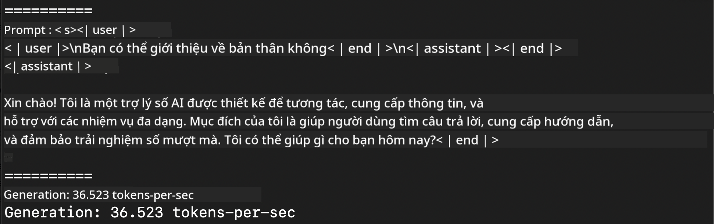
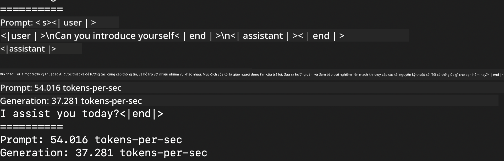
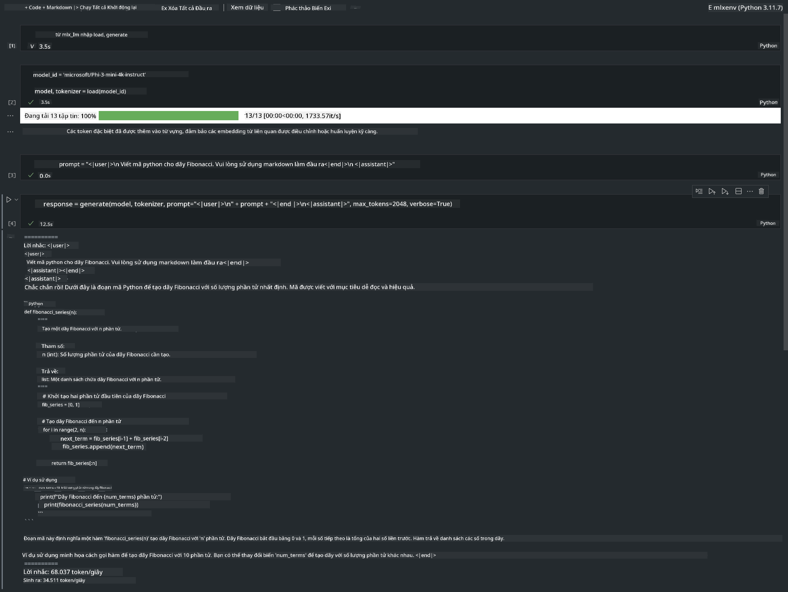

<!--
CO_OP_TRANSLATOR_METADATA:
{
  "original_hash": "dcb656f3d206fc4968e236deec5d4384",
  "translation_date": "2025-05-09T22:32:41+00:00",
  "source_file": "md/03.FineTuning/03.Inference/MLX_Inference.md",
  "language_code": "vi"
}
-->
# **Suy luận Phi-3 với Apple MLX Framework**

## **MLX Framework là gì**

MLX là một framework mảng dành cho nghiên cứu máy học trên Apple silicon, được phát triển bởi nhóm nghiên cứu máy học của Apple.

MLX được thiết kế bởi các nhà nghiên cứu máy học dành cho các nhà nghiên cứu máy học. Framework này hướng tới sự thân thiện với người dùng, đồng thời vẫn đảm bảo hiệu quả trong việc huấn luyện và triển khai mô hình. Thiết kế của framework cũng rất đơn giản về mặt khái niệm. Chúng tôi mong muốn giúp các nhà nghiên cứu dễ dàng mở rộng và cải tiến MLX nhằm nhanh chóng khám phá các ý tưởng mới.

Các mô hình ngôn ngữ lớn (LLMs) có thể được tăng tốc trên các thiết bị Apple Silicon thông qua MLX, và các mô hình có thể chạy cục bộ một cách rất tiện lợi.

## **Sử dụng MLX để suy luận Phi-3-mini**

### **1. Thiết lập môi trường MLX**

1. Python 3.11.x  
2. Cài đặt thư viện MLX

```bash

pip install mlx-lm

```

### **2. Chạy Phi-3-mini trong Terminal với MLX**

```bash

python -m mlx_lm.generate --model microsoft/Phi-3-mini-4k-instruct --max-token 2048 --prompt  "<|user|>\nCan you introduce yourself<|end|>\n<|assistant|>"

```

Kết quả (môi trường của tôi là Apple M1 Max, 64GB) như sau



### **3. Lượng tử hóa Phi-3-mini với MLX trong Terminal**

```bash

python -m mlx_lm.convert --hf-path microsoft/Phi-3-mini-4k-instruct

```

***Note：*** Mô hình có thể được lượng tử hóa thông qua mlx_lm.convert, và lượng tử hóa mặc định là INT4. Ví dụ này lượng tử hóa Phi-3-mini sang INT4.

Mô hình có thể được lượng tử hóa thông qua mlx_lm.convert, và lượng tử hóa mặc định là INT4. Ví dụ này nhằm lượng tử hóa Phi-3-mini thành INT4. Sau khi lượng tử hóa, mô hình sẽ được lưu trong thư mục mặc định ./mlx_model

Chúng ta có thể kiểm tra mô hình đã lượng tử hóa bằng MLX từ terminal

```bash

python -m mlx_lm.generate --model ./mlx_model/ --max-token 2048 --prompt  "<|user|>\nCan you introduce yourself<|end|>\n<|assistant|>"

```

Kết quả là



### **4. Chạy Phi-3-mini với MLX trong Jupyter Notebook**



***Note:*** Vui lòng đọc mẫu này [click this link](../../../../../code/03.Inference/MLX/MLX_DEMO.ipynb)

## **Tài nguyên**

1. Tìm hiểu về Apple MLX Framework [https://ml-explore.github.io](https://ml-explore.github.io/mlx/build/html/index.html)

2. Apple MLX GitHub Repo [https://github.com/ml-explore](https://github.com/ml-explore)

**Tuyên bố miễn trừ trách nhiệm**:  
Tài liệu này đã được dịch bằng dịch vụ dịch thuật AI [Co-op Translator](https://github.com/Azure/co-op-translator). Mặc dù chúng tôi cố gắng đảm bảo độ chính xác, xin lưu ý rằng các bản dịch tự động có thể chứa lỗi hoặc sự không chính xác. Tài liệu gốc bằng ngôn ngữ nguyên bản nên được xem là nguồn tham khảo chính xác. Đối với các thông tin quan trọng, nên sử dụng dịch vụ dịch thuật chuyên nghiệp do con người thực hiện. Chúng tôi không chịu trách nhiệm về bất kỳ sự hiểu nhầm hoặc diễn giải sai nào phát sinh từ việc sử dụng bản dịch này.