# Tinh chỉnh Phi-3 với Azure AI Foundry

Hãy cùng khám phá cách tinh chỉnh mô hình ngôn ngữ Phi-3 Mini của Microsoft bằng Azure AI Foundry. Tinh chỉnh giúp bạn điều chỉnh Phi-3 Mini cho các nhiệm vụ cụ thể, làm cho nó trở nên mạnh mẽ và hiểu ngữ cảnh hơn.

## Những điều cần lưu ý

- **Khả năng:** Những mô hình nào có thể tinh chỉnh? Mô hình gốc có thể được tinh chỉnh để làm gì?
- **Chi phí:** Mô hình giá cho việc tinh chỉnh như thế nào?
- **Tùy chỉnh:** Tôi có thể thay đổi mô hình gốc bao nhiêu – và theo những cách nào?
- **Tiện lợi:** Quá trình tinh chỉnh diễn ra như thế nào – tôi có cần viết mã riêng không? Tôi có cần chuẩn bị tài nguyên tính toán không?
- **An toàn:** Các mô hình tinh chỉnh có thể gặp rủi ro về an toàn – có các biện pháp bảo vệ nào để tránh gây hại ngoài ý muốn không?

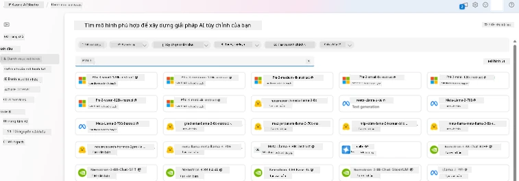

## Chuẩn bị cho việc tinh chỉnh

### Yêu cầu trước

> [!NOTE]
> Đối với các mô hình thuộc dòng Phi-3, dịch vụ tinh chỉnh theo mô hình trả tiền theo mức sử dụng chỉ có sẵn với các hub được tạo ở khu vực **East US 2**.

- Một tài khoản Azure. Nếu bạn chưa có, hãy tạo một [tài khoản Azure trả phí](https://azure.microsoft.com/pricing/purchase-options/pay-as-you-go) để bắt đầu.

- Một [dự án AI Foundry](https://ai.azure.com?WT.mc_id=aiml-138114-kinfeylo).
- Azure sử dụng kiểm soát truy cập dựa trên vai trò (Azure RBAC) để cấp quyền truy cập các thao tác trong Azure AI Foundry. Để thực hiện các bước trong bài viết này, tài khoản người dùng của bạn phải được gán __vai trò Azure AI Developer__ trên nhóm tài nguyên.

### Đăng ký nhà cung cấp dịch vụ cho subscription

Xác nhận subscription đã đăng ký nhà cung cấp tài nguyên `Microsoft.Network`.

1. Đăng nhập vào [cổng Azure](https://portal.azure.com).
1. Chọn **Subscriptions** từ menu bên trái.
1. Chọn subscription bạn muốn sử dụng.
1. Chọn **AI project settings** > **Resource providers** từ menu bên trái.
1. Xác nhận rằng **Microsoft.Network** có trong danh sách nhà cung cấp tài nguyên. Nếu chưa có, hãy thêm vào.

### Chuẩn bị dữ liệu

Chuẩn bị dữ liệu huấn luyện và dữ liệu kiểm tra để tinh chỉnh mô hình. Bộ dữ liệu huấn luyện và kiểm tra bao gồm các ví dụ đầu vào và đầu ra thể hiện cách bạn muốn mô hình hoạt động.

Đảm bảo tất cả các ví dụ huấn luyện tuân theo định dạng mong đợi cho việc suy luận. Để tinh chỉnh hiệu quả, hãy đảm bảo bộ dữ liệu cân bằng và đa dạng.

Điều này bao gồm duy trì sự cân bằng dữ liệu, bao gồm nhiều kịch bản khác nhau, và định kỳ tinh chỉnh dữ liệu huấn luyện để phù hợp với kỳ vọng thực tế, từ đó giúp mô hình trả về kết quả chính xác và cân bằng hơn.

Các loại mô hình khác nhau yêu cầu định dạng dữ liệu huấn luyện khác nhau.

### Hoàn thành Chat

Dữ liệu huấn luyện và kiểm tra bạn sử dụng **phải** được định dạng dưới dạng tài liệu JSON Lines (JSONL). Đối với `Phi-3-mini-128k-instruct`, bộ dữ liệu tinh chỉnh phải được định dạng theo kiểu hội thoại mà API Chat completions sử dụng.

### Ví dụ định dạng file

```json
    {"messages": [{"role": "system", "content": "You are an Xbox customer support agent whose primary goal is to help users with issues they are experiencing with their Xbox devices. You are friendly and concise. You only provide factual answers to queries, and do not provide answers that are not related to Xbox."}, {"role": "user", "content": "Is Xbox better than PlayStation?"}, {"role": "assistant", "content": "I apologize, but I cannot provide personal opinions. My primary job is to assist you with any issues related to your Xbox device. Do you have any Xbox-related issues that need addressing?"}]}
    {"messages": [{"role": "system", "content": "You are an Xbox customer support agent whose primary goal is to help users with issues they are experiencing with their Xbox devices. You are friendly and concise. You only provide factual answers to queries, and do not provide answers that are not related to Xbox."}, {"role": "user", "content": "Can I play PC games on my Xbox?"}, {"role": "assistant", "content": "While Xbox consoles don't natively support PC games, they can play an array of Xbox games, many of which are also available on PC. Can I assist you with finding games compatible with your Xbox device?"}]}
    {"messages": [{"role": "system", "content": "You are an Xbox customer support agent whose primary goal is to help users with issues they are experiencing with their Xbox devices. You are friendly and concise. You only provide factual answers to queries, and do not provide answers that are not related to Xbox."}, {"role": "user", "content": "I'm having trouble connecting my Xbox to the Wi-Fi."}, {"role": "assistant", "content": "No worries, let's go through the network settings on your Xbox. Can you please tell me what happens when you try to connect it to the Wi-Fi?"}]}
```

Loại file được hỗ trợ là JSON Lines. Các file được tải lên kho lưu trữ mặc định và có sẵn trong dự án của bạn.

## Tinh chỉnh Phi-3 với Azure AI Foundry

Azure AI Foundry cho phép bạn tùy chỉnh các mô hình ngôn ngữ lớn dựa trên bộ dữ liệu cá nhân thông qua quá trình gọi là tinh chỉnh. Tinh chỉnh mang lại giá trị lớn bằng cách cho phép tùy biến và tối ưu hóa cho các nhiệm vụ và ứng dụng cụ thể. Điều này giúp cải thiện hiệu suất, tiết kiệm chi phí, giảm độ trễ và tạo ra kết quả phù hợp hơn.

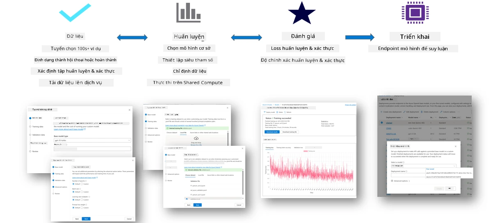

### Tạo dự án mới

1. Đăng nhập vào [Azure AI Foundry](https://ai.azure.com).

1. Chọn **+New project** để tạo dự án mới trong Azure AI Foundry.

    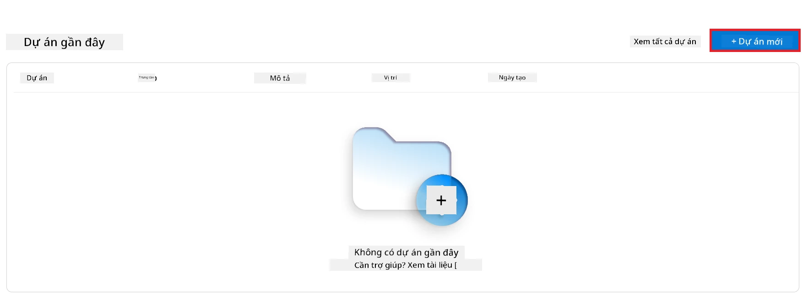

1. Thực hiện các bước sau:

    - Tên **Hub** của dự án. Phải là giá trị duy nhất.
    - Chọn **Hub** để sử dụng (tạo mới nếu cần).

    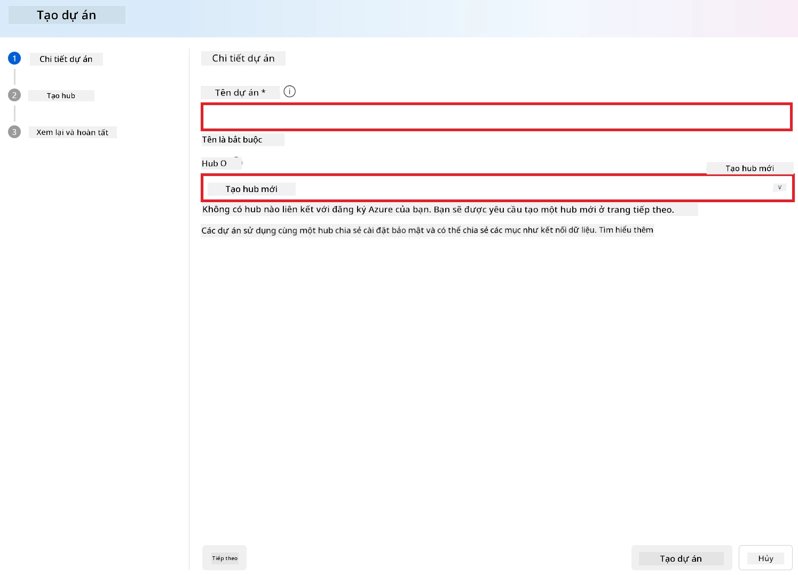

1. Thực hiện các bước sau để tạo một hub mới:

    - Nhập **Hub name**. Phải là giá trị duy nhất.
    - Chọn **Subscription** Azure của bạn.
    - Chọn **Resource group** để sử dụng (tạo mới nếu cần).
    - Chọn **Location** bạn muốn sử dụng.
    - Chọn **Connect Azure AI Services** để sử dụng (tạo mới nếu cần).
    - Chọn **Connect Azure AI Search** và chọn **Skip connecting**.

    

1. Chọn **Next**.
1. Chọn **Create a project**.

### Chuẩn bị dữ liệu

Trước khi tinh chỉnh, thu thập hoặc tạo bộ dữ liệu liên quan đến nhiệm vụ của bạn, như hướng dẫn chat, cặp câu hỏi-trả lời hoặc bất kỳ dữ liệu văn bản phù hợp nào khác. Làm sạch và tiền xử lý dữ liệu này bằng cách loại bỏ nhiễu, xử lý giá trị thiếu và phân tách từ.

### Tinh chỉnh mô hình Phi-3 trong Azure AI Foundry

> [!NOTE]
> Việc tinh chỉnh các mô hình Phi-3 hiện chỉ được hỗ trợ trong các dự án đặt tại khu vực East US 2.

1. Chọn **Model catalog** từ tab bên trái.

1. Gõ *phi-3* vào **thanh tìm kiếm** và chọn mô hình phi-3 bạn muốn sử dụng.

    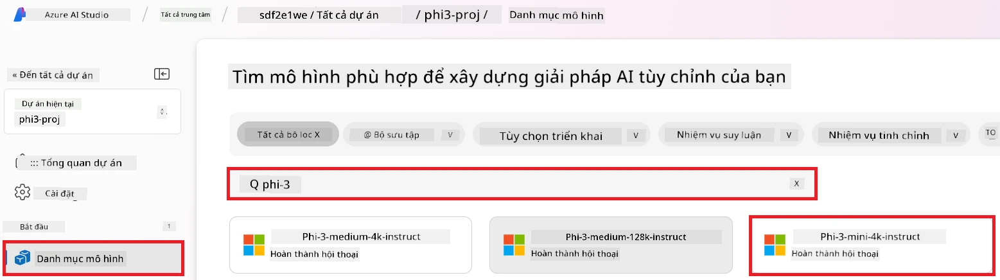

1. Chọn **Fine-tune**.

    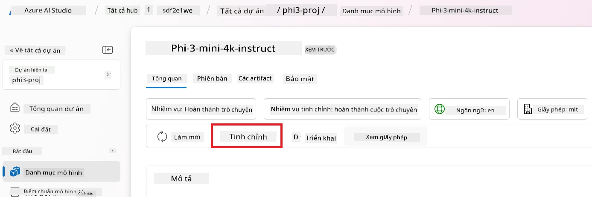

1. Nhập **Tên mô hình đã tinh chỉnh**.

    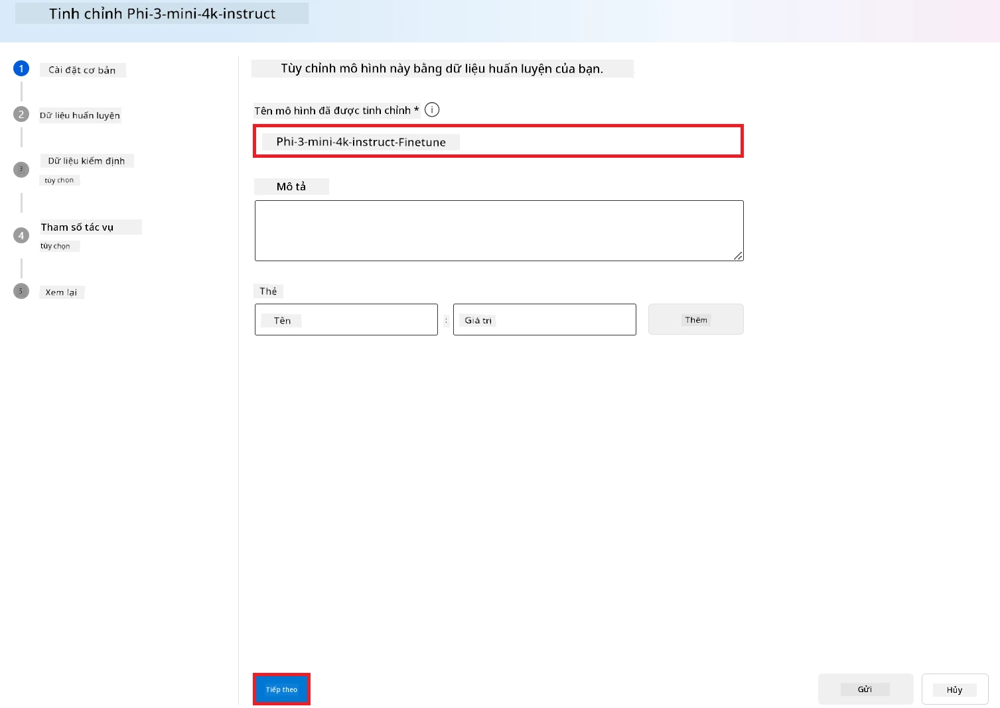

1. Chọn **Next**.

1. Thực hiện các bước sau:

    - Chọn **task type** là **Chat completion**.
    - Chọn **Training data** bạn muốn sử dụng. Bạn có thể tải lên qua dữ liệu của Azure AI Foundry hoặc từ môi trường cục bộ.

    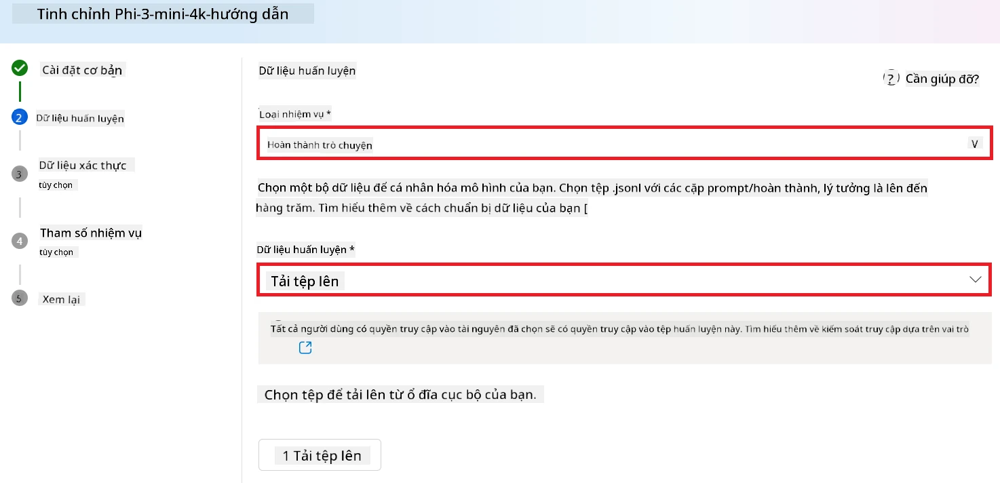

1. Chọn **Next**.

1. Tải lên **Validation data** bạn muốn sử dụng hoặc chọn **Automatic split of training data**.

    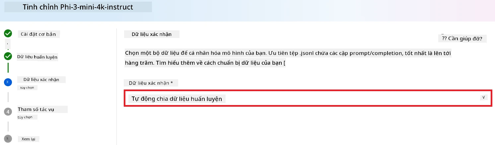

1. Chọn **Next**.

1. Thực hiện các bước sau:

    - Chọn **Batch size multiplier** bạn muốn sử dụng.
    - Chọn **Learning rate** bạn muốn sử dụng.
    - Chọn **Epochs** bạn muốn sử dụng.

    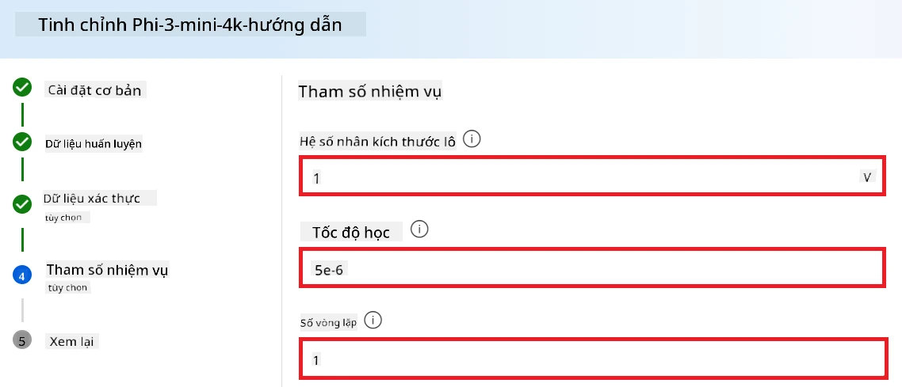

1. Chọn **Submit** để bắt đầu quá trình tinh chỉnh.

    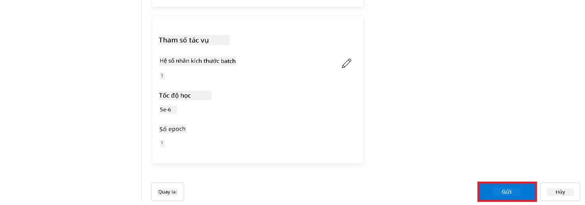

1. Khi mô hình của bạn được tinh chỉnh xong, trạng thái sẽ hiển thị là **Completed**, như hình dưới đây. Bây giờ bạn có thể triển khai mô hình và sử dụng nó trong ứng dụng của mình, trong playground hoặc trong prompt flow. Để biết thêm thông tin, xem [Cách triển khai dòng mô hình ngôn ngữ nhỏ Phi-3 với Azure AI Foundry](https://learn.microsoft.com/azure/ai-studio/how-to/deploy-models-phi-3?tabs=phi-3-5&pivots=programming-language-python).

    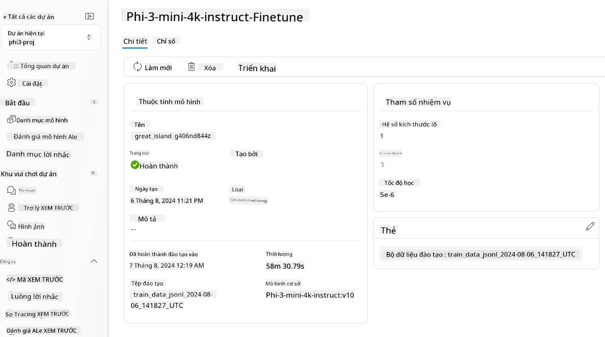

> [!NOTE]
> Để biết thông tin chi tiết hơn về tinh chỉnh Phi-3, vui lòng truy cập [Tinh chỉnh mô hình Phi-3 trong Azure AI Foundry](https://learn.microsoft.com/azure/ai-studio/how-to/fine-tune-phi-3?tabs=phi-3-mini).

## Dọn dẹp các mô hình đã tinh chỉnh

Bạn có thể xóa một mô hình đã tinh chỉnh từ danh sách mô hình tinh chỉnh trong [Azure AI Foundry](https://ai.azure.com) hoặc từ trang chi tiết mô hình. Chọn mô hình đã tinh chỉnh muốn xóa trên trang Fine-tuning, sau đó chọn nút Delete để xóa mô hình đó.

> [!NOTE]
> Bạn không thể xóa mô hình tùy chỉnh nếu nó đang có bản triển khai. Bạn phải xóa bản triển khai mô hình trước khi có thể xóa mô hình tùy chỉnh.

## Chi phí và hạn mức

### Cân nhắc về chi phí và hạn mức cho các mô hình Phi-3 được tinh chỉnh như dịch vụ

Các mô hình Phi được tinh chỉnh như dịch vụ do Microsoft cung cấp và tích hợp với Azure AI Foundry để sử dụng. Bạn có thể xem giá khi [triển khai](https://learn.microsoft.com/azure/ai-studio/how-to/deploy-models-phi-3?tabs=phi-3-5&pivots=programming-language-python) hoặc tinh chỉnh mô hình trong tab Pricing and terms của trình hướng dẫn triển khai.

## Lọc nội dung

Các mô hình được triển khai dưới dạng dịch vụ trả tiền theo mức sử dụng được bảo vệ bởi Azure AI Content Safety. Khi triển khai đến các điểm cuối thời gian thực, bạn có thể chọn không sử dụng tính năng này. Khi Azure AI Content Safety được bật, cả prompt và kết quả trả về đều được kiểm tra qua một tập hợp các mô hình phân loại nhằm phát hiện và ngăn chặn nội dung có hại. Hệ thống lọc nội dung phát hiện và xử lý các loại nội dung có thể gây hại trong cả prompt đầu vào và kết quả đầu ra. Tìm hiểu thêm về [Azure AI Content Safety](https://learn.microsoft.com/azure/ai-studio/concepts/content-filtering).

**Cấu hình Tinh chỉnh**

Các siêu tham số: Định nghĩa các siêu tham số như learning rate, batch size và số epoch huấn luyện.

**Hàm mất mát**

Chọn hàm mất mát phù hợp với nhiệm vụ của bạn (ví dụ: cross-entropy).

**Bộ tối ưu**

Chọn bộ tối ưu (ví dụ: Adam) để cập nhật gradient trong quá trình huấn luyện.

**Quá trình Tinh chỉnh**

- Tải mô hình đã được huấn luyện trước: Tải checkpoint của Phi-3 Mini.
- Thêm các lớp tùy chỉnh: Thêm các lớp đặc thù cho nhiệm vụ (ví dụ: lớp phân loại cho hướng dẫn chat).

**Huấn luyện mô hình**  
Tinh chỉnh mô hình bằng bộ dữ liệu đã chuẩn bị. Theo dõi tiến trình huấn luyện và điều chỉnh siêu tham số khi cần.

**Đánh giá và Kiểm tra**

Bộ kiểm tra: Chia dữ liệu thành bộ huấn luyện và bộ kiểm tra.

**Đánh giá hiệu suất**

Sử dụng các chỉ số như accuracy, F1-score hoặc perplexity để đánh giá hiệu suất mô hình.

## Lưu mô hình đã tinh chỉnh

**Checkpoint**  
Lưu checkpoint của mô hình đã tinh chỉnh để sử dụng sau này.

## Triển khai

- Triển khai dưới dạng dịch vụ web: Triển khai mô hình đã tinh chỉnh dưới dạng dịch vụ web trong Azure AI Foundry.
- Kiểm tra điểm cuối: Gửi các truy vấn thử nghiệm đến điểm cuối đã triển khai để xác minh chức năng.

## Lặp lại và Cải tiến

Lặp lại: Nếu hiệu suất chưa đạt yêu cầu, hãy lặp lại bằng cách điều chỉnh siêu tham số, thêm dữ liệu hoặc tinh chỉnh thêm các epoch.

## Giám sát và Tinh chỉnh

Liên tục giám sát hành vi của mô hình và tinh chỉnh khi cần.

## Tùy chỉnh và Mở rộng

Nhiệm vụ tùy chỉnh: Phi-3 Mini có thể được tinh chỉnh cho nhiều nhiệm vụ khác ngoài hướng dẫn chat. Hãy khám phá các trường hợp sử dụng khác!  
Thử nghiệm: Thử các kiến trúc, kết hợp lớp và kỹ thuật khác nhau để nâng cao hiệu suất.

> [!NOTE]
> Tinh chỉnh là một quá trình lặp đi lặp lại. Hãy thử nghiệm, học hỏi và điều chỉnh mô hình để đạt kết quả tốt nhất cho nhiệm vụ cụ thể của bạn!

**Tuyên bố từ chối trách nhiệm**:  
Tài liệu này đã được dịch bằng dịch vụ dịch thuật AI [Co-op Translator](https://github.com/Azure/co-op-translator). Mặc dù chúng tôi cố gắng đảm bảo độ chính xác, xin lưu ý rằng các bản dịch tự động có thể chứa lỗi hoặc không chính xác. Tài liệu gốc bằng ngôn ngữ gốc của nó nên được coi là nguồn chính xác và đáng tin cậy. Đối với các thông tin quan trọng, nên sử dụng dịch vụ dịch thuật chuyên nghiệp do con người thực hiện. Chúng tôi không chịu trách nhiệm về bất kỳ sự hiểu lầm hoặc giải thích sai nào phát sinh từ việc sử dụng bản dịch này.