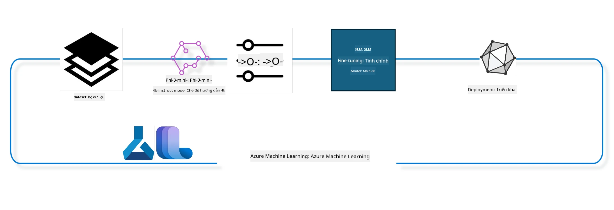

## Cách sử dụng các thành phần chat-completion từ Azure ML system registry để tinh chỉnh mô hình

Trong ví dụ này, chúng ta sẽ thực hiện tinh chỉnh mô hình Phi-3-mini-4k-instruct để hoàn thành cuộc hội thoại giữa 2 người sử dụng bộ dữ liệu ultrachat_200k.



Ví dụ sẽ hướng dẫn bạn cách thực hiện tinh chỉnh bằng Azure ML SDK và Python, sau đó triển khai mô hình đã tinh chỉnh lên endpoint trực tuyến để suy luận thời gian thực.

### Dữ liệu huấn luyện

Chúng ta sẽ sử dụng bộ dữ liệu ultrachat_200k. Đây là phiên bản đã được lọc kỹ của bộ dữ liệu UltraChat và được dùng để huấn luyện Zephyr-7B-β, một mô hình chat 7 tỷ tham số tiên tiến.

### Mô hình

Chúng ta sẽ sử dụng mô hình Phi-3-mini-4k-instruct để minh họa cách người dùng có thể tinh chỉnh mô hình cho nhiệm vụ chat-completion. Nếu bạn mở notebook này từ một thẻ mô hình cụ thể, hãy nhớ thay thế tên mô hình tương ứng.

### Các nhiệm vụ

- Chọn mô hình để tinh chỉnh.
- Chọn và khám phá dữ liệu huấn luyện.
- Cấu hình công việc tinh chỉnh.
- Chạy công việc tinh chỉnh.
- Xem lại các chỉ số huấn luyện và đánh giá.
- Đăng ký mô hình đã tinh chỉnh.
- Triển khai mô hình đã tinh chỉnh để suy luận thời gian thực.
- Dọn dẹp tài nguyên.

## 1. Thiết lập các yêu cầu cần thiết

- Cài đặt các thư viện phụ thuộc
- Kết nối tới AzureML Workspace. Tìm hiểu thêm tại thiết lập xác thực SDK. Thay thế <WORKSPACE_NAME>, <RESOURCE_GROUP> và <SUBSCRIPTION_ID> bên dưới.
- Kết nối tới azureml system registry
- Đặt tên experiment tùy chọn
- Kiểm tra hoặc tạo compute.

> [!NOTE]
> Yêu cầu một node GPU đơn có thể có nhiều card GPU. Ví dụ, một node Standard_NC24rs_v3 có 4 GPU NVIDIA V100 trong khi Standard_NC12s_v3 có 2 GPU NVIDIA V100. Tham khảo tài liệu để biết thông tin này. Số lượng card GPU trên mỗi node được thiết lập trong tham số gpus_per_node bên dưới. Việc thiết lập đúng giá trị này sẽ đảm bảo sử dụng hết tất cả GPU trong node. Các SKU compute GPU được khuyến nghị có thể tìm thấy tại đây và đây.

### Thư viện Python

Cài đặt các thư viện phụ thuộc bằng cách chạy cell dưới đây. Đây không phải bước tùy chọn nếu bạn chạy trong môi trường mới.

```bash
pip install azure-ai-ml
pip install azure-identity
pip install datasets==2.9.0
pip install mlflow
pip install azureml-mlflow
```

### Tương tác với Azure ML

1. Script Python này dùng để tương tác với dịch vụ Azure Machine Learning (Azure ML). Dưới đây là tóm tắt các bước thực hiện:

    - Import các module cần thiết từ các gói azure.ai.ml, azure.identity, và azure.ai.ml.entities. Cũng import module time.

    - Cố gắng xác thực bằng DefaultAzureCredential(), cung cấp trải nghiệm xác thực đơn giản để nhanh chóng phát triển ứng dụng chạy trên đám mây Azure. Nếu thất bại, sẽ chuyển sang InteractiveBrowserCredential(), cung cấp giao diện đăng nhập tương tác.

    - Tiếp theo cố gắng tạo một instance MLClient bằng phương thức from_config, đọc cấu hình từ file config mặc định (config.json). Nếu thất bại, tạo MLClient bằng cách cung cấp thủ công subscription_id, resource_group_name và workspace_name.

    - Tạo thêm một instance MLClient cho Azure ML registry có tên "azureml". Registry này lưu trữ các mô hình, pipeline tinh chỉnh và môi trường.

    - Đặt experiment_name là "chat_completion_Phi-3-mini-4k-instruct".

    - Tạo một timestamp duy nhất bằng cách chuyển thời gian hiện tại (tính bằng giây kể từ epoch, dưới dạng số thực) sang số nguyên rồi sang chuỗi. Timestamp này dùng để tạo tên và phiên bản duy nhất.

    ```python
    # Import necessary modules from Azure ML and Azure Identity
    from azure.ai.ml import MLClient
    from azure.identity import (
        DefaultAzureCredential,
        InteractiveBrowserCredential,
    )
    from azure.ai.ml.entities import AmlCompute
    import time  # Import time module
    
    # Try to authenticate using DefaultAzureCredential
    try:
        credential = DefaultAzureCredential()
        credential.get_token("https://management.azure.com/.default")
    except Exception as ex:  # If DefaultAzureCredential fails, use InteractiveBrowserCredential
        credential = InteractiveBrowserCredential()
    
    # Try to create an MLClient instance using the default config file
    try:
        workspace_ml_client = MLClient.from_config(credential=credential)
    except:  # If that fails, create an MLClient instance by manually providing the details
        workspace_ml_client = MLClient(
            credential,
            subscription_id="<SUBSCRIPTION_ID>",
            resource_group_name="<RESOURCE_GROUP>",
            workspace_name="<WORKSPACE_NAME>",
        )
    
    # Create another MLClient instance for the Azure ML registry named "azureml"
    # This registry is where models, fine-tuning pipelines, and environments are stored
    registry_ml_client = MLClient(credential, registry_name="azureml")
    
    # Set the experiment name
    experiment_name = "chat_completion_Phi-3-mini-4k-instruct"
    
    # Generate a unique timestamp that can be used for names and versions that need to be unique
    timestamp = str(int(time.time()))
    ```

## 2. Chọn mô hình nền tảng để tinh chỉnh

1. Phi-3-mini-4k-instruct là mô hình nhẹ với 3.8 tỷ tham số, tiên tiến, được xây dựng dựa trên các bộ dữ liệu dùng cho Phi-2. Mô hình thuộc họ Phi-3, phiên bản Mini có hai biến thể 4K và 128K, tương ứng với độ dài ngữ cảnh (tính theo token) mà nó hỗ trợ. Chúng ta cần tinh chỉnh mô hình cho mục đích cụ thể để sử dụng. Bạn có thể duyệt các mô hình này trong Model Catalog của AzureML Studio, lọc theo nhiệm vụ chat-completion. Trong ví dụ này, chúng ta dùng mô hình Phi-3-mini-4k-instruct. Nếu bạn mở notebook cho mô hình khác, hãy thay tên và phiên bản mô hình cho phù hợp.

    > [!NOTE]
    > Thuộc tính model id của mô hình. Thuộc tính này sẽ được truyền làm đầu vào cho công việc tinh chỉnh. Nó cũng có thể tìm thấy trong trường Asset ID trên trang chi tiết mô hình trong Model Catalog của AzureML Studio.

2. Script Python này tương tác với dịch vụ Azure Machine Learning (Azure ML). Dưới đây là tóm tắt các bước thực hiện:

    - Đặt model_name là "Phi-3-mini-4k-instruct".

    - Sử dụng phương thức get của thuộc tính models trong đối tượng registry_ml_client để lấy phiên bản mới nhất của mô hình có tên chỉ định từ Azure ML registry. Phương thức get được gọi với hai tham số: tên mô hình và nhãn chỉ định lấy phiên bản mới nhất.

    - In ra console thông báo tên, phiên bản và id của mô hình sẽ được dùng để tinh chỉnh. Phương thức format của chuỗi được dùng để chèn tên, phiên bản và id của mô hình vào thông báo. Các thuộc tính name, version và id được truy cập từ đối tượng foundation_model.

    ```python
    # Set the model name
    model_name = "Phi-3-mini-4k-instruct"
    
    # Get the latest version of the model from the Azure ML registry
    foundation_model = registry_ml_client.models.get(model_name, label="latest")
    
    # Print the model name, version, and id
    # This information is useful for tracking and debugging
    print(
        "\n\nUsing model name: {0}, version: {1}, id: {2} for fine tuning".format(
            foundation_model.name, foundation_model.version, foundation_model.id
        )
    )
    ```

## 3. Tạo compute để sử dụng cho công việc

Công việc finetune CHỈ hoạt động với compute GPU. Kích thước compute phụ thuộc vào độ lớn của mô hình và trong nhiều trường hợp khá khó để xác định compute phù hợp cho công việc. Trong cell này, chúng ta hướng dẫn người dùng chọn compute phù hợp.

> [!NOTE]
> Các compute liệt kê dưới đây hoạt động với cấu hình tối ưu nhất. Bất kỳ thay đổi nào về cấu hình có thể dẫn đến lỗi Cuda Out Of Memory. Trong trường hợp đó, hãy thử nâng cấp compute lên kích thước lớn hơn.

> [!NOTE]
> Khi chọn compute_cluster_size bên dưới, hãy đảm bảo compute có sẵn trong resource group của bạn. Nếu compute cụ thể không có sẵn, bạn có thể gửi yêu cầu để được cấp quyền truy cập tài nguyên compute.

### Kiểm tra mô hình có hỗ trợ tinh chỉnh không

1. Script Python này tương tác với mô hình Azure Machine Learning (Azure ML). Dưới đây là tóm tắt các bước thực hiện:

    - Import module ast, cung cấp các hàm xử lý cây cú pháp trừu tượng của Python.

    - Kiểm tra xem đối tượng foundation_model (đại diện cho mô hình trong Azure ML) có tag tên finetune_compute_allow_list hay không. Tag trong Azure ML là các cặp khóa-giá trị dùng để lọc và sắp xếp mô hình.

    - Nếu tag finetune_compute_allow_list tồn tại, dùng hàm ast.literal_eval để phân tích an toàn giá trị của tag (chuỗi) thành danh sách Python. Danh sách này được gán cho biến computes_allow_list. Sau đó in thông báo yêu cầu tạo compute từ danh sách này.

    - Nếu tag không tồn tại, gán computes_allow_list là None và in thông báo tag finetune_compute_allow_list không có trong các tag của mô hình.

    - Tóm lại, script này kiểm tra một tag cụ thể trong metadata của mô hình, chuyển giá trị tag thành danh sách nếu có, và cung cấp phản hồi cho người dùng.

    ```python
    # Import the ast module, which provides functions to process trees of the Python abstract syntax grammar
    import ast
    
    # Check if the 'finetune_compute_allow_list' tag is present in the model's tags
    if "finetune_compute_allow_list" in foundation_model.tags:
        # If the tag is present, use ast.literal_eval to safely parse the tag's value (a string) into a Python list
        computes_allow_list = ast.literal_eval(
            foundation_model.tags["finetune_compute_allow_list"]
        )  # convert string to python list
        # Print a message indicating that a compute should be created from the list
        print(f"Please create a compute from the above list - {computes_allow_list}")
    else:
        # If the tag is not present, set computes_allow_list to None
        computes_allow_list = None
        # Print a message indicating that the 'finetune_compute_allow_list' tag is not part of the model's tags
        print("`finetune_compute_allow_list` is not part of model tags")
    ```

### Kiểm tra Compute Instance

1. Script Python này tương tác với dịch vụ Azure Machine Learning (Azure ML) và thực hiện một số kiểm tra trên compute instance. Dưới đây là tóm tắt các bước thực hiện:

    - Cố gắng lấy compute instance có tên lưu trong biến compute_cluster từ workspace Azure ML. Nếu trạng thái provisioning của compute instance là "failed", ném ra lỗi ValueError.

    - Kiểm tra nếu computes_allow_list không phải None. Nếu đúng, chuyển tất cả kích thước compute trong danh sách thành chữ thường và kiểm tra xem kích thước compute hiện tại có trong danh sách không. Nếu không, ném lỗi ValueError.

    - Nếu computes_allow_list là None, kiểm tra xem kích thước compute instance có nằm trong danh sách các kích thước GPU VM không được hỗ trợ không. Nếu có, ném lỗi ValueError.

    - Lấy danh sách tất cả kích thước compute có sẵn trong workspace. Duyệt qua danh sách này, với mỗi kích thước compute, kiểm tra nếu tên trùng với kích thước compute hiện tại. Nếu đúng, lấy số lượng GPU của kích thước đó và đặt biến gpu_count_found thành True.

    - Nếu gpu_count_found là True, in ra số lượng GPU trong compute instance. Nếu False, ném lỗi ValueError.

    - Tóm lại, script này thực hiện nhiều kiểm tra trên compute instance trong workspace Azure ML, bao gồm trạng thái provisioning, kích thước so với danh sách cho phép hoặc cấm, và số lượng GPU.

    ```python
    # Print the exception message
    print(e)
    # Raise a ValueError if the compute size is not available in the workspace
    raise ValueError(
        f"WARNING! Compute size {compute_cluster_size} not available in workspace"
    )
    
    # Retrieve the compute instance from the Azure ML workspace
    compute = workspace_ml_client.compute.get(compute_cluster)
    # Check if the provisioning state of the compute instance is "failed"
    if compute.provisioning_state.lower() == "failed":
        # Raise a ValueError if the provisioning state is "failed"
        raise ValueError(
            f"Provisioning failed, Compute '{compute_cluster}' is in failed state. "
            f"please try creating a different compute"
        )
    
    # Check if computes_allow_list is not None
    if computes_allow_list is not None:
        # Convert all compute sizes in computes_allow_list to lowercase
        computes_allow_list_lower_case = [x.lower() for x in computes_allow_list]
        # Check if the size of the compute instance is in computes_allow_list_lower_case
        if compute.size.lower() not in computes_allow_list_lower_case:
            # Raise a ValueError if the size of the compute instance is not in computes_allow_list_lower_case
            raise ValueError(
                f"VM size {compute.size} is not in the allow-listed computes for finetuning"
            )
    else:
        # Define a list of unsupported GPU VM sizes
        unsupported_gpu_vm_list = [
            "standard_nc6",
            "standard_nc12",
            "standard_nc24",
            "standard_nc24r",
        ]
        # Check if the size of the compute instance is in unsupported_gpu_vm_list
        if compute.size.lower() in unsupported_gpu_vm_list:
            # Raise a ValueError if the size of the compute instance is in unsupported_gpu_vm_list
            raise ValueError(
                f"VM size {compute.size} is currently not supported for finetuning"
            )
    
    # Initialize a flag to check if the number of GPUs in the compute instance has been found
    gpu_count_found = False
    # Retrieve a list of all available compute sizes in the workspace
    workspace_compute_sku_list = workspace_ml_client.compute.list_sizes()
    available_sku_sizes = []
    # Iterate over the list of available compute sizes
    for compute_sku in workspace_compute_sku_list:
        available_sku_sizes.append(compute_sku.name)
        # Check if the name of the compute size matches the size of the compute instance
        if compute_sku.name.lower() == compute.size.lower():
            # If it does, retrieve the number of GPUs for that compute size and set gpu_count_found to True
            gpus_per_node = compute_sku.gpus
            gpu_count_found = True
    # If gpu_count_found is True, print the number of GPUs in the compute instance
    if gpu_count_found:
        print(f"Number of GPU's in compute {compute.size}: {gpus_per_node}")
    else:
        # If gpu_count_found is False, raise a ValueError
        raise ValueError(
            f"Number of GPU's in compute {compute.size} not found. Available skus are: {available_sku_sizes}."
            f"This should not happen. Please check the selected compute cluster: {compute_cluster} and try again."
        )
    ```

## 4. Chọn bộ dữ liệu để tinh chỉnh mô hình

1. Chúng ta sử dụng bộ dữ liệu ultrachat_200k. Bộ dữ liệu có bốn phần, phù hợp cho tinh chỉnh có giám sát (supervised fine-tuning - sft). Xếp hạng sinh (generation ranking - gen). Số lượng ví dụ trong mỗi phần được hiển thị như sau:

    ```bash
    train_sft test_sft  train_gen  test_gen
    207865  23110  256032  28304
    ```

1. Một vài cell tiếp theo trình bày chuẩn bị dữ liệu cơ bản cho việc tinh chỉnh:

### Hiển thị một số dòng dữ liệu

Chúng ta muốn mẫu này chạy nhanh, nên lưu các file train_sft, test_sft chứa 5% số dòng đã được lọc. Điều này có nghĩa mô hình tinh chỉnh sẽ có độ chính xác thấp hơn, do đó không nên dùng cho mục đích thực tế.
Script download-dataset.py được dùng để tải bộ dữ liệu ultrachat_200k và chuyển đổi bộ dữ liệu thành định dạng có thể sử dụng cho pipeline tinh chỉnh. Vì bộ dữ liệu lớn, nên ở đây chúng ta chỉ có một phần của bộ dữ liệu.

1. Chạy script dưới đây chỉ tải 5% dữ liệu. Bạn có thể tăng tỷ lệ này bằng cách thay đổi tham số dataset_split_pc thành phần trăm mong muốn.

    > [!NOTE]
    > Một số mô hình ngôn ngữ có mã ngôn ngữ khác nhau, do đó tên cột trong bộ dữ liệu cũng nên phản ánh điều này.

1. Đây là ví dụ về cách dữ liệu nên được lưu trữ
Bộ dữ liệu chat-completion được lưu dưới định dạng parquet với mỗi mục sử dụng cấu trúc sau:

    - Đây là tài liệu JSON (JavaScript Object Notation), một định dạng trao đổi dữ liệu phổ biến. Nó không phải mã thực thi mà là cách lưu trữ và truyền tải dữ liệu. Dưới đây là cấu trúc của nó:

    - "prompt": Khóa này chứa giá trị chuỗi đại diện cho nhiệm vụ hoặc câu hỏi đặt ra cho trợ lý AI.

    - "messages": Khóa này chứa một mảng các đối tượng. Mỗi đối tượng đại diện cho một tin nhắn trong cuộc hội thoại giữa người dùng và trợ lý AI. Mỗi đối tượng tin nhắn có hai khóa:

    - "content": Khóa này chứa giá trị chuỗi đại diện cho nội dung tin nhắn.
    - "role": Khóa này chứa giá trị chuỗi đại diện cho vai trò của thực thể gửi tin nhắn. Có thể là "user" hoặc "assistant".
    - "prompt_id": Khóa này chứa giá trị chuỗi đại diện cho định danh duy nhất của prompt.

1. Trong tài liệu JSON cụ thể này, một cuộc hội thoại được thể hiện, trong đó người dùng yêu cầu trợ lý AI tạo một nhân vật chính cho câu chuyện dystopian. Trợ lý trả lời, sau đó người dùng yêu cầu thêm chi tiết. Trợ lý đồng ý cung cấp thêm chi tiết. Toàn bộ cuộc hội thoại liên kết với một prompt id cụ thể.

    ```python
    {
        // The task or question posed to an AI assistant
        "prompt": "Create a fully-developed protagonist who is challenged to survive within a dystopian society under the rule of a tyrant. ...",
        
        // An array of objects, each representing a message in a conversation between a user and an AI assistant
        "messages":[
            {
                // The content of the user's message
                "content": "Create a fully-developed protagonist who is challenged to survive within a dystopian society under the rule of a tyrant. ...",
                // The role of the entity that sent the message
                "role": "user"
            },
            {
                // The content of the assistant's message
                "content": "Name: Ava\n\n Ava was just 16 years old when the world as she knew it came crashing down. The government had collapsed, leaving behind a chaotic and lawless society. ...",
                // The role of the entity that sent the message
                "role": "assistant"
            },
            {
                // The content of the user's message
                "content": "Wow, Ava's story is so intense and inspiring! Can you provide me with more details.  ...",
                // The role of the entity that sent the message
                "role": "user"
            }, 
            {
                // The content of the assistant's message
                "content": "Certainly! ....",
                // The role of the entity that sent the message
                "role": "assistant"
            }
        ],
        
        // A unique identifier for the prompt
        "prompt_id": "d938b65dfe31f05f80eb8572964c6673eddbd68eff3db6bd234d7f1e3b86c2af"
    }
    ```

### Tải dữ liệu

1. Script Python này dùng để tải bộ dữ liệu bằng một script hỗ trợ tên download-dataset.py. Dưới đây là tóm tắt các bước thực hiện:

    - Import module os, cung cấp cách sử dụng các chức năng phụ thuộc hệ điều hành một cách di động.

    - Sử dụng hàm os.system để chạy script download-dataset.py trong shell với các tham số dòng lệnh cụ thể. Các tham số chỉ định bộ dữ liệu cần tải (HuggingFaceH4/ultrachat_200k), thư mục tải về (ultrachat_200k_dataset), và tỷ lệ phần trăm bộ dữ liệu cần chia (5). Hàm os.system trả về trạng thái thoát của lệnh đã chạy; trạng thái này được lưu trong biến exit_status.

    - Kiểm tra nếu exit_status khác 0. Trong hệ điều hành kiểu Unix, trạng thái thoát 0 thường chỉ lệnh thành công, các số khác chỉ lỗi. Nếu exit_status khác 0, ném ra Exception với thông báo lỗi khi tải bộ dữ liệu.

    - Tóm lại, script này chạy lệnh tải bộ dữ liệu bằng script hỗ trợ, và ném lỗi nếu lệnh thất bại.

    ```python
    # Import the os module, which provides a way of using operating system dependent functionality
    import os
    
    # Use the os.system function to run the download-dataset.py script in the shell with specific command-line arguments
    # The arguments specify the dataset to download (HuggingFaceH4/ultrachat_200k), the directory to download it to (ultrachat_200k_dataset), and the percentage of the dataset to split (5)
    # The os.system function returns the exit status of the command it executed; this status is stored in the exit_status variable
    exit_status = os.system(
        "python ./download-dataset.py --dataset HuggingFaceH4/ultrachat_200k --download_dir ultrachat_200k_dataset --dataset_split_pc 5"
    )
    
    # Check if exit_status is not 0
    # In Unix-like operating systems, an exit status of 0 usually indicates that a command has succeeded, while any other number indicates an error
    # If exit_status is not 0, raise an Exception with a message indicating that there was an error downloading the dataset
    if exit_status != 0:
        raise Exception("Error downloading dataset")
    ```

### Nạp dữ liệu vào DataFrame

1. Script Python này nạp file JSON Lines vào pandas DataFrame và hiển thị 5 dòng đầu tiên. Dưới đây là tóm tắt các bước thực hiện:

    - Import thư viện pandas, thư viện mạnh mẽ để xử lý và phân tích dữ liệu.

    - Đặt giới hạn độ rộng cột tối đa cho pandas hiển thị là 0. Điều này có nghĩa toàn bộ nội dung của mỗi cột sẽ được hiển thị đầy đủ khi in DataFrame, không bị cắt ngắn.

    - Sử dụng hàm pd.read_json để nạp file train_sft.jsonl từ thư mục ultrachat_200k_dataset vào DataFrame. Tham số lines=True chỉ định file ở định dạng JSON Lines, mỗi dòng là một đối tượng JSON riêng biệt.
- Nó sử dụng phương thức head để hiển thị 5 dòng đầu tiên của DataFrame. Nếu DataFrame có ít hơn 5 dòng, nó sẽ hiển thị tất cả các dòng đó.

- Tóm lại, script này đang tải một file JSON Lines vào DataFrame và hiển thị 5 dòng đầu tiên với đầy đủ nội dung cột.

```python
    # Import the pandas library, which is a powerful data manipulation and analysis library
    import pandas as pd
    
    # Set the maximum column width for pandas' display options to 0
    # This means that the full text of each column will be displayed without truncation when the DataFrame is printed
    pd.set_option("display.max_colwidth", 0)
    
    # Use the pd.read_json function to load the train_sft.jsonl file from the ultrachat_200k_dataset directory into a DataFrame
    # The lines=True argument indicates that the file is in JSON Lines format, where each line is a separate JSON object
    df = pd.read_json("./ultrachat_200k_dataset/train_sft.jsonl", lines=True)
    
    # Use the head method to display the first 5 rows of the DataFrame
    # If the DataFrame has less than 5 rows, it will display all of them
    df.head()
    ```

## 5. Gửi công việc fine tuning sử dụng mô hình và dữ liệu làm đầu vào

Tạo công việc sử dụng thành phần pipeline chat-completion. Tìm hiểu thêm về tất cả các tham số được hỗ trợ cho fine tuning.

### Định nghĩa các tham số finetune

1. Các tham số finetune có thể được chia thành 2 nhóm - tham số huấn luyện và tham số tối ưu hóa

1. Tham số huấn luyện định nghĩa các khía cạnh của quá trình huấn luyện như -

    - Bộ tối ưu, bộ lập lịch sử dụng
    - Chỉ số để tối ưu fine tune
    - Số bước huấn luyện, kích thước batch, v.v.
    - Tham số tối ưu hóa giúp tối ưu bộ nhớ GPU và sử dụng hiệu quả tài nguyên tính toán.

1. Dưới đây là một số tham số thuộc nhóm này. Tham số tối ưu hóa khác nhau tùy theo mô hình và được đóng gói cùng mô hình để xử lý các biến thể này.

    - Bật deepspeed và LoRA
    - Bật huấn luyện với độ chính xác hỗn hợp
    - Bật huấn luyện đa node


> [!NOTE]
> Fine tuning có giám sát có thể dẫn đến mất sự đồng bộ hoặc quên kiến thức nghiêm trọng. Chúng tôi khuyến nghị kiểm tra vấn đề này và chạy giai đoạn căn chỉnh sau khi fine tune.

### Tham số Fine Tuning

1. Script Python này thiết lập các tham số cho việc fine-tuning một mô hình học máy. Dưới đây là phân tích chi tiết:

    - Nó thiết lập các tham số huấn luyện mặc định như số epoch, kích thước batch cho huấn luyện và đánh giá, tốc độ học, và loại bộ lập lịch tốc độ học.

    - Nó thiết lập các tham số tối ưu hóa mặc định như có áp dụng Layer-wise Relevance Propagation (LoRa) và DeepSpeed hay không, và giai đoạn DeepSpeed.

    - Nó kết hợp các tham số huấn luyện và tối ưu hóa thành một dictionary duy nhất gọi là finetune_parameters.

    - Nó kiểm tra xem foundation_model có tham số mặc định riêng cho mô hình hay không. Nếu có, nó in cảnh báo và cập nhật finetune_parameters với các tham số mặc định riêng của mô hình. Hàm ast.literal_eval được dùng để chuyển đổi tham số mặc định từ chuỗi sang dictionary Python.

    - Nó in ra bộ tham số fine-tuning cuối cùng sẽ được sử dụng cho lần chạy.

    - Tóm lại, script này thiết lập và hiển thị các tham số cho fine-tuning mô hình học máy, với khả năng ghi đè tham số mặc định bằng tham số riêng của mô hình.

```python
    # Set up default training parameters such as the number of training epochs, batch sizes for training and evaluation, learning rate, and learning rate scheduler type
    training_parameters = dict(
        num_train_epochs=3,
        per_device_train_batch_size=1,
        per_device_eval_batch_size=1,
        learning_rate=5e-6,
        lr_scheduler_type="cosine",
    )
    
    # Set up default optimization parameters such as whether to apply Layer-wise Relevance Propagation (LoRa) and DeepSpeed, and the DeepSpeed stage
    optimization_parameters = dict(
        apply_lora="true",
        apply_deepspeed="true",
        deepspeed_stage=2,
    )
    
    # Combine the training and optimization parameters into a single dictionary called finetune_parameters
    finetune_parameters = {**training_parameters, **optimization_parameters}
    
    # Check if the foundation_model has any model-specific default parameters
    # If it does, print a warning message and update the finetune_parameters dictionary with these model-specific defaults
    # The ast.literal_eval function is used to convert the model-specific defaults from a string to a Python dictionary
    if "model_specific_defaults" in foundation_model.tags:
        print("Warning! Model specific defaults exist. The defaults could be overridden.")
        finetune_parameters.update(
            ast.literal_eval(  # convert string to python dict
                foundation_model.tags["model_specific_defaults"]
            )
        )
    
    # Print the final set of fine-tuning parameters that will be used for the run
    print(
        f"The following finetune parameters are going to be set for the run: {finetune_parameters}"
    )
    ```

### Pipeline Huấn luyện

1. Script Python này định nghĩa một hàm để tạo tên hiển thị cho pipeline huấn luyện máy học, sau đó gọi hàm này để tạo và in tên hiển thị. Dưới đây là phân tích chi tiết:

1. Hàm get_pipeline_display_name được định nghĩa. Hàm này tạo tên hiển thị dựa trên các tham số liên quan đến pipeline huấn luyện.

1. Bên trong hàm, nó tính tổng kích thước batch bằng cách nhân kích thước batch trên mỗi thiết bị, số bước tích lũy gradient, số GPU trên mỗi node, và số node dùng cho fine-tuning.

1. Nó lấy các tham số khác như loại bộ lập lịch tốc độ học, có áp dụng DeepSpeed hay không, giai đoạn DeepSpeed, có áp dụng LoRa hay không, giới hạn số checkpoint mô hình giữ lại, và độ dài chuỗi tối đa.

1. Nó tạo một chuỗi gồm tất cả các tham số này, ngăn cách bằng dấu gạch ngang. Nếu áp dụng DeepSpeed hoặc LoRa, chuỗi sẽ bao gồm "ds" kèm giai đoạn DeepSpeed hoặc "lora". Nếu không, sẽ là "nods" hoặc "nolora".

1. Hàm trả về chuỗi này, dùng làm tên hiển thị cho pipeline huấn luyện.

1. Sau khi định nghĩa hàm, nó được gọi để tạo tên hiển thị và in ra.

1. Tóm lại, script này tạo tên hiển thị cho pipeline huấn luyện máy học dựa trên các tham số khác nhau, rồi in tên đó.

```python
    # Define a function to generate a display name for the training pipeline
    def get_pipeline_display_name():
        # Calculate the total batch size by multiplying the per-device batch size, the number of gradient accumulation steps, the number of GPUs per node, and the number of nodes used for fine-tuning
        batch_size = (
            int(finetune_parameters.get("per_device_train_batch_size", 1))
            * int(finetune_parameters.get("gradient_accumulation_steps", 1))
            * int(gpus_per_node)
            * int(finetune_parameters.get("num_nodes_finetune", 1))
        )
        # Retrieve the learning rate scheduler type
        scheduler = finetune_parameters.get("lr_scheduler_type", "linear")
        # Retrieve whether DeepSpeed is applied
        deepspeed = finetune_parameters.get("apply_deepspeed", "false")
        # Retrieve the DeepSpeed stage
        ds_stage = finetune_parameters.get("deepspeed_stage", "2")
        # If DeepSpeed is applied, include "ds" followed by the DeepSpeed stage in the display name; if not, include "nods"
        if deepspeed == "true":
            ds_string = f"ds{ds_stage}"
        else:
            ds_string = "nods"
        # Retrieve whether Layer-wise Relevance Propagation (LoRa) is applied
        lora = finetune_parameters.get("apply_lora", "false")
        # If LoRa is applied, include "lora" in the display name; if not, include "nolora"
        if lora == "true":
            lora_string = "lora"
        else:
            lora_string = "nolora"
        # Retrieve the limit on the number of model checkpoints to keep
        save_limit = finetune_parameters.get("save_total_limit", -1)
        # Retrieve the maximum sequence length
        seq_len = finetune_parameters.get("max_seq_length", -1)
        # Construct the display name by concatenating all these parameters, separated by hyphens
        return (
            model_name
            + "-"
            + "ultrachat"
            + "-"
            + f"bs{batch_size}"
            + "-"
            + f"{scheduler}"
            + "-"
            + ds_string
            + "-"
            + lora_string
            + f"-save_limit{save_limit}"
            + f"-seqlen{seq_len}"
        )
    
    # Call the function to generate the display name
    pipeline_display_name = get_pipeline_display_name()
    # Print the display name
    print(f"Display name used for the run: {pipeline_display_name}")
    ```

### Cấu hình Pipeline

Script Python này định nghĩa và cấu hình một pipeline học máy sử dụng Azure Machine Learning SDK. Dưới đây là phân tích chi tiết:

1. Nó nhập các module cần thiết từ Azure AI ML SDK.

1. Nó lấy một thành phần pipeline tên là "chat_completion_pipeline" từ registry.

1. Nó định nghĩa một pipeline job sử dụng decorator `@pipeline` và hàm `create_pipeline`. Tên pipeline được đặt là `pipeline_display_name`.

1. Bên trong hàm `create_pipeline`, nó khởi tạo thành phần pipeline đã lấy với các tham số khác nhau, bao gồm đường dẫn mô hình, các cụm tính toán cho các giai đoạn khác nhau, các phân tách dữ liệu cho huấn luyện và kiểm thử, số GPU dùng cho fine-tuning, và các tham số fine-tuning khác.

1. Nó ánh xạ đầu ra của công việc fine-tuning sang đầu ra của pipeline job. Việc này giúp mô hình fine-tuned dễ dàng được đăng ký, điều cần thiết để triển khai mô hình lên endpoint trực tuyến hoặc batch.

1. Nó tạo một thể hiện của pipeline bằng cách gọi hàm `create_pipeline`.

1. Nó đặt thuộc tính `force_rerun` của pipeline thành `True`, nghĩa là không sử dụng kết quả cache từ các công việc trước đó.

1. Nó đặt thuộc tính `continue_on_step_failure` của pipeline thành `False`, nghĩa là pipeline sẽ dừng nếu bất kỳ bước nào thất bại.

1. Tóm lại, script này định nghĩa và cấu hình một pipeline học máy cho tác vụ chat completion sử dụng Azure Machine Learning SDK.

```python
    # Import necessary modules from the Azure AI ML SDK
    from azure.ai.ml.dsl import pipeline
    from azure.ai.ml import Input
    
    # Fetch the pipeline component named "chat_completion_pipeline" from the registry
    pipeline_component_func = registry_ml_client.components.get(
        name="chat_completion_pipeline", label="latest"
    )
    
    # Define the pipeline job using the @pipeline decorator and the function create_pipeline
    # The name of the pipeline is set to pipeline_display_name
    @pipeline(name=pipeline_display_name)
    def create_pipeline():
        # Initialize the fetched pipeline component with various parameters
        # These include the model path, compute clusters for different stages, dataset splits for training and testing, the number of GPUs to use for fine-tuning, and other fine-tuning parameters
        chat_completion_pipeline = pipeline_component_func(
            mlflow_model_path=foundation_model.id,
            compute_model_import=compute_cluster,
            compute_preprocess=compute_cluster,
            compute_finetune=compute_cluster,
            compute_model_evaluation=compute_cluster,
            # Map the dataset splits to parameters
            train_file_path=Input(
                type="uri_file", path="./ultrachat_200k_dataset/train_sft.jsonl"
            ),
            test_file_path=Input(
                type="uri_file", path="./ultrachat_200k_dataset/test_sft.jsonl"
            ),
            # Training settings
            number_of_gpu_to_use_finetuning=gpus_per_node,  # Set to the number of GPUs available in the compute
            **finetune_parameters
        )
        return {
            # Map the output of the fine tuning job to the output of pipeline job
            # This is done so that we can easily register the fine tuned model
            # Registering the model is required to deploy the model to an online or batch endpoint
            "trained_model": chat_completion_pipeline.outputs.mlflow_model_folder
        }
    
    # Create an instance of the pipeline by calling the create_pipeline function
    pipeline_object = create_pipeline()
    
    # Don't use cached results from previous jobs
    pipeline_object.settings.force_rerun = True
    
    # Set continue on step failure to False
    # This means that the pipeline will stop if any step fails
    pipeline_object.settings.continue_on_step_failure = False
    ```

### Gửi công việc

1. Script Python này gửi một công việc pipeline học máy đến workspace Azure Machine Learning và chờ công việc hoàn thành. Dưới đây là phân tích chi tiết:

    - Nó gọi phương thức create_or_update của đối tượng jobs trong workspace_ml_client để gửi công việc pipeline. Pipeline được chạy được chỉ định bởi pipeline_object, và thí nghiệm chạy công việc được chỉ định bởi experiment_name.

    - Sau đó, nó gọi phương thức stream của đối tượng jobs trong workspace_ml_client để chờ công việc pipeline hoàn thành. Công việc chờ được chỉ định bởi thuộc tính name của pipeline_job.

    - Tóm lại, script này gửi một công việc pipeline học máy đến workspace Azure Machine Learning và chờ công việc hoàn thành.

```python
    # Submit the pipeline job to the Azure Machine Learning workspace
    # The pipeline to be run is specified by pipeline_object
    # The experiment under which the job is run is specified by experiment_name
    pipeline_job = workspace_ml_client.jobs.create_or_update(
        pipeline_object, experiment_name=experiment_name
    )
    
    # Wait for the pipeline job to complete
    # The job to wait for is specified by the name attribute of the pipeline_job object
    workspace_ml_client.jobs.stream(pipeline_job.name)
    ```

## 6. Đăng ký mô hình fine tuned với workspace

Chúng ta sẽ đăng ký mô hình từ đầu ra của công việc fine tuning. Việc này sẽ theo dõi nguồn gốc giữa mô hình fine tuned và công việc fine tuning. Công việc fine tuning cũng theo dõi nguồn gốc đến mô hình nền tảng, dữ liệu và mã huấn luyện.

### Đăng ký mô hình ML

1. Script Python này đăng ký một mô hình học máy đã được huấn luyện trong pipeline Azure Machine Learning. Dưới đây là phân tích chi tiết:

    - Nó nhập các module cần thiết từ Azure AI ML SDK.

    - Nó kiểm tra xem đầu ra trained_model có sẵn từ pipeline job hay không bằng cách gọi phương thức get của đối tượng jobs trong workspace_ml_client và truy cập thuộc tính outputs.

    - Nó tạo đường dẫn đến mô hình đã huấn luyện bằng cách định dạng chuỗi với tên pipeline job và tên đầu ra ("trained_model").

    - Nó định nghĩa tên cho mô hình fine-tuned bằng cách thêm "-ultrachat-200k" vào tên mô hình gốc và thay thế các dấu gạch chéo bằng dấu gạch ngang.

    - Nó chuẩn bị đăng ký mô hình bằng cách tạo một đối tượng Model với các tham số khác nhau, bao gồm đường dẫn mô hình, loại mô hình (MLflow model), tên và phiên bản mô hình, và mô tả mô hình.

    - Nó đăng ký mô hình bằng cách gọi phương thức create_or_update của đối tượng models trong workspace_ml_client với đối tượng Model làm đối số.

    - Nó in ra mô hình đã đăng ký.

1. Tóm lại, script này đăng ký một mô hình học máy đã được huấn luyện trong pipeline Azure Machine Learning.

```python
    # Import necessary modules from the Azure AI ML SDK
    from azure.ai.ml.entities import Model
    from azure.ai.ml.constants import AssetTypes
    
    # Check if the `trained_model` output is available from the pipeline job
    print("pipeline job outputs: ", workspace_ml_client.jobs.get(pipeline_job.name).outputs)
    
    # Construct a path to the trained model by formatting a string with the name of the pipeline job and the name of the output ("trained_model")
    model_path_from_job = "azureml://jobs/{0}/outputs/{1}".format(
        pipeline_job.name, "trained_model"
    )
    
    # Define a name for the fine-tuned model by appending "-ultrachat-200k" to the original model name and replacing any slashes with hyphens
    finetuned_model_name = model_name + "-ultrachat-200k"
    finetuned_model_name = finetuned_model_name.replace("/", "-")
    
    print("path to register model: ", model_path_from_job)
    
    # Prepare to register the model by creating a Model object with various parameters
    # These include the path to the model, the type of the model (MLflow model), the name and version of the model, and a description of the model
    prepare_to_register_model = Model(
        path=model_path_from_job,
        type=AssetTypes.MLFLOW_MODEL,
        name=finetuned_model_name,
        version=timestamp,  # Use timestamp as version to avoid version conflict
        description=model_name + " fine tuned model for ultrachat 200k chat-completion",
    )
    
    print("prepare to register model: \n", prepare_to_register_model)
    
    # Register the model by calling the create_or_update method of the models object in the workspace_ml_client with the Model object as the argument
    registered_model = workspace_ml_client.models.create_or_update(
        prepare_to_register_model
    )
    
    # Print the registered model
    print("registered model: \n", registered_model)
    ```

## 7. Triển khai mô hình fine tuned lên endpoint trực tuyến

Endpoint trực tuyến cung cấp API REST bền vững để tích hợp với các ứng dụng cần sử dụng mô hình.

### Quản lý Endpoint

1. Script Python này tạo một endpoint trực tuyến được quản lý trong Azure Machine Learning cho một mô hình đã đăng ký. Dưới đây là phân tích chi tiết:

    - Nó nhập các module cần thiết từ Azure AI ML SDK.

    - Nó định nghĩa một tên duy nhất cho endpoint trực tuyến bằng cách thêm dấu thời gian vào chuỗi "ultrachat-completion-".

    - Nó chuẩn bị tạo endpoint trực tuyến bằng cách tạo một đối tượng ManagedOnlineEndpoint với các tham số khác nhau, bao gồm tên endpoint, mô tả endpoint, và chế độ xác thực ("key").

    - Nó tạo endpoint trực tuyến bằng cách gọi phương thức begin_create_or_update của workspace_ml_client với đối tượng ManagedOnlineEndpoint làm đối số. Sau đó chờ quá trình tạo hoàn thành bằng cách gọi phương thức wait.

1. Tóm lại, script này tạo một endpoint trực tuyến được quản lý trong Azure Machine Learning cho một mô hình đã đăng ký.

```python
    # Import necessary modules from the Azure AI ML SDK
    from azure.ai.ml.entities import (
        ManagedOnlineEndpoint,
        ManagedOnlineDeployment,
        ProbeSettings,
        OnlineRequestSettings,
    )
    
    # Define a unique name for the online endpoint by appending a timestamp to the string "ultrachat-completion-"
    online_endpoint_name = "ultrachat-completion-" + timestamp
    
    # Prepare to create the online endpoint by creating a ManagedOnlineEndpoint object with various parameters
    # These include the name of the endpoint, a description of the endpoint, and the authentication mode ("key")
    endpoint = ManagedOnlineEndpoint(
        name=online_endpoint_name,
        description="Online endpoint for "
        + registered_model.name
        + ", fine tuned model for ultrachat-200k-chat-completion",
        auth_mode="key",
    )
    
    # Create the online endpoint by calling the begin_create_or_update method of the workspace_ml_client with the ManagedOnlineEndpoint object as the argument
    # Then wait for the creation operation to complete by calling the wait method
    workspace_ml_client.begin_create_or_update(endpoint).wait()
    ```

> [!NOTE]
> Bạn có thể tìm danh sách các SKU được hỗ trợ để triển khai tại đây - [Managed online endpoints SKU list](https://learn.microsoft.com/azure/machine-learning/reference-managed-online-endpoints-vm-sku-list)

### Triển khai mô hình ML

1. Script Python này triển khai một mô hình học máy đã đăng ký lên một endpoint trực tuyến được quản lý trong Azure Machine Learning. Dưới đây là phân tích chi tiết:

    - Nó nhập module ast, cung cấp các hàm xử lý cây cú pháp trừu tượng của Python.

    - Nó đặt loại instance cho triển khai là "Standard_NC6s_v3".

    - Nó kiểm tra xem tag inference_compute_allow_list có trong foundation model hay không. Nếu có, nó chuyển giá trị tag từ chuỗi sang danh sách Python và gán cho inference_computes_allow_list. Nếu không, nó đặt inference_computes_allow_list là None.

    - Nó kiểm tra xem loại instance được chỉ định có nằm trong danh sách cho phép hay không. Nếu không, nó in thông báo yêu cầu người dùng chọn loại instance trong danh sách cho phép.

    - Nó chuẩn bị tạo triển khai bằng cách tạo một đối tượng ManagedOnlineDeployment với các tham số khác nhau, bao gồm tên triển khai, tên endpoint, ID mô hình, loại và số lượng instance, cài đặt kiểm tra trạng thái (liveness probe), và cài đặt yêu cầu.

    - Nó tạo triển khai bằng cách gọi phương thức begin_create_or_update của workspace_ml_client với đối tượng ManagedOnlineDeployment làm đối số. Sau đó chờ quá trình tạo hoàn thành bằng cách gọi phương thức wait.

    - Nó đặt lưu lượng của endpoint để chuyển 100% lưu lượng đến triển khai "demo".

    - Nó cập nhật endpoint bằng cách gọi phương thức begin_create_or_update của workspace_ml_client với đối tượng endpoint làm đối số. Sau đó chờ quá trình cập nhật hoàn thành bằng cách gọi phương thức result.

1. Tóm lại, script này triển khai một mô hình học máy đã đăng ký lên một endpoint trực tuyến được quản lý trong Azure Machine Learning.

```python
    # Import the ast module, which provides functions to process trees of the Python abstract syntax grammar
    import ast
    
    # Set the instance type for the deployment
    instance_type = "Standard_NC6s_v3"
    
    # Check if the `inference_compute_allow_list` tag is present in the foundation model
    if "inference_compute_allow_list" in foundation_model.tags:
        # If it is, convert the tag value from a string to a Python list and assign it to `inference_computes_allow_list`
        inference_computes_allow_list = ast.literal_eval(
            foundation_model.tags["inference_compute_allow_list"]
        )
        print(f"Please create a compute from the above list - {computes_allow_list}")
    else:
        # If it's not, set `inference_computes_allow_list` to `None`
        inference_computes_allow_list = None
        print("`inference_compute_allow_list` is not part of model tags")
    
    # Check if the specified instance type is in the allow list
    if (
        inference_computes_allow_list is not None
        and instance_type not in inference_computes_allow_list
    ):
        print(
            f"`instance_type` is not in the allow listed compute. Please select a value from {inference_computes_allow_list}"
        )
    
    # Prepare to create the deployment by creating a `ManagedOnlineDeployment` object with various parameters
    demo_deployment = ManagedOnlineDeployment(
        name="demo",
        endpoint_name=online_endpoint_name,
        model=registered_model.id,
        instance_type=instance_type,
        instance_count=1,
        liveness_probe=ProbeSettings(initial_delay=600),
        request_settings=OnlineRequestSettings(request_timeout_ms=90000),
    )
    
    # Create the deployment by calling the `begin_create_or_update` method of the `workspace_ml_client` with the `ManagedOnlineDeployment` object as the argument
    # Then wait for the creation operation to complete by calling the `wait` method
    workspace_ml_client.online_deployments.begin_create_or_update(demo_deployment).wait()
    
    # Set the traffic of the endpoint to direct 100% of the traffic to the "demo" deployment
    endpoint.traffic = {"demo": 100}
    
    # Update the endpoint by calling the `begin_create_or_update` method of the `workspace_ml_client` with the `endpoint` object as the argument
    # Then wait for the update operation to complete by calling the `result` method
    workspace_ml_client.begin_create_or_update(endpoint).result()
    ```

## 8. Kiểm thử endpoint với dữ liệu mẫu

Chúng ta sẽ lấy một số dữ liệu mẫu từ bộ dữ liệu kiểm thử và gửi đến endpoint trực tuyến để suy luận. Sau đó hiển thị nhãn dự đoán cùng với nhãn thực tế.

### Đọc kết quả

1. Script Python này đọc một file JSON Lines vào pandas DataFrame, lấy mẫu ngẫu nhiên, và đặt lại chỉ số. Dưới đây là phân tích chi tiết:

    - Nó đọc file ./ultrachat_200k_dataset/test_gen.jsonl vào pandas DataFrame. Hàm read_json được sử dụng với tham số lines=True vì file ở định dạng JSON Lines, mỗi dòng là một đối tượng JSON riêng biệt.

    - Nó lấy một mẫu ngẫu nhiên gồm 1 dòng từ DataFrame. Hàm sample được sử dụng với tham số n=1 để chỉ định số dòng ngẫu nhiên cần chọn.

    - Nó đặt lại chỉ số của DataFrame. Hàm reset_index được sử dụng với tham số drop=True để loại bỏ chỉ số cũ và thay thế bằng chỉ số mặc định kiểu số nguyên.

    - Nó hiển thị 2 dòng đầu tiên của DataFrame bằng hàm head với tham số 2. Tuy nhiên, vì DataFrame chỉ có một dòng sau khi lấy mẫu, nên chỉ dòng đó được hiển thị.

1. Tóm lại, script này đọc file JSON Lines vào pandas DataFrame, lấy mẫu ngẫu nhiên 1 dòng, đặt lại chỉ số, và hiển thị dòng đầu tiên.

```python
    # Import pandas library
    import pandas as pd
    
    # Read the JSON Lines file './ultrachat_200k_dataset/test_gen.jsonl' into a pandas DataFrame
    # The 'lines=True' argument indicates that the file is in JSON Lines format, where each line is a separate JSON object
    test_df = pd.read_json("./ultrachat_200k_dataset/test_gen.jsonl", lines=True)
    
    # Take a random sample of 1 row from the DataFrame
    # The 'n=1' argument specifies the number of random rows to select
    test_df = test_df.sample(n=1)
    
    # Reset the index of the DataFrame
    # The 'drop=True' argument indicates that the original index should be dropped and replaced with a new index of default integer values
    # The 'inplace=True' argument indicates that the DataFrame should be modified in place (without creating a new object)
    test_df.reset_index(drop=True, inplace=True)
    
    # Display the first 2 rows of the DataFrame
    # However, since the DataFrame only contains one row after the sampling, this will only display that one row
    test_df.head(2)
    ```

### Tạo đối tượng JSON

1. Script Python này tạo một đối tượng JSON với các tham số cụ thể và lưu vào file. Dưới đây là phân tích chi tiết:

    - Nó nhập module json, cung cấp các hàm làm việc với dữ liệu JSON.

    - Nó tạo một dictionary parameters với các khóa và giá trị đại diện cho tham số cho mô hình học máy. Các khóa là "temperature", "top_p", "do_sample", và "max_new_tokens", với các giá trị tương ứng là 0.6, 0.9, True, và 200.

    - Nó tạo một dictionary khác test_json với hai khóa: "input_data" và "params". Giá trị của "input_data" là một dictionary khác với các khóa "input_string" và "parameters". Giá trị của "input_string" là một danh sách chứa tin nhắn đầu tiên từ DataFrame test_df. Giá trị của "parameters" là dictionary parameters đã tạo trước đó. Giá trị của "params" là một dictionary rỗng.
- Nó mở một tệp có tên sample_score.json

```python
    # Import the json module, which provides functions to work with JSON data
    import json
    
    # Create a dictionary `parameters` with keys and values that represent parameters for a machine learning model
    # The keys are "temperature", "top_p", "do_sample", and "max_new_tokens", and their corresponding values are 0.6, 0.9, True, and 200 respectively
    parameters = {
        "temperature": 0.6,
        "top_p": 0.9,
        "do_sample": True,
        "max_new_tokens": 200,
    }
    
    # Create another dictionary `test_json` with two keys: "input_data" and "params"
    # The value of "input_data" is another dictionary with keys "input_string" and "parameters"
    # The value of "input_string" is a list containing the first message from the `test_df` DataFrame
    # The value of "parameters" is the `parameters` dictionary created earlier
    # The value of "params" is an empty dictionary
    test_json = {
        "input_data": {
            "input_string": [test_df["messages"][0]],
            "parameters": parameters,
        },
        "params": {},
    }
    
    # Open a file named `sample_score.json` in the `./ultrachat_200k_dataset` directory in write mode
    with open("./ultrachat_200k_dataset/sample_score.json", "w") as f:
        # Write the `test_json` dictionary to the file in JSON format using the `json.dump` function
        json.dump(test_json, f)
    ```

### Gọi Endpoint

1. Script Python này đang gọi một endpoint trực tuyến trong Azure Machine Learning để đánh giá một tệp JSON. Dưới đây là phân tích những gì nó thực hiện:

    - Nó gọi phương thức invoke của thuộc tính online_endpoints trong đối tượng workspace_ml_client. Phương thức này được dùng để gửi yêu cầu đến một endpoint trực tuyến và nhận phản hồi.

    - Nó chỉ định tên của endpoint và deployment thông qua các tham số endpoint_name và deployment_name. Trong trường hợp này, tên endpoint được lưu trong biến online_endpoint_name và tên deployment là "demo".

    - Nó chỉ định đường dẫn đến tệp JSON cần đánh giá thông qua tham số request_file. Ở đây, tệp là ./ultrachat_200k_dataset/sample_score.json.

    - Nó lưu phản hồi từ endpoint vào biến response.

    - Nó in ra phản hồi thô.

1. Tóm lại, script này gọi một endpoint trực tuyến trong Azure Machine Learning để đánh giá một tệp JSON và in ra phản hồi.

```python
    # Invoke the online endpoint in Azure Machine Learning to score the `sample_score.json` file
    # The `invoke` method of the `online_endpoints` property of the `workspace_ml_client` object is used to send a request to an online endpoint and get a response
    # The `endpoint_name` argument specifies the name of the endpoint, which is stored in the `online_endpoint_name` variable
    # The `deployment_name` argument specifies the name of the deployment, which is "demo"
    # The `request_file` argument specifies the path to the JSON file to be scored, which is `./ultrachat_200k_dataset/sample_score.json`
    response = workspace_ml_client.online_endpoints.invoke(
        endpoint_name=online_endpoint_name,
        deployment_name="demo",
        request_file="./ultrachat_200k_dataset/sample_score.json",
    )
    
    # Print the raw response from the endpoint
    print("raw response: \n", response, "\n")
    ```

## 9. Xóa endpoint trực tuyến

1. Đừng quên xóa endpoint trực tuyến, nếu không bạn sẽ để đồng hồ tính phí chạy cho tài nguyên tính toán mà endpoint sử dụng. Dòng mã Python này đang xóa một endpoint trực tuyến trong Azure Machine Learning. Dưới đây là phân tích những gì nó thực hiện:

    - Nó gọi phương thức begin_delete của thuộc tính online_endpoints trong đối tượng workspace_ml_client. Phương thức này được dùng để bắt đầu quá trình xóa một endpoint trực tuyến.

    - Nó chỉ định tên của endpoint cần xóa thông qua tham số name. Trong trường hợp này, tên endpoint được lưu trong biến online_endpoint_name.

    - Nó gọi phương thức wait để chờ cho quá trình xóa hoàn tất. Đây là một thao tác chặn, nghĩa là script sẽ không tiếp tục cho đến khi việc xóa kết thúc.

    - Tóm lại, dòng mã này bắt đầu quá trình xóa một endpoint trực tuyến trong Azure Machine Learning và chờ cho đến khi thao tác hoàn thành.

```python
    # Delete the online endpoint in Azure Machine Learning
    # The `begin_delete` method of the `online_endpoints` property of the `workspace_ml_client` object is used to start the deletion of an online endpoint
    # The `name` argument specifies the name of the endpoint to be deleted, which is stored in the `online_endpoint_name` variable
    # The `wait` method is called to wait for the deletion operation to complete. This is a blocking operation, meaning that it will prevent the script from continuing until the deletion is finished
    workspace_ml_client.online_endpoints.begin_delete(name=online_endpoint_name).wait()
    ```

**Tuyên bố từ chối trách nhiệm**:  
Tài liệu này đã được dịch bằng dịch vụ dịch thuật AI [Co-op Translator](https://github.com/Azure/co-op-translator). Mặc dù chúng tôi cố gắng đảm bảo độ chính xác, xin lưu ý rằng các bản dịch tự động có thể chứa lỗi hoặc không chính xác. Tài liệu gốc bằng ngôn ngữ gốc của nó nên được coi là nguồn chính xác và đáng tin cậy. Đối với các thông tin quan trọng, nên sử dụng dịch vụ dịch thuật chuyên nghiệp do con người thực hiện. Chúng tôi không chịu trách nhiệm về bất kỳ sự hiểu lầm hoặc giải thích sai nào phát sinh từ việc sử dụng bản dịch này.