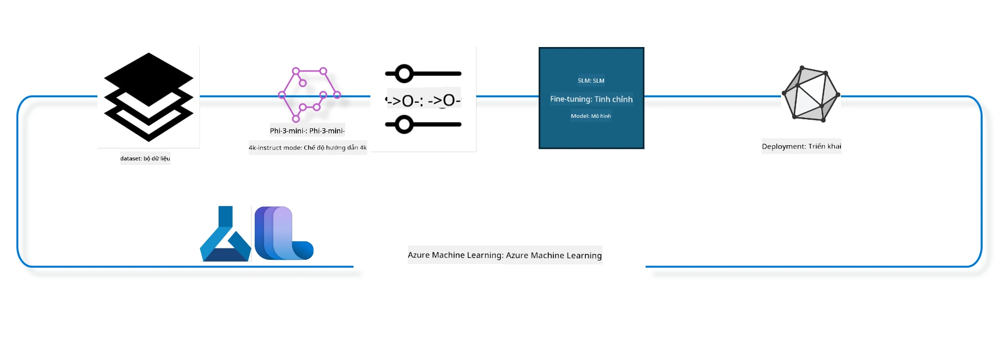

## Cách sử dụng các thành phần chat-completion từ hệ thống đăng ký Azure ML để điều chỉnh mô hình

Trong ví dụ này, chúng ta sẽ tiến hành điều chỉnh mô hình Phi-3-mini-4k-instruct để hoàn thành một cuộc hội thoại giữa 2 người sử dụng bộ dữ liệu ultrachat_200k.



Ví dụ sẽ hướng dẫn bạn cách tiến hành điều chỉnh bằng cách sử dụng Azure ML SDK và Python, sau đó triển khai mô hình đã được điều chỉnh lên một điểm cuối trực tuyến cho suy luận thời gian thực.

### Dữ liệu huấn luyện

Chúng ta sẽ sử dụng bộ dữ liệu ultrachat_200k. Đây là phiên bản được lọc kỹ của bộ dữ liệu UltraChat và đã được sử dụng để huấn luyện Zephyr-7B-β, một mô hình chat 7b tiên tiến hiện đại.

### Mô hình

Chúng ta sẽ sử dụng mô hình Phi-3-mini-4k-instruct để trình bày cách người dùng có thể điều chỉnh một mô hình cho tác vụ hoàn thành trò chuyện. Nếu bạn mở notebook này từ một thẻ mô hình cụ thể, hãy nhớ thay thế tên mô hình tương ứng.

### Nhiệm vụ

- Chọn một mô hình để điều chỉnh.
- Chọn và khám phá dữ liệu huấn luyện.
- Cấu hình công việc điều chỉnh.
- Chạy công việc điều chỉnh.
- Xem xét các chỉ số huấn luyện và đánh giá.
- Đăng ký mô hình đã được điều chỉnh.
- Triển khai mô hình đã được điều chỉnh cho suy luận thời gian thực.
- Dọn dẹp tài nguyên.

## 1. Thiết lập các yêu cầu cần thiết

- Cài đặt các phụ thuộc
- Kết nối với AzureML Workspace. Tìm hiểu thêm tại thiết lập xác thực SDK. Thay thế <WORKSPACE_NAME>, <RESOURCE_GROUP> và <SUBSCRIPTION_ID> bên dưới.
- Kết nối với hệ thống đăng ký azureml
- Đặt tên thử nghiệm tùy chọn
- Kiểm tra hoặc tạo compute.

> [!NOTE]
> Yêu cầu một nút GPU đơn có thể có nhiều card GPU. Ví dụ, trong một nút của Standard_NC24rs_v3 có 4 GPU NVIDIA V100 trong khi ở Standard_NC12s_v3 có 2 GPU NVIDIA V100. Tham khảo tài liệu để biết thông tin chi tiết. Số lượng card GPU trên mỗi nút được đặt trong tham số gpus_per_node bên dưới. Đặt giá trị này đúng sẽ đảm bảo sử dụng tất cả các GPU trên nút. Các SKU compute GPU được đề xuất có thể tìm thấy ở đây và ở đây.

### Thư viện Python

Cài đặt các phụ thuộc bằng cách chạy ô dưới đây. Đây không phải bước tùy chọn nếu chạy trong môi trường mới.

```bash
pip install azure-ai-ml
pip install azure-identity
pip install datasets==2.9.0
pip install mlflow
pip install azureml-mlflow
```

### Tương tác với Azure ML

1. Script Python này được sử dụng để tương tác với dịch vụ Azure Machine Learning (Azure ML). Dưới đây là phân tích những gì nó thực hiện:

    - Nó nhập các module cần thiết từ các gói azure.ai.ml, azure.identity và azure.ai.ml.entities. Nó cũng nhập module time.

    - Nó cố gắng xác thực bằng DefaultAzureCredential(), cung cấp trải nghiệm xác thực đơn giản để nhanh chóng bắt đầu phát triển ứng dụng chạy trên đám mây Azure. Nếu thất bại, nó chuyển sang InteractiveBrowserCredential(), cung cấp trình đăng nhập tương tác.

    - Sau đó, nó cố gắng tạo một thể hiện MLClient bằng phương thức from_config, đọc cấu hình từ file config mặc định (config.json). Nếu không thành công, nó tạo một thể hiện MLClient bằng cách cung cấp thủ công subscription_id, resource_group_name và workspace_name.

    - Nó tạo thêm một thể hiện MLClient khác, lần này cho hệ thống đăng ký Azure ML có tên "azureml". Hệ thống đăng ký này lưu trữ các mô hình, pipeline điều chỉnh và môi trường.

    - Nó đặt tên thử nghiệm là "chat_completion_Phi-3-mini-4k-instruct".

    - Nó tạo một dấu thời gian duy nhất bằng cách chuyển thời gian hiện tại (tính bằng giây kể từ epoch, dưới dạng số thực) thành số nguyên rồi thành chuỗi. Dấu thời gian này có thể dùng để tạo tên và phiên bản duy nhất.

    ```python
    # Nhập các mô-đun cần thiết từ Azure ML và Azure Identity
    from azure.ai.ml import MLClient
    from azure.identity import (
        DefaultAzureCredential,
        InteractiveBrowserCredential,
    )
    from azure.ai.ml.entities import AmlCompute
    import time  # Nhập mô-đun time
    
    # Thử xác thực bằng DefaultAzureCredential
    try:
        credential = DefaultAzureCredential()
        credential.get_token("https://management.azure.com/.default")
    except Exception as ex:  # Nếu DefaultAzureCredential thất bại, sử dụng InteractiveBrowserCredential
        credential = InteractiveBrowserCredential()
    
    # Thử tạo một thể hiện MLClient sử dụng tệp cấu hình mặc định
    try:
        workspace_ml_client = MLClient.from_config(credential=credential)
    except:  # Nếu thất bại, tạo một thể hiện MLClient bằng cách cung cấp chi tiết thủ công
        workspace_ml_client = MLClient(
            credential,
            subscription_id="<SUBSCRIPTION_ID>",
            resource_group_name="<RESOURCE_GROUP>",
            workspace_name="<WORKSPACE_NAME>",
        )
    
    # Tạo một thể hiện MLClient khác cho registry Azure ML có tên "azureml"
    # Registry này là nơi lưu trữ các mô hình, pipeline tinh chỉnh và môi trường
    registry_ml_client = MLClient(credential, registry_name="azureml")
    
    # Đặt tên cho thử nghiệm
    experiment_name = "chat_completion_Phi-3-mini-4k-instruct"
    
    # Tạo một dấu thời gian duy nhất có thể dùng cho tên và phiên bản cần duy nhất
    timestamp = str(int(time.time()))
    ```

## 2. Chọn một mô hình cơ sở để điều chỉnh

1. Phi-3-mini-4k-instruct là mô hình mở nhẹ, hiện đại với 3.8 tỷ tham số, xây dựng dựa trên các bộ dữ liệu đã dùng cho Phi-2. Mô hình thuộc dòng Phi-3, và phiên bản Mini có hai biến thể 4K và 128K tương ứng với độ dài ngữ cảnh (tính bằng token) có thể hỗ trợ, chúng ta cần điều chỉnh mô hình cho mục đích cụ thể của mình để sử dụng. Bạn có thể duyệt các mô hình này trong Danh mục Mô hình trên AzureML Studio, lọc theo tác vụ chat-completion. Trong ví dụ này, chúng ta dùng mô hình Phi-3-mini-4k-instruct. Nếu bạn mở notebook này cho một mô hình khác, hãy thay thế tên và phiên bản mô hình cho phù hợp.

> [!NOTE]
> Thuộc tính id của mô hình. Thuộc tính này sẽ được truyền làm đầu vào cho công việc điều chỉnh. Thuộc tính này cũng có trong trường Asset ID trên trang chi tiết mô hình trong Danh mục Mô hình AzureML Studio.

2. Script Python này tương tác với dịch vụ Azure Machine Learning (Azure ML). Dưới đây là phân tích chi tiết:

    - Nó đặt model_name thành "Phi-3-mini-4k-instruct".

    - Nó sử dụng phương thức get của thuộc tính models trong đối tượng registry_ml_client để lấy phiên bản mới nhất của mô hình có tên chỉ định từ hệ thống đăng ký Azure ML. Phương thức get được gọi với hai đối số: tên mô hình và nhãn chỉ định lấy phiên bản mới nhất.

    - Nó in ra console một thông báo cho biết tên, phiên bản và id của mô hình sẽ dùng để điều chỉnh. Phương thức format của chuỗi được sử dụng để chèn tên, phiên bản và id của mô hình vào thông báo. Tên, phiên bản và id mô hình được truy cập qua thuộc tính của đối tượng foundation_model.

    ```python
    # Đặt tên mô hình
    model_name = "Phi-3-mini-4k-instruct"
    
    # Lấy phiên bản mới nhất của mô hình từ đăng ký Azure ML
    foundation_model = registry_ml_client.models.get(model_name, label="latest")
    
    # In tên mô hình, phiên bản và id
    # Thông tin này hữu ích cho việc theo dõi và gỡ lỗi
    print(
        "\n\nUsing model name: {0}, version: {1}, id: {2} for fine tuning".format(
            foundation_model.name, foundation_model.version, foundation_model.id
        )
    )
    ```

## 3. Tạo compute để sử dụng với công việc

Công việc finetune CHỈ hoạt động với compute GPU. Kích thước compute phụ thuộc vào độ lớn của mô hình và trong nhiều trường hợp việc xác định compute phù hợp cho công việc trở nên khó khăn. Trong ô này, chúng tôi hướng dẫn người dùng chọn compute phù hợp cho công việc.

> [!NOTE]
> Các compute liệt kê dưới đây hoạt động với cấu hình tối ưu nhất. Bất kỳ thay đổi cấu hình nào có thể dẫn đến lỗi Cuda Out Of Memory. Trong các trường hợp như vậy, hãy thử nâng cấp compute lên kích thước lớn hơn.

> [!NOTE]
> Khi chọn compute_cluster_size dưới đây, hãy đảm bảo compute có sẵn trong nhóm tài nguyên của bạn. Nếu một compute cụ thể không có sẵn, bạn có thể yêu cầu cấp quyền truy cập tài nguyên compute.

### Kiểm tra hỗ trợ điều chỉnh mô hình

1. Script Python này tương tác với một mô hình Azure Machine Learning (Azure ML). Dưới đây là phân tích chi tiết:

    - Nó nhập module ast, cung cấp các hàm xử lý cây cú pháp trừu tượng của Python.

    - Nó kiểm tra xem đối tượng foundation_model (biểu thị một mô hình trong Azure ML) có tag tên finetune_compute_allow_list hay không. Tags trong Azure ML là các cặp khóa-giá trị mà bạn có thể tạo và sử dụng để lọc và sắp xếp mô hình.

    - Nếu tag finetune_compute_allow_list tồn tại, nó sử dụng hàm ast.literal_eval để phân tích an toàn giá trị của tag (một chuỗi) thành danh sách Python. Danh sách này sau đó được gán cho biến computes_allow_list. Sau đó in ra thông báo đề nghị tạo compute từ danh sách.

    - Nếu tag finetune_compute_allow_list không tồn tại, nó đặt computes_allow_list thành None và in thông báo rằng tag finetune_compute_allow_list không có trong tags của mô hình.

    - Tóm lại, script này kiểm tra một tag cụ thể trong metadata của mô hình, chuyển giá trị tag thành danh sách nếu tồn tại, đồng thời cung cấp phản hồi cho người dùng.

    ```python
    # Nhập module ast, cung cấp các hàm để xử lý cây cú pháp trừu tượng của Python
    import ast
    
    # Kiểm tra xem thẻ 'finetune_compute_allow_list' có trong các thẻ của mô hình hay không
    if "finetune_compute_allow_list" in foundation_model.tags:
        # Nếu thẻ tồn tại, sử dụng ast.literal_eval để phân tích an toàn giá trị của thẻ (một chuỗi) thành một danh sách Python
        computes_allow_list = ast.literal_eval(
            foundation_model.tags["finetune_compute_allow_list"]
        )  # chuyển chuỗi thành danh sách python
        # In ra thông báo cho biết một compute nên được tạo từ danh sách
        print(f"Please create a compute from the above list - {computes_allow_list}")
    else:
        # Nếu thẻ không tồn tại, gán computes_allow_list thành None
        computes_allow_list = None
        # In ra thông báo cho biết thẻ 'finetune_compute_allow_list' không phải là một phần của các thẻ trong mô hình
        print("`finetune_compute_allow_list` is not part of model tags")
    ```

### Kiểm tra Compute Instance

1. Script Python này tương tác với dịch vụ Azure Machine Learning (Azure ML) và thực hiện một số kiểm tra trên compute instance. Dưới đây là phân tích chi tiết:

    - Nó cố gắng lấy compute instance có tên được lưu trong compute_cluster từ workspace Azure ML. Nếu trạng thái cấp phát (provisioning state) của compute instance là "failed", nó ném lỗi ValueError.

    - Nó kiểm tra nếu computes_allow_list không phải None. Nếu đúng, nó chuyển tất cả các kích thước compute trong danh sách thành chữ thường và kiểm tra kích thước compute hiện tại có trong danh sách hay không. Nếu không có, nó ném lỗi ValueError.

    - Nếu computes_allow_list là None, nó kiểm tra xem kích thước compute instance có nằm trong danh sách các kích thước GPU VM không hỗ trợ hay không. Nếu có, nó ném lỗi ValueError.

    - Nó lấy danh sách tất cả các kích thước compute có sẵn trong workspace. Sau đó duyệt danh sách này, với mỗi kích thước compute, kiểm tra tên có trùng với kích thước compute hiện tại hay không. Nếu trùng, nó lấy số lượng GPU cho kích thước compute đó và đặt biến gpu_count_found thành True.

    - Nếu gpu_count_found bằng True, nó in số lượng GPU trong compute instance. Nếu gpu_count_found bằng False, nó ném lỗi ValueError.

    - Tóm lại, script này thực hiện một số kiểm tra trên compute instance trong workspace Azure ML, bao gồm trạng thái cấp phát, kích thước so với danh sách cho phép hay cấm, và số lượng GPU của nó.
    
    ```python
    # In ra thông báo ngoại lệ
    print(e)
    # Ném ra ValueError nếu kích thước compute không có trong workspace
    raise ValueError(
        f"WARNING! Compute size {compute_cluster_size} not available in workspace"
    )
    
    # Lấy compute instance từ Azure ML workspace
    compute = workspace_ml_client.compute.get(compute_cluster)
    # Kiểm tra trạng thái cung cấp của compute instance có phải là "failed" không
    if compute.provisioning_state.lower() == "failed":
        # Ném ra ValueError nếu trạng thái cung cấp là "failed"
        raise ValueError(
            f"Provisioning failed, Compute '{compute_cluster}' is in failed state. "
            f"please try creating a different compute"
        )
    
    # Kiểm tra nếu computes_allow_list không phải None
    if computes_allow_list is not None:
        # Chuyển tất cả kích thước compute trong computes_allow_list thành chữ thường
        computes_allow_list_lower_case = [x.lower() for x in computes_allow_list]
        # Kiểm tra nếu kích thước của compute instance có trong computes_allow_list_lower_case
        if compute.size.lower() not in computes_allow_list_lower_case:
            # Ném ra ValueError nếu kích thước của compute instance không có trong computes_allow_list_lower_case
            raise ValueError(
                f"VM size {compute.size} is not in the allow-listed computes for finetuning"
            )
    else:
        # Định nghĩa danh sách các kích thước GPU VM không được hỗ trợ
        unsupported_gpu_vm_list = [
            "standard_nc6",
            "standard_nc12",
            "standard_nc24",
            "standard_nc24r",
        ]
        # Kiểm tra nếu kích thước của compute instance có trong unsupported_gpu_vm_list
        if compute.size.lower() in unsupported_gpu_vm_list:
            # Ném ra ValueError nếu kích thước của compute instance có trong unsupported_gpu_vm_list
            raise ValueError(
                f"VM size {compute.size} is currently not supported for finetuning"
            )
    
    # Khởi tạo cờ để kiểm tra số lượng GPU trong compute instance đã được tìm thấy chưa
    gpu_count_found = False
    # Lấy danh sách tất cả các kích thước compute có sẵn trong workspace
    workspace_compute_sku_list = workspace_ml_client.compute.list_sizes()
    available_sku_sizes = []
    # Lặp qua danh sách các kích thước compute có sẵn
    for compute_sku in workspace_compute_sku_list:
        available_sku_sizes.append(compute_sku.name)
        # Kiểm tra nếu tên kích thước compute khớp với kích thước của compute instance
        if compute_sku.name.lower() == compute.size.lower():
            # Nếu đúng, lấy số lượng GPU cho kích thước compute đó và đặt gpu_count_found thành True
            gpus_per_node = compute_sku.gpus
            gpu_count_found = True
    # Nếu gpu_count_found là True, in ra số lượng GPU trong compute instance
    if gpu_count_found:
        print(f"Number of GPU's in compute {compute.size}: {gpus_per_node}")
    else:
        # Nếu gpu_count_found là False, ném ra ValueError
        raise ValueError(
            f"Number of GPU's in compute {compute.size} not found. Available skus are: {available_sku_sizes}."
            f"This should not happen. Please check the selected compute cluster: {compute_cluster} and try again."
        )
    ```

## 4. Chọn bộ dữ liệu để fine-tune mô hình

1. Chúng ta sử dụng bộ dữ liệu ultrachat_200k. Bộ dữ liệu này có bốn phần, phù hợp cho fine-tuning có giám sát (Supervised fine-tuning - sft).
Xếp hạng tạo (generation ranking - gen). Số lượng ví dụ trên mỗi phần được hiển thị như sau:

    ```bash
    train_sft test_sft  train_gen  test_gen
    207865  23110  256032  28304
    ```

1. Các ô tiếp theo thể hiện chuẩn bị dữ liệu cơ bản cho công việc điều chỉnh:

### Hiển thị một số dòng dữ liệu

Chúng ta muốn mẫu này chạy nhanh, vì vậy lưu các file train_sft, test_sft chứa 5% dữ liệu đã được cắt gọt. Điều này có nghĩa mô hình được điều chỉnh sẽ có độ chính xác thấp hơn, do đó không nên dùng trong thực tế.
Script download-dataset.py được dùng để tải bộ dữ liệu ultrachat_200k và chuyển đổi bộ dữ liệu thành định dạng tiêu thụ bởi pipeline fine-tune. Vì bộ dữ liệu lớn, nên ở đây chỉ có một phần của bộ dữ liệu.

1. Chạy script dưới đây chỉ tải 5% dữ liệu. Có thể tăng tỷ lệ này bằng cách đổi tham số dataset_split_pc thành tỷ lệ mong muốn.

> [!NOTE]
> Một số mô hình ngôn ngữ có các mã ngôn ngữ khác nhau và do đó tên cột trong bộ dữ liệu cũng nên phản ánh điều đó.

1. Dưới đây là ví dụ về cách dữ liệu nên trông như thế nào
Bộ dữ liệu chat-completion được lưu dưới định dạng parquet với mỗi bản ghi sử dụng cấu trúc sau:

    - Đây là một tài liệu JSON (JavaScript Object Notation), một định dạng trao đổi dữ liệu phổ biến. Nó không phải mã thực thi mà là cách lưu trữ và truyền dữ liệu. Dưới đây là phân tích cấu trúc:

    - "prompt": Khóa này chứa một chuỗi đại diện cho một nhiệm vụ hoặc câu hỏi đặt ra cho AI assistant.

    - "messages": Khóa này chứa một mảng các đối tượng. Mỗi đối tượng đại diện cho một tin nhắn trong cuộc hội thoại giữa người dùng và AI assistant. Mỗi tin nhắn có hai khóa:

    - "content": Khóa này chứa một chuỗi đại diện nội dung của tin nhắn.
    - "role": Khóa này chứa một chuỗi đại diện vai trò của thực thể gửi tin nhắn. Có thể là "user" hoặc "assistant".
    - "prompt_id": Khóa này chứa một chuỗi đại diện cho mã định danh duy nhất của prompt.

1. Trong tài liệu JSON cụ thể này, một cuộc hội thoại được thể hiện trong đó người dùng yêu cầu AI assistant tạo một nhân vật chính cho câu chuyện dystopian. Trợ lý trả lời, sau đó người dùng hỏi thêm chi tiết. Trợ lý đồng ý cung cấp chi tiết thêm. Toàn bộ hội thoại được liên kết với một mã prompt cụ thể.

    ```python
    {
        // The task or question posed to an AI assistant
        "prompt": "Create a fully-developed protagonist who is challenged to survive within a dystopian society under the rule of a tyrant. ...",
        
        // An array of objects, each representing a message in a conversation between a user and an AI assistant
        "messages":[
            {
                // The content of the user's message
                "content": "Create a fully-developed protagonist who is challenged to survive within a dystopian society under the rule of a tyrant. ...",
                // The role of the entity that sent the message
                "role": "user"
            },
            {
                // The content of the assistant's message
                "content": "Name: Ava\n\n Ava was just 16 years old when the world as she knew it came crashing down. The government had collapsed, leaving behind a chaotic and lawless society. ...",
                // The role of the entity that sent the message
                "role": "assistant"
            },
            {
                // The content of the user's message
                "content": "Wow, Ava's story is so intense and inspiring! Can you provide me with more details.  ...",
                // The role of the entity that sent the message
                "role": "user"
            }, 
            {
                // The content of the assistant's message
                "content": "Certainly! ....",
                // The role of the entity that sent the message
                "role": "assistant"
            }
        ],
        
        // A unique identifier for the prompt
        "prompt_id": "d938b65dfe31f05f80eb8572964c6673eddbd68eff3db6bd234d7f1e3b86c2af"
    }
    ```

### Tải dữ liệu

1. Script Python này dùng để tải bộ dữ liệu bằng một script phụ trợ tên download-dataset.py. Dưới đây là phân tích chi tiết:

    - Nó nhập module os cung cấp cách sử dụng các chức năng hệ điều hành một cách di động.

    - Nó gọi hàm os.system để chạy script download-dataset.py trong shell với các tham số dòng lệnh cụ thể. Tham số chỉ định bộ dữ liệu cần tải (HuggingFaceH4/ultrachat_200k), thư mục tải về (ultrachat_200k_dataset), và tỷ lệ phần trăm bộ dữ liệu để chia (5). Hàm os.system trả trạng thái thoát của lệnh chạy; trạng thái này được lưu trong biến exit_status.

    - Nó kiểm tra nếu exit_status khác 0. Trong hệ điều hành kiểu Unix, trạng thái thoát 0 thường chỉ ra lệnh thành công, còn giá trị khác biểu thị lỗi. Nếu exit_status khác 0, nó ném Exception với thông báo cho biết lỗi khi tải bộ dữ liệu.

    - Tóm lại, script này chạy một lệnh để tải bộ dữ liệu sử dụng script phụ, và ném ngoại lệ nếu lệnh thất bại.
    
    ```python
    # Nhập mô-đun os, cung cấp một cách sử dụng các chức năng phụ thuộc vào hệ điều hành
    import os
    
    # Sử dụng hàm os.system để chạy script download-dataset.py trong shell với các đối số dòng lệnh cụ thể
    # Các đối số chỉ định bộ dữ liệu cần tải về (HuggingFaceH4/ultrachat_200k), thư mục để tải về (ultrachat_200k_dataset), và phần trăm bộ dữ liệu để chia tách (5)
    # Hàm os.system trả về trạng thái thoát của lệnh đã thực thi; trạng thái này được lưu trong biến exit_status
    exit_status = os.system(
        "python ./download-dataset.py --dataset HuggingFaceH4/ultrachat_200k --download_dir ultrachat_200k_dataset --dataset_split_pc 5"
    )
    
    # Kiểm tra nếu exit_status khác 0
    # Trong hệ điều hành giống Unix, trạng thái thoát 0 thường chỉ ra rằng một lệnh đã thành công, trong khi bất kỳ số nào khác cho biết lỗi
    # Nếu exit_status không phải 0, ném ra một Exception với thông báo chỉ ra có lỗi khi tải bộ dữ liệu
    if exit_status != 0:
        raise Exception("Error downloading dataset")
    ```

### Nạp dữ liệu vào DataFrame
1. Script Python này đang tải một tệp JSON Lines vào một pandas DataFrame và hiển thị 5 hàng đầu tiên. Dưới đây là phân tích những gì nó thực hiện:

    - Nó nhập thư viện pandas, một thư viện mạnh mẽ cho việc thao tác và phân tích dữ liệu.

    - Nó đặt độ rộng cột tối đa trong tùy chọn hiển thị của pandas thành 0. Điều này nghĩa là toàn bộ văn bản của mỗi cột sẽ được hiển thị đầy đủ mà không bị cắt ngắn khi DataFrame được in ra.

    - Nó sử dụng hàm pd.read_json để tải tệp train_sft.jsonl từ thư mục ultrachat_200k_dataset vào một DataFrame. Tham số lines=True cho biết tệp ở định dạng JSON Lines, trong đó mỗi dòng là một đối tượng JSON riêng biệt.

    - Nó sử dụng phương thức head để hiển thị 5 hàng đầu tiên của DataFrame. Nếu DataFrame có ít hơn 5 hàng, nó sẽ hiển thị tất cả.

    - Tóm lại, script này đang tải một tệp JSON Lines vào DataFrame và hiển thị 5 hàng đầu tiên với đầy đủ văn bản cột.

    ```python
    # Nhập thư viện pandas, một thư viện mạnh mẽ để thao tác và phân tích dữ liệu
    import pandas as pd
    
    # Đặt chiều rộng tối đa của cột cho các tùy chọn hiển thị của pandas thành 0
    # Điều này có nghĩa là toàn bộ văn bản của mỗi cột sẽ được hiển thị mà không bị cắt khi DataFrame được in ra
    pd.set_option("display.max_colwidth", 0)
    
    # Sử dụng hàm pd.read_json để tải tệp train_sft.jsonl từ thư mục ultrachat_200k_dataset vào một DataFrame
    # Tham số lines=True chỉ ra rằng tệp ở định dạng JSON Lines, trong đó mỗi dòng là một đối tượng JSON riêng biệt
    df = pd.read_json("./ultrachat_200k_dataset/train_sft.jsonl", lines=True)
    
    # Sử dụng phương thức head để hiển thị 5 hàng đầu tiên của DataFrame
    # Nếu DataFrame có ít hơn 5 hàng, nó sẽ hiển thị tất cả chúng
    df.head()
    ```

## 5. Gửi công việc tinh chỉnh sử dụng mô hình và dữ liệu làm đầu vào

Tạo công việc sử dụng thành phần pipeline chat-completion. Tìm hiểu thêm về các tham số được hỗ trợ cho việc tinh chỉnh.

### Định nghĩa các tham số tinh chỉnh

1. Các tham số tinh chỉnh có thể được phân thành 2 loại - tham số đào tạo và tham số tối ưu hóa

1. Các tham số đào tạo xác định các khía cạnh đào tạo như -

    - Bộ tối ưu hóa, bộ lập lịch sử dụng
    - Chỉ số để tối ưu hóa việc tinh chỉnh
    - Số bước đào tạo và kích thước bộ dữ liệu con, v.v.
    - Các tham số tối ưu giúp tối ưu bộ nhớ GPU và sử dụng hiệu quả tài nguyên tính toán.

1. Dưới đây là một số tham số thuộc nhóm này. Tham số tối ưu khác nhau đối với mỗi mô hình và được đóng gói cùng mô hình để xử lý các biến thể này.

    - Bật deepspeed và LoRA
    - Bật đào tạo với độ chính xác hỗn hợp
    - Bật đào tạo đa nút

> [!NOTE]
> Việc tinh chỉnh có giám sát có thể dẫn đến mất sự đồng bộ hoặc quên lãng thảm họa. Chúng tôi khuyên bạn nên kiểm tra vấn đề này và chạy một giai đoạn đồng bộ sau khi tinh chỉnh.

### Tham số Tinh chỉnh

1. Script Python này thiết lập các tham số cho việc tinh chỉnh một mô hình máy học. Dưới đây là phân tích những gì nó thực hiện:

    - Nó thiết lập các tham số mặc định cho đào tạo như số epoch đào tạo, kích thước batch cho đào tạo và đánh giá, tốc độ học và loại bộ lập lịch tốc độ học.

    - Nó thiết lập các tham số tối ưu hóa mặc định như có sử dụng Layer-wise Relevance Propagation (LoRa) và DeepSpeed hay không, cùng cấp độ DeepSpeed.

    - Nó kết hợp tham số đào tạo và tối ưu hóa vào một từ điển duy nhất gọi là finetune_parameters.

    - Nó kiểm tra xem foundation_model có tham số mặc định theo mô hình nào không. Nếu có, nó in một cảnh báo và cập nhật từ điển finetune_parameters với các tham số mặc định theo mô hình đó. Hàm ast.literal_eval được dùng để chuyển các tham số mặc định từ chuỗi thành từ điển Python.

    - Nó in ra bộ tham số tinh chỉnh cuối cùng sẽ được sử dụng cho lần chạy.

    - Tóm lại, script này thiết lập và hiển thị tham số cho việc tinh chỉnh mô hình máy học, với khả năng ghi đè tham số mặc định bằng các tham số riêng của mô hình.

    ```python
    # Thiết lập các tham số đào tạo mặc định như số epoch đào tạo, kích thước batch cho đào tạo và đánh giá, tốc độ học, và loại bộ lập lịch tốc độ học
    training_parameters = dict(
        num_train_epochs=3,
        per_device_train_batch_size=1,
        per_device_eval_batch_size=1,
        learning_rate=5e-6,
        lr_scheduler_type="cosine",
    )
    
    # Thiết lập các tham số tối ưu hóa mặc định như có áp dụng Layer-wise Relevance Propagation (LoRa) và DeepSpeed hay không, và cấp độ DeepSpeed
    optimization_parameters = dict(
        apply_lora="true",
        apply_deepspeed="true",
        deepspeed_stage=2,
    )
    
    # Kết hợp các tham số đào tạo và tối ưu hóa vào một từ điển duy nhất gọi là finetune_parameters
    finetune_parameters = {**training_parameters, **optimization_parameters}
    
    # Kiểm tra xem foundation_model có bất kỳ tham số mặc định đặc thù mô hình nào không
    # Nếu có, in thông báo cảnh báo và cập nhật từ điển finetune_parameters với các tham số mặc định đặc thù mô hình đó
    # Hàm ast.literal_eval được sử dụng để chuyển các tham số mặc định đặc thù mô hình từ chuỗi sang từ điển Python
    if "model_specific_defaults" in foundation_model.tags:
        print("Warning! Model specific defaults exist. The defaults could be overridden.")
        finetune_parameters.update(
            ast.literal_eval(  # chuyển chuỗi thành từ điển python
                foundation_model.tags["model_specific_defaults"]
            )
        )
    
    # In tập tham số fine-tuning cuối cùng sẽ được sử dụng cho lần chạy
    print(
        f"The following finetune parameters are going to be set for the run: {finetune_parameters}"
    )
    ```

### Pipeline Đào tạo

1. Script Python này định nghĩa một hàm để tạo tên hiển thị cho pipeline đào tạo mô hình máy học, sau đó gọi hàm này để tạo và in tên hiển thị. Dưới đây là phân tích những gì nó thực hiện:

1. Hàm get_pipeline_display_name được định nghĩa. Hàm này tạo một tên hiển thị dựa trên các tham số liên quan đến pipeline đào tạo.

1. Bên trong hàm, nó tính toán tổng kích thước batch bằng cách nhân kích thước batch trên mỗi thiết bị, số bước tích lũy gradient, số GPU mỗi nút, và số nút sử dụng cho tinh chỉnh.

1. Nó lấy các tham số khác như loại bộ lập lịch tốc độ học, có áp dụng DeepSpeed hay không, cấp độ DeepSpeed, có áp dụng Layer-wise Relevance Propagation (LoRa) hay không, giới hạn số checkpoint mô hình được giữ, và độ dài chuỗi tối đa.

1. Nó xây dựng một chuỗi chứa tất cả các tham số đó, ngăn cách bằng dấu gạch nối. Nếu áp dụng DeepSpeed hoặc LoRa, chuỗi bao gồm "ds" kèm cấp độ DeepSpeed, hoặc "lora" tương ứng. Nếu không, bao gồm "nods" hoặc "nolora".

1. Hàm trả về chuỗi này, dùng làm tên hiển thị cho pipeline đào tạo.

1. Sau khi hàm được định nghĩa, nó được gọi để tạo tên hiển thị, rồi in ra.

1. Tóm lại, script này tạo một tên hiển thị cho pipeline đào tạo mô hình máy học dựa trên nhiều tham số, rồi in tên đó ra.

    ```python
    # Định nghĩa một hàm để tạo tên hiển thị cho pipeline đào tạo
    def get_pipeline_display_name():
        # Tính tổng kích thước batch bằng cách nhân kích thước batch trên mỗi thiết bị, số bước tích lũy gradient, số GPU trên mỗi node và số node dùng để tinh chỉnh
        batch_size = (
            int(finetune_parameters.get("per_device_train_batch_size", 1))
            * int(finetune_parameters.get("gradient_accumulation_steps", 1))
            * int(gpus_per_node)
            * int(finetune_parameters.get("num_nodes_finetune", 1))
        )
        # Lấy loại bộ lập lịch tốc độ học
        scheduler = finetune_parameters.get("lr_scheduler_type", "linear")
        # Lấy thông tin liệu DeepSpeed có được áp dụng hay không
        deepspeed = finetune_parameters.get("apply_deepspeed", "false")
        # Lấy giai đoạn DeepSpeed
        ds_stage = finetune_parameters.get("deepspeed_stage", "2")
        # Nếu DeepSpeed được áp dụng, thêm "ds" theo sau là giai đoạn DeepSpeed vào tên hiển thị; nếu không, thêm "nods"
        if deepspeed == "true":
            ds_string = f"ds{ds_stage}"
        else:
            ds_string = "nods"
        # Lấy thông tin liệu Layer-wise Relevance Propagation (LoRa) có được áp dụng hay không
        lora = finetune_parameters.get("apply_lora", "false")
        # Nếu LoRa được áp dụng, thêm "lora" vào tên hiển thị; nếu không, thêm "nolora"
        if lora == "true":
            lora_string = "lora"
        else:
            lora_string = "nolora"
        # Lấy giới hạn số lượng checkpoint của mô hình cần giữ lại
        save_limit = finetune_parameters.get("save_total_limit", -1)
        # Lấy độ dài chuỗi tối đa
        seq_len = finetune_parameters.get("max_seq_length", -1)
        # Xây dựng tên hiển thị bằng cách nối tất cả các tham số này, cách nhau bằng dấu gạch ngang
        return (
            model_name
            + "-"
            + "ultrachat"
            + "-"
            + f"bs{batch_size}"
            + "-"
            + f"{scheduler}"
            + "-"
            + ds_string
            + "-"
            + lora_string
            + f"-save_limit{save_limit}"
            + f"-seqlen{seq_len}"
        )
    
    # Gọi hàm để tạo tên hiển thị
    pipeline_display_name = get_pipeline_display_name()
    # In tên hiển thị ra màn hình
    print(f"Display name used for the run: {pipeline_display_name}")
    ```

### Cấu hình Pipeline

Script Python này định nghĩa và cấu hình một pipeline máy học sử dụng Azure Machine Learning SDK. Dưới đây là phân tích những gì nó thực hiện:

1. Nó nhập các module cần thiết từ Azure AI ML SDK.

1. Nó lấy thành phần pipeline có tên "chat_completion_pipeline" từ registry.

1. Nó định nghĩa một job pipeline sử dụng decorator `@pipeline` và hàm `create_pipeline`. Tên pipeline được đặt là `pipeline_display_name`.

1. Bên trong hàm `create_pipeline`, nó khởi tạo thành phần pipeline đã lấy với nhiều tham số, bao gồm đường dẫn mô hình, các cụm tính toán cho nhiều giai đoạn, phân vùng dữ liệu cho đào tạo và thử nghiệm, số GPU sử dụng cho tinh chỉnh, và các tham số tinh chỉnh khác.

1. Nó ánh xạ đầu ra của công việc tinh chỉnh sang đầu ra của công việc pipeline. Việc này giúp dễ dàng đăng ký mô hình tinh chỉnh, cần thiết để triển khai mô hình tới một endpoint trực tuyến hoặc theo lô.

1. Nó tạo một thể hiện pipeline bằng cách gọi hàm `create_pipeline`.

1. Nó thiết lập `force_rerun` của pipeline thành `True`, có nghĩa là không dùng lại kết quả được lưu cache của các công việc trước đó.

1. Nó thiết lập `continue_on_step_failure` của pipeline thành `False`, tức pipeline sẽ dừng lại nếu bất kỳ bước nào thất bại.

1. Tóm lại, script này định nghĩa và cấu hình một pipeline máy học cho tác vụ hoàn thành chat sử dụng Azure Machine Learning SDK.

    ```python
    # Nhập các module cần thiết từ Azure AI ML SDK
    from azure.ai.ml.dsl import pipeline
    from azure.ai.ml import Input
    
    # Lấy thành phần pipeline có tên "chat_completion_pipeline" từ registry
    pipeline_component_func = registry_ml_client.components.get(
        name="chat_completion_pipeline", label="latest"
    )
    
    # Định nghĩa công việc pipeline sử dụng bộ trang trí @pipeline và hàm create_pipeline
    # Tên của pipeline được đặt là pipeline_display_name
    @pipeline(name=pipeline_display_name)
    def create_pipeline():
        # Khởi tạo thành phần pipeline đã lấy với các tham số khác nhau
        # Bao gồm đường dẫn mô hình, các cụm tính toán cho các giai đoạn khác nhau, phân chia bộ dữ liệu cho huấn luyện và kiểm tra, số lượng GPU sử dụng để tinh chỉnh, và các tham số tinh chỉnh khác
        chat_completion_pipeline = pipeline_component_func(
            mlflow_model_path=foundation_model.id,
            compute_model_import=compute_cluster,
            compute_preprocess=compute_cluster,
            compute_finetune=compute_cluster,
            compute_model_evaluation=compute_cluster,
            # Ánh xạ các phân chia bộ dữ liệu thành các tham số
            train_file_path=Input(
                type="uri_file", path="./ultrachat_200k_dataset/train_sft.jsonl"
            ),
            test_file_path=Input(
                type="uri_file", path="./ultrachat_200k_dataset/test_sft.jsonl"
            ),
            # Cài đặt huấn luyện
            number_of_gpu_to_use_finetuning=gpus_per_node,  # Đặt thành số GPU có sẵn trong cụm tính toán
            **finetune_parameters
        )
        return {
            # Ánh xạ kết quả của công việc tinh chỉnh đến kết quả của công việc pipeline
            # Việc này được thực hiện để chúng ta có thể dễ dàng đăng ký mô hình đã được tinh chỉnh
            # Việc đăng ký mô hình là cần thiết để triển khai mô hình đến endpoint trực tuyến hoặc theo lô
            "trained_model": chat_completion_pipeline.outputs.mlflow_model_folder
        }
    
    # Tạo một thể hiện của pipeline bằng cách gọi hàm create_pipeline
    pipeline_object = create_pipeline()
    
    # Không sử dụng kết quả cache từ các công việc trước
    pipeline_object.settings.force_rerun = True
    
    # Đặt tiếp tục khi bước thất bại thành False
    # Điều này có nghĩa là pipeline sẽ dừng nếu bất kỳ bước nào thất bại
    pipeline_object.settings.continue_on_step_failure = False
    ```

### Gửi Công việc

1. Script Python này gửi một công việc pipeline máy học tới workspace Azure Machine Learning rồi chờ công việc hoàn thành. Dưới đây là phân tích những gì nó thực hiện:

    - Nó gọi phương thức create_or_update của đối tượng jobs trong workspace_ml_client để gửi công việc pipeline. Pipeline cần chạy được chỉ định bởi pipeline_object, và thí nghiệm dưới đó công việc được chạy là experiment_name.

    - Nó gọi phương thức stream của đối tượng jobs trong workspace_ml_client để chờ công việc pipeline hoàn thành. Công việc cần chờ được chỉ định bởi thuộc tính name của pipeline_job.

    - Tóm lại, script này gửi một công việc pipeline máy học tới workspace Azure Machine Learning và đợi công việc hoàn thành.

    ```python
    # Gửi công việc pipeline đến không gian làm việc Azure Machine Learning
    # Pipeline được chạy được chỉ định bởi pipeline_object
    # Thí nghiệm dưới đó công việc được chạy được chỉ định bởi experiment_name
    pipeline_job = workspace_ml_client.jobs.create_or_update(
        pipeline_object, experiment_name=experiment_name
    )
    
    # Chờ cho công việc pipeline hoàn thành
    # Công việc cần chờ được chỉ định bởi thuộc tính name của đối tượng pipeline_job
    workspace_ml_client.jobs.stream(pipeline_job.name)
    ```

## 6. Đăng ký mô hình đã tinh chỉnh với workspace

Chúng ta sẽ đăng ký mô hình từ đầu ra của công việc tinh chỉnh. Việc này sẽ theo dõi mối quan hệ dòng nguồn giữa mô hình tinh chỉnh và công việc tinh chỉnh. Công việc tinh chỉnh cũng theo dõi dòng nguồn tới mô hình nền tảng, dữ liệu và mã đào tạo.

### Đăng ký mô hình ML

1. Script Python này đăng ký một mô hình máy học đã được đào tạo trong pipeline Azure Machine Learning. Dưới đây là phân tích những gì nó thực hiện:

    - Nó nhập các module cần thiết từ Azure AI ML SDK.

    - Nó kiểm tra xem đầu ra trained_model có sẵn từ công việc pipeline hay không bằng cách gọi phương thức get của đối tượng jobs trong workspace_ml_client và truy cập thuộc tính outputs của nó.

    - Nó tạo một đường dẫn tới mô hình đã đào tạo bằng cách định dạng chuỗi với tên công việc pipeline và tên đầu ra ("trained_model").

    - Nó định nghĩa tên cho mô hình đã tinh chỉnh bằng cách thêm "-ultrachat-200k" vào tên mô hình gốc và thay thế mọi dấu gạch chéo bằng dấu gạch ngang.

    - Nó chuẩn bị đăng ký mô hình bằng cách tạo một đối tượng Model với nhiều tham số, bao gồm đường dẫn tới mô hình, loại mô hình (MLflow model), tên và phiên bản mô hình, cùng mô tả mô hình.

    - Nó đăng ký mô hình bằng cách gọi phương thức create_or_update của đối tượng models trong workspace_ml_client với đối tượng Model làm đối số.

    - Nó in ra mô hình đã đăng ký.

1. Tóm lại, script này đăng ký một mô hình máy học đã được đào tạo trong pipeline Azure Machine Learning.

    ```python
    # Nhập các mô-đun cần thiết từ Azure AI ML SDK
    from azure.ai.ml.entities import Model
    from azure.ai.ml.constants import AssetTypes
    
    # Kiểm tra xem đầu ra `trained_model` có sẵn từ pipeline job hay không
    print("pipeline job outputs: ", workspace_ml_client.jobs.get(pipeline_job.name).outputs)
    
    # Tạo đường dẫn đến mô hình đã huấn luyện bằng cách định dạng chuỗi với tên của pipeline job và tên của đầu ra ("trained_model")
    model_path_from_job = "azureml://jobs/{0}/outputs/{1}".format(
        pipeline_job.name, "trained_model"
    )
    
    # Định nghĩa tên cho mô hình được tinh chỉnh bằng cách thêm "-ultrachat-200k" vào tên mô hình gốc và thay thế bất kỳ dấu gạch chéo nào bằng dấu gạch ngang
    finetuned_model_name = model_name + "-ultrachat-200k"
    finetuned_model_name = finetuned_model_name.replace("/", "-")
    
    print("path to register model: ", model_path_from_job)
    
    # Chuẩn bị đăng ký mô hình bằng cách tạo một đối tượng Model với các tham số khác nhau
    # Bao gồm đường dẫn đến mô hình, loại mô hình (mô hình MLflow), tên và phiên bản của mô hình, và mô tả về mô hình
    prepare_to_register_model = Model(
        path=model_path_from_job,
        type=AssetTypes.MLFLOW_MODEL,
        name=finetuned_model_name,
        version=timestamp,  # Sử dụng dấu thời gian làm phiên bản để tránh xung đột phiên bản
        description=model_name + " fine tuned model for ultrachat 200k chat-completion",
    )
    
    print("prepare to register model: \n", prepare_to_register_model)
    
    # Đăng ký mô hình bằng cách gọi phương thức create_or_update của đối tượng models trong workspace_ml_client với đối tượng Model làm đối số
    registered_model = workspace_ml_client.models.create_or_update(
        prepare_to_register_model
    )
    
    # In mô hình đã được đăng ký
    print("registered model: \n", registered_model)
    ```

## 7. Triển khai mô hình đã tinh chỉnh tới endpoint trực tuyến

Endpoint trực tuyến cung cấp REST API bền vững có thể tích hợp với các ứng dụng cần sử dụng mô hình.

### Quản lý Endpoint

1. Script Python này tạo một endpoint trực tuyến được quản lý trong Azure Machine Learning cho một mô hình đã đăng ký. Dưới đây là phân tích những gì nó thực hiện:

    - Nó nhập các module cần thiết từ Azure AI ML SDK.

    - Nó định nghĩa một tên duy nhất cho endpoint trực tuyến bằng cách thêm dấu thời gian vào chuỗi "ultrachat-completion-".

    - Nó chuẩn bị tạo endpoint trực tuyến bằng cách tạo một đối tượng ManagedOnlineEndpoint với các tham số, bao gồm tên endpoint, mô tả endpoint, và chế độ xác thực ("key").

    - Nó tạo endpoint trực tuyến bằng cách gọi phương thức begin_create_or_update của workspace_ml_client với đối tượng ManagedOnlineEndpoint làm đối số. Sau đó chờ việc tạo hoàn thành bằng cách gọi phương thức wait.

1. Tóm lại, script này tạo một endpoint trực tuyến quản lý trong Azure Machine Learning cho một mô hình đã đăng ký.

    ```python
    # Nhập các mô-đun cần thiết từ Azure AI ML SDK
    from azure.ai.ml.entities import (
        ManagedOnlineEndpoint,
        ManagedOnlineDeployment,
        ProbeSettings,
        OnlineRequestSettings,
    )
    
    # Định nghĩa tên duy nhất cho điểm cuối trực tuyến bằng cách thêm dấu thời gian vào chuỗi "ultrachat-completion-"
    online_endpoint_name = "ultrachat-completion-" + timestamp
    
    # Chuẩn bị tạo điểm cuối trực tuyến bằng cách tạo một đối tượng ManagedOnlineEndpoint với các tham số khác nhau
    # Bao gồm tên điểm cuối, mô tả điểm cuối và chế độ xác thực ("key")
    endpoint = ManagedOnlineEndpoint(
        name=online_endpoint_name,
        description="Online endpoint for "
        + registered_model.name
        + ", fine tuned model for ultrachat-200k-chat-completion",
        auth_mode="key",
    )
    
    # Tạo điểm cuối trực tuyến bằng cách gọi phương thức begin_create_or_update của workspace_ml_client với đối tượng ManagedOnlineEndpoint làm đối số
    # Sau đó chờ quá trình tạo hoàn tất bằng cách gọi phương thức wait
    workspace_ml_client.begin_create_or_update(endpoint).wait()
    ```

> [!NOTE]
> Bạn có thể tìm danh sách SKU được hỗ trợ cho triển khai tại đây - [Danh sách SKU endpoint trực tuyến được quản lý](https://learn.microsoft.com/azure/machine-learning/reference-managed-online-endpoints-vm-sku-list)

### Triển khai mô hình ML

1. Script Python này triển khai một mô hình máy học đã đăng ký tới một endpoint trực tuyến được quản lý trong Azure Machine Learning. Dưới đây là phân tích những gì nó thực hiện:

    - Nó nhập module ast, cung cấp các hàm xử lý cây cú pháp trừu tượng của Python.

    - Nó đặt loại instance cho triển khai là "Standard_NC6s_v3".

    - Nó kiểm tra xem thẻ inference_compute_allow_list có trong mô hình nền tảng không. Nếu có, nó chuyển giá trị thẻ từ chuỗi sang danh sách Python và gán cho inference_computes_allow_list. Nếu không, nó đặt inference_computes_allow_list thành None.

    - Nó kiểm tra xem loại instance đã chỉ định có nằm trong danh sách cho phép không. Nếu không, nó in ra thông báo yêu cầu người dùng chọn loại instance từ danh sách cho phép.

    - Nó chuẩn bị tạo triển khai bằng cách tạo một đối tượng ManagedOnlineDeployment với các tham số, bao gồm tên triển khai, tên endpoint, ID mô hình, loại và số lượng instance, cài đặt liveness probe, và cài đặt yêu cầu.

    - Nó tạo triển khai bằng cách gọi phương thức begin_create_or_update của workspace_ml_client với đối tượng ManagedOnlineDeployment làm đối số. Sau đó chờ việc tạo hoàn thành bằng cách gọi phương thức wait.

    - Nó thiết lập lưu lượng của endpoint để chuyển 100% lưu lượng tới triển khai "demo".

    - Nó cập nhật endpoint bằng cách gọi phương thức begin_create_or_update của workspace_ml_client với đối tượng endpoint làm đối số. Sau đó chờ thao tác cập nhật hoàn thành bằng cách gọi phương thức result.

1. Tóm lại, script này triển khai một mô hình máy học đã đăng ký tới một endpoint trực tuyến được quản lý trong Azure Machine Learning.

    ```python
    # Nhập mô-đun ast, cung cấp các hàm để xử lý cây cú pháp trừu tượng của Python
    import ast
    
    # Đặt loại phiên bản cho việc triển khai
    instance_type = "Standard_NC6s_v3"
    
    # Kiểm tra xem thẻ `inference_compute_allow_list` có tồn tại trong mô hình nền tảng hay không
    if "inference_compute_allow_list" in foundation_model.tags:
        # Nếu có, chuyển giá trị thẻ từ chuỗi sang danh sách Python và gán cho `inference_computes_allow_list`
        inference_computes_allow_list = ast.literal_eval(
            foundation_model.tags["inference_compute_allow_list"]
        )
        print(f"Please create a compute from the above list - {computes_allow_list}")
    else:
        # Nếu không, đặt `inference_computes_allow_list` thành `None`
        inference_computes_allow_list = None
        print("`inference_compute_allow_list` is not part of model tags")
    
    # Kiểm tra xem loại phiên bản được chỉ định có nằm trong danh sách cho phép hay không
    if (
        inference_computes_allow_list is not None
        and instance_type not in inference_computes_allow_list
    ):
        print(
            f"`instance_type` is not in the allow listed compute. Please select a value from {inference_computes_allow_list}"
        )
    
    # Chuẩn bị tạo triển khai bằng cách tạo một đối tượng `ManagedOnlineDeployment` với các tham số khác nhau
    demo_deployment = ManagedOnlineDeployment(
        name="demo",
        endpoint_name=online_endpoint_name,
        model=registered_model.id,
        instance_type=instance_type,
        instance_count=1,
        liveness_probe=ProbeSettings(initial_delay=600),
        request_settings=OnlineRequestSettings(request_timeout_ms=90000),
    )
    
    # Tạo triển khai bằng cách gọi phương thức `begin_create_or_update` của `workspace_ml_client` với đối tượng `ManagedOnlineDeployment` làm đối số
    # Sau đó đợi cho hoạt động tạo hoàn thành bằng cách gọi phương thức `wait`
    workspace_ml_client.online_deployments.begin_create_or_update(demo_deployment).wait()
    
    # Đặt lưu lượng của điểm cuối để chuyển hướng 100% lưu lượng đến triển khai "demo"
    endpoint.traffic = {"demo": 100}
    
    # Cập nhật điểm cuối bằng cách gọi phương thức `begin_create_or_update` của `workspace_ml_client` với đối tượng `endpoint` làm đối số
    # Sau đó đợi cho hoạt động cập nhật hoàn thành bằng cách gọi phương thức `result`
    workspace_ml_client.begin_create_or_update(endpoint).result()
    ```

## 8. Kiểm tra endpoint với dữ liệu mẫu

Chúng ta sẽ lấy một số dữ liệu mẫu từ tập dữ liệu thử nghiệm và gửi tới endpoint trực tuyến để suy luận. Sau đó sẽ hiển thị nhãn dự đoán cùng với nhãn gốc.

### Đọc kết quả

1. Script Python này đọc một tệp JSON Lines vào một pandas DataFrame, lấy mẫu ngẫu nhiên, và đặt lại chỉ mục. Dưới đây là phân tích những gì nó thực hiện:

    - Nó đọc tệp ./ultrachat_200k_dataset/test_gen.jsonl vào một pandas DataFrame. Hàm read_json được dùng với tham số lines=True vì tệp ở định dạng JSON Lines, mỗi dòng là một đối tượng JSON riêng biệt.

    - Nó lấy một mẫu ngẫu nhiên gồm 1 hàng từ DataFrame. Hàm sample được dùng với n=1 để chỉ định số dòng ngẫu nhiên chọn.

    - Nó đặt lại chỉ mục của DataFrame. Hàm reset_index được dùng với drop=True để loại bỏ chỉ mục cũ và thay bằng chỉ mục số nguyên mặc định.

    - Nó hiển thị 2 hàng đầu tiên của DataFrame bằng hàm head(2). Tuy nhiên vì DataFrame chỉ có một hàng sau khi lấy mẫu, nên chỉ hiển thị hàng đó.

1. Tóm lại, script này đọc một tệp JSON Lines vào pandas DataFrame, lấy mẫu ngẫu nhiên 1 hàng, đặt lại chỉ mục, và hiển thị hàng đầu tiên.

    ```python
    # Nhập thư viện pandas
    import pandas as pd
    
    # Đọc tập tin JSON Lines './ultrachat_200k_dataset/test_gen.jsonl' vào một DataFrame của pandas
    # Đối số 'lines=True' chỉ ra rằng tập tin ở định dạng JSON Lines, trong đó mỗi dòng là một đối tượng JSON riêng biệt
    test_df = pd.read_json("./ultrachat_200k_dataset/test_gen.jsonl", lines=True)
    
    # Lấy mẫu ngẫu nhiên 1 dòng từ DataFrame
    # Đối số 'n=1' xác định số lượng dòng ngẫu nhiên được chọn
    test_df = test_df.sample(n=1)
    
    # Đặt lại chỉ mục của DataFrame
    # Đối số 'drop=True' chỉ ra rằng nên bỏ chỉ mục ban đầu và thay thế bằng chỉ mục mới có giá trị số nguyên mặc định
    # Đối số 'inplace=True' chỉ ra rằng DataFrame nên được sửa đổi tại chỗ (không tạo đối tượng mới)
    test_df.reset_index(drop=True, inplace=True)
    
    # Hiển thị 2 dòng đầu tiên của DataFrame
    # Tuy nhiên, vì DataFrame chỉ chứa một dòng sau khi lấy mẫu, nên chỉ hiển thị dòng đó thôi
    test_df.head(2)
    ```

### Tạo đối tượng JSON
1. Script Python này đang tạo một đối tượng JSON với các tham số cụ thể và lưu nó vào một file. Dưới đây là phân tích về những gì nó thực hiện:

    - Nó nhập module json, cung cấp các hàm để làm việc với dữ liệu JSON.

    - Nó tạo một dictionary parameters với các khóa và giá trị đại diện cho các tham số cho mô hình học máy. Các khóa là "temperature", "top_p", "do_sample" và "max_new_tokens", với các giá trị tương ứng là 0.6, 0.9, True, và 200.

    - Nó tạo thêm một dictionary test_json với hai khóa: "input_data" và "params". Giá trị của "input_data" là một dictionary khác với các khóa "input_string" và "parameters". Giá trị của "input_string" là một danh sách chứa tin nhắn đầu tiên từ DataFrame test_df. Giá trị của "parameters" là dictionary parameters đã tạo ở trên. Giá trị của "params" là một dictionary rỗng.

    - Nó mở một file có tên sample_score.json

    ```python
    # Nhập mô-đun json, cung cấp các chức năng làm việc với dữ liệu JSON
    import json
    
    # Tạo một từ điển `parameters` với các khóa và giá trị đại diện cho các tham số cho mô hình học máy
    # Các khóa là "temperature", "top_p", "do_sample", và "max_new_tokens", và các giá trị tương ứng của chúng lần lượt là 0.6, 0.9, True, và 200
    parameters = {
        "temperature": 0.6,
        "top_p": 0.9,
        "do_sample": True,
        "max_new_tokens": 200,
    }
    
    # Tạo một từ điển khác `test_json` với hai khóa: "input_data" và "params"
    # Giá trị của "input_data" là một từ điển khác với các khóa "input_string" và "parameters"
    # Giá trị của "input_string" là một danh sách chứa tin nhắn đầu tiên từ DataFrame `test_df`
    # Giá trị của "parameters" là từ điển `parameters` đã được tạo trước đó
    # Giá trị của "params" là một từ điển rỗng
    test_json = {
        "input_data": {
            "input_string": [test_df["messages"][0]],
            "parameters": parameters,
        },
        "params": {},
    }
    
    # Mở một tệp tên là `sample_score.json` trong thư mục `./ultrachat_200k_dataset` ở chế độ ghi
    with open("./ultrachat_200k_dataset/sample_score.json", "w") as f:
        # Ghi từ điển `test_json` vào tệp ở định dạng JSON sử dụng hàm `json.dump`
        json.dump(test_json, f)
    ```

### Gọi Endpoint

1. Script Python này đang gọi một endpoint trực tuyến trong Azure Machine Learning để đánh giá một file JSON. Dưới đây là phân tích về những gì nó thực hiện:

    - Nó gọi phương thức invoke của thuộc tính online_endpoints của đối tượng workspace_ml_client. Phương thức này được sử dụng để gửi một yêu cầu tới một endpoint trực tuyến và nhận phản hồi.

    - Nó chỉ định tên của endpoint và deployment với các đối số endpoint_name và deployment_name. Trong trường hợp này, tên endpoint được lưu trong biến online_endpoint_name và tên deployment là "demo".

    - Nó chỉ định đường dẫn tới file JSON cần đánh giá với đối số request_file. Trong trường hợp này, file là ./ultrachat_200k_dataset/sample_score.json.

    - Nó lưu phản hồi từ endpoint vào biến response.

    - Nó in ra phản hồi thô.

1. Tóm lại, script này gọi một endpoint trực tuyến trong Azure Machine Learning để đánh giá file JSON và in ra phản hồi.

    ```python
    # Gọi điểm cuối trực tuyến trong Azure Machine Learning để đánh giá tệp `sample_score.json`
    # Phương thức `invoke` của thuộc tính `online_endpoints` của đối tượng `workspace_ml_client` được sử dụng để gửi yêu cầu đến điểm cuối trực tuyến và nhận phản hồi
    # Tham số `endpoint_name` chỉ định tên của điểm cuối, được lưu trong biến `online_endpoint_name`
    # Tham số `deployment_name` chỉ định tên của triển khai, đó là "demo"
    # Tham số `request_file` chỉ định đường dẫn đến tệp JSON cần đánh giá, đó là `./ultrachat_200k_dataset/sample_score.json`
    response = workspace_ml_client.online_endpoints.invoke(
        endpoint_name=online_endpoint_name,
        deployment_name="demo",
        request_file="./ultrachat_200k_dataset/sample_score.json",
    )
    
    # In phản hồi thô từ điểm cuối
    print("raw response: \n", response, "\n")
    ```

## 9. Xóa endpoint trực tuyến

1. Đừng quên xóa endpoint trực tuyến, nếu không bạn sẽ để đồng hồ tính phí tiếp tục chạy cho tài nguyên tính toán được sử dụng bởi endpoint đó. Dòng mã Python này đang xóa một endpoint trực tuyến trong Azure Machine Learning. Dưới đây là phân tích về những gì nó thực hiện:

    - Nó gọi phương thức begin_delete của thuộc tính online_endpoints của đối tượng workspace_ml_client. Phương thức này được sử dụng để bắt đầu việc xóa một endpoint trực tuyến.

    - Nó chỉ định tên của endpoint cần xóa với đối số name. Trong trường hợp này, tên endpoint được lưu trong biến online_endpoint_name.

    - Nó gọi phương thức wait để chờ cho quá trình xóa hoàn tất. Đây là một thao tác chặn, nghĩa là nó sẽ ngăn script tiếp tục cho đến khi việc xóa kết thúc.

    - Tóm lại, dòng mã này bắt đầu việc xóa một endpoint trực tuyến trong Azure Machine Learning và chờ cho thao tác hoàn thành.

    ```python
    # Xóa điểm cuối trực tuyến trong Azure Machine Learning
    # Phương thức `begin_delete` của thuộc tính `online_endpoints` của đối tượng `workspace_ml_client` được sử dụng để bắt đầu việc xóa một điểm cuối trực tuyến
    # Tham số `name` xác định tên của điểm cuối cần xóa, được lưu trong biến `online_endpoint_name`
    # Phương thức `wait` được gọi để chờ hoạt động xóa hoàn tất. Đây là một thao tác chặn, nghĩa là nó sẽ ngăn kịch bản tiếp tục cho đến khi việc xóa hoàn thành
    workspace_ml_client.online_endpoints.begin_delete(name=online_endpoint_name).wait()
    ```

---

<!-- CO-OP TRANSLATOR DISCLAIMER START -->
**Tuyên bố miễn trừ trách nhiệm**:  
Tài liệu này đã được dịch bằng dịch vụ dịch thuật AI [Co-op Translator](https://github.com/Azure/co-op-translator). Mặc dù chúng tôi cố gắng đảm bảo độ chính xác, xin lưu ý rằng bản dịch tự động có thể chứa lỗi hoặc sự không chính xác. Tài liệu gốc bằng ngôn ngữ bản địa của nó nên được xem là nguồn đáng tin cậy nhất. Đối với các thông tin quan trọng, nên sử dụng dịch vụ dịch thuật chuyên nghiệp do con người thực hiện. Chúng tôi không chịu trách nhiệm về bất kỳ sự hiểu lầm hoặc diễn giải sai nào phát sinh từ việc sử dụng bản dịch này.
<!-- CO-OP TRANSLATOR DISCLAIMER END -->