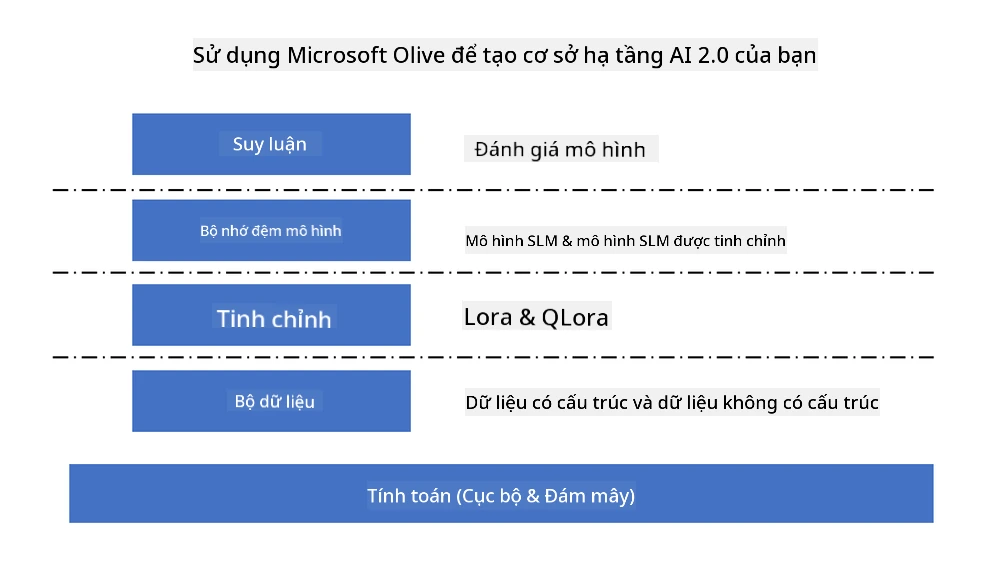
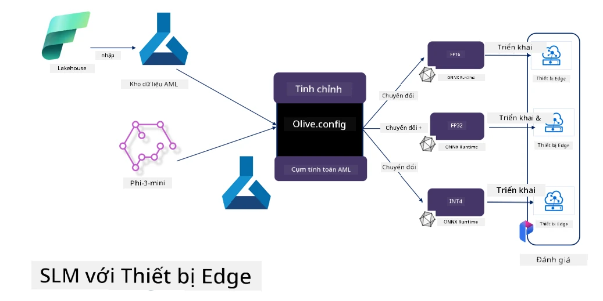

# **Tinh chỉnh Phi-3 với Microsoft Olive**

[Olive](https://github.com/microsoft/OLive?WT.mc_id=aiml-138114-kinfeylo) là một công cụ tối ưu hóa mô hình nhận biết phần cứng dễ sử dụng, kết hợp các kỹ thuật hàng đầu trong ngành về nén, tối ưu và biên dịch mô hình.

Nó được thiết kế để đơn giản hóa quá trình tối ưu hóa các mô hình học máy, đảm bảo tận dụng hiệu quả nhất các kiến trúc phần cứng cụ thể.

Dù bạn làm việc trên các ứng dụng đám mây hay thiết bị biên, Olive giúp bạn tối ưu mô hình một cách dễ dàng và hiệu quả.

## Tính năng chính:
- Olive tổng hợp và tự động hóa các kỹ thuật tối ưu cho các mục tiêu phần cứng mong muốn.
- Không có một kỹ thuật tối ưu nào phù hợp cho mọi trường hợp, vì vậy Olive cho phép mở rộng bằng cách cho phép các chuyên gia trong ngành tích hợp các sáng tạo tối ưu của họ.

## Giảm công sức kỹ thuật:
- Các nhà phát triển thường phải học và sử dụng nhiều bộ công cụ riêng biệt của các nhà cung cấp phần cứng để chuẩn bị và tối ưu mô hình đã huấn luyện trước khi triển khai.
- Olive đơn giản hóa trải nghiệm này bằng cách tự động hóa các kỹ thuật tối ưu cho phần cứng mong muốn.

## Giải pháp tối ưu đầu-cuối sẵn sàng sử dụng:

Bằng cách kết hợp và tinh chỉnh các kỹ thuật tích hợp, Olive cung cấp một giải pháp thống nhất cho tối ưu hóa đầu-cuối.
Nó cân nhắc các ràng buộc như độ chính xác và độ trễ trong quá trình tối ưu mô hình.

## Sử dụng Microsoft Olive để tinh chỉnh

Microsoft Olive là một công cụ tối ưu hóa mô hình mã nguồn mở rất dễ sử dụng, có thể bao phủ cả tinh chỉnh và tham chiếu trong lĩnh vực trí tuệ nhân tạo sinh tạo. Chỉ cần cấu hình đơn giản, kết hợp với việc sử dụng các mô hình ngôn ngữ nhỏ mã nguồn mở và môi trường runtime liên quan (AzureML / GPU, CPU cục bộ, DirectML), bạn có thể hoàn thành việc tinh chỉnh hoặc tham chiếu mô hình thông qua tối ưu hóa tự động, và tìm ra mô hình tốt nhất để triển khai lên đám mây hoặc trên các thiết bị biên. Giúp doanh nghiệp xây dựng các mô hình chuyên ngành riêng của mình tại chỗ và trên đám mây.



## Tinh chỉnh Phi-3 với Microsoft Olive



## Mã mẫu và ví dụ Phi-3 Olive
Trong ví dụ này, bạn sẽ sử dụng Olive để:

- Tinh chỉnh một bộ điều chỉnh LoRA để phân loại các cụm từ thành Buồn, Vui, Sợ hãi, Ngạc nhiên.
- Hợp nhất trọng số bộ điều chỉnh vào mô hình gốc.
- Tối ưu và lượng tử hóa mô hình thành int4.

[Mã mẫu](../../code/03.Finetuning/olive-ort-example/README.md)

### Cài đặt Microsoft Olive

Việc cài đặt Microsoft Olive rất đơn giản, có thể cài cho CPU, GPU, DirectML và Azure ML

```bash
pip install olive-ai
```

Nếu bạn muốn chạy mô hình ONNX với CPU, bạn có thể dùng

```bash
pip install olive-ai[cpu]
```

Nếu bạn muốn chạy mô hình ONNX với GPU, bạn có thể dùng

```python
pip install olive-ai[gpu]
```

Nếu bạn muốn sử dụng Azure ML, dùng

```python
pip install git+https://github.com/microsoft/Olive#egg=olive-ai[azureml]
```

**Lưu ý**  
Yêu cầu hệ điều hành: Ubuntu 20.04 / 22.04

### **Config.json của Microsoft Olive**

Sau khi cài đặt, bạn có thể cấu hình các thiết lập riêng cho từng mô hình thông qua file Config, bao gồm dữ liệu, tính toán, huấn luyện, triển khai và sinh mô hình.

**1. Dữ liệu**

Trên Microsoft Olive, có thể hỗ trợ huấn luyện với dữ liệu cục bộ và dữ liệu đám mây, có thể cấu hình trong phần cài đặt.

*Cài đặt dữ liệu cục bộ*

Bạn có thể dễ dàng thiết lập bộ dữ liệu cần huấn luyện để tinh chỉnh, thường ở định dạng json, và điều chỉnh theo mẫu dữ liệu. Việc này cần được điều chỉnh dựa trên yêu cầu của mô hình (ví dụ, điều chỉnh theo định dạng yêu cầu của Microsoft Phi-3-mini. Nếu bạn có các mô hình khác, vui lòng tham khảo định dạng tinh chỉnh cần thiết của các mô hình đó để xử lý)

```json

    "data_configs": [
        {
            "name": "dataset_default_train",
            "type": "HuggingfaceContainer",
            "load_dataset_config": {
                "params": {
                    "data_name": "json", 
                    "data_files":"dataset/dataset-classification.json",
                    "split": "train"
                }
            },
            "pre_process_data_config": {
                "params": {
                    "dataset_type": "corpus",
                    "text_cols": [
                            "phrase",
                            "tone"
                    ],
                    "text_template": "### Text: {phrase}\n### The tone is:\n{tone}",
                    "corpus_strategy": "join",
                    "source_max_len": 2048,
                    "pad_to_max_len": false,
                    "use_attention_mask": false
                }
            }
        }
    ],
```

*Cài đặt nguồn dữ liệu đám mây*

Bằng cách liên kết kho dữ liệu của Azure AI Studio/Azure Machine Learning Service để truy cập dữ liệu trên đám mây, bạn có thể chọn nhập các nguồn dữ liệu khác nhau vào Azure AI Studio/Azure Machine Learning Service thông qua Microsoft Fabric và Azure Data làm hỗ trợ cho việc tinh chỉnh dữ liệu.

```json

    "data_configs": [
        {
            "name": "dataset_default_train",
            "type": "HuggingfaceContainer",
            "load_dataset_config": {
                "params": {
                    "data_name": "json", 
                    "data_files": {
                        "type": "azureml_datastore",
                        "config": {
                            "azureml_client": {
                                "subscription_id": "Your Azure Subscrition ID",
                                "resource_group": "Your Azure Resource Group",
                                "workspace_name": "Your Azure ML Workspaces name"
                            },
                            "datastore_name": "workspaceblobstore",
                            "relative_path": "Your train_data.json Azure ML Location"
                        }
                    },
                    "split": "train"
                }
            },
            "pre_process_data_config": {
                "params": {
                    "dataset_type": "corpus",
                    "text_cols": [
                            "Question",
                            "Best Answer"
                    ],
                    "text_template": "<|user|>\n{Question}<|end|>\n<|assistant|>\n{Best Answer}\n<|end|>",
                    "corpus_strategy": "join",
                    "source_max_len": 2048,
                    "pad_to_max_len": false,
                    "use_attention_mask": false
                }
            }
        }
    ],
    
```

**2. Cấu hình tính toán**

Nếu bạn cần chạy cục bộ, có thể sử dụng trực tiếp tài nguyên dữ liệu cục bộ. Nếu cần dùng tài nguyên của Azure AI Studio / Azure Machine Learning Service, bạn cần cấu hình các tham số Azure liên quan, tên tài nguyên tính toán, v.v.

```json

    "systems": {
        "aml": {
            "type": "AzureML",
            "config": {
                "accelerators": ["gpu"],
                "hf_token": true,
                "aml_compute": "Your Azure AI Studio / Azure Machine Learning Service Compute Name",
                "aml_docker_config": {
                    "base_image": "Your Azure AI Studio / Azure Machine Learning Service docker",
                    "conda_file_path": "conda.yaml"
                }
            }
        },
        "azure_arc": {
            "type": "AzureML",
            "config": {
                "accelerators": ["gpu"],
                "aml_compute": "Your Azure AI Studio / Azure Machine Learning Service Compute Name",
                "aml_docker_config": {
                    "base_image": "Your Azure AI Studio / Azure Machine Learning Service docker",
                    "conda_file_path": "conda.yaml"
                }
            }
        }
    },
```

***Lưu ý***

Vì chạy qua container trên Azure AI Studio/Azure Machine Learning Service, môi trường cần thiết phải được cấu hình. Việc này được cấu hình trong file conda.yaml.

```yaml

name: project_environment
channels:
  - defaults
dependencies:
  - python=3.8.13
  - pip=22.3.1
  - pip:
      - einops
      - accelerate
      - azure-keyvault-secrets
      - azure-identity
      - bitsandbytes
      - datasets
      - huggingface_hub
      - peft
      - scipy
      - sentencepiece
      - torch>=2.2.0
      - transformers
      - git+https://github.com/microsoft/Olive@jiapli/mlflow_loading_fix#egg=olive-ai[gpu]
      - --extra-index-url https://aiinfra.pkgs.visualstudio.com/PublicPackages/_packaging/ORT-Nightly/pypi/simple/ 
      - ort-nightly-gpu==1.18.0.dev20240307004
      - --extra-index-url https://aiinfra.pkgs.visualstudio.com/PublicPackages/_packaging/onnxruntime-genai/pypi/simple/
      - onnxruntime-genai-cuda

    

```

**3. Chọn SLM của bạn**

Bạn có thể sử dụng mô hình trực tiếp từ Hugging Face, hoặc kết hợp trực tiếp với Model Catalog của Azure AI Studio / Azure Machine Learning để chọn mô hình sử dụng. Trong ví dụ mã dưới đây, chúng ta sẽ dùng Microsoft Phi-3-mini làm ví dụ.

Nếu bạn có mô hình cục bộ, có thể dùng cách này

```json

    "input_model":{
        "type": "PyTorchModel",
        "config": {
            "hf_config": {
                "model_name": "model-cache/microsoft/phi-3-mini",
                "task": "text-generation",
                "model_loading_args": {
                    "trust_remote_code": true
                }
            }
        }
    },
```

Nếu bạn muốn dùng mô hình từ Azure AI Studio / Azure Machine Learning Service, có thể dùng cách này

```json

    "input_model":{
        "type": "PyTorchModel",
        "config": {
            "model_path": {
                "type": "azureml_registry_model",
                "config": {
                    "name": "microsoft/Phi-3-mini-4k-instruct",
                    "registry_name": "azureml-msr",
                    "version": "11"
                }
            },
             "model_file_format": "PyTorch.MLflow",
             "hf_config": {
                "model_name": "microsoft/Phi-3-mini-4k-instruct",
                "task": "text-generation",
                "from_pretrained_args": {
                    "trust_remote_code": true
                }
            }
        }
    },
```

**Lưu ý:**  
Chúng ta cần tích hợp với Azure AI Studio / Azure Machine Learning Service, nên khi thiết lập mô hình, vui lòng tham khảo số phiên bản và tên liên quan.

Tất cả mô hình trên Azure cần được đặt ở dạng PyTorch.MLflow

Bạn cần có tài khoản Hugging Face và liên kết khóa với giá trị Key của Azure AI Studio / Azure Machine Learning

**4. Thuật toán**

Microsoft Olive đóng gói rất tốt các thuật toán tinh chỉnh Lora và QLora. Bạn chỉ cần cấu hình một số tham số liên quan. Ở đây tôi lấy QLora làm ví dụ.

```json
        "lora": {
            "type": "LoRA",
            "config": {
                "target_modules": [
                    "o_proj",
                    "qkv_proj"
                ],
                "double_quant": true,
                "lora_r": 64,
                "lora_alpha": 64,
                "lora_dropout": 0.1,
                "train_data_config": "dataset_default_train",
                "eval_dataset_size": 0.3,
                "training_args": {
                    "seed": 0,
                    "data_seed": 42,
                    "per_device_train_batch_size": 1,
                    "per_device_eval_batch_size": 1,
                    "gradient_accumulation_steps": 4,
                    "gradient_checkpointing": false,
                    "learning_rate": 0.0001,
                    "num_train_epochs": 3,
                    "max_steps": 10,
                    "logging_steps": 10,
                    "evaluation_strategy": "steps",
                    "eval_steps": 187,
                    "group_by_length": true,
                    "adam_beta2": 0.999,
                    "max_grad_norm": 0.3
                }
            }
        },
```

Nếu bạn muốn chuyển đổi lượng tử hóa, nhánh chính của Microsoft Olive đã hỗ trợ phương pháp onnxruntime-genai. Bạn có thể thiết lập theo nhu cầu:

1. Hợp nhất trọng số adapter vào mô hình gốc  
2. Chuyển mô hình sang onnx với độ chính xác yêu cầu bằng ModelBuilder

ví dụ như chuyển sang lượng tử hóa INT4

```json

        "merge_adapter_weights": {
            "type": "MergeAdapterWeights"
        },
        "builder": {
            "type": "ModelBuilder",
            "config": {
                "precision": "int4"
            }
        }
```

**Lưu ý**  
- Nếu bạn dùng QLoRA, hiện tại chưa hỗ trợ chuyển đổi lượng tử hóa của ONNXRuntime-genai.  
- Cần lưu ý rằng bạn có thể thiết lập các bước trên theo nhu cầu riêng. Không nhất thiết phải cấu hình đầy đủ tất cả các bước trên. Tùy theo nhu cầu, bạn có thể dùng trực tiếp các bước thuật toán mà không cần tinh chỉnh. Cuối cùng bạn cần cấu hình các engine liên quan.

```json

    "engine": {
        "log_severity_level": 0,
        "host": "aml",
        "target": "aml",
        "search_strategy": false,
        "execution_providers": ["CUDAExecutionProvider"],
        "cache_dir": "../model-cache/models/phi3-finetuned/cache",
        "output_dir" : "../model-cache/models/phi3-finetuned"
    }
```

**5. Hoàn thành tinh chỉnh**

Trên dòng lệnh, thực thi trong thư mục chứa olive-config.json

```bash
olive run --config olive-config.json  
```

**Tuyên bố từ chối trách nhiệm**:  
Tài liệu này đã được dịch bằng dịch vụ dịch thuật AI [Co-op Translator](https://github.com/Azure/co-op-translator). Mặc dù chúng tôi cố gắng đảm bảo độ chính xác, xin lưu ý rằng bản dịch tự động có thể chứa lỗi hoặc không chính xác. Tài liệu gốc bằng ngôn ngữ gốc của nó nên được coi là nguồn chính xác và đáng tin cậy. Đối với các thông tin quan trọng, nên sử dụng dịch vụ dịch thuật chuyên nghiệp do con người thực hiện. Chúng tôi không chịu trách nhiệm về bất kỳ sự hiểu lầm hoặc giải thích sai nào phát sinh từ việc sử dụng bản dịch này.