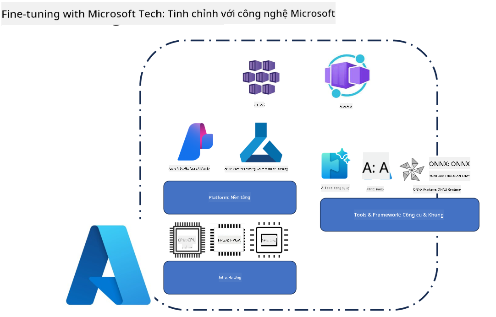
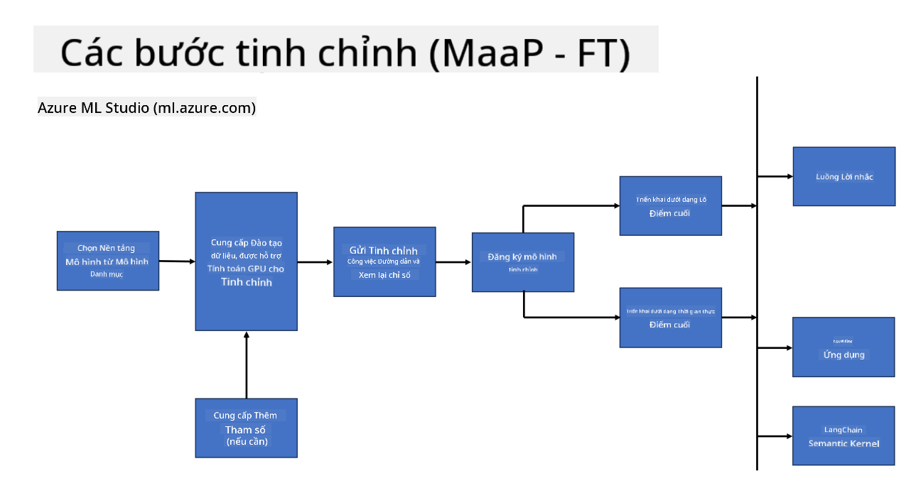
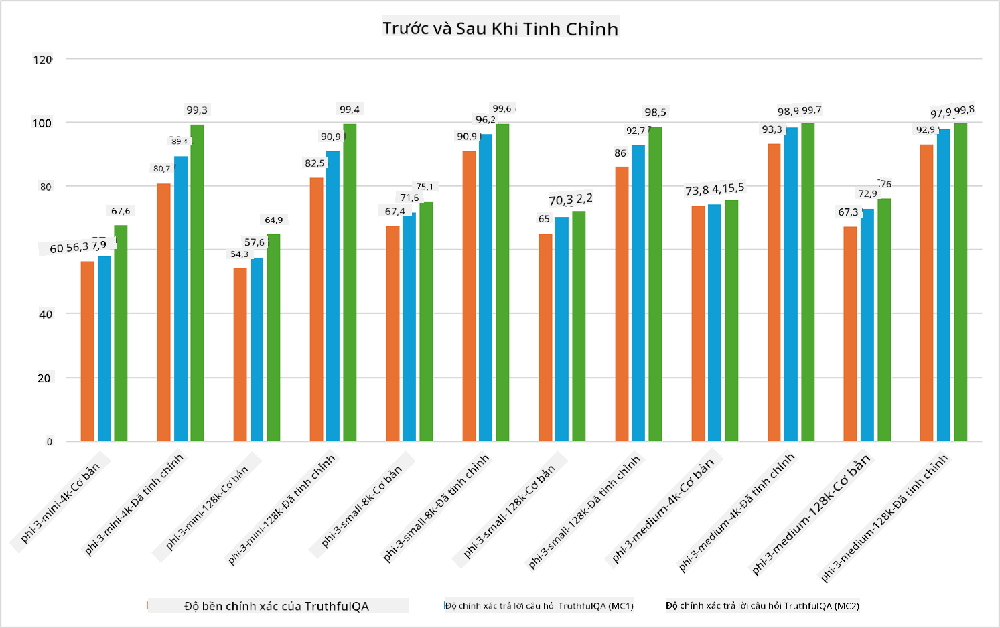

<!--
CO_OP_TRANSLATOR_METADATA:
{
  "original_hash": "cb5648935f63edc17e95ce38f23adc32",
  "translation_date": "2025-05-09T21:56:37+00:00",
  "source_file": "md/03.FineTuning/FineTuning_Scenarios.md",
  "language_code": "vi"
}
-->
## Các Kịch Bản Tinh Chỉnh

**Nền tảng** Bao gồm nhiều công nghệ khác nhau như Azure AI Foundry, Azure Machine Learning, AI Tools, Kaito và ONNX Runtime.

**Hạ tầng** Bao gồm CPU và FPGA, những thành phần thiết yếu cho quá trình tinh chỉnh. Hãy để tôi giới thiệu các biểu tượng cho từng công nghệ này.

**Công cụ & Framework** Bao gồm ONNX Runtime và ONNX Runtime. Hãy để tôi giới thiệu các biểu tượng cho từng công nghệ này.
[Chèn biểu tượng cho ONNX Runtime và ONNX Runtime]

Quá trình tinh chỉnh với công nghệ Microsoft bao gồm nhiều thành phần và công cụ khác nhau. Bằng cách hiểu và sử dụng các công nghệ này, chúng ta có thể tinh chỉnh ứng dụng một cách hiệu quả và tạo ra các giải pháp tốt hơn.

## Mô hình như một Dịch vụ

Tinh chỉnh mô hình bằng cách sử dụng tinh chỉnh được lưu trữ, không cần tạo và quản lý tài nguyên tính toán.

Tinh chỉnh serverless có sẵn cho các mô hình Phi-3-mini và Phi-3-medium, cho phép các nhà phát triển nhanh chóng và dễ dàng tùy chỉnh mô hình cho các kịch bản đám mây và edge mà không cần phải sắp xếp tài nguyên tính toán. Chúng tôi cũng đã công bố rằng Phi-3-small hiện có sẵn thông qua dịch vụ Models-as-a-Service, giúp các nhà phát triển bắt đầu phát triển AI một cách nhanh chóng và dễ dàng mà không phải quản lý hạ tầng bên dưới.

## Mô hình như một Nền tảng

Người dùng tự quản lý tài nguyên tính toán để tinh chỉnh mô hình của họ.

[Fine Tuning Sample](https://github.com/Azure/azureml-examples/blob/main/sdk/python/foundation-models/system/finetune/chat-completion/chat-completion.ipynb)

## Các Kịch Bản Tinh Chỉnh

| | | | | | | |
|-|-|-|-|-|-|-|
|Kịch bản|LoRA|QLoRA|PEFT|DeepSpeed|ZeRO|DORA|
|Điều chỉnh LLM đã được huấn luyện trước cho các nhiệm vụ hoặc lĩnh vực cụ thể|Có|Có|Có|Có|Có|Có|
|Tinh chỉnh cho các nhiệm vụ NLP như phân loại văn bản, nhận dạng thực thể có tên và dịch máy|Có|Có|Có|Có|Có|Có|
|Tinh chỉnh cho các nhiệm vụ hỏi đáp (QA)|Có|Có|Có|Có|Có|Có|
|Tinh chỉnh để tạo phản hồi giống con người trong chatbot|Có|Có|Có|Có|Có|Có|
|Tinh chỉnh để tạo nhạc, nghệ thuật hoặc các hình thức sáng tạo khác|Có|Có|Có|Có|Có|Có|
|Giảm chi phí tính toán và tài chính|Có|Có|Không|Có|Có|Không|
|Giảm sử dụng bộ nhớ|Không|Có|Không|Có|Có|Có|
|Sử dụng ít tham số hơn để tinh chỉnh hiệu quả|Không|Có|Có|Không|Không|Có|
|Hình thức song song dữ liệu tiết kiệm bộ nhớ cho phép truy cập bộ nhớ GPU tổng hợp của tất cả các thiết bị GPU có sẵn|Không|Không|Không|Có|Có|Có|

## Ví dụ về Hiệu Suất Tinh Chỉnh

**Tuyên bố từ chối trách nhiệm**:  
Tài liệu này đã được dịch bằng dịch vụ dịch thuật AI [Co-op Translator](https://github.com/Azure/co-op-translator). Mặc dù chúng tôi cố gắng đảm bảo độ chính xác, xin lưu ý rằng các bản dịch tự động có thể chứa lỗi hoặc không chính xác. Tài liệu gốc bằng ngôn ngữ gốc nên được coi là nguồn tham khảo chính thức. Đối với các thông tin quan trọng, nên sử dụng dịch vụ dịch thuật chuyên nghiệp do con người thực hiện. Chúng tôi không chịu trách nhiệm về bất kỳ hiểu lầm hoặc giải thích sai nào phát sinh từ việc sử dụng bản dịch này.