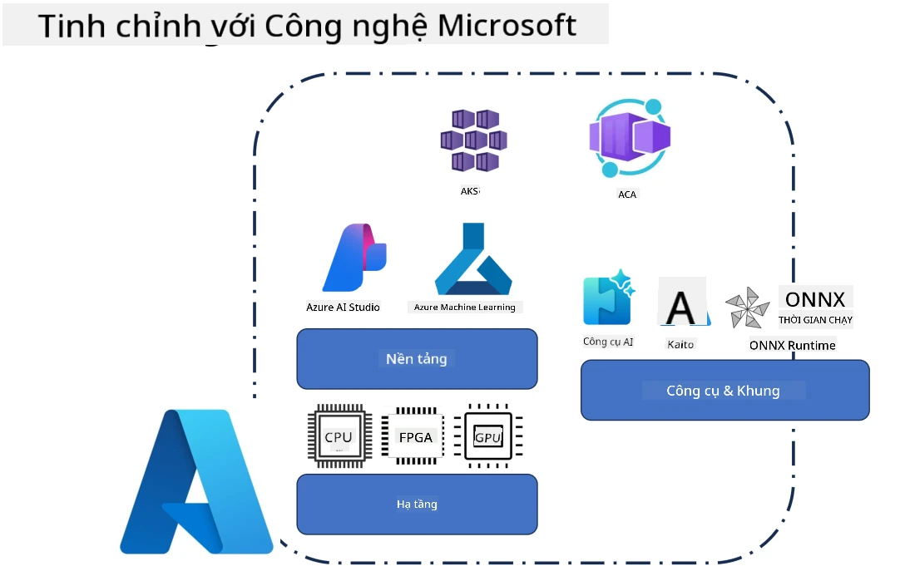
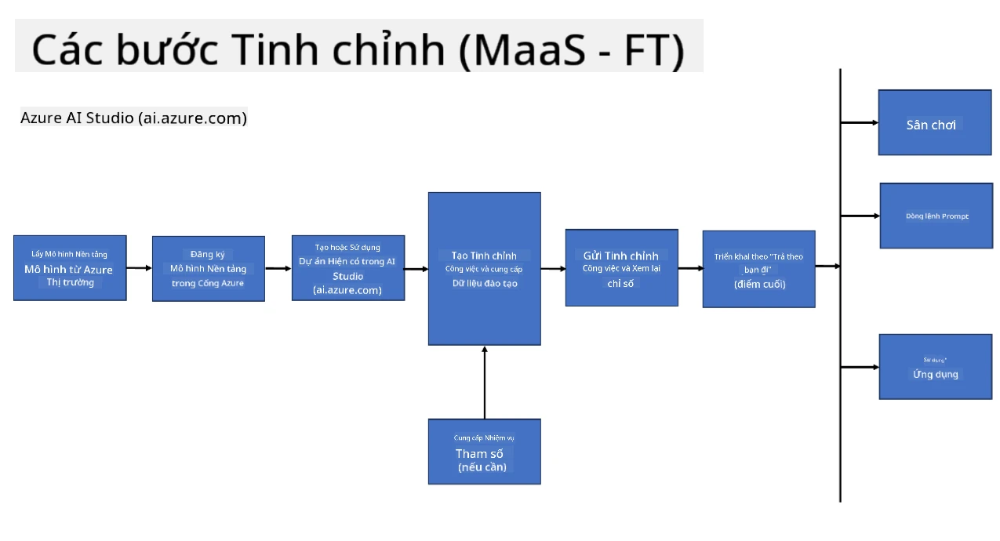
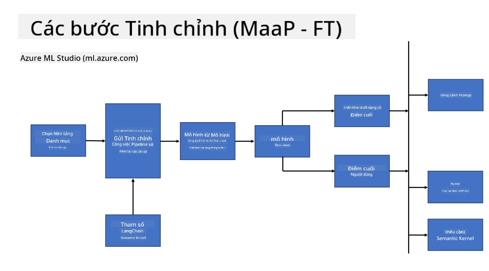
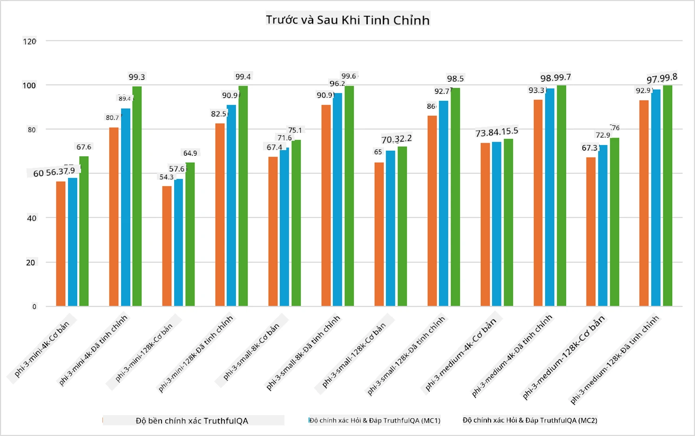

## Tình Huống Tinh Chỉnh

Phần này cung cấp tổng quan về các tình huống tinh chỉnh trong môi trường Microsoft Foundry và Azure, bao gồm các mô hình triển khai, các lớp hạ tầng, và các kỹ thuật tối ưu hóa thường dùng.

**Nền tảng**  
Bao gồm các dịch vụ được quản lý như Microsoft Foundry (trước đây là Azure AI Foundry) và Azure Machine Learning, cung cấp quản lý mô hình, điều phối, theo dõi thí nghiệm và các quy trình triển khai.

**Hạ tầng**  
Tinh chỉnh yêu cầu tài nguyên tính toán có khả năng mở rộng. Trong môi trường Azure, điều này thường bao gồm máy ảo dựa trên GPU và tài nguyên CPU cho các khối lượng công việc nhẹ, cùng với bộ nhớ lưu trữ có thể mở rộng cho các bộ dữ liệu và điểm kiểm tra.

**Công cụ & Khung làm việc**  
Các quy trình tinh chỉnh thường dựa vào các khung làm việc và thư viện tối ưu như Hugging Face Transformers, DeepSpeed, và PEFT (Tinh Chỉnh Hiệu Quả Tham Số).

Quy trình tinh chỉnh với công nghệ Microsoft trải dài trên dịch vụ nền tảng, hạ tầng tính toán và các khung đào tạo. Bằng cách hiểu cách các thành phần này phối hợp, nhà phát triển có thể điều chỉnh hiệu quả các mô hình nền tảng cho các tác vụ và kịch bản sản xuất cụ thể.

## Mô Hình Dưới Dạng Dịch Vụ

Tinh chỉnh mô hình sử dụng dịch vụ tinh chỉnh lưu trữ, không cần tạo và quản lý tài nguyên tính toán.

Tinh chỉnh không máy chủ hiện đã có cho các gia đình mô hình Phi-3, Phi-3.5, và Phi-4, giúp nhà phát triển nhanh chóng và dễ dàng tùy chỉnh mô hình cho các kịch bản đám mây và biên mà không cần phải sắp xếp tài nguyên tính toán.

## Mô Hình Dưới Dạng Nền Tảng

Người dùng tự quản lý tài nguyên tính toán để thực hiện tinh chỉnh mô hình của họ.

[Ví dụ Tinh Chỉnh](https://github.com/Azure/azureml-examples/blob/main/sdk/python/foundation-models/system/finetune/chat-completion/chat-completion.ipynb)

## So Sánh Các Kỹ Thuật Tinh Chỉnh

|Tình Huống|LoRA|QLoRA|PEFT|DeepSpeed|ZeRO|DoRA|
|---|---|---|---|---|---|---|
|Điều chỉnh các LLM đã được huấn luyện trước cho các tác vụ hoặc lĩnh vực cụ thể|Có|Có|Có|Có|Có|Có|
|Tinh chỉnh cho các nhiệm vụ NLP như phân loại văn bản, nhận dạng thực thể đặt tên, và dịch máy|Có|Có|Có|Có|Có|Có|
|Tinh chỉnh cho các nhiệm vụ Hỏi Đáp|Có|Có|Có|Có|Có|Có|
|Tinh chỉnh để tạo phản hồi giống con người trong chatbot|Có|Có|Có|Có|Có|Có|
|Tinh chỉnh để tạo nhạc, nghệ thuật hoặc các hình thức sáng tạo khác|Có|Có|Có|Có|Có|Có|
|Giảm chi phí tính toán và tài chính|Có|Có|Có|Có|Có|Có|
|Giảm sử dụng bộ nhớ|Có|Có|Có|Có|Có|Có|
|Dùng ít tham số hơn để tinh chỉnh hiệu quả|Có|Có|Có|Không|Không|Có|
|Dạng song song dữ liệu hiệu quả về bộ nhớ cho phép sử dụng bộ nhớ GPU tổng hợp của tất cả các thiết bị GPU có sẵn|Không|Không|Không|Có|Có|Không|

> [!NOTE]
> LoRA, QLoRA, PEFT, và DoRA là các phương pháp tinh chỉnh tham số hiệu quả, trong khi DeepSpeed và ZeRO tập trung vào đào tạo phân tán và tối ưu hóa bộ nhớ.

## Ví Dụ Hiệu Suất Tinh Chỉnh

---

<!-- CO-OP TRANSLATOR DISCLAIMER START -->
**Tuyên bố từ chối trách nhiệm**:  
Tài liệu này đã được dịch bằng dịch vụ dịch thuật AI [Co-op Translator](https://github.com/Azure/co-op-translator). Mặc dù chúng tôi cố gắng đảm bảo độ chính xác, xin lưu ý rằng bản dịch tự động có thể chứa lỗi hoặc không chính xác. Tài liệu gốc bằng ngôn ngữ gốc của nó nên được coi là nguồn tham khảo chính thức. Đối với các thông tin quan trọng, việc sử dụng dịch vụ dịch thuật chuyên nghiệp do con người thực hiện được khuyến nghị. Chúng tôi không chịu trách nhiệm về bất kỳ sự hiểu lầm hoặc diễn giải sai nào phát sinh từ việc sử dụng bản dịch này.
<!-- CO-OP TRANSLATOR DISCLAIMER END -->