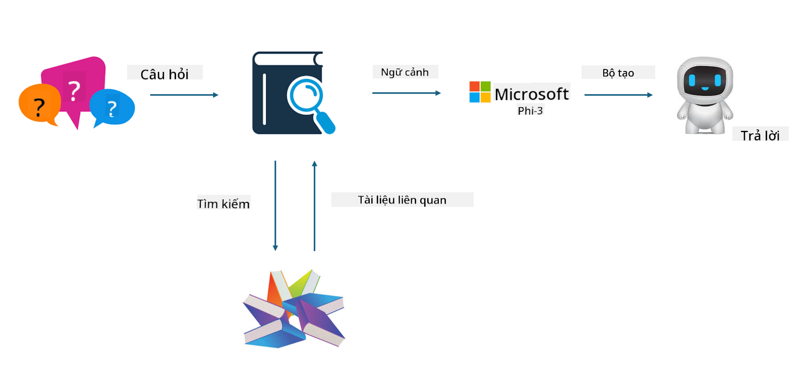

<!--
CO_OP_TRANSLATOR_METADATA:
{
  "original_hash": "e4e010400c2918557b36bb932a14004c",
  "translation_date": "2025-07-17T09:30:23+00:00",
  "source_file": "md/03.FineTuning/FineTuning_vs_RAG.md",
  "language_code": "vi"
}
-->
## Finetuning vs RAG

## Retrieval Augmented Generation

RAG là sự kết hợp giữa truy xuất dữ liệu và tạo văn bản. Dữ liệu có cấu trúc và không có cấu trúc của doanh nghiệp được lưu trữ trong cơ sở dữ liệu vector. Khi tìm kiếm nội dung liên quan, bản tóm tắt và nội dung phù hợp sẽ được tìm ra để tạo thành ngữ cảnh, sau đó kết hợp với khả năng hoàn thiện văn bản của LLM/SLM để tạo ra nội dung.

## Quy trình RAG

## Fine-tuning
Fine-tuning dựa trên việc cải tiến một mô hình nhất định. Nó không cần bắt đầu từ thuật toán mô hình, nhưng dữ liệu cần được tích lũy liên tục. Nếu bạn muốn thuật ngữ và cách diễn đạt ngôn ngữ chính xác hơn trong các ứng dụng ngành, fine-tuning là lựa chọn tốt hơn. Nhưng nếu dữ liệu của bạn thay đổi thường xuyên, fine-tuning có thể trở nên phức tạp.

## Cách lựa chọn
Nếu câu trả lời của chúng ta cần tham khảo dữ liệu bên ngoài, RAG là lựa chọn tốt nhất.

Nếu bạn cần đầu ra kiến thức ngành ổn định và chính xác, fine-tuning sẽ là lựa chọn phù hợp. RAG ưu tiên lấy nội dung liên quan nhưng có thể không luôn nắm bắt được những điểm tinh tế chuyên ngành.

Fine-tuning đòi hỏi bộ dữ liệu chất lượng cao, và nếu chỉ là một phạm vi dữ liệu nhỏ, nó sẽ không tạo ra nhiều khác biệt. RAG linh hoạt hơn.  
Fine-tuning là một hộp đen, mang tính siêu hình, và khó hiểu cơ chế bên trong. Nhưng RAG giúp dễ dàng tìm nguồn gốc dữ liệu, từ đó điều chỉnh hiệu quả các ảo giác hoặc lỗi nội dung và cung cấp tính minh bạch tốt hơn.

**Tuyên bố từ chối trách nhiệm**:  
Tài liệu này đã được dịch bằng dịch vụ dịch thuật AI [Co-op Translator](https://github.com/Azure/co-op-translator). Mặc dù chúng tôi cố gắng đảm bảo độ chính xác, xin lưu ý rằng bản dịch tự động có thể chứa lỗi hoặc không chính xác. Tài liệu gốc bằng ngôn ngữ gốc của nó nên được coi là nguồn chính xác và đáng tin cậy. Đối với các thông tin quan trọng, nên sử dụng dịch vụ dịch thuật chuyên nghiệp do con người thực hiện. Chúng tôi không chịu trách nhiệm về bất kỳ sự hiểu lầm hoặc giải thích sai nào phát sinh từ việc sử dụng bản dịch này.