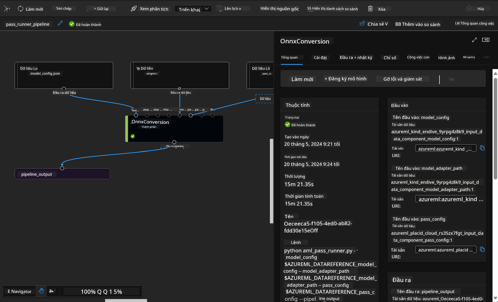

<!--
CO_OP_TRANSLATOR_METADATA:
{
  "original_hash": "7fe541373802e33568e94e13226d463c",
  "translation_date": "2025-05-09T22:21:59+00:00",
  "source_file": "md/03.FineTuning/Introduce_AzureML.md",
  "language_code": "vi"
}
-->
# **Giới thiệu Dịch vụ Azure Machine Learning**

[Azure Machine Learning](https://ml.azure.com?WT.mc_id=aiml-138114-kinfeylo) là dịch vụ đám mây giúp tăng tốc và quản lý vòng đời dự án máy học (ML).

Các chuyên gia ML, nhà khoa học dữ liệu và kỹ sư có thể sử dụng nó trong công việc hàng ngày để:

- Huấn luyện và triển khai mô hình.  
Quản lý các hoạt động máy học (MLOps).  
- Bạn có thể tạo mô hình trong Azure Machine Learning hoặc sử dụng mô hình được xây dựng từ nền tảng mã nguồn mở như PyTorch, TensorFlow, hoặc scikit-learn.  
- Các công cụ MLOps giúp bạn giám sát, huấn luyện lại và triển khai lại mô hình.

## Azure Machine Learning dành cho ai?

**Nhà khoa học dữ liệu và kỹ sư ML**

Họ có thể sử dụng các công cụ để tăng tốc và tự động hóa công việc hàng ngày.  
Azure ML cung cấp các tính năng về công bằng, giải thích được, theo dõi và kiểm toán.  

**Nhà phát triển ứng dụng:**  
Họ có thể tích hợp mô hình vào ứng dụng hoặc dịch vụ một cách liền mạch.

**Nhà phát triển nền tảng**

Họ được truy cập bộ công cụ mạnh mẽ dựa trên các API bền vững của Azure Resource Manager.  
Các công cụ này cho phép xây dựng các công cụ ML tiên tiến.

**Doanh nghiệp**

Làm việc trên nền tảng đám mây Microsoft Azure, doanh nghiệp hưởng lợi từ bảo mật quen thuộc và kiểm soát truy cập theo vai trò.  
Thiết lập dự án để kiểm soát quyền truy cập dữ liệu được bảo vệ và các thao tác cụ thể.

## Nâng cao hiệu suất cho mọi thành viên trong nhóm  
Các dự án ML thường cần một nhóm với kỹ năng đa dạng để xây dựng và duy trì.

Azure ML cung cấp các công cụ giúp bạn:  
- Cộng tác với nhóm qua notebook chia sẻ, tài nguyên tính toán, serverless compute, dữ liệu và môi trường.  
- Phát triển mô hình với công bằng, giải thích được, theo dõi và kiểm toán để đáp ứng yêu cầu về nguồn gốc và tuân thủ kiểm toán.  
- Triển khai mô hình ML nhanh chóng, dễ dàng ở quy mô lớn, đồng thời quản lý và điều hành hiệu quả bằng MLOps.  
- Chạy các workload máy học ở bất kỳ đâu với quản trị, bảo mật và tuân thủ tích hợp sẵn.

## Công cụ nền tảng đa tương thích

Bất kỳ ai trong nhóm ML cũng có thể dùng công cụ yêu thích để hoàn thành công việc.  
Dù bạn đang chạy thí nghiệm nhanh, tinh chỉnh siêu tham số, xây dựng pipeline hay quản lý suy luận, bạn có thể sử dụng các giao diện quen thuộc như:  
- Azure Machine Learning Studio  
- Python SDK (v2)  
- Azure CLI (v2)  
- Azure Resource Manager REST APIs

Khi bạn tinh chỉnh mô hình và cộng tác trong suốt chu trình phát triển, bạn có thể chia sẻ và tìm kiếm tài sản, tài nguyên, và chỉ số ngay trong giao diện Azure Machine Learning studio.

## **LLM/SLM trong Azure ML**

Azure ML đã bổ sung nhiều chức năng liên quan đến LLM/SLM, kết hợp LLMOps và SLMOps để tạo ra nền tảng công nghệ trí tuệ nhân tạo sinh tạo trên quy mô doanh nghiệp.

### **Danh mục mô hình**

Người dùng doanh nghiệp có thể triển khai các mô hình khác nhau tùy theo các kịch bản kinh doanh khác nhau thông qua Danh mục mô hình, và cung cấp dịch vụ như Model as Service để các nhà phát triển hoặc người dùng doanh nghiệp truy cập.

Danh mục mô hình trong Azure Machine Learning studio là trung tâm để khám phá và sử dụng đa dạng các mô hình giúp bạn xây dựng ứng dụng Generative AI. Danh mục này bao gồm hàng trăm mô hình từ các nhà cung cấp như Azure OpenAI service, Mistral, Meta, Cohere, Nvidia, Hugging Face, bao gồm cả các mô hình do Microsoft huấn luyện. Các mô hình từ nhà cung cấp ngoài Microsoft được gọi là Non-Microsoft Products, theo định nghĩa trong Điều khoản Sản phẩm của Microsoft, và chịu các điều khoản đi kèm với mô hình đó.

### **Pipeline công việc**

Trọng tâm của pipeline máy học là chia nhỏ một nhiệm vụ máy học hoàn chỉnh thành một chuỗi các bước. Mỗi bước là một thành phần có thể quản lý được, có thể phát triển, tối ưu, cấu hình và tự động hóa riêng lẻ. Các bước được kết nối qua các giao diện rõ ràng. Dịch vụ pipeline của Azure Machine Learning tự động điều phối tất cả các phụ thuộc giữa các bước pipeline.

Trong việc tinh chỉnh SLM / LLM, chúng ta có thể quản lý dữ liệu, huấn luyện và quy trình sinh tạo thông qua Pipeline.

### **Prompt flow**

Lợi ích khi sử dụng Azure Machine Learning prompt flow  
Azure Machine Learning prompt flow cung cấp nhiều lợi ích giúp người dùng chuyển từ ý tưởng sang thí nghiệm và cuối cùng là ứng dụng LLM sẵn sàng cho sản xuất:

**Sự linh hoạt trong thiết kế prompt**

Trải nghiệm tạo tương tác: Azure Machine Learning prompt flow cung cấp biểu diễn trực quan cấu trúc flow, giúp người dùng dễ dàng hiểu và điều hướng dự án. Nó cũng cung cấp trải nghiệm lập trình giống notebook để phát triển và gỡ lỗi flow hiệu quả.  
Các biến thể để tinh chỉnh prompt: Người dùng có thể tạo và so sánh nhiều biến thể prompt, hỗ trợ quá trình tinh chỉnh lặp đi lặp lại.

Đánh giá: Các flow đánh giá tích hợp cho phép người dùng đánh giá chất lượng và hiệu quả của prompt và flow.

Tài nguyên toàn diện: Azure Machine Learning prompt flow bao gồm thư viện công cụ, mẫu, và khuôn mẫu tích hợp sẵn làm điểm khởi đầu cho phát triển, truyền cảm hứng sáng tạo và tăng tốc quá trình.

**Sẵn sàng cho doanh nghiệp với ứng dụng dựa trên LLM**

Cộng tác: Azure Machine Learning prompt flow hỗ trợ cộng tác nhóm, cho phép nhiều người cùng làm việc trên dự án thiết kế prompt, chia sẻ kiến thức và duy trì kiểm soát phiên bản.

Nền tảng tích hợp: Azure Machine Learning prompt flow đơn giản hóa toàn bộ quy trình thiết kế prompt, từ phát triển, đánh giá đến triển khai và giám sát. Người dùng có thể dễ dàng triển khai flow dưới dạng endpoint Azure Machine Learning và theo dõi hiệu suất theo thời gian thực, đảm bảo hoạt động tối ưu và cải tiến liên tục.

Giải pháp sẵn sàng doanh nghiệp của Azure Machine Learning: Prompt flow tận dụng các giải pháp sẵn sàng doanh nghiệp mạnh mẽ của Azure Machine Learning, cung cấp nền tảng bảo mật, mở rộng và tin cậy cho phát triển, thí nghiệm và triển khai flow.

Với Azure Machine Learning prompt flow, người dùng có thể phát huy sự linh hoạt trong thiết kế prompt, cộng tác hiệu quả và tận dụng các giải pháp chuẩn doanh nghiệp để phát triển và triển khai ứng dụng dựa trên LLM thành công.

Kết hợp sức mạnh tính toán, dữ liệu và các thành phần khác của Azure ML, các nhà phát triển doanh nghiệp có thể dễ dàng xây dựng các ứng dụng trí tuệ nhân tạo riêng của mình.

**Tuyên bố từ chối trách nhiệm**:  
Tài liệu này đã được dịch bằng dịch vụ dịch thuật AI [Co-op Translator](https://github.com/Azure/co-op-translator). Mặc dù chúng tôi cố gắng đảm bảo độ chính xác, xin lưu ý rằng bản dịch tự động có thể chứa lỗi hoặc không chính xác. Tài liệu gốc bằng ngôn ngữ gốc nên được coi là nguồn thông tin chính xác nhất. Đối với các thông tin quan trọng, nên sử dụng dịch vụ dịch thuật chuyên nghiệp do con người thực hiện. Chúng tôi không chịu trách nhiệm về bất kỳ sự hiểu lầm hay giải thích sai nào phát sinh từ việc sử dụng bản dịch này.