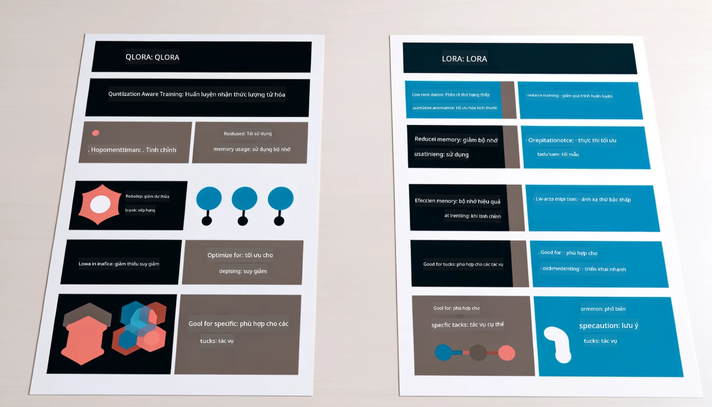

<!--
CO_OP_TRANSLATOR_METADATA:
{
  "original_hash": "743d7e9cb9c4e8ea642d77bee657a7fa",
  "translation_date": "2025-05-09T22:28:18+00:00",
  "source_file": "md/03.FineTuning/LetPhi3gotoIndustriy.md",
  "language_code": "vi"
}
-->
# **Hãy để Phi-3 trở thành chuyên gia trong ngành**

Để đưa mô hình Phi-3 vào một ngành công nghiệp, bạn cần thêm dữ liệu kinh doanh ngành vào mô hình Phi-3. Chúng ta có hai lựa chọn khác nhau, đầu tiên là RAG (Retrieval Augmented Generation) và thứ hai là Fine Tuning.

## **RAG và Fine-Tuning**

### **Retrieval Augmented Generation**

RAG là kết hợp giữa truy xuất dữ liệu và tạo văn bản. Dữ liệu có cấu trúc và không cấu trúc của doanh nghiệp được lưu trữ trong cơ sở dữ liệu vector. Khi tìm kiếm nội dung liên quan, bản tóm tắt và nội dung liên quan được tìm thấy để tạo thành một ngữ cảnh, sau đó kết hợp với khả năng hoàn thiện văn bản của LLM/SLM để tạo ra nội dung.

### **Fine-tuning**

Fine-tuning dựa trên việc cải tiến một mô hình nhất định. Nó không cần bắt đầu từ thuật toán mô hình, nhưng dữ liệu cần được tích lũy liên tục. Nếu bạn muốn thuật ngữ và cách diễn đạt trong ứng dụng ngành chính xác hơn, fine-tuning là lựa chọn tốt hơn. Nhưng nếu dữ liệu của bạn thay đổi thường xuyên, fine-tuning có thể trở nên phức tạp.

### **Cách lựa chọn**

1. Nếu câu trả lời của chúng ta cần đưa vào dữ liệu bên ngoài, RAG là lựa chọn tốt nhất

2. Nếu bạn cần đầu ra kiến thức ngành ổn định và chính xác, fine-tuning sẽ là lựa chọn tốt. RAG ưu tiên kéo nội dung liên quan nhưng có thể không luôn nắm bắt được các sắc thái chuyên môn.

3. Fine-tuning yêu cầu bộ dữ liệu chất lượng cao, và nếu chỉ là một phạm vi dữ liệu nhỏ, sẽ không tạo nhiều khác biệt. RAG linh hoạt hơn

4. Fine-tuning là một hộp đen, mang tính siêu hình, và rất khó hiểu cơ chế bên trong. Nhưng RAG giúp dễ dàng tìm nguồn gốc dữ liệu, từ đó hiệu quả trong việc điều chỉnh các ảo tưởng hoặc lỗi nội dung và cung cấp sự minh bạch tốt hơn.

### **Kịch bản**

1. Các ngành dọc yêu cầu từ vựng và cách diễn đạt chuyên môn cụ thể, ***Fine-tuning*** sẽ là lựa chọn tốt nhất

2. Hệ thống QA, liên quan đến tổng hợp các điểm kiến thức khác nhau, ***RAG*** sẽ là lựa chọn tốt nhất

3. Kết hợp quy trình kinh doanh tự động ***RAG + Fine-tuning*** là lựa chọn tốt nhất

## **Cách sử dụng RAG**

Cơ sở dữ liệu vector là tập hợp dữ liệu được lưu trữ dưới dạng toán học. Cơ sở dữ liệu vector giúp các mô hình học máy dễ dàng ghi nhớ các đầu vào trước đó, cho phép học máy được sử dụng để hỗ trợ các trường hợp như tìm kiếm, gợi ý và tạo văn bản. Dữ liệu có thể được nhận diện dựa trên các chỉ số tương đồng thay vì khớp chính xác, giúp mô hình máy tính hiểu được ngữ cảnh của dữ liệu.

Cơ sở dữ liệu vector là chìa khóa để hiện thực hóa RAG. Chúng ta có thể chuyển đổi dữ liệu thành lưu trữ vector thông qua các mô hình vector như text-embedding-3, jina-ai-embedding, v.v.

Tìm hiểu thêm về tạo ứng dụng RAG tại [https://github.com/microsoft/Phi-3CookBook](https://github.com/microsoft/Phi-3CookBook?WT.mc_id=aiml-138114-kinfeylo)

## **Cách sử dụng Fine-tuning**

Các thuật toán thường dùng trong Fine-tuning là Lora và QLora. Làm thế nào để chọn?
- [Tìm hiểu thêm với notebook mẫu này](../../../../code/04.Finetuning/Phi_3_Inference_Finetuning.ipynb)
- [Ví dụ mẫu Python FineTuning](../../../../code/04.Finetuning/FineTrainingScript.py)

### **Lora và QLora**

LoRA (Low-Rank Adaptation) và QLoRA (Quantized Low-Rank Adaptation) đều là các kỹ thuật dùng để fine-tune các mô hình ngôn ngữ lớn (LLMs) sử dụng Parameter Efficient Fine Tuning (PEFT). Các kỹ thuật PEFT được thiết kế để đào tạo mô hình hiệu quả hơn so với các phương pháp truyền thống.

LoRA là kỹ thuật fine-tuning độc lập giúp giảm bộ nhớ sử dụng bằng cách áp dụng phép xấp xỉ hạng thấp cho ma trận cập nhật trọng số. Nó mang lại thời gian đào tạo nhanh và duy trì hiệu suất gần với các phương pháp fine-tuning truyền thống.

QLoRA là phiên bản mở rộng của LoRA kết hợp kỹ thuật lượng tử hóa để giảm thêm bộ nhớ sử dụng. QLoRA lượng tử hóa độ chính xác của các tham số trọng số trong LLM đã được huấn luyện trước xuống mức 4-bit, tiết kiệm bộ nhớ hơn so với LoRA. Tuy nhiên, việc đào tạo QLoRA chậm hơn khoảng 30% so với LoRA do các bước lượng tử hóa và giải lượng tử bổ sung.

QLoRA sử dụng LoRA như một phụ kiện để sửa các lỗi phát sinh trong quá trình lượng tử hóa. QLoRA cho phép fine-tune các mô hình khổng lồ với hàng tỷ tham số trên các GPU nhỏ, có sẵn và phổ biến. Ví dụ, QLoRA có thể fine-tune một mô hình 70B tham số yêu cầu 36 GPU chỉ với 2

**Tuyên bố miễn trừ trách nhiệm**:  
Tài liệu này đã được dịch bằng dịch vụ dịch thuật AI [Co-op Translator](https://github.com/Azure/co-op-translator). Mặc dù chúng tôi cố gắng đảm bảo độ chính xác, xin lưu ý rằng các bản dịch tự động có thể chứa lỗi hoặc không chính xác. Tài liệu gốc bằng ngôn ngữ gốc của nó nên được coi là nguồn tham khảo chính thức. Đối với thông tin quan trọng, nên sử dụng dịch vụ dịch thuật chuyên nghiệp do con người thực hiện. Chúng tôi không chịu trách nhiệm về bất kỳ sự hiểu lầm hay giải thích sai nào phát sinh từ việc sử dụng bản dịch này.