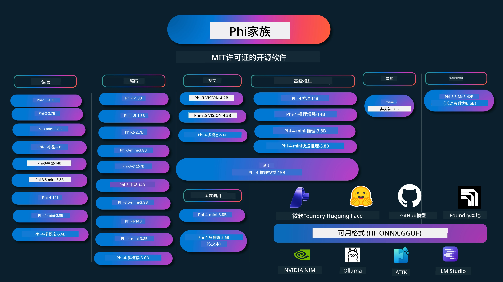

# Phi Cookbook：使用微软Phi模型的实操示例

[](https://codespaces.new/microsoft/phicookbook)
[](https://vscode.dev/redirect?url=vscode://ms-vscode-remote.remote-containers/cloneInVolume?url=https://github.com/microsoft/phicookbook)

[](https://GitHub.com/microsoft/phicookbook/graphs/contributors/?WT.mc_id=aiml-137032-kinfeylo)
[](https://GitHub.com/microsoft/phicookbook/issues/?WT.mc_id=aiml-137032-kinfeylo)
[](https://GitHub.com/microsoft/phicookbook/pulls/?WT.mc_id=aiml-137032-kinfeylo)
[](http://makeapullrequest.com?WT.mc_id=aiml-137032-kinfeylo)

[](https://GitHub.com/microsoft/phicookbook/watchers/?WT.mc_id=aiml-137032-kinfeylo)
[](https://GitHub.com/microsoft/phicookbook/network/?WT.mc_id=aiml-137032-kinfeylo)
[](https://GitHub.com/microsoft/phicookbook/stargazers/?WT.mc_id=aiml-137032-kinfeylo)

[](https://discord.com/invite/ByRwuEEgH4)

Phi 是微软开发的一系列开源AI模型。

Phi目前是最强大且性价比最高的小型语言模型（SLM），在多语言、推理、文本/聊天生成、编码、图像、音频及其他场景中拥有优异的基准表现。

你可以将Phi部署到云端或边缘设备，并且可以轻松使用有限计算能力构建生成式AI应用。

按照以下步骤开始使用这些资源：
1. **Fork 仓库**：点击 [](https://GitHub.com/microsoft/phicookbook/network/?WT.mc_id=aiml-137032-kinfeylo)
2. **克隆仓库**：`git clone https://github.com/microsoft/PhiCookBook.git`
3. [**加入Microsoft AI Discord社区，结识专家和开发者伙伴**](https://discord.com/invite/ByRwuEEgH4?WT.mc_id=aiml-137032-kinfeylo)



### 🌐 多语言支持

#### 通过GitHub Action支持（自动且始终保持最新）

<!-- CO-OP TRANSLATOR LANGUAGES TABLE START -->
[阿拉伯语](../ar/README.md) | [孟加拉语](../bn/README.md) | [保加利亚语](../bg/README.md) | [缅甸语 (Myanmar)](../my/README.md) | [中文（简体）](./README.md) | [中文（繁体，香港）](../zh-HK/README.md) | [中文（繁体，澳门）](../zh-MO/README.md) | [中文（繁体，台湾）](../zh-TW/README.md) | [克罗地亚语](../hr/README.md) | [捷克语](../cs/README.md) | [丹麦语](../da/README.md) | [荷兰语](../nl/README.md) | [爱沙尼亚语](../et/README.md) | [芬兰语](../fi/README.md) | [法语](../fr/README.md) | [德语](../de/README.md) | [希腊语](../el/README.md) | [希伯来语](../he/README.md) | [印地语](../hi/README.md) | [匈牙利语](../hu/README.md) | [印度尼西亚语](../id/README.md) | [意大利语](../it/README.md) | [日语](../ja/README.md) | [卡纳达语](../kn/README.md) | [韩语](../ko/README.md) | [立陶宛语](../lt/README.md) | [马来语](../ms/README.md) | [马拉雅拉姆语](../ml/README.md) | [马拉地语](../mr/README.md) | [尼泊尔语](../ne/README.md) | [尼日利亚皮钦语](../pcm/README.md) | [挪威语](../no/README.md) | [波斯语（法尔西语）](../fa/README.md) | [波兰语](../pl/README.md) | [葡萄牙语（巴西）](../pt-BR/README.md) | [葡萄牙语（葡萄牙）](../pt-PT/README.md) | [旁遮普语（古鲁穆基文）](../pa/README.md) | [罗马尼亚语](../ro/README.md) | [俄语](../ru/README.md) | [塞尔维亚语（西里尔字母）](../sr/README.md) | [斯洛伐克语](../sk/README.md) | [斯洛文尼亚语](../sl/README.md) | [西班牙语](../es/README.md) | [斯瓦希里语](../sw/README.md) | [瑞典语](../sv/README.md) | [他加禄语（菲律宾语）](../tl/README.md) | [泰米尔语](../ta/README.md) | [泰卢固语](../te/README.md) | [泰语](../th/README.md) | [土耳其语](../tr/README.md) | [乌克兰语](../uk/README.md) | [乌尔都语](../ur/README.md) | [越南语](../vi/README.md)

> **更喜欢本地克隆？**
>
> 本仓库包含50多种语言的翻译，显著增加了下载大小。若想克隆时不包含翻译，可以使用稀疏检出：
>
> **Bash / macOS / Linux:**
> ```bash
> git clone --filter=blob:none --sparse https://github.com/microsoft/PhiCookBook.git
> cd PhiCookBook
> git sparse-checkout set --no-cone '/*' '!translations' '!translated_images'
> ```
>
> **CMD（Windows）:**
> ```cmd
> git clone --filter=blob:none --sparse https://github.com/microsoft/PhiCookBook.git
> cd PhiCookBook
> git sparse-checkout set --no-cone "/*" "!translations" "!translated_images"
> ```
>
> 这样可以更快下载，获得完成课程所需的所有内容。
<!-- CO-OP TRANSLATOR LANGUAGES TABLE END -->

## 目录
- 介绍 - [欢迎加入Phi家族](./md/01.Introduction/01/01.PhiFamily.md) - [环境搭建](./md/01.Introduction/01/01.EnvironmentSetup.md) - [理解关键技术](./md/01.Introduction/01/01.Understandingtech.md) - [Phi模型的AI安全](./md/01.Introduction/01/01.AISafety.md) - [Phi硬件支持](./md/01.Introduction/01/01.Hardwaresupport.md) - [Phi模型及其跨平台可用性](./md/01.Introduction/01/01.Edgeandcloud.md) - [使用Guidance-ai和Phi](./md/01.Introduction/01/01.Guidance.md) - [GitHub市场模型](https://github.com/marketplace/models) - [Azure AI模型目录](https://ai.azure.com) - 不同环境下Phi推理 - [Hugging face](./md/01.Introduction/02/01.HF.md) - [GitHub模型](./md/01.Introduction/02/02.GitHubModel.md) - [微软Foundry模型目录](./md/01.Introduction/02/03.AzureAIFoundry.md) - [Ollama](./md/01.Introduction/02/04.Ollama.md) - [AI工具包 VSCode (AITK)](./md/01.Introduction/02/05.AITK.md) - [NVIDIA NIM](./md/01.Introduction/02/06.NVIDIA.md) - [Foundry本地](./md/01.Introduction/02/07.FoundryLocal.md) - Phi家族推理 - [iOS上的Phi推理](./md/01.Introduction/03/iOS_Inference.md) - [Android上的Phi推理](./md/01.Introduction/03/Android_Inference.md) - [Jetson上的Phi推理](./md/01.Introduction/03/Jetson_Inference.md) - [AI PC上的Phi推理](./md/01.Introduction/03/AIPC_Inference.md) - [使用Apple MLX框架进行Phi推理](./md/01.Introduction/03/MLX_Inference.md) - [本地服务器上的Phi推理](./md/01.Introduction/03/Local_Server_Inference.md) - [使用AI工具包远程服务器上的Phi推理](./md/01.Introduction/03/Remote_Interence.md) - [使用Rust进行Phi推理](./md/01.Introduction/03/Rust_Inference.md) - [本地Phi视觉推理](./md/01.Introduction/03/Vision_Inference.md) - [使用Kaito AKS，Azure容器（官方支持）进行Phi推理](./md/01.Introduction/03/Kaito_Inference.md) - [Phi量化](./md/01.Introduction/04/QuantifyingPhi.md) - [使用llama.cpp量化Phi-3.5 / 4](./md/01.Introduction/04/UsingLlamacppQuantifyingPhi.md) - [使用onnxruntime生成式AI扩展量化Phi-3.5 / 4](./md/01.Introduction/04/UsingORTGenAIQuantifyingPhi.md) - [使用Intel OpenVINO量化Phi-3.5 / 4](./md/01.Introduction/04/UsingIntelOpenVINOQuantifyingPhi.md) - [使用Apple MLX框架量化Phi-3.5 / 4](./md/01.Introduction/04/UsingAppleMLXQuantifyingPhi.md) - Phi评估 - [AI责任](./md/01.Introduction/05/ResponsibleAI.md) - [微软Foundry评估](./md/01.Introduction/05/AIFoundry.md) - [使用Promptflow进行评估](./md/01.Introduction/05/Promptflow.md) - RAG与Azure AI搜索 - [如何使用Phi-4-mini和Phi-4多模态(RAG)与Azure AI搜索](https://github.com/microsoft/PhiCookBook/blob/main/code/06.E2E/E2E_Phi-4-RAG-Azure-AI-Search.ipynb) - Phi应用开发示例 - 文本和聊天应用 - Phi-4示例 - [📓] [使用Phi-4-mini ONNX模型聊天](./md/02.Application/01.TextAndChat/Phi4/ChatWithPhi4ONNX/README.md) - [使用本地ONNX模型Phi-4进行聊天 .NET](../../md/04.HOL/dotnet/src/LabsPhi4-Chat-01OnnxRuntime) - [使用Semantic Kernel的Phi-4 ONNX .NET控制台聊天应用](../../md/04.HOL/dotnet/src/LabsPhi4-Chat-02SK) - Phi-3 / 3.5示例 - [使用Phi3、ONNX Runtime Web和WebGPU在浏览器中本地聊天机器人](https://github.com/microsoft/onnxruntime-inference-examples/tree/main/js/chat) - [OpenVino聊天](./md/02.Application/01.TextAndChat/Phi3/E2E_OpenVino_Chat.md) - [多模型 - 交互式Phi-3-mini与OpenAI Whisper](./md/02.Application/01.TextAndChat/Phi3/E2E_Phi-3-mini_with_whisper.md) - [MLFlow - 构建包装器并使用Phi-3与MLFlow](./md//02.Application/01.TextAndChat/Phi3/E2E_Phi-3-MLflow.md) - [模型优化 - 如何使用Olive优化Phi-3-min模型以适配ONNX Runtime Web](https://github.com/microsoft/Olive/tree/main/examples/phi3) - [带Phi-3 mini-4k-instruct-onnx的WinUI3应用](https://github.com/microsoft/Phi3-Chat-WinUI3-Sample/) - [WinUI3多模型AI驱动笔记应用示例](https://github.com/microsoft/ai-powered-notes-winui3-sample) - [微调并集成自定义Phi-3模型与Prompt flow](./md/02.Application/01.TextAndChat/Phi3/E2E_Phi-3-FineTuning_PromptFlow_Integration.md) - [在微软Foundry中微调并集成自定义Phi-3模型与Prompt flow](./md/02.Application/01.TextAndChat/Phi3/E2E_Phi-3-FineTuning_PromptFlow_Integration_AIFoundry.md) - [在微软Foundry中评估聚焦微软负责任AI原则的微调Phi-3 / Phi-3.5模型](./md/02.Application/01.TextAndChat/Phi3/E2E_Phi-3-Evaluation_AIFoundry.md) - [📓] [Phi-3.5-mini-instruct语言预测示例（中英文）](./md/02.Application/01.TextAndChat/Phi3/phi3-instruct-demo.ipynb) - [Phi-3.5-Instruct WebGPU RAG聊天机器人](./md/02.Application/01.TextAndChat/Phi3/WebGPUWithPhi35Readme.md) - [使用Windows GPU创建Phi-3.5-Instruct ONNX的Prompt flow解决方案](./md/02.Application/01.TextAndChat/Phi3/UsingPromptFlowWithONNX.md) - [使用微软Phi-3.5 tflite创建Android应用](./md/02.Application/01.TextAndChat/Phi3/UsingPhi35TFLiteCreateAndroidApp.md) - [本地ONNX Phi-3模型的Q&A .NET示例，使用Microsoft.ML.OnnxRuntime](../../md/04.HOL/dotnet/src/LabsPhi301) - [基于Semantic Kernel和Phi-3的控制台聊天.NET应用](../../md/04.HOL/dotnet/src/LabsPhi302) - Azure AI推理SDK代码示例 - Phi-4示例 - [📓] [使用Phi-4-multimodal生成项目代码](./md/02.Application/02.Code/Phi4/GenProjectCode/README.md) - Phi-3 / 3.5示例 - [使用微软Phi-3家族构建自己的Visual Studio Code GitHub Copilot聊天](./md/02.Application/02.Code/Phi3/VSCodeExt/README.md) - [使用GitHub模型创建自己的Visual Studio Code Chat Copilot Agent，基于Phi-3.5](/md/02.Application/02.Code/Phi3/CreateVSCodeChatAgentWithGitHubModels.md) - 高级推理示例 - Phi-4示例 - [📓] [Phi-4-mini-reasoning或Phi-4推理示例](./md/02.Application/03.AdvancedReasoning/Phi4/AdvancedResoningPhi4mini/README.md) - [📓] [使用微软Olive微调Phi-4-mini-reasoning](./md/02.Application/03.AdvancedReasoning/Phi4/AdvancedResoningPhi4mini/olive_ft_phi_4_reasoning_with_medicaldata.ipynb) - [📓] [使用Apple MLX微调Phi-4-mini-reasoning](./md/02.Application/03.AdvancedReasoning/Phi4/AdvancedResoningPhi4mini/mlx_ft_phi_4_reasoning_with_medicaldata.ipynb) - [📓] [Phi-4-mini-reasoning与GitHub模型](./md/02.Application/02.Code/Phi4r/github_models_inference.ipynb) - [📓] [Phi-4-mini-reasoning与微软Foundry模型](./md/02.Application/02.Code/Phi4r/azure_models_inference.ipynb) -
演示 - [在 Hugging Face Spaces 上托管的 Phi-4-mini 演示](https://huggingface.co/spaces/microsoft/phi-4-mini?WT.mc_id=aiml-137032-kinfeylo) - [在 Hugging Face Spaces 上托管的 Phi-4-multimodal 演示](https://huggingface.co/spaces/microsoft/phi-4-multimodal?WT.mc_id=aiml-137032-kinfeylo) - 视觉样本 - Phi-4 样本 - [📓] [使用 Phi-4-multimodal 读取图像并生成代码](./md/02.Application/04.Vision/Phi4/CreateFrontend/README.md) - Phi-3 / 3.5 样本 - [📓][Phi-3-vision-图像文本到文本](./md/02.Application/04.Vision/Phi3/E2E_Phi-3-vision-image-text-to-text-online-endpoint.ipynb) - [Phi-3-vision-ONNX](https://onnxruntime.ai/docs/genai/tutorials/phi3-v.html) - [📓][Phi-3-vision CLIP 嵌入](./md/02.Application/04.Vision/Phi3/E2E_Phi-3-vision-image-text-to-text-online-endpoint.ipynb) - [演示：Phi-3 回收](https://github.com/jennifermarsman/PhiRecycling/) - [Phi-3-vision - 视觉语言助手 - 使用 Phi3-Vision 和 OpenVINO](https://docs.openvino.ai/nightly/notebooks/phi-3-vision-with-output.html) - [Phi-3 视觉 Nvidia NIM](./md/02.Application/04.Vision/Phi3/E2E_Nvidia_NIM_Vision.md) - [Phi-3 视觉 OpenVino](./md/02.Application/04.Vision/Phi3/E2E_OpenVino_Phi3Vision.md) - [📓][Phi-3.5 视觉多帧或多图像样本](./md/02.Application/04.Vision/Phi3/phi3-vision-demo.ipynb) - [Phi-3 视觉本地 ONNX 模型，使用 Microsoft.ML.OnnxRuntime .NET](../../md/04.HOL/dotnet/src/LabsPhi303) - [基于菜单的 Phi-3 视觉本地 ONNX 模型，使用 Microsoft.ML.OnnxRuntime .NET](../../md/04.HOL/dotnet/src/LabsPhi304) - 推理视觉样本 - Phi-4-Reasoning-Vision-15B - [📓] [使用 Phi-4-Reasoning-Vision-15B 检测闯红灯](./md/02.Application/10.ReasoningVision/Phi_4_reasoning_vision_15b_Jaywalking.ipynb) - [📓] [使用 Phi-4-Reasoning-Vision-15B 进行数学](./md/02.Application/10.ReasoningVision/Phi_4_reasoning_vision_15b_Math.ipynb) - [📓] [使用 Phi-4-Reasoning-Vision-15B 检测 UI](./md/02.Application/10.ReasoningVision/Phi_4_reasoning_vision_15b_ui.ipynb) - 数学样本 - Phi-4-Mini-Flash-Reasoning-Instruct 样本 [使用 Phi-4-Mini-Flash-Reasoning-Instruct 的数学演示](./md/02.Application/09.Math/MathDemo.ipynb) - 音频样本 - Phi-4 样本 - [📓] [使用 Phi-4-multimodal 提取音频转录](./md/02.Application/05.Audio/Phi4/Transciption/README.md) - [📓] [Phi-4-multimodal 音频样本](./md/02.Application/05.Audio/Phi4/Siri/demo.ipynb) - [📓] [Phi-4-multimodal 语音翻译样本](./md/02.Application/05.Audio/Phi4/Translate/demo.ipynb) - [.NET 控制台应用，使用 Phi-4-multimodal 音频分析音频文件并生成转录](../../md/04.HOL/dotnet/src/LabsPhi4-MultiModal-02Audio) - MOE 样本 - Phi-3 / 3.5 样本 - [📓] [Phi-3.5 专家混合模型（MoEs）社交媒体样本](./md/02.Application/06.MoE/Phi3/phi3_moe_demo.ipynb) - [📓] [构建使用 NVIDIA NIM Phi-3 MOE、Azure AI 搜索和 LlamaIndex 的检索增强生成（RAG）管道](./md/02.Application/06.MoE/Phi3/azure-ai-search-nvidia-rag.ipynb) - 功能调用样本 - Phi-4 样本 🆕 - [📓] [使用 Phi-4-mini 进行功能调用](./md/02.Application/07.FunctionCalling/Phi4/FunctionCallingBasic/README.md) - [📓] [使用功能调用创建多代理，基于 Phi-4-mini](./md/02.Application/07.FunctionCalling/Phi4/Multiagents/Phi_4_mini_multiagent.ipynb) - [📓] [与 Ollama 一起使用功能调用](./md/02.Application/07.FunctionCalling/Phi4/Ollama/ollama_functioncalling.ipynb) - [📓] [与 ONNX 一起使用功能调用](./md/02.Application/07.FunctionCalling/Phi4/ONNX/onnx_parallel_functioncalling.ipynb) - 多模态混合样本 - Phi-4 样本 🆕 - [📓] [将 Phi-4-multimodal 作为科技记者使用](./md/02.Application/08.Multimodel/Phi4/TechJournalist/phi_4_mm_audio_text_publish_news.ipynb) - [.NET 控制台应用，使用 Phi-4-multimodal 分析图像](../../md/04.HOL/dotnet/src/LabsPhi4-MultiModal-01Images) - 微调 Phi 样本 - [微调场景](./md/03.FineTuning/FineTuning_Scenarios.md) - [微调 vs RAG](./md/03.FineTuning/FineTuning_vs_RAG.md) - [让 Phi-3 成为行业专家的微调](./md/03.FineTuning/LetPhi3gotoIndustriy.md) - [使用 AI Toolkit for VS Code 微调 Phi-3](./md/03.FineTuning/Finetuning_VSCodeaitoolkit.md) - [使用 Azure 机器学习服务微调 Phi-3](./md/03.FineTuning/Introduce_AzureML.md) - [使用 Lora 微调 Phi-3](./md/03.FineTuning/FineTuning_Lora.md) - [使用 QLora 微调 Phi-3](./md/03.FineTuning/FineTuning_Qlora.md) - [使用 Microsoft Foundry 微调 Phi-3](./md/03.FineTuning/FineTuning_AIFoundry.md) - [使用 Azure ML CLI/SDK 微调 Phi-3](./md/03.FineTuning/FineTuning_MLSDK.md) - [使用 Microsoft Olive 微调](./md/03.FineTuning/FineTuning_MicrosoftOlive.md) - [Microsoft Olive 实操实验室](./md/03.FineTuning/olive-lab/readme.md) - [使用 Weights and Bias 微调 Phi-3-vision](./md/03.FineTuning/FineTuning_Phi-3-visionWandB.md) - [使用 Apple MLX 框架微调 Phi-3](./md/03.FineTuning/FineTuning_MLX.md) - [官方支持的 Phi-3-vision 微调](./md/03.FineTuning/FineTuning_Vision.md) - [使用 Kaito AKS、Azure 容器官方支持的 Phi-3 微调](./md/03.FineTuning/FineTuning_Kaito.md) - [Phi-3 和 3.5 Vision 的微调](https://github.com/2U1/Phi3-Vision-Finetune) - 实操实验室 - [探索前沿模型：大语言模型（LLMs）、小语言模型（SLMs）、本地开发等](https://github.com/microsoft/aitour-exploring-cutting-edge-models) - [释放 NLP 潜力：使用 Microsoft Olive 进行微调](https://github.com/azure/Ignite_FineTuning_workshop) - 学术研究论文和出版物 - [Textbooks Are All You Need II：phi-1.5 技术报告](https://arxiv.org/abs/2309.05463) - [Phi-3 技术报告：本地手机上的高效能语言模型](https://arxiv.org/abs/2404.14219) - [Phi-4 技术报告](https://arxiv.org/abs/2412.08905) - [Phi-4-Mini 技术报告：通过 LoRA 混合的紧凑而强大的多模态语言模型](https://arxiv.org/abs/2503.01743) - [优化车载功能调用的小型语言模型](https://arxiv.org/abs/2501.02342) - [(WhyPHI) 微调 PHI-3 用于多选题问答：方法、结果与挑战](https://arxiv.org/abs/2501.01588) - [Phi-4-推理技术报告](https://www.microsoft.com/en-us/research/wp-content/uploads/2025/04/phi_4_reasoning.pdf)
- [Phi-4-mini推理技术报告](https://huggingface.co/microsoft/Phi-4-mini-reasoning/blob/main/Phi-4-Mini-Reasoning.pdf)
# Phi 食谱：使用微软 Phi 模型的动手示例

[](https://codespaces.new/microsoft/phicookbook)
[](https://vscode.dev/redirect?url=vscode://ms-vscode-remote.remote-containers/cloneInVolume?url=https://github.com/microsoft/phicookbook)

[](https://GitHub.com/microsoft/phicookbook/graphs/contributors/?WT.mc_id=aiml-137032-kinfeylo)
[](https://GitHub.com/microsoft/phicookbook/issues/?WT.mc_id=aiml-137032-kinfeylo)
[](https://GitHub.com/microsoft/phicookbook/pulls/?WT.mc_id=aiml-137032-kinfeylo)
[](http://makeapullrequest.com?WT.mc_id=aiml-137032-kinfeylo)

[](https://GitHub.com/microsoft/phicookbook/watchers/?WT.mc_id=aiml-137032-kinfeylo)
[](https://GitHub.com/microsoft/phicookbook/network/?WT.mc_id=aiml-137032-kinfeylo)
[](https://GitHub.com/microsoft/phicookbook/stargazers/?WT.mc_id=aiml-137032-kinfeylo)

[](https://discord.com/invite/ByRwuEEgH4)

Phi 是微软开发的一系列开源 AI 模型。

Phi 目前是功能最强大且性价比最高的小型语言模型（SLM），在多语言、推理、文本/聊天生成、编码、图像、音频及其他场景中表现优异。

您可以将 Phi 部署到云端或边缘设备，并且能够轻松构建计算资源有限的生成式 AI 应用程序。

按照以下步骤开始使用这些资源：
1. **Fork 仓库**：点击 [](https://GitHub.com/microsoft/phicookbook/network/?WT.mc_id=aiml-137032-kinfeylo)
2. **克隆仓库**：`git clone https://github.com/microsoft/PhiCookBook.git`
3. [**加入微软 AI Discord 社区，结识专家和开发者同行**](https://discord.com/invite/ByRwuEEgH4?WT.mc_id=aiml-137032-kinfeylo)


### 🌐 多语言支持

#### 通过 GitHub Action 支持（自动且始终保持最新）

<!-- CO-OP TRANSLATOR LANGUAGES TABLE START -->
[阿拉伯语](../ar/README.md) | [孟加拉语](../bn/README.md) | [保加利亚语](../bg/README.md) | [缅甸语](../my/README.md) | [中文（简体）](./README.md) | [中文（繁体，香港）](../zh-HK/README.md) | [中文（繁体，澳门）](../zh-MO/README.md) | [中文（繁体，台湾）](../zh-TW/README.md) | [克罗地亚语](../hr/README.md) | [捷克语](../cs/README.md) | [丹麦语](../da/README.md) | [荷兰语](../nl/README.md) | [爱沙尼亚语](../et/README.md) | [芬兰语](../fi/README.md) | [法语](../fr/README.md) | [德语](../de/README.md) | [希腊语](../el/README.md) | [希伯来语](../he/README.md) | [印地语](../hi/README.md) | [匈牙利语](../hu/README.md) | [印尼语](../id/README.md) | [意大利语](../it/README.md) | [日语](../ja/README.md) | [卡纳达语](../kn/README.md) | [韩语](../ko/README.md) | [立陶宛语](../lt/README.md) | [马来语](../ms/README.md) | [马拉雅拉姆语](../ml/README.md) | [马拉地语](../mr/README.md) | [尼泊尔语](../ne/README.md) | [尼日利亚皮钦语](../pcm/README.md) | [挪威语](../no/README.md) | [波斯语](../fa/README.md) | [波兰语](../pl/README.md) | [葡萄牙语（巴西）](../pt-BR/README.md) | [葡萄牙语（葡萄牙）](../pt-PT/README.md) | [旁遮普语（古鲁米奇文）](../pa/README.md) | [罗马尼亚语](../ro/README.md) | [俄语](../ru/README.md) | [塞尔维亚语（西里尔）](../sr/README.md) | [斯洛伐克语](../sk/README.md) | [斯洛文尼亚语](../sl/README.md) | [西班牙语](../es/README.md) | [斯瓦希里语](../sw/README.md) | [瑞典语](../sv/README.md) | [他加禄语（菲律宾语）](../tl/README.md) | [泰米尔语](../ta/README.md) | [泰卢固语](../te/README.md) | [泰语](../th/README.md) | [土耳其语](../tr/README.md) | [乌克兰语](../uk/README.md) | [乌尔都语](../ur/README.md) | [越南语](../vi/README.md)

> **更喜欢本地克隆？**
>
> 本仓库含有 50 多种语言的翻译版本，显著增加了下载体积。若想克隆时不包含翻译文件，请使用稀疏检出：
>
> **Bash / macOS / Linux:**
> ```bash
> git clone --filter=blob:none --sparse https://github.com/microsoft/PhiCookBook.git
> cd PhiCookBook
> git sparse-checkout set --no-cone '/*' '!translations' '!translated_images'
> ```
>
> **CMD (Windows):**
> ```cmd
> git clone --filter=blob:none --sparse https://github.com/microsoft/PhiCookBook.git
> cd PhiCookBook
> git sparse-checkout set --no-cone "/*" "!translations" "!translated_images"
> ```
>
> 这样您将获得完成课程所需的全部内容，且下载速度更快。
<!-- CO-OP TRANSLATOR LANGUAGES TABLE END -->

## 目录

## 使用 Phi 模型

### Microsoft Foundry 上的 Phi

您可以学习如何使用微软 Phi 以及如何在不同硬件设备上构建端到端解决方案。要亲自体验 Phi，请先试用模型并结合您的场景自定义 Phi，使用【Microsoft Foundry Azure AI 模型目录】(https://aka.ms/phi3-azure-ai)。您可以在 [Microsoft Foundry 入门指南](/md/02.QuickStart/AzureAIFoundry_QuickStart.md) 中了解更多。

**试验场**
每个模型都有一个专属的测试平台：[Azure AI Playground](https://aka.ms/try-phi3)。

### GitHub 模型中的 Phi

您可以学习如何使用微软 Phi 以及如何在不同硬件设备上构建端到端解决方案。要亲自体验 Phi，请先试用模型并结合您的场景自定义 Phi，使用【GitHub 模型目录】(https://github.com/marketplace/models?WT.mc_id=aiml-137032-kinfeylo)。您可以在 [GitHub 模型目录入门指南](/md/02.QuickStart/GitHubModel_QuickStart.md) 中了解更多。

**试验场**
每个模型都有一个专门的[测试平台](/md/02.QuickStart/GitHubModel_QuickStart.md)。

### Hugging Face 上的 Phi

您还可以在 [Hugging Face](https://huggingface.co/microsoft) 上找到此模型。

**试验场**
[Hugging Chat 试验平台](https://huggingface.co/chat/models/microsoft/Phi-3-mini-4k-instruct)

## 🎒 其他课程

我们的团队还制作了其他课程！请查看：

<!-- CO-OP TRANSLATOR OTHER COURSES START -->
### LangChain
[](https://aka.ms/langchain4j-for-beginners)
[](https://aka.ms/langchainjs-for-beginners?WT.mc_id=m365-94501-dwahlin)
[](https://github.com/microsoft/langchain-for-beginners?WT.mc_id=m365-94501-dwahlin)
---

### Azure / Edge / MCP / Agents
[](https://github.com/microsoft/AZD-for-beginners?WT.mc_id=academic-105485-koreyst)
[](https://github.com/microsoft/edgeai-for-beginners?WT.mc_id=academic-105485-koreyst)
[](https://github.com/microsoft/mcp-for-beginners?WT.mc_id=academic-105485-koreyst)
[](https://github.com/microsoft/ai-agents-for-beginners?WT.mc_id=academic-105485-koreyst)

---
 
### 生成式 AI 系列
[](https://github.com/microsoft/generative-ai-for-beginners?WT.mc_id=academic-105485-koreyst)
[-9333EA?style=for-the-badge&labelColor=E5E7EB&color=9333EA)](https://github.com/microsoft/Generative-AI-for-beginners-dotnet?WT.mc_id=academic-105485-koreyst)
[-C084FC?style=for-the-badge&labelColor=E5E7EB&color=C084FC)](https://github.com/microsoft/generative-ai-for-beginners-java?WT.mc_id=academic-105485-koreyst)
[-E879F9?style=for-the-badge&labelColor=E5E7EB&color=E879F9)](https://github.com/microsoft/generative-ai-with-javascript?WT.mc_id=academic-105485-koreyst)

---
 
### 核心学习
[](https://aka.ms/ml-beginners?WT.mc_id=academic-105485-koreyst)
[](https://aka.ms/datascience-beginners?WT.mc_id=academic-105485-koreyst)
[](https://aka.ms/ai-beginners?WT.mc_id=academic-105485-koreyst)
[](https://github.com/microsoft/Security-101?WT.mc_id=academic-96948-sayoung)
[](https://aka.ms/webdev-beginners?WT.mc_id=academic-105485-koreyst)
[](https://aka.ms/iot-beginners?WT.mc_id=academic-105485-koreyst)
[](https://github.com/microsoft/xr-development-for-beginners?WT.mc_id=academic-105485-koreyst)

---
 
### Copilot 系列
[](https://aka.ms/GitHubCopilotAI?WT.mc_id=academic-105485-koreyst)
[](https://github.com/microsoft/mastering-github-copilot-for-dotnet-csharp-developers?WT.mc_id=academic-105485-koreyst)
[](https://github.com/microsoft/CopilotAdventures?WT.mc_id=academic-105485-koreyst)
<!-- CO-OP TRANSLATOR OTHER COURSES END -->

## 负责任的人工智能

微软致力于帮助客户负责任地使用我们的 AI 产品，分享我们的经验教训，并通过“透明度说明”和“影响评估”等工具建立基于信任的合作伙伴关系。许多资源可在 [https://aka.ms/RAI](https://aka.ms/RAI) 找到。
微软的负责任 AI 方法基于我们的 AI 原则：公平性、可靠性与安全性、隐私与安全、包容性、透明度和问责制。

大型的自然语言、图像和语音模型——例如本示例中使用的模型——可能会以不公平、不可靠或冒犯性的方式表现，进而造成伤害。请参阅 [Azure OpenAI 服务透明度说明](https://learn.microsoft.com/legal/cognitive-services/openai/transparency-note?tabs=text)，了解相关风险和限制。

减轻这些风险的推荐方法是在您的架构中包含一个安全系统，可以检测并防止有害行为。[Azure AI 内容安全](https://learn.microsoft.com/azure/ai-services/content-safety/overview) 提供独立的保护层，能够检测应用和服务中的有害用户生成内容和 AI 生成内容。Azure AI 内容安全包括文本和图像 API，使您能够检测有害材料。在 Microsoft Foundry 中，内容安全服务允许您查看、探索并尝试用于检测不同模态有害内容的示例代码。以下 [快速入门文档](https://learn.microsoft.com/azure/ai-services/content-safety/quickstart-text?tabs=visual-studio%2Clinux&pivots=programming-language-rest) 指导您如何向该服务发送请求。

另一个需要考虑的方面是整体应用性能。对于多模态和多模型应用程序，我们认为性能意味着系统按您和您的用户期望的方式运行，包括不产生有害输出。使用 [性能和质量以及风险与安全评估器](https://learn.microsoft.com/azure/ai-studio/concepts/evaluation-metrics-built-in) 评估您的整体应用性能非常重要。您还可以使用 [自定义评估器](https://learn.microsoft.com/azure/ai-studio/how-to/develop/evaluate-sdk#custom-evaluators) 创建并进行评估。

您可以使用 [Azure AI 评估 SDK](https://microsoft.github.io/promptflow/index.html) 在开发环境中评估您的 AI 应用。给定测试数据集或目标，您的生成式 AI 应用生成结果可通过内置评估器或您选择的自定义评估器进行量化测量。要开始使用 Azure AI 评估 SDK 评估您的系统，您可以参阅 [快速入门指南](https://learn.microsoft.com/azure/ai-studio/how-to/develop/flow-evaluate-sdk)。执行评估运行后，您可以在 [Microsoft Foundry 中可视化结果](https://learn.microsoft.com/azure/ai-studio/how-to/evaluate-flow-results)。

## 商标

本项目可能包含项目、产品或服务的商标或徽标。授权使用微软商标或徽标须遵守并遵循 [微软商标与品牌指南](https://www.microsoft.com/legal/intellectualproperty/trademarks/usage/general)。
在本项目的修改版本中使用微软商标或徽标不得引起混淆或暗示微软的赞助。第三方商标或徽标的任何使用均须遵守相应第三方的政策。

## 获取帮助

如果遇到困难或对构建 AI 应用有任何疑问，请加入：

[](https://aka.ms/foundry/discord)

如果您在构建过程中有产品反馈或遇到错误，请访问：

[](https://aka.ms/foundry/forum)

---

<!-- CO-OP TRANSLATOR DISCLAIMER START -->
**免责声明**：
本文件由人工智能翻译服务 [Co-op Translator](https://github.com/Azure/co-op-translator) 翻译。虽然我们力求准确，但请注意自动翻译可能包含错误或不准确之处。原始语言版本应视为权威来源。对于重要信息，建议使用专业人工翻译。对于因使用本翻译而产生的任何误解或错误理解，我们概不负责。
<!-- CO-OP TRANSLATOR DISCLAIMER END -->