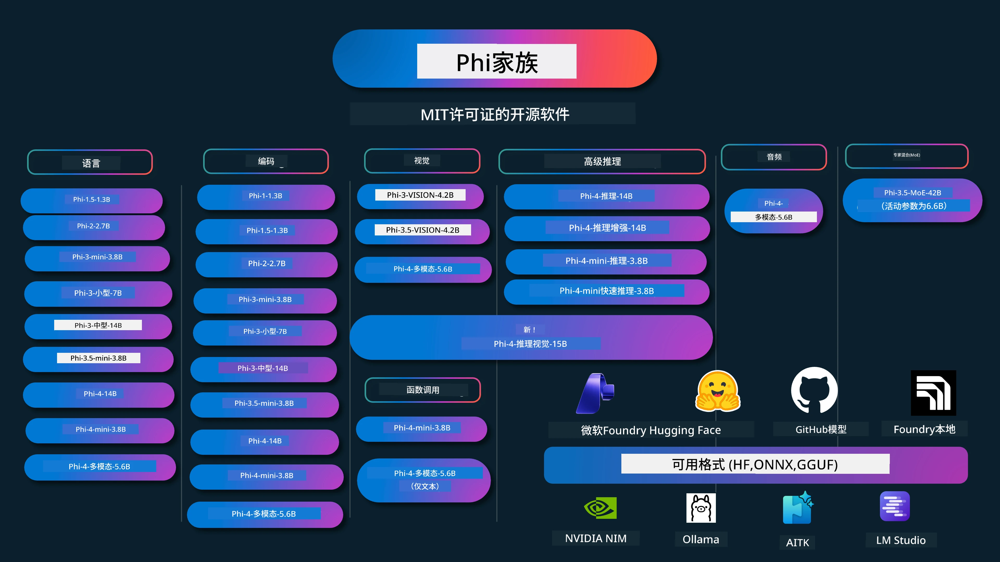

# Phi 烹饪书：微软 Phi 模型的动手示例

[](https://codespaces.new/microsoft/phicookbook)
[](https://vscode.dev/redirect?url=vscode://ms-vscode-remote.remote-containers/cloneInVolume?url=https://github.com/microsoft/phicookbook)

[](https://GitHub.com/microsoft/phicookbook/graphs/contributors/?WT.mc_id=aiml-137032-kinfeylo)
[](https://GitHub.com/microsoft/phicookbook/issues/?WT.mc_id=aiml-137032-kinfeylo)
[](https://GitHub.com/microsoft/phicookbook/pulls/?WT.mc_id=aiml-137032-kinfeylo)
[](http://makeapullrequest.com?WT.mc_id=aiml-137032-kinfeylo)

[](https://GitHub.com/microsoft/phicookbook/watchers/?WT.mc_id=aiml-137032-kinfeylo)
[](https://GitHub.com/microsoft/phicookbook/network/?WT.mc_id=aiml-137032-kinfeylo)
[](https://GitHub.com/microsoft/phicookbook/stargazers/?WT.mc_id=aiml-137032-kinfeylo)

[](https://discord.com/invite/ByRwuEEgH4)

Phi 是微软开发的一系列开源 AI 模型。

Phi 当前是最强大且性价比最高的小型语言模型（SLM），在多语言、推理、文本/聊天生成、编码、图像、音频和其他场景中拥有非常优秀的基准表现。

你可以将 Phi 部署到云端或边缘设备，并且可以轻松构建有限计算能力下的生成式 AI 应用。

按照以下步骤开始使用这些资源：
1. **Fork 仓库**：点击 [](https://GitHub.com/microsoft/phicookbook/network/?WT.mc_id=aiml-137032-kinfeylo)
2. <strong>克隆仓库</strong>：`git clone https://github.com/microsoft/PhiCookBook.git`
3. [**加入微软 AI Discord 社区，结识专家和同行开发者**](https://discord.com/invite/ByRwuEEgH4?WT.mc_id=aiml-137032-kinfeylo)



### 🌐 多语言支持

#### 通过 GitHub Action 支持（自动化且始终保持最新）

<!-- CO-OP TRANSLATOR LANGUAGES TABLE START -->
[阿拉伯语](../ar/README.md) | [孟加拉语](../bn/README.md) | [保加利亚语](../bg/README.md) | [缅甸语 (Myanmar)](../my/README.md) | [中文（简体）](./README.md) | [中文（繁体，香港）](../zh-HK/README.md) | [中文（繁体，澳门）](../zh-MO/README.md) | [中文（繁体，台湾）](../zh-TW/README.md) | [克罗地亚语](../hr/README.md) | [捷克语](../cs/README.md) | [丹麦语](../da/README.md) | [荷兰语](../nl/README.md) | [爱沙尼亚语](../et/README.md) | [芬兰语](../fi/README.md) | [法语](../fr/README.md) | [德语](../de/README.md) | [希腊语](../el/README.md) | [希伯来语](../he/README.md) | [印地语](../hi/README.md) | [匈牙利语](../hu/README.md) | [印尼语](../id/README.md) | [意大利语](../it/README.md) | [日语](../ja/README.md) | [卡纳达语](../kn/README.md) | [高棉语](../km/README.md) | [韩语](../ko/README.md) | [立陶宛语](../lt/README.md) | [马来语](../ms/README.md) | [马拉雅拉姆语](../ml/README.md) | [马拉地语](../mr/README.md) | [尼泊尔语](../ne/README.md) | [尼日利亚皮钦语](../pcm/README.md) | [挪威语](../no/README.md) | [波斯语 (法尔斯语)](../fa/README.md) | [波兰语](../pl/README.md) | [葡萄牙语（巴西）](../pt-BR/README.md) | [葡萄牙语（葡萄牙）](../pt-PT/README.md) | [旁遮普语（古鲁姆ukhi）](../pa/README.md) | [罗马尼亚语](../ro/README.md) | [俄语](../ru/README.md) | [塞尔维亚语（西里尔字母）](../sr/README.md) | [斯洛伐克语](../sk/README.md) | [斯洛文尼亚语](../sl/README.md) | [西班牙语](../es/README.md) | [斯瓦希里语](../sw/README.md) | [瑞典语](../sv/README.md) | [他加禄语（菲律宾语）](../tl/README.md) | [泰米尔语](../ta/README.md) | [泰卢固语](../te/README.md) | [泰语](../th/README.md) | [土耳其语](../tr/README.md) | [乌克兰语](../uk/README.md) | [乌尔都语](../ur/README.md) | [越南语](../vi/README.md)

> **更喜欢本地克隆？**
>
> 本仓库包含 50 多种语言的翻译，极大增加了下载大小。若想不含翻译内容克隆，请使用 sparse checkout：
>
> **Bash / macOS / Linux：**
> ```bash
> git clone --filter=blob:none --sparse https://github.com/microsoft/PhiCookBook.git
> cd PhiCookBook
> git sparse-checkout set --no-cone '/*' '!translations' '!translated_images'
> ```
>
> **CMD（Windows）：**
> ```cmd
> git clone --filter=blob:none --sparse https://github.com/microsoft/PhiCookBook.git
> cd PhiCookBook
> git sparse-checkout set --no-cone "/*" "!translations" "!translated_images"
> ```
>
> 这样你能获得完成课程所需的一切，同时大幅缩短下载时间。
<!-- CO-OP TRANSLATOR LANGUAGES TABLE END -->

## 目录

- 介绍
  - [欢迎加入 Phi 家族](./md/01.Introduction/01/01.PhiFamily.md)
  - [环境设置](./md/01.Introduction/01/01.EnvironmentSetup.md)
  - [关键技术理解](./md/01.Introduction/01/01.Understandingtech.md)
  - [Phi 模型的 AI 安全](./md/01.Introduction/01/01.AISafety.md)
  - [Phi 硬件支持](./md/01.Introduction/01/01.Hardwaresupport.md)
  - [Phi 模型与跨平台可用性](./md/01.Introduction/01/01.Edgeandcloud.md)
  - [使用 Guidance-ai 和 Phi](./md/01.Introduction/01/01.Guidance.md)
  - [GitHub 市场模型](https://github.com/marketplace/models)
  - [Azure AI 模型目录](https://ai.azure.com)

- 在不同环境推理 Phi
    -  [Hugging face](./md/01.Introduction/02/01.HF.md)
    -  [GitHub 模型](./md/01.Introduction/02/02.GitHubModel.md)
    -  [微软 Foundry 模型目录](./md/01.Introduction/02/03.AzureAIFoundry.md)
    -  [Ollama](./md/01.Introduction/02/04.Ollama.md)
    -  [AI Toolkit VSCode (AITK)](./md/01.Introduction/02/05.AITK.md)
    -  [NVIDIA NIM](./md/01.Introduction/02/06.NVIDIA.md)
    -  [Foundry 本地](./md/01.Introduction/02/07.FoundryLocal.md)

- 推理 Phi 家族
    - [iOS 上推理 Phi](./md/01.Introduction/03/iOS_Inference.md)
    - [Android 上推理 Phi](./md/01.Introduction/03/Android_Inference.md)
    - [Jetson 上推理 Phi](./md/01.Introduction/03/Jetson_Inference.md)
    - [AI PC 上推理 Phi](./md/01.Introduction/03/AIPC_Inference.md)
    - [使用 Apple MLX 框架推理 Phi](./md/01.Introduction/03/MLX_Inference.md)
    - [本地服务器推理 Phi](./md/01.Introduction/03/Local_Server_Inference.md)
    - [使用 AI Toolkit 远程服务器推理 Phi](./md/01.Introduction/03/Remote_Interence.md)
    - [使用 Rust 推理 Phi](./md/01.Introduction/03/Rust_Inference.md)
    - [本地推理 Phi--Vision](./md/01.Introduction/03/Vision_Inference.md)
    - [使用 Kaito AKS、Azure 容器（官方支持）推理 Phi](./md/01.Introduction/03/Kaito_Inference.md)
-  [Phi 家族量化](./md/01.Introduction/04/QuantifyingPhi.md)
    - [使用 llama.cpp 量化 Phi-3.5 / 4](./md/01.Introduction/04/UsingLlamacppQuantifyingPhi.md)
    - [使用 onnxruntime 的生成式 AI 扩展量化 Phi-3.5 / 4](./md/01.Introduction/04/UsingORTGenAIQuantifyingPhi.md)
    - [使用 Intel OpenVINO 量化 Phi-3.5 / 4](./md/01.Introduction/04/UsingIntelOpenVINOQuantifyingPhi.md)
    - [使用 Apple MLX 框架量化 Phi-3.5 / 4](./md/01.Introduction/04/UsingAppleMLXQuantifyingPhi.md)

- 评估 Phi
    - [负责任的 AI](./md/01.Introduction/05/ResponsibleAI.md)
    - [微软 Foundry 评估](./md/01.Introduction/05/AIFoundry.md)
    - [使用 Promptflow 进行评估](./md/01.Introduction/05/Promptflow.md)
 
- 结合 Azure AI 搜索的 RAG
    - [如何使用 Phi-4-mini 和 Phi-4-multimodal (RAG) 与 Azure AI 搜索](https://github.com/microsoft/PhiCookBook/blob/main/code/06.E2E/E2E_Phi-4-RAG-Azure-AI-Search.ipynb)
    - [使用 SQLite FTS5 和 phi-4-mini 的零云本地混合 RAG](https://github.com/microsoft/PhiCookBook/blob/main/code/06.E2E/E2E_Phi-4-mini_Local_Hybrid_RAG_SQLite_FTS5.ipynb)

- Phi 应用开发示例
  - 文本与聊天应用
    - Phi-4 示例
      - [📓] [与 Phi-4-mini ONNX 模型聊天](./md/02.Application/01.TextAndChat/Phi4/ChatWithPhi4ONNX/README.md)
      - [使用 Phi-4 本地 ONNX 模型的聊天 .NET](../../md/04.HOL/dotnet/src/LabsPhi4-Chat-01OnnxRuntime)
      - [使用 Sementic Kernel 的 Phi-4 ONNX 聊天 .NET 控制台应用](../../md/04.HOL/dotnet/src/LabsPhi4-Chat-02SK)

    - Phi-3 / 3.5 示例
      - [使用 Phi3、ONNX Runtime Web 和 WebGPU 在浏览器中本地聊天机器人](https://github.com/microsoft/onnxruntime-inference-examples/tree/main/js/chat)
      - [OpenVino 聊天](./md/02.Application/01.TextAndChat/Phi3/E2E_OpenVino_Chat.md)
      - [多模型 - 交互式 Phi-3-mini 和 OpenAI Whisper](./md/02.Application/01.TextAndChat/Phi3/E2E_Phi-3-mini_with_whisper.md)
      - [MLFlow - 构建包装器并使用 Phi-3 与 MLFlow](./md//02.Application/01.TextAndChat/Phi3/E2E_Phi-3-MLflow.md)
      - [模型优化 - 如何使用 Olive 优化 Phi-3-min 模型以用于 ONNX Runtime Web](https://github.com/microsoft/Olive/tree/main/examples/phi3)
      - [WinUI3 应用示例，内置 Phi-3 mini-4k-instruct-onnx](https://github.com/microsoft/Phi3-Chat-WinUI3-Sample/)
      -[WinUI3 多模型 AI 助力记事本应用示例](https://github.com/microsoft/ai-powered-notes-winui3-sample)
      - [微调并集成自定义 Phi-3 模型与 Prompt flow](./md/02.Application/01.TextAndChat/Phi3/E2E_Phi-3-FineTuning_PromptFlow_Integration.md)
      - [在 Microsoft Foundry 中使用 Prompt flow 微调并集成自定义 Phi-3 模型](./md/02.Application/01.TextAndChat/Phi3/E2E_Phi-3-FineTuning_PromptFlow_Integration_AIFoundry.md)
      - [在 Microsoft Foundry 中评估微调后的 Phi-3 / Phi-3.5 模型，重点关注微软的责任人工智能原则](./md/02.Application/01.TextAndChat/Phi3/E2E_Phi-3-Evaluation_AIFoundry.md)
      - [📓] [Phi-3.5-mini-instruct 语言预测示例（中英文）](./md/02.Application/01.TextAndChat/Phi3/phi3-instruct-demo.ipynb)
      - [Phi-3.5-Instruct WebGPU RAG 聊天机器人](./md/02.Application/01.TextAndChat/Phi3/WebGPUWithPhi35Readme.md)
      - [使用 Windows GPU 创建带有 Phi-3.5-Instruct ONNX 的 Prompt flow 解决方案](./md/02.Application/01.TextAndChat/Phi3/UsingPromptFlowWithONNX.md)
      - [使用微软 Phi-3.5 tflite 创建 Android 应用](./md/02.Application/01.TextAndChat/Phi3/UsingPhi35TFLiteCreateAndroidApp.md)
      - [使用 Microsoft.ML.OnnxRuntime 的本地 ONNX Phi-3 模型的问答 .NET 示例](../../md/04.HOL/dotnet/src/LabsPhi301)
      - [使用 Semantic Kernel 和 Phi-3 的控制台聊天 .NET 应用](../../md/04.HOL/dotnet/src/LabsPhi302)

  - Azure AI 推理 SDK 代码示例
    - Phi-4 示例
      - [📓] [使用 Phi-4-multimodal 生成项目代码](./md/02.Application/02.Code/Phi4/GenProjectCode/README.md)
    - Phi-3 / 3.5 示例
      - [使用微软 Phi-3 家族构建你自己的 Visual Studio Code GitHub Copilot 聊天](./md/02.Application/02.Code/Phi3/VSCodeExt/README.md)
      - [使用 GitHub 模型和 Phi-3.5 创建你自己的 Visual Studio Code 聊天 Copilot 代理](/md/02.Application/02.Code/Phi3/CreateVSCodeChatAgentWithGitHubModels.md)

  - 高级推理示例
    - Phi-4 示例
      - [📓] [Phi-4-mini-推理或 Phi-4-推理示例](./md/02.Application/03.AdvancedReasoning/Phi4/AdvancedResoningPhi4mini/README.md)
      - [📓] [用 Microsoft Olive 微调 Phi-4-mini-推理](./md/02.Application/03.AdvancedReasoning/Phi4/AdvancedResoningPhi4mini/olive_ft_phi_4_reasoning_with_medicaldata.ipynb)
      - [📓] [用 Apple MLX 微调 Phi-4-mini-推理](./md/02.Application/03.AdvancedReasoning/Phi4/AdvancedResoningPhi4mini/mlx_ft_phi_4_reasoning_with_medicaldata.ipynb)
      - [📓] [与 GitHub 模型的 Phi-4-mini-推理](./md/02.Application/02.Code/Phi4r/github_models_inference.ipynb)
      - [📓] [与 Microsoft Foundry 模型的 Phi-4-mini-推理](./md/02.Application/02.Code/Phi4r/azure_models_inference.ipynb)
  - 演示
      - [Phi-4-mini 演示，托管于 Hugging Face Spaces](https://huggingface.co/spaces/microsoft/phi-4-mini?WT.mc_id=aiml-137032-kinfeylo)
      - [Phi-4-multimodal 演示，托管于 Hugging Face Spaces](https://huggingface.co/spaces/microsoft/phi-4-multimodal?WT.mc_id=aiml-137032-kinfeylo)
  - 视觉示例
    - Phi-4 示例
      - [📓] [使用 Phi-4-multimodal 读取图像并生成代码](./md/02.Application/04.Vision/Phi4/CreateFrontend/README.md)
    - Phi-3 / 3.5 示例
      -  [📓][Phi-3-vision-图像文本转换](./md/02.Application/04.Vision/Phi3/E2E_Phi-3-vision-image-text-to-text-online-endpoint.ipynb)
      - [Phi-3-vision-ONNX](https://onnxruntime.ai/docs/genai/tutorials/phi3-v.html)
      - [📓][Phi-3-vision CLIP 嵌入](./md/02.Application/04.Vision/Phi3/E2E_Phi-3-vision-image-text-to-text-online-endpoint.ipynb)
      - [DEMO: Phi-3 回收](https://github.com/jennifermarsman/PhiRecycling/)
      - [Phi-3-vision - 视觉语言助手 - 结合 Phi3-Vision 和 OpenVINO](https://docs.openvino.ai/nightly/notebooks/phi-3-vision-with-output.html)
      - [Phi-3 Vision Nvidia NIM](./md/02.Application/04.Vision/Phi3/E2E_Nvidia_NIM_Vision.md)
      - [Phi-3 Vision OpenVino](./md/02.Application/04.Vision/Phi3/E2E_OpenVino_Phi3Vision.md)
      - [📓][Phi-3.5 视觉多帧或多图像示例](./md/02.Application/04.Vision/Phi3/phi3-vision-demo.ipynb)
      - [使用 Microsoft.ML.OnnxRuntime .NET 的 Phi-3 视觉本地 ONNX 模型](../../md/04.HOL/dotnet/src/LabsPhi303)
      - [基于菜单的使用 Microsoft.ML.OnnxRuntime .NET 的 Phi-3 视觉本地 ONNX 模型](../../md/04.HOL/dotnet/src/LabsPhi304)

  - 推理-视觉示例
    - Phi-4-Reasoning-Vision-15B
      - [📓] [使用 Phi-4-Reasoning-Vision-15B 检测乱穿马路](./md/02.Application/10.ReasoningVision/Phi_4_reasoning_vision_15b_Jaywalking.ipynb)
      - [📓] [使用 Phi-4-Reasoning-Vision-15B 进行数学运算](./md/02.Application/10.ReasoningVision/Phi_4_reasoning_vision_15b_Math.ipynb)
      - [📓] [使用 Phi-4-Reasoning-Vision-15B 进行 UI 检测](./md/02.Application/10.ReasoningVision/Phi_4_reasoning_vision_15b_ui.ipynb)

  - 数学示例
    -  Phi-4-Mini-Flash-Reasoning-Instruct 示例  [使用 Phi-4-Mini-Flash-Reasoning-Instruct 的数学演示](./md/02.Application/09.Math/MathDemo.ipynb)

  - 音频示例
    - Phi-4 示例
      - [📓] [使用 Phi-4-multimodal 提取音频转录文本](./md/02.Application/05.Audio/Phi4/Transciption/README.md)
      - [📓] [Phi-4-multimodal 音频示例](./md/02.Application/05.Audio/Phi4/Siri/demo.ipynb)
      - [📓] [Phi-4-multimodal 语音翻译示例](./md/02.Application/05.Audio/Phi4/Translate/demo.ipynb)
      - [.NET 控制台应用，使用 Phi-4-multimodal 分析音频文件并生成转录文本](../../md/04.HOL/dotnet/src/LabsPhi4-MultiModal-02Audio)

  - MOE 示例
    - Phi-3 / 3.5 示例
      - [📓] [Phi-3.5 专家混合模型 (MoEs) 社交媒体示例](./md/02.Application/06.MoE/Phi3/phi3_moe_demo.ipynb)
      - [📓] [使用 NVIDIA NIM Phi-3 MOE、Azure AI 搜索和 LlamaIndex 构建检索增强生成（RAG）流水线](./md/02.Application/06.MoE/Phi3/azure-ai-search-nvidia-rag.ipynb)
      - 
  - 函数调用示例
    - Phi-4 示例 🆕
      -  [📓] [使用 Phi-4-mini 的函数调用](./md/02.Application/07.FunctionCalling/Phi4/FunctionCallingBasic/README.md)
      -  [📓] [使用 Phi-4-mini 的函数调用创建多代理](./md/02.Application/07.FunctionCalling/Phi4/Multiagents/Phi_4_mini_multiagent.ipynb)
      -  [📓] [使用函数调用和 Ollama](./md/02.Application/07.FunctionCalling/Phi4/Ollama/ollama_functioncalling.ipynb)
      -  [📓] [使用函数调用和 ONNX](./md/02.Application/07.FunctionCalling/Phi4/ONNX/onnx_parallel_functioncalling.ipynb)
  - 多模态混合示例
    - Phi-4 示例 🆕
      -  [📓] [使用 Phi-4-multimodal 作为科技记者](./md/02.Application/08.Multimodel/Phi4/TechJournalist/phi_4_mm_audio_text_publish_news.ipynb)
      - [.NET 控制台应用，使用 Phi-4-multimodal 分析图像](../../md/04.HOL/dotnet/src/LabsPhi4-MultiModal-01Images)

- Phi 微调示例
  - [微调场景](./md/03.FineTuning/FineTuning_Scenarios.md)
  - [微调与 RAG](./md/03.FineTuning/FineTuning_vs_RAG.md)
  - [微调 Phi-3 使其成为行业专家](./md/03.FineTuning/LetPhi3gotoIndustriy.md)
  - [使用 AI Toolkit for VS Code 对 Phi-3 进行微调](./md/03.FineTuning/Finetuning_VSCodeaitoolkit.md)
  - [使用 Azure 机器学习服务对 Phi-3 进行微调](./md/03.FineTuning/Introduce_AzureML.md)
  - [使用 Lora 对 Phi-3 进行微调](./md/03.FineTuning/FineTuning_Lora.md)
  - [使用 QLora 对 Phi-3 进行微调](./md/03.FineTuning/FineTuning_Qlora.md)
  - [使用 Microsoft Foundry 对 Phi-3 进行微调](./md/03.FineTuning/FineTuning_AIFoundry.md)
  - [使用 Azure ML CLI/SDK 对 Phi-3 进行微调](./md/03.FineTuning/FineTuning_MLSDK.md)
  - [使用 Microsoft Olive 进行微调](./md/03.FineTuning/FineTuning_MicrosoftOlive.md)
  - [Microsoft Olive 实践训练营](./md/03.FineTuning/olive-lab/readme.md)
  - [使用 Weights and Bias 微调 Phi-3-vision](./md/03.FineTuning/FineTuning_Phi-3-visionWandB.md)

  - [使用 Apple MLX 框架微调 Phi-3](./md/03.FineTuning/FineTuning_MLX.md)
  - [微调 Phi-3-vision（官方支持）](./md/03.FineTuning/FineTuning_Vision.md)
  - [使用 Kaito AKS 和 Azure 容器微调 Phi-3（官方支持）](./md/03.FineTuning/FineTuning_Kaito.md)
  - [微调 Phi-3 和 3.5 Vision](https://github.com/2U1/Phi3-Vision-Finetune)

- 实操实验室
  - [探索前沿模型：LLMs、SLMs、本地开发等](https://github.com/microsoft/aitour-exploring-cutting-edge-models)
  - [释放 NLP 潜力：使用 Microsoft Olive 微调](https://github.com/azure/Ignite_FineTuning_workshop)

- 学术研究论文和出版物
  - [教材就是全部你所需 II: phi-1.5 技术报告](https://arxiv.org/abs/2309.05463)
  - [Phi-3 技术报告：在您的手机上运行的高能力语言模型](https://arxiv.org/abs/2404.14219)
  - [Phi-4 技术报告](https://arxiv.org/abs/2412.08905)
  - [Phi-4-Mini 技术报告：通过 LoRA 混合实现紧凑而强大的多模态语言模型](https://arxiv.org/abs/2503.01743)
  - [优化用于车内功能调用的小型语言模型](https://arxiv.org/abs/2501.02342)
  - [(WhyPHI) 微调 PHI-3 进行多项选择题问答：方法论、结果和挑战](https://arxiv.org/abs/2501.01588)
  - [Phi-4 推理技术报告](https://www.microsoft.com/en-us/research/wp-content/uploads/2025/04/phi_4_reasoning.pdf)
  - [Phi-4-mini 推理技术报告](https://huggingface.co/microsoft/Phi-4-mini-reasoning/blob/main/Phi-4-Mini-Reasoning.pdf)

## 使用 Phi 模型

### Microsoft Foundry 上的 Phi

您可以学习如何使用 Microsoft Phi 以及如何在不同硬件设备上构建端到端解决方案。想要亲自体验 Phi，可以从玩转模型和针对您的场景定制 Phi 开始，使用 [Microsoft Foundry Azure AI Model Catalog](https://aka.ms/phi3-azure-ai) 。您可以在[Microsoft Foundry 入门指南](/md/02.QuickStart/AzureAIFoundry_QuickStart.md)了解更多信息。

<strong>游乐场</strong>
每个模型都有专门的游乐场供您测试模型，访问 [Azure AI Playground](https://aka.ms/try-phi3)。

### GitHub 上的 Phi 模型

您可以学习如何使用 Microsoft Phi 以及如何在不同硬件设备上构建端到端解决方案。想要亲自体验 Phi，可以从玩转模型和针对您的场景定制 Phi 开始，使用 [GitHub Model Catalog](https://github.com/marketplace/models?WT.mc_id=aiml-137032-kinfeylo) 。您可以在[GitHub Model Catalog 入门指南](/md/02.QuickStart/GitHubModel_QuickStart.md)了解更多。

<strong>游乐场</strong>
每个模型都有专门的[游乐场供测试模型](/md/02.QuickStart/GitHubModel_QuickStart.md)。

### Hugging Face 上的 Phi

您还可以在 [Hugging Face](https://huggingface.co/microsoft) 上找到该模型。

<strong>游乐场</strong>
 [Hugging Chat 游乐场](https://huggingface.co/chat/models/microsoft/Phi-3-mini-4k-instruct)

 ## 🎒 其他课程

我们团队还制作了其他课程！请查看：

<!-- CO-OP TRANSLATOR OTHER COURSES START -->
### LangChain
[](https://aka.ms/langchain4j-for-beginners)
[](https://aka.ms/langchainjs-for-beginners?WT.mc_id=m365-94501-dwahlin)
[](https://github.com/microsoft/langchain-for-beginners?WT.mc_id=m365-94501-dwahlin)
---

### Azure / Edge / MCP / Agents
[](https://github.com/microsoft/AZD-for-beginners?WT.mc_id=academic-105485-koreyst)
[](https://github.com/microsoft/edgeai-for-beginners?WT.mc_id=academic-105485-koreyst)
[](https://github.com/microsoft/mcp-for-beginners?WT.mc_id=academic-105485-koreyst)
[](https://github.com/microsoft/ai-agents-for-beginners?WT.mc_id=academic-105485-koreyst)

---
 
### 生成式 AI 系列
[](https://github.com/microsoft/generative-ai-for-beginners?WT.mc_id=academic-105485-koreyst)
[-9333EA?style=for-the-badge&labelColor=E5E7EB&color=9333EA)](https://github.com/microsoft/Generative-AI-for-beginners-dotnet?WT.mc_id=academic-105485-koreyst)
[-C084FC?style=for-the-badge&labelColor=E5E7EB&color=C084FC)](https://github.com/microsoft/generative-ai-for-beginners-java?WT.mc_id=academic-105485-koreyst)
[-E879F9?style=for-the-badge&labelColor=E5E7EB&color=E879F9)](https://github.com/microsoft/generative-ai-with-javascript?WT.mc_id=academic-105485-koreyst)

---
 
### 核心学习
[](https://aka.ms/ml-beginners?WT.mc_id=academic-105485-koreyst)
[](https://aka.ms/datascience-beginners?WT.mc_id=academic-105485-koreyst)
[](https://aka.ms/ai-beginners?WT.mc_id=academic-105485-koreyst)
[](https://github.com/microsoft/Security-101?WT.mc_id=academic-96948-sayoung)
[](https://aka.ms/webdev-beginners?WT.mc_id=academic-105485-koreyst)
[](https://aka.ms/iot-beginners?WT.mc_id=academic-105485-koreyst)
[](https://github.com/microsoft/xr-development-for-beginners?WT.mc_id=academic-105485-koreyst)

---
 
### Copilot 系列
[](https://aka.ms/GitHubCopilotAI?WT.mc_id=academic-105485-koreyst)
[](https://github.com/microsoft/mastering-github-copilot-for-dotnet-csharp-developers?WT.mc_id=academic-105485-koreyst)
[](https://github.com/microsoft/CopilotAdventures?WT.mc_id=academic-105485-koreyst)
<!-- CO-OP TRANSLATOR OTHER COURSES END -->

## 负责任的 AI

微软致力于帮助我们的客户负责任地使用我们的 AI 产品，分享我们的经验，并通过透明度说明和影响评估等工具建立基于信任的合作伙伴关系。许多资源可以在[https://aka.ms/RAI](https://aka.ms/RAI)找到。
微软的负责任 AI 方法基于我们的 AI 原则，包括公平性、可靠性和安全性、隐私和安全性、包容性、透明度和问责制。

大规模自然语言、图像和语音模型——如本示例中使用的模型——可能会表现出不公平、不可靠或冒犯性的行为，从而导致伤害。请参阅[Azure OpenAI 服务透明度说明](https://learn.microsoft.com/legal/cognitive-services/openai/transparency-note?tabs=text)以了解风险和限制。


减轻这些风险的推荐方法是在您的架构中包含一个安全系统，该系统能够检测并阻止有害行为。[Azure AI 内容安全](https://learn.microsoft.com/azure/ai-services/content-safety/overview) 提供了一个独立的保护层，能够检测应用和服务中由用户生成和 AI 生成的有害内容。Azure AI 内容安全包含文本和图像 API，允许您检测有害材料。在 Microsoft Foundry 中，内容安全服务允许您查看、探索并试用不同模态下检测有害内容的示例代码。以下[快速入门文档](https://learn.microsoft.com/azure/ai-services/content-safety/quickstart-text?tabs=visual-studio%2Clinux&pivots=programming-language-rest) 将指导您如何向该服务发起请求。

另一个需要考虑的方面是整体应用性能。对于多模态和多模型应用，我们认为性能意味着系统按您和用户的预期运行，包括不会生成有害的输出。评估整体应用性能时，使用[性能与质量及风险和安全评估器](https://learn.microsoft.com/azure/ai-studio/concepts/evaluation-metrics-built-in) 非常重要。您还可以创建和评估[自定义评估器](https://learn.microsoft.com/azure/ai-studio/how-to/develop/evaluate-sdk#custom-evaluators)。

您可以使用[Azure AI 评估 SDK](https://microsoft.github.io/promptflow/index.html)在开发环境中评估您的 AI 应用。无论是给定测试数据集还是目标，您的生成式 AI 应用生成内容都可以通过内置评估器或您选择的自定义评估器进行定量测量。要开始使用 azure ai 评估 sdk 评估您的系统，您可以参考[快速入门指南](https://learn.microsoft.com/azure/ai-studio/how-to/develop/flow-evaluate-sdk)。执行评估运行后，您可以在[Microsoft Foundry 中可视化结果](https://learn.microsoft.com/azure/ai-studio/how-to/evaluate-flow-results)。

## 商标

本项目可能包含项目、产品或服务的商标或徽标。微软商标或徽标的授权使用须遵守并遵循[微软商标与品牌指南](https://www.microsoft.com/legal/intellectualproperty/trademarks/usage/general)。
修改版本中使用微软商标或徽标不得引起混淆或暗示微软的赞助。对第三方商标或徽标的任何使用均须遵守相应第三方的政策。

## 获取帮助

如果您遇到困难或对构建 AI 应用有任何疑问，请加入：

[](https://aka.ms/foundry/discord)

如果您在构建过程中有产品反馈或错误，欢迎访问：

[](https://aka.ms/foundry/forum)

---

<!-- CO-OP TRANSLATOR DISCLAIMER START -->
**免责声明**：
本文件由 AI 翻译服务 [Co-op Translator](https://github.com/Azure/co-op-translator) 翻译完成。尽管我们力求准确，但请注意，自动翻译可能包含错误或不准确之处。原始语言版文件应视为权威来源。对于重要信息，建议使用专业人工翻译。我们对因使用本翻译而产生的任何误解或误释不承担责任。
<!-- CO-OP TRANSLATOR DISCLAIMER END -->