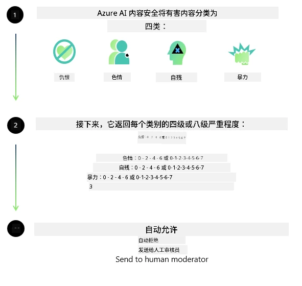

# Phi 模型的人工智能安全
Phi 系列模型的开发遵循了[微软负责任人工智能标准](https://www.microsoft.com/ai/principles-and-approach#responsible-ai-standard)，这是基于以下六大原则的公司范围内要求：问责制、透明性、公平性、可靠性与安全性、隐私与安全以及包容性，这些构成了[微软的负责任人工智能原则](https://www.microsoft.com/ai/responsible-ai)。

与之前的 Phi 模型一样，采用了多方面的安全评估和安全后训练方法，并针对本次发布的多语言能力采取了额外措施。我们关于安全训练和评估的方法，包括跨多语言和风险类别的测试，详见[Phi 安全后训练论文](https://arxiv.org/abs/2407.13833)。尽管 Phi 模型受益于该方法，开发者应采用负责任的人工智能最佳实践，包括映射、衡量并减轻与其具体用例及文化和语言环境相关的风险。

## 最佳实践

与其他模型一样，Phi 系列模型可能表现出不公平、不可靠或冒犯性的行为。

需要注意的一些 SLM 和 LLM 的限制行为包括：

- **服务质量：** Phi 模型主要以英文文本训练。非英文语言的性能会较差。训练数据中代表性较少的英文变体的性能可能比标准美式英语更差。
- **伤害的表现与刻板印象的延续：** 这些模型可能对某些群体表现过度或不足，抹除某些群体的表现，或强化贬损性或负面刻板印象。尽管进行了安全后训练，这些限制仍可能存在，原因包括不同群体代表性的差异，或者训练数据中反映现实模式和社会偏见的负面刻板印象示例的普遍性。
- **不当或冒犯性内容：** 这些模型可能产生其他类型的不当或冒犯性内容，这可能使其在敏感环境下的部署不当，除非针对具体用例采取额外缓解措施。
- **信息可靠性：** 语言模型可能生成无意义内容或捏造听起来合理但实际上不准确或过时的内容。
- **代码范围有限：** Phi-3 大部分训练数据基于 Python，使用常见包如 "typing, math, random, collections, datetime, itertools"。如果模型生成利用其他包或其他语言脚本的 Python 脚本，我们强烈建议用户手动验证所有 API 用法。

开发者应采纳负责任的人工智能最佳实践，并负责确保具体用例符合相关法律法规（如隐私、贸易等）。

## 负责任的人工智能考量

与其他语言模型一样，Phi 系列模型可能表现出不公平、不可靠或冒犯性的行为。需要注意的一些限制行为包括：

**服务质量：** Phi 模型主要以英文文本训练。非英文语言的性能会较差。训练数据中代表性较少的英文变体的性能可能比标准美式英语更差。

**伤害的表现与刻板印象的延续：** 这些模型可能对某些群体表现过度或不足，抹除某些群体的表现，或强化贬损性或负面刻板印象。尽管进行了安全后训练，这些限制仍可能存在，原因包括不同群体代表性的差异，或者训练数据中反映现实模式和社会偏见的负面刻板印象示例的普遍性。

**不当或冒犯性内容：** 这些模型可能产生其他类型的不当或冒犯性内容，这可能使其在敏感环境下的部署不当，除非针对具体用例采取额外缓解措施。
信息可靠性：语言模型可能生成无意义内容或捏造听起来合理但实际上不准确或过时的内容。

**代码范围有限：** Phi-3 大部分训练数据基于 Python，使用常见包如 "typing, math, random, collections, datetime, itertools"。如果模型生成利用其他包或其他语言脚本的 Python 脚本，我们强烈建议用户手动验证所有 API 用法。

开发者应采纳负责任的人工智能最佳实践，并负责确保具体用例符合相关法律法规（如隐私、贸易等）。重要考量领域包括：

**分配：** 模型可能不适合用于对法律身份或资源、人生命运机会的分配（例如住房、就业、信用等）可能产生重大影响的场景，除非经过进一步评估和额外的去偏见技术处理。

**高风险场景：** 开发者应评估在高风险场景中使用模型的适用性，这类场景中不公平、不可靠或冒犯性的输出可能带来极高成本或造成伤害。包括在敏感或专业领域提供建议时，准确性和可靠性极为重要（例如法律或健康建议）。应根据部署环境在应用层面实施额外保护措施。

**错误信息：** 模型可能产生不准确信息。开发者应遵循透明度最佳实践，告知最终用户他们正在与 AI 系统交互。在应用层面，开发者可以构建反馈机制和流程，将响应与具体用例的上下文信息绑定，这种技术称为检索增强生成（RAG）。

**有害内容生成：** 开发者应根据上下文评估输出，使用可用的安全分类器或适合其用例的自定义解决方案。

**滥用：** 其他滥用形式如欺诈、垃圾信息或恶意软件生成均可能发生，开发者应确保其应用不违反适用法律法规。

### 微调与 AI 内容安全

微调模型后，我们强烈建议利用[Azure AI 内容安全](https://learn.microsoft.com/azure/ai-services/content-safety/overview)措施监控模型生成的内容，识别并阻止潜在风险、威胁和质量问题。

[Azure AI 内容安全](https://learn.microsoft.com/azure/ai-services/content-safety/overview)支持文本和图像内容。它可以部署在云端、离线容器以及边缘/嵌入式设备上。

## Azure AI 内容安全概览

Azure AI 内容安全并非通用解决方案；它可以定制以符合企业的具体政策。此外，其多语言模型能同时理解多种语言。

- **Azure AI 内容安全**
- **微软开发者**
- **5 个视频**

Azure AI 内容安全服务检测应用和服务中的有害用户生成和 AI 生成内容。它包括文本和图像 API，允许你检测有害或不恰当的材料。

[AI 内容安全播放列表](https://www.youtube.com/playlist?list=PLlrxD0HtieHjaQ9bJjyp1T7FeCbmVcPkQ)

---

<!-- CO-OP TRANSLATOR DISCLAIMER START -->
**免责声明**：
本文件使用 AI 翻译服务 [Co-op Translator](https://github.com/Azure/co-op-translator) 进行翻译。尽管我们力求准确，但请注意，自动翻译可能存在错误或不准确之处。原始文档的原语言版本应被视为权威来源。对于重要信息，建议使用专业人工翻译。我们不对因使用本翻译内容而产生的任何误解或误释承担责任。
<!-- CO-OP TRANSLATOR DISCLAIMER END -->