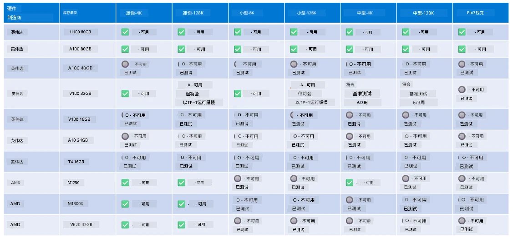

# Phi 硬件支持

Microsoft Phi 已针对 ONNX Runtime 进行了优化，并支持 Windows DirectML。它在各种硬件类型上表现良好，包括 GPU、CPU，甚至移动设备。

## 设备硬件  
具体支持的硬件包括：

- GPU SKU：RTX 4090（DirectML）
- GPU SKU：1 个 A100 80GB（CUDA）
- CPU SKU：标准 F64s v2（64 vCPU，128 GiB 内存）

## 移动 SKU

- Android - Samsung Galaxy S21
- Apple iPhone 14 或更高版本 A16/A17 处理器

## Phi 硬件规格

- 最低配置要求。
- Windows：支持 DirectX 12 的 GPU 和至少 4GB 的合并内存

CUDA：计算能力 >= 7.02 的 NVIDIA GPU



## 在多个 GPU 上运行 onnxruntime

目前可用的 Phi ONNX 模型仅支持 1 个 GPU。Phi 模型可能支持多 GPU，但带有 2 个 GPU 的 ORT 并不保证它比 2 个 ORT 实例拥有更高的吞吐量。有关最新更新，请参阅 [ONNX Runtime](https://onnxruntime.ai/)。

在 [Build 2024 the GenAI ONNX Team](https://youtu.be/WLW4SE8M9i8?si=EtG04UwDvcjunyfC) 宣布，他们已为 Phi 模型启用了多实例，而非多 GPU。

目前，这允许你通过设置 CUDA_VISIBLE_DEVICES 环境变量来运行一个 onnxruntime 或 onnxruntime-genai 实例，示例如下。

```Python
CUDA_VISIBLE_DEVICES=0 python infer.py
CUDA_VISIBLE_DEVICES=1 python infer.py
```

欢迎随时在 [Microsoft Foundry](https://ai.azure.com) 中进一步探索 Phi。

---

<!-- CO-OP TRANSLATOR DISCLAIMER START -->
**免责声明**：  
本文档通过 AI 翻译服务 [Co-op Translator](https://github.com/Azure/co-op-translator) 翻译完成。尽管我们力求准确，但请注意自动翻译可能包含错误或不准确之处。原文档的原始语言版本应被视为权威来源。对于重要信息，建议使用专业人工翻译。因使用此翻译而产生的任何误解或错误解释，我们不承担任何责任。
<!-- CO-OP TRANSLATOR DISCLAIMER END -->