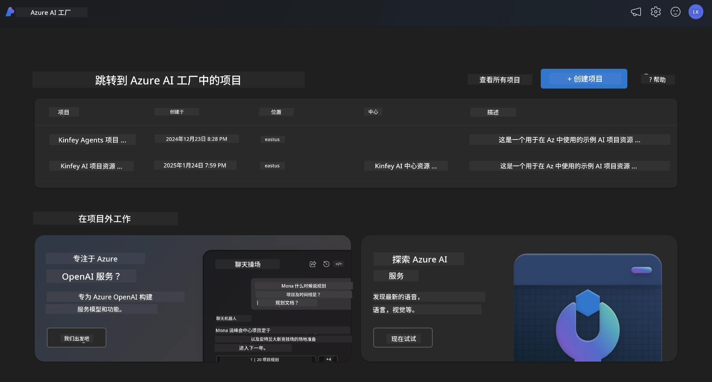
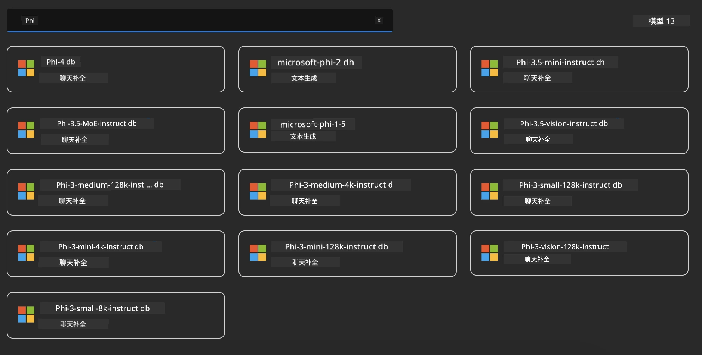
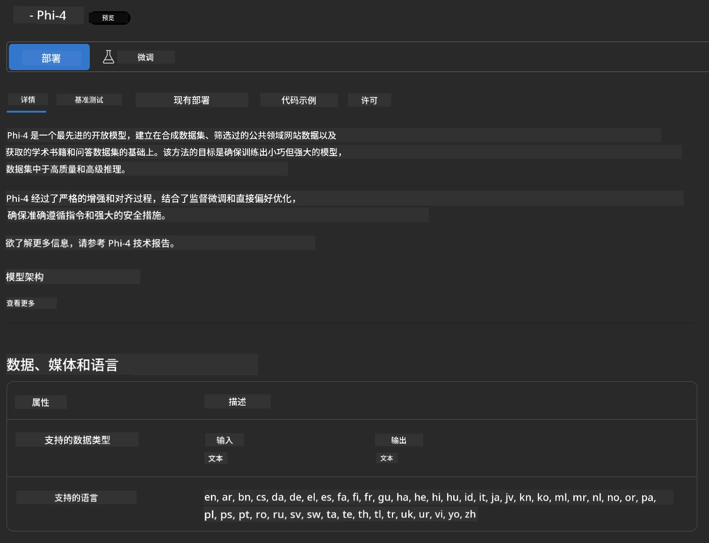
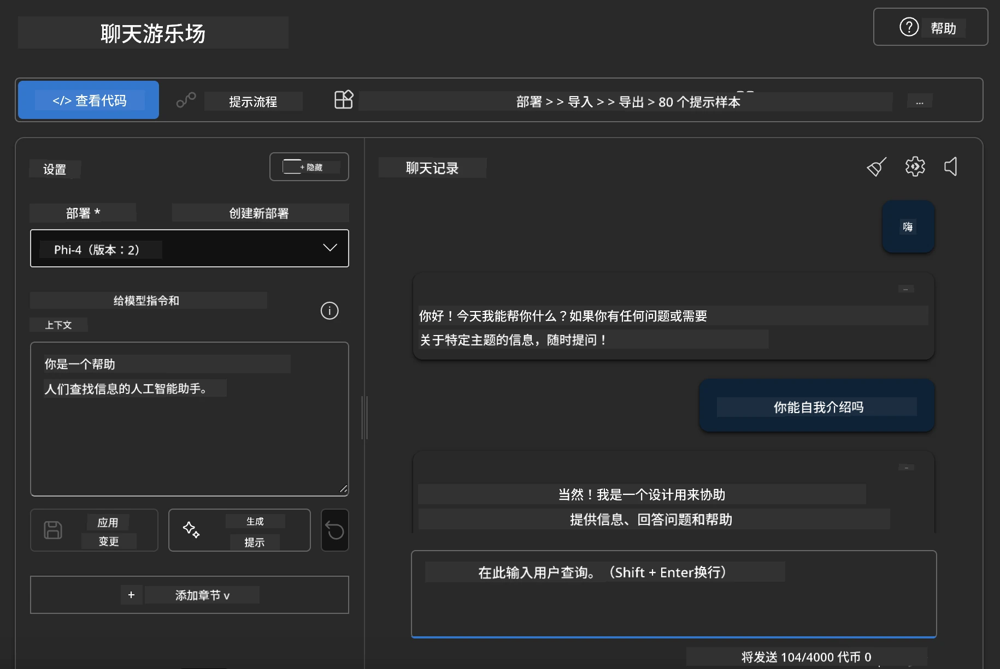

## Microsoft Foundry 中的 Phi 家族

[Microsoft Foundry](https://ai.azure.com) 是一个值得信赖的平台，使开发人员能够以安全、可靠和负责任的方式推动创新并塑造未来的 AI。

[Microsoft Foundry](https://ai.azure.com) 旨在为开发人员提供：

- 在企业级平台上构建生成式 AI 应用。
- 使用先进的 AI 工具和机器学习模型进行探索、构建、测试和部署，基于负责任的 AI 实践。
- 与团队协作，实现应用开发的全生命周期。

通过 Microsoft Foundry，您可以探索各种模型、服务和功能，构建最符合您目标的 AI 应用。Microsoft Foundry 平台支持可扩展性，轻松将概念验证转变为成熟的生产级应用。持续的监控和优化支持长期成功。



除了在 Microsoft Foundry 中使用 Azure AOAI 服务外，您还可以在 Microsoft Foundry 模型目录中使用第三方模型。如果您想将 Microsoft Foundry 作为您的 AI 解决方案平台，这是一个不错的选择。

我们可以通过 Microsoft Foundry 中的模型目录快速部署 Phi 家族模型

[Microsoft Foundry 模型中的 Microsoft Phi 模型](https://ai.azure.com/explore/models/?selectedCollection=phi)



### **在 Microsoft Foundry 中部署 Phi-4**



### **在 Microsoft Foundry Playground 中测试 Phi-4**



### **运行 Python 代码调用 Microsoft Foundry Phi-4**

```python

import os  
import base64
from openai import AzureOpenAI  
from azure.identity import DefaultAzureCredential, get_bearer_token_provider  
        
endpoint = os.getenv("ENDPOINT_URL", "Your Azure AOAI Service Endpoint")  
deployment = os.getenv("DEPLOYMENT_NAME", "Phi-4")  
      
token_provider = get_bearer_token_provider(  
    DefaultAzureCredential(),  
    "https://cognitiveservices.azure.com/.default"  
)  
  
client = AzureOpenAI(  
    azure_endpoint=endpoint,  
    azure_ad_token_provider=token_provider,  
    api_version="2024-05-01-preview",  
)  
  

chat_prompt = [
    {
        "role": "system",
        "content": "You are an AI assistant that helps people find information."
    },
    {
        "role": "user",
        "content": "can you introduce yourself"
    }
] 
    
# 如果启用了语音，则包括语音结果
messages = chat_prompt 

completion = client.chat.completions.create(  
    model=deployment,  
    messages=messages,
    max_tokens=800,  
    temperature=0.7,  
    top_p=0.95,  
    frequency_penalty=0,  
    presence_penalty=0,
    stop=None,  
    stream=False  
)  
  
print(completion.to_json())  

```

---

<!-- CO-OP TRANSLATOR DISCLAIMER START -->
**免责声明**：  
本文件使用 AI 翻译服务 [Co-op Translator](https://github.com/Azure/co-op-translator) 进行翻译。虽然我们力求准确，但请注意自动翻译可能包含错误或不准确之处。原始语言的原文应被视为权威来源。对于重要信息，建议使用专业人工翻译。因使用本翻译内容而产生的任何误解或误释，我们概不负责。
<!-- CO-OP TRANSLATOR DISCLAIMER END -->